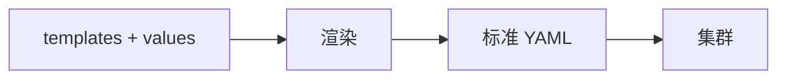
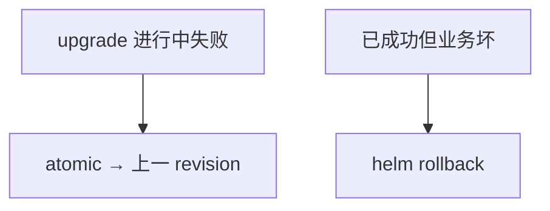
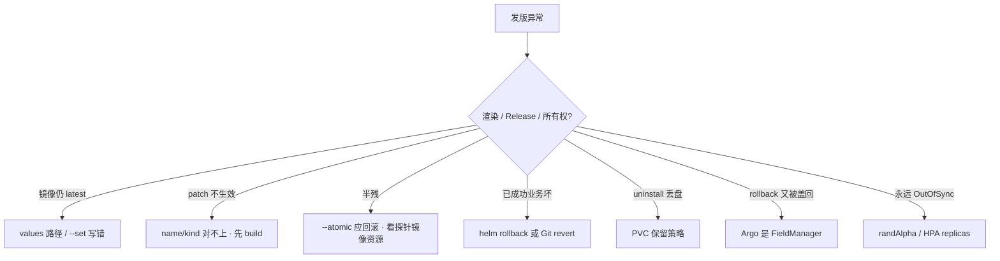

# 22｜Helm 与 Kustomize · 练习题

开始做题前：合上知识点，对着**本章主线**口述一遍——都变 YAML → release 历史 → 密钥不进 Git。讲得出来再做题。

每道题先看场景自己答，再对完整解答。

题目顺序：Q1～Q4 钉概念与选型；Q5～Q10 操作踩坑；Q11～Q14 定责。

| 标记 | 含义 |
|------|------|
| **核心** | 不懂整章就没建立起来 |
| **必会** | 值班和面试都要能讲 |
| **常用** | 线上会反复碰到 |
| **常考** | 白板和追问的高频口径 |

## 本题目录

- [Q1 Helm 是什么](#q1)
- [Q2 多环境与 Secret](#q2)
- [Q3 atomic vs rollback](#q3)
- [Q4 Helm vs Kustomize](#q4)
- [Q5 upgrade --install](#q5)
- [Q6 hook / 合服](#q6)
- [Q7 所有权怎么分工](#q7)
- [Q8 uninstall 丢盘](#q8)
- [Q9 generator 与 6902](#q9)
- [Q10 Chart 版本号与 randAlpha](#q10)
- [Q11 排障决策树](#q11)
- [Q12 values 与密钥纪律](#q12)
- [Q13 Chart 依赖与版本](#q13)
- [Q14 60 秒 Helm 定责](#q14)
- [合上书](#合上书)

---

## Q1

**★★★★★｜Helm 是什么？渲染出来的还是标准资源吗？**

**覆盖**：核心 · 必会 · 常考
**对应**：知识点 [3.1 Chart 与渲染](知识点.md)


### 场景

「你们 YAML 怎么管？」有人说 Helm 是一种新的工作负载类型。

先自己试试：不看下面，先口述一遍你的答案，再往下对。

### 完整解答

> 🎯 **一句话**：Helm 是包管理+模板引擎，渲染成标准 Deployment/Service，不发明新 kind。

Helm 是包管理器 + 模板引擎。Chart = 模板 + 默认 values，按环境参数渲染成 Deployment/Service 再 apply。不发明新 kind。和手写 YAML 比：参数化复用、release 历史、子 Chart 依赖。



Release = 一次安装实例，可多份、可 rollback。Kustomize 同样输出标准 YAML，只是没有这份集群内历史。

### 再追问

CRD 是不是 Helm 发明的？——不是。Chart 可以带 CRD 文件，kind 仍由 API / Operator 定义（20）。Helm 只负责提交那份 YAML。

---

## Q2

**★★★★★｜多环境怎么管？生产 Secret 能写进 values-prod.yaml 吗？**

**覆盖**：核心 · 必会 · 常考
**对应**：知识点 [7. 生产排障](知识点.md)


### 场景

同一套网关 Chart，测试 3 副本、生产 10 副本。有人把数据库密码写进 `values-prod.yaml` 提交了。

先自己试试：不看下面，先口述一遍你的答案，再往下对。

### 完整解答

> 🎯 **一句话**：多环境一套 Chart 多份 values；生产 Secret 不进 Git，用 external-secrets/Vault 注入。

一套 Chart，values.yaml 默认，values-prod / staging 覆盖。`helm upgrade -f values-prod.yaml --set image.tag=1.2.0`。密码不进 Git：values 只引 Secret 名；内容用 external-secrets / sealed-secrets / CI 从 Vault 注入。

三个环境 values 各改各的会漂移：共享一份基础，环境文件只放差异。差异过大拆 Chart 或改成 overlay。

### 再追问

Pod 起不来，Events 写 secret 不存在？——不要把密码填回 values。先看 ExternalSecret status，同步 Operator 还没拉下来。

---

## Q3

**★★★★★｜`--atomic` 和手动 `helm rollback` 差在哪？**

**覆盖**：核心 · 必会 · 常用
**对应**：知识点 [3.2 Release：升级、回滚、原子性](知识点.md)


### 场景

CI 升级超时，集群里一半新 Pod 没 Ready。另一天升级「成功了」但支付 5xx，要退回。Argo 也在管这个 Chart。

先自己试试：不看下面，先口述一遍你的答案，再往下对。

### 完整解答

> 🎯 **一句话**：`--atomic` 是升级过程失败自动回上一 revision；业务已成功但坏了要手动 rollback 或 Git revert。

`--atomic` 是 **这次部署过程中** 失败/超时，自动回到上一成功 revision，避免半残。手动 rollback 是 **已经标成功** 之后发现业务不对。CI 优先 atomic + timeout。两者都依赖 Helm 历史还在。



Argo 是 FieldManager 时，集群里可能没有 Helm Secret。回滚走 Git revert（22）。Helm 历史 ≠ Argo 历史。

### 再追问

`uninstall` 不 keep-history？——没得回。keep-history 只留记录，不留盘。

---

## Q4

**★★★★★｜Kustomize 和 Helm 怎么选？patch 有哪几种？**

**覆盖**：核心 · 必会 · 常考
**对应**：知识点 [3.4 Helm vs Kustomize：怎么选、怎么混](知识点.md)


### 场景

自有大厅 YAML 很简单，却被写成 Helm 模板；Kafka 又有人用 Kustomize 从零抄。

先自己试试：不看下面，先口述一遍你的答案，再往下对。

### 完整解答

> 🎯 **一句话**：Helm 参数化+社区 Chart；Kustomize 纯 YAML overlay；生产常混用但所有权唯一。

Helm：参数化、社区 Chart、要 release 序号。Kustomize：纯 YAML、环境 overlay、不想养模板、Git 里打开就可审。生产混用：社区用 Helm，自有用 overlay；或 Helm 出基础再 Kustomize post-render。

四种 patch：strategic merge、JSON 6902、images 换 tag、configMapGenerator（改内容改名触发滚动）。CD 最常用 images + merge 改副本/资源。

Kustomize 没有 helm history。回滚 = Git revert 再 apply，或交给 Argo。

### 再追问

为什么不全用一种？——全 Helm 把简单 YAML 模板化，难审。全 Kustomize 享受不到 Kafka 官方 Chart。取长补短，流程收敛，所有权不能三家同时写。

---

## Q5

**★★★★☆｜`upgrade --install` 为什么适合 CI？image.tag 仍是 latest 为什么不动？**

**覆盖**：必会 · 常用
**对应**：知识点 [6. 命令与操作](知识点.md) · [7. 生产排障](知识点.md)


### 场景

流水线先判断 release 在不在，不在就 install，在就 upgrade，脚本经常写错。另一次 tag 还是 latest，升级没拉镜像。

先自己试试：不看下面，先口述一遍你的答案，再往下对。

### 完整解答

> 🎯 **一句话**：`upgrade --install` CI 幂等；latest 不变 kubelet IfNotPresent 不拉新镜像。

一条 `helm upgrade --install` 覆盖两种状态，幂等。再加 `--atomic --timeout`。先 `helm template` + `lint` 再动手。不要生产 reinstall（先卸再装会丢 PVC 默认行为）。

digest 没变，kubelet IfNotPresent 不拉。钉不可变 tag / digest（16）。`randAlpha` 禁止，GitOps 会永远 OutOfSync。

### 再追问

滚动中途再 upgrade 一次？——不要。新 revision 已记下，等 Ready，不要叠。

---

## Q6

**★★★★☆｜Helm hook 跑 migration 失败了会怎样？合服能当 hook 吗？**

**覆盖**：必会 · 常用
**对应**：知识点 [7. 生产排障](知识点.md)


### 场景

pre-upgrade Job 改表失败，主 Deployment 已经开始滚动，新旧代码同时打库。有人要把合服脚本也塞进 gateway 的 pre-hook。

先自己试试：不看下面，先口述一遍你的答案，再往下对。

### 完整解答

> 🎯 **一句话**：pre-upgrade hook 失败应 atomic 回滚；合服是长任务放 Job/流水线，不要塞 gateway hook。

hook 失败应按「这次 upgrade 失败」处理；配 `--atomic` 不要把半成品留线上。migration 必须向后兼容（expand/contract），因为滚动期间两份代码并存（15）。post-upgrade 冒烟失败同样应挡住「成功」。

合服是长任务、要人工确认，放 Job/流水线（20、22），不要塞进每次 gateway upgrade 的 pre-hook。

### 再追问

游戏存档能写 emptyDir 在 values 里吗？——不能。drain 和卸载都会丢（16）。走 PVC（11）。

---

## Q7

**★★★★☆｜整个公司 YAML 怎么分工才不打架？**

**覆盖**：必会 · 常用 · 常考
**对应**：知识点 [3.4 Helm vs Kustomize：怎么选、怎么混](知识点.md) · [7. 生产排障](知识点.md)


### 场景

有人全 Helm，有人全 Kustomize，CI 两套，Argo 再 apply 第三份。

先自己试试：不看下面，先口述一遍你的答案，再往下对。

### 完整解答

> 🎯 **一句话**：社区组件 Helm+values，自有应用 Kustomize overlay，CD 只让一方 apply。

社区组件：Helm chart + values。自有应用：Kustomize base/overlay。全部进 Git，CD 只让 Argo 或只让 Helm 其中一方 apply（22）。CI 只渲染校验。Secret 统一 external-secrets。混用可以，所有权不能三家同时写。

游戏落地：网关/大厅 overlay；Redis/Kafka/Ingress 官方 Chart。战斗服 PVC 不要放进默认删除路径。

### 再追问

Argo 的 Helm 模式加 Kustomize 可以吗？——可以当混用路径。仍然只有 Argo 一个 FieldManager。

---

## Q8

**★★★★☆｜uninstall 之后数据没了，Chart 哪错了？**

**覆盖**：必会 · 常用
**对应**：知识点 [8. 必会 · 常考](知识点.md)


### 场景

测服用 `helm uninstall` 清环境，STS 的 PVC 一起没了。有人说 Helm 有 bug。生产有人差点同样操作。

先自己试试：不看下面，先口述一遍你的答案，再往下对。

### 完整解答

> 🎯 **一句话**：helm uninstall 默认级联删 PVC；数据卷要 persist/keep 策略，卸载前看 manifest。

默认级联删除。数据卷要 `persist` / `keep` 策略，或 PVC 不放进这个 release 的删除路径。生产卸载前看 `helm get manifest` 里有哪些 PVC。`--keep-history` 只留历史记录，不留盘。

### 再追问

timeout 到了 release 自己回到上一版，要不要关 atomic 硬推？——不要。去看为什么没 Ready：探针、镜像、资源（17）。

---

## Q9

**★★★★☆｜configMapGenerator 改了配置为什么滚动？6902 和 merge 怎么选？**

**覆盖**：必会 · 常用
**对应**：知识点 [3.3 Kustomize：base + overlay](知识点.md)


### 场景

改了 game.json，没改镜像 tag，却滚动了。有人以为被攻击。另一次要改第 0 个容器的 memory，merge 一份整 Deployment 总被别人的副本数覆盖。

先自己试试：不看下面，先口述一遍你的答案，再往下对。

### 完整解答

> 🎯 **一句话**：configMapGenerator 改内容加 hash 触发滚动；改明确路径用 JSON 6902 replace。

generator 给 ConfigMap 名字加 hash。引用名变了，Deployment 的 volume 变了，于是滚动。这是故意的。Helm 要用 checksum 注解达到类似效果。kustomization 里 secret files 仍可能进 Git，敏感内容还是 vault（12）。

改一两个明确路径用 6902 `replace`。改一整块结构、和原 YAML 长得像，用 merge。images 指令专门换镜像。`containers/0` 下标在加 sidecar 之后会指错。patch 要小，环境 overlay 保持薄。patch 的 name/kind 对不上会静默不生效，先 `kustomize build`。

### 再追问

生产钉死哪些版本？——Chart `version` 和 `appVersion` 都钉死，CI 推进私有 Harbor，不用 latest。

---

## Q10

**★★★★☆｜Chart.yaml 里 version 和 appVersion 差在哪？randAlpha 为什么禁止？**

**覆盖**：必会 · 常用 · 常考
**对应**：知识点 [3.1 Chart 与渲染](知识点.md) · [5. 核心配置](知识点.md)

### 场景

发版后审计对不上镜像——appVersion 忘了跟着升。另一次 Argo 永远 OutOfSync，因为 Chart 模板里用了 `randAlpha` 生成密码。

先自己试试：不看下面，先口述一遍你的答案，再往下对。

### 完整解答

> 🎯 **一句话**：version 是 Chart 包本身的版本，appVersion 是应用版本；randAlpha 每次渲染不同，GitOps 永远 drift。

```yaml
# Chart.yaml
version: 1.2.0       # ← 包版本：Chart 模板结构变了才升
appVersion: "1.2.0"  # ← 应用版本：镜像变了要钉死
```

| 字段 | 什么时候改 | 忘了会怎样 |
|------|------------|------------|
| `version` | Chart 模板结构变了 | 回滚时对不上包 |
| `appVersion` | 业务发版 | 审计对不上镜像 |
| `image.tag` | 每次发版 | latest → digest 不变不拉（16） |

`randAlpha` 每次渲染生成不同的随机字符串 → Argo 每次 Diff 都发现集群和 Git 不一致 → 永远 OutOfSync。GitOps 环境下模板里不能有任何随机函数。

密码该走 external-secrets / Vault 注入（Q2），不走模板随机生成。模板里套太深就抽 `_helpers`，但不要在 helper 里藏随机逻辑。

> ⚠️ **别混**：`version` 是包的版本号，不是镜像 tag；`appVersion` 是应用语义版本，也不是镜像 tag。三者各自独立，但发版时 image.tag 和 appVersion 应同步升。

### 再追问

**Kustomize 有没有类似的版本问题？**——没有 Chart.yaml 这种版本号概念。Kustomize 的 Git commit 就是版本，回滚靠 git revert。这也是 Kustomize 更适合 GitOps 的一个原因——Git 里打开就是合法 YAML，没有「渲染结果和 Git 不一致」的 drift。

---

## Q11

**★★★★☆｜发版异常按什么顺序查？渲染、Release、所有权三叉怎么分？**

**覆盖**：必会 · 常用 · 常考
**对应**：知识点 [7. 生产排障](知识点.md)

### 场景

一次 helm upgrade 后集群一半新一半旧。另一次 Argo 管 Chart 时 helm rollback 不管用。第三次 Kustomize patch 改了不生效。

先自己试试：不看下面，先口述一遍你的答案，再往下对。

### 完整解答

> 🎯 **一句话**：发版异常先分渲染 / Release / 所有权三叉，再看具体哪步。



读图：先分清是渲染错（YAML 不对）、还是 Release 出问题（Helm 历史或 atomic）、还是所有权打架（多家 apply）。

| 现象 | 先做什么 | 不要做什么 |
|------|----------|------------|
| 渲染里还是 latest | 对 values 路径 | 直接装到生产 |
| timeout，release 自己回上一版 | --atomic 在干活；查探针 | 关 atomic 硬推 |
| Ready 但玩家进不去 | 业务回滚；Argo 则改 Git | 只点 helm rollback |
| patch 静默无效 | kustomize build | 再叠一份整 Deployment |
| rollback 又被盖回 | Argo 是 FieldManager | 再 rollback 一次 |
| 永远 OutOfSync | randAlpha 或 HPA | 关 Argo |

值班顺序：先 `helm template` / `kustomize build` 看渲染对不对 → 再 `helm history` 看 Release 状态 → 再看谁是 FieldManager。不要滚动中途再 upgrade 一次。

> ⚠️ **别混**：Argo 管 Chart 时集群里往往没有 Helm Secret，`helm rollback` 对不上。回滚走 git revert 再 sync。

### 再追问

**CI 渲染过了，生产还是不对？**——看是 CI 的 values 和生产的 values-prod 不一样，还是 `--set` 覆盖了 values。用 `helm get values gw -n game` 看生产实际生效的覆盖。

---

## Q12

**★★★★☆｜values 里塞了密码、randAlpha 每次变，生产怎么避坑？**

**覆盖**：必会 · 常考 ｜ **对应**：知识点 [5. 核心配置](知识点.md)

### 场景

CI 里 `helm upgrade` 每次触发滚动，因为 `fullnameOverride` 用了 randAlpha。

先自己试试：不看下面，先口述一遍你的答案，再往下对。

### 完整解答

> 🎯 **一句话**：Secret 用 ExternalSecrets/SealedSecrets；稳定 release 名；template 后 diff。

```bash
helm template battle ./chart -f values-prod.yaml | kubectl diff -f -
```

### 再追问

`--atomic` 失败会自动回滚吗？——会，但 Argo 管时别和 GitOps 打架（Q3）。

---

## Q13

**★★★☆☆｜Chart.yaml 里 dependencies 版本 pin 不住会怎样？**

**覆盖**：常用 ｜ **对应**：知识点 [4. 安装部署](知识点.md)

### 场景

子 chart 自动升了 minor，Ingress API 版本不兼容。

先自己试试：不看下面，先口述一遍你的答案，再往下对。

### 完整解答

> 🎯 **一句话**：锁 `Chart.lock`；CI 跑 `helm dependency build`；改 major 要测矩阵。

```bash
helm dependency list ./chart
```

### 再追问

社区 chart 和自研 overlay 怎么分工？——社区装组件，Kustomize patch 环境差异（Q4）。

---

## Q14

**★★★★★｜helm upgrade 卡 pending、uninstall 删了 PVC、和 Argo 打架，60 秒**

**覆盖**：核心 · 必会 ｜ **对应**：知识点 [7. 生产排障](知识点.md)

### 场景

三张单：release pending；`helm uninstall` 后 DB 没了；Argo 自动 sync 覆盖手工 rollback。

先自己试试：不看下面，先口述一遍你的答案，再往下对。

### 完整解答

> 🎯 **一句话**：pending→hooks/另一 release；uninstall→看 resource-policy；Argo→Git 回滚不是 helm rollback。

```bash
helm history battle -n prod
helm get manifest battle -n prod | grep pvc
```

### 再追问

Kustomize generator 为什么会导致滚动？——checksum annotation 变（Q9）。

---

## 合上书

与知识点「合上书」逐条对齐：

- [ ] Helm 渲染出来还是标准资源吗？两个 version 怎么钉？（知识点 §1–3 / Q1、Q10）
- [ ] 多环境怎么管？Secret 能进 values 吗？（知识点 §5–6 / Q2、Q12）
- [ ] `--atomic` 和手动 rollback 差在哪？（知识点 §3.2 / Q3）
- [ ] Kustomize 和 Helm 怎么选？patch name 对不上会怎样？（知识点 §3.3–3.4 / Q4、Q9）
- [ ] hook 跑 migration 失败会怎样？合服能当 hook 吗？（Q6）
- [ ] uninstall 删了盘？和 Argo 打架 60 秒怎么分？（Q8、Q11、Q14）
- [ ] CI upgrade、dependencies pin、公司 YAML 分工（Q5、Q7、Q13）
