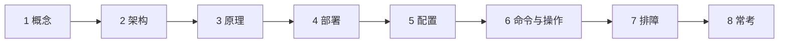
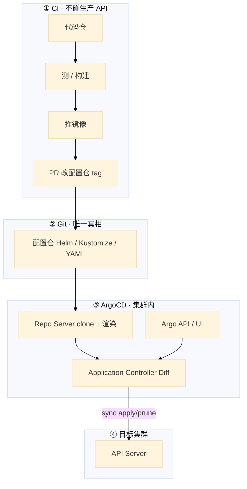
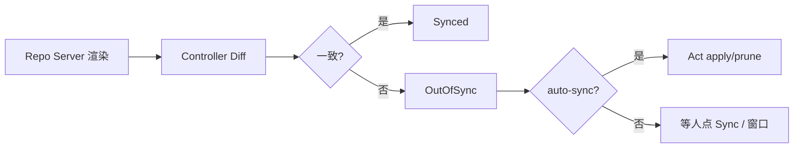
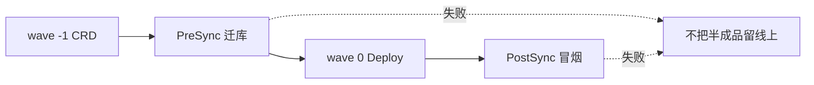
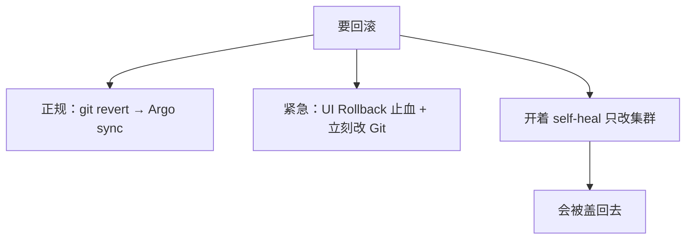
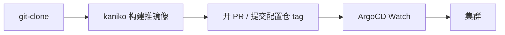
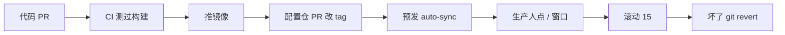
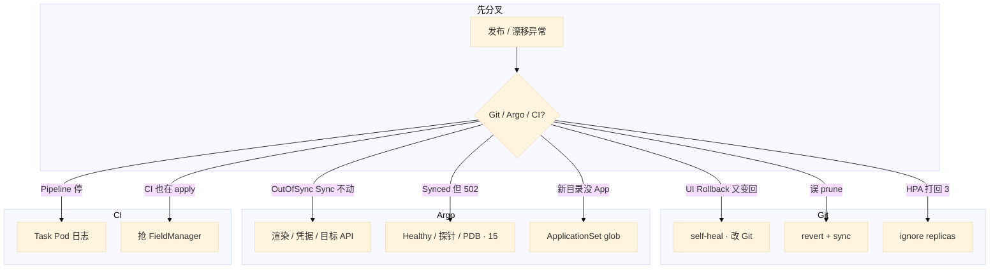

# GitOps：ArgoCD 与 Tekton

> 大家好。上一章讲完 Helm / Kustomize；这一章讲**谁把期望对齐进集群**——Git 是唯一真相，控制器 Pull 对齐，CI 不拿生产 kubeconfig。
> 开讲之前，先带大家回到几个现场：流水线末尾仍是 `kubectl apply -f`，生产 kubeconfig 在 CI 变量里；有人说「我们也声明式了，YAML 在 Git」；预发已全自动，有人要把生产也开 self-heal；活动中 kubectl edit 改过探针，第二天被盖回去；支付镜像有 bug，值班在 UI 点了 Rollback，过几分钟又变回坏版本。手都别动。
> 这一章讲完，你会知道这几个人各自错在哪——YAML 在 Git 不等于 GitOps、self-heal 下 UI Rollback 必须补 Git、热修当天要回写仓库。
> **本章回答的问题**：Pull 对齐长什么样；OutOfSync → Act；hook / wave；回滚改哪；Tekton vs Actions；所有权只能有一个。
> **本章不讲**：声明式为什么能自愈、HPA 抢 replicas → [01](../01-集群架构/)；Chart、values、helm rollback → [22](../22-Helm与Kustomize/)；滚动/金丝雀/PDB → [16](../16-灰度与回滚/)；节点升级窗口 → [17](../17-节点运行时与升级/)；Jenkins/GitHub Actions 语法细节 → [04 工程化](../../04-工程化与自动化/)。

**标记**：🎯重点 · 🔥难点 · ⭐常考 · 🔧实操

**怎么听这场分享**：先认主线三步——① Pull 对齐；② 所有权唯一；③ hook / prune 谨慎。口诀先埋一句：⭐ **CI 只改 Git，不 kubectl 进生产**。下面按节展开。




**本章主线（GitOps 就按这三步想）：**

1. **Pull 对齐**：Git 是唯一真相；CI 不拿生产 kubeconfig，只改镜像 tag / 开 PR。
2. **所有权**：只有一个控制器写集群；应急 kubectl 当天补 Git，否则 sync 盖掉热修。
3. **Hook / prune**：migration 挡在 sync 前；误删先看 finalizer 和 ownership。

**读完你能：** 白板上画出 Pull 对齐；会配 auto-sync / self-heal / prune / hook；回滚改 Git；Tekton 最后一步不 kubectl；所有权只有一个。

## 本章目录

- [1. 基本概念](#1-基本概念)
- [2. 架构图](#2-架构图)
- [3. 原理](#3-原理)
- [4. 安装部署](#4-安装部署)
- [5. 核心配置](#5-核心配置)
- [6. 命令与操作](#6-命令与操作)
- [7. 生产排障](#7-生产排障)
- [8. 必会 · 常考](#8-必会--常考)
- [合上书](#合上书问自己)

---

## 1. 基本概念

🎯 GitOps 不只是 YAML 在 Git——还要求集群内控制器从 Git 拉并对齐，CI 不持有生产写权限。

YAML 在 Git 只是存放。GitOps 还要求 **集群由控制器从 Git 拉并对齐**，CI 不持有生产写权限。

口诀：⭐ **YAML 在 Git ≠ GitOps**——还差「谁去对齐」和「CI 不持生产写权限」这两条。01 写过：声明式是 Observe → Diff → Act。GitOps 把「期望」的存放处规定为 **Git**，集群里的控制器（ArgoCD）负责对齐。CI 只产出镜像和改 Git 里的 tag，**不 kubectl apply 进生产**。

**值班里什么时候碰到**：OutOfSync 红灯；kubectl 热修被盖回；UI Rollback 几分钟又弹回；误删 Git 目录导致生产 Service 没了。

四条原则：Git 是唯一真相；变更走 PR；集群趋近 Git（自愈或告警）；Git 历史即发布历史。

| | 传统 Push | GitOps Pull |
|--|-----------|-------------|
| 谁 apply | CI 持有 kubeconfig | 集群内 Argo 用自己的 SA |
| 凭证 | 在 CI 变量里 | 不出集群 |
| 回滚 | 找回旧 YAML 再推 | `git revert` |
| 应急 kubectl | 经常忘补 | **当天补回 Git**，否则下次 sync 盖掉热修 |

应急 `kubectl` 可以，和 01 里 HPA 与 YAML 抢 replicas 是同一类事故：不补 Git，控制器会按仓库把世界拉回去。

**打个比方**：Push 像快递员每天往你家塞家具（CI apply）；Pull 像你家装了智能管家，只按购物清单（Git）摆家具，手摆的会被收回去（self-heal）。

> **记住**：Git 存期望，控制器去对齐；CI 不拿生产 kubeconfig。

**面试怎么说**：「GitOps 是 Pull 对齐：Git 唯一真相，Argo 在集群内 sync；CI 只改配置仓 tag，不 kubectl 进生产。」

---

本节对应练习题 Q1、Q4。

## 2. 架构图

好，概念有了。接下来看架构——后面的内容都对着这张图。

🎯 CI 不碰生产 API，Git 是唯一真相，Argo 在集群内 clone 渲染 diff sync，凭证不出集群。

先把整张图钉住。后面 sync、hook、排障都对着这张图说话。



**读图三句话：**

1. **凭证不出集群**——排障先看 Git commit 和 Application 灯，不是翻 CI secrets。
2. **两种灯分开看**：Synced = 和 Git 一致；Healthy = 探针过了。GitOps 不会替你空服。
3. **从配置仓 path 进**——OutOfSync 先 `argocd app diff`，不要先在集群 kubectl apply 顶上。

| 组件 | 干什么 |
|------|--------|
| Argo API Server | UI / API，管 Application |
| Repo Server | clone Git，渲染 Helm/Kustomize |
| Application Controller | 对比期望 vs 实际，执行 sync |

---

本节对应练习题 Q1、Q10。

## 3. 原理

带着这张图，咱们进原理——难点放慢讲。

### 3.1 ArgoCD 同步：OutOfSync → Act

🎯 OutOfSync 后 Controller apply/prune；Synced 是对齐 Git，Healthy 才是探针过了。

**一句话：** OutOfSync 后由 Controller apply/prune；Synced ≠ Healthy，探针没过照样 502。

**打个比方**：Synced 像「家具摆的位置和清单一致」；Healthy 像「沙发能坐、灯能亮」——摆对了不代表能住。

**现场走一遍**（配置仓合了但生产还是旧 tag）：

1. `argocd app get game-gateway-prod`：

```text
Name:               game-gateway-prod
Sync Status:        OutOfSync
Health Status:      Healthy
```

2. `argocd app diff game-gateway-prod` 看到 `image.tag: 1.2.0 → 1.2.1`
3. 生产 Application 没开 auto-sync → **等人点 Sync 或等窗口**，不是 CD 坏了
4. 点 Sync 后 Synced，但玩家仍 502 → 走 15 看探针/PDB，不是再 sync 一次



**输出解读**（syncPolicy）：

```yaml
syncPolicy:
  automated:
    prune: true      # Git 删了，集群也删
    selfHeal: true   # 手改集群会被盖回 Git
```

| 开关 | 含义 | 生产 |
|------|------|------|
| **auto-sync** | Git 一合就上 | 预发可开；生产常手动或 **sync window** |
| **self-heal** | kubectl 热修活不长 | 可开，但先 ignore 合理漂移 |
| **prune** | Git 没了的对象从集群删 | **谨慎**；误删目录 = 删生产 |

合理漂移：HPA 改 replicas → `ignoreDifferences` `/spec/replicas`。Helm `randAlpha` 禁止（21）。

**面试怎么说**：「OutOfSync 后 Controller sync；Synced 是对齐 Git，Healthy 是探针；生产 prune 谨慎，热修要补 Git。」

⭐ **面试锚点**：Synced 和 Healthy 有什么区别？——Synced 是 Git 和集群期望一致；Healthy 是探针通过。可以 Synced 但 502。

🔍 **现场命令块：argocd app diff 调试配置漂移**

```bash
# 看 Application 当前状态
argocd app get game-gateway-prod
  Sync Status:     OutOfSync    # ← 和 Git 不一致
  Health Status:   Healthy      # ← 但探针是过的

# 看具体哪一行漂移
argocd app diff game-gateway-prod
  spec.template.spec.containers[0].image
  - registry/game-gateway:1.2.0      # ← 集群实际
  + registry/game-gateway:1.2.1      # ← Git 期望（还没 sync）

# 手动触发 sync
argocd app sync game-gateway-prod
  SYNC STATUS: Synced    # ← 已对齐

# 如果 sync 不动，看 Conditions
argocd app get game-gateway-prod | grep -A5 Conditions
  Conditions:
  - type: SyncFailed       # ← 渲染失败或凭据过期
```

🔧 **易错对照**：
- `错讲法 → OutOfSync 就是坏了` → `对讲法 → 没开 auto-sync 时 OutOfSync 是正常等待人点`
- `错讲法 → Synced 了就说明业务正常` → `对讲法 → Synced 只是对齐 Git，Healthy 才是探针通过`

### 3.2 Sync Hook 与波次

🎯 wave 管顺序，PreSync 挡半成品——迁库失败不要把坏版本留线上。

**一句话：** wave 管顺序，PreSync 挡半成品——迁库失败不要把坏版本留线上。

**打个比方**：像装修先拆墙（CRD）再装家具（Deploy），PreSync 是「验房合格才搬沙发」。

**现场走一遍**（一次 sync CRD 还没 Ready 就 apply Deploy）：

1. Application 日志：`unable to recognize "apps/v1, Kind=Deployment"` — 其实 CR 类型还没登记
2. 给 CRD 加注解 `argocd.argoproj.io/sync-wave: "-1"`
3. Deploy 加 `sync-wave: "0"`，PreSync migration Job 标 `argocd.argoproj.io/hook: PreSync`
4. 再 sync：wave -1 → PreSync 迁库 → wave 0 Deploy
5. PreSync Job 失败 → sync 标失败，**主负载不升**

| 机制 | 干什么 |
|------|--------|
| **sync wave** | 注解数字越小越先；典型先 CRD / NS，再 Deploy |
| **PreSync** | 迁库 Job；失败则不要升主负载 |
| **Sync** | 主资源 |
| **PostSync** | 冒烟；失败应挡住「成功」 |
| **Hook 删除策略** | `HookSucceeded` 清 Job，避免遗留 |



**输出解读**：合服长任务、要人工确认，不要塞进每次网关 Sync 的 PreSync（20、21）。滚动期间 migration 走 expand/contract（15）。

**面试怎么说**：「wave 管资源顺序，PreSync/PostSync 是 hook Job；迁库失败应挡住 sync 成功，合服不能当 PreSync。」

### 3.3 回滚、漂移、所有权

🎯 正规回滚改 Git；开了 self-heal 只点 UI Rollback 会被盖回去。

🔥 开了 self-heal，UI 点 Rollback 够不够？——⭐ **不够**。UI 只是止血，Git 里还是坏版本，下一轮 sync 又盖回来。

**一句话：** 正规回滚改 Git；开了 self-heal 只点 UI Rollback 会被盖回去。

**打个比方**：self-heal 像自动纠错笔——你在纸上改了字（kubectl），它按原稿（Git）涂掉。

**现场走一遍**（UI Rollback 几分钟又变回坏版本）：

1. 支付 bug，值班在 Argo UI 选历史 revision Rollback → 暂时恢复
2. 五分钟后又变回坏 tag → 配置仓 Git 仍是 `image.tag: 1.2.1-bad`
3. self-heal 把集群拉回 Git → **必须 git revert 配置仓**
4. Argo sync 后永久回到好版本
5. 紧急可先关 self-heal 止血，**当天补 Git**



**输出解读**：CI 不要和 Argo **同时** apply——抢 FieldManager，来回漂移。Helm history 在 Argo 管 Chart 时往往不存在（21）。`kubectl rollout undo` 只是临时，必须补 Git。

**面试怎么说**：「回滚正规是 git revert；self-heal 下 UI Rollback 只是止血必须补 Git；所有权只能有一个。」

⭐ **面试锚点**：self-heal 开了之后 `kubectl edit` 改了探针，几分钟后被盖回去——为什么？因为 Controller 定期 diff Git vs 集群，发现漂移就 sync 回 Git 的期望。

🔧 **易错对照**：
- `错讲法 → 紧急 kubectl edit 热修后不用管` → `对讲法 → 开了 self-heal 当天必须补 Git，否则下次 sync 盖掉热修`
- `错讲法 → helm rollback 可以和 Argo 共存` → `对讲法 → Argo 是 FieldManager，helm rollback 后 self-heal 会盖回去`

### 3.4 Tekton vs Actions

🎯 CI 最后一步改 Git 开 PR，不要 kubectl 进生产；换 CI 工具不影响 Argo。

**一句话：** CI 最后一步改 Git 开 PR，不要 kubectl 进生产；换 CI 工具不影响 Argo。

**打个比方**：Tekton 是集群里的厨房（CI），Argo 是管家按清单摆家具（CD）——厨房做完菜贴便签改清单，不直接往客厅搬。

**现场走一遍**（PipelineRun 绿了但生产没更新）：

1. `kubectl get pipelinerun -n ci` → Succeeded
2. `kubectl logs -n ci -l tekton.dev/pipelineRun=gw-build-abc --tail=50`
3. 构建 Step 成功，但 bump-tag Step 报错 `git push rejected` → **配置仓没有新 tag**
4. 不是 Argo 坏了，是 CI 最后一步失败
5. 修 bump-tag Task，重跑 PipelineRun；PR 合并后 Argo 才 OutOfSync

| | **Tekton** | **GitHub Actions / GitLab CI** |
|--|-----------|--------------------------------|
| 跑在哪 | 集群内 CRD：Task / Pipeline / PipelineRun | 仓库托管的 runner |
| 形态 | Step 每步一个容器，Workspace 传文件 | YAML workflow + 插件市场 |
| 凭证 | 集群 SA / Secret；CD 仍是 Argo | 仓库 secrets；**不要**放生产 kubeconfig |
| GitOps | 最后一步 bump 配置仓 tag | 同样：开 PR，不要 kubectl |



**输出解读**：不必换 Jenkins 才能 GitOps——CD 接 Argo 即可。PipelineRun 停在某 Step → 看该 Task 的 Pod 日志，不要去集群里补 kubectl。

**面试怎么说**：「Tekton 是 K8s 原生 CI，Actions 也能当 CI；最后一步都是改 Git，禁区是生产 kubeconfig。」

⭐ **面试锚点**：PipelineRun 全绿但生产没更新，为什么？——最后一步 bump-tag / 开 PR 失败了（git push rejected），不是 Argo 坏了。

🔍 **现场命令块：Tekton PipelineRun 失败排查**

```bash
# 看 PipelineRun 状态
kubectl get pipelinerun -n ci
  NAME              STATUS     STARTED      REASON
  gw-build-abc      Failed     3m           StepFailed

# 找到失败的具体 Task Pod
kubectl get pods -n ci -l tekton.dev/pipelineRun=gw-build-abc
  gw-build-abc-build-pod     Completed
  gw-build-abc-bump-pod      Failed         # ← 这个 Task 挂了

# 看失败 Pod 的日志
kubectl logs -n ci gw-build-abc-bump-pod --all-containers --tail=50
  + git push origin main
  remote: Permission to k8s-config is denied  # ← CI SA 没有 Git push 权限

# 看 ApplicationSet 有没有正常生成 App
kubectl get applicationset -A
  NAME              GENERATORS   APPS   LAST_GENERATION
  game-services     1            12     3                 # ← 12 个 App 正常
  # APPS: 0 → glob 写错或目录不存在，看 events
kubectl get events -n argocd --field-selector reason=ApplicationSetRenderError
```

🔧 **易错对照**：
- `错讲法 → PipelineRun 绿了就等于生产更新了` → `对讲法 → 最后一步 bump-tag 失败的话生产不会变`
- `错讲法 → ApplicationSet 不出 App 是 Argo bug` → `对讲法 → glob 写错或 Git 目录不存在，看 ApplicationSet events`

> **记住**：Tekton 是 K8s 原生 CI，最后一步改 Git，不要 kubectl 进生产。Actions 也可以当 CI，禁区同样是生产 kubeconfig。

---

本节对应练习题 Q2、Q3、Q5、Q8、Q9。

## 4. 安装部署

🎯 CD 在集群内用 Argo，SA 收敛；预发全开 auto-sync，生产手动或窗口内；生产 kubeconfig 不进 CI。

生产怎么选：

| 项 | 选 | 不选 |
|----|----|------|
| CD | 集群内 Argo，SA 收敛到目标 NS | CI cluster-admin |
| CI | Tekton 或继续 Actions/Jenkins | 为了 GitOps 强迁 CI |
| 预发 Application | auto-sync + prune + self-heal | — |
| 生产 Application | 手动 Sync 或窗口内 auto；prune 谨慎 | 照抄预发全开 |
| 多服务 | ApplicationSet 生成器 | 手写 300 个 Application |
| 密钥 | CI 只需镜像仓库和 Git | 生产 kubeconfig 进 Actions secrets |

落地：Application 指向 repo + path + revision；destination 是集群和 NS。新目录加了但 App 没出来，看 ApplicationSet 的 generator 日志，path glob 写错是第一名。删目录则相反：开了 prune，生产可能被删。生产删目录两人 review。

游戏集群：大厅/网关可窗口内 auto；战斗服手动 Sync + 空服窗口（15、16）。活动高峰冻结非紧急。

验收：CI 角色不能 `kubectl get ns` 生产；预发合 Git 后 Application 变 Synced；生产未点 Sync 仍是旧 tag——这是设计。

---

本节对应练习题 Q7、Q11。

## 5. 核心配置

🎯 预发全开 auto-sync + self-heal + prune；生产 prune 谨慎，self-heal 可开但要 ignore 合理漂移。

| 项 | 生产怎么用 | 改错会怎样 |
|----|------------|------------|
| auto-sync | 预发开；生产窗口或手动 | 误提交直上生产 |
| self-heal | 可开 + ignore HPA/注入 | 热修被盖回；或关了之后漂移没人管 |
| prune | 生产谨慎；Ingress/PVC `Delete=false` | 误删目录删生产 |
| sync window | 活动高峰禁止自动 | 高峰上线 |
| sync wave | 先 CRD 再负载 | 创建失败 |
| ignoreDifferences | `/spec/replicas` 等 | HPA 和 Git 打架 |
| ApplicationSet prune | 目录保护 + 两人 review | 删目录连带删 App 再 prune |
| CI SA | 镜像 + Git | 生产写权限 |

staging：尽快暴露配置错误。prod：Sync 常手动或窗口内；self-heal 可开但 ignore 合理漂移。

> **记住**：回滚改 Git；紧急 UI 止血必须补 Git，否则 self-heal 会盖回来。

---

本节对应练习题 Q2、Q7。

## 6. 命令与操作

好，配置记住了。接下来是值班真敲的命令。

### 6.1 命令速查

🎯 值班四问：Git 指哪一 commit？Application 灯？谁是 FieldManager？CI 有没有生产 kubeconfig？

```bash
argocd app list
argocd app get game-gateway-prod
argocd app diff game-gateway-prod
argocd app sync game-gateway-prod
argocd app history game-gateway-prod
kubectl -n argocd logs deploy/argocd-application-controller --tail=100
kubectl get applicationset -A
# Tekton
kubectl get pipelinerun -n ci
kubectl logs -n ci -l tekton.dev/pipelineRun=<run> --tail=100
```

| 目的 | 看什么 |
|------|--------|
| OutOfSync | diff：是 HPA 还是真的配置漂 |
| Sync 没动 | Application Conditions：渲染/凭据/目标 API |
| 健康 | Synced ≠ Healthy |
| CI 停住 | Task Pod 日志，不是 kubectl apply |
| 误 prune | 立刻 git revert 再 sync |

值班四问：Git 指哪一 commit？Application 灯？谁是 FieldManager？CI 有没有生产 kubeconfig？

### 6.2 ApplicationSet

🎯 100 服务 × 3 环境不要手写 300 个 Application，用生成器加目录即出 App。

100 服务 × 3 环境不要手写 300 个 Application。用 git 目录 / cluster / list / matrix 生成器，加目录即出 App。

```yaml
apiVersion: argoproj.io/v1alpha1
kind: ApplicationSet
spec:
  generators:
    - git:
        repoURL: https://git.company.com/k8s-config
        directories:
          - path: services/*/prod
  template:
    spec:
      source:
        path: '{{path}}'
      destination:
        namespace: game-prod
```

生成器和 prune 一起用：目录被误删，可能删对应 App 再 prune 资源。生产删目录要两人 review，关键资源 Delete=false。

### 6.3 一条发布链（游戏网关）

🎯 代码 PR → CI 构建 → 配置仓改 tag → 预发 auto-sync → 生产窗口 → 坏了 git revert。



价值：凭证不出集群、变更可审计、新环境从 Git 拉起来、任何人能提 revert 而不需要集群权限。战斗服：GitOps 不会替你空服。

变更窗口：工作日白天发；周五傍晚、节前、开服日冻结。紧急止血事后补单，不能因为没工单就不止血。

---

本节对应练习题 Q4、Q6、Q9。

## 7. 生产排障

好，命令会了。接下来按现象定责——先做什么、别做什么。

🎯 误 prune 先 git revert 再 sync；self-heal 盖热修先补 Git；CI 与 Argo 对打先停 CI。

误 prune 删了生产 Service：长连接还在的玩家暂时没掉（kube-proxy 规则还在），新登录进不去。立刻 git revert 并 sync，把 Service 对象加回。不要先重启游戏进程（01 同类：存量 conntrack 可能还在）。



| 现象 | 先做什么 | 不要做什么 |
|------|----------|------------|
| self-heal 盖热修 | 补 Git 或先关 self-heal | 再 edit 一次 |
| UI Rollback 弹回 | Git 还是坏 tag | 只点 UI |
| HPA 扩了又被打回 | ignoreDifferences | 关 HPA |
| 误 prune | revert + sync | 重启游戏进程 |
| CI 与 Argo 对打 | 停 CI apply | 两边都加大频率 |
| Synced + 502 | 走 15，不是再 sync | 当 GitOps 会空服 |
| Actions 里 kubeconfig | 立刻收权限 | 继续当 GitOps |

---

本节对应练习题 Q8、Q12、Q13、Q14。

现在再看开篇那几句——「YAML 在 Git 就算 GitOps」「生产开 self-heal 随便点 Rollback」「edit 热修不用补 Git」——你知道该怎么拦住他们了：Pull 对齐才算、回滚改 Git、热修当天回写。

## 8. 必会 · 常考

遮住「口径」列自问自答，卡壳的行回去重读对应小节——能讲出来才算会，看着答案点头不算。

🎯 白板和追问高频——Synced 不等于 Healthy，self-heal 下 UI Rollback 不永久，Tekton 最后一步改 Git。

白板和追问高频，能一口回：

| 说法 | 对错 | 口径 |
|------|:----:|------|
| YAML 在 Git 就是 GitOps | 错 | 还要控制器 Pull 对齐；CI 不写生产 |
| 生产必须开 self-heal + prune | 错 | 预发可全开；生产 prune 谨慎 |
| UI Rollback 在 self-heal 下永久有效 | 错 | 目标是 Git，会盖回来 |
| Synced 就是发布成功 | 错 | Healthy 才是探针；业务指标在 15 |
| Tekton 最后一步 kubectl 也算 GitOps | 错 | 最后一步改 Git |
| 必须把 Jenkins 换成 Tekton 才能 GitOps | 错 | CD 接 Argo 即可 |
| Actions 不能当 CI | 错 | 能；禁区是生产 kubeconfig |
| Image Updater 生产自动改 tag 没问题 | 错 | 绕过审批 |
| 与 Argo 同时 helm apply 更稳 | 错 | 抢 FieldManager |
| GitOps 会替战斗服空服 | 错 | 窗口和 PDB 仍要人做 |
| 误 prune 先重启进程 | 错 | 先把对象加回 |
| ApplicationSet 删目录无影响 | 错 | 可能删 App 再 prune |
| Hook 失败仍该标成功 | 错 | PreSync/PostSync 失败应挡住 |
| helm rollback 在 Argo 下一定灵 | 错 | 往往没有 Helm Secret |

数字：预发全自动；生产窗口避开活动；删目录两人 review；CI SA 无 cluster-admin。

⭐ **面试锚点速记**：
- ⭐ GitOps 四条原则是什么？——Git 唯一真相；变更走 PR；集群趋近 Git（自愈或告警）；Git 历史即发布历史。
- ⭐ Argo 管 Helm Chart 时有没有 Helm Secret？——通常没有（Argo 自己渲染 apply），所以 `helm rollback` 会报 release not found。

🔥 **高频翻车点**：
- 🔥 self-heal 开着但忘了 ignoreDifferences /spec/replicas → HPA 扩了副本被 Git 打回去 → Pod 不够扛量。
- 🔥 sync-wave 没标 CRD 为 -1 → CRD 还没 Ready 就 apply Deploy → `no matches for kind "GameServer" in version "stable.gw/v1"`。
- 🔥 ApplicationSet prune 开着 → 有人误删 Git 目录 → 对应 App 被删 → 生产资源被 prune → 两道防线都没了。
- 🔥 CI 还在 kubectl apply 生产 → Argo 检测到漂移反复 sync → 来回闪 → FieldManager 打架 → 停 CI apply。
- 🔥 Tekton Task 容器镜像用 `latest` → 某天 upstream 推了不兼容更新 → PipelineRun 全红 → Task 镜像要钉 digest。

易混：Synced vs Healthy；auto-sync vs self-heal vs prune；UI Rollback vs git revert；Tekton vs Actions vs Jenkins（CI 层）对 Argo（CD 层）；wave vs hook；ignoreDifferences vs 把期望写进 Git。

---

本节对应练习题 Q1～Q14。

---

## 合上书，问自己

合上书自检（题号对齐练习题）：

- [ ] GitOps 和传统 CI/CD 差在哪？YAML 在 Git 算不算？（Q1）
- [ ] OutOfSync 怎么发现？生产能开 auto-sync + self-heal 吗？（Q2、Q7、Q11）
- [ ] self-heal 下怎么回滚才有效？UI Rollback 够不够？（Q3）
- [ ] 完整发布链 CI/CD 边界？Tekton 最后一步做什么？（Q4、Q6、Q9）
- [ ] Sync Hook / wave？合服能当 PreSync 吗？（Q5）
- [ ] HPA 扩完被 Argo 打回？误 prune 第一刀？（Q8、Q12、Q13、Q14）

六题都能口述，这一章就过了。终极测试：拦住开篇那位「YAML 在 Git 就算 GitOps」的人。下一章讲 Service Mesh——sidecar 截获、mTLS、什么时候不该上。
