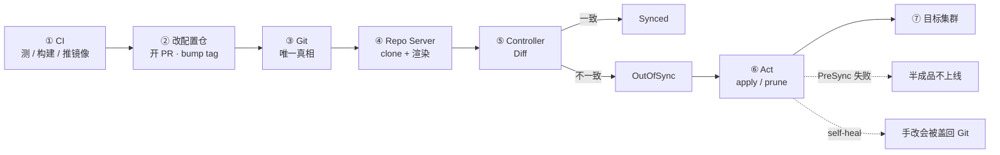
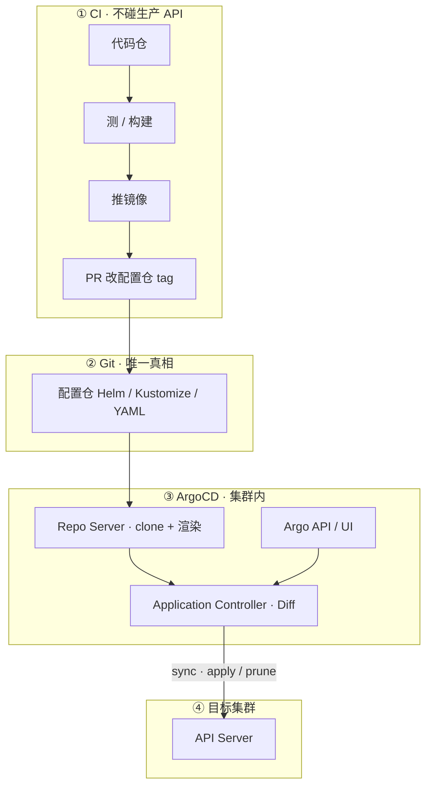
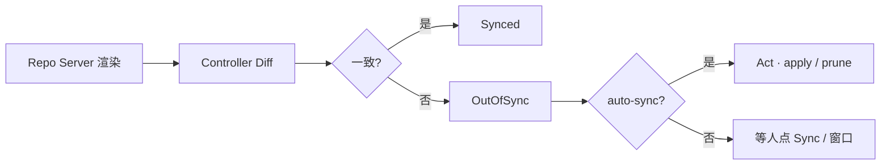
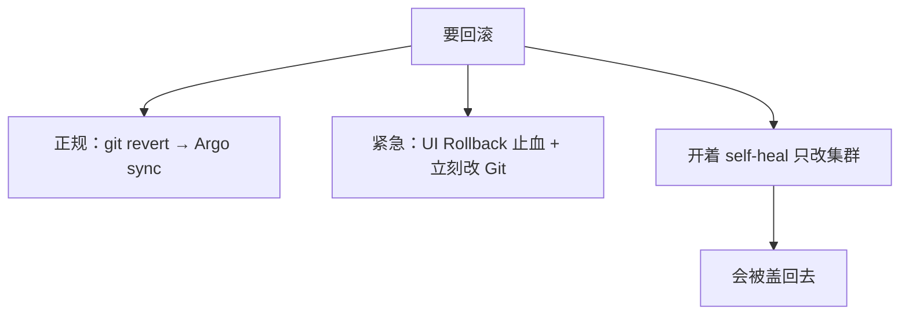
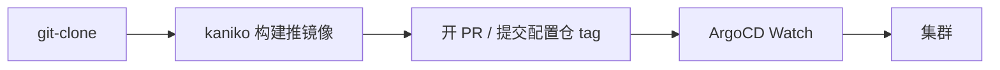
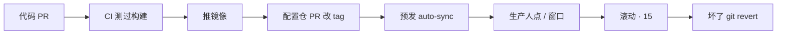
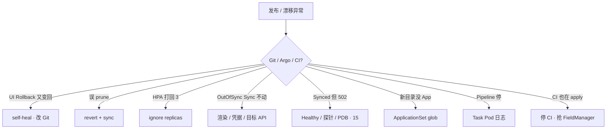

# GitOps：ArgoCD 与 Tekton

> 流水线末尾仍是 `kubectl apply -f`，生产 kubeconfig 躺在 CI 变量里；有人说「YAML 在 Git 就算 GitOps」；预发全自动，有人要把生产也开 self-heal 后随便点 UI Rollback；活动中 `kubectl edit` 改过探针，第二天被盖回去；支付镜像有 bug，值班点了 Rollback，过几分钟又变回坏版本。
> **本章回答**：一次期望从 Git 对齐进集群的一生——Pull 对齐、OutOfSync → Act、hook / wave、回滚改哪、CI 最后一步做什么；卡在哪一段，一眼定责。
> **不讲**：声明式为什么能自愈、HPA 抢 replicas → [01](../01-集群架构/)；Chart、values、helm rollback → [22](../22-Helm与Kustomize/)；滚动/金丝雀/PDB → [16](../16-灰度与回滚/)；节点升级窗口 → [17](../17-节点运行时与升级/)；Jenkins/GitHub Actions 语法细节 → [04 工程化](../../04-工程化与自动化/)。

**标记**：🎯重点 · 🔥难点 · ⭐常考 · 🔧实操

---

## 一、一张图：一次期望对齐的一生

> 🎯 **一句话**：Git 是唯一真相；CI 只改仓库，集群内控制器 Pull 对齐——卡在哪一段，先问「期望在哪、谁在写集群」。



- 📖 **读图**
  - 🛤️ 主线：CI 产出镜像并改配置仓 → Argo clone 渲染 → Diff → 必要时 Act → 集群趋近 Git
  - 🔀 两条虚线是值班高频坑：hook 挡半成品；self-heal 把「只改集群」涂掉。排障先看 Git commit 和 Application 灯，不是翻 CI secrets

- 🔑 **三个钉子**（后面每节展开）
  - **Pull 对齐**：期望只在 Git；集群内控制器拉并对齐，CI 不持生产写权限
  - **所有权唯一**：同一字段只能一个写手（Argo / HPA / 人）；抢 FieldManager = 来回闪
  - **hook / prune 谨慎**：迁库挡半成品；误删目录 + prune = 删生产

口诀：⭐ **CI 只改 Git，不 kubectl 进生产**。

本节对应练习题 Q1、Q10。

---

## 二、认清：YAML 在 Git ≠ GitOps

> 🎯 **一句话**：YAML 只是存放；GitOps 还要求**集群内控制器从 Git 拉并对齐**，且 CI **不持有**生产写权限。

- 🔑 **GitOps 四条**
  - Git 是唯一真相（期望存在仓库里）
  - 变更走 PR（可审计）
  - 集群趋近 Git（自愈或至少告警）
  - Git 历史即发布历史（回滚 = `git revert`）

| | 传统 Push | GitOps Pull |
|--|-----------|-------------|
| 谁 apply | CI 持有 kubeconfig | 集群内 Argo 用自己的 SA |
| 凭证 | 在 CI 变量里 | 不出集群 |
| 回滚 | 找回旧 YAML 再推 | `git revert` → sync |
| 应急 kubectl | 经常忘补 | **当天补回 Git**，否则下次 sync 盖掉热修 |

#### ❓ 为什么「YAML 在 Git」还不算？

- ❌ 只把清单放仓库、仍由 CI `kubectl apply` → 还是 **Push**：生产写权限在流水线里
- ✅ 还差两件：① 谁去对齐（集群内控制器 Pull）；② CI 不拿生产 kubeconfig
- 🧯 应急 `kubectl` 可以——和 01 里 HPA 与 YAML 抢 `replicas` 是同一类事故：不补 Git，控制器会按仓库把世界拉回去

> 💡 **打个比方**：Push 像快递员每天往你家塞家具（CI apply）；Pull 像家里装了智能管家，只按购物清单（Git）摆家具——手摆的会被收回去（self-heal）。

> ⚠️ **别混**：声明式（Observe → Diff → Act，见 01）解决「怎么自愈」；GitOps 额外规定**期望存放处 = Git**，对齐者 = 集群内控制器。两者常一起出现，但不是同一句话。

- 🕵️ **值班里什么时候碰到**
  - OutOfSync 红灯、有人喊「CD 坏了」——其实只是没开 auto-sync
  - `kubectl edit` 热修第二天被盖回
  - UI Rollback 几分钟又弹回坏版本
  - 误删 Git 目录 + prune → 生产 Service 没了

> 📝 **面试**：GitOps 是 Pull 对齐——Git 唯一真相，Argo 在集群内 sync；CI 只改配置仓 tag，不 kubectl 进生产。⭐（Q1）

本节对应练习题 Q1、Q4。

---

## 三、架构：凭证不出集群

> 🎯 **一句话**：CI 不碰生产 API；Argo 在集群内 clone、渲染、diff、sync——凭证不出集群。



- 📖 **读图**
  - 🚫 没有从 CI 指向生产 API 的箭头——那是禁区
  - 🔦 两种灯分开看：**Synced** = 和 Git 期望一致；**Healthy** = 探针过了。GitOps 不会替你空服
  - 📂 OutOfSync 从配置仓 path 进：先 `argocd app diff`，不要先在集群 `kubectl apply` 顶上

- 🧩 **三个组件**
  - **Argo API Server**：UI / API，管 Application
  - **Repo Server**：clone Git，渲染 Helm / Kustomize（渲染失败灯在这里）
  - **Application Controller**：对比期望 vs 实际，执行 sync（self-heal / prune 也在这里）

- 🪪 **Application 最小骨架**（指向 `repo + path + revision`，destination 是集群和 NS）

```yaml
apiVersion: argoproj.io/v1alpha1
kind: Application
metadata:
  name: game-gateway-prod
  namespace: argocd
spec:
  project: default
  source:
    repoURL: https://git.company.com/k8s-config
    targetRevision: main
    path: services/game-gateway/prod
  destination:
    server: https://kubernetes.default.svc
    namespace: game-prod
  syncPolicy:
    syncOptions:
      - CreateNamespace=true
```

> ⚠️ **别混**：代码仓 ≠ 配置仓。CI 推镜像进仓库；改的是**配置仓**里的 tag / values。两边都绿但生产不变，多半是 bump 配置仓那一步挂了（七节）。

本节对应练习题 Q1、Q10。

---

## 四、同步：OutOfSync → Act

> 🎯 **一句话**：OutOfSync 后由 Controller apply/prune；**Synced ≠ Healthy**——探针没过照样 502。

### 🚦 两盏灯 ⭐🔥

```text
Name:               game-gateway-prod
Sync Status:        OutOfSync     ← 和 Git 不一致（期望变了还没 Act）
Health Status:      Healthy       ← 探针过了；业务可能仍 502（走 15）
```



- 📖 **读图**：Diff 只回答「跟不跟 Git」；是否自动 Act 看 `syncPolicy`；点 Sync 后仍 502 → 查探针/PDB（15），不是再 sync 一次

#### ❓ 为什么 Synced 了还会 502？

- 🧾 **Synced**：集群对象期望与 Git 渲染结果一致——摆的位置对
- 💚 **Healthy**：就绪探针等健康检查过了——能坐、灯亮
- 🚫 GitOps **不**替你空服、不保证业务指标；Synced + 502 走 [15](../15-Ingress与流量管理/) / [16](../16-灰度与回滚/)，别当 CD 坏了

### 🔧 三个开关 ⭐

```yaml
syncPolicy:
  automated:
    prune: true      # Git 删了，集群也删
    selfHeal: true   # 手改集群会被盖回 Git
  syncOptions:
    - CreateNamespace=true
```

- 🔄 **auto-sync**：Git 一合就上——预发可开；生产常手动或 **sync window**
- 🩹 **self-heal**：kubectl 热修活不长——可开，但先 `ignoreDifferences` 合理漂移
- 🗑️ **prune**：Git 没了的对象从集群删——**生产谨慎**；误删目录 = 删生产

合理漂移（HPA / 注入边车改的字段）要显式忽略，否则 self-heal 和 HPA 打架：

```yaml
spec:
  ignoreDifferences:
    - group: apps
      kind: Deployment
      jsonPointers:
        - /spec/replicas          # ← HPA 写这里；Git 里写死会被打回
```

> 💡 **打个比方**：Synced 像「家具摆的位置和清单一致」；Healthy 像「沙发能坐、灯能亮」——摆对了不代表能住。

> 🔍 **现场**：配置仓合了但生产还是旧 tag

```bash
argocd app get game-gateway-prod
# Sync Status: OutOfSync    # ← 和 Git 不一致
# Health Status: Healthy    # ← 探针过了

argocd app diff game-gateway-prod
# - registry/game-gateway:1.2.0   # ← 集群实际
# + registry/game-gateway:1.2.1   # ← Git 期望（还没 sync）

argocd app sync game-gateway-prod
# SYNC STATUS: Synced         # ← 已对齐

argocd app get game-gateway-prod | grep -A5 Conditions
# - type: SyncFailed          # ← 渲染失败或凭据过期
```

- 生产没开 auto-sync → **等人点 Sync 或等窗口**，不是 CD 坏了
- Helm `randAlpha` 之类每次渲染都漂的字段 → 禁止（见 21）；合理漂移用 ignore，别关 self-heal 装看不见

> 📝 **面试**：OutOfSync 后 Controller sync；Synced 对齐 Git，Healthy 看探针；生产 prune 谨慎，热修要补 Git。⭐（Q2）

本节对应练习题 Q2、Q7、Q11。

---

## 五、顺序：sync wave 与 Hook

> 🎯 **一句话**：wave 管资源顺序；PreSync / PostSync 是 hook Job——迁库失败不要把坏版本留线上。


- 📖 **读图**：数字越小越先；PreSync 失败 → sync 标失败、主负载不升；PostSync 失败也应挡住「成功」

- 🧩 **四件套**
  - **sync wave**：注解 `argocd.argoproj.io/sync-wave`；典型先 CRD / NS（`-1`），再 Deploy（`0`）
  - **PreSync**：迁库 Job；失败则不要升主负载
  - **Sync**：主资源
  - **PostSync**：冒烟；`HookSucceeded` 清 Job，避免遗留

```yaml
# CRD 先于负载
metadata:
  annotations:
    argocd.argoproj.io/sync-wave: "-1"
---
# 迁库 Job：失败则主负载不升
metadata:
  annotations:
    argocd.argoproj.io/hook: PreSync
    argocd.argoproj.io/hook-delete-policy: HookSucceeded
```

#### ❓ 为什么 PreSync 失败必须挡住成功？

- 🧱 一次 sync 里 CRD 还没 Ready 就 apply Deploy → `unable to recognize ... Kind=...` / `no matches for kind`
- ✅ wave -1 → PreSync 迁库 → wave 0 Deploy；迁库挂了 = **半成品不上线**
- 🚫 合服长任务、要人工确认的活，**不要**塞进每次网关 Sync 的 PreSync（见 20、21）；滚动期 migration 走 expand/contract（15）

> 💡 **打个比方**：装修先拆墙（CRD）再装家具（Deploy）；PreSync 是「验房合格才搬沙发」。

> 📝 **面试**：wave 管顺序，PreSync/PostSync 是 hook；迁库失败应挡住 sync 成功，合服不能当 PreSync。⭐（Q5）

本节对应练习题 Q5。

---

## 六、回滚与所有权：只能有一个写手

> 🎯 **一句话**：正规回滚改 Git；开了 self-heal，只点 UI Rollback **不够**——下一轮 sync 会盖回来。



- 📖 **读图**：左边两条活路都最终回到 Git；右边那条是自愈笔把你涂掉

#### ❓ 为什么 self-heal 下 UI Rollback 不够？

- 🖥️ UI Rollback 只把**集群**拉到历史 revision——止血
- 📦 配置仓里仍是坏 tag（如 `1.2.1-bad`）→ Controller 定期 Diff → self-heal **再 sync 回 Git**
- ✅ 必须 `git revert` 配置仓（或改回好 tag）再 sync；紧急可先关 self-heal，**当天补 Git**

> 💡 **打个比方**：self-heal 像自动纠错笔——你在纸上改了字（kubectl / UI），它按原稿（Git）涂掉。

#### ❓ 为什么 CI 不能和 Argo 同时 apply？

- 👑 **所有权唯一**：同一对象字段只能一个 FieldManager 长期写
- ⚔️ CI `kubectl apply` + Argo sync 抢同一 Deployment → 来回漂移、灯闪、谁也说不清「真相」
- ✅ CI 只改 Git；集群写入交给 Argo。Argo 管 Chart 时往往**没有** Helm Secret → `helm rollback` 常报 release not found（22）
- 🩹 `kubectl rollout undo` / `kubectl edit` 只是临时，必须补 Git

> ⚠️ **别混**：UI Rollback ≠ git revert；前者改集群现状，后者改唯一真相。self-heal 开着时，只改集群 = 借时间。

> 📝 **面试**：回滚正规是 git revert；self-heal 下 UI Rollback 只是止血必须补 Git；所有权只能有一个。⭐🔥（Q3）

本节对应练习题 Q3、Q8。

---

## 七、CI：Tekton 最后一步改 Git

> 🎯 **一句话**：CI 最后一步 bump 配置仓 tag / 开 PR，**不要** kubectl 进生产；换 CI 工具不影响 Argo。

| | Tekton | GitHub Actions / GitLab CI |
|--|--------|----------------------------|
| 跑在哪 | 集群内 CRD：Task / Pipeline / PipelineRun | 仓库托管的 runner |
| 形态 | Step 每步一容器，Workspace 传文件 | YAML workflow + 插件 |
| 凭证 | 集群 SA / Secret；CD 仍是 Argo | 仓库 secrets；**不要**放生产 kubeconfig |
| GitOps | 最后一步 bump tag / 开 PR | 同样：开 PR，不要 kubectl |



- 📖 **读图**：厨房（CI）做完菜只贴便签改清单；管家（Argo）按清单摆客厅——厨房不直接往客厅搬

#### ❓ 为什么 PipelineRun 全绿生产还没更新？

- 🟢 构建 Step 成功 ≠ 配置仓有新 tag
- 🔎 常挂在 bump-tag：`git push rejected` / 没权限 / 没开成 PR → Argo **看不到**新期望
- ✅ 修 bump Task 重跑；PR 合并后 Application 才 OutOfSync——不是先查 Argo「坏了」

```bash
kubectl get pipelinerun -n ci
# gw-build-abc   Failed   StepFailed

kubectl get pods -n ci -l tekton.dev/pipelineRun=gw-build-abc
# gw-build-abc-build-pod   Completed
# gw-build-abc-bump-pod    Failed      # ← 这个 Task 挂了

kubectl logs -n ci gw-build-abc-bump-pod --all-containers --tail=50
# remote: Permission to k8s-config is denied   # ← CI SA 没有 Git push 权限
```

- 🧰 **Task 镜像钉 digest**，别用 `latest`——upstream 一变 PipelineRun 全红
- 🔁 PipelineRun 停在某 Step → 看该 Task 的 Pod 日志，**不要**去集群里补 `kubectl apply`

> ⚠️ **别混**：不必换 Jenkins 才能 GitOps——CD 接 Argo 即可。Actions 能当 CI，禁区同样是生产 kubeconfig。Image Updater 自动改生产 tag = 绕过审批，生产慎用。

> 📝 **面试**：Tekton 是 K8s 原生 CI，Actions 也能当 CI；最后一步都是改 Git，禁区是生产 kubeconfig。⭐（Q4、Q6、Q9）

本节对应练习题 Q4、Q6、Q9。

---

## 八、落地：Application、窗口与 ApplicationSet

> 🎯 **一句话**：预发全开 auto-sync；生产手动或窗口内、prune 谨慎；多服务用 ApplicationSet，不手写 300 个 App。

### 📐 怎么选 🔧

- 🎯 **CD**：集群内 Argo，SA 收敛到目标 NS——不给 CI cluster-admin
- 🧪 **预发 Application**：auto-sync + prune + self-heal（尽快暴露配置错误）
- 🏭 **生产 Application**：手动 Sync 或窗口内 auto；prune 谨慎；Ingress/PVC 可 `Delete=false`
- 🎮 **游戏集群**：大厅/网关可窗口内 auto；战斗服手动 Sync + 空服窗口（15、16）；活动高峰冻结非紧急
- 🔐 **密钥**：CI 只需镜像仓库和 Git——生产 kubeconfig **不进** Actions secrets

生产改错会怎样（记一句就够）：

- auto-sync 误提交 → 直上生产
- self-heal 无 ignore → 热修被盖 / HPA 被打回
- prune 过猛 → 误删目录删生产
- sync window 关错 → 高峰上线

### 🧬 ApplicationSet ⭐

100 服务 × 3 环境不要手写 300 个 Application——用 git 目录 / cluster / list / matrix 生成器，加目录即出 App：

```yaml
apiVersion: argoproj.io/v1alpha1
kind: ApplicationSet
spec:
  generators:
    - git:
        repoURL: https://git.company.com/k8s-config
        directories:
          - path: services/*/prod
  template:
    metadata:
      name: '{{path.basename}}-prod'
    spec:
      source:
        repoURL: https://git.company.com/k8s-config
        path: '{{path}}'
      destination:
        namespace: game-prod
```

```bash
kubectl get applicationset -A
# game-services   1   12   3    # ← 12 个 App 正常；APPS: 0 → glob 写错或目录不存在

kubectl get events -n argocd --field-selector reason=ApplicationSetRenderError
```

> ⚠️ **别混**：生成器 + prune 一起用——目录被误删，可能删对应 App 再 prune 资源。生产删目录要两人 review；新目录加了但 App 没出来，第一名仍是 path glob 写错。

### 🛤️ 一条发布链



- 📖 **读图**：凭证不出集群、变更可审计；战斗服 GitOps **不会**替你空服——窗口和 PDB 仍要人做

- ✅ **验收**
  - CI 角色不能 `kubectl get ns` 生产
  - 预发合 Git 后 Application 变 Synced
  - 生产未点 Sync 仍是旧 tag——这是设计，不是故障
- 🗓️ 变更窗口：工作日白天发；周五傍晚、节前、开服日冻结。紧急止血事后补单，不能因为没工单就不止血

本节对应练习题 Q7、Q11、Q6。

---

## 九、作战：定责

> 🎯 **一句话**：先分叉 Git / Argo / CI；误 prune 先 revert 再 sync；self-heal 盖热修先补 Git；CI 与 Argo 对打先停 CI。



- 📖 **读图**：先问期望在 Git 吗、灯在哪、谁还在写集群；不要三条线一起加大频率

| 现象 | 先做什么 | 不要做什么 |
|------|----------|------------|
| self-heal 盖热修 | 补 Git 或先关 self-heal | 再 edit 一次 |
| UI Rollback 弹回 | Git 还是坏 tag → revert | 只点 UI |
| HPA 扩了又被打回 | ignoreDifferences `/spec/replicas` | 关 HPA |
| 误 prune | revert + sync 把对象加回 | 重启游戏进程 |
| CI 与 Argo 对打 | 停 CI apply | 两边都加大频率 |
| Synced + 502 | 走 15，不是再 sync | 当 GitOps 会空服 |
| Actions 里 kubeconfig | 立刻收权限 | 继续当 GitOps |

### 60 秒剧本 🔧

> 🔍 **现场**：接到「发版异常 / 漂移 / 生产没更新」

```text
① 0–10s   Application 两盏灯：Synced? Healthy?  git 指哪一 commit？
② 10–30s  OutOfSync → app diff；Synced+502 → 离开 GitOps 走探针/PDB
③ 30–45s  Sync 不动看 Conditions；Pipeline 绿但没变 → 查 bump-tag / PR
④ 45–60s  定责：补 Git / ignore replicas / 停 CI apply / ApplicationSet events
```

- 误 prune 删了生产 Service：长连接还在的玩家可能暂时没掉（kube-proxy 规则还在），新登录进不去——立刻把对象加回，**不要**先重启游戏进程（01 同类：存量 conntrack 可能还在）

开篇那几句——「YAML 在 Git 就算」「self-heal 下随便 Rollback」「edit 不用补 Git」——该怎么拦住，你已经知道了。

本节对应练习题 Q8、Q12、Q13、Q14。

---

## 十、收口

### 命令速查 🔧

```bash
argocd app list
argocd app get game-gateway-prod          # Sync / Health / Conditions
argocd app diff game-gateway-prod         # 哪一行漂了
argocd app sync game-gateway-prod
argocd app history game-gateway-prod
kubectl -n argocd logs deploy/argocd-application-controller --tail=100
kubectl get applicationset -A
kubectl get events -n argocd --field-selector reason=ApplicationSetRenderError
kubectl get pipelinerun -n ci
kubectl logs -n ci -l tekton.dev/pipelineRun=<run> --tail=100
```

值班四问：Git 指哪一 commit？Application 灯？谁是 FieldManager？CI 有没有生产 kubeconfig？

### 面试锚点

| 问 | 30 秒答 |
|----|---------|
| YAML 在 Git 算 GitOps 吗？ | 不算。还要集群内控制器 Pull 对齐，且 CI 不持生产写权限。 |
| Synced vs Healthy？ | Synced=与 Git 期望一致；Healthy=探针过。可 Synced 仍 502。 |
| auto-sync / self-heal / prune？ | 合了就上 / 手改盖回 Git / Git 删了集群也删。预发可全开；生产 prune 谨慎。 |
| self-heal 下怎么回滚？ | 正规 git revert；UI Rollback 只止血，必须补 Git。 |
| Tekton 最后一步？ | bump 配置仓 tag / 开 PR，禁止 kubectl 进生产。 |
| 必须换 Tekton 吗？ | 不必。CD 接 Argo 即可；Actions 禁区同样是生产 kubeconfig。 |
| wave vs hook？ | wave 管资源顺序；PreSync/PostSync 是挡半成品的 Job。 |
| HPA 扩了被打回？ | ignoreDifferences `/spec/replicas`，别关 HPA。 |
| 误 prune 第一刀？ | git revert + sync 把对象加回，别先重启进程。 |
| Argo 管 Chart 时 helm rollback？ | 往往没有 Helm Secret，rollback 常失败；回滚改 Git。 |
| ApplicationSet 不出 App？ | 看 generator / glob / 目录是否存在，看 RenderError events。 |
| Image Updater 自动改生产 tag？ | 绕过审批，生产慎用。 |

### 易错一句话对照

- YAML 在 Git 就是 GitOps → 还差 Pull 对齐 + CI 不写生产
- OutOfSync 就是坏了 → 没开 auto-sync 时是等人点 / 等窗口
- Synced 了业务就正常 → Healthy 才是探针；业务指标在 15
- 生产必须开 self-heal + prune → 预发可全开；生产 prune 谨慎
- UI Rollback 在 self-heal 下永久有效 → 目标是 Git，会盖回来
- 紧急 kubectl edit 后不用管 → 当天补 Git，否则下次 sync 盖掉热修
- Tekton 最后一步 kubectl 也算 GitOps → 最后一步必须改 Git
- 必须把 Jenkins 换成 Tekton → CD 接 Argo 即可
- Actions 不能当 CI → 能；禁区是生产 kubeconfig
- PipelineRun 绿了 = 生产更新了 → bump-tag / PR 失败则不会变
- 与 Argo 同时 helm/kubectl apply 更稳 → 抢 FieldManager
- helm rollback 在 Argo 下一定灵 → 往往没有 Helm Secret
- GitOps 会替战斗服空服 → 窗口和 PDB 仍要人做
- 误 prune 先重启进程 → 先把对象加回
- ApplicationSet 删目录无影响 → 可能删 App 再 prune
- Hook 失败仍标成功 → PreSync/PostSync 失败应挡住
- Image Updater 生产自动改 tag 没问题 → 绕过审批

### 数字墙

> 预发：**全自动**（auto-sync + self-heal + prune）· 生产：**手动或 sync window**，prune 谨慎 · 删配置仓目录：**两人 review** · CI SA：**无** cluster-admin、**无**生产 kubeconfig · sync-wave 典型：CRD **`-1`**，Deploy **`0`** · ignore 常见路径：`/spec/replicas` · Hook 删除策略常见：`HookSucceeded` · 活动高峰：**冻结**非紧急自动上线

🔥 **高频翻车**（合上书前扫一眼）

- self-heal 开着却忘 ignore `/spec/replicas` → HPA 扩了被 Git 打回
- sync-wave 没标 CRD 为 `-1` → CR 类型未登记就 apply Deploy
- ApplicationSet prune 开着 + 误删目录 → App 没了再 prune 生产
- CI 还在 kubectl apply → 与 Argo 抢 FieldManager 来回闪
- Tekton Task 镜像用 `latest` → upstream 一变 PipelineRun 全红（钉 digest）

---

## 合上书

对着第一节主图口述一遍，卡住就回对应小节。开头那个现场——YAML 就算、随便 Rollback、edit 不补 Git——三个人各自错在哪，现在该能说清了。

- [ ] **默画主图**：CI → 改配置仓 → Git → Repo 渲染 → Diff → Act → 集群；标出 self-heal 与 PreSync 失败两条虚线。（Q1、Q10）
- [ ] **口述认清**：为什么 YAML 在 Git ≠ GitOps；Push vs Pull 四行对比；应急 kubectl 为什么当天要补 Git。（Q1、Q4）
- [ ] **口述同步**：OutOfSync → Act；Synced vs Healthy；auto-sync / self-heal / prune 生产怎么开；ignoreReplicas 干什么。（Q2、Q7、Q11）
- [ ] **口述 hook**：wave 与 PreSync/PostSync；为什么迁库失败要挡住；合服为什么不能当 PreSync。（Q5）
- [ ] **口述回滚**：正规 git revert；self-heal 下 UI Rollback 为什么不够；为什么 CI 不能和 Argo 同时 apply。（Q3、Q8）
- [ ] **口述 CI**：Tekton vs Actions；最后一步做什么；PipelineRun 绿了生产没变查哪。（Q4、Q6、Q9）
- [ ] **口述落地**：ApplicationSet 加目录即出 App；删目录 + prune 的风险；发布链到 git revert。（Q6、Q7）
- [ ] **定责**：误 prune / HPA 打回 / Synced+502 / CI 对打——先做什么、别做什么。（Q8、Q12、Q13、Q14）

八条都能口述，这一章就过了。终极测试：拦住开篇那位「YAML 在 Git 就算 GitOps」的人。下一章讲 Service Mesh——sidecar 截获、mTLS、什么时候不该上。
