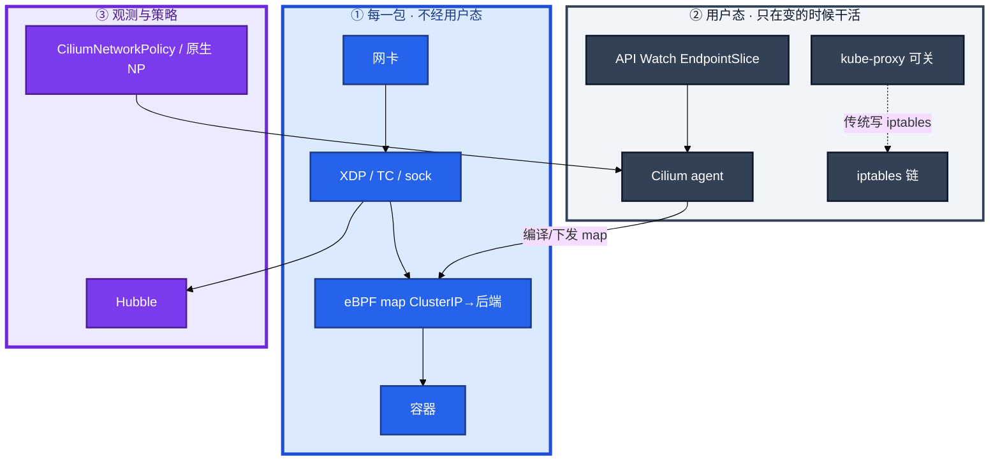
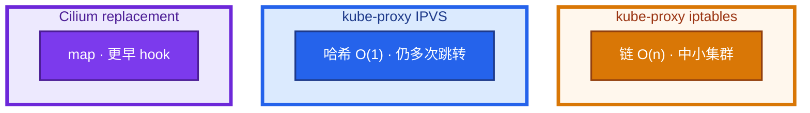
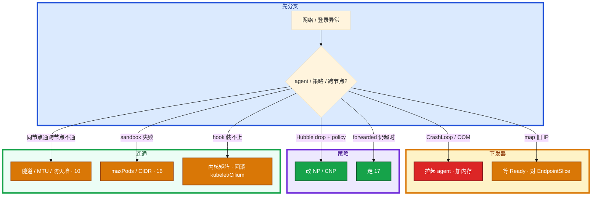

# eBPF 与 Cilium


集群已经 8000 个 Service。有人把 Cilium 讲成「在用户态拦包」。另一人担心 eBPF 会像 ko 一样把机器打挂。某节点 cilium-agent CrashLoop，战斗服还在，新登录失败，有人要重启战斗进程。NetworkPolicy 上线后部分匹配失败，tcpdump 看不清是不是策略 drop。

先别动手。这一章后半全是你会动手的：**要不要换数据面、agent 挂了长连接还在不在、Hubble 怎么看 drop、L7 策略开在哪、关 kube-proxy 之前确认什么。** 前面的概念，是为了让你动手时不说「Cilium 挂了网络全死」。

**本章主线（数据面就按这三步想）：**

1. **认转发**：eBPF 在内核 hook 上跑；agent 只负责下发 map，不经手每一包。
2. **挂了**：存量长连接往往还在，规则不再更新 — 和 kube-proxy 挂了同类。
3. **观测 / 策略**：Hubble 看 drop 和流；L7 策略和原生 NP 分开讲，游戏池分批切 replacement。

**读完你能：** 白板上画出 hook 与 map，不经手每一包；判断 iptables / IPVS / Cilium 谁该上；会 Hubble observe；能把可观测和安全分开讲；游戏池分批切 replacement。

## 本章目录

- [1. 基本概念](#1-基本概念)
- [2. 架构图](#2-架构图)
- [3. 原理](#3-原理)
- [4. 安装部署](#4-安装部署)
- [5. 核心配置](#5-核心配置)
- [6. 命令与操作](#6-命令与操作)
- [7. 生产排障](#7-生产排障)
- [8. 必会 · 常考](#8-必会--常考)
- [合上书](#合上书问自己)

**本章不讲：** kube-proxy 四种模式和 iptables 链 → [08](../08-Service与kube-proxy/)；Calico/Flannel、原生 NetworkPolicy → [10](../10-CNI与网络策略/)；排障分层、Endpoints 空 → [17](../17-排障实战/)；主机 iptables/conntrack → [01-17](../../01-基础底座/17-iptables与conntrack/)；Istio 金丝雀细节 → [14](../14-Ingress与流量管理/)、[15](../15-灰度与回滚/)。不考写 eBPF C 代码。

---

## 1. 基本概念

01 说过：数据包不经过 kube-proxy 用户态，它只负责 **更新** 本机转发规则。Cilium 用 eBPF 把「更新规则」和「转发」都放进内核 hook，不再走漫长的 iptables 链。agent 挂了，和 kube-proxy 挂了同类：**存量往往还在，规则不再更新。**

**值班里什么时候碰到**：Service 上万规则 CPU 涨；NetworkPolicy 上线后部分不通；某节点 agent CrashLoop 新登录失败；关 kube-proxy 后 NodePort 不通。

eBPF 是内核里的可编程虚拟机：在 hook 点跑经过 **verifier** 的程序，不改内核源码、不加载任意 ko。verifier 拒绝越界、死循环、乱调辅助函数，这是能上生产的前提。过不了验证就上不了机，不会当后门 ko 用。不是「内核 JavaScript 随便写」。

| hook（运维相关） | 典型用途 |
|------------------|----------|
| XDP / TC / socket / cgroup | 网络：更早拦包、DNAT、策略 |
| kprobe / uprobe / tracepoint | 观测：系统调用、延迟 |
| LSM | 安全：进程/文件/网络强制 |

Cilium 还是 CNI：配 Pod IP、连通、NetworkPolicy。和 Calico/Flannel 的差别不只「另一种插件」，而是数据面从「路由 + iptables」换成 eBPF。附带 Hubble 和 L7，传统 CNI 要另装。

**打个比方**：iptables 像门卫按名单一个个核对（O(n)）；eBPF map 像刷卡闸机——ClusterIP 直接查表跳到后端 Pod。

> **记住**：转发在内核 hook 上跑，agent 只负责下发；verifier 过不了上不了机。

**面试怎么说**：「Cilium 用 eBPF 在内核 hook 转发，agent 只更新 map 不经手每一包；agent 挂了和 kube-proxy 挂了同类，存量长连接往往还在。」

---

## 2. 架构图

先把整张图钉住。后面 Hubble、replacement、排障都对着这张图说话。



**读图三句话：**

1. **没有箭头从每一包指向 agent**——agent 挂了不等于立刻断光；先拆「已有连接 / 新连接 / Endpoints 已变之后」。
2. **Hubble 依赖同一套 hook**——agent 不健康时观测先瞎，不要说网络全死。
3. **关 kube-proxy 之前** replacement 必须覆盖 ClusterIP / NodePort / 外部流量三种。

三种数据面（装的时候选，挂的时候排障工具不一样）：



小集群 `iptables -L` 还能看。Cilium 这边改看 `hubble observe` 和 agent 日志。为了简历换 CNI 不值得。

---

## 3. 原理

### 3.1 为什么 iptables 会慢

**一句话：** Service×Pod 规则到几万条，iptables 查找 O(n)，Cilium 用 map 在更早 hook 直接 DNAT。

**打个比方**：iptables 像电话簿从 A 翻到 Z 找号码；eBPF map 像通讯录存联系人直接点名字。

**现场走一遍**（大集群 CPU `%si` 涨、尾延迟抖）：

1. 未切 Cilium 的节点：`iptables -t nat -L -n | wc -l`

```text
48231
```

2. 四万多行规则 → kube-proxy 每次 Endpoints 变化整表刷新，软中断涨
3. 对比 Cilium 节点：没有对应长度的 iptables 链，转发在 eBPF map
4. 玩家打大厅 ClusterIP，包到 Worker 网卡后在 sock/TC hook 查 map → 后端 Pod，**不经用户态**

| | 传统 iptables | Cilium eBPF |
|--|---------------|-------------|
| 拦包 | PREROUTING / KUBE-SERVICES | 更早的 sock/TC/XDP |
| 查找 | 按 Service 一条条匹配 | map：ClusterIP → 后端 Pod |
| 谁更新 | kube-proxy Watch 后改链 | agent Watch 后更新 map |
| 这一包经不经用户态 | 不经 | 不经 |

**输出解读**：IPVS 已经把查找变成哈希（08），「已经上了 IPVS 还要不要 Cilium」要另算 Hubble / L7 / 更短路径。老内核程序装不上——选 Cilium 的硬前提（16）。

**面试怎么说**：「iptables 规则随 Service×Pod 线性涨；Cilium 用 eBPF map O(1) 查找；小集群不必为性能换，大集群再评估。」

### 3.2 Hubble：无 sidecar 的流量图

**一句话：** Hubble 在内核看连接和 drop 原因，比 tcpdump 更能指到是哪条策略拒的。

**打个比方**：tcpdump 像路口监控录像——看见车停了不知道谁拦的；Hubble 像带原因码的闸机日志——「policy pay-api-only 拒绝」。

**现场走一遍**（NetworkPolicy 上线后网关连支付超时）：

1. `hubble status` 确认 Relay/UI 正常
2. `hubble observe --type drop -n game --from-pod game/gateway`

```text
TIMESTAMP   SOURCE                    DESTINATION           TYPE   VERDICT   POLICY
14:32:01    game/gateway:45678        game/pay:8080         TCP    DROPPED   pay-api-only
```

3. **drop + policy 名** → 就是这条 CiliumNetworkPolicy 拒的，改策略不要先关 CNI
4. 若 `forwarded` 但应用仍超时 → 网络层过了，回到 17 分层


**输出解读**：

| 你看到的 | 含义 | 下一步 |
|----------|------|--------|
| drop + policy 名 | 就是这条策略拒的 | 改 CNP / 原生 NP |
| forwarded 但应用超时 | 网络层过了 | 走 17 |
| Hubble 没数据 | agent 不健康，观测先瞎 | 先救 agent |

和 Istio sidecar 比：省资源、少一跳。复杂熔断/重试仍不如 Istio。大规模「每个战斗服再加 Envoy」的 CPU 账，Hubble 更对游戏场景。

**面试怎么说**：「Hubble 无 sidecar 看拓扑和 policy drop；drop 带策略名就改 NP，forwarded 仍超时走 17 分层。」

> **记住**：Hubble 无 sidecar 看拓扑和 policy drop；没 Hubble 就退回 17 的分层。

### 3.3 eBPF：可观测 vs 安全

**一句话：** 网络数据面、Hubble 观测、LSM 安全是三条产品线，「上了 eBPF」不等于「安全了」。

**打个比方**：Cilium 像高速公路（转发）；Hubble 像路侧摄像头（看见发生了什么）；Tetragon 像交警（拦住违章）——摄像头不等于交警。

**现场走一遍**（老板问「上了 eBPF 还要 RBAC 吗」）：

1. **网络**：Cilium 做 DNAT + NetworkPolicy → 管包往哪走
2. **可观测**：Hubble 记录连接、延迟、drop → **默认不拦截**
3. **安全**：Tetragon/Falco 用 LSM 拦 exec、读密钥 → 和 13 RBAC、03 准入是两层
4. Hubble 看到 drop 多半是 NetworkPolicy；Tetragon 拦住的是「容器不该 exec」

| 方向 | 做什么 | 典型 | 不是什么 |
|------|--------|------|----------|
| **网络数据面** | LB、DNAT、NetworkPolicy | Cilium | 不是 WAF |
| **可观测** | 连接、延迟、drop 原因 | Hubble | 不是 SLO 本身（18） |
| **运行时安全** | 进程执行、文件、syscall | Tetragon / Falco | 不是替代 RBAC/准入（13） |

**输出解读**：verifier 保证程序不把内核打挂，**不保证**策略写对了。战斗服全量 syscall 跟踪是税；支付/GM 节点更值得。

**面试怎么说**：「eBPF 分网络、观测、安全三条线；Hubble 是看见，LSM 是拦截，不能代替 RBAC。」

### 3.4 L7 策略：比原生 NP 多一层

**一句话：** 原生 NP 只到端口；Cilium L7 能在端口上再限 HTTP method/path，只给敏感路径开。

**打个比方**：原生 NP 像「这扇门只能进」；L7 像「进了门只能走收银台那条过道」。

**现场走一遍**（支付网关只该收 POST /v1/charge）：

1. 应用 CiliumNetworkPolicy `pay-api-only`（见 §5 示例）
2. 网关误发 GET：`hubble observe --from-pod game/gateway --to-pod game/pay`

```text
VERDICT   L7 INFO
DROPPED   HTTP GET /v1/charge denied by pay-api-only
```

3. 改网关只发 POST → forwarded
4. 战斗服 UDP 心跳 **不要** 开 L7 解析——CPU 不划算

```yaml
apiVersion: cilium.io/v2
kind: CiliumNetworkPolicy
metadata:
  name: pay-api-only
spec:
  endpointSelector:
    matchLabels: { app: game-pay }
  ingress:
    - fromEndpoints:
        - matchLabels: { app: game-gateway }
      toPorts:
        - ports: [{ port: "8080", protocol: TCP }]
          rules:
            http:
              - method: POST
                path: "/v1/charge"
```

**输出解读**：sidecarless Mesh 做基础 L7 可见与策略；完整 Service Mesh 治理仍选 Istio（14/15）。Cilium Gateway API 是南北向，和东西向 eBPF 策略是两层。不要把 SQL SELECT 写成 http method。

**面试怎么说**：「L7 策略按需开在支付/GM；战斗心跳只到端口；Hubble 能打出 policy 名和 HTTP path。」

> **记住**：L7 策略按需开在敏感路径；战斗服心跳全量解析通常不划算。

---

## 4. 安装部署

生产怎么选：

| 项 | 选 | 不选 |
|----|----|------|
| 节点少、NP 只到端口、内核老 | Calico/Flannel + kube-proxy | 为简历全面 eBPF |
| 规则爆炸、要 Hubble、要 L7、延迟敏感 | Cilium eBPF | 小集群交调试税 |
| 已有 Istio 重治理 | 并存评估，职责写清 | 为了 Mesh 再换 CNI |
| 已有 IPVS | 按 Hubble/L7/更短路径加税 | 「IPVS 不能用」 |

落地硬前提：内核够新，对 Cilium 兼容矩阵（16）。eBPF 程序比 iptables 难一眼看懂；升级要匹配内核能力。

验收：Hubble 能 observe；ClusterIP / NodePort / 外部流量在 replacement 下测过再关 kube-proxy。不要只测 ClusterIP。很多登录走 Ingress/LB（14），NodePort 仍在的节点上要单独测。

---

## 5. 核心配置

| 项 | 生产怎么用 | 改错会怎样 |
|----|------------|------------|
| kube-proxy-replacement | 覆盖三种流量再关 kube-proxy | NodePort 不通 |
| Hubble | 开；L7 可见性按需 | 全开吃 CPU |
| L7 policy | 支付/GM/管理 Kafka | 心跳全量解析 |
| agent 内存 | OOM 先给 agent 加，不给战斗服加 | CrashLoop，map 不更新 |
| Host 防火墙 | 不要和 eBPF 抢 | 外部流量黑盒 |
| 兼容矩阵 | kubelet / 内核 / Cilium 一张表 | hook 装不上 |

> **记住**：回滚 replacement 是重新拉起 kube-proxy，不是重启业务。

---

## 6. 命令与操作

### 6.1 命令速查

```bash
kubectl -n kube-system get ds,po -l k8s-app=cilium
kubectl -n kube-system describe po cilium-<node>
hubble status
hubble observe -f
hubble observe --type drop -n battle
hubble observe --from-pod game/hall
kubectl get ciliumnetworkpolicy -A
kubectl get endpointslice -n game
iptables -t nat -L -n | wc -l    # 小集群对照；replacement 后几乎帮不上
```

| 目的 | 看什么 |
|------|--------|
| agent | CrashLoop / OOMKilled |
| Hubble drop | policy 名、L7 path |
| 后端是否追上 | EndpointSlice vs observe 的目的 IP |
| 规则规模 | iptables 行数（未切 Cilium 时） |

指标：agent ready；转发 P99；drop 率；Hubble 有无数据。agent 不健康时观测先瞎。

没有 Hubble 时仍走 17 的分层：localhost → EP → ClusterIP → 跨节点。

跨节点不通先怀疑 CNI（10），不要一上来重装 Cilium。小集群 `iptables -L` 还能排；切了 replacement 后这条链路几乎帮不上忙。

### 6.2 kube-proxy-replacement

确认 Cilium 已覆盖原 kube-proxy 的 ClusterIP/NodePort/外部流量模式，内核与配置支持 replacement，Host 防火墙没有和 eBPF 抢。分批：先观察 Hubble 和延迟，再关 DaemonSet。回滚是重新拉起 kube-proxy 并关 replacement，不是重启业务。关了之后 NodePort 不通——replacement 没覆盖全。先核对流模式，再分批回滚 kube-proxy，不要先重启游戏进程。

### 6.3 游戏集群落地


注意点：

1. **agent 挂了 ≈ 规则不更新。** 存量长连接往往还在；新登录、重连、滚动后旧后端会出问题。拉起 agent，核对 EndpointSlice。不要先重启战斗服。
2. **战斗服最后切。** 先非战斗池、再大厅、再战斗窗口。
3. **L7 不要打在心跳上。** 支付/GM 开；UDP/心跳只到端口。
4. **Hubble 代替每 Pod Envoy** 做东西向看见。完整金丝雀仍走 15。
5. **maxPods 和每节点 CIDR 没一起改**，FailedCreatePodSandBox 看起来像 CNI 坏了，其实是 16。

活动扩容滚动后，某节点 cilium-agent OOM。已在对局的长连接还在，新匹配进这节点失败。拉起 agent 后 Hubble 看到后端 map 追上 EndpointSlice。若当时重启战斗服，等于自己踢完还活着的玩家。

---

## 7. 生产排障

不要答「Cilium 挂了网络全死」。先拆三问：已有连接、新连接、Endpoints 已变之后。userspace 转发早已废弃（08）；谁当「规则下发器」，谁挂了都是「不再更新」。



现场顺序：

```bash
kubectl -n kube-system describe po cilium-<node>
kubectl get endpointslice -n game
hubble observe --type drop -n battle
hubble observe --from-pod game/hall
```

| 现象 | 先做什么 | 不要做什么 |
|------|----------|------------|
| agent CrashLoop，长连接还在 | 拉起 agent | 重启战斗进程 |
| 新登录失败、observe 旧 IP | 等 map 追上 | 先删 Pod「刷新」 |
| drop + policy | 改策略 | 先关 CNI |
| forwarded 仍超时 | 17 分层 | 重装 Cilium |
| 关 kube-proxy 后 NodePort 死 | 核对流模式，回滚 kube-proxy | 重启游戏 |
| sandbox 失败 | maxPods / CIDR | 当 eBPF 程序挂了 |
| 升级 kubelet 后 hook 装不上 | 按矩阵回滚 | 先卸 CNI |
| Hubble 没数据 | 先救 agent | 说网络全死 |

和 etcd 挂了不能发版、但长连接还在，是同一套拆法（01）。

---

## 8. 必会 · 常考

白板和追问高频，能一口回：

| 说法 | 对错 | 口径 |
|------|:----:|------|
| Cilium 在用户态拦每一包 | 错 | 转发在 hook；agent 只下发 |
| eBPF 等于乱加载 ko | 错 | verifier 过不了上不了机 |
| 小集群必须上 Cilium | 错 | 规则不多不必交调试税 |
| 上了 IPVS 就不能用 Cilium | 错 | 理由变成 Hubble/L7/更短路径 |
| agent 挂了游戏长连接立刻死 | 错 | 存量往往还在；规则不再更新 |
| Hubble 必须插 sidecar | 错 | 内核看流，不改应用 |
| 有 Hubble 就不用 17 | 错 | forwarded 仍超时要分层 |
| 有 eBPF 就安全了 | 错 | 观测 ≠ LSM 拦截 ≠ RBAC |
| L7 对战斗心跳全开 | 错 | 只给敏感路径；按真实协议 |
| sidecarless 能替代 Istio 金丝雀 | 错 | header 切 5% 仍是 14/15 |
| 关 kube-proxy 只测 ClusterIP | 错 | NodePort / 外部流量也要覆盖 |
| 回滚 replacement 靠重启业务 | 错 | 重新拉起 kube-proxy |
| FailedCreatePodSandBox 一定是 Cilium | 错 | 先看 maxPods / CIDR |
| Gateway API 和东西向策略是一回事 | 错 | 南北 vs 东西两层 |
| 为简历换 CNI | 错 | 内核版本和调试是税 |

数字：iptables 规则随 Service×Pod 涨；verifier 是硬门槛；L7 按需；战斗池最后切。

易混：agent 挂 vs 数据面死；iptables vs IPVS vs eBPF map；Hubble drop vs 应用超时；可观测 vs 运行时安全；原生 NP vs Cilium L7；kube-proxy 下发 vs Cilium 下发（影响面同一张图）。

---

## 合上书，问自己

1. eBPF 为什么比乱加载 ko 安全？转发经不经 agent？
2. iptables / IPVS / Cilium 各解决哪一段？小集群要不要换？
3. agent 挂了三句影响面？为什么不能先重启战斗服？
4. Hubble 能看到什么？drop 和 forwarded 分别下一步？
5. 可观测和安全差在哪？L7 开在支付还是心跳？
6. 关 kube-proxy 前确认什么？游戏池分批怎么走？

六题都能口述，K8s 这一卷的数据面就接到内核 hook 上了。回头用 01 的三问把 etcd、控制器、kube-proxy、Cilium agent 串成同一张「还在 / 已停」图。
