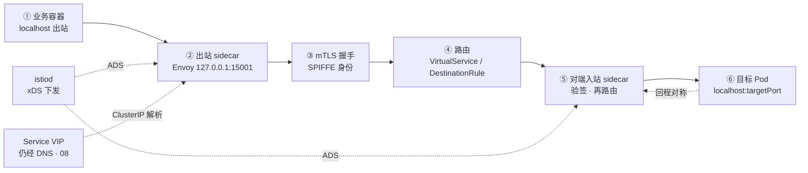
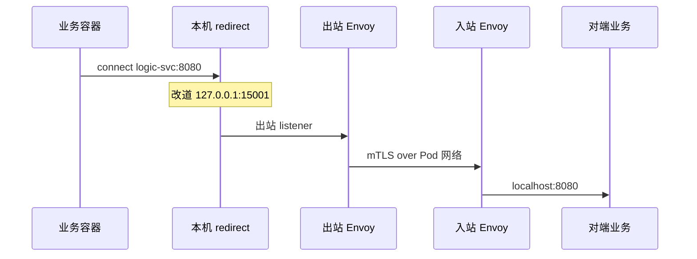
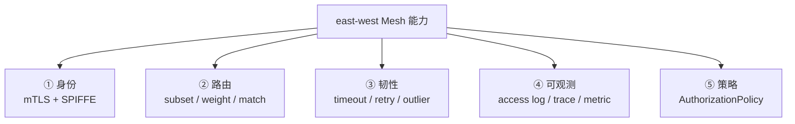
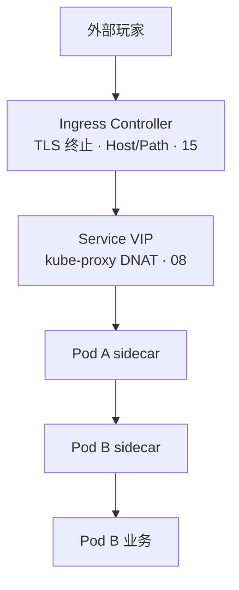
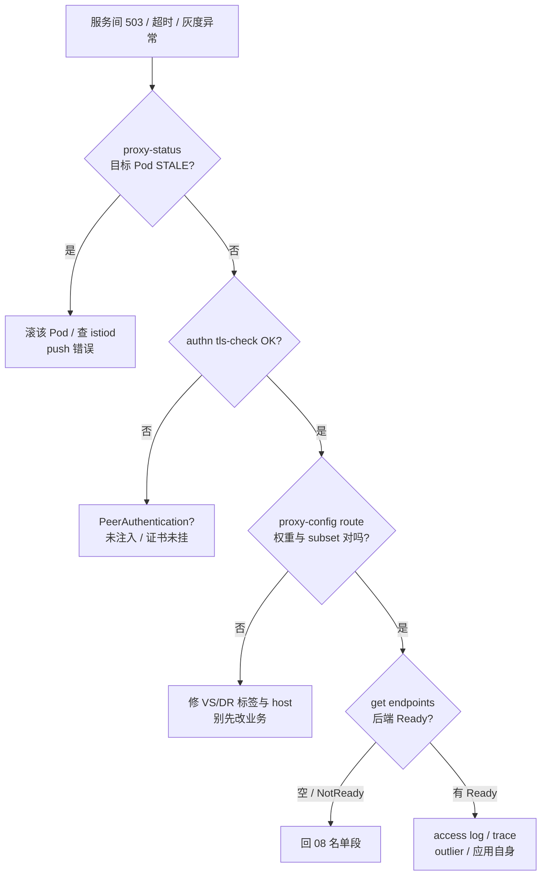

# Service Mesh：Istio 与 Envoy

> 大厅灰度 10% 后错误率飙红——有人要「把 Istio 卸了先止血」，另一人坚持「业务代码肯定没问题」；`istioctl proxy-status` 里某个 Pod 的 `CDS` 还是 `STALE`；同时战斗长连接全走七层 Ingress 被 reload 掐断。手都别动。
> **本章回答**：一条 east-west 请求经 Mesh 的一生——sidecar 在哪截获、mTLS 何时握手、路由与金丝雀谁说了算、和 Service / Ingress 的边界、代价大到什么程度、什么时候根本不该上。
> **不讲**：kube-proxy 四种模式 → [08](../08-Service与kube-proxy/)；Ingress Controller 与证书 → [15](../15-Ingress与流量管理/)；无 sidecar 的 eBPF Mesh → [25](../25-eBPF与Cilium/)；发布回滚 RTO → [16](../16-灰度与回滚/)；NetworkPolicy → [10](../10-CNI与网络策略/)。

**标记**：🎯重点 · 🔥难点 · ⭐常考 · 🔧实操

---

## 一、一张图：一条服务间请求的一生

> 🎯 **一句话**：集群内一次 east-west 调用走六段——出站截获 → 身份握手 → 路由决策 → 对端入站 → 后端 Pod → 回程对称；卡住必在其中一段。口诀：⭐ **副本比 ≠ 流量比**。



- 📖 **读图**
  - 🛤️ 主线是 **east-west（东西向，集群内服务互调）**：业务以为连 `logic-svc:8080`，实际先被本 Pod **sidecar（边车代理）** 截到 `127.0.0.1:15001`，再经 mTLS 打到对端 sidecar，最后才进目标容器
  - 📜 **istiod 不转发包**——只通过 **xDS**（`CDS`/`EDS`/`RDS`/`LDS`）推规则。排障各照一段：`proxy-status` 看 STALE、`authn tls-check` 看 mTLS、`proxy-config route` 看权重、`get endpoints` 看后端

> 💡 **打个比方**：Mesh 像每个员工配一个同声传译——你说中文（明文 HTTP），传译员对外一律加密外语（mTLS），还能按老板指令把 10% 电话转给新员工（金丝雀）；传译员自己也要占工位和午饭（CPU/内存）。

本节对应练习题 Q1、Q2。

---

## 二、截获：sidecar 模型怎么挂上

> 🎯 **一句话**：Istio 默认 **sidecar 注入**——每个 Pod 多一个 Envoy，靠 **iptables（或 CNI eBPF redirect）** 把进出流量劫持到本地代理。

### 🧩 数据面与控制面 ⭐🔧

- **数据面（data plane）** = Envoy（容器名常叫 `istio-proxy`）
- **控制面（control plane）** = **istiod**（合并了 Pilot / Citadel / Galley）——只下发配置与证书，**不碰业务包**
- 注入后常见：`istio-proxy` + 可选 `istio-init`（写 redirect 规则的一次性 init）



- 📖 **读图**
  - 业务 **无感改代码**——仍用 Service 名；DNS 仍走 [09](../09-CoreDNS/)
  - 劫持在 **Pod 网络命名空间内**，与节点级 [08](../08-Service与kube-proxy/) VIP DNAT **叠加**：先 kube-proxy 转到某 Pod IP，再进该 Pod sidecar。Mesh 管的是 **Pod 边界之后**，不是替代 Service

#### ❓ 为什么「给 Deployment 加个容器」不算注入成功？

- ❌ 手抄一个 `istio-proxy` 容器 ≠ Mesh——还缺 redirect、证书卷、就绪探针（`15021/healthz/ready`）、与 istiod 的 xDS 长连接
- ✅ 生产最常见：**命名空间标签**自动注入；已存在 Pod 必须滚动重建才长出 sidecar
- 🔥 漏 `holdApplicationUntilProxyStarts` → 「业务先 Ready、代理未就绪」→ 503 风暴（六节展开）

```bash
kubectl label namespace game istio-injection=enabled --overwrite
kubectl get ns game --show-labels
# istio-injection=enabled     ← 新建 Pod 自动注入；存量要滚动

kubectl get pod -n game lobby-7d9f-abc12 -o jsonpath='{.spec.containers[*].name}{"\n"}'
# lobby istio-proxy              ← 两个容器才算注入成功
```

> ⚠️ **别混**：sidecar 注入 ≠ 普通 sidecar 容器手抄。漏 init / 证书 / 就绪探针，排障会变成「业务明明起来了却全 503」。

### 🌬️ Ambient（一句）

Istio **Ambient** 把 L4 下沉到节点 **ztunnel**，L7 按需 **waypoint**——从「每 Pod 一个 Envoy」变成「每节点/命名空间少量代理」。与 [25](../25-eBPF与Cilium/) 内核 map 是不同路线。本章默认 **经典 sidecar**；面试知道「sidecar 贵 → Ambient / Cilium 是方向」即可。

本节对应练习题 Q1、Q13。

---

## 三、握手：mTLS 与身份

> 🎯 **一句话**：Mesh 可开 **STRICT mTLS（双向 TLS）**——身份是 **SPIFFE** 格式的 **SVID**，由 istiod 签发并轮换。

### 🔐 PeerAuthentication 三模式 🔥⭐

**PeerAuthentication（对等认证策略）** 决定「谁必须跟谁加密聊」：

```yaml
apiVersion: security.istio.io/v1beta1
kind: PeerAuthentication
metadata:
  name: default
  namespace: game
spec:
  mtls:
    mode: STRICT   # DISABLE | PERMISSIVE | STRICT
```

| 模式 | 行为 |
|------|------|
| **DISABLE** | 不强制 mTLS，明文也可 |
| **PERMISSIVE** | 既接受 mTLS 也接受明文；**迁移期**用 |
| **STRICT** | 只接受 mTLS；未注入 sidecar 的 Pod 会被拒 |

#### ❓ 为什么 PERMISSIVE 不能当长期目标？

- 🎭 像「双语柜台」——旧服务好接入，但审计上**仍可能走明文**
- ✅ 灰度迁完应推到 `STRICT`；长期卡在 PERMISSIVE = 零信任口号落空
- 🪪 身份不在业务证书里手写：Envoy 自动拿 istiod 签的 workload 证，SAN 形如 `spiffe://cluster.local/ns/game/sa/lobby`

> 🔍 **现场**：两服务之间是否已 mTLS。

```bash
istioctl authn tls-check lobby-7d9f-abc12.game logic-svc.game.svc.cluster.local
# HOST:PORT                                    STATUS     SERVER     CLIENT
# logic-svc.game.svc.cluster.local:8080        OK         TLSv1_3    TLSv1_3
#                                              ↑ OK = 双向 mTLS 已建立

istioctl proxy-config secret lobby-7d9f-abc12.game -o json | jq '.[].secret.tlsCertificate.certificatePath'
# /etc/certs/cert-chain.pem    ← sidecar 自动挂载的轮换证书
```

> ⚠️ **别混**：**Mesh mTLS ≠ Ingress TLS**。Ingress 管 **north-south（南北向）** HTTPS 终止；PeerAuthentication 管 **east-west** 互调。大厅 HTTPS 在 Ingress，战斗服调逻辑服走 sidecar mTLS——两层各管各的（五节）。

> 📝 **面试**：「istiod 做 CA，经 xDS 下发证书；PeerAuthentication 设 STRICT 后，无 sidecar / 证书未就绪就调不通。身份是 SPIFFE ID，不是业务自己塞的 TLS 证书。」

本节对应练习题 Q3、Q11。

---

## 四、路由：VirtualService 与流量切分

> 🎯 **一句话**：**VirtualService** 决定「流量怎么分」；**DestinationRule** 决定「后端有哪些版本、怎么均衡」。

### ✂️ 金丝雀三件套 ⭐🔧

🔥 高频错答：「副本 1:9 就是 10% 灰度」。Mesh 里流量比看 **VirtualService weight**，副本比只影响容量。

```yaml
apiVersion: networking.istio.io/v1
kind: DestinationRule
metadata:
  name: logic-dr
  namespace: game
spec:
  host: logic-svc
  subsets:
  - name: v1
    labels: { version: v1 }
  - name: v2
    labels: { version: v2 }
---
apiVersion: networking.istio.io/v1
kind: VirtualService
metadata:
  name: logic-vs
  namespace: game
spec:
  hosts: [logic-svc]
  http:
  - route:
    - destination: { host: logic-svc, subset: v1 }
      weight: 90
    - destination: { host: logic-svc, subset: v2 }
      weight: 10
```

#### ❓ 为什么副本 1:9 不等于 10% 流量？

- ❌ kube-proxy / Endpoint 随机 **不懂版本**——副本少只让旧版更容易过载，不自动等于少流量
- ✅ 切流三件套：Pod **label** → DestinationRule **subset** → VirtualService **weight**
- 🗺️ 大厅 HTTP 金丝雀也可在 [15](../15-Ingress与流量管理/)；**服务间**灰度用本章 API（[16](../16-灰度与回滚/)）

- 📖 **读图（YAML）**：`DestinationRule` 先分 subset；`VirtualService` 再按 weight 切。权重总和通常 **100**；subset 标签对不上 = 流量打空或全进默认

### 🛡️ 超时、重试与熔断 🔥

Mesh 把 **韧性（resilience）** 从业务 SDK 抽到数据面——同一套策略对所有语言生效：

```yaml
# VirtualService 片段
http:
- timeout: 2s
  retries:
    attempts: 3
    perTryTimeout: 800ms
    retryOn: connect-failure,refused-stream,503
  route:
  - destination: { host: logic-svc, subset: v1 }
```

**DestinationRule** 还可配 **outlierDetection（异常点检测）**——连续 5xx 把某 Pod 踢出负载池一段时间：

```yaml
spec:
  trafficPolicy:
    outlierDetection:
      consecutive5xxErrors: 5
      interval: 10s
      baseEjectionTime: 30s
      maxEjectionPercent: 50
```

#### ❓ 为什么 Mesh retry 不能当「业务幂等」？

- ❌ 非幂等写接口开重试 → **双写**（充值 POST 最惨）
- ✅ POST 类要在 VS 关 retry，或业务做 **idempotency key**
- ⏱️ `timeout` = 整条路由预算；`perTryTimeout` = 单次上限——配反会出现「总超时 2s、单次重试 5s」的无效配置
- 🧹 outlier 踢的是 **具体 Pod IP（EDS）**，不是 Deployment 名；Pod 重建后黑名单自动刷新

常见高级：`match` 按 header/cookie 定向；`fault` 注入延迟/错误做混沌——**别让每门语言各写一套重试**。

> 🔍 **现场**：路由没生效先看 xDS 是否同步。

```bash
istioctl proxy-status
# NAME              CDS        LDS        EDS        RDS
# lobby-7d9f-abc12  SYNCED     SYNCED     SYNCED     SYNCED
# logic-bad-xyz     STALE      SYNCED     STALE      SYNCED
#                   ↑ STALE = 配置落后，金丝雀权重可能还是旧的

istioctl proxy-config route lobby-7d9f-abc12.game --name 8080 -o json \
  | jq '.[].route.virtualHost.routes[].route.weightedClusters'
# 应看到 v1:90 / v2:10；对不上 = host/subset 绑错
```

### 收束：Mesh 在 east-west 管什么 🎯⭐



- 📖 **读图**
  - ①② 面试高频；③ 抽走横切关注点；④ 自动 golden metrics，配合 [19](../19-监控与可观测性/)
  - ⑤ **AuthorizationPolicy** 做 L7 允许/拒绝，比纯 NetworkPolicy 细，但 **不能替代** [10](../10-CNI与网络策略/) 的 L3/L4 兜底

> ⚠️ **别混**：VirtualService 权重 ≠ Deployment 副本比例——副本 1:9、权重 50:50，流量仍一半进旧版。

> 📝 **面试**：「切流三件套：label → DR subset → VS weight；排障先看 proxy-status 是否 STALE，再看 route。」

本节对应练习题 Q4、Q8。

---

## 五、边界：Mesh、Service、Ingress 各管哪段

> 🎯 **一句话**：**Service + kube-proxy** 管 VIP→Pod IP（L4）；**Ingress** 管外部 HTTPS→Service（north-south L7）；**Mesh** 管 Pod↔Pod（east-west L7/L4+mTLS）——三层叠加，不是谁替代谁。



- 📖 **读图**
  - 从外到内：Ingress 只处理 **进集群第一跳**；进 Pod 后的互调不再经 Ingress Controller
  - 战斗 **长连接 TCP** 应走 L4 NLB / TCPRoute（[15](../15-Ingress与流量管理/)），**不要**塞进 HTTP Ingress 再指望 Mesh 救——七层 reload 会掐连接

| 对比 | Service / kube-proxy | Ingress | Service Mesh |
|------|----------------------|---------|--------------|
| 方向 | 集群内 VIP → Pod | 外部 → Service | Pod ↔ Pod |
| 层 | L4 DNAT | L7 HTTP(S) | L4 mTLS + L7 路由 |
| 金丝雀 | 不支持权重 | Controller 实现 | VS weight |
| 身份 | 无 | 边缘 TLS | 每跳 workload 身份 |

#### ❓ 为什么上了 Istio 也不能删 Ingress？

- ❌ 「Mesh 已接管一切」——外部玩家仍要 **north-south 入口**
- ✅ Ingress（或 Gateway API）管进门；Mesh 管门内互调
- ⚠️ 「Ingress 做了 mTLS」通常只到 Ingress Pod——**服务间**仍明文，除非 Mesh 或业务自建 TLS

本节对应练习题 Q5、Q10。

---

## 六、策略与观测：AuthorizationPolicy 与 telemetry

> 🎯 **一句话**：**AuthorizationPolicy** 在 mTLS 身份之上做 L7 允许/拒绝；**telemetry** 由 Envoy 自动吐 metric/trace/access log，采样率没调好存储先炸。

### 🛂 L7 授权 ⭐

mTLS 解决「你是谁」；AuthorizationPolicy 解决「你能调谁」：

```yaml
apiVersion: security.istio.io/v1beta1
kind: AuthorizationPolicy
metadata:
  name: logic-allow-lobby
  namespace: game
spec:
  selector:
    matchLabels: { app: logic }
  action: ALLOW
  rules:
  - from:
    - source:
        principals: ["cluster.local/ns/game/sa/lobby"]
    to:
    - operation:
        methods: ["POST"]
        paths: ["/api/v1/*"]
```

#### ❓ 为什么 AuthorizationPolicy 不能替代 NetworkPolicy？

- 🪪 `principals` 来自 peer 的 SPIFFE ID——比「允许 10.0.0.0/8」精确，但是 **L7**
- 🧱 [10](../10-CNI与网络策略/) NetworkPolicy 管 **L3/L4 兜底**（连不连得上）；Authz 管「连上了能不能调这个 path」
- 🚫 `DENY` 优先于 `ALLOW`；没有默认拒绝时未命中可能仍放行——生产常用「默认 DENY + 白名单」，要分批上线，否则全站 403

> 🔍 **现场**：403 且 mTLS OK，查授权。

```bash
istioctl authz check logic-7d9f-abc12.game -n game
kubectl logs logic-7d9f-abc12 -c istio-proxy --tail=20 | grep RBAC
# rbac: denied POST /api/v1/login    ← Envoy RBAC 过滤器拒绝
```

### 📊 黄金指标与 trace 🔧

- Envoy 自动吐 `istio_requests_total`、`istio_request_duration_milliseconds` 等，标签含 `source_app` / `destination_service_name` / `response_code`
- 抓取：`15020/stats/prometheus` 或 Telemetry API
- Trace 靠 **W3C tracecontext** / **B3** 在 sidecar 间传播；采样率默认约 1%，活动高峰要下调，否则 Jaeger 比游戏服先 OOM
- 排障用 `proxy-config` 子命令，别整包 `config_dump` 砸笔记本

### 🚦 启动顺序：holdApplicationUntilProxyStarts 🔧

```yaml
metadata:
  annotations:
    proxy.istio.io/config: |
      holdApplicationUntilProxyStarts: true
```

#### ❓ 为什么业务 Ready、sidecar 未 Ready 会炸 503？

- kubelet 已把流量打进 Pod，Envoy 还没接好 xDS / listener → **启动尖刺**
- ✅ 开 `holdApplicationUntilProxyStarts`；sidecar `15021/healthz/ready` 未过前业务不应接流量（配合 [04](../04-Pod生命周期/)）

```bash
kubectl describe pod lobby-7d9f-abc12 -n game | grep -A3 'Containers:'
# lobby: Ready True
# istio-proxy: Ready True   ← 两个都 Ready 再信 Endpoints
```

### 🔌 非 HTTP：TCP / gRPC / UDP

- VS 除 `http` 外还有 `tcp`——战斗长连接若走 Mesh（少见），用 **tcp match + route**，不能套 HTTP timeout/retry
- gRPC 按 **HTTP/2** 处理，可设 per-method timeout
- 🎮 **游戏战斗 UDP** 一般 **不进 Mesh**，走 hostNetwork 或独立网关

本节对应练习题 Q9、Q12。

---

## 七、代价：sidecar 为什么贵

> 🎯 **一句话**：每个 Pod 多一个 Envoy——**CPU / 内存 / Latency / Pod 密度 / 启动时序** 全付税；小集群或低 QPS 往往 ROI 为负。

### 💰 资源账 ⭐🔥

```text
每 sidecar 常驻：~100–150m CPU request，~128–256Mi 内存 request
每 Pod 容器数↑：调度碎片、IP、conntrack 上涨
每跳延迟：多 1–3ms（TLS + 用户态代理）；P99 敏感路径要实测
```

- 🎮 **游戏服**：战斗 Pod **QPS 极高、包体小、延迟敏感** → sidecar 税可能直接吃预算；大厅 HTTP / GM / 微服务链更适合
- 📈 活动高峰 **HPA 扩 Pod = 同步扩 sidecar**，集群成本近似 **×2**

> 💡 **打个比方**：给每个士兵配盾牌——巷战（多团队微服务）很值；开阔地单人狙击（单体 + 低互调）盾牌只挡视线。

### 🧰 运维复杂度

- 升级 istiod / Envoy 要与业务发布协调；`proxy-status STALE` 是常见 P1
- 可观测性双份：`istioctl` + `kubectl`；采样率没调好 Jaeger 先爆
- **istiod 挂了**：存量连接常在，**新 Pod 拿不到配置**——与 kube-proxy 挂了「规则不更新」同类（[08](../08-Service与kube-proxy/)）
- 调试路径变长：`curl` 进业务容器看到的 ≠ 经 Envoy 后的真实路由

> 📝 **面试**：「成本 = 每 Pod 一份 Envoy + 每跳延迟 + 运维复杂度；数百微服务、多语言、强 mTLS/统一灰度才划算；两三个服务用 NetworkPolicy + Ingress 就够。」

### 🚪 Gateway API（一句）

Istio 1.16+ 可作 **Gateway API** 实现（`GatewayClass: istio`），把 north-south 也纳入同一控制面。与 [15](../15-Ingress与流量管理/) 传统 Ingress 并存期很长——east-west 仍靠 VirtualService。

### 📜 Envoy access log 读法 🔧

```bash
kubectl logs lobby-7d9f-abc12 -c istio-proxy --tail=5
# "POST /api/v1/login HTTP/2" 503 UF,URX upstream_reset_before_response_started{connection failure}
# UF = Upstream connection failure → 对端 sidecar Ready？mTLS STRICT？
# 200 但延迟高：看 duration 与 upstream_service_time

istioctl analyze -n game
# 未绑定 Gateway 的 VS、subset 标签不存在等 → Info/Error
```

本节对应练习题 Q6。

---

## 八、抉择：什么时候不要上 Mesh

> 🎯 **一句话**：**服务少、团队小、延迟极敏感、或已有成熟发布链** 时，Mesh 往往是过度工程。

### 🛑 明确不该上的信号 ⭐

1. 互调简单：小于约 10 个服务，[16](../16-灰度与回滚/) 滚动 + [15](../15-Ingress与流量管理/) Ingress 金丝雀就够
2. 延迟预算极紧：战斗互调 P99 小于 5ms，多一跳不可接受
3. 语言/框架无法注入，或 TLS 拖垮老运行时
4. 没人会 `istioctl`、没人盯 istiod HA
5. 已有等价能力：Cilium L7 + Hubble（[25](../25-eBPF与Cilium/)）或云厂商 MSF
6. DaemonSet / HostNetwork 战斗服：sidecar 冲突或破坏网络模型

### ✅ 适合上的信号

- 多团队、多语言，要统一 mTLS / 重试 / 限流 / trace
- 细粒度灰度必须发生在 **服务间**（不只入口 HTTP）
- 合规要求零信任 east-west
- Pod 规模上千，横切策略不愿每个 repo 复制粘贴

| 对比 | 先不上 Mesh | 值得评估 Mesh |
|------|-------------|---------------|
| 服务数 | 个位数～十几个 | 数十～数百 |
| 灰度点 | 仅入口 HTTP | 服务链每跳 |
| 团队 | 单团队全栈 | 多团队多语言 |
| 延迟 | 极敏感战斗路径 | 大厅/后台为主 |

### 🔧 安装与升级（值班边界）

```bash
istioctl install --set profile=default -y    # 生产调资源，别用 demo
istioctl verify-install
kubectl -n istio-system get pods
# istiod Running；ingressgateway 若装了也应 Ready
```

- 升级顺序：**istiod 先、数据面后**——再滚动业务 Pod 让 Envoy 跟上
- `istioctl revision` 支持 **canary control plane**：新 istiod 与旧 revision 并存，按 ns 标签 `istio.io/rev` 分批迁

> ⚠️ **别混**：`istioctl uninstall` **不会**自动删业务 ns 里的 sidecar——卸载后 Pod 仍带死代理，要滚动重建或去掉注入标签。

本节对应练习题 Q6、Q13。

---

## 九、作战：定责

> 🎯 **一句话**：east-west 故障先分 **配置（STALE）/ 身份（mTLS）/ 路由（subset）/ 后端（Endpoints）** 四段，再决定动 Mesh 还是动业务。

### 🗺️ 决策树



#### ❓ 为什么 STALE 时改 VirtualService 白搭？

- 📜 Envoy 配置没同步，怎么改 YAML 数据面还在跑旧权重 / 旧 EDS
- ✅ **STALE 优先**——滚 Pod 或查 istiod 资源与 push 错误；再谈调权
- 🪪 mTLS 失败常见：ns 没注入，或 `PERMISSIVE`/`STRICT` 混用
- 📭 Endpoints 空永远先查 [08](../08-Service与kube-proxy/)——Mesh 不会 magically 造后端

- 📖 **读图**：先问配置同步？→ 身份？→ 路由？→ 名单？——别跳到「卸 Istio」。

### 现象 · 先做 · 别做

| 现象 | 先做 | 别做 |
|------|------|------|
| 灰度后错误率升 | `proxy-status` + route weight + 应用日志 | 未验证权重就卸 Istio |
| `certificate verify failed` | `tls-check` + PeerAuthentication | 全局改 DISABLE |
| 新 Pod 启动风暴 503 | `holdApplicationUntilProxyStarts` + 就绪探针 | 关掉 sidecar 注入 |
| 仅跨命名空间失败 | AuthorizationPolicy + mTLS 模式 | 怀疑 kube-proxy |
| 外部玩家断连 | Ingress reload / 是否误走七层 | 调 VirtualService |
| istiod OOM | 扩 istiod、降推送量、分片 | 全集群重启业务 Pod |

### 60 秒剧本 🔧

```text
① 0–10s   kubectl get endpoints -n {ns} <svc>
          istioctl proxy-status | grep -E 'STALE|NOT SENT'
② 10–30s  istioctl authn tls-check <src-pod> <dst-host>
          proxy-config route 看 subset/weight
③ 30–45s  定型：STALE→滚 Pod/istiod；mTLS→注入与 PA；路由→VS/DR；Endpoints 空→08
④ 45–60s  验证：错误率、access log 200 比例；调权前确认 STALE 清零
```

本节对应练习题 Q7、Q8、Q14。

---

## 十、收口

### 命令速查 🔧

```bash
# 注入与身份
kubectl label namespace {ns} istio-injection=enabled --overwrite
istioctl authn tls-check {pod}.{ns} <svc>.{ns}.svc.cluster.local
istioctl proxy-config secret {pod}.{ns}

# 配置与路由
istioctl proxy-status
istioctl proxy-config route {pod}.{ns} --name <port> -o json
istioctl proxy-config cluster {pod}.{ns} -o json | grep -A5 <svc>

# 排障
kubectl logs {pod} -c istio-proxy --tail=100
istioctl analyze -n {ns}
kubectl exec {pod} -c istio-proxy -- curl -s localhost:15000/stats | grep -i upstream_rq
```

### 面试锚点

| 问 | 30 秒答 |
|----|---------|
| Service Mesh 是什么？ | 基础设施层用 sidecar 接管服务间流量，统一 mTLS、路由、观测、韧性；数据面 Envoy，控制面 istiod。 |
| sidecar 怎么截流量？ | init/eBPF redirect 把出站改到本地 Envoy 15001，入站经对端 Envoy 再进业务。 |
| mTLS 谁签发？ | istiod 作 CA，SPIFFE workload 证；PeerAuthentication STRICT 强制双向。 |
| VS 和 DR？ | DR 定义 subset 与策略；VS 按 weight/match 分到 subset。 |
| Mesh 和 Ingress？ | Ingress 管 north-south；Mesh 管 east-west；Service 仍提供 VIP。 |
| sidecar 成本？ | 每 Pod ~100m CPU + 128Mi+、每跳 1–3ms、密度下降；扩缩同步扩代理。 |
| proxy-status STALE？ | Envoy 与 istiod 不同步，路由/EDS 可能过期，优先滚 Pod 或查 istiod。 |
| 什么时候不该上？ | 服务少、延迟极敏感、无运维人力、Ingress+NP 已够；战斗高频互调慎用。 |
| Ambient？ | 无 sidecar 路线，ztunnel/waypoint 降成本；与 Cilium 不同栈。 |
| 灰度看副本还是 weight？ | 看 VS weight；副本比例 ≠ 流量比例。 |

### 易错一句话对照

- Mesh 替代 kube-proxy → 叠加关系，VIP DNAT 仍在 [08]
- Ingress 做了 TLS 就不用 Mesh → Ingress 只管南北向，east-west 仍明文除非 Mesh
- 副本 1:9 就是 10% 流量 → 看 VS weight，不看副本
- PERMISSIVE 可以长期用 → 迁移期用，生产应 STRICT
- 503 先卸 Istio → 先 proxy-status / tls-check / endpoints
- sidecar 挂了业务立刻全死 → 存量连接常在，新连接/配置更新受影响
- VirtualService 绑错 host 不报错 → analyze + route 核对
- 战斗 TCP 走 Ingress 七层 → 应 L4 入口，见 [15]
- AuthorizationPolicy 替代 NetworkPolicy → L7 不替代 L3/L4
- istiod 是数据面 → 只下发 xDS，不转发业务包

### 数字墙

> 出站 redirect **15001** · 健康 **15021** · metrics **15020** · 每 sidecar 约 **100–150m CPU** / **128–256Mi** · 每跳延迟约 **1–3ms** · xDS **CDS/LDS/EDS/RDS** · mTLS **DISABLE / PERMISSIVE / STRICT** · 灰度权重总和 **100**

---

## 合上书

- [ ] **默画一节主图**：业务 → 出站 sidecar → mTLS → 路由 → 入站 sidecar → 目标容器；标 istiod xDS。（Q1、Q2）
- [ ] **口述 sidecar 注入**：命名空间标签、init redirect、与 kube-proxy 叠加；为何手抄容器不算注入。（Q1）
- [ ] **口述 mTLS**：SPIFFE/SVID、三模式、为何 PERMISSIVE 不能长期；tls-check 怎么看 OK。（Q3、Q11）
- [ ] **口述金丝雀三件套**：label → DR subset → VS weight；副本≠流量；retry 与幂等。（Q4）
- [ ] **口述边界**：north-south Ingress vs east-west Mesh vs Service VIP；为何不能删 Ingress。（Q5、Q10）
- [ ] **口述成本**：CPU/内存/延迟/密度/启动时序；战斗路径为何慎用。（Q6）
- [ ] **口述何时不上**：至少四条信号 + 替代（Ingress、NP、Cilium）。（Q6、Q13）
- [ ] **默画收束五件套**：身份/路由/韧性/观测/策略。（Q2）
- [ ] **定责**：决策树四段；为何 STALE 时改 VS 白搭；各先敲什么命令。（Q7、Q8、Q14）
- [ ] **口述 AuthorizationPolicy**：principals 与 mTLS；为何不替代 NetworkPolicy；403 顺序。（Q9）
- [ ] **口述安装升级**：istiod 先、数据面后；revision；uninstall 不去 sidecar；holdApplicationUntilProxyStarts。（Q12）

十一题都能口述，这一章就过了。终极测试：拦住开篇「卸 Istio 止血」「战斗走七层 Ingress」。下一章 [eBPF 与 Cilium](../25-eBPF与Cilium/)。入口与灰度：[15](../15-Ingress与流量管理/) · [16](../16-灰度与回滚/)。集群内 L4：[08](../08-Service与kube-proxy/)。
