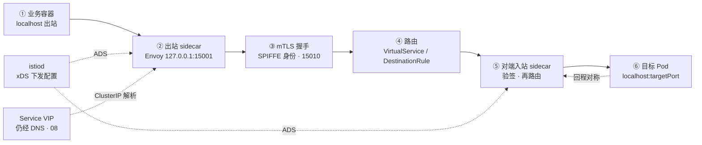
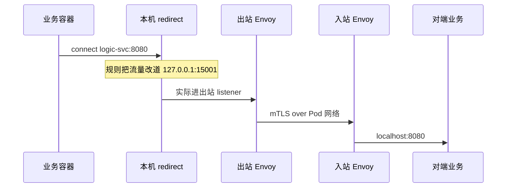
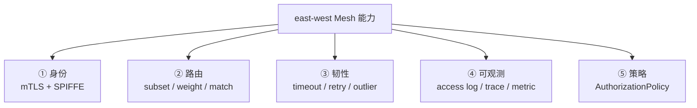
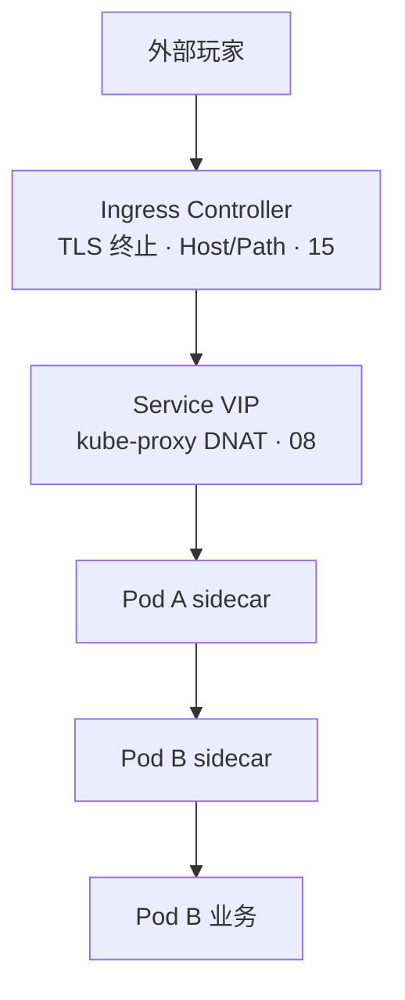
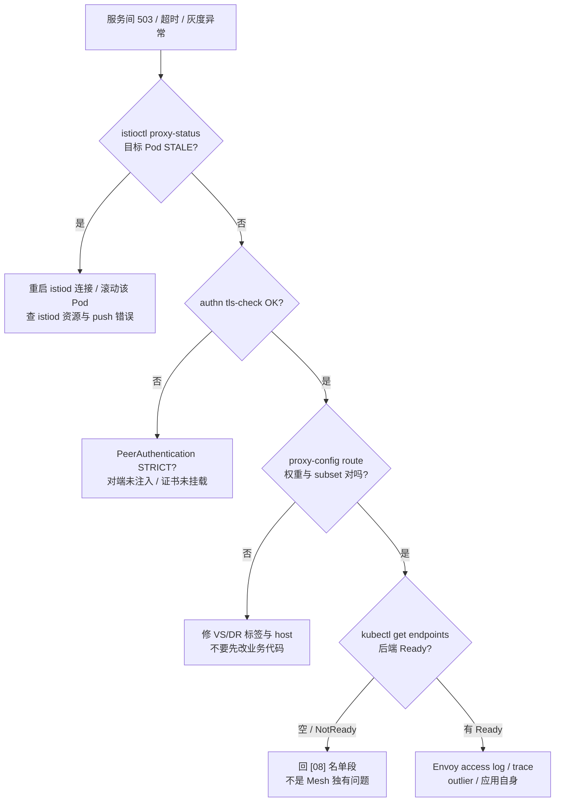

# Service Mesh：Istio 与 Envoy

> 大家好。上一章讲完 GitOps；这一章讲**一条服务间请求经 Mesh 的一生**——sidecar 在哪截获、mTLS 何时握手、路由谁说了算、代价大到什么程度。
> 开讲之前，先带大家回到活动现场：大厅灰度 10% 后错误率飙红，有人要「把 Istio 卸了先止血」，另一人坚持「业务代码肯定没问题」——`istioctl proxy-status` 里某个 Pod 的 `CDS` 还是 `STALE`；同时战斗长连接全走七层 Ingress 被 reload 掐断。手都别动。
> 这一章讲完，你会知道这几个人各自错在哪——卸 Mesh 不是第一刀、STALE 先修配置同步、战斗长连接别走七层 Ingress。
> **本章回答的问题**：一条 east-west 请求经 Mesh 的一生——sidecar 在哪截获、mTLS 何时握手、路由与金丝雀谁说了算、和 [08](../08-Service与kube-proxy/) Service、[15](../15-Ingress与流量管理/) Ingress 的边界各在哪、代价大到什么程度、什么时候根本不该上 Mesh。
> **本章不讲**：kube-proxy 四种模式与 iptables 链 → [08](../08-Service与kube-proxy/)；Ingress Controller 安装与证书 → [15](../15-Ingress与流量管理/)；无 sidecar 的 eBPF Mesh → [25](../25-eBPF与Cilium/)；发布回滚 RTO → [16](../16-灰度与回滚/)；NetworkPolicy 原生策略 → [10](../10-CNI与网络策略/)。

**标记**：🎯重点 · 🔥难点 · ⭐常考 · 🔧实操

**怎么听这场分享**：第一节是「一条服务间请求的一生」主图；二到七节顺着截获 → 握手 → 路由 → 边界 → 策略 → 代价；第八节抉择何时不上；第九节定责。口诀先埋一句：⭐ **副本比 ≠ 流量比**——金丝雀看 VirtualService weight。

---

## 一、一张图：一条服务间请求的一生

> 🎯 **一句话**：集群内一次 east-west 调用走六段——出站截获 → 身份握手 → 路由决策 → 对端入站 → 后端 Pod → 回程对称；卡住必在其中一段。

咱们先不急着背 VirtualService 字段。学 Mesh 最怕一上来背 CRD，背完还分不清「包走到哪」和「规则谁下发」。先看图：


**读图**：主线是 **east-west（东西向，集群内服务互调）**——业务以为自己连的是 `logic-svc:8080`，实际先被本 Pod 的 **sidecar（边车代理，与业务容器同 Pod 的 Envoy 进程）** 截到 `127.0.0.1:15001`，再经 mTLS 打到对端 sidecar，最后才进目标容器。上方 **istiod** 不转发包，只通过 **xDS（Discovery Service，Envoy 动态配置协议族：CDS/EDS/RDS/LDS）** 推规则。排障各照一段：`kubectl exec` 看业务端口、`istioctl proxy-config` 看路由、`istioctl authn tls-check` 看 mTLS、`proxy-status` 看配置是否 STALE。

> 💡 **打个比方**：Mesh 像每个员工配一个同声传译——你说中文（明文 HTTP），传译员对外一律加密外语（mTLS），还能按老板指令把 10% 电话转给新员工（金丝雀）；但传译员自己也要占工位和午饭（CPU/内存）。

好，带着这张图出发——先看流量怎么被「截获」。

本节对应练习题 Q1、Q2。

---

## 二、截获：sidecar 模型怎么挂上

> 🎯 **一句话**：Istio 默认用 **sidecar 注入**——每个 Pod 多一个 Envoy 容器，通过 **iptables（或 CNI 的 eBPF redirect）** 把进出流量劫持到本地代理。
### 注入与数据路径 ⭐🔧

**数据面（data plane）** 是 Envoy；**控制面（control plane）** 是 istiod（合并了 Pilot、Citadel、Galley）。业务 Pod 被注入后多两个容器：`istio-proxy`（Envoy）和可选的 `istio-init`（写 iptables 规则的一次性 init 容器）。



**读图**：业务 **无感改代码**——仍用 Service 名和 ClusterIP（DNS 仍走 [09](../09-CoreDNS/)）。劫持发生在 Pod 网络命名空间内，与节点级 [08](../08-Service与kube-proxy/) 的 VIP DNAT **叠加**：先 kube-proxy 把 `ClusterIP` 转到某个 Pod IP，再进该 Pod 的 sidecar。Mesh 管的是 **Pod 边界之后** 的 L7/L4 策略，不是替代 Service。

注入方式三选一，生产最常见 **命名空间标签**：

```bash
kubectl label namespace game istio-injection=enabled --overwrite
kubectl get ns game --show-labels
# istio-injection=enabled     ← 新建 Pod 自动注入；已存在 Pod 要滚动重建才长出 sidecar
```

```bash
kubectl get pod -n game lobby-7d9f-abc12 -o jsonpath='{.spec.containers[*].name}{"\n"}'
# lobby istio-proxy              ← 两个容器才是注入成功
kubectl describe pod -n game lobby-7d9f-abc12 | grep -A2 'istio-init'
# 有 init 容器写过 redirect 规则；Cilium Istio 集成可能用 eBPF 替代
```

> ⚠️ **别混**：**sidecar 注入 ≠ 给 Deployment 加一个普通容器**——还包含 redirect、证书卷、就绪探针（`15021/healthz/ready`）、与 istiod 的 xDS 长连接。手抄容器 YAML 漏 init 或 `holdApplicationUntilProxyStarts`，会出现「业务先起、代理未就绪」的 503 风暴。

### Ambient Mesh 与 sidecarless（一句）
Istio **Ambient（无 sidecar 模式）** 把 L4 下沉到节点 **ztunnel**，L7 按需 **waypoint**——成本模型从「每 Pod 一个 Envoy」变成「每节点/每命名空间少量代理」。与 [25](../25-eBPF与Cilium/) 的「内核 map 转发」是不同路线；面试知道「sidecar 贵 → Ambient / Cilium Gateway 是方向」即可，本章默认 **经典 sidecar 模型**。

截获搞清了。接下来问：两边怎么互信？——mTLS。

本节对应练习题 Q1、Q13。

---

## 三、握手：mTLS 与身份

> 🎯 **一句话**：Mesh 默认可开启 **STRICT mTLS（双向 TLS，客户端与服务端各出示证书）**——身份来自 **SPIFFE（Workload 身份标准）** 格式的 **SVID（SPIFFE Verifiable Identity Document）**，由 istiod 签发并轮换。

🔥 大家想想：PERMISSIVE 方便迁移，能不能长期开着？——⭐ **不能当长期目标**。双语柜台方便，但审计上仍可能走明文。
### 信任域与 PeerAuthentication 🔥⭐

**PeerAuthentication（对等认证策略，Istio 安全 API）** 决定「谁必须跟谁加密聊」：

```yaml
apiVersion: security.istio.io/v1beta1
kind: PeerAuthentication
metadata:
  name: default
  namespace: game
spec:
  mtls:
    mode: STRICT   # DISABLE | PERMISSIVE | STRICT
```

| 模式 | 行为 |
|------|------|
| **DISABLE** | 不强制 mTLS，明文也可 |
| **PERMISSIVE** | 既接受 mTLS 也接受明文；迁移期用，**不是长期目标** |
| **STRICT** | 只接受 mTLS；未注入 sidecar 的 Pod 会被拒 |

**读图**：`PERMISSIVE` 像「双语柜台」——方便旧服务接入，但审计上仍可能走明文，生产灰度结束后应推到 `STRICT`。身份不在业务证书里手写，而是 Envoy 自动拿 istiod 签的 **workload 证书**（SAN 里是 `spiffe://cluster.local/ns/game/sa/lobby`）。

> 🔍 **现场**：验证两服务之间是否已 mTLS。

```bash
istioctl authn tls-check lobby-7d9f-abc12.game logic-svc.game.svc.cluster.local
# HOST:PORT                                    STATUS     SERVER MIN TLS VERSION CLIENT TLS VERSION
# logic-svc.game.svc.cluster.local:8080        OK         TLSv1_3                  TLSv1_3
#                                                ↑ OK = 双向 mTLS 已建立
```

```bash
istioctl proxy-config secret lobby-7d9f-abc12.game -o json | jq '.[].secret.tlsCertificate.certificatePath'
# /etc/certs/cert-chain.pem    ← sidecar 自动挂载的轮换证书
```

> ⚠️ **别混**：**Mesh mTLS ≠ Ingress TLS**。Ingress 管 **north-south（南北向，外部用户进集群）** 的 HTTPS 终止；PeerAuthentication 管 **east-west** 服务互调。大厅 HTTPS 证书在 Ingress Controller，战斗服调逻辑服走 sidecar mTLS——两层各管各的边界（五节展开）。

> 📝 **面试**：「Istio mTLS 由 istiod 做 CA，通过 xDS 下发证书；PeerAuthentication 设 STRICT 后，没有 sidecar 或证书未就绪的 Pod 调不通。身份是 SPIFFE ID，不是业务自己塞的 TLS 证书。」

身份搞定了。接下来问：流量怎么切——金丝雀看 weight，不看副本数。

本节对应练习题 Q3、Q11。

---

## 四、路由：VirtualService 与流量切分

> 🎯 **一句话**：**VirtualService（虚拟服务，匹配 Host/子集/权重）** 决定「流量怎么分」；**DestinationRule（目标规则，定义子集 subset 与负载策略）** 决定「后端有哪些版本、怎么均衡」。

🔥 很多人会答「副本 1:9 就是 10% 灰度」——⭐ 这是高频错答。Mesh 里流量比看 **VirtualService weight**，副本比只影响容量。
### 金丝雀与灰度 ⭐🔧

```yaml
apiVersion: networking.istio.io/v1
kind: DestinationRule
metadata:
  name: logic-dr
  namespace: game
spec:
  host: logic-svc
  subsets:
  - name: v1
    labels:
      version: v1
  - name: v2
    labels:
      version: v2
---
apiVersion: networking.istio.io/v1
kind: VirtualService
metadata:
  name: logic-vs
  namespace: game
spec:
  hosts:
  - logic-svc
  http:
  - route:
    - destination:
        host: logic-svc
        subset: v1
      weight: 90
    - destination:
        host: logic-svc
        subset: v2
      weight: 10
```

**读图**：`DestinationRule` 先给 Pod 打标签分 **subset（子集）**；`VirtualService` 再按 **weight（权重）** 切流。这与 [08](../08-Service与kube-proxy/)「按 Endpoint 随机」不同——kube-proxy **不懂版本**，权重必须在 Mesh 或 Ingress 层做。大厅 HTTP 金丝雀也可在 [15](../15-Ingress与流量管理/) 用 Ingress annotation；**服务间**灰度用本章 API。

### 超时、重试与熔断 🔥

Mesh 把 **韧性（resilience）** 从业务 SDK 抽到数据面——同一套策略对所有语言生效：

```yaml
apiVersion: networking.istio.io/v1
kind: VirtualService
metadata:
  name: logic-vs
  namespace: game
spec:
  hosts:
  - logic-svc
  http:
  - timeout: 2s
    retries:
      attempts: 3
      perTryTimeout: 800ms
      retryOn: connect-failure,refused-stream,503
    route:
    - destination:
        host: logic-svc
        subset: v1
```

**DestinationRule** 里还可配 **outlierDetection（异常点检测，俗称熔断）**——连续 5xx 就把某个 Pod 踢出负载池一段时间，比业务自己写「黑名单 IP」一致。

```yaml
spec:
  trafficPolicy:
    outlierDetection:
      consecutive5xxErrors: 5
      interval: 10s
      baseEjectionTime: 30s
      maxEjectionPercent: 50
```

**读图**：`timeout` 是整条路由预算；`perTryTimeout` 是单次重试上限——两者配反会出现「总超时 2s 但单次重试 5s」的无效配置。outlier 踢的是 **具体 Pod IP（经 EDS 下发）**，不是 Deployment 名字；Pod 重建后 IP 变，黑名单自动刷新。

> ⚠️ **别混**：**Mesh retry ≠ 业务幂等**——非幂等写接口开重试会双写；POST 充值类接口要在 VS 关 retry 或业务做 idempotency key。

常见高级路由（知道名字即可）：`match` 按 header/cookie 定向；`fault` 注入延迟/错误做混沌——**别让每门语言各写一套重试**。

> 🔍 **现场**：路由没生效先看 xDS 是否同步。

```bash
istioctl proxy-status
# NAME              CDS        LDS        EDS        RDS        ISTIOD                    VERSION
# lobby-7d9f-abc12  SYNCED     SYNCED     SYNCED     SYNCED     istiod-xxx                1.22.0
# logic-bad-xyz     STALE      SYNCED     STALE      SYNCED     istiod-xxx                1.22.0
#                              ↑ STALE = 这台 Envoy 配置落后，金丝雀权重可能还是旧的
```

```bash
istioctl proxy-config route lobby-7d9f-abc12.game --name 8080 -o json | jq '.[].route.virtualHost.routes[].route.weightedClusters'
# 应能看到 v1:90 / v2:10；对不上 = VS/DR 没绑对 host 或 subset 标签不匹配
```

### 收束：Mesh 在 east-west 管什么 🎯⭐



**读图**：①② 是面试高频；③ 把横切关注点从业务库抽走；④ 自动生成 **golden metrics（标准四元组：延迟/流量/错误/饱和度）** 需配合 [19](../19-监控与可观测性/)；⑤ **AuthorizationPolicy（授权策略）** 做 L7 允许/拒绝，比纯 NetworkPolicy 细，但 **不能替代** [10](../10-CNI与网络策略/) 的 L3/L4 兜底。

> ⚠️ **别混**：**VirtualService 权重 ≠ Deployment 副本比例**——副本 1:9 但权重 50:50，流量仍一半进旧版。金丝雀看 **weight + 错误率**，不看副本数（[16](../16-灰度与回滚/)）。

> 📝 **面试**：「切流三件套：Pod label → DestinationRule subset → VirtualService weight；排障看 proxy-status 是否 STALE，再看 route 配置。」

路由会了。接下来分清三层边界——别把 Ingress 和 Mesh 混成一个东西。

本节对应练习题 Q4、Q8。

---

## 五、边界：Mesh、Service、Ingress 各管哪段

> 🎯 **一句话**：**Service + kube-proxy 管 VIP 到 Pod IP（L4）**；**Ingress 管外部 HTTPS 到 Service（north-south L7）**；**Mesh 管 Pod 与 Pod 之间（east-west L7/L4+mTLS）**——三层叠加，不是谁替代谁。


**读图**：从外到内——Ingress 只处理 **进集群的第一跳**；进 Pod 后的互调不再经过 Ingress Controller。战斗 **长连接 TCP** 应走 L4 NLB / TCPRoute（[15](../15-Ingress与流量管理/)），**不要**塞进 HTTP Ingress 再指望 Mesh 救——七层 reload 会掐连接。

| 对比 | **Service / kube-proxy** | **Ingress** | **Service Mesh** |
|------|--------------------------|-------------|------------------|
| 方向 | 集群内 VIP → Pod | 外部 → 集群内 Service | Pod ↔ Pod |
| 层 | L4 DNAT | L7 HTTP(S) | L4 mTLS + L7 路由 |
| 金丝雀 | 不支持权重 | 支持（Controller 实现） | VirtualService weight |
| 身份 | 无 | 边缘 TLS | 每跳 workload 身份 |

> ⚠️ **别混**：「上了 Istio 就可以删 Ingress」——外部用户仍要入口；「Ingress 做 mTLS」通常只到 Ingress Pod，**服务间**仍要 Mesh 或业务自建 TLS。

边界清楚了。再看授权与观测——AuthorizationPolicy 不能替代 NetworkPolicy。

本节对应练习题 Q5、Q10。

---

## 六、策略与观测：AuthorizationPolicy 与 telemetry

> 🎯 **一句话**：**AuthorizationPolicy（授权策略）** 在 mTLS 身份之上做 L7 允许/拒绝；**telemetry（遥测）** 由 Envoy 自动吐 metric/trace/access log，但要配采样率否则存储先炸。
### L7 授权 ⭐

mTLS 解决「你是谁」；AuthorizationPolicy 解决「你能调谁」：

```yaml
apiVersion: security.istio.io/v1beta1
kind: AuthorizationPolicy
metadata:
  name: logic-allow-lobby
  namespace: game
spec:
  selector:
    matchLabels:
      app: logic
  action: ALLOW
  rules:
  - from:
    - source:
        principals: ["cluster.local/ns/game/sa/lobby"]
    to:
    - operation:
        methods: ["POST"]
        paths: ["/api/v1/*"]
```

**读图**：`principals` 来自 peer 的 SPIFFE ID——比「允许 10.0.0.0/8」精确。`action: DENY` 规则优先级高于 `ALLOW`（显式拒绝先匹配）。**没有默认拒绝**时，未命中规则可能仍放行——生产常用「默认 DENY + 白名单 ALLOW」模式，但要分批上线，否则全站 403。

> 🔍 **现场**：403 且 mTLS OK，查授权。

```bash
istioctl authz check logic-7d9f-abc12.game -n game
# 输出哪条 policy 允许/拒绝；无输出 ≠ 一定允许，还要看 implicit deny 配置
kubectl logs logic-7d9f-abc12 -c istio-proxy --tail=20 | grep RBAC
# rbac: denied POST /api/v1/login    ← Envoy RBAC 过滤器拒绝
```

### 黄金指标与 trace 🔧

Envoy 自动为每个 `inbound`/`outbound` 生成 **istio_requests_total**、**istio_request_duration_milliseconds** 等，标签含 `source_app`、`destination_service_name`、`response_code`——Prometheus 抓取 `15020/stats/prometheus` 或经 **Telemetry API** 统一配置。

分布式 trace 靠 **W3C tracecontext** 或 **B3** header 在 sidecar 间传播；`istioctl install` 可选装 Kiali/Jaeger。**采样率** 默认 1% 级，活动高峰要下调，否则 ES/Jaeger 比游戏服先 OOM。

```bash
kubectl exec lobby-7d9f-abc12 -c istio-proxy -- curl -s localhost:15000/config_dump | head
# config_dump 极大；排障用 proxy-config 子命令，别整包 dump 到笔记本
```

### holdApplicationUntilProxyStarts 与启动顺序 🔧

Istio 1.7+ 推荐在 Pod annotation 开启：

```yaml
metadata:
  annotations:
    proxy.istio.io/config: |
      holdApplicationUntilProxyStarts: true
```

否则业务容器可能比 Envoy 先 `Ready`，kubelet 已把流量打进来，出现 **503 尖刺**。与 [04](../04-Pod生命周期/) 就绪探针配合：sidecar 的 `15021/healthz/ready` 未通过前，业务不应接流量。

```bash
kubectl describe pod lobby-7d9f-abc12 -n game | grep -A3 'Containers:'
# lobby:  Ready True
# istio-proxy: Ready True   ← 两个都 Ready 再信 Service Endpoints
```

### 非 HTTP 协议：TCP/gRPC

VirtualService 除 `http` 外还有 `tcp` 路由块——战斗长连接若走 Mesh（少见），要用 **tcp match + route**，不能套 HTTP timeout/retry。gRPC 在 Istio 里按 **HTTP/2** 处理，`grpc` 字段可设 per-method timeout。**游戏战斗 UDP** 一般 **不进 Mesh**，走 hostNetwork 或独立网关。

策略与启动时序清楚了。接下来算账——sidecar 到底贵在哪。

本节对应练习题 Q9、Q12。

---

## 七、代价：sidecar 为什么贵

> 🎯 **一句话**：每个 Pod 多一个 Envoy——**CPU/内存/Latency/Pod 密度/启动时序** 全付税；小集群或低 QPS 往往 **ROI（投入产出比）为负**。
### 资源账 ⭐🔥

典型生产（随版本与配置波动，用下面数量级做容量规划）：

```text
每 sidecar 常驻：~100–150m CPU request，~128–256Mi 内存 request
每 Pod 从 2 容器变 3 容器（含 init）：调度碎片、IP 消耗、CNI 连接跟踪上涨
每跳延迟：多 1–3ms（TLS + 用户态代理）；P99 敏感路径要实测
```

**游戏服场景**：战斗 Pod 若 **QPS 极高、包体小、延迟敏感**，sidecar 税可能直接吃掉预算；大厅 HTTP、GM 后台、微服务治理链更适合 Mesh。活动高峰 **HPA 扩 Pod = 同步扩 sidecar**，集群成本近似 **×2**（代理资源）。

> 💡 **打个比方**：给每个士兵配一个盾牌（sidecar）——巷战（复杂微服务、多团队）很值；开阔地单人狙击（单体 + 低互调）盾牌只挡视线。

### 运维复杂度

- **升级 istiod / Envoy** 要与业务发布协调；`proxy-status STALE` 是常见 P1。
- **可观测性双份**：要会 `istioctl` + 传统 `kubectl`；trace 采样率没调好，Jaeger 先爆。
- **故障域**：istiod 挂了 **存量连接常在、新 Pod 拿不到配置**——与 [08](../08-Service与kube-proxy/) kube-proxy 挂了的「规则不更新」同类。
- **调试路径变长**：`curl` 进业务容器看到的 ≠ 经 Envoy 后的真实路由。

> 📝 **面试**：「sidecar 成本 = 每 Pod 一份 Envoy 资源 + 每跳延迟 + 运维复杂度；800 微服务、多语言、要强 mTLS 和统一灰度才划算；两三个服务用 NetworkPolicy + Ingress 就够。」

### 与 Gateway API 的关系（一句）

Istio 1.16+ 可作为 **Gateway API** 的实现（`GatewayClass: istio`），把 north-south 也纳入同一控制面。与 [15](../15-Ingress与流量管理/) 传统 Ingress 并存期很长——**Ingress 资源不会一夜消失**，但新入口优先 Gateway API。east-west 仍靠 VirtualService，不因换了入口 API 而消失。

---

### Envoy access log 读法 🔧

```bash
kubectl logs lobby-7d9f-abc12 -c istio-proxy --tail=5
# [2026-09-01T10:00:01.123Z] "POST /api/v1/login HTTP/2" 503 UF,URX upstream_reset_before_response_started{connection failure}
# UF = Upstream connection failure；先查对端 sidecar 是否 Ready、mTLS 是否 STRICT
# 200 但延迟高：看 duration 字段与 upstream_service_time
```

配合 `istioctl analyze -n game` 做静态配置检查——未绑定 Gateway 的 VS、subset 标签不存在等会在这里报 **Info/Error**。

账算清了。接下来直接回答开篇：什么时候根本不该上 Mesh。

本节对应练习题 Q6。

---

## 八、抉择：什么时候不要上 Mesh

> 🎯 **一句话**：**服务少、团队小、延迟极敏感、或已有成熟发布链** 时，Mesh 往往是 **过度工程**。
### 明确不该上的信号 ⭐

1. **互调关系简单**：小于 10 个服务，发布用 [16](../16-灰度与回滚/) Deployment 滚动 + [15](../15-Ingress与流量管理/) Ingress 金丝雀就够。
2. **延迟预算极紧**：战斗逻辑互调 P99 小于 5ms，多一跳代理不可接受。
3. **语言/框架不统一**：部分服务无法注入或 TLS 握手拖垮老运行时。
4. **控制面人力不足**：没人会 `istioctl`、没人盯 istiod 高可用。
5. **已有等价能力**：Cilium L7 + Hubble（[25](../25-eBPF与Cilium/)）或云厂商 MSF 满足 mTLS/观测。
6. **DaemonSet / HostNetwork 战斗服**：sidecar 与 hostNetwork 冲突或注入破坏网络模型。

### 适合上的信号

- 多团队、多语言，要 **统一 mTLS、重试、限流、trace**。
- **细粒度灰度** 必须发生在服务间（不只是入口 HTTP）。
- 合规要求 **零信任 east-west**（每跳可审计身份）。
- Pod 规模上千，**横切策略** 不愿在每个 repo 复制粘贴。

| 对比 | **先不上 Mesh** | **值得评估 Mesh** |
|------|-----------------|-------------------|
| 服务数 | 个位数～十几个 | 数十～数百 |
| 灰度点 | 仅入口 HTTP | 服务链每跳 |
| 团队 | 单团队全栈 | 多团队多语言 |
| 延迟 | 极敏感战斗路径 | 大厅/后台为主 |

---

### 安装与升级（值班要知道的边界）🔧

```bash
istioctl install --set profile=default -y    # 生产用 profile 调资源，别默认 demo
istioctl verify-install
kubectl -n istio-system get pods
# istiod Running；ingressgateway 若装了也应 Ready
```

升级顺序：**istiod 先、数据面后**——先升控制面，再滚动业务 Pod 让 Envoy 版本跟上。跨 minor 版本先看 **升级说明里的 CRD 变更**。`istioctl revision` 支持 **canary control plane（金丝雀控制面）**：新 istiod 与旧 revision 并存，按命名空间 `istio.io/rev` 标签分批迁移。

> ⚠️ **别混**：**`istioctl uninstall` 不会自动删业务 namespace 里的 sidecar**——卸载后 Pod 仍带着死代理容器，要滚动重建或手动去掉注入标签。

现在再看开篇那几句——「把 Istio 卸了先止血」「业务代码肯定没问题」「战斗长连接走七层 Ingress」——你知道该怎么拦住他们了：先 proxy-status 定段、STALE 先修配置、战斗走 L4。

本节对应练习题 Q6、Q13。

---

## 九、作战：定责

> 🎯 **一句话**：east-west 故障先分 **配置（STALE）/ 身份（mTLS）/ 路由（subset）/ 后端（Endpoints）** 四段，再决定动 Mesh 还是动业务。
### 决策树



**读图**：**STALE 优先**——配置没同步，怎么改 VS 都白搭。**mTLS 失败** 常见是命名空间没注入或 `PERMISSIVE`/`STRICT` 混用。**Endpoints 空** 永远先查 [08](../08-Service与kube-proxy/)，Mesh 不会 magically 造后端。

### 现象 · 先做 · 别做

| 现象 | 先做 | 别做 |
|------|------|------|
| 灰度后错误率升 | `proxy-status` + route weight + 应用日志 | 未验证权重就卸 Istio |
| `TLS error: certificate verify failed` | `authn tls-check` + PeerAuthentication | 全局改 DISABLE 了事 |
| 新 Pod 启动风暴 503 | `holdApplicationUntilProxyStarts` + 就绪探针 | 关掉 sidecar 注入 |
| 仅跨命名空间失败 | AuthorizationPolicy + mTLS 模式 | 怀疑 kube-proxy |
| 外部玩家断连 | 查 Ingress reload / 是否误走七层 | 调 VirtualService |
| istiod OOM | 扩 istiod、降推送量、分片 | 全集群重启业务 Pod |

### 60 秒剧本 🔧

```text
① 0–10s   kubectl get endpoints -n {ns} <svc>；istioctl proxy-status | grep -E 'STALE|NOT SENT'
② 10–30s  istioctl authn tls-check <src-pod> <dst-host>；proxy-config route 看 subset/weight
③ 30–45s  定型：STALE→滚 Pod/istiod；mTLS→注入与 PA；路由→VS/DR；Endpoints 空→08
④ 45–60s  验证：对端 metrics 错误率、access log 200 比例；灰度调权前确认 STALE 清零
```

本节对应练习题 Q7、Q8、Q14。

---

## 十、收口

### 命令速查 🔧
```bash
# 注入与身份
kubectl label namespace {ns} istio-injection=enabled --overwrite
istioctl authn tls-check {pod}.{ns} <svc>.{ns}.svc.cluster.local
istioctl proxy-config secret {pod}.{ns}

# 配置与路由
istioctl proxy-status
istioctl proxy-config route {pod}.{ns} --name <port> -o json
istioctl proxy-config cluster {pod}.{ns} -o json | grep -A5 <svc>

# 排障
kubectl logs {pod} -c istio-proxy --tail=100
istioctl analyze -n {ns}
kubectl exec {pod} -c istio-proxy -- curl -s localhost:15000/stats | grep -i upstream_rq
```

### 面试锚点

遮住右列自问自答，卡壳的行回去重读对应小节：

| 问 | 30 秒答 |
|----|---------|
| Service Mesh 是什么？ | 基础设施层，用 sidecar 代理接管服务间流量，统一 mTLS、路由、观测、韧性；数据面 Envoy，控制面 istiod。 |
| sidecar 怎么截流量？ | init/eBPF redirect 把出站改到本地 Envoy 15001，入站经对端 Envoy 再进业务容器。 |
| mTLS 谁签发？ | istiod 作 CA，SPIFFE 格式 workload 证书，PeerAuthentication 设 STRICT 强制双向。 |
| VirtualService 和 DestinationRule？ | DR 定义 subset 与策略；VS 按 weight/match 把流量分到 subset。 |
| Mesh 和 Ingress 边界？ | Ingress 管 north-south 入口 HTTPS；Mesh 管 east-west Pod 互调；Service 仍提供 VIP。 |
| sidecar 成本？ | 每 Pod ~100m CPU + 128Mi+ 内存、每跳 1–3ms、Pod 密度下降；扩缩容同步扩代理。 |
| proxy-status STALE？ | Envoy 配置未与 istiod 同步，路由/EDS 可能过期，优先滚 Pod 或查 istiod。 |
| 什么时候不该上？ | 服务少、延迟极敏感、无运维人力、Ingress+NP 已够；战斗高频互调慎用。 |
| Ambient 是什么？ | Istio 无 sidecar 路线，ztunnel/waypoint 降成本；与 Cilium 不同技术栈。 |
| 灰度看副本还是 weight？ | 看 VirtualService weight；副本比例不等于流量比例。 |

### 易错一句话对照

- Mesh 替代 kube-proxy → 叠加关系，VIP DNAT 仍在 [08]
- Ingress 做了 TLS 就不用 Mesh → Ingress 只管南北向，east-west 仍明文除非 Mesh
- 副本 1:9 就是 10% 流量 → 看 VS weight，不看副本
- PERMISSIVE 可以长期用 → 迁移期用，生产应 STRICT
- 503 先卸 Istio → 先 proxy-status / tls-check / endpoints
- sidecar 挂了业务立刻全死 → 存量连接常在，新连接/配置更新受影响
- VirtualService 绑错 host 不报错 → analyze + route 配置核对
- 战斗 TCP 走 Ingress 七层 → 应 L4 入口，见 [15]
- AuthorizationPolicy 替代 NetworkPolicy → L7 授权不替代 L3/L4 隔离
- istiod 是数据面 → 只下发 xDS，不转发业务包

### 数字墙

> 出站 redirect **15001** · 健康 **15021** · 每 sidecar 约 **100–150m CPU** / **128–256Mi** 内存 · 每跳延迟约 **1–3ms** · xDS 四件套 **CDS/LDS/EDS/RDS** · mTLS 模式 **DISABLE / PERMISSIVE / STRICT** · 灰度权重总和 **100**

---

## 合上书

合上书自检（题号对齐练习题）：

- [ ] **默画一节主图**：业务 → 出站 sidecar → mTLS → 路由 → 入站 sidecar → 目标容器；标 istiod xDS 位置。（Q1、Q2）
- [ ] **口述 sidecar 注入**：命名空间标签、init redirect、与 kube-proxy 叠加关系。（Q1）
- [ ] **口述 mTLS**：SPIFFE/SVID、PeerAuthentication 三模式、tls-check 怎么看 OK。（Q3、Q11）
- [ ] **口述金丝雀三件套**：label → DestinationRule subset → VirtualService weight；副本≠流量。（Q4）
- [ ] **口述边界**：north-south Ingress vs east-west Mesh vs Service VIP 各管哪段。（Q5、Q10）
- [ ] **口述成本**：CPU/内存/延迟/密度/启动时序，游戏战斗路径为何慎用。（Q6）
- [ ] **口述何时不上**：至少四条信号 + 替代方案（Ingress、NP、Cilium）。（Q6、Q13）
- [ ] **默画收束五件套**：身份/路由/韧性/观测/策略。（Q2）
- [ ] **定责**：决策树四段；STALE、mTLS、subset、Endpoints 各先敲什么命令。（Q7、Q8、Q14）
- [ ] **口述 AuthorizationPolicy**：principals 与 mTLS 关系；403 排障顺序。（Q9）
- [ ] **口述安装升级**：istiod 先、数据面后；revision 金丝雀控制面；uninstall 不自动去 sidecar；holdApplicationUntilProxyStarts。（Q12）

十一题都能口述，这一章就过了。终极测试：拦住开篇「卸 Istio 止血」「战斗走七层 Ingress」。下一章 [eBPF 与 Cilium](../25-eBPF与Cilium/)：无 sidecar 的数据面替代。入口与灰度：[15](../15-Ingress与流量管理/) · [16](../16-灰度与回滚/)。集群内 L4：[08](../08-Service与kube-proxy/)。
