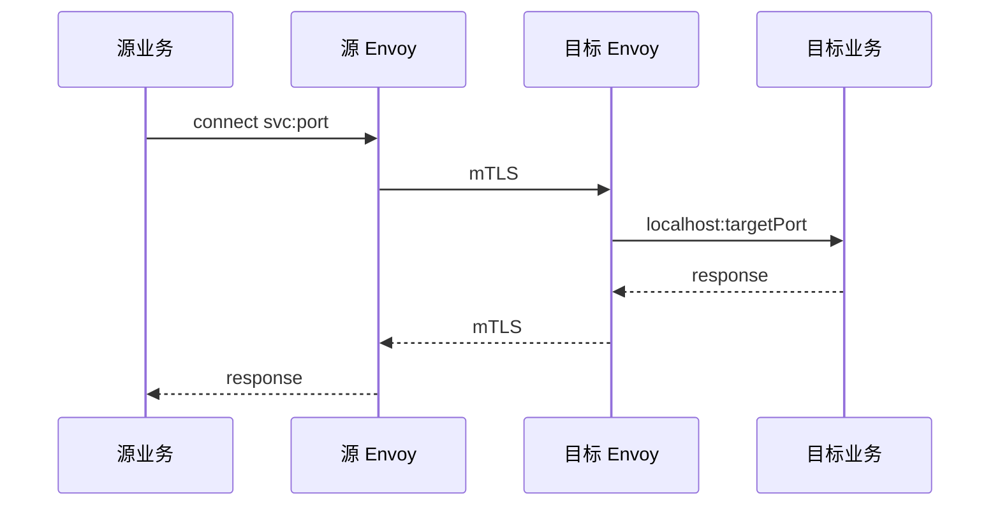

# 24｜Service Mesh：Istio 与 Envoy · 练习题

开始做题前：合上知识点，对着**一节的主图**把「一条服务间请求经 Mesh 的一生」口述一遍——截获 → mTLS → 路由 → 入站 → 后端 → 回程。讲得出来再做题。

每道题先看场景自己答，再对完整解答。

题目顺序：Q1～Q2 钉主图与 sidecar；Q3～Q6 mTLS/路由/边界/成本；Q7～Q14 排障与定责。

| 标记 | 含义 |
|------|------|
| **核心** | 不懂整章就没建立起来 |
| **必会** | 值班和面试都要能讲 |
| **常用** | 线上会反复碰到 |
| **常考** | 白板和追问的高频口径 |

## 本题目录

- [Q1 Service Mesh 和 sidecar 是什么？](#q1)
- [Q2 一条 east-west 请求怎么走？](#q2)
- [Q3 mTLS 谁签发？PeerAuthentication 三模式？](#q3)
- [Q4 VirtualService 和 DestinationRule 怎么配合做金丝雀？](#q4)
- [Q5 Mesh、Service、Ingress 边界各在哪？](#q5)
- [Q6 sidecar 成本有多大？什么时候不该上？](#q6)
- [Q7 proxy-status STALE 怎么处理？](#q7)
- [Q8 灰度后 503，先看什么？](#q8)
- [Q9 AuthorizationPolicy 和 NetworkPolicy 区别？](#q9)
- [Q10 战斗长连接能走 Ingress 七层吗？](#q10)
- [Q11 PERMISSIVE 能长期用吗？](#q11)
- [Q12 holdApplicationUntilProxyStarts 解决什么？](#q12)
- [Q13 Ambient Mesh 和经典 sidecar 差在哪？](#q13)
- [Q14 四张工单定责](#q14)
- [合上书](#合上书)

---

## Q1

**★★★★★｜Service Mesh 是什么？sidecar 模型怎么工作？**

**覆盖**：核心 · 必会 · 常考 ｜ **对应**：知识点 [二、截获：sidecar 模型怎么挂上](知识点.md)

### 场景

面试官让你白板画「大厅调逻辑服」的路径。候选人只画了 `Service VIP → Pod`，没提 Envoy。

先自己试试：不看下面，先口述一遍你的答案，再往下对。

### 完整解答

> 🎯 **一句话**：Mesh 用与业务同 Pod 的 Envoy sidecar 截获流量，istiod 经 xDS 下发策略，统一 mTLS、路由与观测。

**数据面**是 Envoy，**控制面**是 istiod。注入后 Pod 多 `istio-proxy` 容器；init/eBPF 把出站改到 `127.0.0.1:15001`，入站经对端 sidecar 再进业务。业务仍用 Service 名——与 [08](../08-Service与kube-proxy/) kube-proxy 的 VIP DNAT **叠加**，不是替代。

> 📝 **面试**：「sidecar 截获 Pod 边界流量，istiod 推 xDS；kube-proxy 仍做 ClusterIP 到 Pod IP。」

### 再追问

- **istiod 转发包吗？** 不转发，只下发配置；和 kube-proxy 一样属于控制面逻辑。
- **没注入 sidecar 的 Pod 能进 Mesh 吗？** 不能完整享受 mTLS/VS 路由；STRICT 模式下会被拒。

---

## Q2

Q1 画了 sidecar；这道题把六段路径完整串一遍。


**★★★★★｜画一条集群内 east-west 请求的完整路径。**

**覆盖**：核心 · 必会 ｜ **对应**：知识点 [一、一张图：一条服务间请求的一生](知识点.md)

### 场景

链路追踪显示延迟高，开发坚持「我们只调 ClusterIP，跟 Mesh 无关」。

先自己试试：不看下面，先口述一遍你的答案，再往下对。

### 完整解答

> 🎯 **一句话**：业务 → 本 Pod 出站 Envoy → mTLS → 对端入站 Envoy → 目标容器；回程对称。



DNS 解析 VIP 仍在 [09](../09-CoreDNS/)；DNAT 在 [08](../08-Service与kube-proxy/)；**L7 路由、mTLS、重试** 在 Mesh 段。

### 再追问

- **多跳调用链？** 每一跳都经各自 sidecar，延迟累加——这是 sidecar 成本之一。

---

## Q3

**★★★★★｜Istio mTLS 谁签发？PeerAuthentication 的 DISABLE/PERMISSIVE/STRICT 区别？**

**覆盖**：核心 · 必会 · 常考 ｜ **对应**：知识点 [三、握手：mTLS 与身份](知识点.md)

### 场景

迁移 Mesh 时有人建议「一直 PERMISSIVE 省事」。新区服务调老区报 `TLS error: certificate verify failed`。

先自己试试：不看下面，先口述一遍你的答案，再往下对。

### 完整解答

> 🎯 **一句话**：istiod 作 CA 发 SPIFFE 格式 workload 证书；STRICT 强制双向 mTLS，PERMISSIVE 仅迁移期用。

```bash
istioctl authn tls-check lobby-pod.game logic-svc.game.svc.cluster.local
# STATUS OK = mTLS 建立
```

| 模式 | 行为 |
|------|------|
| DISABLE | 不强制 |
| PERMISSIVE | mTLS 与明文并存 |
| STRICT | 仅 mTLS |

> ⚠️ **别混**：Ingress HTTPS（[15](../15-Ingress与流量管理/)）管南北向；PeerAuthentication 管 east-west。

### 再追问

- **如何验证？** `istioctl authn tls-check` + `proxy-config secret` 看证书链。

---

## Q4

Q3 讲身份；这道题讲切流——记住副本比 ≠ 流量比。


**★★★★★｜10% 金丝雀怎么配？副本 1:9 等于 10% 流量吗？**

**覆盖**：必会 · 常考 ｜ **对应**：知识点 [四、路由：VirtualService 与流量切分](知识点.md)

### 场景

逻辑服 v2 只有 1 个副本、v1 有 9 个，SRE 把 VirtualService weight 设成 50:50「加快验证」。

先自己试试：不看下面，先口述一遍你的答案，再往下对。

### 完整解答

> 🎯 **一句话**：金丝雀靠 DestinationRule subset + VirtualService weight；流量比例看 weight，不看副本数。

步骤：Pod `version` label → DR 定义 `v1`/`v2` subset → VS `weight: 90` / `10`。

```bash
istioctl proxy-config route lobby-pod.game --name 8080 -o json | jq '.[].route.virtualHost.routes[].route.weightedClusters'
```

> 📝 **面试**：「副本是容量，weight 是流量；金丝雀看错误率调 weight，见 [16](../16-灰度与回滚/)。」

### 再追问

- **weight 改了不生效？** 先 `istioctl proxy-status` 看是否 STALE。

---

## Q5

前面讲 Mesh 内部；这道题钉三层边界，别和 Ingress 混。


**★★★★☆｜Mesh、Service、Ingress 各管哪一段？**

**覆盖**：必会 · 常考 ｜ **对应**：知识点 [五、边界：Mesh、Service、Ingress 各管哪段](知识点.md)

### 场景

「上了 Istio 可以删 Ingress 了」「Ingress 做了 TLS 服务间就安全了」——两种说法哪个对？

先自己试试：不看下面，先口述一遍你的答案，再往下对。

### 完整解答

> 🎯 **一句话**：Service 管 L4 VIP；Ingress 管南北向 L7 入口；Mesh 管 east-west Pod 互调与 mTLS。

外部玩家仍要 [15](../15-Ingress与流量管理/)；服务间灰度用 VirtualService。Ingress TLS 通常终止在 Ingress Pod，**不自动覆盖** Pod 间明文。

> ⚠️ **别混**：三层叠加，不是互相替代。

### 再追问

- **入口金丝雀用谁？** HTTP 可用 Ingress annotation 或 Gateway API；服务链灰度用 Mesh。

---

## Q6

**★★★★★｜sidecar 成本？什么时候不该上 Mesh？**

**覆盖**：核心 · 常考 ｜ **对应**：知识点 [七、代价：sidecar 为什么贵](知识点.md)、[八、抉择：什么时候不要上 Mesh](知识点.md)

### 场景

战斗服 P99 要求 小于 5ms，架构师提议全集群上 Istio「统一治理」。

先自己试试：不看下面，先口述一遍你的答案，再往下对。

### 完整解答

> 🎯 **一句话**：每 Pod 约 100–150m CPU、128–256Mi 内存、每跳 1–3ms；服务少、延迟极敏感、无人运维 istiod 时别上。

不该上：互调简单、战斗路径延迟紧、hostNetwork 战斗服、已有 Cilium L7（[25](../25-eBPF与Cilium/)）满足需求。该上：多团队多语言、要强 east-west mTLS、细粒度服务间灰度。

### 再追问

- **HPA 扩 Pod 的影响？** sidecar 同步扩，成本近似翻倍。

---

## Q7

**★★★★☆｜istioctl proxy-status 出现 STALE 怎么办？**

**覆盖**：常用 · 必会 ｜ **对应**：知识点 [九、作战：定责](知识点.md)

### 场景

金丝雀权重已改，部分 Pod 仍把流量打到 v2 旧版本，proxy-status 显示 `STALE`。

先自己试试：不看下面，先口述一遍你的答案，再往下对。

### 完整解答

> 🎯 **一句话**：STALE = Envoy 配置未与 istiod 同步，优先滚该 Pod 或查 istiod 推送/资源。

```bash
istioctl proxy-status | grep STALE
kubectl -n istio-system logs deploy/istiod --tail=50
kubectl delete pod <stale-pod> -n game   # 滚动重建 sidecar 连接
```

**别**在未同步时反复改 VirtualService——对 STALE 实例不生效。

### 再追问

- **istiod OOM？** 扩资源、降配置推送量；全集群重启业务 Pod 是下策。

---

## Q8

就是开篇那个灰度飙红现场——先 proxy-status，别先卸 Istio。


**★★★★★｜服务间 503，60 秒怎么查？**

**覆盖**：必会 · 常用 ｜ **对应**：知识点 [九、作战：定责](知识点.md)

### 场景

灰度后错误率升，有人要卸载 Istio，有人要回滚业务镜像。

先自己试试：不看下面，先口述一遍你的答案，再往下对。

### 完整解答

> 🎯 **一句话**：Endpoints → proxy-status → tls-check → route weight → access log。

```text
① kubectl get endpoints logic-svc -n game
② istioctl proxy-status
③ istioctl authn tls-check <src> logic-svc.game.svc.cluster.local
④ istioctl proxy-config route ...
⑤ kubectl logs {pod} -c istio-proxy --tail=20
```

Endpoints 空 → 回 [08](../08-Service与kube-proxy/)；mTLS 失败 → 注入与 PeerAuthentication；路由对 → 查应用。

### 再追问

- **UF  upstream failure 在 access log？** 对端 sidecar 未 Ready 或连接被拒。

---

## Q9

**★★★★☆｜AuthorizationPolicy 能替代 NetworkPolicy 吗？**

**覆盖**：常考 ｜ **对应**：知识点 [六、策略与观测：AuthorizationPolicy 与 telemetry](知识点.md)

### 场景

「上了 Istio 授权就可以删掉 Calico NetworkPolicy 了。」

先自己试试：不看下面，先口述一遍你的答案，再往下对。

### 完整解答

> 🎯 **一句话**：AuthorizationPolicy 是 L7 身份授权；NetworkPolicy 是 L3/L4 兜底，不能互替。

AP 用 SPIFFE `principals` 允许/拒绝 HTTP method/path。NP 在 [10](../10-CNI与网络策略/) 拦 Pod IP 层流量。生产两层都要。

### 再追问

- **403 且 mTLS OK？** `istioctl authz check` + Envoy RBAC 日志。

---

## Q10

**★★★★☆｜战斗 TCP 长连接应该走哪层？**

**覆盖**：必会 ｜ **对应**：知识点 [五、边界：Mesh、Service、Ingress 各管哪段](知识点.md)

### 场景

有人把战斗端口挂到 HTTP Ingress，计划用 VirtualService 做会话保持。

先自己试试：不看下面，先口述一遍你的答案，再往下对。

### 完整解答

> 🎯 **一句话**：战斗长 TCP 走 L4 NLB/TCPRoute（[15](../15-Ingress与流量管理/)），不要塞七层 Ingress reload。

七层 Ingress reload 会断长连接；Mesh 对 TCP 虽可路由但 sidecar 税对延迟敏感战斗不友好。UDP 战斗一般 hostNetwork，不进 Mesh。

### 再追问

- **大厅 HTTP 呢？** Ingress/Gateway + 区内 Mesh 互调，边界清晰。

---

## Q11

就是 Q3 里 PERMISSIVE 的追问展开。


**★★★★☆｜PERMISSIVE 可以长期生产使用吗？**

**覆盖**：常考 ｜ **对应**：知识点 [三、握手：mTLS 与身份](知识点.md)

### 场景

「我们永远 PERMISSIVE，兼容老服务。」安全审计不通过。

先自己试试：不看下面，先口述一遍你的答案，再往下对。

### 完整解答

> 🎯 **一句话**：PERMISSIVE 仅迁移期；生产目标 STRICT，否则 east-west 仍可能明文。

迁移步骤：先注入全量 → 验证 tls-check → 命名空间级 STRICT → 摘未注入 Pod。

### 再追问

- **老服务不能注入？** 留在网格外或单独 namespace DISABLE，不要全集群 PERMISSIVE。

---

## Q12

**★★★★☆｜启动风暴 503，holdApplicationUntilProxyStarts 干什么？**

**覆盖**：常用 ｜ **对应**：知识点 [二、截获：sidecar 模型怎么挂上](知识点.md)

### 场景

新版本发布瞬间大量 503，Pod 显示 Ready 但 istio-proxy 尚未监听。

先自己试试：不看下面，先口述一遍你的答案，再往下对。

### 完整解答

> 🎯 **一句话**：让业务容器等 Envoy ready 后再接流量，避免「业务先起、代理未起」。

```yaml
proxy.istio.io/config: |
  holdApplicationUntilProxyStarts: true
```

配合 sidecar `15021/healthz/ready` 与 [04](../04-Pod生命周期/) 探针。

### 再追问

- **两个容器都 Ready 才信 Endpoints？** 是，否则 kube-proxy 会把流量打到未就绪代理。

---

## Q13

**★★★☆☆｜Ambient Mesh 和经典 sidecar 差在哪？**

**覆盖**：常考 ｜ **对应**：知识点 [二、截获：sidecar 模型怎么挂上](知识点.md)

### 场景

面试官问「sidecar 太贵怎么办」。

先自己试试：不看下面，先口述一遍你的答案，再往下对。

### 完整解答

> 🎯 **一句话**：Ambient 用节点 ztunnel + 可选 waypoint 降 per-Pod Envoy 成本；经典模型每 Pod 一个 Envoy。

与 [25](../25-eBPF与Cilium/) sidecarless 是不同路线。游戏战斗路径仍要实测延迟。

### 再追问

- **能替代 kube-proxy 吗？** 不能，VIP 段仍在 [08](../08-Service与kube-proxy/)。

---

## Q14

把前面十多道题收成四张工单定责。


**★★★★★｜四张工单，分别先查什么？**

**覆盖**：必会 · 常用 ｜ **对应**：知识点 [九、作战：定责](知识点.md)

### 场景

| 工单 | 现象 |
|------|------|
| A | 仅跨命名空间 403 |
| B | 灰度 weight 10% 但全流量 v2 |
| C | 外部玩家断连 |
| D | 新 Pod 启动尖刺 503 |

先自己试试：不看下面，先口述一遍你的答案，再往下对。

### 完整解答

> 🎯 **一句话**：A→AuthorizationPolicy+mTLS；B→proxy-status STALE；C→Ingress 非 Mesh；D→holdApplicationUntilProxyStarts。

- **A**：`authz check`、PeerAuthentication STRICT、源 SA 是否在 allow principals。
- **B**：`proxy-status` 是否 STALE；route 里 weight 是否 90/10；subset 标签。
- **C**：查 [15](../15-Ingress与流量管理/) reload/证书，不是 VirtualService。
- **D**：代理就绪顺序与探针。

### 再追问

- **四张都先卸 Istio？** 否，先分段定责。

---

## 合上书

与知识点「合上书」逐条对齐：

- [ ] **默画主图**：业务 → 出站 sidecar → mTLS → 路由 → 入站 sidecar → 目标；istiod xDS。（知识点 §一 / Q1、Q2）
- [ ] **口述 sidecar 注入**与 kube-proxy 叠加关系。（知识点 §二 / Q1）
- [ ] **口述 mTLS**：SPIFFE、三模式、tls-check。（知识点 §三 / Q3、Q11）
- [ ] **口述金丝雀**：subset + weight；副本≠流量。（知识点 §四 / Q4）
- [ ] **口述边界**：north-south Ingress vs east-west Mesh vs Service。（知识点 §五 / Q5、Q10）
- [ ] **口述成本**与何时不上 Mesh。（知识点 §七–八 / Q6、Q13）
- [ ] **默画收束五件套**：身份/路由/韧性/观测/策略。（Q2）
- [ ] **定责决策树**：STALE、mTLS、subset、Endpoints。（知识点 §九 / Q7、Q8、Q14）
- [ ] **60 秒剧本**命令顺序。（Q8、Q14）
- [ ] **口述 AuthorizationPolicy** 与 NP 分工。（知识点 §六 / Q9）
- [ ] **口述** holdApplicationUntilProxyStarts。（Q12）
- [ ] **口述** Ambient vs sidecar。（Q13）
