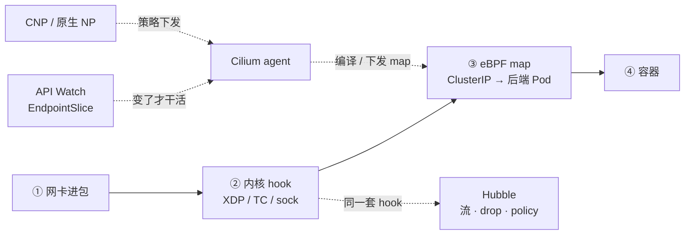
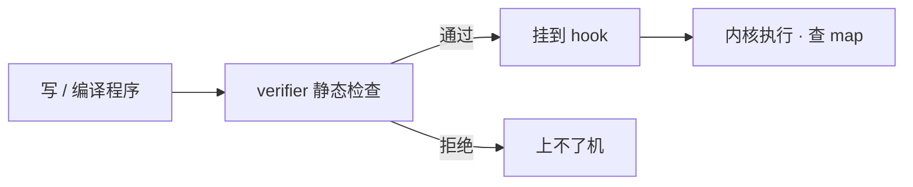
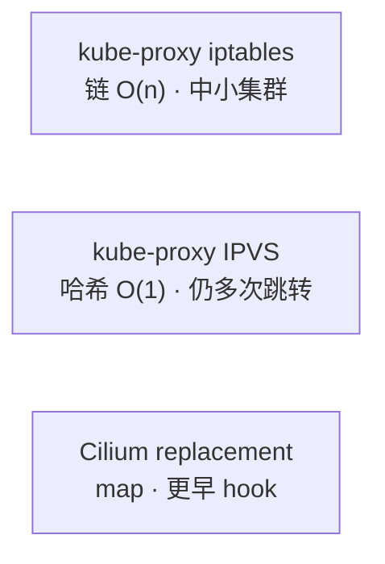
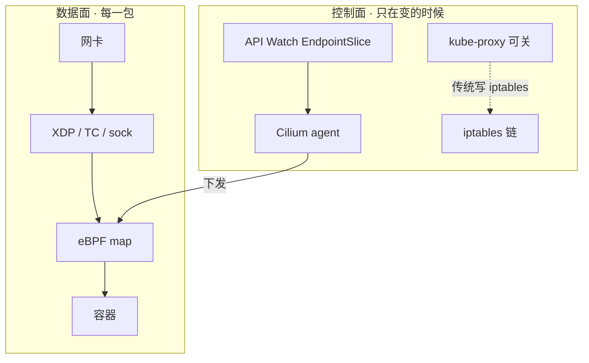
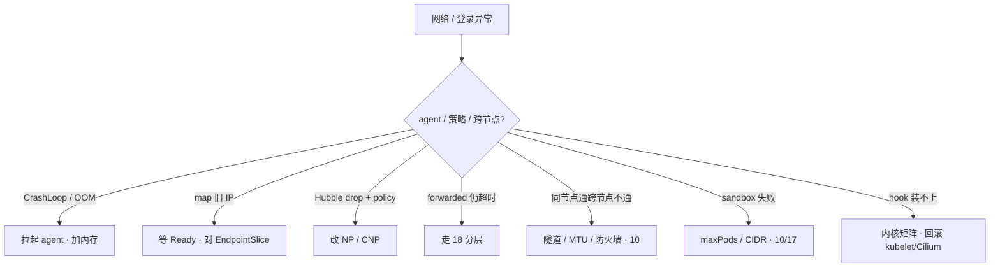

# eBPF 与 Cilium

> 集群已经 8000 个 Service，有人把 Cilium 讲成「用户态拦包」；另一人怕 eBPF 像 ko 打挂机器；某节点 cilium-agent CrashLoop，战斗服还在，新登录失败——有人要重启战斗进程；NetworkPolicy 上线后部分匹配失败，tcpdump 看不清是不是策略 drop。手都别动。
> **本章回答**：一次包在 Cilium 数据面的一生——hook 上转发、agent 只下发 map、Hubble 看见 drop、L7 按需开、关 kube-proxy 前确认什么。
> **不讲**：kube-proxy 四种模式与 iptables 链 → [08](../08-Service与kube-proxy/)；Calico/Flannel、原生 NetworkPolicy → [10](../10-CNI与网络策略/)；排障分层、Endpoints 空 → [18](../18-典型故障剧本/)；主机 iptables/conntrack → [01-17](../../01-基础底座/17-iptables与conntrack/)；Istio 金丝雀细节 → [15](../15-Ingress与流量管理/)、[16](../16-灰度与回滚/)、[24](../24-ServiceMesh-Istio与Envoy/)。不考写 eBPF C 代码。

**标记**：🎯重点 · 🔥难点 · ⭐常考 · 🔧实操

---

## 一、一张图：一次包在 Cilium 数据面的一生

> 🎯 **一句话**：包在内核 hook 上查 map 转发；agent 只在「变」的时候下发，不经手每一包。口诀：⭐ **agent 挂了和 kube-proxy 挂了同类——旧通新不通**。



- 📖 **读图**
  - 🛤️ 主线：网卡 → hook → map → Pod；**没有**实线从每一包指向 agent——它只在后台更新 map
  - 🔭 Hubble 挂在同一套 hook 上：agent 不健康时观测先瞎，不等于网络全死
  - 🚨 关 kube-proxy 前：replacement 必须覆盖 ClusterIP / NodePort / 外部流量三种

- 🔑 **三个名词**（后面每节展开）
  - **eBPF**：**e**xtended **B**erkeley **P**acket **F**ilter——内核里的可编程虚拟机；程序挂在 hook 上跑，不改内核源码、不等于任意加载 `.ko`
  - **verifier**：加载前的静态检查（越界 / 死循环 / 非法辅助调用）——过不了 = 上不了机
  - **Cilium agent**：每节点 DaemonSet；Watch EndpointSlice / 策略，编译并下发程序与 map——**不转发数据包**

> 💡 **打个比方**：iptables 像门卫按名单一个个核对（O(n)）；eBPF map 像刷卡闸机——ClusterIP 直接查表跳到后端。agent 是前台改闸机名单的人，客人（包）从不进前台窗口。

- 🗺️ **主线三步**（后面按阶段展开）
  1. **认转发**：eBPF 在内核 hook 上跑；agent 只下发 map
  2. **挂了**：存量往往还在，规则不再更新——旧通新不通
  3. **观测 / 策略**：Hubble 看 drop；L7 按需；游戏池分批切 replacement

本节对应练习题 Q1、Q2。

---

## 二、出场：eBPF 与 verifier ⭐🔥

> 🎯 **一句话**：eBPF 是内核可编程 VM；verifier 过不了上不了机——这是和乱加载 ko 最大的差别。

### 🪝 hook 落在哪

运维相关的 hook 大致三类：

- 🌐 **网络**：XDP / TC / socket / cgroup——更早拦包、DNAT、策略（Cilium 主战场）
- 👁 **观测**：kprobe / uprobe / tracepoint——系统调用、延迟
- 🛡 **安全**：LSM——进程 / 文件 / 网络强制（Tetragon 等，六节）

Cilium 还是 **CNI**：配 Pod IP、连通、执行 NetworkPolicy。和 Calico/Flannel 的差别不只「另一种插件」，而是数据面从「路由 + iptables」换成 eBPF；附带 Hubble 与 L7，传统 CNI 要另装。



- 📖 **读图**：唯一分叉在 verifier——过了才进内核；现场若「Pod Ready 但包不通」，先怀疑这条边走到了 `fail`（九节 `bpftool`）。

#### ❓ 为什么不像乱加载 ko 会打挂机器？

- ❌ **任意 `.ko`**：内核空间几乎无边界，写错就能 panic
- ✅ **verifier 先审**：越界、死循环、乱调辅助函数 → 拒绝加载；过了才挂 hook
- 🧱 **不改内核源码**：能力随内核版本逐步加——老内核程序装不上或功能残缺，是选 Cilium 的硬前提 → [17](../17-节点运行时与升级/)
- 口诀：⭐ **verifier 过不了 = 上不了机**
- 🔍 不是「内核 JavaScript 随便写」——辅助函数与 hook 点都是内核逐步开放的白名单

> ⚠️ **别混**：verifier 保证程序**不把内核打挂**，**不保证**你的 NetworkPolicy 写对了。

> 📝 **面试**：「eBPF 比乱加载 ko 安全在哪？」——内核可编程 VM，加载前 verifier 静态检查越界/死循环/非法调用，过不了不上机；不改内核源码。转发在 hook 上跑，agent 只下发 map。（练习题 Q1）

本节对应练习题 Q1。

---

## 三、转发：为什么 iptables 会慢 🎯⭐

> 🎯 **一句话**：Service×Pod 规则到几万条时 iptables 查找 O(n)；Cilium 用 map 在更早 hook 直接 DNAT。

### 📞 查找成本差在哪

> 💡 **打个比方**：iptables 像电话簿从 A 翻到 Z；eBPF map 像通讯录直接点名字。

| | 传统 iptables | Cilium eBPF |
|--|---------------|-------------|
| 拦包 | PREROUTING / KUBE-SERVICES | 更早的 sock / TC / XDP |
| 查找 | 按 Service 一条条匹配 O(n) | map：ClusterIP → 后端 O(1) |
| 谁更新 | kube-proxy Watch 后改链 | agent Watch 后更新 map |
| 这一包经不经用户态 | 不经 | 不经 |

三种数据面（装的时候选，挂的时候排障工具不一样）：



- 📖 **读图**
  - 左到右是三种数据面：链 → 哈希 → 更早 hook 的 map；排障工具跟着变
  - 小集群 `iptables -L` 还能看；切了 Cilium 改看 `hubble observe` 与 agent 日志。为了简历换 CNI 不值得

#### ❓ 为什么已经上了 IPVS 还可能要 Cilium？

- ✅ IPVS 已把查找变成哈希（[08](../08-Service与kube-proxy/)）——「更快」不是唯一理由
- 🔭 理由变成：**Hubble**（无 sidecar 看 drop）/ **L7 策略** / **更短路径**（更早 hook）
- ❌ 别说「IPVS 不能用」——能用，只是要不要交 Cilium 的调试税
- 🎮 玩家打大厅 ClusterIP：包到 Worker 网卡后在 sock/TC hook 查 map → 后端 Pod，**不经用户态**——和 kube-proxy 一样「包不进代理进程」

> 🔍 **现场**：大集群 CPU `%si` 涨、尾延迟抖时对照规则规模。

```bash
iptables -t nat -L -n | wc -l
# 48231                    # ← 四万多行：Endpoints 一变整表刷，软中断涨
# Cilium 节点没有对应长度的链——转发在 eBPF map
```

> 📝 **面试**：「iptables 为什么慢、Cilium 怎么快？」——规则随 Service×Pod 线性涨；Cilium 用 eBPF map O(1) 在更早 hook DNAT；小集群不必为性能换，大集群再评估 Hubble/L7。（练习题 Q2）

本节对应练习题 Q2。

---

## 四、下发：agent 挂了——旧通新不通 🔥⭐

> 🎯 **一句话**：agent 只写 map 不碰包；挂了之后存量长连接往往还在，规则不再更新——和 kube-proxy 挂了同类。

### 🧩 谁写规则、谁转包



- 📖 **读图**
  - 左：每一包只走 hook → map → Pod
  - 右：agent / kube-proxy 都是**规则下发器**——谁挂了都是「不再更新」，不是「立刻掐光所有连接」

#### ❓ 为什么存量长连接往往还在？

- 🧠 **map 还在内核里**：已建立连接按旧条目继续走；agent 进程死了不等于卸掉已挂载的程序
- 🆕 **会坏的是「新」**：新登录、重连、滚动后旧后端、Endpoints 已变但 map 未追上
- 口诀：⭐ **旧通新不通**——别为了「对齐状态」去杀还活着的战斗服
- 和 etcd 挂了不能发版、但长连接还在，是同一套拆法 → [02](../02-etcd/)

- 🗣️ **影响面三句**（白板常考，练习题 Q10）
  - 已有长连接：多数还在转
  - 新连接：按旧 map，可能打到已下线后端
  - Endpoints 已变：规则追上之前，滚动/扩缩最疼

> ⚠️ **别混**：**agent CrashLoop** ≠ **数据面立刻全死**。先拆三问：已有连接？新连接？Endpoints 已变之后？userspace 转发早已废弃（[08](../08-Service与kube-proxy/)）；谁当「规则下发器」，谁挂了都是「不再更新」。

> 🔍 **现场**：活动扩容后某节点 agent OOM——对局长连接还在，新匹配进这节点失败。

```bash
kubectl -n kube-system describe po cilium-<node>
# OOMKilled / CrashLoopBackOff     # ← 先给 agent 加内存，不给战斗服加
kubectl get endpointslice -n game
# 后端 IP 已变；agent 起来前 map 可能仍指旧 IP
# 拉起 agent 后 Hubble 看到目的 IP 追上 Slice → 若当时重启战斗服 = 自己踢还活着的玩家
```

> 📝 **面试**：「cilium-agent CrashLoop 时长连接怎样？」——存量往往还在（map 在内核）；新连接和 Endpoints 变化后的路由会出问题。先拉起 agent，核对 EndpointSlice，不要先重启战斗服。（练习题 Q3、Q10）

本节对应练习题 Q3、Q10。

---

## 五、看见：Hubble 无 sidecar 的流量图 🎯⭐

> 🎯 **一句话**：Hubble 在内核看连接和 drop 原因，比 tcpdump 更能指到是哪条策略拒的。

> 💡 **打个比方**：tcpdump 像路口监控——看见车停了不知道谁拦的；Hubble 像带原因码的闸机日志——「policy pay-api-only 拒绝」。


- 📖 **读图**
  - 从 observe 进 → 看 verdict → drop 带不带 **policy 名** 决定改 CNP 还是查系统层
  - L7 字段（path / method / topic）按需开——全开吃 CPU（七节）

| 你看到的 | 含义 | 下一步 |
|----------|------|--------|
| drop + policy 名 | 就是这条策略拒的 | 改 CNP / 原生 NP |
| drop 不带 policy 名 | 系统层 drop（防火墙 / MTU / conntrack…） | 别只改 NP，分层查 |
| forwarded 但应用超时 | 网络层过了 | 走 [18](../18-典型故障剧本/) 分层 |
| Hubble 没数据 | agent 不健康，观测先瞎 | 先救 agent |

#### ❓ 为什么 Hubble 没数据不等于网络全死？

- 🔭 Hubble **依赖同一套 hook / agent**：agent 挂了或 Relay 挂了 → 你看不见，不等于包没在转
- ✅ 先救 agent / `hubble status`，再谈「网络是不是死了」
- 和无 Hubble 时：仍走分层——localhost → EP → ClusterIP → 跨节点 → [18](../18-典型故障剧本/)
- 和 Istio sidecar 比：省资源、少一跳；复杂熔断/重试/按 header 切 5% 仍不如 Istio → [24](../24-ServiceMesh-Istio与Envoy/)
- 大规模「每个战斗服再加 Envoy」的 CPU 账，Hubble 更对游戏东西向「看见」场景（练习题 Q9）

> 🔍 **现场**：NetworkPolicy 上线后网关连支付超时。

```bash
hubble status
# Relay/UI 正常才继续 observe；Relay 挂了也会「没数据」
hubble observe --type drop -n game --from-pod game/gateway
# TIMESTAMP   SOURCE              DESTINATION      TYPE  VERDICT   POLICY
# 14:32:01    game/gateway:45678  game/pay:8080    TCP   DROPPED   pay-api-only
# ← drop + policy 名 → 改这条策略，不要先关 CNI
```

> 📝 **面试**：「Hubble 看什么？」——无 sidecar 看拓扑和 policy drop；带策略名就改 NP，forwarded 仍超时走分层排障；没 Hubble 退回 [18](../18-典型故障剧本/) 的分层。（练习题 Q4）

本节对应练习题 Q4。

---

## 六、分线：可观测 ≠ 安全 ≠ 网络数据面 🔥⭐

> 🎯 **一句话**：网络数据面、Hubble 观测、LSM 安全是三条产品线，「上了 eBPF」不等于「安全了」。

> 💡 **打个比方**：Cilium 像高速公路（转发）；Hubble 像路侧摄像头（看见）；Tetragon 像交警（拦住违章）——摄像头不等于交警。

| 方向 | 做什么 | 典型 | 不是什么 |
|------|--------|------|----------|
| **网络数据面** | LB、DNAT、NetworkPolicy | Cilium | 不是 WAF |
| **可观测** | 连接、延迟、drop 原因 | Hubble | 不是 SLO 本身 |
| **运行时安全** | 进程执行、文件、syscall | Tetragon / Falco | 不是替代 RBAC/准入 → [13](../13-RBAC与安全/) |

#### ❓ 为什么「上了 eBPF」还要 RBAC？

- 🌐 Cilium 管**包往哪走**（DNAT + NP）
- 👁 Hubble **默认不拦截**——只记录
- 🛡 Tetragon/Falco 用 **LSM** 拦 exec、读密钥——和 RBAC、准入是两层
- Hubble 看到的 drop 多半是 NetworkPolicy；Tetragon 拦住的是「容器不该 exec」
- 战斗服全量 syscall 跟踪是税；支付/GM 节点更值得
- 老板问「上了 eBPF 还要 RBAC 吗」→ 要：谁能改 Deployment / 谁能读 Secret，eBPF 管不着

> ⚠️ **别混**：**看见**（Hubble）≠ **拦住**（LSM）≠ **谁有权操作集群**（RBAC）。三层叠上才叫完整口径。

> 📝 **面试**：「eBPF 分几条线？」——网络、观测、安全三条；Hubble 是看见，LSM 是拦截，不能代替 RBAC。（练习题 Q5）

本节对应练习题 Q5。

---

## 七、立规：L7 策略比原生 NP 多一层 ⭐🔧

> 🎯 **一句话**：原生 NP 只到端口；Cilium L7 能在端口上再限 HTTP method/path，只给敏感路径开。

> 💡 **打个比方**：原生 NP 像「这扇门只能进」；L7 像「进了门只能走收银台那条过道」。

- 🧱 **原生 NetworkPolicy**（[10](../10-CNI与网络策略/)）：L3/L4——谁、哪端口、哪协议；选中后默认拒，要显式放行
- 📜 **CiliumNetworkPolicy（CNP）**：在端口之上可再写 `http.method` / `path`（及部分 Kafka 等）
- ⚠️ **不等价**：CNP 能力更强（L7、部分 namespace selector），别说「和原生 NP 完全一样」

```yaml
apiVersion: cilium.io/v2
kind: CiliumNetworkPolicy
metadata:
  name: pay-api-only
spec:
  endpointSelector:
    matchLabels: { app: game-pay }
  ingress:
    - fromEndpoints:
        - matchLabels: { app: game-gateway }
      toPorts:
        - ports: [{ port: "8080", protocol: TCP }]
          rules:
            http:
              - method: POST
                path: "/v1/charge"
```

#### ❓ 为什么 L7 不要打在战斗心跳上？

- 💸 **CPU 税**：UDP/高频心跳全量解析不划算
- ✅ 支付 / GM / 管理 Kafka 等敏感路径按需开
- ⚠️ 不要把 SQL SELECT 写成 http method；sidecarless 做基础 L7 可见与策略，完整金丝雀仍选 Istio（[15](../15-Ingress与流量管理/)/[16](../16-灰度与回滚/)）
- Cilium Gateway API 是**南北向**，东西向 eBPF 策略是另一层——别混成一回事（练习题 Q9）

> 🔍 **现场**：网关误发 GET。

```bash
hubble observe --from-pod game/gateway --to-pod game/pay
# VERDICT   L7 INFO
# DROPPED   HTTP GET /v1/charge denied by pay-api-only
# ← 改网关只发 POST → forwarded
```

> 📝 **面试**：「L7 策略怎么开？」——按需开在支付/GM；战斗心跳只到端口；Hubble 能打出 policy 名和 HTTP path。（练习题 Q6、Q13）

本节对应练习题 Q6、Q9、Q13。

---

## 八、落地：选型 · replacement · 游戏池分批 🔧⭐

> 🎯 **一句话**：内核够新是硬前提；replacement 覆盖三种流量再关 kube-proxy；游戏池非战斗先切。

### 🧭 什么时候上、什么时候不上

| 项 | 选 | 不选 |
|----|----|------|
| 节点少、NP 只到端口、内核老 | Calico/Flannel + kube-proxy | 为简历全面 eBPF |
| 规则爆炸、要 Hubble、要 L7、延迟敏感 | Cilium eBPF | 小集群交调试税 |
| 已有 Istio 重治理 | 并存评估，职责写清 | 为了 Mesh 再换 CNI |
| 已有 IPVS | 按 Hubble/L7/更短路径加税 | 「IPVS 不能用」 |

生产配置要点（改错会怎样）：

- 🔄 **kube-proxy-replacement**：覆盖三种流量再关 → 否则 NodePort 不通
- 🔭 **Hubble**：开；L7 可见性按需 → 全开吃 CPU
- 📜 **L7 policy**：支付/GM → 心跳全量解析会爆
- 💾 **agent 内存**：OOM 先给 agent 加 → CrashLoop 则 map 不更新
- 🧱 **Host 防火墙**：不要和 eBPF 抢 → 外部流量变黑盒
- 📋 **兼容矩阵**：kubelet / 内核 / Cilium 一张表 → hook 装不上

#### ❓ 为什么关 kube-proxy 只测 ClusterIP 不够？

- 🚪 很多登录走 Ingress/LB（[15](../15-Ingress与流量管理/)），NodePort 仍在的节点要**单独测**
- ✅ replacement 必须覆盖 **ClusterIP / NodePort / 外部流量** 三种再关
- 🔙 **回滚是重新拉起 kube-proxy**（并关 replacement），不是重启业务
- 🔧 关之前确认：内核与配置支持 replacement；Host 防火墙没有和 eBPF 抢；分批关 DaemonSet，先看 Hubble 与延迟


- 📖 **读图**：非战斗 → 大厅 → 战斗空服窗口；每步盯 Hubble、P99、NodePort——最后才关 kube-proxy。

#### ❓ 为什么 FailedCreatePodSandBox 不一定是 Cilium？

- ❌ 一上来重装 Cilium / 当 eBPF 程序挂了
- ✅ 先看 **maxPods** 与 **cluster-pool / 每节点 CIDR** 是否耗尽——看起来像 CNI 坏了，常是节点规划 → [10](../10-CNI与网络策略/)、[17](../17-节点运行时与升级/)
- 跨节点不通先怀疑隧道 / MTU / 安全组（[10](../10-CNI与网络策略/)），不要一上来重装

- 🎮 **游戏集群落地注意**
  - agent 挂了 ≈ 规则不更新：拉起 agent，对 EndpointSlice；别先重启战斗服
  - 战斗服最后切；L7 不打心跳；Hubble 代替每 Pod Envoy 做东西向看见
  - 完整金丝雀仍走 [15](../15-Ingress与流量管理/)/[16](../16-灰度与回滚/)

> 📝 **面试**：「关 kube-proxy 前确认什么？」——replacement 覆盖 ClusterIP/NodePort/外部流量；内核矩阵过了；Host 防火墙不抢；回滚靠拉起 kube-proxy。（练习题 Q7、Q11）

本节对应练习题 Q7、Q11、Q12。

---

## 九、作战：定责 🔥🔧

> 🎯 **一句话**：先拆三问——已有连接、新连接、Endpoints 已变之后——不要答「Cilium 挂了网络全死」。

### 🌳 决策树



- 📖 **读图**
  - 从现象进，不从组件进：先分叉 agent / 策略 / 跨节点
  - agent 不健康 → 救下发器；drop 带 policy → 改策略；forwarded 仍超时 → 别重装 Cilium，走分层

### 现象 · 先做 · 别做 ⭐

| 现象 | 先做 | 别做 |
|------|------|------|
| agent CrashLoop，长连接还在 | 拉起 agent | 重启战斗进程 |
| 新登录失败、observe 旧 IP | 等 map 追上 EndpointSlice | 先删 Pod「刷新」 |
| drop + policy | 改策略 | 先关 CNI |
| forwarded 仍超时 | [18](../18-典型故障剧本/) 分层 | 重装 Cilium |
| 关 kube-proxy 后 NodePort 死 | 核对流模式，回滚 kube-proxy | 重启游戏 |
| sandbox 失败 | maxPods / CIDR | 当 eBPF 程序挂了 |
| 升级后 hook 装不上 | 按矩阵回滚 | 先卸 CNI |
| Hubble 没数据 | 先救 agent | 说网络全死 |

#### ❓ 为什么 cilium status Ready ≠ 数据面生效？

- 🔥 verifier 可能**静默拒载**：Pod Ready、agent「健康」，但程序根本没挂上 hook——升级后要求更高内核 BTF 时最常见
- ✅ 必跑 `bpftool prog show | grep cilium`；日志搜 `verifier|rejected|load.*fail`
- 🔢 `IPv4 allocation` 接近 65535 → 不是 Cilium bug，是 `--cluster-pool-ipv4-cidr` 太小
- 口诀：⭐ **Ready 看 agent；挂载看 bpftool；池满看 allocation**

### 60 秒剧本 🔧

> 🔍 **现场**：接到「登录失败 / 部分节点不通 / NP 后超时」，60 秒走完再下结论。

```text
① 0–10s   问清范围：单节点 / 全集群？长连接还在吗？同时 describe cilium-agent
② 10–30s  hubble observe --type drop；有 policy 名 → 改 CNP；无数据 → 先救 agent
③ 30–45s  get endpointslice 对 observe 目的 IP；map 旧 → 等 agent Ready
④ 45–60s  跨节点不通 → 10；sandbox → maxPods/CIDR；hook 装不上 → bpftool + 内核矩阵
```

> 🔍 **现场**：三层确认——agent 健康、数据面 map、verifier 有没有拒载。

```bash
cilium status --verbose
# DaemonSet 40/40 ready · Hubble: OK (3 flows/s) · Controller failing=0
kubectl -n kube-system exec ds/cilium -- cilium status | grep -E 'Health|Controller|IPv4'
# Controller Status: 252 running / 0 failing   # ← failing>0 = 下发卡了
# IPv4 address allocation: 251/65535 used      # ← 接近满 = 扩 CIDR
kubectl -n kube-system logs ds/cilium | grep -iE 'verifier|rejected|load.*fail'
# "Error loading ... invalid argument"         # ← 内核缺 BTF 或版本不够
bpftool prog show | grep -i cilium
# 123: kprobe  name cilium_connect              # ← 没看到 = 程序没挂上
kubectl -n kube-system exec ds/cilium -- cilium status | grep -i 'kube-proxy'
# Kube-Proxy Replacement: Enabled/Disabled     # ← Disabled=还在用 kube-proxy
```

升级 / 回滚（高风险：数据面在跑，改错全集群断网——分批且能回退）：

```bash
# 升级前：记下 image tag 与 replacement 模式
kubectl -n kube-system get ds cilium -o jsonpath='{.spec.template.spec.containers[0].image}'
# quay.io/cilium/cilium:v1.14.0
kubectl -n kube-system exec ds/cilium -- cilium status | grep -i 'kube-proxy'
# 先单节点 canary，再 maxUnavailable=1 一台一台滚
kubectl -n kube-system set image ds/cilium cilium=quay.io/cilium/cilium:v1.14.0
kubectl -n kube-system rollout status ds/cilium --watch
# 升级后盯三件：agent 健康 / Hubble 有流 / 业务 SLI；必跑 bpftool 确认挂载
# 关 replacement 的回滚：重新拉起 kube-proxy，不能只改 image
```

本节对应练习题 Q8、Q10、Q12、Q14。

---

## 十、收口

### 命令速查 🔧

```bash
kubectl -n kube-system get ds,po -l k8s-app=cilium
kubectl -n kube-system describe po cilium-<node>
cilium status --verbose
hubble status
hubble observe -f
hubble observe --type drop -n battle
hubble observe --from-pod game/hall
kubectl get ciliumnetworkpolicy -A
kubectl get endpointslice -n game
bpftool prog show | grep -i cilium
iptables -t nat -L -n | wc -l    # 小集群对照；replacement 后几乎帮不上
```

### 面试锚点

| 问 | 30 秒答 |
|----|---------|
| eBPF 为何比乱加载 ko 安全？ | 内核可编程 VM；verifier 查越界/死循环/非法调用，过不了不上机；不改内核源码。 |
| Cilium 在用户态拦包？ | 错。转发在 hook；agent 只下发 map。 |
| 已上 IPVS 还要不要 Cilium？ | 性能理由变弱；看 Hubble / L7 / 更短路径值不值得交调试税。 |
| agent 挂了长连接？ | 存量往往还在；规则不再更新——旧通新不通；先救 agent 别杀业务。 |
| Hubble 看什么？ | 无 sidecar 看流与 policy drop；带策略名改 NP；forwarded 仍超时走分层。 |
| 上了 eBPF 就安全了？ | 否。网络 / 观测 / LSM 三条线；Hubble ≠ 拦截；不能代替 RBAC。 |
| L7 全开？ | 否。只给敏感路径；战斗心跳 UDP 不开解析。 |
| 关 kube-proxy 前？ | replacement 覆盖 ClusterIP/NodePort/外部流量；回滚靠拉起 kube-proxy。 |
| Ready 就等于数据面生效？ | 否。verifier 可能静默拒载；看 `bpftool prog show`。 |
| FailedCreatePodSandBox 一定是 Cilium？ | 不一定；先看 maxPods 与 cluster-pool CIDR。 |

### 易错一句话对照

- Cilium 在用户态拦每一包 → 转发在 hook；agent 只下发
- eBPF 等于乱加载 ko → verifier 过不了上不了机
- agent 挂了立刻全断 → 存量往往还在，规则不再更新
- Hubble 没数据 = 网络全死 → 观测先瞎，先救 agent
- forwarded 仍超时就重装 Cilium → 网络层过了，走分层排障
- 上了 eBPF 就安全了 → 观测 ≠ LSM 拦截 ≠ RBAC
- L7 打在战斗心跳 → 只给敏感路径；UDP 心跳不划算
- 关 kube-proxy 只测 ClusterIP → NodePort / 外部流量也要覆盖
- 回滚 replacement 靠重启业务 → 重新拉起 kube-proxy
- cilium status Ready = 数据面生效 → 看 bpftool 确认程序挂载
- drop 不带 policy 名 = 策略拒 → 带 policy 名才是策略拒
- Pod IP 分配失败 = eBPF 挂了 → 先看 maxPods / cluster-pool CIDR
- 内核 5.4 一定跑全特性 → BTF/LSM 要更高版本，对兼容矩阵
- Gateway API 和东西向策略一回事 → 南北 vs 东西两层
- 为简历换 CNI → 内核版本和调试是税

### 数字墙

> kube-proxy replacement **Disabled** 时 Cilium 不接管 Service 转发 · agent 默认 **DaemonSet** 每节点一个 · Hubble 默认存流约 **1h** · `cilium status` Controller failing=**0** 才健康 · verifier 是上机**硬门槛** · eBPF map 内核 **5.4+** 基本可用 / **5.10+** 推荐 · L7 只给**敏感路径** · Hubble drop 带 **policy 名** = 策略拒 · `--cluster-pool-ipv4-cidr` 默认常 **/24**（大规模要扩）· Tetragon 靠 **LSM**（内核 **5.7+**）· CNP apiVersion `cilium.io/v2` · 游戏池顺序：非战斗 → 大厅 → 战斗空服

---

## 合上书

对着第一节主图口述一遍；开篇那几人——「用户态拦包」「eBPF 像后门 ko」「agent 挂了重启战斗服」——各自错在哪，现在该能拦住。

- [ ] **默画主图**：网卡 → hook → map → Pod；agent 只下发；Hubble 挂同一 hook。（→ Q1、Q2）
- [ ] **口述 verifier**：为何比乱加载 ko 安全、过不了上不了机、不保证策略写对。（→ Q1）
- [ ] **口述转发差**：iptables O(n) vs map O(1)；已上 IPVS 时 Cilium 的理由变成啥。（→ Q2）
- [ ] **口述旧通新不通**：影响面三句；为何别杀战斗服。（→ Q3、Q10）
- [ ] **口述 Hubble**：drop+policy / 不带 policy / forwarded 仍超时 / 没数据各怎么办。（→ Q4）
- [ ] **口述三条线**：网络 / 观测 / 安全；看见 ≠ 拦住 ≠ RBAC。（→ Q5）
- [ ] **口述 L7**：原生 NP 到端口、CNP 到 path；为何心跳不开；南北 vs 东西。（→ Q6、Q9、Q13）
- [ ] **口述落地**：何时不上；关 kube-proxy 前三种流量；游戏池分批；回滚靠啥。（→ Q7、Q11）
- [ ] **定责**：60 秒剧本；Ready ≠ bpftool 挂载；sandbox 先查 CIDR；升级后盯 verifier。（→ Q8、Q12、Q14）

下一章：[多集群与联邦](../26-多集群与联邦/)。邻章：[08](../08-Service与kube-proxy/) · [10](../10-CNI与网络策略/) · [24](../24-ServiceMesh-Istio与Envoy/)。
