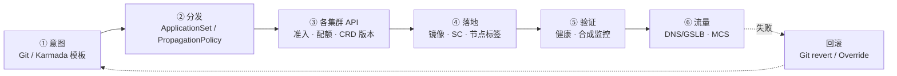
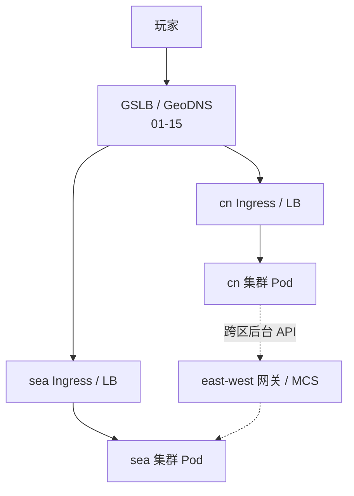
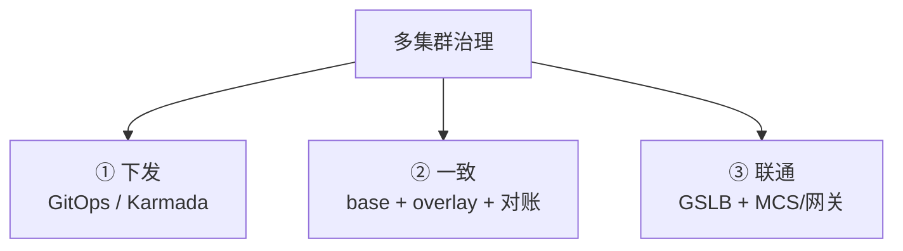
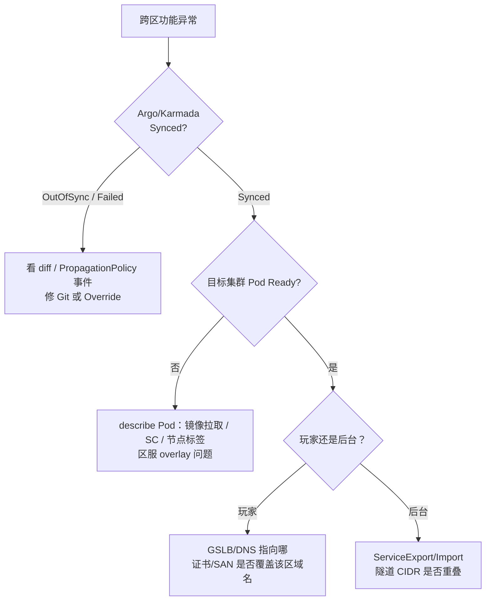

# 多集群与联邦

> 国服活动模板要同步到东南亚，有人直接 `kubectl --context=sea apply` 同一套 YAML——`StorageClass` 名对不上、镜像拉取 Secret 过期、`nodeSelector` 指向不存在的机型；群里在吵「上 Karmada 还是 Argo」，没人先问「没下发、没落地、还是流量没来」。
> **本章回答**：一次跨集群变更的一生——为什么拆、GitOps 与 Karmada/fleet 各管哪段、配置怎么一致、流量怎么跨集群、游戏多区服怎么挂。
> **不讲**：单集群 Service / Ingress → [08](../08-Service与kube-proxy/) · [15](../15-Ingress与流量管理/)；GitOps 单集群细节 → [23](../23-GitOps-ArgoCD与Tekton/)；证书与 kubeconfig context → [14](../14-证书与kubeconfig/)；全球 DNS / CDN → [01-15](../../01-基础底座/15-DNS与CDN/)；游戏分区架构 → [07-01](../../07-游戏运维专题/01-游戏服务器架构/)。

**标记**：🎯重点 · 🔥难点 · ⭐常考 · 🔧实操

---

## 一、一张图：一次跨集群变更的一生

> 🎯 **一句话**：跨集群变更走六段——意图 → 分发 → 各集群准入 → 落地差异 → 健康与流量 → 回滚/对账；卡住必在其中一段。



- 📖 **读图**
  - 🛤️ 主线六段；虚线回滚回到意图——不是只救一个区留下永久 skew
  - 🔦 控制面（谁下发期望）与数据面（玩家连哪）分开想：GitOps/Karmada 管「多个 API Server 收到对象」；DNS/GSLB 管「玩家进哪个区」
  - ⚔️ 排障第一问：**没下发**、**下发了没落地**、还是 **落地了流量没来**

> 💡 **打个比方**：多集群像连锁门店——总部菜单（Git）要发到各店，但华东店没有「麻辣锅底」（StorageClass），得用 **Override（覆盖）** 换本地等价物；开业（切流量）前各店自检，不能总部一按键全国同时开火。

---

## 二、动机：为什么要多集群

> 🎯 **一句话**：拆集群是为了 **故障域、合规、地域延迟、团队边界、升级节奏**——不是为了简历上的「联邦」二字。

### 🧭 常见驱动力 ⭐

- 💥 **故障域隔离**：活动服炸在 A，B 的大厅仍可用——单集群 etcd/control plane 挂了是「全服不能变更」，多集群把爆炸半径切开（[02](../02-etcd/)）
- 🌏 **地域与合规**：国服 / 东南亚 / 欧美 **数据驻留** 要求隔离；玩家就近接入靠地域集群 + [01-15](../../01-基础底座/15-DNS与CDN/) GSLB
- 👥 **团队与租户**：平台管 `platform`，游戏线管 `game-cn` / `game-sea`，RBAC 与变更窗口分离（[13](../13-RBAC与安全/)）
- 🧪 **版本与风险**：金丝雀集群先升 K8s，全量滞后两周（[17](../17-节点运行时与升级/)）
- 📈 **规模天花板**：单集群节点/Pod 上限、etcd 对象数、API QPS——到了再拆，不是第一天就拆

| 对比 | **单集群多命名空间** | **多集群** |
|------|----------------------|------------|
| 隔离强度 | 软隔离（RBAC/NP） | 硬隔离（独立控制面） |
| 运维成本 | 低 | 高（N 倍控制面 + 对账） |
| 跨区延迟 | 不适用 | 每区一套数据面 |
| 典型场景 | 中小团队 | 多地域、多合规域、大规模 |

#### ❓ 为什么不是「先拆再说」？

- ❌ **错答**：「多集群更安全 / apiserver 不够就拆」
- ✅ **真动机**：故障域、合规驻留、地域延迟、团队边界、升级金丝雀
- 🧮 **诚实账**：N 倍 API Server / etcd / 证书 / 升级窗口 + GitOps 凭据轮换 + 告警必须带 `cluster` 标签
- 👉 **三个服、两个区、团队五人**——先单集群 + ns + NetworkPolicy；业务和合规真逼到再拆

> 📝 **面试**：「多集群首要动机是故障域和合规，不是 kube-apiserver 性能不够；能单集群 ns 隔离就别急着多集群。」⭐（练习题 Q1）

本节对应练习题 Q1。好，为什么拆清楚了——GitOps 和 Karmada 各管哪段？

---

## 三、出生：意图从哪来——GitOps 与 Karmada

🔥 群里吵「上 Karmada 还是 Argo」——**高频错答是先选产品**。大白话：**GitOps 管「期望从 Git 同步到集群」；Karmada 管「一份模板派生到多集群并 Override」**。口诀：**「先分清管哪段，再选工具」**。⭐

> 🎯 **一句话**：**GitOps（Git 为唯一事实源，控制器自动同步）** 管「发什么」；**Karmada（开源多集群编排）** / **GKE Fleet（谷歌多集群舰队）** 管「发到哪些集群、怎么差异化」。

#### ❓ 为什么不是二选一？

- 🧩 **管的段不同**：GitOps = 期望从哪来、怎么对齐进 API；Karmada = 一份模板发到哪些 Member、副本怎么切、Override 怎么改
- ✅ **常组合**：Git 里放 PropagationPolicy / Override，Argo sync 到 Host；或 ApplicationSet 直推各成员——不是「上了 Karmada 就不用 Argo」
- 🏷️ **GKE Fleet** = 云厂商托管的同类治理面（Hub 注册、Config Sync）——面试知道「Fleet ≈ 谷歌版多集群治理」即可

> ⚠️ **别混**：**Karmada ≠ 旧版 kube Federation v2 的名词替换**——面试说「多集群编排」指 Karmada / Fleet / ApplicationSet 这一代；**不要背联邦 v1/v2 CRD**（练习题 Q13）。

### 📦 GitOps 多目标：ApplicationSet 🔧⭐

[23](../23-GitOps-ArgoCD与Tekton/) 单集群用 `Application`；多集群用 **ApplicationSet（应用集，按集群列表/generator 批量生成 Application）**：

```yaml
apiVersion: argoproj.io/v1alpha1
kind: ApplicationSet
metadata:
  name: lobby-all-clusters
  namespace: argocd
spec:
  generators:
  - list:
      elements:
      - cluster: cn-prod
        url: https://api.cn.example.com:6443
      - cluster: sea-prod
        url: https://api.sea.example.com:6443
  template:
    metadata:
      name: 'lobby-{{cluster}}'
    spec:
      project: game
      source:
        repoURL: https://git.example.com/game-k8s.git
        path: overlays/{{cluster}}/lobby
        targetRevision: main
      destination:
        server: '{{url}}'
        namespace: game
      syncPolicy:
        automated:
          prune: true
          selfHeal: true
```

- 📖 **读图**
  - 🗂️ **一个 Git 仓、多套 overlay（Kustomize 按集群覆盖）** 是主流——不是十二份复制粘贴
  - ⚠️ `prune: true` 删 Git 里已删的对象，多集群误删会 **同时删所有区**——变更走 MR + 审批（练习题 Q8）

```bash
argocd app list | grep lobby
# lobby-cn-prod   Synced   Healthy
# lobby-sea-prod  OutOfSync Degraded   ← 先看 sea 差异，别急着改 cn
kubectl config get-contexts
# 多集群 kubeconfig 见 [14]；值班先确认 current-context
```

> 🔍 **现场**：一区红、一区绿 → 只 `argocd app diff` 坏区；不要在好区重复 apply「修复」。

### 🏛️ Karmada：联邦式控制面 🔥⭐

Karmada 在 **Host 集群** 跑统一 API，用户提交 **PropagationPolicy（传播策略，声明资源要发到哪些成员集群）**：

```yaml
apiVersion: policy.karmada.io/v1alpha1
kind: PropagationPolicy
metadata:
  name: lobby-propagation
  namespace: game
spec:
  resourceSelectors:
  - apiVersion: apps/v1
    kind: Deployment
    name: lobby
  placement:
    clusterAffinity:
      labelSelector:
        matchLabels:
          region: ap
    replicaScheduling:
      replicaDivisionPreference: Weighted
      weightPreference:
        staticWeightList:
        - targetCluster:
            clusterName: sea-prod
          weight: 60
        - targetCluster:
            clusterName: cn-prod
          weight: 40
```

- 🔑 **Host 上的 Deployment 是模板**；控制器在各 **Member** 生成真实 workload
- 🛠️ **OverridePolicy（覆盖策略）** 改成员差异——`imagePullSecrets` 名、`replicas`、`nodeSelector`、SC 名（开头那个现场就该走这里，不是裸 apply）
- ⚖️ **副本权重** 在 `replicaScheduling`，不是手改每个区 Deployment

| 对比 | **GitOps 多 Application** | **Karmada PropagationPolicy** |
|------|---------------------------|-------------------------------|
| 控制面 | 每集群仍独立 API | Host 统一提交，再分发 |
| 差异 | Kustomize overlay / Helm values | OverridePolicy |
| 适合 | 团队已深度 Argo、集群异构大 | 要统一 API、多集群调度副本 |
| 风险 | Argo 挂了各集群仍跑旧状态 | Host 挂了无法下发新变更 |

#### ❓ Host 挂了，成员是不是全停？

- ❌ **错答**：「Karmada 挂了 = 全服下线」
- ✅ **Member 仍跑存量 workload**——只是不能下发新变更 / 新 Override
- 👉 现场：**暂停变更**，别以为玩家入口也跟着挂；玩家挂不挂看 GSLB 与该区 Ingress（五节）

> 📝 **面试**：「GitOps 管发什么，Karmada 管发到哪 + Override；常组合。Host 挂了成员仍跑，联邦 v2 不背。」⭐（练习题 Q2、Q3、Q8、Q13）

本节对应练习题 Q2、Q3、Q8、Q13。🔥 开头 SC 名对不上——Override / overlay 解决什么？

---

## 四、同步：配置一致性怎么保

> 🎯 **一句话**：**没有银弹**——靠 Git 评审 + 自动化对账 + 集群级 override + CRD/版本矩阵，接受「结构一致、参数因地而异」。

### 🧩 必须一致的 vs 允许不同的 ⭐

- ✅ **应一致（结构层）**
  - Deployment 模板、探针语义、HPA 行为、NetworkPolicy 逻辑
  - 镜像 **tag 策略**（都跟踪 `release-662.0`，不是每区乱 tag）
- 🔀 **必须不同（落地层）**
  - `StorageClass` 名、LB annotation、镜像仓库地域副本
  - `replicas`（SEA 玩家少）、`resources`（机型不同）
  - `ConfigMap` 里的区服 ID、Redis 地址、时区
  - 镜像拉取 Secret：cn 用 ACR、sea 用 GCR——**不能**把 cn 的 `dockerconfigjson` 复制到 sea

```yaml
# overlays/sea-prod/kustomization.yaml
resources:
- ../../base/lobby
patches:
- patch: |-
    - op: replace
      path: /spec/replicas
      value: 20
- patch: |-
    - op: replace
      path: /spec/template/spec/containers/0/resources/limits/memory
      value: 2Gi
```

- 🗂️ **Config Management 实践**：base 只放与地域无关部分；每区 `config.env` 进 `configMapGenerator`
- 🚫 **禁止** ssh 进集群 `kubectl edit` 改生产——改了就是漂移，下次 sync 被打回或永久 OutOfSync

### 🔎 对账与漂移 🔧

```bash
argocd app diff lobby-sea-prod
# ← live vs desired；先看坏区

kubectl --context=cn-prod get deploy lobby -o jsonpath='{.metadata.annotations.kubectl\.kubernetes\.io/last-applied-configuration}' | shasum
kubectl --context=sea-prod get deploy lobby -o jsonpath='{.metadata.annotations.kubectl\.kubernetes\.io/last-applied-configuration}' | shasum
# ← 哈希不同未必事故——overlay 本就不同；要比「是否符合 Git」
```

> 🔍 **现场**：SEA 手工 edit 过 ConfigMap → `OutOfSync` 或行为与 cn 不一致；修法是改 Git overlay，不是再 edit 一次。

### 📐 CRD 与版本矩阵 🔥

多集群最大坑之一：**集群 A 已装 Istio 1.22 CRD，集群 B 还是 1.20**——同一份 YAML apply 到 B 失败。

```text
组件          cn-prod   sea-prod   备注
K8s           1.29      1.29
Istio         1.22      1.20       ← sea 滞后，VS API 字段不同
Argo CD       2.10      2.10
```

- 🧪 升级顺序：**先金丝雀集群验证 CRD 变更，再推广**（与 [17](../17-节点运行时与升级/) 同节奏）
- 📦 Helm / Kustomize：同一 chart 不同 `values-{{cluster}}.yaml`，或 overlay——原则不变：**渲染结果进 Git / CI artifact**，值班不在笔记本上 `helm template | kubectl apply` 打生产

```text
charts/lobby/
  values-cn-prod.yaml    # replicas: 80, storageClass: alicloud-ssd
  values-sea-prod.yaml   # replicas: 30, storageClass: gp3
```

> 📝 **面试**：「一致性靠 Git 单源 + Kustomize/Helm 参数化 + CI 渲染检查；允许 replica/SC/LB 不同，不允许 hand-edit 线上。」（练习题 Q4）

本节对应练习题 Q4。好，配置能对齐了——玩家流量怎么跨集群？

---

## 五、联通：跨集群流量与服务发现

> 🎯 **一句话**：跨集群 **服务调用** 靠 **MCS（Multi-Cluster Services API）** / **Submariner** / 云厂商全球 Mesh / **显式网关**——不要假设 ClusterIP 能跨集群魔法互通。

### 🧭 玩家流量 vs 服务流量 ⭐



- 📖 **读图**
  - ⬇️ **南北向**（玩家）：DNS 分到最近区入口
  - ↔️ **东西向**（集群互调）：默认 **不通**——要专线/VPN、ServiceExport/Import，或统一走 **API 网关 + 公网/专线 URL**
  - 💣 战斗服硬编码对端 ClusterIP → 跨集群必挂

#### ❓ 为什么 ClusterIP 不能跨集群？复制 Deployment 够不够？

- 🧱 **ClusterIP 是本集群虚拟 IP**，只在本集群 Service / kube-proxy / CNI 语义里有意义——对端集群没有这条 Service
- 📦 **Karmada / ApplicationSet 复制了 Pod** ≠ 跨集群服务发现自动就绪——玩家仍要 DNS 切到对应区；后台互调还要 MCS 或网关
- 🌐 **GSLB 只解决玩家入口**，不解决「SEA 战斗服调 cn 排行榜」

| 对比 | **GSLB 分玩家** | **MCS / Submariner 互调** |
|------|-----------------|---------------------------|
| 对象 | 外部用户 | 集群间 Service |
| 典型 | 国服 / SEA 入口 | 跨区排行榜、合服后台 |
| 失败现象 | 解析到错误区 | ClusterIP 不可达 / 无 Endpoints |

### 🔗 MCS 与 Submariner（知道机制）

- 📤 **MCS API**（`ServiceExport` / `ServiceImport`）
  - 源集群 **Export** 一个 Service
  - 目标集群出现 **Import 的 ClusterSet IP**，DNS 形如 `my-svc.my-ns.svc.clusterset.local`
  - 实现依赖 **ClusterSet**（GKE Fleet MCS、Submariner、Cilium Cluster Mesh）
- 🚇 **Submariner**：隧道拉通多集群 Pod CIDR，配合 Lighthouse 做 DNS——运维要维护 **Pod/Service CIDR 不重叠**（与 [10](../10-CNI与网络策略/) 一体）

```bash
kubectl --context=cn-prod get serviceexports -A
kubectl --context=sea-prod get serviceimports -A
# Export 没有 / Import 没有 Endpoints → 控制面未同步
kubectl --context=sea-prod get endpointslices -n game imported-svc -o yaml
# ← 应看到源集群后端 IP；空 = 隧道或 MCS agent 问题
```

> 🔍 **现场**：跨集群调不通先查 **CIDR 是否重叠** 与 DNS（练习题 Q9）。两集群都从模板抄 `10.244.0.0/16` → 隧道路由冲突。

### 🔐 安全与密钥：每区独立

- 🔑 **镜像拉取 Secret**：cn 用 ACR token，sea 用 GCR/ECR——**不能**把 cn 的 `dockerconfigjson` 复制到 sea
- 📜 **TLS 证书**：按区域域名签发（`cn.example.com` vs `sea.example.com`）→ [14](../14-证书与kubeconfig/) · [15](../15-Ingress与流量管理/)
- 🪪 **RBAC**：Argo CD 对每集群用 **不同 ServiceAccount token**，最小权限——一个 token 泄漏不应能删所有集群

```bash
kubectl --context=sea-prod get secret -n game | grep pull
# sea-acr-pull   kubernetes.io/dockerconfigjson
# 若只有 cn-acr-pull → overlay 漏了 patch
```

### ⏱️ 变更窗口与爆炸半径

跨集群 **同一 MR 合并** ≠ **同一时刻生效**——用 Argo **sync wave** 或 Pipeline 阶段：

```text
wave 0：cn-staging 验证
wave 1：sea-staging
wave 2：cn-prod（国服活动前低峰）
wave 3：sea-prod（观察 30min 无告警再 sync）
```

```yaml
metadata:
  annotations:
    argocd.argoproj.io/sync-wave: "2"   # 数字小的先 sync；先 ConfigMap 后 Deployment
```

- 🧊 活动前 24h 冻结 **PropagationPolicy / ApplicationSet** 变更，只允许热修分支——防止「全球同时滚 Deployment」与游戏活动开关冲突
- ⏪ 回滚 = **Git revert + 各集群 sync**，不是只回滚一个区留下永久 skew
- 🧪 Karmada 侧用 PropagationPolicy 的 cluster affinity 先选金丝雀成员，再扩到全量

> ⚠️ **别混**：**多集群复制 Deployment ≠ 跨集群 Service 自动发现**；**GSLB ≠ MCS**。

> 📝 **面试**：「玩家用 GSLB；服务用 MCS/网关；ClusterIP 不跨集群；CIDR 必须不重叠。」⭐（练习题 Q5、Q6、Q9）

本节对应练习题 Q5、Q6、Q9。好，流量通路有了——游戏多区服怎么挂？

---

## 六、游戏：多区服怎么挂在这条主线上

> 🎯 **一句话**：**一区一集群（或一区一命名空间 + 强隔离）** 最常见；合服/跨区排行是 **数据与流量** 双问题，不是 kubectl 多 `--context` 能解决。

### 🗺️ 典型拓扑 ⭐🔧

```text
国服 cn-prod 集群：大厅 + 战斗 + 国服 DB
东南亚 sea-prod：大厅 + 战斗 + 本地 DB（活动配置从 Git 同步）
全球 global 集群：排行 / 匹配 / 支付回调（只放跨区服务）
```

- 🎮 **活动同步**：模板 YAML（ConfigMap/CR）走 GitOps main；**开服时间**用区服 values 注入；**热更**仍走游戏服自有通道，K8s 只负责进程与配置载体（[07-03](../../07-游戏运维专题/03-活动高峰与压测/)）
- 🏷️ **区服标识三层同名**：Git overlay 目录（`sea-prod`）、K8s label（`region=sea`）、应用 ConfigMap（`ZONE_ID=SEA`）——告警/日志用同一套，on-call 不会把东南亚当国服查

```yaml
metadata:
  labels:
    platform.moonton/cluster: sea-prod
    platform.moonton/region: ap-southeast-1
  annotations:
    argocd.argoproj.io/tracking-id: lobby:game/lobby
```

- 📊 Prometheus `external_labels`、Loki `cluster` 字段、告警路由 **必须与 kubeconfig context 同名**；合成大盘按 `cluster` 分组

### 🔀 合服与跨区衔接

#### ❓ 为什么合服必须先数据后 DNS？

- 💾 **数据层**：DB merge——顺序反了会双写
- 🌐 **K8s 层**：缩容旧区 Deployment + DNS 权重切走
- ✅ **先数据后流量**；跨集群变更窗口：**先非玩家路径（GM/支付回调）验证，再 GSLB 切玩家**

- 区内玩家 → [15](../15-Ingress与流量管理/) Ingress
- 区内互调 → [08](../08-Service与kube-proxy/) 或 [24](../24-ServiceMesh-Istio与Envoy/) Mesh
- 跨区后台 → MCS/网关，**不要**指望 Ingress 穿透集群
- Istio 多主 / 主从能扩 Mesh，但多数游戏公司 **区内 Mesh、区间网关** 就够（[24](../24-ServiceMesh-Istio与Envoy/)）

### 🧩 收束：多集群治理三件套 🎯⭐



- 📖 **读图**
  - ① 变更怎么传播；② 怎么不漂移；③ 用户和服务怎么找到对的地方
  - 缺任一都会在「一次跨集群变更」里暴雷

> ⚠️ **别混**：**多集群高可用 ≠ 单集群多副本**——两个集群各 3 副本，不会自动合成 6 副本抗单集群 etcd 挂；是 **控制面与故障域** 分开。

| 对比 | **单集群多 AZ** | **多集群多地域** |
|------|-----------------|------------------|
| 控制面 | 一套 | 每地域一套 |
| etcd | 共享（[02](../02-etcd/)） | 隔离 |
| 延迟 | 同城 AZ ms 级 | 跨地域 RTT 大 |
| 合规 | 同法域 | 可数据驻留 |

游戏 **同城三 AZ** 用单集群 + Pod 反亲和（[06](../06-调度机制/)）往往够；**跨国** 才上多集群。

### 🧯 灾难恢复与 Member 离线演练 🔧

- **RPO**：Git 里最后一次合并的 desired state
- **RTO**：备用集群 Argo sync + GSLB 切流的时间
- **数据**：游戏 DB 仍要跨区复制/备份——**K8s 对象恢复 ≠ 玩家数据恢复**
- 某成员控制面全挂：玩家若仍解析到该区 → 入口 502——runbook 写 **DNS 权重置零**（[01-15](../../01-基础底座/15-DNS与CDN/)）

```text
1. 从 Argo 摘掉一个 member（或 Karmada cordon cluster）
2. 确认该区存量 Pod 仍运行、GSLB 可切走
3. Git 合并一条小变更，确认离线区不 sync、在线区正常
4. 恢复 member，diff 对齐，无手工漂移
```

- 📖 **读图**：演练验证的是 **控制面断开时数据面能撑多久**，不是「把集群删了能否重建」——后者是备份/DR 另一条线。

```promql
sum by (cluster) (rate(http_requests_total{status=~"5.."}[5m]))
# ← 没有 cluster 标签会把国服异常稀释进全球均值
```

> 📝 **面试**：「游戏多区 = DNS 分玩家 + 每区独立数据面；配置 GitOps 同源异构；合服先数据后 DNS；DR = Git + DB 方案 + GSLB，不是 Karmada 瞬移玩家。」（练习题 Q7、Q12）

本节对应练习题 Q7、Q12。现在再看开头那次 apply——卡住在六段的哪一段？

---

## 七、作战：定责

> 🎯 **一句话**：跨集群故障先分 **下发（Argo/Karmada）/ 落地（集群差异）/ 流量（DNS/MCS）** 三支，别在错误集群上 kubectl。

### 🗺️ 决策树



- 📖 **读图**
  - 先问控制面是否 Synced → 再问落地 Pod → 再分流玩家（GSLB）与后台（MCS）
  - 一区绿一区红：只动坏区；Host 挂了先停变更，别当全服下线

### 现象 · 先做 · 别做

| 现象 | 先做 | 别做 |
|------|------|------|
| 一区 Synced 另一区 Degraded | `argocd app diff` 只看坏区 | 在好区重复 apply「修复」 |
| SEA 镜像 PullBackOff | 该区 registry secret / 镜像地域 | 强行改全球用 cn 镜像地址 |
| 跨区 API 超时 | CIDR、MCS Endpoints、防火墙 | 在业务里写死对端 ClusterIP |
| Host Karmada 挂了 | 成员仍跑，暂停变更 | 以为全服下线 |
| 活动配置不一致 | Git commit 与 Argo revision 对齐 | 手工 kubectl edit 某一区 |
| GSLB 切流后 502 | 该区 Ingress Endpoints（[08](../08-Service与kube-proxy/)/[15](../15-Ingress与流量管理/)） | 先动另一区集群 |

### 60 秒剧本 🔧

```text
① 0–10s   确认 context；argocd app get <app> 或 kubectl get propagationpolicy
② 10–30s  坏区：app diff / kubectl get pods -n game；好区对比 overlay 差异
③ 30–45s  玩家问题 → dig GSLB；后台问题 → serviceexports/imports + endpointslices
④ 45–60s  修 Git/Override 再 sync；切流前该区健康检查与监控合成视图通过
```

本节对应练习题 Q10、Q11、Q14。开头那位全量 apply 的同事——你已经知道该先对差异再分发了。

---

## 八、收口

### 命令速查 🔧

```bash
# 上下文
kubectl config get-contexts
kubectl config use-context sea-prod

# Argo CD 多集群
argocd app list
argocd app diff lobby-sea-prod
argocd app sync lobby-sea-prod --dry-run

# Karmada（在 Host 集群）
kubectl get propagationpolicies -A
kubectl get overridepolicies -A
kubectl get work -A   # 下发到成员的工作单元

# MCS（视实现而定）
kubectl get serviceexports,serviceimports -A
kubectl get endpointslices -n {ns} <imported-svc>

# 对账
kubectl --context=<c> get deploy,cm -n game -l app=lobby -o wide
```

### 面试锚点

遮住右列自问自答，卡壳的行回去重读对应小节。

| 问 | 30 秒答 |
|----|---------|
| 为什么多集群？ | 故障域、合规驻留、地域延迟、团队边界、升级金丝雀；不是 apiserver 不够就先拆。 |
| GitOps 多集群怎么做？ | ApplicationSet + 每集群 overlay；Git 单源，Argo 对各集群 sync。 |
| Karmada 干什么？ | Host 统一 API，PropagationPolicy 选集群，OverridePolicy 做差异，Member 落地。 |
| Fleet 是什么？ | GKE 多集群舰队/治理面，类似统一注册与策略下发。 |
| 配置怎么一致？ | base 同构 + Kustomize/Helm 参数化；禁止 hand-edit；Argo diff 对账。 |
| 跨集群流量？ | 玩家用 GSLB/GeoDNS；服务用 MCS/Submariner/网关，ClusterIP 不跨集群。 |
| MCS 是什么？ | ServiceExport/Import，`svc.clusterset.local`，需 ClusterSet 实现。 |
| 多集群最大坑？ | CRD/版本不一致、CIDR 重叠、Secret/SC 名不同、误 prune 全集群。 |
| 游戏多区？ | 一区一集群/强隔离；活动 Git 同步；合服先数据后 DNS；跨区用网关。 |
| 联邦 v2 要背吗？ | 不背；主流 GitOps + Karmada/Fleet。 |

### 易错一句话对照

- 多集群 = 复制 kubectl apply → 要有 overlay 与对账
- Karmada 替代 GitOps → 常组合使用，不是二选一
- 复制 Deployment 就能跨集群调用 → 还要 MCS/网关
- ApplicationSet prune 无害 → 误删 Git 对象会全集群删资源
- 两集群 CIDR 可重叠 → 隧道互调必须不重叠
- Host 挂了成员全停 → 成员仍跑，只是不能下发新变更
- GSLB 解决服务间调用 → 只解决玩家入口
- 手工改一区 ConfigMap 快 → 漂移，下次 sync 覆盖或永久 OutOfSync
- 联邦 API 是面试重点 → 重点是 GitOps/Karmada 这一代
- 多集群自动更高可用 → 是故障域隔离，运维复杂度上升

### 数字墙

> 建议 **单集群节点 小于 5000 / Pod 小于 150k** 量级再评估拆（视云厂商）· **GitOps sync** 失败先 diff 再看集群 · **GSLB TTL** 切流常留 **30–300s** 观察 · **MCS DNS** 后缀 **`svc.clusterset.local`** · Karmada **Host 1 + Member N** · 变更顺序 **金丝雀集群 → 全量集群**

---

## 合上书

对齐练习题「合上书」，逐条口述，卡住就回对应节 / 题号。现在再看开头那个现场——同一套 YAML 直接 apply、SC 对不上——你该知道卡在六段的哪一段了。

- [ ] **默画一节主图**：意图 → 分发 → 各集群 API → 落地差异 → 验证 → 流量/回滚。
- [ ] **口述为什么多集群**：至少四条动机 + 与单集群 ns 隔离对比。
- [ ] **口述 GitOps 多集群**：ApplicationSet、overlay、prune 风险。
- [ ] **口述 Karmada**：PropagationPolicy、OverridePolicy、Host vs Member；Host 挂了成员怎样。
- [ ] **口述配置一致**：什么必须同、什么必须不同、如何对账。
- [ ] **口述跨集群流量**：GSLB vs MCS；ClusterIP 为什么不跨集群。
- [ ] **口述游戏多区**：拓扑、活动同步、合服顺序、与 08/15/24 分工。
- [ ] **默画收束三件套**：下发 / 一致 / 联通。
- [ ] **定责**：决策树三支；Argo OutOfSync vs Pod 不 Ready vs DNS。
- [ ] **60 秒剧本**：context、diff、GSLB、ServiceExport 各何时查。
- [ ] **口述变更窗口**：sync wave、活动冻结、回滚 = Git revert 全集群。
- [ ] **口述 DR**：Git RPO、GSLB 切流、DB 与 K8s 对象恢复分离。

GitOps 深化：[23](../23-GitOps-ArgoCD与Tekton/)。kubeconfig：[14](../14-证书与kubeconfig/)。单集群网络：[08](../08-Service与kube-proxy/) · [15](../15-Ingress与流量管理/)。
