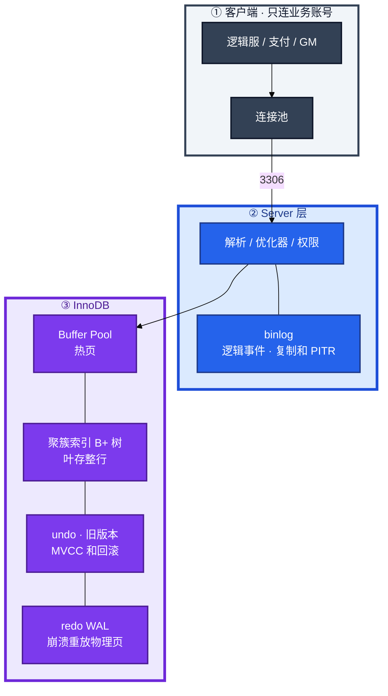
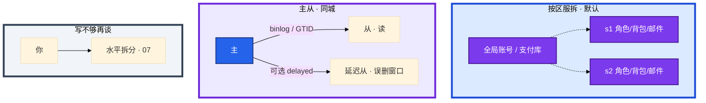
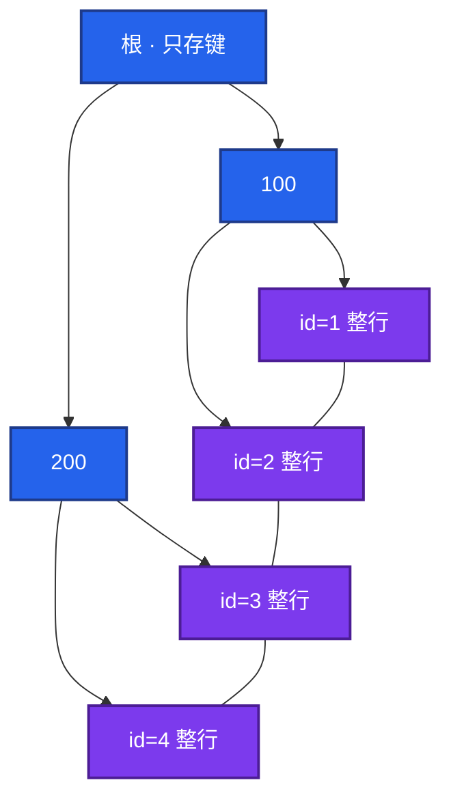
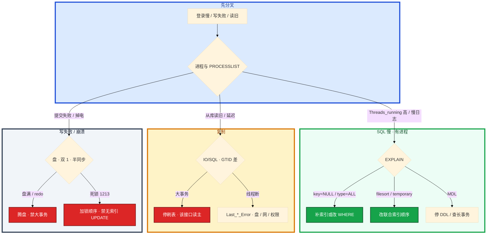

# MySQL


活动高峰，登录 SQL 全部排队。mysqld CPU 并不忙。群里有人要重启主库，另有人要把上周 xtrabackup 往还活着的从库上 restore。

先别动手。这一章后半全是你会动手的：**怎么装、怎么查慢 SQL、怎么切主、怎么 PITR、大表怎么加索引。** 前面的概念和原理，是为了让你动手时不选错路。

**读完你能：** 白板上画出一条 UPDATE 怎么过 Buffer Pool / redo / binlog；主从延迟能判断是大事务还是盘；误 DELETE 会按秒 PITR；大表加索引会选 INSTANT / gh-ost，而不是高峰锁表 ALTER。

**本章主线（排障就按这三步想）：**

1. **分层**：Server 层 binlog vs InnoDB redo/Buffer Pool；写成功 = 双 1 + 两阶段对齐。
2. **归类**：慢 SQL → EXPLAIN/锁/MDL；读旧 → 主从/GTID；写失败 → 盘/双 1/死锁。
3. **留证**：`PROCESSLIST` + `INNODB_TRX` + `SHOW REPLICA STATUS`，看清退出码再切主/重启。

## 本章目录

- [1. 基本概念](#1-基本概念)
- [2. 架构图](#2-架构图)
- [3. 原理](#3-原理)
  - [3.1 B+ 树](#31-b-树聚簇回表覆盖)
  - [3.2 最左前缀](#32-最左前缀跟着-where-失效)
  - [3.3 EXPLAIN 只看这几列](#33-explain-只看这几列)
  - [3.4 MVCC](#34-mvcc快照读当前读)
  - [3.5 一次 COMMIT](#35-一次-commitredobinlog两阶段)
  - [3.6 锁和死锁](#36-锁和死锁)
  - [3.7 主从](#37-主从gtid半同步)
- [4. 落地](#4-落地)
  - [4.1 生产怎么选](#41-生产怎么选)
  - [4.2 落地你实际看到什么](#42-落地你实际看到什么)
- [5. 核心配置](#5-核心配置)
- [6. 命令与操作](#6-命令与操作)
  - [6.1 备份](#61-备份)
  - [6.2 计划内切主](#62-计划内切主)
  - [6.3 故障切主](#63-故障切主)
  - [6.4 误删 PITR](#64-误删-pitr)
  - [6.5 大表 DDL](#65-大表-ddlinstant-inplace-gh-ost)
  - [6.6 升级](#66-升级)
  - [6.7 回滚](#67-回滚)
  - [6.8 扩容与容量](#68-扩容与容量)
- [7. 生产排障](#7-生产排障)
- [8. 必会 · 常考](#8-必会-常考)
- [合上书](#合上书问自己)

**本章不讲：** 水平拆分、分片键、ShardingSphere / Vitess / TiDB → [07 分库分表](../07-分库分表与中间件/)；合服步骤、回档审批、多存储对齐 → [08-02 开服合服](../../08-游戏运维专题/02-开服合服/)、[08-07 回档](../../08-游戏运维专题/07-玩家数据备份与回档/)；Redis 不当账本、缓存怎么写 → [02 Redis](../02-Redis/)、[03 缓存架构](../03-缓存架构/)。

---

## 1. 基本概念

MySQL 在游戏里是 **权威账本**：钱包、发货、邮件、道具数量以 InnoDB 提交为准。Redis 只是缓存，见 02、03。

InnoDB 不是「一个 mysqld 进程」，而是 **Buffer Pool 里的页 + 磁盘上的聚簇索引 + 两份日志（redo / binlog）**。客户端连上来的每一条写，最终都要在这三样上对齐，否则崩溃恢复、主从、PITR 会对不齐。

| 在 InnoDB / binlog 里 | 不在 MySQL 里 |
|-----------------------|---------------|
| 行、索引、undo、redo、binlog 事件 | Redis 里的背包缓存、排行 ZSet |
| 已提交事务（对外成功） | 对象存储里的邮件附件 |
| GTID、复制位点 | 逻辑服内存里的会话 |

三个角色不要混：

| 角色 | 干什么 |
|------|--------|
| **InnoDB** | 页、锁、MVCC、redo；崩溃靠它重放 |
| **Server 层** | 解析、优化器、权限、**binlog**（复制和 PITR） |
| **复制拓扑** | 从库拉 binlog 回放；读写分离只是路由，不是第二份权威 |

ACID 落点：A 原子 → undo；D 持久 → redo WAL；I 隔离 → 锁 + MVCC；C 一致是前三者加约束。默认隔离 **RR**。互联网很多业务用 RC；游戏账单、库存、邮件已读常留 RR，或关键语句显式 `FOR UPDATE` / 乐观锁 `version`。

游戏库默认按区服拆（`s1` / `s2`），全局账号和支付另库。一服一库是故障隔离，不是「还没到分表的时候随便堆」。

> **记住**：钱包、发货以 InnoDB 提交为准。查询慢先看有没有走对索引，不要先加机器。主从不齐先看复制路径卡在哪一段，不要只盯 `Seconds_Behind_Master`。

---

## 2. 架构图

先把整张图钉住。后面安装、命令、排障都对着这张图说话。



图上三条线：

1. **写成功** = InnoDB 页改完 + redo 按双 1 落盘 + binlog 两阶段对齐。缺任何一份，崩溃或 PITR 会对不齐。
2. **读**先撞 Buffer Pool；不在再从盘读进池。池太小，看起来像 SQL 慢，根因是随机读盘。
3. **从库不读主库的表**。它只拉 binlog 回放。延迟在这条路径上，不在「从库自己查慢」。

三种生产形态（装的时候选，挂的时候故障域不一样）：



按区服分库是默认，不是等单表到亿行才做。单服故障、回档、合服都按库切。全局账号和支付必须另库，避免一个区服的慢 SQL 拖垮充值。水平拆分放到 07，本章只要求说清：**先一服一库，不要上来就上 Vitess。**

---

## 3. 原理

原理只保留动手和面试会用到的：索引怎么走、隔离怎么挡、提交怎么对齐、复制卡在哪。

**本节 7 块：** 3.1 B+ · 3.2 最左前缀 · 3.3 EXPLAIN · 3.4 MVCC · 3.5 提交 · 3.6 锁 · 3.7 复制

### 3.1 B+ 树：聚簇、回表、覆盖

大厅执行：`SELECT gold, bag FROM player WHERE id = 10001;`。`id` 是主键。中间不是「查一张表」，是沿一棵 **B+ 树**往下走。

非叶只存键做导航，扇出大、树矮；叶节点串成**双向链表**，范围查询是 `O(log n + k)`，不用每扫一段就回根。这就是范围、排序、前缀扫描都走 B+ 的原因。



1. **主键等值：`WHERE id=10001`**  
   InnoDB 主键是**聚簇索引**，叶上存整行。优化器走主键，千万行也大约 2～3 层。页在 Buffer Pool 里就是内存命中；不在就从盘读进池。  
   `EXPLAIN`：`type=const` 或 `eq_ref`，`key=PRIMARY`。这是最快的一条路。

2. **二级索引再回表：`WHERE name='张三'`，只要 `SELECT *`**  
   `name` 上的二级索引，叶只存 `(name, 主键 id)`。先在 name 树上找到 id，再拿这个 id **回聚簇树走一遍**，叫**回表**。大表上回表 = 一次随机 IO。  
   `EXPLAIN`：`key=idx_name`，`Extra` **没有** `Using index`。

3. **覆盖索引：只要主键或索引里已有的列**  
   `SELECT id FROM player WHERE name='张三'`，二级索引叶上已经有 id，不用回表。  
   `EXPLAIN`：`Extra: Using index`。`SELECT *` 在大表上几乎总会回表。

哈希索引等值最快，但不支持范围、排序、前缀；Memory 引擎才用。B 树把数据散在各层，范围要多次回根，InnoDB 不用。低频状态列（0/1）单独建索引几乎没选择度，优化器宁可扫表。高频等值 + 范围，做成联合索引，不要一列一个索引堆上去。

> **记住**：主键叶上就是行；二级索引叶上只有主键，要整行就回表；列全在二级索引里才叫覆盖。覆盖消的是回表，**排序列不在索引顺序里仍 filesort**。

### 3.2 最左前缀：跟着 WHERE 失效

背包表有联合索引 `(zone_id, name, created_at)`。运营丢来一条：`WHERE name LIKE '张%' AND zone_id=1 ORDER BY created_at`。你怎么知道走没走、走了几列？

联合索引 `(a,b,c)` 按 a → b → c 排。可用 `a` / `a,b` / `a,b,c`。跳过 b 只带 c → 只用到 a。`a > 1 AND b = 2`：a 是范围，b 不能再当等值过滤（优化器可能 ICP，但不要指望）。

```sql
WHERE a = 1 AND b = 2              -- 用 a,b
WHERE b = 2                        -- 不用
WHERE a = 1 AND c = 3              -- 只用 a
WHERE a > 1 AND b = 2              -- 用 a，b 基本失效
WHERE YEAR(create_time) = 2024     -- 函数，该列失效
WHERE phone = 13800138000          -- varchar 列喂 int，隐式转换
WHERE name LIKE '%张'              -- 左模糊
WHERE name LIKE '张%'              -- 右模糊，可走
WHERE note = 'x'  且 note 无索引   -- UPDATE/DELETE 会扫全表
```

确认：`EXPLAIN` 先看 `key` / `key_len`（不要从 `id` 列读起）。`key=NULL` 没走；`key_len` 判断联合索引用了几列。无索引 `UPDATE` / `DELETE` 在 RR 下锁大量间隙，接近表锁。开服一条「补发道具」刷全表（`WHERE note='活动'` 且 `note` 无索引），登录 SQL 全堵在后面。WHERE 必须能走索引，不是「表还小没关系」。

### 3.3 EXPLAIN 只看这几列

不要把 EXPLAIN 背成字段大全。生产里先看这四列，对不上再往下挖。

| 字段 | 红线 | 这条上你可能看到 |
|------|------|------------------|
| `type` | `ALL` 必须解释为什么能接受；目标 `ref` / `range` / `eq_ref` | `range`（LIKE 右模糊）或 `ref`（等值） |
| `key` | `NULL` = 没走索引 | 应是 `(zone_id, name, …)` |
| `rows` | 估算扫描行；和实际差一个数量级，先怀疑统计信息过期 | 合服、大批量发奖后最容易估飞 |
| `Extra` | `Using filesort` / `Using temporary` 在大表上必须消 | `Using index` 才是覆盖；没有就是要回表 |

`type=index` 是扫**整棵索引**，大表上和 `ALL` 一样危险，只是少回表。`Using filesort`：`ORDER BY` 用不上索引；把排序列接到联合索引最右连续位置，如 `WHERE user_id=? ORDER BY created_at DESC` 用 `(user_id, created_at)`。`Using temporary`：`GROUP BY` / `DISTINCT` 临表，大表会打临时盘。`rows` 估飞先 `ANALYZE TABLE`（合服、大批量发奖后最常见）。`key=NULL` 先补索引或改 WHERE；`type=ALL` 且 `rows` 百万必须解释；`filesort` 先改联合索引顺序，不要先加机器。

### 3.4 MVCC：快照读、当前读

默认 **RR**。事务 T 打开背包看钻石，事务 U 同时把钻石从 100 改成 80。


规则三句：`trx_id < min` 且已提交 → 可见；在活跃列表里 → 不可见；`>= max`（快照之后才开的事务）→ 不可见。上图 100 在活跃列表 → 沿 undo → 80 可见。

1. **普通 `SELECT` 是快照读**  
   走 MVCC，不加行锁。RR **整事务复用同一个 ReadView**，所以同一条 SELECT 反复跑结果相同——T 一直看到 100，即使 U 已经提交 80。

2. **`SELECT ... FOR UPDATE` / `UPDATE` / `DELETE` 是当前读**  
   走 Next-Key Lock（行锁 + 前面的间隙），用来挡「当前读路径上的幻读插入」。当前读看到的是最新已提交行。库存扣减不要假设普通 SELECT 能锁住行。

3. **RR 不能在「先快照读再当前读」混用时完全防幻读**  
   快照读看到旧画面，当前读看到新行。钱包扣减：一开始就 `SELECT ... FOR UPDATE`，或乐观锁 `version`。

**RC 每次 SELECT 新建 ReadView**，能读到别的事务已经提交的新值，间隙锁更少，死锁少，幻读和不可重复读更多。

undo 不是只给 MVCC。长事务不提交，undo 不能清，ibd 膨胀，purge 落后，历史查询越来越慢，从库回放也会被拖。开服期间一条「合服比对」开着事务挂半小时，比一条慢 SQL 更难发现。看 `information_schema.INNODB_TRX` 的 `trx_started`。

> **记住**：快照读看旧版本，当前读加锁看最新行；混用仍可能幻读；长事务比慢 SQL 更阴。

### 3.5 一次 COMMIT：redo、binlog、两阶段

支付库执行 `UPDATE wallet SET gold=gold-10 WHERE uid=10001`，然后 `COMMIT`。对外说「提交成功」之前，两份日志必须对齐。

**redo** 记的是 InnoDB **物理页**怎么改，崩溃后重放，保证 D。  
**binlog** 记的是 Server 层 **逻辑事件**，给主从复制和 PITR。  
两份日志靠**两阶段提交**对齐：提交成功必须两边都有，否则会出现「从库有、主库恢复后没有」或反过来。


`innodb_flush_log_at_trx_commit` 三档：

| 值 | 行为 | 掉电 |
|----|------|------|
| **1** | 每次 COMMIT **fsync redo** | 不丢已提交 |
| **2** | COMMIT 只写 OS 缓存，约每秒 flush | 大约丢 1 秒 |
| **0** | 日志写入和 flush 都约每秒 | 可能丢更多 |

`sync_binlog=1` 让每次事务的 binlog 也 fsync。`flush_log=1` + `sync_binlog=1` 是**双 1**，掉电不丢已提交事务，写吞吐最低。`=2` 大约丢 1 秒，换性能。**支付、充值、发货相关库通常不敢关双 1**；日志库、可重建的排行快照可以松。这和 Redis 缓存能丢不是同一类数据。

只开 redo、不归档 binlog，能扛进程崩溃，扛不住误 DELETE 的按秒回档。云盘快照是机器级点，中间那几分钟对不齐，游戏回档要到秒，快照不能替代 binlog PITR。

卡住先看哪：崩溃后从库多了一笔、主库没有 → 两阶段没对齐，查崩溃那一刻 redo 是 prepare 还是 commit。

### 3.6 锁和死锁

典型死锁：发奖脚本锁玩家钱包再锁道具行，逻辑服扣道具刚好相反。InnoDB 检测到环就回滚**代价小**的那个，错误号 `1213`。业务必须能重试，不能把死锁当致命失败。


```sql
SHOW ENGINE INNODB STATUS\G     -- LATEST DETECTED DEADLOCK
-- 8.0 还可以看 performance_schema.data_locks
```

生产打开 `innodb_print_all_deadlocks`，不要只靠 STATUS 里那一次快照。应用日志里是 `1213`，先对两边 SQL 的加锁顺序，不要先加锁等待超时。

治理：

1. 统一加锁顺序（先玩家后道具，全站一样）
2. 缩小事务，别在事务里调 HTTP
3. WHERE 必须走索引，避免锁扩大
4. 热点行（库存、全服计数）用乐观锁 `version`，或把热点拆行

**无索引 UPDATE / DELETE 为什么危险：** RR 下当前读用 Next-Key，扫到的间隙全锁。一条 `UPDATE player SET vip=1 WHERE note='活动'`（note 无索引）等于锁表。并发登录、发奖直接堵死或连环死锁。

`KILL QUERY` 只杀当前语句；`KILL` 连接会回滚**整事务**。合服刷表中途杀连接，回滚本身会打满 undo、拖主从，可能比原语句更久。杀之前看 `PROCESSLIST` 的 `Time` / `Info` 和业务 owner，长事务回滚要先报。

### 3.7 主从：GTID、半同步

复制不是「从库自己去读主库表」。合服脚本 `UPDATE player SET zone_id=2` 扫了百万行，提交之后从库开始卡。路径是固定的：


并行复制只能让**不同事务**同时回放。一个 10 分钟大事务，从库至少卡 10 分钟，worker 帮不上这个事务内部。合服刷表、活动一次 `UPDATE` 百万行，是延迟的第一元凶。

**GTID**（Global Transaction Identifier）= `source_id:transaction_id`。生产开 `gtid_mode=ON` + `enforce_gtid_consistency=ON`。切主、搭从不用对 binlog 文件名 + pos，用 `SOURCE_AUTO_POSITION=1`。值班看的是 `Retrieved_Gtid_Set` vs `Executed_Gtid_Set`：差集就是还没回放完的事务。从库报 Duplicate / 错误 GTID，先分清是 errant 事务还是该跳，不要盲 `SET GTID_NEXT`。

**半同步（semi-sync）**：主库至少等 **一个** 从库收到 binlog 才向客户端返回成功。超时（常见 1～3s）**退回异步**，不是一直堵死。

| 插件模式 | 等 ACK 的位置 | 崩溃语义 |
|----------|---------------|----------|
| `AFTER_SYNC` | 写完 binlog、**commit 前** | 少丢；生产优先 |
| `AFTER_COMMIT` | **commit 后**再等 | 从库可能多一笔主库已返回的 |

半同步不是零丢失，也不是同步复制。要自动选主、几乎不丢，上 Group Replication / 云多 AZ，不要把半同步当同步。`rpl_semi_sync_master_wait_no_slave`、从库必须装 slave 插件，否则主库会一直退回异步你还以为在保。

`Seconds_Behind_Master` 是 SQL 线程时钟差。**大事务回放中它会跳变；并行复制时会低估。** 要看的是：

1. IO / SQL 线程是不是 Yes
2. 主从 GTID 差、`Relay_Log_Pos` 还动不动
3. 主库 `information_schema.INNODB_TRX` 有没有跑了数分钟的事务
4. 从库 `Threads_running`、磁盘 `%util`

| 原因 | 观测 | 处理 |
|------|------|------|
| 主库大事务（合服刷表、活动发奖） | `INNODB_TRX` 运行数分钟 | 拆批提交；禁高峰 `DELETE` 百万行 |
| 从库回放并行度不够 | `replica_parallel_workers=0` 或过小 | 5.7+ `LOGICAL_CLOCK`，worker 对齐 CPU 但别打满 |
| 从库 IO | `iostat` `%util` 高、redo 和备份同盘 | SSD 分盘；别和备份抢 IO |
| 网络 | IO 线程停、`Last_IO_Error` | 查跨 AZ 带宽/丢包，别先改业务 |

读写分离：延迟超过 SLO（游戏常见「刚买的道具从库读不到」）→ **该接口读主**，或关掉这条链路的从库路由。延迟告警不要只钉秒数，钉「业务可感知的读旧」。`Seconds_Behind_Master=0` 不等于这条事务已经回放到从库。

从库可以当备份源，但主从一起误 DDL 会一起坏。**延迟从库**（delayed replica）才能扛「删错后几小时才发现」。

> **记住**：先看 IO/SQL 线程和 GTID 差，不要只报秒数；大事务不能被并行复制消化。半同步超时会退回异步。

---

## 4. 落地

### 4.1 生产怎么选

| 项 | 选 | 不选 |
|----|----|------|
| 拓扑 | 一服一库；账号/支付另库；主 + 至少一从 | 全区一张库硬堆；上来就 Vitess |
| 节点 | 主从同城多 AZ；延迟从另放 | 跨 region 同步复制当 HA |
| 磁盘 | 本地 NVMe/SSD；redo、数据、binlog 尽量分盘 | 机械盘、和游戏日志/备份同盘 |
| 引擎 / 字符 | InnoDB、`utf8mb4` | MyISAM 当玩家表 |
| 版本 | 8.0，GTID 开 | 生产关 GTID 用文件位点硬切 |
| 账号 | 业务最小权限；管理走独立账号 | 应用用 root、`GRANT ALL` |

托管（RDS / PolarDB）：ssh 不进机器，上线前问清备份 RPO、谁做 PITR、大表 DDL 走谁的 OSC、只读实例延迟 SLO。停变更的仍是你的业务。

### 4.2 落地你实际看到什么

| 路径 / 口 | 内容 |
|-----------|------|
| 数据目录 | ibd、系统表空间；**这就是数据** |
| redo | `innodb_log_file` / 8.0 redo 目录；崩溃重放靠它 |
| binlog | `log_bin` 目录；复制和 PITR 靠它，必须**另机归档** |
| 错误日志 / slow log | 排障入口 |
| **3306** | 仅业务网段 + 管理跳板；不要对整个 VPC 裸奔 |

验收：进程在不算数。必须能连上、`SHOW REPLICA STATUS` 线程 Yes（有从时）、慢日志在转、备份任务跑通过。不要只探 TCP 3306。

连接：`逻辑服数 × 连接池` < `max_connections`，留约 **20%** 给 DBA 和监控。K8s 滚动时每个 Pod 重建池，短时间连满——滚动要限 `maxUnavailable`，池要有上限。细节和网关超时链见 [04 接入网关](../04-接入网关/)。

---

## 5. 核心配置

只动有证据的项。改完要能说出「掉电丢什么、从库延迟会怎样」。双 1 和 Buffer Pool 不要凭感觉拧。

| 参数 | 默认倾向 | 生产怎么用 | 改错会怎样 |
|------|----------|------------|------------|
| `innodb_buffer_pool_size` | 专用库 **50%～70% RAM** | 命中率不够先看这个，不要先加从 | 太大 OS 换页；太小狂读盘 |
| `innodb_buffer_pool_instances` | 大池拆实例 | ≥8GB 池再拆，减少锁竞争 | 盲目拆小池无收益 |
| `innodb_flush_log_at_trx_commit` | **支付库 =1** | 日志/可重建快照可以 2 | 支付库 =2：掉电丢约 1s 已提交 |
| `sync_binlog` | **支付库 =1** | 与上一行组成双 1 | =0：PITR 和从库会少事件 |
| `gtid_mode` / `enforce_gtid_consistency` | **ON** | 切主靠 AUTO_POSITION | 关了切主要对文件位点，易错 |
| `binlog_expire_logs_seconds` | 覆盖发现窗口 | 必须 **> 发现误删到开始恢复** | 过期了全量也救不了中间几小时 |
| `innodb_io_capacity` | 按盘 | SSD 提到盘的真实 IOPS | 过小脏页堆积；过大打满盘 |
| `max_connections` | 按池乘法 | 留 20% 给人；滚动翻倍要算进去 | 打满业务连不上；盲目加大藏泄漏 |
| `replica_parallel_workers` | >0 | `LOGICAL_CLOCK`，别打满 CPU | =0 大事务更卡；过大从库打满 |
| `rpl_semi_sync_*` | 支付库建议开 | 超时退异步；监控是否真在等 ACK | 从库插件没装 = 一直异步 |

Buffer Pool 是热页缓存。命中看 `Innodb_buffer_pool_read_requests` vs `Innodb_buffer_pool_reads`。重启后池是冷的，开服前预热（`innodb_buffer_pool_dump_at_shutdown` / `load_at_startup`，或业务热点 SELECT）。脏页太多会 checkpoint 把刷盘打满，看起来像「写入突然慢」。

> **记住**：`innodb_flush_log_at_trx_commit` 用来换 **掉电丢不丢已提交**，不是用来扛慢 SQL。Buffer Pool 太小先加池或减冷数据，不要先加从库。

---

## 6. 命令与操作

值班先跑这几条：

```sql
SHOW PROCESSLIST;
SHOW ENGINE INNODB STATUS\G
SELECT * FROM information_schema.INNODB_TRX;
SHOW REPLICA STATUS\G          -- 8.0；旧版 SHOW SLAVE STATUS
SHOW GLOBAL STATUS LIKE 'Innodb_buffer_pool%';
```

| 目的 | 命令 | 看什么 |
|------|------|--------|
| 谁堵住了 | `SHOW PROCESSLIST` / `performance_schema.threads` | `Time` / `State` / `Info`；`Waiting for table metadata lock` |
| 死锁 | `SHOW ENGINE INNODB STATUS` | `LATEST DETECTED DEADLOCK` |
| 长事务 | `INNODB_TRX` | `trx_started`、`trx_query` |
| 复制 | `SHOW REPLICA STATUS` | IO/SQL Yes；`Retrieved_Gtid_Set` vs `Executed_Gtid_Set`；`Last_SQL_Error` |
| 索引 | `EXPLAIN` / `EXPLAIN ANALYZE`（8.0） | `type` / `key` / `key_len` / `rows` / `Extra` |
| 统计 | `ANALYZE TABLE` | 合服、大批量发奖后计划估飞 |
| 锁 | 8.0 `data_locks` / `data_lock_waits` | 谁堵谁 |
| 备份校验 | xtrabackup `--prepare` 演练机 | 能启动、能对账才算有 |

`Seconds_Behind_Master` 只作参考。`KILL QUERY` vs `KILL` 见 3.6。生产排障不要在主库 `SELECT *` 百万行「看看数据还在不在」。

指标（Prometheus / exporter 常见）：

| 指标 | 阈值 | 级别 |
|------|------|------|
| 复制中断（IO/SQL 非 Yes） | 持续 | **P0** |
| 业务可感知读旧 / GTID 差 | 超 SLO | P0/P1 |
| Buffer Pool 命中 | 专用 OLTP **< 99%** 要解释 | P1 |
| `Threads_running` / 连接 | 打满或持续飙 | P0 |
| 磁盘 `%util`（数据/redo 盘） | 持续高 | P0/P1 |
| 死锁次数 | 活动期突增 | P1 |
| 备份失败 / binlog 归档断 | 一次 | P1 |

日志：`Waiting for table metadata lock` = DDL/长事务；`Deadlock found` = 1213；`The table is full` / redo 写满 = 盘或 undo；slow log 里全表扫描 = 先 EXPLAIN。

---

### 6.1 备份

生产全量用 **xtrabackup**（物理、热备、跟 redo）。`mysqldump` / `mydumper` 逻辑、慢、可跨版本，只适合小库、结构、应急导表。云快照要确认一致性（freeze 或官方工具），仍须 **binlog 实时归档到另一台机器 / 另一 AZ**。

RPO：全量间隔 + binlog 是否实时归档。RTO：物理备比 dump 快一个数量级。至少每日全量；发版、合服、大 DDL 前加打一份。异地 **7～30 天**。本机 cron 不算备份。

**季度做一次 restore + PITR 演练**，记下 RTO。没有演练 = 没有备份。

从库能当备份源，不能当唯一备份。主从一起执行了错误 DDL，两边一起坏。延迟从库扛「几小时后才发现」。

### 6.2 计划内切主

GTID 开着时：


停写 → `Executed_Gtid_Set` 追上 → 提升从 → 切 VIP / 服务发现 → 旧主改从并核对 GTID。不要双写；客户端不要写死 IP。

### 6.3 故障切主

主库磁盘没了、进程起不来。

1. 确认旧主真的不能写（隔离网卡 / 禁 3306），防止脑裂双写。
2. 在从库里选 **Executed_Gtid_Set 最完整** 的提升。
3. 应用切新主。丢的是半同步超时窗口或异步 lag 那几秒——**支付以订单表为准对账**，不要假设零丢失。
4. 旧主回来只能当从，先核对 GTID / 是否有 errant，必要时重建从库。

半同步只能降低丢失，不能替代对账。双主双写是事故，不是 HA。

### 6.4 误删 PITR

GM 误 `DELETE FROM mail WHERE 1=1`。按秒回到错操作之前。不要在主库上「试着 INSERT 回去」。


`expire_logs_days` / `binlog_expire_logs_seconds` 必须覆盖「发现误删 → 开始恢复」的窗口。发现晚了、binlog 已经过期，全量也救不了中间那几小时。

**游戏回档不能只回 MySQL。** Redis 背包缓存、对象存储邮件附件、发货状态要对齐位点，只回 MySQL 会脏（邮件已发、钻石已花、缓存还是旧的）。完整 runbook 在 [08-07](../../08-游戏运维专题/07-玩家数据备份与回档/)。

### 6.5 大表 DDL：INSTANT / INPLACE / gh-ost

开服第一周给两千万行的 `player` 加索引。默认可能 copy 表 + 持 MDL：阻塞 DML、打满磁盘、拖主从，登录直接排队。

MySQL 8.0：`ALGORITHM=INSTANT`（加列等少数操作秒级）、`INPLACE + LOCK=NONE`（部分加索引）。**先在从库或影子表验证算法**，不要信文档「都能 inplace」。INPLACE 仍可能持 MDL，高峰照样堵。

大表加索引 / 改列，生产默认走在线变更：


1. **gh-ost** 读 binlog 追增量，不在原表上挂触发器，适合高写表
2. **pt-online-schema-change** 用触发器同步，写放大，且和业务触发器冲突
3. 控制流速（chunk / throttle），避开开服、活动整点
4. 切表瞬间盯 MDL 等待和主从延迟
5. 回滚预案：旧表别立刻 drop；杀一半的 OSC 要清影子表

禁止：高峰直接 `ADD INDEX` 不看 algorithm；`chunk-size` 把主库 CPU 打满。INSTANT 加列秒级，随后统计没更新计划可能变差——加完看慢日志和 `rows`。止血：限速或停 OSC；登录 P99 是否与 OSC 同涨；`PROCESSLIST` 有没有 `Waiting for table metadata lock`。

### 6.6 升级

先对官方大版本路径（5.7 → 8.0），不能凭「最新 MySQL」硬上。**先全量 + binlog 归档**；**先升从库**，追上后计划内切主，旧主再升当从接回。不要主从同时换包，不要跳大版本。托管走厂商窗口，仍要自己的备份和切流预案。

### 6.7 回滚

数据目录升过默认 **不能靠换回旧 mysqld**。回退 = 停写 → 升级前 xtrabackup 拉新实例 → 对账切 VIP，旧实例先留着。没有升级前备份 = 没有回滚。

### 6.8 扩容与容量

- **读不够：** 加从库；刚写就读的接口不要上从。
- **连接不够：** 先查泄漏和滚动翻倍，再加 `max_connections` / 升配。
- **单表写不够：** 先索引、冷热归档（已退玩家）、拆热点行；持续千万级写入、优化无效 → [07](../07-分库分表与中间件/)。
- **CPU / 盘：** Buffer Pool、redo 分盘、禁大事务；不要用「再加一台从」治主库写满。
- **垂直：** 支付库、日志库、排行快照库分开，故障域独立。

热点表：玩家、背包、邮件、排行快照。背包 JSON 大字段别建一堆二级索引，覆盖不了，只会让写入放大。

合服不是 `mysqldump` 拼一起：主键 / 角色 ID 碰撞、唯一约束（昵称、公会名）、缓存全失效、必须停写或双写开关事后对账、大事务拆批。活动发奖：禁止单事务 `UPDATE` 全服；分批 + 可重入（唯一键或发奖流水）。细节在 [08-02](../../08-游戏运维专题/02-开服合服/)。

水位：盘 70% 告警；Buffer Pool 命中持续掉先查冷扫描。加从 **写不会更快**。

---

## 7. 生产排障

和别处同一套三问：进程还在不在？还能不能提交？读到的是不是刚写的？**主库不可写 = 不能充值发货，不是立刻踢光所有在线。** 写接口要失败得干净，不要双写。



现场：§6 值班 SQL，再 `iostat` 看 **数据盘和 redo 盘**，`df` 看 binlog 盘。不要先重启 mysqld。

| 现象 | 先做什么 | 不要做什么 |
|------|----------|------------|
| 登录 P99 高，CPU 不忙 | EXPLAIN、锁、MDL、盘 | 先加机器 / 重启 mysqld |
| `Seconds_Behind_Master` 很大 | GTID 差、主库大事务、从库盘 | 重启从库「催它」 |
| 刚买的道具从库没有 | 该接口读主 | 让用户刷新碰运气 |
| 1213 死锁 | STATUS + 加锁顺序；无索引 UPDATE | 先加大 `innodb_lock_wait_timeout` |
| 误 DELETE | 停写、新实例 PITR | 在主库上 INSERT 补 |
| 3 丢主、从还在 | 隔离旧主，提升最完整从 | 旧主一回来就双写 |
| OSC / ALTER 中登录排队 | 限速或停；看 MDL | 再叠一个全量备份抢 IO |
| 支付库关了双 1 掉电 | 对账；以后改回 1 | 「跟 Redis everysec 一样」 |

活动高峰 redo 和备份同盘，fsync 打到几百毫秒。正确处理：确认进程还在 → 停止发版和合服刷表 → 救盘 / 锁 / 大事务 → 该读主的接口切主。不要重启还活着的战斗服。

---

## 8. 必会 · 常考

白板和追问高频，能一口回：

| 说法 | 对错 | 口径 |
|------|:----:|------|
| InnoDB 用哈希当主键索引 | 错 | 聚簇 B+；哈希无范围 |
| 二级索引叶上就是整行 | 错 | 只有主键，`SELECT *` 要回表 |
| 覆盖索引能消 filesort | 错 | 覆盖只消回表；排序看索引顺序 |
| `WHERE b=2` 能走 `(a,b,c)` | 错 | 最左前缀，必须从 a |
| `type=index` 说明走索引所以快 | 错 | 扫整棵索引，大表和 ALL 一样危险 |
| RR 下普通 SELECT 能锁住库存行 | 错 | 快照读不加锁；要用当前读或 version |
| RR 任何读都防幻读 | 错 | 先快照再当前读仍可能看见新行 |
| 只开 redo 就能按秒回档 | 错 | PITR 靠 binlog；redo 管崩溃页 |
| 支付库 `flush_log=2` 跟 Redis everysec 一样 | 错 | 账本不敢丢 1 秒已提交 |
| 4 个从库让主库写更快 | 错 | 写仍在主；从只分担读 |
| 并行复制能消化一个 10 分钟大事务 | 错 | 只并行不同事务 |
| `Seconds_Behind_Master=0` 就是用户读到新行 | 错 | 会跳变、会低估；刚写读主 |
| 3 丢主应该马上在从库上 restore 上周全量 | 错 | 提升 GTID 最完整的从 |
| 高峰直接 `ALTER` 加索引 | 错 | INSTANT/INPLACE 或 gh-ost |
| 游戏回档只回 MySQL 即可 | 错 | Redis / 对象存储要对齐，见 08 |
| 半同步 = 零丢失同步复制 | 错 | 超时退异步；仍要对账 |
| Buffer Pool 太小先加从库 | 错 | 先加池 / 减冷扫描 |

数字：双 1 = `innodb_flush_log_at_trx_commit=1` + `sync_binlog=1`；Buffer Pool 专用库 **50%～70% RAM**；连接留 **20%**；binlog 过期覆盖发现窗口；备份异地 **7～30 天**；半同步常见超时 **1～3s**；死锁错误号 **1213**。

易混：快照读 vs 当前读；redo vs binlog；compact 式「只加从」vs 治主库写；gh-ost vs pt-osc；切主 vs PITR restore；GTID 差 vs `Seconds_Behind_Master`；半同步 vs MGR；覆盖索引 vs filesort。

---

## 合上书，问自己

1. 谁是权威账本？一条 UPDATE 过 Buffer Pool / redo / binlog 的顺序？
2. 聚簇、回表、覆盖、最左前缀各一句话？EXPLAIN 先看哪四列？
3. RR 快照读和当前读差在哪？库存为什么不能普通 SELECT？
4. 双 1 关了掉电丢什么？GTID 切主看哪两个 Set？
5. 3 丢主和误 DELETE 分别做什么？备份怎样才算有？
6. 两千万行加索引走哪条？支付库能不能 `flush_log=2`？

六题都能口述，这一章就过了。下一章把 Redis 剖开：单线程排队、fork/COW、哨兵和 Cluster、热 key 和排行榜。
