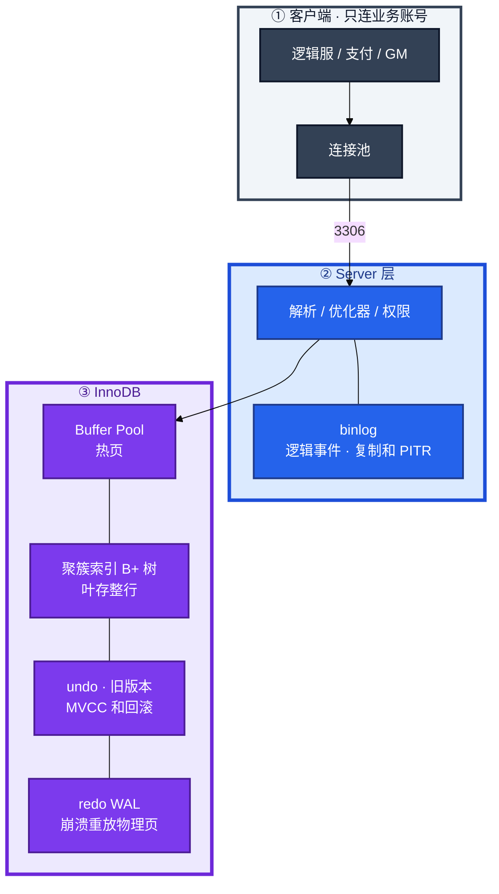
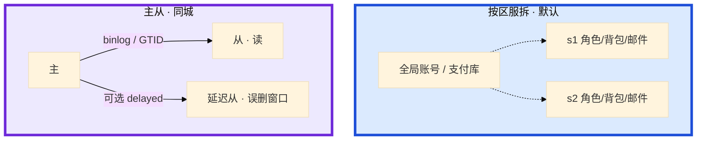
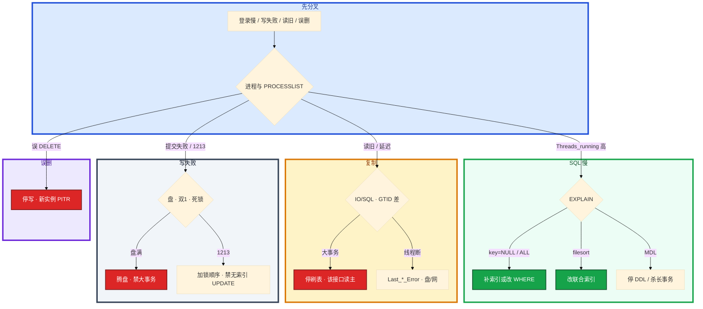

# MySQL


活动整点，玩家报「登录转圈」。监控里 `Threads_running` 飙到 80，mysqld CPU 却只有 20%。群里有人要重启主库，另有人要把上周 xtrabackup 往还活着的从库上 restore——**登录慢不一定是 CPU 忙，误删也不是 restore 能救的**。

**本章主线（排障就按这三步想）：**

1. **分层**：Server 层 binlog vs InnoDB redo / Buffer Pool；写成功 = 双 1 + 两阶段对齐。
2. **归类**：慢 SQL → EXPLAIN / 锁 / MDL；读旧 → 主从 / GTID；写失败 → 盘 / 双 1 / 死锁。
3. **留证**：`PROCESSLIST` + `INNODB_TRX` + `SHOW REPLICA STATUS`，看清再切主 / 重启 / PITR。

**读完你能：** 白板上画出一条 UPDATE 怎么过 Buffer Pool / redo / binlog；主从延迟能判断是大事务还是盘；误 DELETE 会按秒 PITR；大表加索引会选 INSTANT / gh-ost，而不是高峰锁表 ALTER。

## 本章目录

- [1. 基本概念](#1-基本概念)
- [2. 架构图](#2-架构图)
- [3. 原理](#3-原理)
- [4. 落地](#4-落地)
- [5. 核心配置](#5-核心配置)
- [6. 命令与操作](#6-命令与操作)
- [7. 生产排障](#7-生产排障)
- [8. 必会 · 常考](#8-必会--常考)
- [合上书](#合上书问自己)

**本章不讲：** 水平拆分、分片键、ShardingSphere / Vitess / TiDB → [07 分库分表](../07-分库分表与中间件/)；合服步骤、回档审批、多存储对齐 → [08-02 开服合服](../../08-游戏运维专题/02-开服合服/)、[08-07 回档](../../08-游戏运维专题/07-玩家数据备份与回档/)；Redis 不当账本、缓存怎么写 → [02 Redis](../02-Redis/)、[03 缓存架构](../03-缓存架构/)。

---

## 1. 基本概念

MySQL 在游戏里是 **权威账本**：钱包、发货、邮件、道具数量以 InnoDB 提交为准。Redis 只是缓存，见 02、03。

**值班里什么时候碰到**（先听监控 / 业务怎么说，再对表）：

| 业务说的 | 技术含义 | 你的第一刀 |
|----------|----------|------------|
| 「登录转圈 / 进不去」 | 连接满、MDL、无索引 UPDATE 堵锁 | `PROCESSLIST` + `INNODB_TRX` |
| 「刚买的皮肤看不到」 | 从库延迟 / 读错库 | `SHOW REPLICA STATUS` + 该接口读主 |
| 「发奖卡一半」 | 死锁 1213 或长事务 | `INNODB STATUS` + 加锁顺序 |
| 「GM 误删全服邮件」 | 需要 PITR，不是 INSERT 补 | 停写 + 新实例 + binlog 重放 |
| 「合服后昵称冲突」 | 唯一约束 / 主键碰撞 | 停写 + 拆批 + 见 08-02 |

| 在 InnoDB / binlog 里 | 不在 MySQL 里 |
|-----------------------|---------------|
| 行、索引、undo、redo、binlog 事件 | Redis 里的背包缓存、排行 ZSet |
| 已提交事务（对外成功） | 对象存储里的邮件附件 |
| GTID、复制位点 | 逻辑服内存里的会话 |

三个角色不要混：

| 角色 | 干什么 |
|------|--------|
| **InnoDB** | 页、锁、MVCC、redo；崩溃靠它重放 |
| **Server 层** | 解析、优化器、权限、**binlog**（复制和 PITR） |
| **复制拓扑** | 从库拉 binlog 回放；读写分离只是路由，不是第二份权威 |

ACID 落点：A 原子 → undo；D 持久 → redo WAL；I 隔离 → 锁 + MVCC；C 一致是前三者加约束。默认隔离 **RR**。互联网很多业务用 RC；游戏账单、库存、邮件已读常留 RR，或关键语句显式 `FOR UPDATE` / 乐观锁 `version`。

游戏库默认按区服拆（`s1` / `s2`），全局账号和支付另库。一服一库是故障隔离，不是「还没到分表的时候随便堆」。

**打个比方**：InnoDB 是银行金库（页 + redo），binlog 是柜台流水账（复制 / 回档），从库是分店按流水复账——分店读不到最新流水，不是「分店自己查慢」。

> **记住**：钱包、发货以 InnoDB 提交为准。查询慢先看有没有走对索引，不要先加机器。主从不齐先看复制路径卡在哪一段，不要只盯 `Seconds_Behind_Master`。

---

## 2. 架构图

后面安装、命令、排障都对着这张图说话。



**读图三句话：**

1. **写成功** = InnoDB 页改完 + redo 按双 1 落盘 + binlog 两阶段对齐；从哪查写失败：先盘、再双 1、再死锁。
2. **读**先撞 Buffer Pool；池太小像 SQL 慢，根因是随机读盘——从 `Innodb_buffer_pool_reads` 进。
3. **从库不读主库的表**，只拉 binlog 回放；延迟在这条路径上，合服刷表 / 活动发奖是第一元凶。

三种生产形态：



按区服分库是默认。全局账号和支付必须另库，避免一个区服的慢 SQL 拖垮充值。水平拆分放到 07，本章只要求：**先一服一库，不要上来就上 Vitess。**

---

## 3. 原理

### 3.1 B+ 树：聚簇、回表、覆盖

**一句话：** 主键叶上就是整行；二级索引叶只有主键，要整行就回表。

**打个比方**：聚簇索引像图书馆按书号排架，书就在架子上；二级索引像按作者名的卡片柜，卡片上只写书号，拿全书还得回主架找一次。

**现场走一遍**（登录服查玩家 `uid=10001` 的金币）：

1. 跳板机连 s1 库，三条 EXPLAIN 对比：

```sql
EXPLAIN SELECT gold FROM player WHERE id = 10001;
EXPLAIN SELECT * FROM player WHERE name = '龙傲天';
EXPLAIN SELECT id FROM player WHERE name = '龙傲天';
```

2. 屏幕出现：

```text
-- 主键等值
type=const  key=PRIMARY  rows=1
-- 二级索引 + SELECT *：要回表
type=ref  key=idx_name  rows=12  Extra=(无 Using index)
-- 只要 id：覆盖索引，不回表
type=ref  key=idx_name  Extra=Using index
```

**输出解读：**

| 例子 | type | key | Extra | 含义 |
|------|------|-----|-------|------|
| `WHERE id=10001` | `const` | PRIMARY | 无 | 主键等值，千万行也 2～3 层 B+ 树 |
| `SELECT * WHERE name=…` | `ref` | idx_name | 无 Using index | 二级索引找到 id 后**回表**读整行 |
| `SELECT id WHERE name=…` | `ref` | idx_name | **Using index** | 列全在二级索引里，**覆盖**，省回表 |

页在 Buffer Pool 里 = 内存命中；不在 = 磁盘随机读。`SELECT *` 在大表上几乎总会回表。

**面试怎么说**：「InnoDB 主键是聚簇 B+ 树，叶存整行。二级索引叶只有主键，要整行回表；列全在索引里叫覆盖，消的是回表，不是 filesort。」

> **记住**：主键叶上就是行；二级索引要整行就回表；覆盖消回表，**排序列不在索引顺序里仍 filesort**。

### 3.2 最左前缀：跟着 WHERE 失效

**一句话：** 联合索引 `(a,b,c)` 必须从最左列连续用，跳过中间列后面失效。

**打个比方**：联合索引像字典按「姓→名→生日」排序。你只给「名」不给「姓」，字典没法直接翻到那一页。

**现场走一遍**（运营查背包 + 开服补发事故）：

1. 联合索引 `(zone_id, name, created_at)` 下执行：

```sql
EXPLAIN SELECT * FROM bag_item WHERE name LIKE '龙%' AND zone_id=1;
EXPLAIN SELECT * FROM bag_item WHERE name LIKE '龙%';   -- 跳过 zone_id
```

2. 屏幕出现：

```text
-- 正确：用了 zone_id + name
key=idx_zone_name_time  key_len=772  type=range  Extra=Using filesort
-- 错误：最左前缀断裂
key=NULL  type=ALL  rows=8500000
```

3. 无索引 UPDATE 堵登录（`note` 列无索引）：

```sql
UPDATE player SET vip=1 WHERE note='春节活动';
SHOW PROCESSLIST;   -- 其他登录 SQL：State=Waiting for lock  Time=47
```

**输出解读：**

- `key_len` 可判断联合索引用了几列（不要从 `id` 列读起）。
- `key=NULL` + `type=ALL` = 全表扫，850 万行估算 → 登录 SQL 全堵在后面。
- 无索引 `UPDATE` / `DELETE` 在 RR 下 Next-Key 锁间隙，接近表锁。

常见失效：`WHERE b=2` 不走 `(a,b,c)`；`YEAR(create_time)=2024` 函数；varchar 列喂 int 隐式转换；`LIKE '%龙'` 左模糊。

**面试怎么说**：「联合索引看最左前缀。WHERE 必须从第一列连续用；范围列后面的列基本失效。无索引 UPDATE 在 RR 下会锁表，开服补发全表刷是经典事故。」

> **记住**：`key_len` 判断用了几列；无索引 UPDATE 比慢 SELECT 更毒，会直接堵登录。

### 3.3 EXPLAIN：只看这几列

**一句话：** 生产先看 `type` / `key` / `rows` / `Extra` 四列，够定责再往下挖。

**打个比方**：EXPLAIN 像体检四项：血压（type）、有没有药（key）、要查多少项（rows）、有没有副作用（Extra）。

**现场走一遍**（合服后发奖 SQL 突然变慢）：

1. 从 slow log 捞出语句，加 EXPLAIN：

```sql
EXPLAIN SELECT player_id, item_id FROM mail
WHERE zone_id = 3 AND status = 0
ORDER BY created_at DESC LIMIT 100;
```

2. 屏幕出现：

```text
type: ALL
key: NULL
rows: 4200000
Extra: Using where; Using filesort
```

3. 合服后 `ANALYZE TABLE mail`，补 `(zone_id, status, created_at)` 索引后再 EXPLAIN：

```text
修前: type=ALL  key=NULL  rows=4200000  Extra=Using filesort
修后: type=range  key=idx_zone_status_time  rows=890
```

**输出解读：**

| 字段 | 红线 | 上面例子（修前 → 修后） |
|------|------|-------------------------|
| `type` | `ALL` 必须解释；目标 ref/range | ALL → range |
| `key` | NULL = 没走索引 | NULL → idx_zone_status_time |
| `rows` | 估飞先 ANALYZE（合服 / 大批量发奖后常见） | 420 万 → 890 |
| `Extra` | filesort / temporary 大表必须消 | filesort → 消失 |

`type=index` 是扫整棵索引，大表上和 `ALL` 一样危险。`Using filesort`：ORDER BY 用不上索引顺序，把排序列接到联合索引最右。

**面试怎么说**：「EXPLAIN 我不背字段大全，先看 type/key/rows/Extra。key=NULL 补索引；type=ALL 且 rows 百万必须解释；合服后 rows 估飞先 ANALYZE。」

> **记住**：`type=index` 不等于快；filesort 先改联合索引顺序，不要先加机器。

### 3.4 MVCC：快照读、当前读

**一句话：** 普通 SELECT 看旧快照不加锁；FOR UPDATE / UPDATE 是当前读，加 Next-Key 锁。

**打个比方**：快照读像看监控回放（开事务时定格）；当前读像现场拦人（必须看最新且加锁）。

**现场走一遍**（库存扣减 + 合服长事务）：

1. T1 逻辑服用普通 SELECT，T2 发奖脚本 UPDATE 并 COMMIT：

```sql
-- T1                          -- T2
BEGIN;                         BEGIN;
SELECT stock FROM shop_item    UPDATE shop_item SET stock=stock-1 WHERE id=99;
WHERE id=99;  -- 看到 stock=1  COMMIT;
SELECT stock FROM shop_item WHERE id=99;  -- RR：仍看到 1（同一 ReadView）
UPDATE shop_item SET stock=stock-1 WHERE id=99;  -- 可能 1213 或扣成负数
```

2. 正确写法（当前读）：

```sql
BEGIN;
SELECT stock FROM shop_item WHERE id=99 FOR UPDATE;
UPDATE shop_item SET stock=stock-1 WHERE id=99 AND stock>0;
COMMIT;
```

3. 合服脚本挂半小时，查长事务：

```sql
SELECT trx_started, LEFT(trx_query,60) FROM information_schema.INNODB_TRX;
```

```text
trx_started: 2026-08-28 14:02:11
trx_query: SELECT * FROM player_compare ...
age: 1847 sec
```

**输出解读：**

- RR 下普通 SELECT **整事务复用同一 ReadView**，反复跑结果相同，看不到 T2 已提交的 0。
- 库存扣减不能靠普通 SELECT；要 `FOR UPDATE` 或乐观锁 `version`。
- 长事务不提交 → undo 不能 purge → ibd 膨胀 → 从库回放也被拖。

RC 每次 SELECT 新建 ReadView，间隙锁更少，死锁少，幻读更多。

**面试怎么说**：「RR 快照读不加锁，当前读加 Next-Key。库存必须 FOR UPDATE 或 version，不能普通 SELECT。长事务比慢 SQL 更阴，看 INNODB_TRX 的 trx_started。」

> **记住**：快照读看旧版本，当前读加锁看最新行；混用仍可能幻读；长事务比慢 SQL 更阴。

### 3.5 一次 COMMIT：redo、binlog、两阶段、双 1

**一句话：** 写成功 = redo prepare → 写 binlog → redo commit；支付库双 1 掉电不丢已提交。

**打个比方**：redo 是金库内部的修改底稿（物理页），binlog 是对外广播的流水账；两阶段像「底稿签字 → 流水入账 → 底稿盖章」，缺一步账对不齐。

**现场走一遍**（支付扣 10 钻石，`COMMIT` 后立刻查持久化）：

1. 看当前双 1 配置：

```sql
SHOW VARIABLES WHERE Variable_name IN (
  'innodb_flush_log_at_trx_commit', 'sync_binlog'
);
```

```text
innodb_flush_log_at_trx_commit: 1
sync_binlog: 1
```

2. 看 binlog 事件（PITR 靠它，redo 不行）：

```bash
mysqlbinlog --start-datetime='2026-08-28 14:00:00' \
  /data/mysql/binlog/mysql-bin.000042 | head -40
```

```text
# at 154
#250828 14:00:01 server id 101  end_log_pos 231 CRC32 0x...
BEGIN
# at 231
UPDATE wallet SET gold=gold-10 WHERE uid=10001
# at 412
COMMIT
```

3. 崩溃对齐检查（从库多一笔、主库没有）：

```sql
SHOW REPLICA STATUS\G
-- Retrieved_Gtid_Set 比 Executed 多 → 回放卡在某 GTID
-- 主库 redo 有 prepare 无 commit → 两阶段未完成
```

**输出解读：**

| 参数 | =1 | =2 / =0 |
|------|-----|---------|
| `innodb_flush_log_at_trx_commit` | 每次 COMMIT fsync redo | 约丢 1 秒已提交 |
| `sync_binlog` | 每次事务 fsync binlog | PITR / 从库可能少事件 |

双 1 = 两者都 1。只开 redo 能扛进程崩溃，**扛不住误 DELETE 按秒回档**——PITR 靠 binlog。

**面试怎么说**：「提交走两阶段：redo prepare、写 binlog、redo commit。支付库双 1，掉电不丢已提交。redo 管崩溃页，binlog 管复制和 PITR，不能互相替代。」

> **记住**：双 1 换的是掉电丢不丢已提交，不是治慢 SQL。快照不能替代 binlog PITR。

### 3.6 锁和死锁

**一句话：** 死锁 1213 回滚代价小的一方；无索引 UPDATE 在 RR 下锁表比死锁更常见。

**打个比方**：死锁像窄门两人对向卡死，保安赶走一个（回滚）；无索引 UPDATE 像封整条街，所有人进不去。

**现场走一遍**（发奖脚本 vs 逻辑服扣道具，经典死锁）：

1. 应用日志：

```text
Error 1213: Deadlock found when trying to get lock; try restarting transaction
```

2. 主库查 STATUS：

```sql
SHOW ENGINE INNODB STATUS\G
```

```text
LATEST DETECTED DEADLOCK
(1) UPDATE wallet ... WAITING lock on wallet PRIMARY
(2) UPDATE item ... 持有 item 锁，等 wallet
*** WE ROLL BACK TRANSACTION (2)   -- 回滚代价小的一方
```

3. gh-ost 切表 + 长事务占 MDL：

```sql
SHOW PROCESSLIST;
```

```text
Id: 201  Time: 312  State: Waiting for table metadata lock
Info: ALTER TABLE player ADD INDEX ...
Id: 55   Time: 280  State: Sleep
Info: NULL   -- 长事务占着 MDL
```

**输出解读：**

- 1213：InnoDB 检测环，回滚**代价小**的事务；业务必须重试。
- 死锁常因加锁顺序相反（A 先钱包后道具，B 先道具后钱包）→ 全站统一顺序。
- `Waiting for table metadata lock`：DDL 被长事务 / 未提交查询挡住，杀长事务或停 DDL。
- `KILL QUERY` 只杀当前语句；`KILL` 连接会回滚**整事务**，合服中途 kill 可能比原语句更久。

**面试怎么说**：「1213 看 STATUS 里 LATEST DEADLOCK，统一加锁顺序、缩小事务、WHERE 走索引。无索引 UPDATE 在 RR 下 Next-Key 锁间隙，等于表锁。杀连接前先报，回滚可能更久。」

> **记住**：1213 可重试；无索引 UPDATE 更毒；KILL 整连接 = 回滚整事务。

### 3.7 主从：GTID、半同步

**一句话：** 从库只回放 binlog；大事务内部无法并行；半同步超时退回异步。

**打个比方**：主库是总店写流水，从库是分店抄账——合服一次 UPDATE 百万行，分店至少抄十分钟，加再多个分店也不帮总店写得更快。

**现场走一遍**（活动发奖后主从延迟，玩家「刚买的皮肤看不到」）：

1. 从库执行：

```sql
SHOW REPLICA STATUS\G
```

```text
Replica_IO_Running: Yes
Replica_SQL_Running: Yes
Seconds_Behind_Source: 0
Retrieved_Gtid_Set: uuid1:1-892341
Executed_Gtid_Set:  uuid1:1-891102
Last_SQL_Error:
```

2. 主库查大事务：

```sql
SELECT trx_id, trx_mysql_thread_id, trx_started,
       TIMESTAMPDIFF(SECOND, trx_started, NOW()) AS age_sec,
       LEFT(trx_query, 80) AS q
FROM information_schema.INNODB_TRX
WHERE TIMESTAMPDIFF(SECOND, trx_started, NOW()) > 60;
```

```text
age_sec: 423
q: UPDATE mail SET status=1 WHERE activity_id=20260828
```

3. 从库盘：

```bash
iostat -x 1 3 | grep -E 'Device|sd'
```

```text
sdX   %util  await
sdX   98.2   45.6
```

**输出解读：**

- `Retrieved` vs `Executed` 差 **1239** 个 GTID → 回放落后，不是「秒数为 0 就追上了」（大事务中 SBM 会跳变、低估）。
- 主库 `age_sec=423` 的大 UPDATE → 从库至少卡同样久，并行 worker 帮不上**单事务内部**。
- `%util=98` → 从库 IO 瓶颈，别和备份抢同盘。

半同步：`AFTER_SYNC`（commit 前等 ACK，生产优先）vs `AFTER_COMMIT`（commit 后等，从库可能多一笔）。超时常见 1～3s **退回异步**，不是零丢失。

读写分离：刚写就读的接口（背包、邮件）**读主**；`Seconds_Behind_Master=0` ≠ 用户读到新行。

**面试怎么说**：「复制路径：binlog → IO 线程 → relay → SQL 线程。延迟先看 GTID 差和大事务，再看从库盘。半同步超时退异步，支付仍要对账。4 个从库不会让主库写更快。」

> **记住**：先看 IO/SQL 和 GTID 差，不要只报秒数；大事务不能被并行消化；刚写就读的接口读主。

---

## 4. 落地

| 项 | 选 | 不选 |
|----|----|------|
| 拓扑 | 一服一库；账号/支付另库；主 + 至少一从 + 可选延迟从 | 全区一张库硬堆；上来就 Vitess |
| 节点 | 主从同城多 AZ；延迟从另放 | 跨 region 当同步复制 |
| 磁盘 | 本地 NVMe/SSD；redo、数据、binlog 尽量分盘 | 机械盘、和游戏日志/备份同盘 |
| 引擎 / 字符 | InnoDB、`utf8mb4` | MyISAM 当玩家表 |
| 版本 | 8.0，GTID 开 | 生产关 GTID 用文件位点硬切 |
| 账号 | 业务最小权限；管理走独立账号 | 应用用 root、`GRANT ALL` |

| 路径 / 口 | 内容 |
|-----------|------|
| 数据目录 | ibd、系统表空间；**这就是数据** |
| redo | `innodb_log_file` / 8.0 redo 目录；崩溃重放 |
| binlog | `log_bin` 目录；复制和 PITR；**必须另机归档** |
| 错误日志 / slow log | 排障入口 |
| **3306** | 仅业务网段 + 管理跳板 |

验收：进程在不算数。必须能连上、`SHOW REPLICA STATUS` 线程 Yes（有从时）、慢日志在转、**季度 restore + PITR 演练**跑通过。连接：`逻辑服数 × 连接池` < `max_connections`，留约 **20%** 给 DBA。

---

## 5. 核心配置

只动有证据的项。改完要能说出「掉电丢什么、从库延迟会怎样」。

| 参数 | 生产怎么用 | 改错会怎样 |
|------|------------|------------|
| `innodb_buffer_pool_size` | 专用库 **50%～70% RAM** | 太小狂读盘；太大 OS 换页 |
| `innodb_flush_log_at_trx_commit` | **支付库 =1** | =2：掉电丢约 1s 已提交 |
| `sync_binlog` | **支付库 =1**（与上组成双 1） | =0：PITR / 从库少事件 |
| `gtid_mode` / `enforce_gtid_consistency` | **ON**；切主 `SOURCE_AUTO_POSITION=1` | 关了对文件位点，易错 |
| `binlog_expire_logs_seconds` | 覆盖「发现误删 → 开始恢复」窗口 | 过期了全量也救不了中间几小时 |
| `replica_parallel_workers` | >0，`LOGICAL_CLOCK` | =0 大事务更卡 |
| `max_connections` | 留 20%；K8s 滚动要算池重建 | 打满业务连不上 |
| `rpl_semi_sync_*` | 支付库建议开；监控是否真在等 ACK | 从库插件没装 = 一直异步 |

Buffer Pool 命中：`Innodb_buffer_pool_read_requests` vs `Innodb_buffer_pool_reads`，专用 OLTP **< 99%** 要解释。重启后池冷，开服前预热。

> **记住**：`flush_log` 换掉电丢不丢，不扛慢 SQL。Buffer Pool 太小先加池，不要先加从库。

---

## 6. 命令与操作

值班先跑：

```sql
SHOW PROCESSLIST;
SHOW ENGINE INNODB STATUS\G
SELECT * FROM information_schema.INNODB_TRX;
SHOW REPLICA STATUS\G
SHOW GLOBAL STATUS LIKE 'Innodb_buffer_pool%';
```

| 目的 | 命令 | 看什么 |
|------|------|--------|
| 谁堵住了 | `PROCESSLIST` | `Time` / `State` / MDL |
| 死锁 | `INNODB STATUS` | `LATEST DETECTED DEADLOCK` |
| 长事务 | `INNODB_TRX` | `trx_started` |
| 复制 | `SHOW REPLICA STATUS` | IO/SQL Yes；GTID 差 |
| 索引 | `EXPLAIN` / `EXPLAIN ANALYZE` | type/key/rows/Extra |

### 6.1～6.6 运维 SOP 速记

| 场景 | 步骤要点 |
|------|----------|
| **备份** | xtrabackup 全量 + binlog 另机归档；季度 restore + PITR 演练 |
| **计划切主** | 停写 → GTID 追上 → 提升从 → 切 VIP → 旧主改从 |
| **故障切主** | 隔离旧主 → 选 GTID 最全从提升 → 订单对账 |
| **误删 PITR** | 停写 → 新实例全量 + binlog 重放 → 对账；Redis/对象存储对齐见 08-07 |
| **大表 DDL** | INSTANT/INPLACE 验证；默认 gh-ost；控 chunk，盯 MDL |
| **升级/扩容** | 先升从库；回滚靠升级前 xtrabackup；写不够先索引/归档再谈 07 |

---

## 7. 生产排障

三问：进程还在不在？还能不能提交？读到的是不是刚写的？**主库不可写 ≠ 踢光在线**，写接口要失败得干净。



| 现象 | 先做什么 | 不要做什么 |
|------|----------|------------|
| 登录 P99 高，CPU 不忙 | EXPLAIN、锁、MDL、`iostat` 数据盘 | 先加机器 / 重启 mysqld |
| `Seconds_Behind_Master` 很大 | GTID 差、主库 `INNODB_TRX` 大事务 | 重启从库「催它」 |
| 刚买的道具从库没有 | **该接口读主** | 让用户刷新碰运气 |
| 1213 死锁 | STATUS + 统一加锁顺序 | 先加大 lock_wait_timeout |
| GM 误 DELETE 全服邮件 | 停写、新实例 PITR、对账 | 在主库 INSERT 补 |
| 主库磁盘没了、从还在 | 隔离旧主，提升 GTID 最全从 | 在从库 restore 上周全量 |
| gh-ost 中登录排队 | 限速或停；查 MDL 长事务 | 再叠全量备份抢 IO |
| 支付库关双 1 后掉电 | 订单表对账；改回双 1 | 「跟 Redis everysec 一样」 |
| 合服 UPDATE 百万行 | 拆批；该接口读主；盯 GTID | 单事务一次刷完 |

活动高峰 redo 和备份同盘，fsync 几百毫秒：确认进程 → 停发版/合服刷表 → 救盘/锁/大事务 → 该读主切主。

---

## 8. 必会 · 常考

| 说法 | 对错 | 口径 |
|------|:----:|------|
| InnoDB 用哈希当主键索引 | 错 | 聚簇 B+；哈希无范围 |
| 二级索引叶上就是整行 | 错 | 只有主键，`SELECT *` 要回表 |
| 覆盖索引能消 filesort | 错 | 覆盖只消回表；排序看索引顺序 |
| `WHERE b=2` 能走 `(a,b,c)` | 错 | 最左前缀，必须从 a |
| `type=index` 说明走索引所以快 | 错 | 扫整棵索引，大表和 ALL 一样危险 |
| RR 下普通 SELECT 能锁住库存行 | 错 | 快照读不加锁；要当前读或 version |
| RR 任何读都防幻读 | 错 | 先快照再当前读仍可能看见新行 |
| 只开 redo 就能按秒回档 | 错 | PITR 靠 binlog；redo 管崩溃页 |
| 支付库 `flush_log=2` 跟 Redis everysec 一样 | 错 | 账本不敢丢 1 秒已提交 |
| 4 个从库让主库写更快 | 错 | 写仍在主；从只分担读 |
| 并行复制能消化 10 分钟大事务 | 错 | 只并行不同事务 |
| `Seconds_Behind_Master=0` 就是读到新行 | 错 | 会跳变、低估；刚写读主 |
| 丢主应该在从库 restore 上周全量 | 错 | 提升 GTID 最完整的从 |
| 高峰直接 `ALTER` 加索引 | 错 | INSTANT/INPLACE 或 gh-ost |
| 游戏回档只回 MySQL 即可 | 错 | Redis / 对象存储对齐，见 08 |
| 半同步 = 零丢失同步复制 | 错 | 超时退异步；仍要对账 |
| Buffer Pool 太小先加从库 | 错 | 先加池 / 减冷扫描 |

数字：双 1 = `innodb_flush_log_at_trx_commit=1` + `sync_binlog=1`；Buffer Pool 专用库 **50%～70% RAM**；连接留 **20%**；binlog 过期覆盖发现窗口；备份异地 **7～30 天**；半同步超时 **1～3s**；死锁 **1213**。

易混：快照读 vs 当前读；redo vs binlog；加从 vs 治主库写；gh-ost vs pt-osc；切主 vs PITR restore；GTID 差 vs `Seconds_Behind_Master`；半同步 vs MGR；覆盖索引 vs filesort；`KILL QUERY` vs `KILL`；`AFTER_SYNC` vs `AFTER_COMMIT`。

---

## 合上书，问自己

1. 谁是权威账本？一条 UPDATE 过 Buffer Pool / redo / binlog 的顺序？双 1 关了掉电丢什么？
2. 聚簇、回表、覆盖、最左前缀各一句话？EXPLAIN 先看哪四列？
3. RR 快照读和当前读差在哪？库存为什么不能普通 SELECT？长事务看哪张表？
4. GTID 切主看哪两个 Set？半同步超时后是什么模式？
5. 丢主和误 DELETE 分别做什么？备份怎样才算有？
6. 两千万行加索引走哪条？合服刷表为什么拖从库？游戏回档还要对齐什么？

六题都能口述，这一章就过了。下一章把 Redis 剖开：单线程排队、fork/COW、哨兵和 Cluster、热 key 和排行榜。
