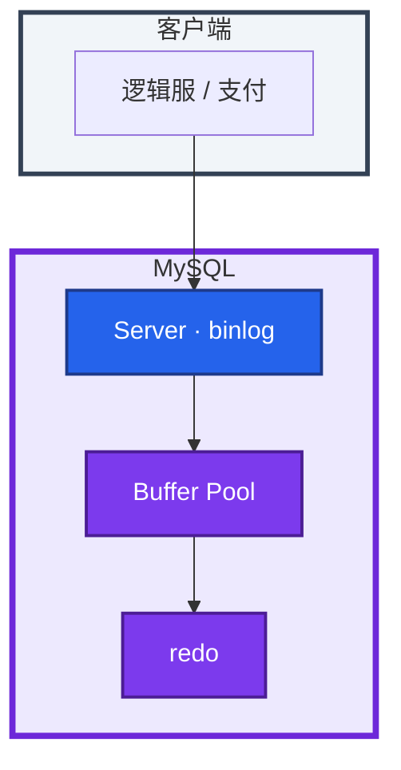
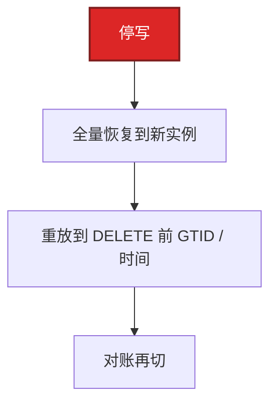

# 01｜MySQL · 练习题

先自己画图或口述，再对照解答。每题标了覆盖范围：

| 标记 | 含义 |
|------|------|
| **核心** | 不懂整章就没建立起来 |
| **必会** | 值班和面试都要能讲 |
| **常用** | 线上会反复碰到 |
| **常考** | 白板和追问的高频口径 |

## 本题目录

- [Q1 是什么、权威、画架构](#q1)
- [Q2 B+ / 回表 / 覆盖](#q2)
- [Q3 最左前缀](#q3)
- [Q4 MVCC / 幻读](#q4)
- [Q5 redo / binlog / 双 1 / Buffer Pool](#q5)
- [Q6 主从 / GTID / 半同步](#q6)
- [Q7 备份 / PITR](#q7)
- [Q8 大表 DDL / 升级切主](#q8)
- [Q9 排障分流](#q9)
- [Q10 锁 / 无索引 UPDATE](#q10)
- [Q11 刚买的道具从库读不到](#q11)
- [Q12 发奖大事务杀不杀](#q12)
- [合上书](#合上书)

---

## Q1

**★★★★★｜MySQL 在游戏里是什么？谁是权威？画架构**

**覆盖**：核心 · 必会 · 常考

### 场景

白板：「画一条支付扣钻怎么落盘。Redis 里也有余额，以谁为准？」有人开始背页大小 16KB。

### 完整解答

MySQL / InnoDB 是 **权威账本**。钱包、发货、邮件、道具数量以提交为准。Redis 只是缓存（02、03）。



写成功 = 页 + redo（双 1）+ binlog 两阶段对齐。游戏默认一服一库，账号/支付另库。水平拆分在 07，不要上来就 Vitess。

### 再追问

- 从库是第二份权威吗？——否。从库只回放 binlog；刚写就读要读主。
- 托管 RDS 这章能跳过吗？——不能。RPO、PITR、大表 DDL、读旧仍是你的。

---

## Q2

**★★★★★｜索引为什么用 B+？回表怎么避免？**

**覆盖**：核心 · 必会 · 常考

### 场景

开场就问：「InnoDB 为什么默认 B+？二级索引叶子上是什么？」有人开始背页大小。

### 完整解答

非叶只导航，叶双向链表，范围 `O(log n + k)`。B 树数据散在各层，范围要回根。哈希等值快，无范围/排序/前缀，Memory 才用。


1. **聚簇**：主键叶存整行。
2. **二级索引**叶只存主键，`SELECT *` 要**回表**（随机 IO）。
3. **覆盖**：查询列全在二级索引上，`Extra: Using index`，少一次随机 IO。

低频状态列（0/1）不要单独建索引。`SELECT *` 在大表上几乎总会回表。

### 再追问

覆盖索引能消 filesort 吗？——不能。filesort 看的是 `ORDER BY` 列在不在索引顺序里。覆盖只消回表。

---

## Q3

**★★★★★｜联合索引最左前缀？哪些写法失效？**

**覆盖**：核心 · 必会 · 常考

### 场景

表上有 `(zone_id, name, created_at)`。有人写 `WHERE name='张三'` 抱怨没走索引。另一条 `WHERE zone_id>1 AND name='张三'` 也慢。

### 完整解答

`(a,b,c)` 必须从 a 连续用。跳列只用到跳点之前。范围条件后面的列基本用不上。

```sql
WHERE zone_id=1 AND name='张三'     -- 用 a,b
WHERE name='张三'                   -- 不用
WHERE zone_id=1 AND created_at>?    -- 只用 a（跳了 name）
WHERE zone_id>1 AND name='张三'     -- 用 a，name 基本失效
WHERE YEAR(created_at)=2024         -- 函数
WHERE phone=13800138000             -- varchar 喂 int
WHERE name LIKE '%张'               -- 左模糊
WHERE name LIKE '张%'               -- 右模糊，可走
```

观测：`EXPLAIN` 的 `key` 和 `key_len`。`key=NULL` 或 `type=ALL` 就是没走。`type=index` 是扫整棵索引，不是胜利。

### 再追问

怎么确认走了几列？——看 `key_len`。优化器 ICP 可能在范围后仍过滤，但不要把 ICP 当联合索引还能往后用。

---

## Q4

**★★★★★｜MVCC 怎么让 RR 可重复读？能完全防幻读吗？**

**覆盖**：核心 · 必会 · 常考

### 场景

库存扣减用普通 `SELECT` 看余量，再 `UPDATE`。有人说「RR 不是可重复读吗，怎么超卖了？」

### 完整解答

每行 `trx_id` + undo 链。事务用 ReadView 找可见版本。RR 整事务一个 ReadView，快照读反复跑结果相同。


100 在活跃列表 → 沿 undo → 80 可见。

1. **快照读**靠 MVCC，看不到快照后插入的行。
2. **当前读**（`FOR UPDATE` / UPDATE / DELETE）靠 Next-Key，挡当前读路径上的插入。
3. **先快照再当前读仍可能看见新行。** RR 不是「这个事务里任何读都防幻」。

库存扣减用当前读或乐观锁 `version`。RC 每次 SELECT 新 ReadView，间隙锁更少、死锁少，不可重复读和幻读更多。互联网很多业务用 RC；游戏账单/库存常留 RR 或显式加锁。

### 再追问

undo 膨胀常见原因？——长事务不提交，purge 清不掉。合服比对挂着事务半小时，比一条慢 SQL 更难发现。看 `INNODB_TRX.trx_started`。

---

## Q5

**★★★★★｜redo 和 binlog 为什么都要？双 1 能不能关？Buffer Pool 太小先加从吗？**

**覆盖**：核心 · 必会 · 常用

### 场景

有人把 `innodb_flush_log_at_trx_commit` 改成 2，说「跟 Redis AOF everysec 一样，丢 1 秒没关系」。支付库也改了。另一边 Buffer Pool 命中掉，有人要加从库。

### 完整解答

redo：崩溃恢复**物理页**。binlog：复制和 PITR 的**逻辑事件**。两阶段：redo prepare → 写 binlog → redo commit → 对外成功。只开 redo 能扛 mysqld 崩溃，扛不住误 DELETE 按秒回档。

| 值 | 掉电 |
|----|------|
| `flush_log=1` + `sync_binlog=1` | 不丢已提交 · **支付库** |
| `flush_log=2` | 大约丢 1 秒 |

支付、充值、发货库保持双 1。日志库、可重建排行快照可以松。云盘快照不能替代 binlog PITR。

Buffer Pool = 热页。太小狂读盘，看起来像 SQL 慢。专用库 **50%～70% RAM**。加从库 **写不会更快**，也治不好主库随机读。重启后池是冷的，开服前 dump/load 或预热 SELECT。

### 再追问

崩溃后从库多一笔、主库没有？——两阶段没对齐，查那一刻 redo 是 prepare 还是 commit。Buffer Pool 太大？——OS 换页，更慢。

---

## Q6

**★★★★★｜主从延迟怎么查？GTID / 半同步 / `Seconds_Behind_Master` 准吗？**

**覆盖**：核心 · 必会 · 常用 · 常考

### 场景

活动发奖后从库延迟跳到 600 秒。玩家刚买的礼包在背包列表里看不见。群里有人要重启从库。有人说「开了半同步就不会丢、也不会延迟」。

### 完整解答

不准，尤其是大事务和并行复制。路径：主 COMMIT → binlog → IO 线程 → relay → SQL 回放。大事务卡在最后一步。并行 worker 只能并行**不同事务**。


1. IO / SQL 是不是 Yes，`Last_SQL_Error`
2. `Retrieved_Gtid_Set` vs `Executed_Gtid_Set`，`Relay_Log_Pos` 还动不动
3. 主库 `INNODB_TRX` 有没有跑了数分钟的事务
4. 从库磁盘 `%util`、是否和备份抢 IO

GTID 让切主用 `SOURCE_AUTO_POSITION=1`，不用对文件位点。半同步：至少一从收到 binlog 才返回；超时退回**异步**，不是零丢失，也治不好大事务延迟。`AFTER_SYNC` 优于 `AFTER_COMMIT`。

止血：该读主的接口切主；活动暂停刷表；`KILL` 要评估回滚代价。根因常见合服/活动一次大事务、`replica_parallel_workers=0`、从库盘和备份同盘。

### 再追问

并行复制开了延迟还在？——单事务内部串行。先拆事务，再调 worker。4 个从让主写更快？——否。

---

## Q7

**★★★★☆｜备份怎么做？误 DELETE 怎么 PITR？游戏回档只回 MySQL 吗？**

**覆盖**：必会 · 常用 · 常考

### 场景

运营误跑了 `DELETE FROM mail WHERE 1=1`。发现时已经过了 40 分钟。有人说从库上还有数据。另有人要把上周全量直接套到主上。

### 完整解答

生产全量 **xtrabackup**；binlog **实时归档**到另一台 / 另一 AZ。dump 只适合小库和结构。没做过 restore 演练的备份不算数。



从库能当源，但主从一起误 DDL 会一起坏。延迟从库才能扛「几小时后才发现」。`binlog_expire_*` 必须覆盖发现窗口。不要在主库上「试着 INSERT 补」。

**游戏回档不能只回 MySQL。** Redis、对象存储、发货状态对齐位点，只回 MySQL 会脏。完整流程见 08-07。

### 再追问

从库能当唯一备份吗？——不能。独立备份 + 延迟从库都要。3 丢主呢？——提升 GTID 最完整的从，不是 restore 上周全量。

---

## Q8

**★★★★☆｜两千万行加索引怎么做？升级失败怎么回滚？计划内切主呢？**

**覆盖**：必会 · 常用

### 场景

开服第三天，`player` 两千万行。有人准备低峰直接 `ALTER TABLE player ADD INDEX ...`。另一边刚升完 8.0，有人要把 mysqld 二进制改回去。

### 完整解答

禁止高峰直接 `ALTER` 锁表。8.0 先看是否 `INSTANT` / `INPLACE, LOCK=NONE`，**在从库验证**。INPLACE 仍可能持 MDL。大表默认 gh-ost：读 binlog 追影子表 → Rename 切表 → 旧表先留着。pt-osc 用触发器，写放大、和业务触发器冲突。`chunk-size` 开太大一样把主库 CPU 打满。杀一半要清影子表。

升级：**先备份**；先升从，再计划内切主。数据目录升过默认 **不能换回旧二进制**。回滚 = 升级前 xtrabackup 拉新实例再切流量。

计划内切主：停写 → 从库 GTID 追上 → 提升 → 切 VIP → 旧主改从。不要双写。

### 再追问

INSTANT 加列之后从库延迟呢？——INSTANT 本身秒级；统计信息没更新，计划可能变差。加完看慢日志和 `rows`。

---

## Q9

**★★★★☆｜给出现象，你先走哪条排障路？**

**覆盖**：必会 · 常用

### 场景

四个工单：① 登录 P99 高 CPU 不忙 ② 从库延迟 600s ③ 支付库掉电丢单 ④ `Waiting for table metadata lock`。

### 完整解答

| # | 走哪条 | 不要做 |
|---|--------|--------|
| ① | EXPLAIN / 锁 / 盘；`key=NULL` 先改 SQL | 先加机器、重启 mysqld |
| ② | GTID 差、主库大事务、从库盘；该接口读主 | 重启从库催它 |
| ③ | 对账；双 1 是否被改成 2 | 「跟 Redis everysec 一样」 |
| ④ | 谁在 DDL / 长事务；停 OSC | 再叠全量备份抢 IO |

现场：`PROCESSLIST` → `INNODB STATUS` → `INNODB_TRX` → `REPLICA STATUS` → `iostat` 看 **数据盘和 redo 盘**。

### 再追问

主库盘满还能切到从顶写吗？——计划外切主要先隔离旧主，防双写。半同步不是零丢失。

---

## Q10

**★★★★☆｜死锁怎么查？无索引 UPDATE 为什么危险？**

**覆盖**：必会 · 常用 · 常考

### 场景

活动补发：`UPDATE player SET flag=1 WHERE note='summer'`（note 无索引）。登录接口开始大面积超时，错误日志里有 1213。

### 完整解答

`SHOW ENGINE INNODB STATUS` 的 `LATEST DETECTED DEADLOCK`。InnoDB 回滚代价小的一方。生产开 `innodb_print_all_deadlocks`。8.0 可看 `data_locks`。

无索引 UPDATE/DELETE 在 RR 下当前读 + Next-Key，扫到的间隙全锁，等于锁表 → 登录等待 / 连环死锁。WHERE 必须走主键或二级索引。

治理：统一加锁顺序、短事务、热点行乐观锁、禁止无索引刷表。`KILL QUERY` 只杀语句；`KILL` 连接回滚整事务。合服中途杀连接，回滚可能比原语句更久。

### 再追问

先加大 `innodb_lock_wait_timeout`？——否。先对加锁顺序和无索引 WHERE。

---

## Q11

**★★★★☆｜读写分离后「刚买的道具从库读不到」，怎么定规则？**

**覆盖**：必会 · 常用 · 常考

### 场景

商城下单写主库成功，立刻打开背包走从库，偶发看不到。延迟监控显示 `Seconds_Behind_Master=0`。

### 完整解答

`Seconds_Behind_Master=0` 不等于这条事务已经回放到从库。并行复制会低估；大事务跳变。业务可感知的「读旧」才是 SLO。

1. 写后立即读（背包、邮件已读、余额）→ **读主**
2. 能接受秒级脏的（公告、排行快照、皮肤预览）→ 从库
3. 延迟超过 SLO → 关掉该接口的从库路由，不要让用户刷新碰运气

全切主会把主库读打满。按接口切，不要按「库」一刀。

### 再追问

会话、排行榜走 MySQL 还是 Redis？——会话 TTL 可放 Redis（02）；排行 ZSet 展示走 Redis，发奖仍以 DB 为准。道具数量权威在 InnoDB。

---

## Q12

**★★★☆☆｜活动单事务发奖百万行，已经跑了 8 分钟，杀不杀？扩容加从有用吗？**

**覆盖**：常用 · 常考

### 场景

`UPDATE player SET mail_flag=1` 全服一张表。从库延迟在涨，主库 `Threads_running` 很高。有人准备 `KILL` 那个连接。另有人要连夜加 4 个从。

### 完整解答

先看 `PROCESSLIST` 的 `Time` / `Info` 和业务 owner。这条是大事务，从库回放至少还要再等它提交后的同等时间。加从 **消化不了这个事务内部**，也让主库写不变快。

继续跑：主库锁、undo、从库继续卡。`KILL` 连接：整事务回滚，undo 再打满一遍，可能更久。能停活动、改成拆批可重入，就不要杀到一半。已经杀了：盯 undo、磁盘、从库 SQL 线程，不要再叠 OSC 或全量备份抢 IO。

事后：发奖禁止单事务全服 UPDATE；分批 + 唯一键防重入。扩容先索引、冷热、拆库（07），不是先堆从库。

### 再追问

拆批的批次多大？——按从库延迟和主库 `Threads_running` 压出来，不是拍 1000 行。活动前在同等数据量上跑一遍。

---

## 合上书

- [ ] 能画出 Buffer Pool / redo / binlog，并说出钱包以 InnoDB 为准
- [ ] 能讲聚簇、回表、覆盖、最左前缀；EXPLAIN 四列
- [ ] 能把 RR 讲到快照读 vs 当前读；库存不能普通 SELECT
- [ ] 能说出双 1、GTID 两个 Set、半同步会退异步
- [ ] 能区分切主 vs PITR；备份 = 异地 + 演练；游戏回档要对齐 Redis
- [ ] 能说大表走 INSTANT/gh-ost、升级不能降二进制；加从写不会更快
- [ ] 能用分流图处理慢 SQL / 延迟 / 死锁，而不是重启 mysqld
