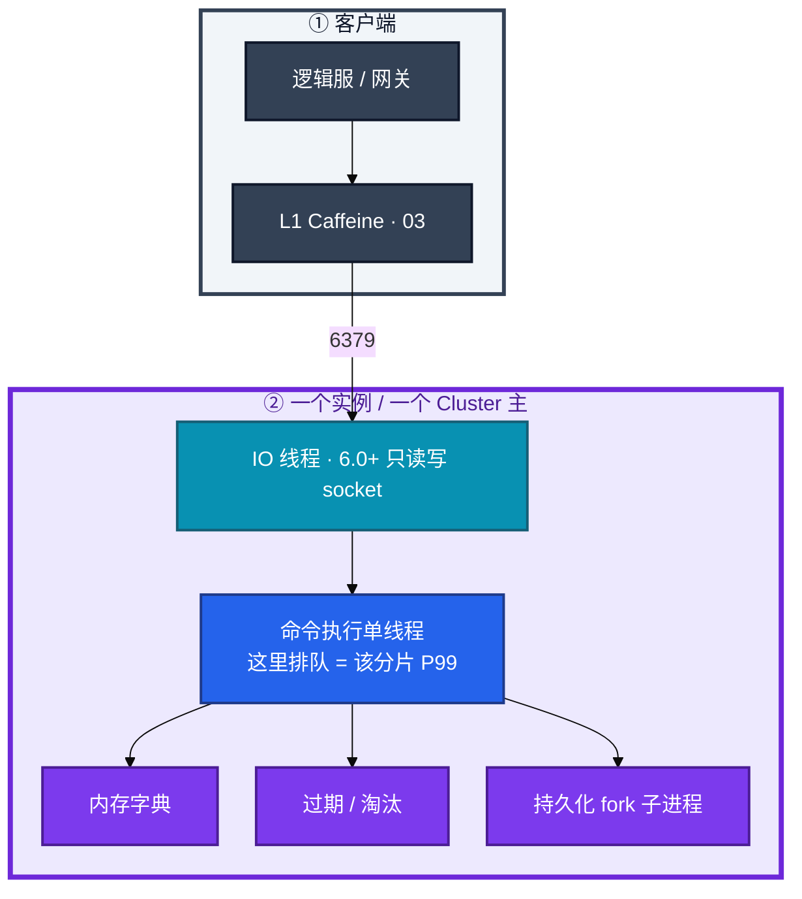
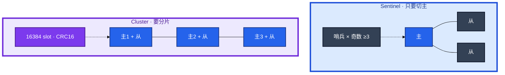
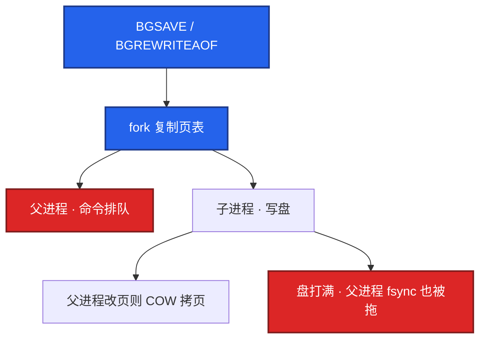
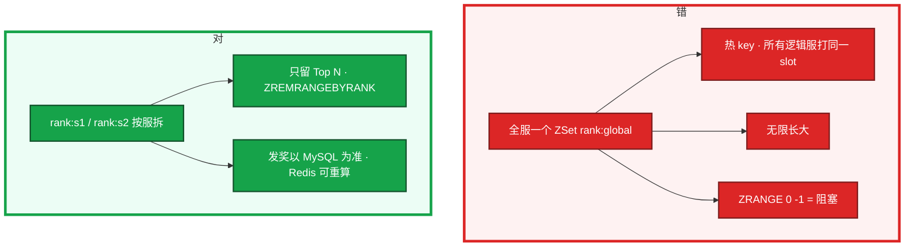

# Redis


活动整点，心跳超时一批。监控上 Redis CPU 只有 30%，客户端 P99 却飙到 200ms。群里有人要上 Cluster「吃多核」，另有人要把昨晚 RDB 往新主上 `restore`——先别动手。这一章后半全是你会动手的：**怎么装哨兵或 Cluster、怎么查 slowlog、怎么切主、怎么扩槽、fork 尖了怎么止血。** 前面的概念和原理，是为了让你动手时不选错路。

**本章主线（排障就按这三步想）：**

1. **分层**：命令单线程排队 vs IO 线程 vs fork 子进程；热 key 只在一个 slot。
2. **归类**：P99 尖 → fork / 大 key / slowlog；刚写没了 → 异步复制 lag；连不上 → 连接 / Cluster。
3. **留证**：`info persistence` + `slowlog` + `info replication`，确认角色再 failover。

**读完你能：** 白板上画出命令单线程和 Cluster slot；P99 尖能判断是 fork 还是大 key；主挂了会选哨兵还是 Cluster 路径；热 key / 排行榜 / 会话不会塞错结构。

## 本章目录

- [1. 基本概念](#1-基本概念)
- [2. 架构图](#2-架构图)
- [3. 原理](#3-原理)
- [4. 落地](#4-落地)
- [5. 核心配置](#5-核心配置)
- [6. 命令与操作](#6-命令与操作)
- [7. 生产排障](#7-生产排障)
- [8. 必会 · 常考](#8-必会--常考)
- [合上书](#合上书问自己)

**本章不讲：** 穿透 / 击穿 / 雪崩、Cache Aside、和 DB 谁先写 → [03 缓存架构](../03-缓存架构/)；钱包权威、PITR → [01 MySQL](../01-MySQL/)；延迟队列积压 → [05 Kafka](../05-Kafka/)；网关超时把 Redis 超时当 miss → [04 接入网关](../04-接入网关/)。合服/回档多存储对齐 → [08-07](../../08-游戏运维专题/07-玩家数据备份与回档/)。

---

## 1. 基本概念

Redis 快，是因为 **内存 + epoll + 命令单线程无锁**，不是因为「单线程算得特别快」。6.0 起 IO 可以多线程，但 **命令执行仍串行**。一个慢命令、一个大 key 的 `DEL`，这个实例（Cluster 里就是这个分片）上所有请求排队。

**值班里什么时候碰到**——先听监控和玩家怎么说，再对表：

| 监控 / 群里说的 | 技术含义 | 你的第一刀 |
|-----------------|----------|------------|
| 「P99 尖、CPU 不高」 | fork 或大 key 堵命令线程 | `info persistence` + `slowlog` |
| 「单分片 90%、其它很闲」 | 热 key 打满一个 slot | 客户端埋点 top key，不是加节点 |
| 「切主后道具缓存没了」 | 异步复制 lag，不是 AOF 没开 | `info replication` + 回源 |
| 「Could not connect / 连接满」 | 滚动发布连接风暴 | `info clients` + 池上限 |
| 「cluster_state fail」 | 多数派槽丢了 | 降级 03，别盲 `ADDSLOTS` |

在游戏里它不是账本。道具数量、发货、充值以 MySQL 为准（01）。Redis 扛的是：**会话、排行展示、活动配置、背包缓存**。丢几秒写、回源能补的，才能放这里。

| 在 Redis 里合适 | 不要只放 Redis |
|-----------------|----------------|
| Session（TTL 对齐心跳）、排行 Top N、活动配置 | 钱包余额、发货状态、邮件已读权威 |
| 背包缓存（可回源） | 唯一库存扣减 |
| 分布式锁（减少并发） | 支付幂等（用 DB 唯一键） |

三个角色不要混：

| 角色 | 干什么 |
|------|--------|
| **命令线程** | 执行 GET/SET/ZADD；慢命令堵住的就是它 |
| **持久化子进程** | `BGSAVE` / AOF 重写；fork 会让父进程抖 |
| **哨兵 / Cluster 总线** | 谁是主、槽在哪；不执行业务命令 |

**打个比方**：Redis 像一家只有 **一个收银台** 的便利店——IO 多线程是门口多开几个迎宾，货还是那一个柜台结账；fork 是后台盘点时，收银台也要停一下登记库存；哨兵 / Cluster 是总部决定「哪家店开门」，不帮你加快结账。

> **记住**：CPU 不高但延迟尖刺，先看 fork 和大 key，不要先加核。一个 key 只在一个线程、Cluster 里只在一个 slot。Cluster 不是热 key 银弹。

**面试怎么说**：「Redis 快在内存和无锁单线程，但慢命令和大 key 会让整实例排队；6.0 IO 多线程不并行执行命令；热 key 加 Cluster 节点没用，得 L1 或拆 key。」

---

## 2. 架构图

后面安装、命令、排障都对着这张图说话。



**读图三句话：**

1. **没有「加核让这一条 GET 变快」**——IO 多线程不执行命令；热 key 加核没用，从客户端 L1 或拆 key 进。
2. **持久化在旁边 fork**，不是另一条无锁快路径；整点 AOF 重写 = 一次心跳周期级卡顿，查 `latest_fork_usec`。
3. **客户端不要写死主 IP**——问哨兵或跟 Cluster `MOVED`；写死 IP 切主后连错节点。

两种生产 HA（装的时候选，挂的时候故障域不一样）：



| | 哨兵 | Cluster |
|--|------|---------|
| 解决什么 | 主挂了谁顶上 | 数据分片 + 主挂了谁顶上 |
| 容量 | 单机内存上限 | 多主内存相加 |
| 多 key | 无 slot 限制 | 必须同 slot |
| 运维 | 简单 | 迁槽、MOVED、大 key |
| 热 key | 打满这一台 | 仍打满**这一槽所在主** |

只要切主、数据单机放得下 → 哨兵。内存 / QPS 单机不够 → Cluster。单机 30GB 的 fork 成本，拆实例往往比继续加哨兵从库更对症。3 主没有从？生产不要。主挂了该槽直接不可用，起步 **3 主 3 从**。

---

## 3. 原理

原理只保留动手和面试会用到的：谁在排队、为什么盘一写全集群该分片卡、切主丢的是哪几秒、槽为什么救不了热 key。

### 3.1 命令单线程：一个慢命令，全店排队

**一句话：** 命令执行串行，慢命令和大 key 操作会让该实例所有请求排队。

**打个比方**：便利店只有一个收银台——前面有人买了一整车货（`HGETALL` 大 Hash），后面买瓶水的 GET 也得等，跟 IO 门口开几个迎宾无关。

**现场走一遍**（大厅 `GET activity:config` 突然 200ms，CPU 30%）：

1. 跳板机连 Redis，先确认进程还在、角色对不对：

```bash
redis-cli info replication | grep -E 'role|master_host|master_link_status'
redis-cli slowlog get 20
```

2. 屏幕出现 slowlog 类似：

```text
1) 1) (integer) 1734567890
   2) (integer) 152340
   3) (integer) 85000
   4) 1) "HGETALL"
      2) "player:10001:mail"
   5) "10.0.1.15:54321"
   6) ""
```

3. **看第三列**：85000 = **85000 μs = 85ms**，这一条就把后面所有命令堵了 85ms。
4. 再看 commandstats：

```bash
redis-cli info commandstats | grep -E 'keys|hgetall|del|unlink'
```

5. 若 `cmdstat_keys` 的 `usec` 很高 → 有人在跑 `KEYS *`，生产禁用。
6. 结论：**不是 CPU 不够，是命令线程被大命令占了** → 拆大 key、换 `UNLINK`、禁止 `KEYS`，不要先加核。

**输出解读：**

| slowlog 字段 | 含义 | 上面例子 |
|--------------|------|----------|
| 第 1 列 | 唯一 ID | 可忽略 |
| 第 2 列 | 执行时间戳 | 对齐监控尖刺时刻 |
| 第 3 列 | **耗时 μs** | 85000 = 85ms，>10ms 就该查 |
| 第 4 列 | 命令 + 参数 | `HGETALL player:10001:mail` = 大 key |
| 第 5 列 | 客户端地址 | 追到哪个逻辑服 |

Pipeline 把多条命令一起发，省 RTT，**不提供隔离**。`MULTI` / `EXEC` 是单机事务，Cluster 上多 key 必须同 slot，否则 `CROSSSLOT`。过期是惰性删 + 定时抽样；大量 key 同一秒过期，P99 会抖一下——和 03 的雪崩是同一现象的进程侧。

**面试怎么说**：「Redis 命令单线程，慢命令和大 key 会让整实例 P99 尖；6.0 IO 多线程只读写 socket，不并行执行命令；我先 slowlog 找 HGETALL/KEYS/DEL，不会先加 CPU。」

> **记住**：卡住先看 slowlog 和大 key，不要先加核。用 Cluster 或多实例吃多核，不是一个 key 加核。

### 3.2 一次 BGSAVE：fork 让收银台停一下

**一句话：** `BGSAVE` / AOF 重写要 fork，父进程复制页表时命令线程会卡，大内存实例尖刺可达百毫秒。

**打个比方**：便利店打烊盘点——不是另开柜台，是收银台也要停一下登记「现在货架上有什么」；盘点期间顾客全得等。

**现场走一遍**（活动整点，客户端偶发超时，CPU 并不高）：

1. 先看持久化和 fork 指标：

```bash
redis-cli info persistence
```

2. 屏幕出现：

```text
rdb_last_bgsave_status:ok
rdb_last_bgsave_time_sec:12
aof_enabled:1
aof_rewrite_in_progress:0
latest_fork_usec:250000
```

3. **做差读数**：`latest_fork_usec=250000` → **250ms**。游戏逻辑服心跳超时 200ms 时，这次 fork 就是一次集中掉线。
4. 对齐监控：把客户端 P99 尖刺时间和 `rdb_last_bgsave_time_sec` 结束时刻对比，常能对上。
5. 再看磁盘是不是和日志同盘：

```bash
iostat -x 1 3
df -h $(redis-cli config get dir | tail -1)
```

6. 结论：**fork 是头号元凶之一** → 禁整点手动 BGSAVE、拆实例降内存、AOF 重写阈值避开活动整点，不要「再 BGSAVE 一次看看」。

**输出解读：**

| 字段 | 正常 | 异常 | 高了找谁 |
|------|------|------|----------|
| `latest_fork_usec` | < 1 万 μs | **> 10 万 μs** | 单实例内存过大、写负载高、盘慢 |
| `rdb_last_bgsave_time_sec` | 跟数据量匹配 | 活动整点飙升 | 手动 BGSAVE + 大 key |
| `aof_rewrite_in_progress` | 0 | 1 且 P99 尖 | AOF 重写中，等完成或调阈值 |

RDB vs AOF：

| | RDB | AOF |
|--|-----|-----|
| 内容 | 全量快照 | 写命令追加 |
| 丢数据 | 两次 save 之间 | `everysec` 最多约 1s |
| 恢复 | 快 | 纯 AOF 重放慢 |
| 生产 | 备份 / 冷备 | 与 RDB 混用 |

`aof-use-rdb-preamble yes`：AOF 前半 RDB、后半增量，启动快且丢得少。`appendfsync always` 换安全、吞吐腰斩，游戏**缓存**场景几乎不用。`SAVE` 同步冻住进程，**生产禁止**。

fork / COW 机制：



主从全量同步 = BGSAVE + 传 RDB；短抖走 **PSYNC**，反复全量 → 调 `repl-backlog-size`。多从同时 FULLRESYNC = **复制风暴**。

**面试怎么说**：「P99 尖、CPU 不高，先看 `latest_fork_usec` 超 10 万 μs；AOF 救重启不救落后从升主；生产禁 SAVE。」

> **记住**：CPU 不高但 P99 尖，先看 `latest_fork_usec`；AOF 救重启，救不了切到落后从库。

### 3.3 大 key、热 key、淘汰：一个货箱 vs 全服抢一件

**一句话：** 大 key 拖慢单次命令和 fork；热 key 打满单线程；淘汰踢错数据会带崩 DB。

**打个比方**：大 key 像收银台上一箱 5000 件散装货——扫一次要半分钟；热 key 像全服抢同一件限量 T 恤——开再多家分店，货还在那一个柜台。

**现场走一遍**（单分片 CPU 90%，其它分片 10%）：

1. 低峰跑大 key 采样（不是全量扫描）：

```bash
redis-cli --bigkeys
redis-cli memory usage player:10001:mail
```

2. `--bigkeys` 输出类似：

```text
-------- biggest hash keys --------
player:88421:mail  8234 fields  52428800 bytes
```

3. **口算**：52428800 bytes ≈ **50MB** 一个 Hash——`HGETALL` 一次拉 50MB，网卡和命令线程一起爆。
4. 查是不是热 key——分片 CPU 不均 + 客户端埋点 top key；或：

```bash
redis-cli --hotkeys    # 需 maxmemory-policy 含 LFU
```

5. 看内存和淘汰：

```bash
redis-cli info memory | grep -E 'used_memory_human|mem_fragmentation_ratio|maxmemory'
redis-cli info stats | grep evicted
```

6. 若 `evicted_keys` 持续 > 0 且命中率掉 → 内存不够，DB 将被带崩（03）。

**输出解读：**

| 指标 | 红线 | 含义 |
|------|------|------|
| String value | **> 10KB** | 考虑拆分或压缩 |
| Hash/ZSet/List 元素 | **> 5000** | 大 key，迁槽也会卡 |
| `mem_fragmentation_ratio` | **> 1.5** | 低峰 `activedefrag` 或从库重启 |
| `evicted_keys` | 持续增 | 命中率将塌，先加 TTL 再扩内存 |
| 内存水位 | **> 80%** | P1 告警 |

大 key：拆 Hash、ZSet 分桶、`UNLINK` 删、迁槽前先治。热 key：L1 或 `hot:id:{0..N}` 随机读；迁槽热点跟着走，加节点没用。

**淘汰策略：**

| policy | 行为 | 用在哪 |
|--------|------|--------|
| `noeviction` | 写失败 | 不能丢的数据；纯缓存会打挂写接口 |
| `allkeys-lru` / `lfu` | 任何 key 都可踢 | **纯缓存默认** |
| `volatile-lru` | 只踢带 TTL 的 | 同实例里既有缓存又有必须留的 |

**面试怎么说**：「大 key 拖慢单次命令和 fork，热 key 打满单 slot 单线程；Cluster 不解决热 key；纯缓存用 allkeys-lru，maxmemory 必须设，水位 70%～80% 告警。」

> **别混**：大 key（一次命令慢）vs 热 key（QPS 高）；迁槽 vs 打散 key。

### 3.4 哨兵 vs Cluster：切主丢哪几秒

**一句话：** 主从异步复制，切主丢的是 replication lag 那几秒；Cluster 解决分片，不解决热 key。

**打个比方**：哨兵像总店指定「哪家分店当旗舰店」——分店账本抄送有延迟，换旗舰店时最近几笔可能没抄到；Cluster 像把商品分到多家店——总容量大了，但爆款仍在某一个柜台。

**现场走一遍**（主挂了，切完后玩家说「刚领的道具没了」）：

1. 确认当前角色和复制状态：

```bash
redis-cli info replication
```

2. 屏幕出现：

```text
role:slave
master_host:10.0.2.11
master_link_status:up
master_repl_offset:9843210
slave_repl_offset:9843210
```

3. 若刚从 failover 过来，看从库升主前的 lag——`INFO replication` 里 `master_repl_offset` 与旧主最后 offset 的差，就是**可能丢的写**。
4. Cluster 场景：

```bash
redis-cli -c cluster info
redis-cli -c cluster nodes | head -20
```

5. 输出 `cluster_state:fail` → 多数派槽丢了，**停写 + 降级 03**，不要盲 `CLUSTER ADDSLOTS`。
6. 客户端打到错节点会收到 `MOVED slot ip:port`；迁槽中可能 `ASK`——漏处理就「时好时坏」。

**输出解读：**

| 场景 | 看到什么 | 丢什么 | 怎么处理 |
|------|----------|--------|----------|
| 哨兵 failover | 新主 role:master | lag 那几秒写 | 应用回源，不在 Redis 补账 |
| 开 AOF 仍丢 | AOF 在新主上 | 落后从库没那些写 | AOF 救重启，不救升主 |
| Cluster 主挂 | 从 failover | 同左 | 该槽继续服务 |
| `cluster_state:fail` | 多数派丢 | 大范围不可用 | 降级 + 按备份恢复 |

Cluster slot：`CRC16(key) % 16384 → slot → 节点`。

- `MGET` / 事务 / Pipeline 多 key 必须同 slot
- `user:{uid}:bag` 用 `{}` 作 **hash tag**，同用户 key 进同槽
- tag 太粗（`{user}` 给所有人）→ 单槽热点，比没 tag 更糟
- `KEYS` / `SCAN` 要逐节点；`redis-cli -c` 跟随 `MOVED`


**面试怎么说**：「切主丢的是异步复制 lag 那几秒，开 AOF 也救不了切到落后从；哨兵只要 HA，Cluster 要分片；16384 slot，hash tag 别给所有人用同一个。」

> **记住**：切主丢 replication lag，不是 AOF 没开；Cluster 解决分片，不解决热 key。

### 3.5 排行榜、会话、道具：谁是权威

**一句话：** 排行可重算、会话可踢回登录、道具展示可缓存——权威永远在 MySQL。

**打个比方**：Redis 是商场电子屏上的排行榜——断电可以重算；MySQL 是银行流水，丢一笔不行。

**现场走一遍**（开服一周，活动开始排行接口超时）：

1. 查排行 key 设计和慢命令：

```bash
redis-cli slowlog get 10
redis-cli zcard rank:global
redis-cli memory usage rank:global
```

2. 若 `zcard` 返回 **500000**，有人用过 `ZRANGE rank:global 0 -1`——全量拉 50 万条，必堵命令线程。
3. 正确做法：按服拆 `rank:s1`、`rank:s2`；只留 Top N，`ZREMRANGEBYRANK` 裁尾；发奖流水落 MySQL。



**会话**：TTL 对齐心跳；挂了就踢回登录。K8s 滚动 → 连接池翻倍 → `maxclients` 打满，限 `maxUnavailable`。

**道具**：展示可缓存，扣减权威在 MySQL；切主后回源回填，不在 Redis 补账。礼包配置走 L1 + 逻辑过期（03）。

**输出解读：**

| 结构 | 推荐 | 禁止 |
|------|------|------|
| 排行 | 按服 ZSet + Top N | 全服一个 ZSet + `ZRANGE 0 -1` |
| 会话 | String + TTL = 心跳 × N | 无 TTL 永驻 |
| 道具缓存 | Hash 分片、可丢 | Redis 当库存权威 |
| 延迟队列 | ZSet score=时间戳 | 核心链路用 Kafka（05） |

**面试怎么说**：「排行按服拆 ZSet、只留 Top N，发奖看 MySQL；会话 TTL 对齐心跳，Redis 挂可踢登录；道具展示可缓存，扣减权威在 DB。」

### 3.6 分布式锁：减并发，不保证幂等

**一句话：** `SET NX PX` + Lua 释放是正确写法；failover 和 TTL 到期都可能双入，支付靠 DB 唯一键。

**打个比方**：锁像厕所「有人」牌——牌掉了或换班时两人可能同时进，重要事务得靠银行流水号（唯一约束）而不是门牌。

**现场走一遍**（并发扣库存，偶发超卖）：

1. 先看业务是不是把 Redis 当权威——道具库存应在 MySQL。
2. 若仍用锁，正确写法：

```bash
SET lock:order:10001 uuid-abc NX PX 30000
```

3. 释放必须用 Lua 校验 uuid 再 `DEL`，不要 `GET` + `DEL`（会删别人的锁）。
4. failover 时：旧主上的锁可能还没同步到新主，新主已升主 → **丢锁**；TTL 太短业务没跑完 → **锁过期双入**。

**输出解读：**

| 写法 | 对错 | 原因 |
|------|:----:|------|
| `SET key uuid NX PX ttl` | 对 | 原子占锁 + 自动过期 |
| Lua 校验 uuid 再 DEL | 对 | 不会删别人的锁 |
| `GET` + `DEL` 两步 | 错 | 非原子 |
| Redlock 跨主从 | 争议大 | 核心交易用 DB 唯一键 |
| 锁保证支付幂等 | 错 | 唯一键才是 |

**面试怎么说**：「Redis 锁用 SET NX PX + Lua 释放，只减并发；failover 丢锁、TTL 到期都会双入；支付幂等靠订单号唯一键，不靠 Redis 锁。」

---

## 4. 落地

### 4.1 生产怎么选

| 项 | 选 | 不选 |
|----|----|------|
| HA | 数据单机放得下 → 哨兵 ≥3；否则 Cluster 3 主 3 从起 | 单主无从；3 主 0 从 |
| 内存 | 单实例宁拆到 **8～16GB** 控 fork | 单进程 30GB+ 硬扛 |
| 磁盘 | 独立 SSD（AOF/RDB） | 和游戏日志同盘 |
| 网络 | 同城；客户端跟哨兵或 Cluster | 写死主 IP |
| 持久化 | 缓存：RDB 或混合 AOF `everysec` | 缓存用 `appendfsync always`；`SAVE` |
| 账号 | requirepass / ACL；6379 不裸奔 VPC | 无密码对整个业务网 |

### 4.2 落地你实际看到什么

| 路径 / 口 | 内容 |
|-----------|------|
| `6379` | 客户端；生产 TLS 或至少 VPC + 密码 |
| `16379` | Cluster 总线，仅成员 |
| RDB / AOF 目录 | **这就是数据**；备份拷的是它 + 配置 |
| `sentinel.conf` / `nodes.conf` | 哨兵监控列表；Cluster 节点身份 |

验收：进程在不算数。必须 `INFO replication` 角色正确、哨兵 failover 演练过或 `CLUSTER INFO` `cluster_state:ok`、slowlog 能取。不要只探 TCP 6379。

---

## 5. 核心配置

只动有证据的项。改 `appendfsync` 和 `maxmemory-policy` 要能说出丢什么、踢谁。

| 参数 | 默认倾向 | 生产怎么用 | 改错会怎样 |
|------|----------|------------|------------|
| `maxmemory` | **必须设** | 水位 70%～80% 告警 | 不设吃光机器；OOM killer |
| `maxmemory-policy` | 纯缓存 `allkeys-lru` | 有永驻 key 用 `volatile-lru` | `noeviction` 打挂写接口 |
| `appendfsync` | 缓存 `everysec` | 几乎不用 `always` | 吞吐腰斩；仍救不了切主 |
| `aof-use-rdb-preamble` | **yes** | 混合 AOF | 关了纯 AOF 启动慢 |
| `repl-backlog-size` | 按峰值写 × 断线窗口 | 避免短抖 FULLRESYNC | 默认太小 → 复制风暴 |
| `repl-diskless-sync` | 大 RDB 可开 | 减主库盘，不减网卡/fork | 当银弹会误判 |
| `client-output-buffer-limit` | 保持合理上限 | 防 MONITOR / 大 KEYS | 过小杀正常从库 |
| `maxclients` | 按 `Pod × 池` 翻倍算滚动 | 留余量 | 滚动 `rejected_connections` |
| `slowlog-log-slower-than` | 1～10ms 量级 | 排障可临时调低 | 过宽等于没日志 |
| `activedefrag` | 低峰 | 碎片 >1.5 | 高峰开 = 自己造慢命令 |
| `min-replicas-to-write` | 缓存慎开 | 换可用性 | 从不够就拒写 |

> **记住**：`appendfsync always` 和 MySQL 双 1 不是同类题——缓存不值得；当成账本用 Redis 才是选错存储。

---

## 6. 命令与操作

值班先跑这几条——**看到什么算正常 / 异常**：

```bash
redis-cli info replication
redis-cli info persistence
redis-cli info clients
redis-cli slowlog get 20
redis-cli info memory
```

Cluster 再加：

```bash
redis-cli -c -h <host> cluster info
redis-cli --cluster check <node>
```

| 目的 | 命令 | 正常 | 异常 |
|------|------|------|------|
| 角色 / 主从 | `INFO replication` | role 符合预期、lag 小 | role 错、link down |
| fork | `INFO persistence` | `latest_fork_usec` < 10 万 | > 10 万 μs |
| 慢命令 | `SLOWLOG GET` | 空或 <10ms | HGETALL/KEYS/DEL 大 key |
| 大 key | `--bigkeys` 低峰 | 无超大 key | String >10KB / 集合 >5000 |
| 热 key | `--hotkeys` | 分片均匀 | 需 LFU policy |
| 内存 | `INFO memory` | 水位 <80%、碎片 <1.5 | evicted_keys 增 |
| 连接 | `INFO clients` | blocked 少 | rejected_connections 突增 |
| Cluster | `CLUSTER INFO` | `cluster_state:ok` | fail / 迁槽中 |
| 删除 | `UNLINK` | 异步删大 key | 对大 key `DEL` |
| 扫描 | `SCAN` / `HSCAN` | 渐进遍历 | `KEYS *` 生产禁用 |

RDB 定期 `BGSAVE` 到另一 AZ；**季度 restore 演练**，没有演练 = 没有备份。切主：客户端问哨兵，切完刚 SET 的可能没了，回源；别对旧主 `SLAVEOF NO ONE`。Cluster 换节点：别往活节点乱 restore；`cluster_state:fail` → 降级 + 备份恢复。

### 6.4 升级 / 回滚 / 扩容

升级：先拷 RDB/AOF，滚动先升从再 failover。回滚：格式升过不能换旧二进制，用升级前备份拉新实例。扩容 = **迁 slot**，先 `--bigkeys` 拆大 key，避开活动整点；哨兵加从不加写容量。

---

## 7. 生产排障

三问：进程还在不在？命令还能不能进？刚写的还在不在？

**Redis 不可用 = 缓存层 miss，不是立刻踢玩家。** 没有降级开关硬打 DB 会全站 504（03）。


| 现象 | 先做什么 | 不要做什么 |
|------|----------|------------|
| P99 尖、CPU 30% | `latest_fork_usec` / slowlog | 先上 Cluster 加核 |
| 单分片 90%、其它 10% | 热 key、客户端 top key | 加节点 / 迁槽当根治 |
| 切主后道具缓存没了 | 回源；权威在 MySQL | 「开 AOF 就不会丢」 |
| 迁槽卡住 | 槽上大 key，先拆 | 高峰继续 reshard |
| `rejected_connections` | 滚动翻倍、池上限 | 先怪 Redis 变慢 |
| 多个从 loading | 复制风暴、backlog | 再对所有从 FORCE 全量 |
| 碎片 1.8 | 低峰从库 defrag | `systemctl restart` 主 |
| 三大问题 | 点名后展开 03 | 停在 SETNX |

活动高峰 Redis 和日志同盘，fork + fsync 打到心跳以上。正确处理：确认进程还在 → 停止发版和手动 BGSAVE → 救盘 / 大 key / 热 key → 应用限流回源。不要重启还活着的战斗服。

---

## 8. 必会 · 常考

| 说法 | 对错 | 口径 |
|------|:----:|------|
| IO 多线程所以命令并行 | 错 | 执行仍单线程 |
| 上 Cluster 热 key 就散了 | 错 | 一个 key 一个 slot |
| `KEYS *` 比 SCAN 快可以高峰用 | 错 | 生产禁用 |
| 大 key 用 `DEL` 最快 | 错 | 用 `UNLINK` |
| `SAVE` 比 BGSAVE 更适合高峰 | 错 | SAVE 冻住进程 |
| AOF 开了切主就不丢 | 错 | AOF 救重启，不救落后从升主 |
| `appendfsync always` 等于 MySQL 双 1 | 错 | 缓存不值得；账本不该在 Redis |
| hash tag `{user}` 给所有人最省事 | 错 | 单槽热点 |
| 3 主 0 从 Cluster 生产能用 | 错 | 主挂槽不可用；3 主 3 从起 |
| 排行一个全局 ZSet + `ZRANGE 0 -1` | 错 | 按服拆、Top N、发奖看 DB |
| Redis 锁保证支付幂等 | 错 | DB 唯一键；锁只减并发 |
| `noeviction` 适合纯缓存 | 错 | 写满报错打挂接口 |
| 碎片高重启主进程 | 错 | 先从库；主要走 failover |
| 加哨兵从库让写入变快 | 错 | 写仍在主 |
| Pipeline 等于事务隔离 | 错 | 只省 RTT |

数字：`latest_fork_usec` **10 万 μs**；大 key String **10KB** / 集合 **5000**；内存告警 **70%～80%**；碎片 **1.5**；哨兵奇数 **≥3**；Cluster **16384** slot；起步 3 主 3 从。

易混：fork 尖 vs 大 key vs 热 key；AOF vs 切主丢数据；哨兵 vs Cluster；MOVED vs ASK；PSYNC vs FULLRESYNC；锁 vs 唯一约束；HA vs 缓存三大问题（03）。

---

## 合上书，问自己

1. 为什么快？哪类命令让该实例所有请求排队？
2. 一次 BGSAVE 父进程为什么抖？`latest_fork_usec` 红线？
3. 哨兵和 Cluster 各解决什么？热 key 为什么加节点没用？
4. 排行榜 / 会话 / 道具各怎么存？谁是权威？
5. 切主丢的是哪几秒？备份怎样才算有？扩容迁什么？
6. 值班先跑哪几条？P99 尖先看 fork 还是加核？

六题都能口述，这一章就过了。下一章把缓存层剖开：和 DB 谁先写、穿透击穿雪崩、活动预热和降级。
