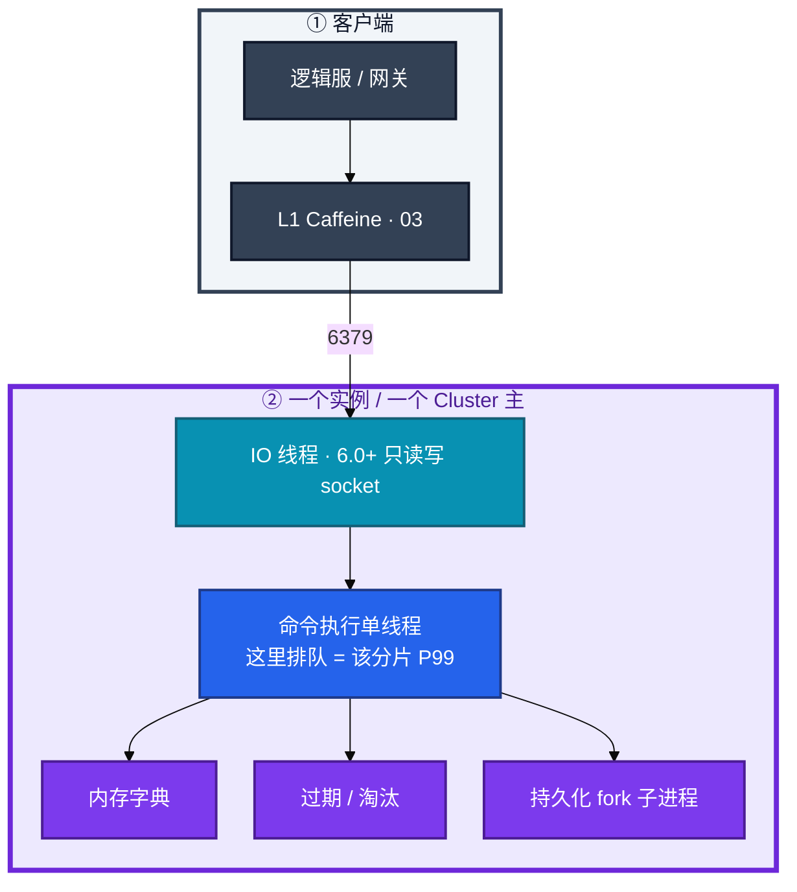
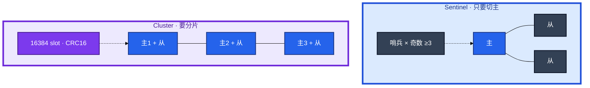
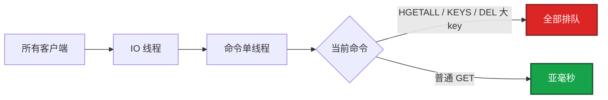
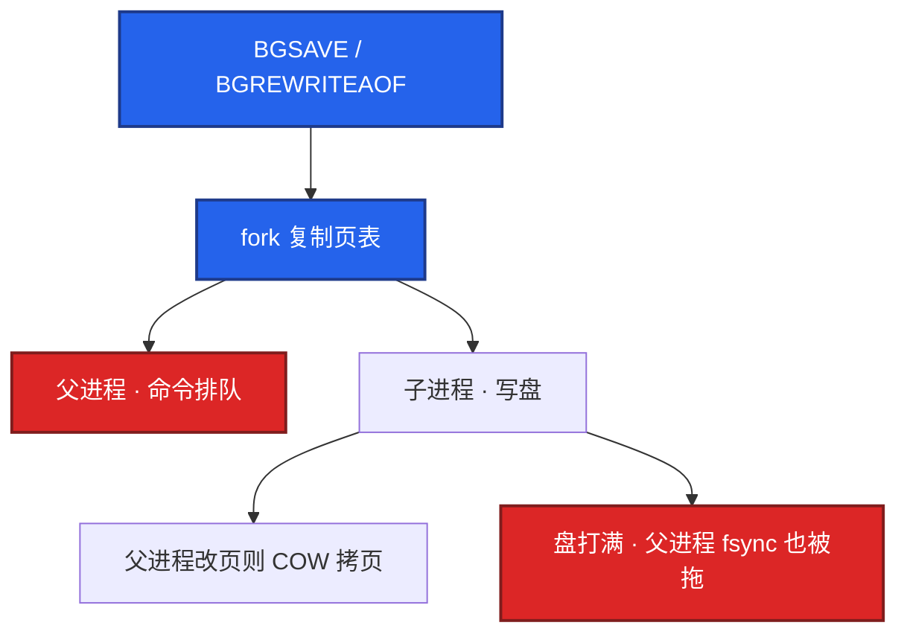
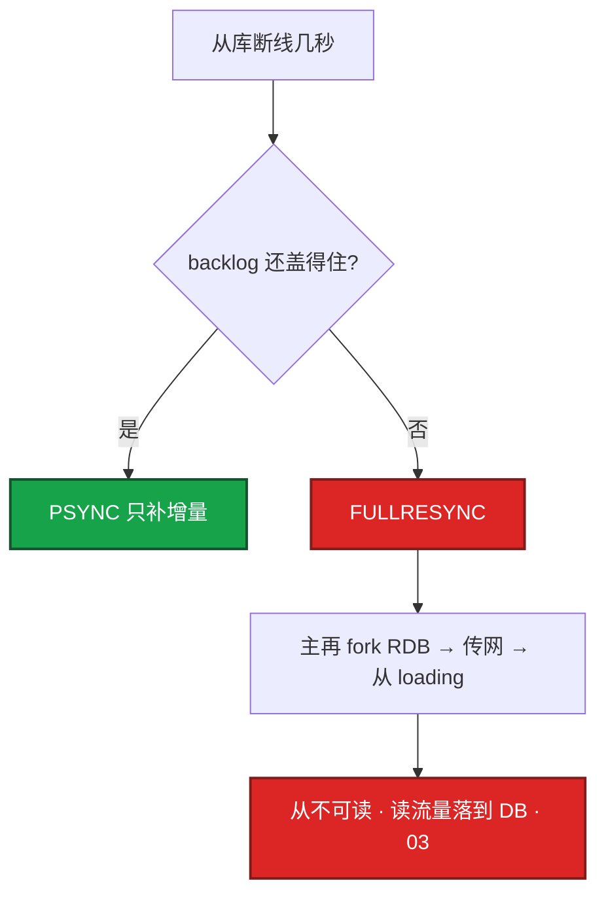
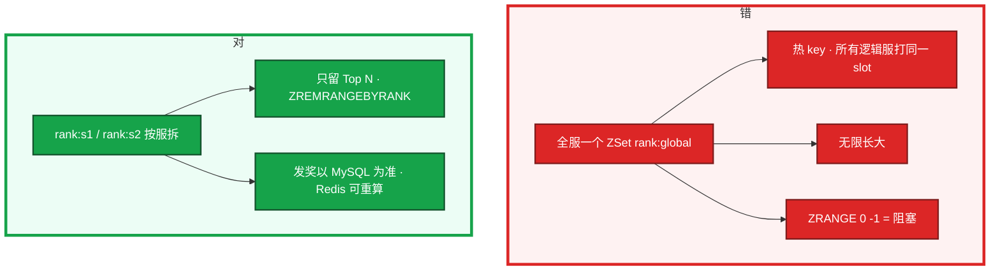
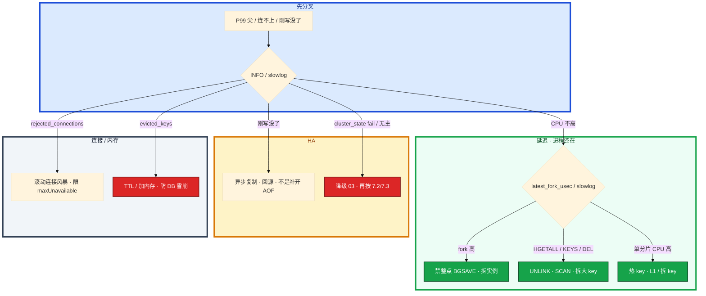

# Redis


活动整点，心跳超时一批。Redis CPU 并不忙。群里有人要上 Cluster「吃多核」，另有人要把昨晚 RDB 往新主上 restore。

先别动手。这一章后半全是你会动手的：**怎么装哨兵或 Cluster、怎么查 slowlog、怎么切主、怎么扩槽、fork 尖了怎么止血。** 前面的概念和原理，是为了让你动手时不选错路。穿透 / 击穿 / 雪崩怎么挡 DB，在 03。

**读完你能：** 白板上画出命令单线程和 Cluster slot；P99 尖能判断是 fork 还是大 key；主挂了会选哨兵还是 Cluster 路径；热 key / 排行榜 / 会话不会塞错结构。

**本章主线（排障就按这三步想）：**

1. **分层**：命令单线程排队 vs IO 线程 vs fork 子进程；热 key 只在一个 slot。
2. **归类**：P99 尖 → fork/大 key/slowlog；刚写没了 → 异步复制 lag；连不上 → 连接/Cluster。
3. **留证**：`info persistence` + `slowlog` + `info replication`，确认角色再 failover。

## 本章目录

- [1. 基本概念](#1-基本概念)
- [2. 架构图](#2-架构图)
- [3. 原理](#3-原理)
  - [3.1 命令单线程](#31-命令单线程排队)
  - [3.2 一次 BGSAVE](#32-一次-bgsavefork-cow)
  - [3.3 大 key、热 key、淘汰](#33-大-key热-key淘汰)
  - [3.4 哨兵 vs Cluster](#34-哨兵-vs-cluster)
  - [3.5 排行榜、会话、道具](#35-排行榜会话道具)
  - [3.6 分布式锁](#36-分布式锁)
- [4. 落地](#4-落地)
  - [4.1 生产怎么选](#41-生产怎么选)
  - [4.2 落地你实际看到什么](#42-落地你实际看到什么)
- [5. 核心配置](#5-核心配置)
- [6. 命令与操作](#6-命令与操作)
  - [6.1 备份](#61-备份)
  - [6.2 哨兵切主](#62-哨兵切主)
  - [6.3 Cluster 换节点](#63-cluster-换节点)
  - [6.4 升级](#64-升级)
  - [6.5 回滚](#65-回滚)
  - [6.6 扩容 reshard](#66-扩容-reshard)
  - [6.7 容量与性能](#67-容量与性能)
- [7. 生产排障](#7-生产排障)
- [8. 必会 · 常考](#8-必会-常考)
- [合上书](#合上书问自己)

**本章不讲：** 穿透 / 击穿 / 雪崩、Cache Aside、和 DB 谁先写 → [03 缓存架构](../03-缓存架构/)；钱包权威、PITR → [01 MySQL](../01-MySQL/)；延迟队列积压 → [05 Kafka](../05-Kafka/)；网关超时把 Redis 超时当 miss → [04 接入网关](../04-接入网关/)。合服/回档多存储对齐 → [08-07](../../08-游戏运维专题/07-玩家数据备份与回档/)。

---

## 1. 基本概念

Redis 快，是因为 **内存 + epoll + 命令单线程无锁**，不是因为「单线程算得特别快」。6.0 起 IO 可以多线程，但 **命令执行仍串行**。一个慢命令、一个大 key 的 `DEL`，这个实例（Cluster 里就是这个分片）上所有请求排队。

在游戏里它不是账本。道具数量、发货、充值以 MySQL 为准（01）。Redis 扛的是：**会话、排行展示、活动配置、背包缓存**。丢几秒写，回源能补的，才能放这里。

| 在 Redis 里合适 | 不要只放 Redis |
|-----------------|----------------|
| Session（TTL 对齐心跳）、排行 Top N、活动配置 | 钱包余额、发货状态、邮件已读权威 |
| 背包缓存（可回源） | 唯一库存扣减 |
| 分布式锁（减少并发） | 支付幂等（用 DB 唯一键） |

三个角色不要混：

| 角色 | 干什么 |
|------|--------|
| **命令线程** | 执行 GET/SET/ZADD；慢命令堵住的就是它 |
| **持久化子进程** | `BGSAVE` / AOF 重写；fork 会让父进程抖 |
| **哨兵 / Cluster 总线** | 谁是主、槽在哪；不执行业务命令 |

> **记住**：CPU 不高但延迟尖刺，先看 fork 和大 key，不要先加核。一个 key 只在一个线程、Cluster 里只在一个 slot。Cluster 不是热 key 银弹。

---

## 2. 架构图

先把整张图钉住。后面安装、命令、排障都对着这张图说话。



图上三条线：

1. **没有「加核让这一条 GET 变快」。** IO 多线程不执行命令。热 key 加核没用。
2. **持久化在旁边 fork**，不是另一条无锁快路径。整点重写 = 一次心跳周期级卡顿。
3. **客户端不要写死主 IP。** 问哨兵或跟 Cluster `MOVED`。

两种生产 HA（装的时候选，挂的时候故障域不一样）：



| | 哨兵 | Cluster |
|--|------|---------|
| 解决什么 | 主挂了谁顶上 | 数据分片 + 主挂了谁顶上 |
| 容量 | 单机内存上限 | 多主内存相加 |
| 多 key | 无 slot 限制 | 必须同 slot |
| 运维 | 简单 | 迁槽、MOVED、大 key |
| 热 key | 打满这一台 | 仍打满**这一槽所在主** |

只要切主、数据单机放得下 → 哨兵。内存 / QPS 单机不够 → Cluster。单机 30GB 的 fork 成本，拆实例往往比继续加哨兵从库更对症。3 主没有从？生产不要。主挂了该槽直接不可用，起步 **3 主 3 从**。

编码本身很少成为事故：SDS、小集合 listpack（老 ziplist）、ZSet skiplist。事故是你把结构撑成大 key，一次 `HGETALL` 把 CPU 和网卡一起打满。

---

## 3. 原理

原理只保留动手和面试会用到的：谁在排队、为什么盘一写全集群该分片卡、切主丢的是哪几秒、槽为什么救不了热 key。

**本节 6 块：** 3.1 单线程 · 3.2 fork · 3.3 大/热 key · 3.4 HA · 3.5 游戏结构 · 3.6 锁

### 3.1 命令单线程：排队

大厅执行 `GET activity:config`。GET 本身 O(1)，value 小的时候 P99 应是亚毫秒。客户端突然 200ms，先别加 CPU。



生产禁用 `KEYS *`。大集合 `LRANGE 0 -1` / `SMEMBERS` / `HGETALL`、`SORT`、大 key `DEL` 会把 P99 打到百毫秒。删除用 `UNLINK`；遍历用 `SCAN` / `HSCAN` / `ZSCAN`。

```bash
redis-cli slowlog get 20
# slowlog-log-slower-than 单位是 μs；排障可临时调低，看完改回去
redis-cli info commandstats | grep -E 'keys|hgetall|del|unlink'
```

Pipeline 把多条命令一起发，省 RTT，**不提供隔离**。`MULTI` / `EXEC` 是单机事务，Cluster 上多 key 必须同 slot，否则 `CROSSSLOT`。单线程只保证一条命令原子，两条 `INCR` 中间仍可能插进别人的命令，除非包进 `MULTI`。

过期是惰性删 + 定时抽样。大量 key 同一秒过期，会在那一秒抽到一堆删除，P99 抖一下。这和 03 的雪崩是同一现象的进程侧：TTL 对齐既打 Redis 自己，也打回源。

> **记住**：命令单线程排队；卡住先看 slowlog 和大 key，不要先加核。用 Cluster 或多实例吃多核。一个大 key 热在一个核上，加核没用。

### 3.2 一次 BGSAVE：fork / COW

活动整点，客户端偶发超时，Redis CPU 并不高。你先跑：

```bash
redis-cli info persistence
# rdb_last_bgsave_status / rdb_last_bgsave_time_sec
# latest_fork_usec          # 上次 fork 耗时；>10 万 μs 要当故障看
```

`latest_fork_usec=250000`（250ms）已经等于一次心跳周期。游戏逻辑服超时 200ms 时，这次 fork 就是一次集中掉线。

| | RDB | AOF |
|--|-----|-----|
| 内容 | 全量快照 | 写命令追加 |
| 丢数据 | 两次 save 之间 | `everysec` 最多约 1s |
| 恢复 | 快 | 纯 AOF 重放慢 |
| 生产 | 备份 / 冷备 | 与 RDB 混用 |

`aof-use-rdb-preamble yes`：AOF 文件前半是 RDB、后半是增量，启动快且丢得少。这是生产常见组合。`appendfsync always` 换安全、吞吐腰斩，游戏**缓存**场景几乎不用。钱包、道具不要只放 Redis，丢 1 秒也不可接受——权威在 MySQL（01）。

`SAVE` 同步冻住进程，生产禁止。线上只有 `BGSAVE` / `BGREWRITEAOF`。

**fork 是线上延迟的头号元凶之一。** `BGSAVE` 和 AOF 重写都要 fork。Linux 写时复制（COW）：



fork **本身**就要复制页表，实例 20GB+、写负载高时，父进程卡住几十到几百毫秒。数据盘不要和系统盘混。治理：别在活动整点手动 `BGSAVE`；拆实例降单进程内存；AOF 重写阈值拉开，避开开服 / 活动整点；`repl-diskless-sync` 减轻全量同步打磁盘；监控 `latest_fork_usec`，和客户端 P99 对齐。拆到 8GB × 3 个实例，尖刺往往从百毫秒掉到几十毫秒。不要在高峰用「再 BGSAVE 一次看看能不能好」。

主从全量同步 = 一次 BGSAVE + 传 RDB，从库加载期间不可用。短抖动后应走 **PSYNC 增量**；反复全量说明 replication backlog 不够，或网络翻车。故障切主后多个从一起要 RDB，会打满网卡，叫复制风暴。



`repl-backlog-size` 按「峰值写入 × 可容忍断线时间」留，不要用默认几十分之一内存。diskless 同步减的是主库磁盘，网卡和 fork 仍在。

缓存可丢：定时 RDB 即可。要少丢：混合 AOF + `everysec`。**AOF 救的是该节点重启，不是已经切到落后从库。** 切主丢的是 replication lag 那几秒写。

> **记住**：CPU 不高但 P99 尖，先看 `latest_fork_usec`；AOF 救重启，救不了切到落后从库。

### 3.3 大 key、热 key、淘汰

**大 key。** 活动开始有人 `HGETALL player:10001:mail`，邮件 Hash 里塞了整包历史。危害：网络带宽、fork 更慢、Cluster 迁槽卡住、`DEL` 阻塞。经验红线：String > **10KB**，Hash / ZSet / List 元素 > **5000**（按业务再收紧）。禁止把整页排行、整包邮件塞一个 key。

```bash
redis-cli --bigkeys              # 采样，低峰跑；不是全量扫描
redis-cli memory usage <key>
```

拆 Hash 分片、ZSet 按时间分桶；删除用 `UNLINK`。迁槽之前先治大 key，否则 reshard 会在那个 slot 上卡很久。

**热 key。** 单 key 再快也只在一个线程、Cluster 里只在一个 slot。活动配置、全服公告、爆款礼包最常见。你看到：一个分片 CPU / 网卡打满，其它分片很闲。迁槽只是把这个 slot 搬到另一台，热点跟着走。加节点没用。

发现：① `redis-cli --hotkeys`（需 `maxmemory-policy` 含 LFU）② 客户端埋点 top key ③ 分片 CPU / 网卡不均。

止血：应用 L1（Caffeine 数秒）挡住读；把 value 复制到 `hot:id:{0..N}` 随机读；写仍打源 key 再扇出。根因是 key 设计没打散。架构层逻辑过期、回源限流、活动预热见 03。读写比极高的配置：逻辑过期 + L1，几乎不给物理 TTL，避免整点一起过期变成击穿。

**淘汰。** `maxmemory` 必须设。纯缓存 `allkeys-lru`（或 lfu）；既有缓存又有必须留的数据用 `volatile-lru`。默认 `noeviction` 写满直接报错，缓存场景会把写接口打挂。

| policy | 行为 | 用在哪 |
|--------|------|--------|
| `noeviction` | 写失败 | 不能丢的数据；缓存场景会打挂写接口 |
| `allkeys-lru` / `lfu` | 任何 key 都可踢 | **纯缓存默认** |
| `volatile-lru` | 只踢带 TTL 的 | 同实例里既有缓存又有必须留的 |

`evicted_keys` 持续 > 0 = 内存不够或 TTL 缺失，命中率会塌，DB 被带崩。先加 TTL、拆大 key，再扩内存。水位告警 **70%～80%**，不要等 OOM。热数据被踢和「Redis 还活着、DB 突然 ×5」是同一条传导链，见 03。

碎片：`mem_fragmentation_ratio > 1.5` 考虑 `activedefrag`，或低峰重启**从节点**。重启主节点要走 failover，不是 `systemctl restart redis`。`activedefrag` 本身吃 CPU，高峰开等于自己制造慢命令。

### 3.4 哨兵 vs Cluster

主从复制是**异步**的。你刚 `SET session:uid=10001 ...`，主挂了，哨兵切到落后 2 秒的从。这 2 秒写丢了。充值、扣道具不能只靠 Redis。`min-replicas-to-write` 换的是可用性：从库不够就不让写，缓存场景要想清楚。

哨兵脑裂：网络分区时可能双主。奇数哨兵、quorum、客户端**只认哨兵给的主**。业务不能把两个 Redis 都当账本双写。

Cluster：`CRC16(key) % 16384 → slot → 节点`。

1. `MGET` / `MSET` / 事务 / Pipeline 多 key 必须同 slot
2. `user:{uid}:bag` 用 `{}` 把 uid 当 **hash tag**，同一用户的 key 进同一槽
3. tag 太粗（所有人 `{user}`）会变成单槽热点，比没有 tag 更糟
4. 一个热 key 仍打满单主
5. `KEYS` / `SCAN` 要逐节点；`redis-cli -c` 跟随 `MOVED`

客户端打到错误的节点，会收到 `MOVED slot ip:port`，必须重定向。迁槽过程中可能看到 `ASK`，表示数据正在迁移，先问目标节点。自写客户端漏了重定向，表现为「这个 key 时好时坏」。


扩容是 **reshard 迁 slot**，迁大 key 会长时间阻塞该槽。先治理大 key 再扩。Cluster 救不了热 key，只是把不热的数据拆到别的机器上。

HA 和「怎么用缓存」不是一回事：雪崩可以是 TTL 对齐，也可以是 Redis 挂了无降级，要分开讲（03）。

> **记住**：切主丢的是复制滞后那几秒，不是 AOF 没开；Cluster 解决分片，不解决热 key。

### 3.5 排行榜、会话、道具

**排行榜。** 玩家打完 Boss，逻辑服 `ZINCRBY rank:s1 15 uid:10001`，再 `ZREVRANGE rank:s1 0 99 WITHSCORES` 给客户端 Top 100。score 用积分；同分用时间戳做小数位，或 member 带时间，避免并列乱序。



榜不是账本：Redis 掉主从、fork 丢缓存，都可以从 DB 重算。发奖流水落 MySQL。跨服榜：独立集群或离线汇总，别让每个逻辑服直打同一热 key。开服一周把全服战力塞进一个 key，活动开始 `ZRANGE 0 -1`——排行题和热 key 题叠在一起。

延迟队列用 score=执行时间戳 + `ZRANGEBYSCORE` 轮询，要自己处理失败重试，没有消费组、没有积压治理。核心链路用 Kafka（05），不要把 ZSet 当消息队列。

**会话。** 可放 Redis，TTL 对齐心跳超时。逻辑服内存状态仍要以服为准。Redis 挂了应能踢回登录重连，而不是当成唯一会话库还没有降级。降级开关和回源限流在 03。K8s 滚动大厅：每个 Pod 重建连接池，短时间连满。`maxclients` 打满，新连接 `Could not connect`。滚动限制 `maxUnavailable`，池要有上限。空闲连接用超时回收，但游戏网关长连 Redis 不要设太短，否则心跳重建。滚动窗口里新旧 Pod 同时活着，连接数近似翻倍。

**道具。** 展示、背包列表可以缓存；扣减、交易、邮件已读权威在 MySQL。切主后 Redis 里刚 SET 的道具缓存没了，回源回填即可，不要在 Redis 里「补一条」当账。热销礼包配置是热 key，走 L1 + 逻辑过期，不要把库存数字当 Redis 权威。

慢客户端：输出缓冲区打满会杀连接（`client-output-buffer-limit`）。`MONITOR`、大 `KEYS`、订阅不消费，都会把缓冲区堆爆。`info clients` 看 `blocked_clients`（`BLPOP` 等）。生产排障用 `slowlog` 和采样 `bigkeys`，不要开长时间 `MONITOR`。

### 3.6 分布式锁

正确写法：`SET key uuid NX PX ttl`，释放用 Lua 校验 uuid 再 `DEL`。不要 `GET` + `DEL`，会删掉别人的锁。过期太短，业务没跑完锁没了，并发进来；太长，持有者挂了恢复慢。

锁不是 Redis 的主职责。跨主从的 Redlock 争议大。**核心交易用 DB 唯一约束更稳**——支付幂等靠订单号唯一键，锁只是减少并发。failover 丢锁、TTL 到期，都会双入。不要答「加把 Redis 锁就强一致」。

被问「Redis 三大问题」可以点名穿透 / 击穿 / 雪崩，展开要讲应用层策略（03），不要停在 `SETNX`。

---

## 4. 落地

### 4.1 生产怎么选

| 项 | 选 | 不选 |
|----|----|------|
| HA | 数据单机放得下 → 哨兵 ≥3；否则 Cluster 3 主 3 从起 | 单主无从；3 主 0 从 |
| 内存 | 单实例宁拆到 **8～16GB** 控 fork | 单进程 30GB+ 硬扛 |
| 磁盘 | 独立 SSD（AOF/RDB） | 和游戏日志同盘 |
| 网络 | 同城；客户端跟哨兵或 Cluster | 写死主 IP |
| 持久化 | 缓存：RDB 或混合 AOF `everysec` | 缓存用 `appendfsync always`；`SAVE` |
| 账号 | requirepass / ACL；6379 不裸奔 VPC | 无密码对整个业务网 |

托管（云 Redis）：问清 failover 是否丢异步复制那几秒、谁做备份、能否 `--bigkeys`、扩容是否停写。停活动的仍是你的业务。

### 4.2 落地你实际看到什么

| 路径 / 口 | 内容 |
|-----------|------|
| `6379` | 客户端；生产 TLS 或至少 VPC + 密码 |
| `16379` | Cluster 总线，仅成员 |
| RDB / AOF 目录 | **这就是数据**；备份拷的是它 + 配置 |
| `sentinel.conf` / `nodes.conf` | 哨兵监控列表；Cluster 节点身份 |

验收：进程在不算数。必须 `INFO replication` 角色正确、哨兵 failover 演练过或 `CLUSTER INFO` `cluster_state:ok`、slowlog 能取。不要只探 TCP 6379。

---

## 5. 核心配置

只动有证据的项。改 `appendfsync` 和 `maxmemory-policy` 要能说出丢什么、踢谁。

| 参数 | 默认倾向 | 生产怎么用 | 改错会怎样 |
|------|----------|------------|------------|
| `maxmemory` | **必须设** | 水位 70%～80% 告警 | 不设吃光机器；OOM killer |
| `maxmemory-policy` | 纯缓存 `allkeys-lru` | 有永驻 key 用 `volatile-lru` | `noeviction` 打挂写接口 |
| `appendfsync` | 缓存 `everysec` | 几乎不用 `always` | `always` 吞吐腰斩；仍救不了切主 |
| `aof-use-rdb-preamble` | **yes** | 混合 AOF | 关了纯 AOF 启动慢 |
| `repl-backlog-size` | 按峰值写 × 断线窗口 | 避免短抖 FULLRESYNC | 默认太小 → 复制风暴 |
| `repl-diskless-sync` | 大 RDB 可开 | 减主库盘，不减网卡/fork | 当银弹会误判 |
| `client-output-buffer-limit` | 保持合理上限 | 防 MONITOR / 大 KEYS | 过小杀正常从库；过大撑爆内存 |
| `maxclients` | 按 `Pod × 池` 翻倍算滚动 | 留余量 | 滚动 `rejected_connections` |
| `slowlog-log-slower-than` | 1～10ms 量级 | 排障可临时调低 | 过宽等于没日志 |
| `activedefrag` | 低峰 | 碎片 >1.5 | 高峰开 = 自己造慢命令 |
| `min-replicas-to-write` | 缓存慎开 | 换可用性 | 从不够就拒写，活动直接挂 |

> **记住**：`appendfsync always` 和 MySQL 双 1 不是同类题：缓存不值得；当成账本用 Redis 才是选错存储。`maxmemory` 不设等于没容量规划。

---

## 6. 命令与操作

值班先跑这几条：

```bash
redis-cli info replication
redis-cli info persistence
redis-cli info clients
redis-cli slowlog get 20
redis-cli info memory
```

Cluster 再加：

```bash
redis-cli -c -h <host>
redis-cli --cluster check <node>
```

| 目的 | 命令 | 看什么 |
|------|------|--------|
| 角色 / 主从 | `INFO replication` | role、lag、backlog |
| fork | `INFO persistence` | `latest_fork_usec`、上次 BGSAVE |
| 慢命令 | `SLOWLOG GET` | 大 KEYS / HGETALL / DEL |
| 大 key | `--bigkeys` 低峰 | 采样，不是全量 |
| 热 key | `--hotkeys` | 需 LFU |
| 内存 | `INFO memory` | used、fragmentation、evicted_keys |
| 连接 | `INFO clients` / `CLIENT LIST` | blocked、输出缓冲 |
| Cluster | `CLUSTER INFO` / `CLUSTER NODES` | `cluster_state`、slot 分布 |
| 删除 | `UNLINK` | 不要对大 key `DEL` |
| 扫描 | `SCAN` / `HSCAN` | 禁止 `KEYS *` |

指标：

| 指标 | 阈值 | 级别 |
|------|------|------|
| `latest_fork_usec` | **> 10 万 μs** | P0/P1，对齐客户端超时 |
| `evicted_keys` 持续增 | >0 且命中率掉 | P1，将带崩 DB |
| 单分片 CPU / 网卡 | 其它分片很闲 | P1 热 key |
| `rejected_connections` | 滚动期突增 | P1 连接风暴 |
| `mem_fragmentation_ratio` | **> 1.5** | 低峰 defrag |
| 内存水位 | **> 80%** | P1 |
| Cluster `cluster_state` | 非 ok | **P0** |

日志：`LOADING` = 从库全量；`MISCONF` 常跟磁盘只读；`MOVED` 刷屏 = 客户端没跟 Cluster 或正在迁槽。

---

### 6.1 备份

RDB 定期 `BGSAVE` 到**另一台机器 / 另一 AZ**；开 AOF 的把 AOF 一起拷。本机 cron 不算。缓存 RPO 可以秒级，但仍要能拉起空实例 + 回源，不要假设「丢了也能从 DB 全部重放」却没有预热（03）。

**季度做一次 restore 演练**（从库拉起或新实例 load RDB）。没有演练 = 没有备份。活动前加打一份。

### 6.2 哨兵切主

多数派 quorum 才切。客户端问哨兵「谁是主」再连，不要写死 IP。

计划内：先确认从落后可接受 → `SENTINEL FAILOVER` 或先把写切到只读窗口 → 观察 `INFO replication`。

故障：主真挂了才让哨兵切。切完 **刚 SET 的可能没了**，应用回源。不要对旧主立刻 `SLAVEOF NO ONE` 造成双主。奇数哨兵、quorum、网络分区时认哨兵给的主。

### 6.3 Cluster 换节点

多数派槽还在：**不要**用一份旧 RDB 往活着的节点上乱 restore。摘坏节点、补新节点、迁回 slot，按官方 `redis-cli --cluster` 路径。某主挂了、从能顶：failover 后该槽继续服务。

多数派丢了 / `cluster_state:fail`：停写窗口，按备份恢复，业务走 03 降级。不要对残集群盲 `CLUSTER ADDSLOTS`。

### 6.4 升级

先 RDB/AOF 拷走。滚动：先升从（或 Cluster 副本），再 failover 把旧主变成从再升。不要全集群同时换二进制。大版本看官方兼容（磁盘格式）。复制在、slowlog 正常再下一台。

### 6.5 回滚

AOF/RDB 格式升过可能 **不能靠换回旧二进制**。回退 = 升级前 RDB/AOF 拉新实例（或从备份盘）。没有升级前文件 = 没有回滚。缓存可接受空实例 + 回源，仍要限流（03）。

### 6.6 扩容 reshard

Cluster 扩容 = **迁 slot**，不是加一台就自动变快。先 `--bigkeys`，大 key 先拆。迁的时候该槽延迟升高，避开活动整点。hash tag 太粗会让大量 key 挤在同一槽，迁完热点还在。哨兵拓扑加从只加读和 HA，**不加写容量**；写满了拆实例或上 Cluster。

### 6.7 容量与性能

- 单实例内存过大 → 拆，降 `latest_fork_usec`
- 热 key → L1 / 拆 key，不是加节点
- `evicted_keys` → TTL + 加内存，否则 DB ×N
- 连接：`maxclients` ≥ 滚动翻倍后的池
- 排行 ZSet 裁尾；会话 TTL；道具缓存可丢

水位 70%～80%。碎片低峰处理。复制 backlog 按峰值留。

---

## 7. 生产排障

三问：进程还在不在？命令还能不能进？刚写的还在不在？

**Redis 不可用 = 缓存层 miss，不是立刻踢玩家。** 没有降级开关硬打 DB 会全站 504（03）。已登录会话可能还在逻辑服内存里。



现场顺序：

```bash
redis-cli info persistence
redis-cli slowlog get 20
redis-cli info replication
redis-cli info clients
redis-cli info memory
```

Cluster 加 `CLUSTER INFO`。`iostat` 看 **Redis 数据盘**。不要先 `MONITOR`，不要先 `KEYS *`。

| 现象 | 先做什么 | 不要做什么 |
|------|----------|------------|
| P99 尖、CPU 30% | fork / 大 key | 先上 Cluster 加核 |
| 单分片 90%、其它 10% | 热 key | 加节点 / 迁槽当根治 |
| 切主后道具缓存没了 | 回源；权威在 MySQL | 「开 AOF 就不会丢」 |
| 迁槽卡住 | 槽上大 key，先拆 | 高峰继续 reshard |
| `rejected_connections` | 滚动翻倍、池上限 | 先怪 Redis 变慢 |
| 多个从 loading | 复制风暴、backlog | 再对所有从 FORCE 全量 |
| 碎片 1.8 | 低峰从库 defrag | `systemctl restart` 主 |
| 三大问题 | 点名后展开 03 | 停在 SETNX |

活动高峰 Redis 和日志同盘，fork + fsync 打到心跳以上。正确处理：确认进程还在 → 停止发版和手动 BGSAVE → 救盘 / 大 key / 热 key → 应用限流回源。不要重启还活着的战斗服。

---

## 8. 必会 · 常考

白板和追问高频，能一口回：

| 说法 | 对错 | 口径 |
|------|:----:|------|
| IO 多线程所以命令并行 | 错 | 执行仍单线程 |
| 上 Cluster 热 key 就散了 | 错 | 一个 key 一个 slot |
| `KEYS *` 比 SCAN 快可以高峰用 | 错 | 生产禁用 |
| 大 key 用 `DEL` 最快 | 错 | 用 `UNLINK` |
| `SAVE` 比 BGSAVE 更适合高峰 | 错 | SAVE 冻住进程 |
| AOF 开了切主就不丢 | 错 | AOF 救重启，不救落后从升主 |
| `appendfsync always` 等于 MySQL 双 1 | 错 | 缓存不值得；账本不该在 Redis |
| hash tag `{user}` 给所有人最省事 | 错 | 单槽热点 |
| 3 主 0 从 Cluster 生产能用 | 错 | 主挂槽不可用；3 主 3 从起 |
| 排行一个全局 ZSet + `ZRANGE 0 -1` | 错 | 按服拆、Top N、发奖看 DB |
| Redis 锁保证支付幂等 | 错 | DB 唯一键；锁只减并发 |
| `noeviction` 适合纯缓存 | 错 | 写满报错打挂接口 |
| 碎片高重启主进程 | 错 | 先从库；主要走 failover |
| 加哨兵从库让写入变快 | 错 | 写仍在主 |
| Pipeline 等于事务隔离 | 错 | 只省 RTT |

数字：`latest_fork_usec` **10 万 μs**；大 key String **10KB** / 集合 **5000**；内存告警 **70%～80%**；碎片 **1.5**；哨兵奇数 **≥3**；Cluster **16384** slot；起步 3 主 3 从。

易混：fork 尖 vs 大 key vs 热 key；AOF vs 切主丢数据；哨兵 vs Cluster；MOVED vs ASK；PSYNC vs FULLRESYNC；锁 vs 唯一约束；HA vs 缓存三大问题（03）。

---

## 合上书，问自己

1. 为什么快？哪类命令让该实例所有请求排队？
2. 一次 BGSAVE 父进程为什么抖？`latest_fork_usec` 红线？
3. 哨兵和 Cluster 各解决什么？热 key 为什么加节点没用？
4. 排行榜 / 会话 / 道具各怎么存？谁是权威？
5. 切主丢的是哪几秒？备份怎样才算有？扩容迁什么？
6. 值班先跑哪几条？P99 尖先看 fork 还是加核？

六题都能口述，这一章就过了。下一章把缓存层剖开：和 DB 谁先写、穿透击穿雪崩、活动预热和降级。
