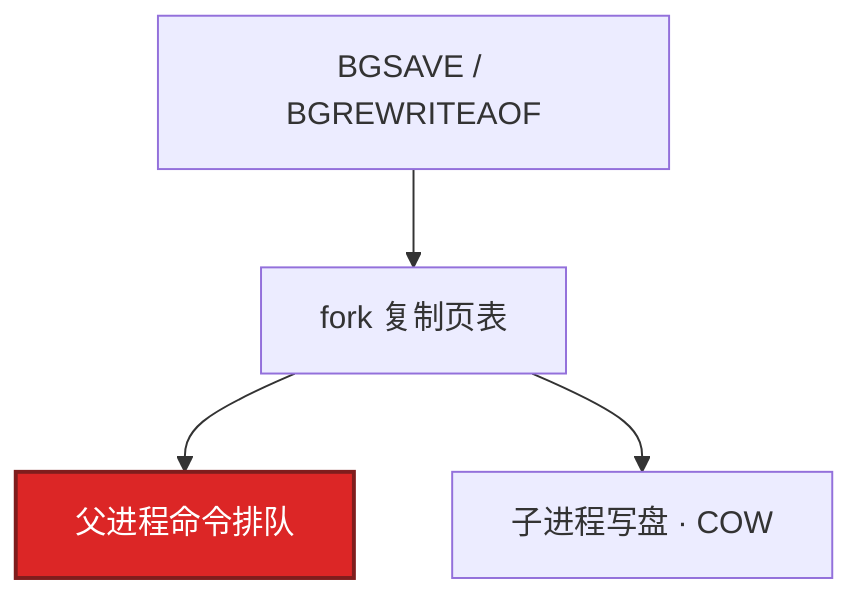
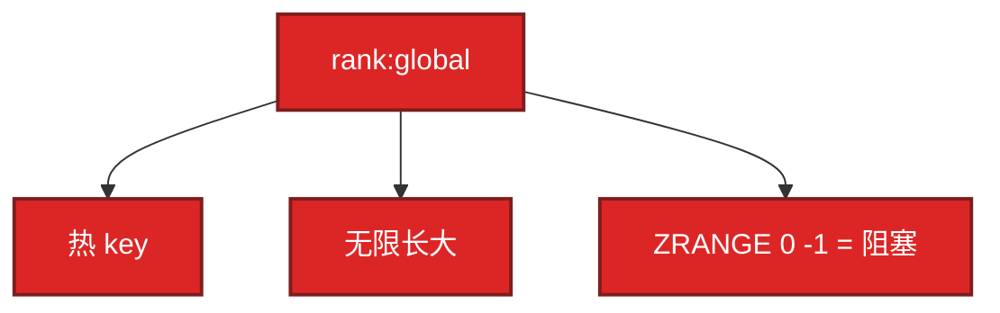

# 02｜Redis · 练习题

先自己画图或口述，再对照解答。每题标了覆盖范围：

| 标记 | 含义 |
|------|------|
| **核心** | 不懂整章就没建立起来 |
| **必会** | 值班和面试都要能讲 |
| **常用** | 线上会反复碰到 |
| **常考** | 白板和追问的高频口径 |

穿透 / 击穿 / 雪崩的架构展开见 03，本章偏 Redis 进程与数据面。

## 本题目录

- [Q1 为什么快、谁在排队](#q1)
- [Q2 fork / RDB / AOF](#q2)
- [Q3 热 key / 大 key / Cluster](#q3)
- [Q4 排行榜](#q4)
- [Q5 Cluster 多 key / hash tag](#q5)
- [Q6 哨兵 vs Cluster / 切主丢数据](#q6)
- [Q7 锁 / 道具权威](#q7)
- [Q8 备份升级扩容](#q8)
- [Q9 排障分流](#q9)
- [Q10 淘汰 / 碎片](#q10)
- [Q11 连接风暴](#q11)
- [Q12 复制风暴 / 会话](#q12)
- [合上书](#合上书)

---

## Q1

**★★★★★｜Redis 为什么快？什么命令会让所有请求排队？**

**覆盖**：核心 · 必会 · 常考

### 场景

活动查询接口 P99 到 200ms。Redis CPU 只有 30%。有人说「单线程太慢，该上 Cluster」。慢日志里有一条 `HGETALL mail:uid:10001`。

### 完整解答

内存 + epoll + 命令单线程无锁。6.0+ IO 可多线程，**执行仍单线程**。一个慢命令堵住的是这个实例（Cluster 则是该分片），不是「CPU 算不过来」。

生产禁用 `KEYS *`。大集合用 `HSCAN` / `SSCAN` / `ZSCAN`；删除用 `UNLINK`。观测：`slowlog get`、客户端 P99。Cluster 吃的是多核和分片容量。一个大 key / 热 key 仍在一个核上，加节点没用。先治命令和大 key。Pipeline 只省 RTT，不是隔离。

### 再追问

单线程不是浪费多核吗？——用 Cluster 或多实例吃多核。一个大 key 热在一个核上，加核没用。

---

## Q2

**★★★★★｜RDB / AOF 怎么选？fork 为什么会让 P99 尖刺？**

**覆盖**：核心 · 必会 · 常用

### 场景

晚高峰每到整点游戏心跳超时一批。`latest_fork_usec` 到 25 万。刚好 AOF 重写阈值到了。有人准备改成 `SAVE`「快一点写完」。

### 完整解答

缓存可丢用 RDB 定时即可；要少丢开 AOF `everysec` + 混合 preamble（`aof-use-rdb-preamble yes`）。`SAVE` 同步冻住，生产禁止。`appendfsync always` 游戏缓存几乎不用。

大内存写密集时父进程卡住几十到几百 ms，游戏心跳全部排队。观测：`latest_fork_usec`（**>10 万 μs** 当故障）、`rdb_last_bgsave_time_sec`，和客户端超时对齐。

止血：高峰禁手动 BGSAVE；重写窗口挪到低峰。根因：单实例内存过大、AOF 重写太勤、数据盘 IO 打满。治理：拆实例、diskless 减盘（不减网卡/fork）。

### 再追问

SAVE 和 BGSAVE？——SAVE 冻住，生产禁止。BGSAVE 仍会 fork，只是不在前台死等。AOF 能防切主丢数据吗？——不能。

---

## Q3

**★★★★★｜热 key 和大 key 怎么发现、止血？Cluster 能解决热 key 吗？**

**覆盖**：核心 · 必会 · 常考

### 场景

3 主 Cluster。活动配置一个 key，其中一台 CPU 90%，另外两台 10%。迁槽之后热点还在同一台（或跟着 slot 走）。

### 完整解答

不能。Cluster 只按 slot 分片，一个 key 仍在一个主上。迁槽只是把这个 slot 搬走，热点跟着走。加节点没用。

大 key：`--bigkeys`（低峰采样）/ `MEMORY USAGE`，拆分 + `UNLINK`。红线经验：String > 10KB，集合元素 > 5000。先拆再迁槽，否则 reshard 卡死。

热 key：`--hotkeys`（需 LFU）、分片 CPU 不均、客户端埋点。止血：L1 挡住读；复制到 `hot:id:{0..N}` 随机读，写打源 key 再扇出。读写比极高的配置：逻辑过期 + L1，几乎不给物理 TTL。架构层预热、回源限流见 03。

### 再追问

读写比极高的配置怎么做？——逻辑过期 + L1；几乎不给物理 TTL，避免整点击穿。

---

## Q4

**★★★★★｜排行榜为什么用 ZSet？全服一个 ZSet 有什么问题？道具和会话呢？**

**覆盖**：核心 · 必会 · 常考

### 场景

全服战力榜一个 key `rank:global`，`ZRANGE 0 -1` 给客户端拉全量。开服一周 member 到 50 万，活动开始 Redis P99 炸。发奖以这个 ZSet 为准。另有人把扣钻也只写 Redis。

### 完整解答

score 排序 + `ZREVRANGE` / `ZRANK` 是 `O(log n)`。问题不在 ZSet，在**一个 key 扛全服**。

按服拆 `rank:s1` / `rank:s2`；只留 Top N，`ZREMRANGEBYRANK` 裁尾。同分用时间戳做小数位。跨服榜离线汇总或独立集群。

**榜不是账本。** 发奖以 MySQL 为准，Redis 可重算。道具扣减权威在 InnoDB；Redis 只缓存，切主丢了回源。会话可放 Redis，TTL 对齐心跳；Redis 挂了应能踢回登录，不要当唯一会话库无降级。

ZSet 当消息队列？——能做简陋延迟队列，没有消费组。核心链路用 Kafka。

### 再追问

切主后排行少了几秒积分？——展示可重算；发奖流水必须在 DB。不要拿 ZSet 入围资格当事故对账依据。

---

## Q5

**★★★★☆｜Cluster 多 key 操作为什么失败？hash tag 干什么？**

**覆盖**：必会 · 常用 · 常考

### 场景

`MULTI` 里 `HGET bag:{uid}` 再 `GET wallet:{uid}`，换 Cluster 后报 CROSSSLOT。有人把所有 key 改成 `{user}:...` 想一劳永逸。

### 完整解答

多 key 必须同 slot。`MGET` / `MSET` / 事务 / Pipeline 都一样。`{uid}` 让同一用户的 key 进同一槽，才能 pipeline / 事务。

`bag:{10001}` 和 `wallet:{10001}` → tag=10001，同槽 OK。`bag:{user}` 全站一个槽，单点热点，比没有 tag 更糟。hash tag 按「需要原子操作的那一组」来，通常是同一个 uid。

扩容迁槽卡死：槽上有大 key。先拆再 reshard。`redis-cli -c` 跟随 `MOVED`；迁槽中可能 `ASK`。`SCAN` 要逐节点。

### 再追问

3 主没有从可以吗？——生产不要。主挂了该槽直接不可用。起步 3 主 3 从。

---

## Q6

**★★★★★｜哨兵和 Cluster 怎么选？切主后刚买的道具在 Redis 里没了？**

**覆盖**：核心 · 必会 · 常考

### 场景

哨兵切主。玩家刚扣的钻石在 Redis 里看不到，MySQL 订单是成功的。有人说「开 AOF 就不会丢」。另一边「上了 Cluster，所以不怕雪崩了。」还有单机 30GB 哨兵，fork 经常尖刺。

### 完整解答

异步复制，未同步到从库的写在切主时丢了。AOF 救的是**该节点重启**，不是已经切到落后从库。钱包 / 道具以 MySQL 为准，Redis 只缓存，回源回填即可。`min-replicas-to-write` 换的是可用性。

哨兵脑裂：奇数、quorum、客户端只认哨兵给的主。不要双写两个 Redis 当账本。

只要切主、数据单机放得下 → 哨兵；内存 / QPS 单机不够 → Cluster；热 key / 大 key 先改 key。单机 30GB 的 fork 成本，拆实例或上 Cluster 把内存降下来，比继续加哨兵从库更对症。

三大问题是怎么用缓存（03），HA 是进程挂了谁顶上。Cluster 不解决「应用超时当 miss 打爆 DB」。

### 再追问

上 Cluster 就不怕雪崩？——不怕分片写满，不怕单机内存；TTL 对齐和 Redis 挂了无降级仍在 03。

---

## Q7

**★★★★☆｜分布式锁正确写法？Redis 锁能保证支付幂等吗？**

**覆盖**：必会 · 常考

### 场景

支付回调用 `SETNX order_lock` 再处理。TTL 5 秒，偶尔回调超过 5 秒，出现双入。有人建议上 Redlock。

### 完整解答

`SET key uuid NX PX ttl`，Lua 校验 uuid 再 `DEL`。不要 `GET` + `DEL`。过期太短业务没完会并发；太长故障恢复慢。

支付幂等应用 **DB 唯一键**（订单号）。锁只是减少并发。failover 丢锁、TTL 到期、Redlock 在分区下的争议，都会双入。核心交易不靠 Redis 锁当事务。道具扣减同样：锁减并发，数量以 InnoDB 为准。

### 再追问

被问三大问题只答 SETNX？——不够。点名穿透/击穿/雪崩后展开到 03。

---

## Q8

**★★★★☆｜备份怎样才算有？升级失败怎么回滚？扩容迁什么？**

**覆盖**：必会 · 常用

### 场景

「有 cron 打 RDB」，从没 restore 过。Cluster 要扩，有人高峰直接 `--cluster reshard`。升级后有人把二进制改回去。

### 完整解答

备份：RDB/AOF **异地**；活动前加打；**做过 restore 演练**。本机 cron 不算。缓存也要能拉起 + 回源限流。

升级：先拷数据文件；先升从 / 副本再 failover。格式升过默认不能换回旧二进制。回滚 = 升级前文件拉新实例。

扩容：Cluster **迁 slot**，先拆大 key，避开整点。加哨兵从 **写不会更快**。hash tag 太粗，迁完热点还在。

Cluster 多数派还在时不要拿旧 RDB 往活节点上乱 restore。多数派没了：停写、备份恢复、业务降级（03）。

### 再追问

diskless 解决复制风暴吗？——只少打主库盘。网卡和 fork 仍在。

---

## Q9

**★★★★☆｜给出现象，你先走哪条排障路？**

**覆盖**：必会 · 常用

### 场景

四个工单：① P99 尖 CPU 不高 ② 单分片 CPU 90% ③ 切主后缓存没了 ④ etcd 式「进程还在但连不上」。

### 完整解答

| # | 走哪条 | 不要做 |
|---|--------|--------|
| ① | `latest_fork_usec` / slowlog 大 key | 先加核、上 Cluster |
| ② | 热 key：L1 / 拆 key | 加节点当根治 |
| ③ | 异步复制；回源；权威在 MySQL | 「开 AOF」 |
| ④ | `rejected_connections` / maxclients / 滚动翻倍 | 先 MONITOR、KEYS * |

现场：`INFO persistence` → `SLOWLOG` → `INFO replication` → `INFO memory` → Cluster 再 `CLUSTER INFO`。不要高峰 `MONITOR`。

### 再追问

托管了这章能跳过吗？——不能。热 key、fork、RPO、自己的 KEYS 和大 DEL 仍是你的。

---

## Q10

**★★★★☆｜内存满了会怎样？淘汰怎么选？碎片率 1.8 要不要重启主？**

**覆盖**：必会 · 常用

### 场景

`maxmemory` 没设。活动第三天 Redis 开始拒绝写入。另一套环境设了 `noeviction`。还有一套 `mem_fragmentation_ratio=1.8`，有人要 `systemctl restart`。

### 完整解答

看 `maxmemory-policy`。默认 `noeviction`：**写失败**，不是自动删。纯缓存 `allkeys-lru`（或 lfu）；有必须留的数据用 `volatile-lru`。`maxmemory` 必须设。

`evicted_keys` 持续增加 = 命中率塌、DB 被带崩。先加 TTL、拆大 key，再扩内存。水位告警 70%～80%。

碎片率 1.8：可 `activedefrag`（低峰）；重启先从库，主要走 failover，禁止直接重启主进程。高峰 defrag = 自己造慢命令。

### 再追问

淘汰把热数据踢了怎么办？——内存不够或 TTL 缺失。先看 `evicted_keys`，不要先加应用机器。

---

## Q11

**★★★☆☆｜K8s 滚动后 Redis 报 maxclients，新登录连不上？**

**覆盖**：常用

### 场景

发版滚动逻辑服。Redis `rejected_connections` 上涨，部分网关报 Could not connect。单 Pod 连接池 50，副本从 20 滚到新 20。

### 完整解答

滚动窗口里新旧 Pod 同时活着，连接数近似翻倍：`40 × 50` 瞬间打满 `maxclients`。不是 Redis 变慢，是连接风暴。

止血：提高 `maxclients` 只是应急。治本：`maxUnavailable` 限制滚动并行、连接池上限、空闲超时回收。游戏网关长连 Redis 超时不要设太短（1 秒会变成另一种重连风暴），但池必须有上限。会话 TTL 对齐心跳，不要把 Redis 当无降级的唯一会话库。

### 再追问

空闲超时设 1 秒行不行？——网关长连会被反复断开重连。按心跳间隔留余量。

---

## Q12

**★★★☆☆｜切主之后多个从一起全量同步，网卡打满？**

**覆盖**：常用 · 常考

### 场景

哨兵切主成功。新主网卡 90%，从库迟迟 `loading`。游戏读缓存大面积 miss，DB 开始涨。会话也大量失效。

### 完整解答

全量同步 = 新主再做一次 BGSAVE + 给每个从传 RDB。多个从一起要，就是复制风暴。从库加载期间不可用，读打到它们会 miss 或失败。

治理：`repl-backlog-size` 足够走 PSYNC，避免短抖动就全量；控制同时全量的从数量；演练时盯网卡和 `latest_fork_usec`。应用侧：Redis 异常要限流回源（03），否则第二次雪崩。diskless 减的是盘，不是风暴本身。

会话大量失效：TTL 心跳内可重登；没有降级会把登录打到 DB。先限流，再等从 `online`。

### 再追问

PSYNC 和 FULLRESYNC？——backlog 盖得住就增量；被冲掉就全量。默认 backlog 往往太小。

---

## 合上书

- [ ] 能画出命令单线程和 6379 / Cluster 总线，并说出谁排队
- [ ] 能把写入讲到 fork / COW 和 `latest_fork_usec` 10 万 μs
- [ ] 能说出哨兵 vs Cluster、3 主 3 从、hash tag 不能 `{user}`
- [ ] 能处理热 key / 大 key，并说明 Cluster 不是银弹
- [ ] 能讲排行榜 / 会话 / 道具各自放哪、权威在谁
- [ ] 能区分切主丢数据 vs AOF；备份 = 异地 + 演练；扩容迁 slot
- [ ] 能用分流图处理 P99 尖，而不是先加核或 MONITOR
