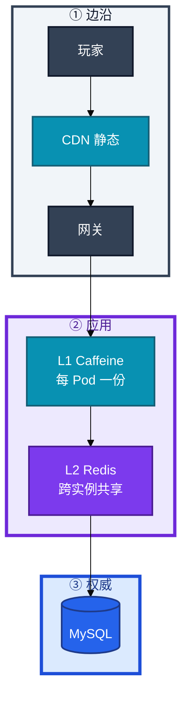
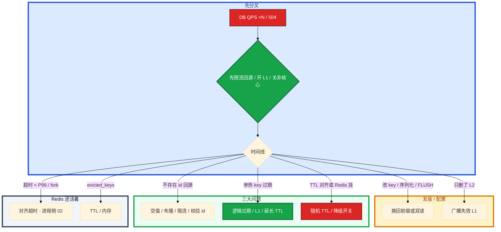

# 缓存架构


周五 20:00 限时礼包开卖。监控上 Redis `ping` 全绿、CPU 只有 30%，MySQL 连接数却在 3 分钟里从 200 飙到 2800，慢查询榜全是 `SELECT * FROM activity_config WHERE id=1`。群里有人喊「重启 mysqld」，另有人要把流量全部切直连 DB「先保证功能」——其实 Redis 还活着，是 **2000 个 Pod 同时 miss 同一行**，穿透/击穿/雪崩和预热没做对，DB 在替缓存扛枪。

**本章主线（排障就按这三步想）：**

1. **分层**：L1 → L2 Redis → MySQL 权威；降级开关在应用，不在 Redis 进程。
2. **归类**：DB ×N → 按接口命中率/回源；穿透/击穿/雪崩分开治；写后读旧 → 双写顺序或读主。
3. **留证**：按接口 hit/miss、超时次数、Canal 积压，不要只 `ping` Redis。

**读完你能：** 白板上画出 L1 / L2 / DB 和一次 Cache Aside；三大问题能分开治理；写后读旧能讲双写顺序和 Canal；道具 / 排行 / 会话不会用错一致性；Redis 挂了有开关而不是硬打 DB。

## 本章目录

- [1. 基本概念](#1-基本概念)
- [2. 架构图](#2-架构图)
- [3. 原理](#3-原理)
  - [3.1 Cache Aside 与 DB 双写](#31-cache-aside-与-db-双写)
  - [3.2 穿透、击穿、雪崩](#32-穿透击穿雪崩)
  - [3.3 道具、排行、会话怎么缓存](#33-道具排行会话怎么缓存)
- [4. 落地](#4-落地)
- [5. 核心配置](#5-核心配置)
- [6. 命令与操作](#6-命令与操作)
- [7. 生产排障](#7-生产排障)
- [8. 必会 · 常考](#8-必会--常考)
- [合上书](#合上书问自己)

**本章不讲：** fork、大 key、Cluster slot、ZSet 排行实现 → [02 Redis](../02-Redis/)；钱包权威、主从延迟读旧 → [01 MySQL](../01-MySQL/)；网关超时、499/504、限流桶 → [04 接入网关](../04-接入网关/)；活动压测、开服容量 → [08-05](../../08-游戏运维专题/05-活动高峰与压测/)；回档多存储对齐 → [08-07](../../08-游戏运维专题/07-玩家数据备份与回档/)。

---

## 1. 基本概念

缓存架构不是「装一个 Redis」，而是 **设计一层挡读放大、挂了不让 DB 死的结构**。SRE 盯缓存，盯的是：**这一层失效后，下一层 QPS 乘多少**——不是 Redis 绿不绿。

**值班里怎么认现象**（先听监控/研发怎么说，再对表）：

| 监控/群里说的 | 技术含义 | 你的第一刀 |
|---------------|----------|------------|
| 「Redis 全绿但 DB 爆了」 | 命中率掉 / 超时当 miss / 热 key 过期 | 按**接口**拆命中率，别 ping 结案 |
| 「活动一开就 504」 | 预热没做 / TTL 整点对齐 / 回源无限流 | 查时间线 + 回源 QPS vs DB 上限 |
| 「扫号把 DB 打满了」 | 穿透：不存在的 id 每次打 DB | 空值 + 限流 + id 校验，不是加 Redis |
| 「刚买道具打开还是旧的」 | 双写顺序错 / 读从库 / 只删了 L2 | 写路径顺序 + L1 是否失效 |
| 「Redis 挂了全站挂了」 | 没降级开关，全 miss 硬打 DB | 开关 → 限流 → 预热再放量 |

Redis 只是 L2 的一种实现。权威数据只在 DB。配置中心更适合当活动开关的短 TTL L1，不要所有开关都塞 Redis 再强行即时一致。

| 这一层 | 延迟 | 一致性 | 典型数据 |
|--------|------|--------|----------|
| CDN | 边沿 | 静态可脏很久 | 包体、公告图 |
| L1（Caffeine 等） | μs | 每 Pod 一份，**必然短暂不一致** | 活动配置、字典、极热只读 |
| L2 Redis | ms | 跨实例共享，仍可脏到 DEL/TTL | 会话、排行展示、背包缓存 |
| MySQL | ms～ | **权威** | 钱包、发货、道具数量 |

三个角色不要混：

| 角色 | 干什么 |
|------|--------|
| **缓存** | 挡读放大；允许按产品窗口变脏 |
| **DB** | 提交即权威；扣库存、发货、邮件已读 |
| **降级开关** | Redis 挂了限流读 DB 或返回降级数据；没有开关 = 定时炸弹 |

命中率怎么换算回源，用数字算一遍，不要凭感觉：

| 接口 QPS | 命中率 | 回源 | 若 DB 上限 3000 |
|----------|--------|------|-----------------|
| 20000 | 95% | 1000 | 活着 |
| 20000 | 70% | 6000 | **已经死了**（×6） |

连接池同样用乘法：`40 个逻辑服 × pool=50 = 2000`。K8s 滚动新旧各 40 个 Pod 就是 4000。超时 50ms、Redis P99 80ms 时，这些连接会同时把 miss 打到 DB。

**打个比方**：缓存像商场门口的促销员——大部分顾客（读请求）在门口就被拦住了，不用进仓库（DB）。促销员请假（Redis 挂）或传单过期（TTL 对齐），如果仓库没有限流门（降级开关），几万人同时涌进仓库，货架就塌了。

> **记住**：盯的是按接口的命中率和回源 QPS，不是 Redis `up`。全局命中率 99% 会骗人。超时当 miss 再打 DB，等于自己制造击穿。

**面试怎么说**：「我盯按接口命中率和回源 QPS，Redis 绿着 DB 爆了我先拆接口、查超时和 TTL，不会 ping 通就结案。」

---

## 2. 架构图

后面预热、降级、排障都对着这张图说话。



**读图三句话：**

1. **没有箭头规定 Redis 比 DB 更新。** 写路径默认先提交 DB 再 DEL L2；读 miss 才回填。
2. **L1 碰不到「只 DEL L2」。** 更新必须广播失效或等 L1 TTL，否则部分 Pod 继续卖已关活动。
3. **网关超时 < Redis P99** = 主动制造穿透。超时链见 04 章。

三种数据对一致性的要求不一样（装的时候选，挂的时候影响面不一样）：


会话走 L2 + TTL，对齐心跳；不是「再加一把 Redis 锁就当强一致」。排行展示走 Redis ZSet（02），发奖仍以 DB 为准。

---

## 3. 原理

### 3.1 Cache Aside 与 DB 双写

**一句话：** 读 miss 回填；写先提交 DB 再 DEL 缓存，不要写路径 SET 新对象。

**打个比方**：像图书馆借书——读的时候书架（缓存）没有就去书库（DB）拿一本复印放回去（SET TTL）；还书/换新版（写）必须先把书库记录改了（提交 DB），再把书架上的旧复印撕掉（DEL），下次有人来借才会拿新版。直接在书架上贴一张「新版摘要」（写路径 SET）容易贴错页。

**现场走一遍**（玩家打开背包，买了一件道具）：

1. **读路径**：应用执行 `GET bag:uid:10001`。
   - hit → 直接返回，DB 零压力。
   - miss → 查 DB → `SET bag:uid:10001 <json> EX 3600` → 返回。
   - DB 也没有 → `SET bag:uid:10001 "" EX 60`（空值短 TTL），防穿透。

2. **写路径**（买了一件道具）：
   - 开事务 → `INSERT/UPDATE` 道具行 → **提交**。
   - 提交成功后 → `DEL bag:uid:10001`。
   - DEL 失败 → 重试 / MQ / Canal 补偿。

3. 屏幕上的指标（Prometheus / 日志）：

```text
cache_hit{bag_list}=0.94  cache_miss=600/s  db_query{bag_list}=600/s
```

4. **做差读数**：接口 QPS 10000，命中率 94% → 回源 600/s，在 DB 上限内。若 miss 突然到 6000/s，先查是不是发版改了 key 前缀或 TTL 整点过期，不是先 explain DB。

5. **错路径演示**（先删再写）：


**输出解读**（三种写模式对比）：

| 模式 | 写路径 | 何时用 |
|------|--------|--------|
| Cache Aside | 应用写 DB，删缓存 | **默认** |
| Write Through | 同步写缓存和 DB | 少；延迟高 |
| Write Behind | 先缓存再异步刷 DB | 可丢数据，游戏钱包 / 背包 / 邮件**禁用** |

并发两条写：A 提交并 DEL，B 的读已经把 A 之前的行 SET 回去 → **延迟双删**（sleep > 回填 P99，再 DEL 一次）。sleep 必须压测，不是拍 500ms。延迟双删解决「并发读回填旧值」，**不解决删失败**——删失败必须 Canal 补偿。

CDC 删缓存：业务只写 DB，binlog → MQ → 删 key，适合多服务共享同一批缓存。代价是秒级窗口，Canal 自身要 HA；消费必须幂等（重复 DEL 无害）。Canal 挂了 = 脏窗口拉长到 TTL 全长。

强一致（余额、发货）：不缓存或写后读主；用版本号 / 唯一约束，而不是「再加一把 Redis 锁就当强一致」。

**面试怎么说**：「默认 Cache Aside：读 miss 回填，写先提交 DB 再 DEL，不在写路径 SET 新对象。并发回填旧值用延迟双删或 Canal；钱包不缓存或读主。」

> **记住**：双写的「一致」是窗口，把窗口说成「最多脏多久」，不要说「最终一致」三个字了事。

### 3.2 穿透、击穿、雪崩

**一句话：** 穿透是没有的 id；击穿是一个热 key 过期；雪崩是一片一起过期或 Redis 整体不可用——三样治理完全不同。

**打个比方**：穿透像有人反复问「有没有 999 号柜」（根本没有）；击穿像「1 号柜」传单刚好过期，所有人同时涌向仓库拿同一件货；雪崩像整栋商场传单同一秒过期，或者促销员集体请假，所有人同时进仓库。

**现场走一遍**（三个场景各走一遍）：

#### 场景 A：穿透 —— 扫号攻击

1. 攻击脚本：`GET player:uid:999999999`（从未注册的 uid），每秒 5000 次，key 各不相同。
2. 每个请求：L2 miss → MySQL `SELECT ... WHERE uid=999999999` miss → 再来。
3. 屏幕出现：

```text
redis keyspace_hits: 正常（key 各不相同，全局命中率甚至 97%）
mysql threads_connected: 2800 ↑   slow_query: SELECT player WHERE uid=...
```

4. **说明什么**：全局命中率在骗人——按**不存在 id 的回源次数**看。Redis 还活着，DB 在替缓存扛扫号。
5. **治理**：网关限流 + id 合法性校验（第一道）→ 空值短 TTL（第二道）→ 布隆过滤器（第三道）。空值 TTL 太长会挡住刚注册的新号；布隆说「不存在」一定没有，说「存在」可能误判，活动新 id 要重建。

#### 场景 B：击穿 —— 热 key 整点过期

1. `activity:config` 物理 TTL 3600s，19:00 SET，20:00 整点到期。2000 个大厅 Pod 同时 miss。
2. 2000 个并发 `SELECT * FROM activity_config WHERE id=1` 打同一行，InnoDB 行锁 / CPU 打满。
3. 屏幕出现：

```text
redis: up, cpu 30%
mysql: rows_read/s 暴增, 单行 SELECT 占满 slow log
单接口 cache_miss{activity_config}: 2000/s 瞬间尖刺
```

4. **说明什么**：Redis 进程健康，是**一个热 key** 过期引发击穿，不是 Redis 挂了。
5. **治理**：互斥锁 `SET lock:key NX EX 10`（获锁者回源，其他人短睡再 GET）——P99 会升高；极热用**逻辑过期**（key 不物理过期，value 内带 `expire_at`，过期后仍返回旧值并异步刷新）。singleflight 只挡单 Pod 内并发，2000 Pod 还要 L1 或逻辑过期。

#### 场景 C：雪崩 —— 活动预热 + TTL 对齐

1. 周五 19:00 预热打满 DB（限速不够）。所有活动 key TTL=3600，20:00 整点一起过期。
2. 20:00 新流量叠加过期 miss，回源限流按 Redis QPS 设了 5 万，DB 上限其实 3000。
3. 屏幕出现：

```text
20:00:00 cache_miss 全接口同时尖刺
db connections: 3000/3000  pool exhausted
gateway 504 比例 ↑
redis: 仍然 up
```

4. **说明什么**：TTL 对齐 + 回源阈值设错 = 雪崩。更致命的是 Redis 进程挂了 / 网络分区，全部 miss 同时打 DB。
5. **治理**：TTL `base + rand` 错开整点；哨兵 / Cluster HA；应用降级开关「丢缓存 + 限流读 DB」；非核心接口直接失败。fork 尖刺导致超时、应用把超时当 miss，表现也是雪崩（见 02 章）。

**输出解读**（三大问题对照表）：

| | 是什么 | 不是什么 | 治理 |
|--|--------|----------|------|
| 穿透 | 查询根本不存在的 id，缓存和 DB 都没有 | 热 key | 空值短 TTL、布隆、网关限流、校验 id 空间 |
| 击穿 | **一个**热点刚好过期，并发 miss | 大量 key 一起过期 | 互斥重建、逻辑过期、热点永驻 + 后台刷 |
| 雪崩 | 大量 TTL 对齐，**或 Redis 整体不可用** | 单 key | TTL + random、多级缓存、限流、熔断、预热、HA |

**面试怎么说**：「穿透看不存在 id 回源，击穿是一个热 key 过期，雪崩是整片过期或 Redis 挂了。穿透限流+空值，击穿逻辑过期或 L1，雪崩随机 TTL+降级开关。三者治理不能混。」

> **记住**：进程挂比 TTL 对齐更致命。HA 解决切主，解决不了「应用把超时当 miss」。

### 3.3 道具、排行、会话怎么缓存

**一句话：** 库存扣减不打缓存；排行展示可脏；会话可丢重登——装错层挂的时候影响面完全不同。

**打个比方**：道具数量像银行余额——柜台（DB）才是权威，门口电子屏（缓存）可以慢几秒；排行像体育频道积分榜——晚更新几秒观众能接受，但发奖金仍看官方账本；会话像游乐园手环——丢了重新领一张，不能当唯一身份证。

**现场走一遍**（三类数据各举一个值班场景）：

1. **道具 / 背包**（Cache Aside）：
   - 玩家刚用钻石买了一件皮肤，立刻打开背包还是旧的。
   - 查：写路径是不是先 DEL 再写 DB？是不是读从库？是不是只删了 L2、L1 还在吐旧配置？
   - 修法：先提交 DB 再 DEL；刚买读主；广播失效 L1。

2. **排行 Top N**（Redis ZSet，02 章）：
   - 展示榜可以脏几秒；**发奖必须以 DB 为准**。
   - Redis 挂了：从 DB 重算或关排行降级，不要硬读 DB 实时算榜。

3. **会话**（L2 + TTL ≈ 心跳）：
   - 可丢，踢回登录。不要当无降级唯一库——摘 Redis 会把登录打成风暴，降级档里留「踢回登录」。

4. **活动配置**（L1 + 逻辑过期）：
   - 关活动后部分 Pod 还在卖 → 只删 L2 不够，必须广播删 L1 或等 L1 TTL（5～30s）。
   - 发版改序列化，L1 旧对象反序列化失败 → 被当成 miss 打满 Redis → 换 key 前缀 `v2:` 或广播失效。

**输出解读**（选型表）：

| 数据 | 放哪 | 一致性 | 挂了怎么办 |
|------|------|--------|------------|
| 道具数量 / 交易 | DB 权威；L2 可缓存展示 | 写后 DEL；刚买读主 | 回源；禁止 Write Behind |
| 背包列表 | L2 Cache Aside | 可脏到补偿完成 | 回源；空值防扫号 |
| 排行 Top N | Redis ZSet（02） | 展示可脏；发奖看 DB | 从 DB 重算；关排行降级 |
| 会话 | L2 + TTL≈心跳 | 可丢，重登 | 踢回登录 |
| 活动配置 | L1 + 逻辑过期 | 可脏数十秒 | 广播失效 L1；后台刷要告警 |

Key 规范：`业务:模块:实体:id`。Cluster 热实体用 hash tag 要谨慎，tag 过粗会变成单 slot 热点（02）。除明确永驻的配置，**必须有 TTL**。发布改序列化换前缀，禁止 `FLUSHALL` 当发布步骤。

热点 SKU 预热的是商品详情，不是库存数字当权威——库存这一行不要指望缓存帮写，扣库存必须打 DB 当前读或乐观锁（01）。

**面试怎么说**：「钱包不缓存或读主；背包 Cache Aside 写后 DEL；排行展示可脏发奖看 DB；会话可丢。L1 多副本必然短暂不一致，关活动要广播失效。」

> **别混**：L1 脏（每 Pod 一份）vs L2 脏（DEL 窗口）；Redis 进程故障（02）vs 缓存用法故障（本章）。

---

## 4. 落地

这里的「装」不是装 Redis 进程（02），是把缓存层焊进发布和值班。

### 4.1 生产怎么选

| 项 | 选 | 不选 |
|----|----|------|
| 默认写路径 | Cache Aside：提交 DB 再 DEL | 先删再写；写路径 SET 新对象 |
| 钱包 / 发货 | 不缓存或读主 | Write Behind；Redis 当账本 |
| L1 | 配置、字典、极热只读；TTL 5～30s | 所有开关塞 L1 还要求即时一致 |
| 回源限流 | 阈值 = **DB 压测上限** | 按 Redis QPS 设 |
| 超时 | 应用超时 **> Redis P99** 留余量 | 网关 50ms、Redis P99 80ms |
| 降级 | 开关在值班手册，摘过 Redis | 只写 runbook 从没演练 |
| 连接 | `实例 × 池` < `maxclients`，滚动按翻倍算 | 池无上限 |

托管 Redis：进程 HA 是厂商的，**回源放大和降级开关仍是你的**。

### 4.2 落地你实际看到什么

| 产物 | 内容 |
|------|------|
| 热点列表 | 活动商品 id、登录服、公告 key；预热用它，不用 `KEYS` |
| 降级档位 | 关 L2 / 关排行 / 只保登录支付 |
| Canal 或延迟双删 | 多服务共享缓存要 HA + 积压告警 |
| 按接口命中率 | 登录 / 支付 / 活动拆开，禁止只钉全局 |
| key 前缀版本 | `v2:`；发版双读或换前缀 |

验收：压测能把回源打到 DB 上限并被限流拦住；演练摘 Redis 看到的是降级而不是全站 504。不要只 ping Redis。

---

## 5. 核心配置

只动有证据的项。改 TTL 和超时要能说出回源乘多少。

| 项 | 生产怎么用 | 改错会怎样 |
|----|------------|------------|
| 应用读超时 | > Redis 正常 P99，且 < 网关超时 | 太短假 miss；太长占满连接池 |
| L2 TTL | `base + rand`；热点逻辑过期 | 整点对齐 = 雪崩 |
| 空值 TTL | 短；配限流 + id 校验 | 太长挡新号；太短防不住扫号 |
| L1 TTL | 配置 5～30s | 1s 读放大回 L2；太长关活动还在卖 |
| 连接池 | 有上限；滚动翻倍可活 | 打满 Redis + 打满 DB |
| 回源限流 | DB 压测上限 | 按 Redis QPS 设 → DB 先死 |
| Canal 消费并发 | 幂等 DEL；积压告警 | Canal 挂了窗口变 TTL 全长 |

最小闭环示例（应用侧伪配置）：

```yaml
cache:
  redis_timeout_ms: 120        # > Redis P99 80ms
  l2_ttl_base_s: 3600
  l2_ttl_jitter_s: 600         # base + rand(0,600)，错开整点
  empty_value_ttl_s: 60        # 穿透空值，必须短
  l1_ttl_s: 15                 # 活动配置
  fallback_enabled: true       # Redis 挂了走降级，不是硬打 DB
  backsource_limit_qps: 3000   # = DB 压测上限，不是 Redis QPS
```

> **记住**：回源限流阈值用 DB 压测上限，不用 Redis QPS。缓存超时 < Redis P99 → 自己制造击穿，先对齐超时再调容量。

---

## 6. 命令与操作

值班先看**应用指标**，再看 Redis。只看 `redis-cli ping` 会结案错。

### 6.1 命令速查

```bash
# Redis 侧（进程问题仍走 02）
redis-cli info stats          # keyspace_hits / keyspace_misses
redis-cli info persistence    # latest_fork_usec
redis-cli info memory         # evicted_keys, used_memory
redis-cli --latency-history -i 1   # P99 尖刺
```

**输出解读**（`info stats` 片段）：

```text
keyspace_hits:2847593
keyspace_misses:152847
```

命中率 = hits / (hits + misses) = 2847593 / 3000440 ≈ **94.9%**。但这是**全局**——支付接口可能只有 60%。必须按接口拆，不要拿全局 94.9% 说「缓存没问题」。

应用侧（日志 / Prometheus 按接口）：

| 目的 | 看什么 | 正常 / 异常 |
|------|--------|-------------|
| 命中 | 登录 / 支付 / 活动 **各自** hit 比 | 活动接口 miss 尖刺 = 击穿或预热漏了 |
| 回源 | 回源 QPS vs DB QPS vs DB 连接 | > 0.7× DB 上限 = P0 |
| 超时 | 应用 timeout 次数 vs Redis P99 | timeout 涨、Redis 绿 = 假 miss |
| 空值 | 不存在 id 的回源次数 | 涨 = 穿透 |
| Canal | MQ 积压、消费延迟 | 持续涨 = 补偿停了 |
| 降级 | 开关是否已打开、哪一档 | 摘 Redis 后仍硬打 DB = 没开关 |

指标告警：

| 指标 | 阈值 | 级别 |
|------|------|------|
| 单接口命中率骤降 | 活动/发版后 1～5 分钟 | **P0/P1** |
| 回源 QPS 接近 DB 上限 | > 0.7× | P0 |
| Redis 超时被当 miss | 与 fork/P99 对齐 | P0 |
| `evicted_keys` + 命中掉 | 持续 | P1 |
| Canal 积压 | 持续涨 | P1（补偿停了） |
| Redis `up` 但 DB ×5 | — | 按本章分流，不是先 explain DB |

### 6.2 活动预热

**什么时候用**：大活动 / 开服 / Redis 恢复后放量前。禁止 `KEYS activity*`（02 会卡住 Redis）。

**现场走一遍**：

1. 活动前 30 分钟，用**业务热点列表**（不是 KEYS 扫库）：

```bash
# 伪脚本：限速预热，每批 100 key，间隔 50ms
while read key; do
  redis-cli GET "$key" >/dev/null || curl -s "http://app/internal/warm?key=$key"
  sleep 0.05
done < /ops/hotkeys_activity_20250828.txt
```

2. 19:55 看指标：

```text
cache_hit{activity}=0.96   backsource_qps=200   db_conn=180/3000
```

3. **正常**：命中率已升，回源在 DB 上限内。活动开始 1 分钟继续盯——不升就是列表错了或 key 前缀发版改了。

4. **异常**：19:00 预热不限速打满 DB，和没预热一样——限速 + 热点进 L1 + 逻辑过期，不要整点物理过期。

预热 checklist：热点列表是否打完 · TTL 是否错开 · 回源限流是否已开 · 降级开关是否在值班人手里。

### 6.3 发版换 key 版本

改序列化必须双读或换前缀 `v2`。禁止 `FLUSHALL` 当发布步骤。

发版后 5 分钟看按接口命中率曲线，比等告警打到 DB 更早。L1 旧对象反序列化失败会被当成 miss 打满 Redis——配置结构变了必须失效 L1（广播或换版本）。

代码回滚必须能认旧 key 或双读。只回代码不换回前缀，会继续全 miss。L1 清一次（重启 Pod 或广播）。

### 6.4 Redis 挂了

没有开关就硬打 DB，会全站 504。顺序不能反。


六步口述：① 确认范围（整集群还是一个分片）② 开关切「限流直连 DB 或返回降级数据」③ 保登录和支付；非核心直接失败 ④ 恢复 Redis（进程侧 02）⑤ **预热**再放量 ⑥ 看命中率和 DB QPS。

降级档位：① 关 L2，L1 + 限流读 DB ② 非核心接口直接失败（排行、推荐）③ 只保登录和支付。

预热在放量前：冷启动全 miss，恢复瞬间第二次雪崩。演练时真的把 Redis 摘掉，看 DB 连接和 5xx。

### 6.5 删缓存补偿 Canal

多服务共享玩家缓存：业务只写 DB，Canal → MQ → DEL。重复 DEL 无害，消费必须幂等。Canal / MQ 要 HA，积压当 P1。

延迟双删：写 DB → DEL → sleep（> 回填 P99）→ 再 DEL。不解决删失败。sleep 拍 500ms 不算。

### 6.6 升级与回滚

客户端库、序列化、Redis 大版本分开窗口。序列化升级 = 换 key 版本。Redis 进程升级走 02（先副本、有 RDB）。缓存层升级失败先靠降级开关，不要先 FLUSH。

合服 / 回档时 Redis 与 MySQL 位点必须一起定（08-07）。只预热一半 key，放量后会第二次全 miss。

### 6.7 扩容与容量

- 回源打满：先限流、开 L1、延长热点 TTL，再加 DB 读（刚写读主的接口不要上从，01）
- Redis 内存：`evicted_keys` 先 TTL / 拆大 key（02），再扩
- 热 key：先 L1，再拆 key，不是加 Cluster 节点
- 连接：滚动并行 + 池上限
- 命中率从 95%→70% 按乘法算 DB 死不死，不要凭感觉加机器

水位：回源 0.7× DB 上限告警。

日志信号：反序列化失败刷屏 = 发版改结构没换 key 版本；空值挡登录 = 空值 TTL 太长；`FLUSHALL` 出现在发布脚本 = 事故。

---

## 7. 生产排障

DB 爆了先限流再查 Redis 死没死——顺序反了会在已经死的 DB 上做 explain。

**Redis 进程还活着、DB ×5 是本章的主场景。** 三问：哪一接口 miss？超时是不是被当 miss？下一层乘了多少？



| 现象 | 先做什么 | 不要做什么 |
|------|----------|------------|
| 全局命中 97%、支付在烧 | 按接口拆 | 只钉全局命中率 |
| 发版后全 miss | key 前缀 / 序列化 | 先 explain 已死的 DB |
| 扫号 DB 爆、命中率不跌 | 空值 + 限流 + 校验 id | 当雪崩去加 Redis |
| 整点一起过期 | 随机 TTL、逻辑过期 | 重启 Redis |
| Redis 挂了 | 降级开关 → 预热再放量 | 硬切全部直连 DB |
| 关活动还有 Pod 在卖 | 广播 L1 | 只 DEL L2 |
| 超时 50ms / P99 80ms | 对齐超时 | 先加 Redis CPU |
| 写后读旧 | 先写再删；延迟双删 / Canal | 写路径 SET 覆盖 |

**一次真实形状**：周五 20:00 礼包，TTL 全 3600，19:00 预热打满。20:00 整点过期叠新流量，回源按 Redis QPS 设了 5 万，DB 上限其实 3000。Redis 还活着，支付和登录一起 504。止血不是重启 Redis，是限流回源、打开 L1、关排行，再把热点 TTL 拉长。事后回源阈值改成 DB 上限，TTL 加随机，配置改逻辑过期。

fork 尖刺、淘汰热数据、序列化变更、穿透攻击，都会表现为「Redis 进程还活着、DB ×5」——现场顺序：时间线（发布 / 活动 / flush / 切主）→ 按接口命中率与超时 → Redis 延迟 / fork / 大 key / evict（02）→ DB 是否被回源打死。

---

## 8. 必会 · 常考

白板和追问高频，能一口回：

| 说法 | 对错 | 口径 |
|------|:----:|------|
| Redis `up` 说明缓存层没问题 | 错 | 盯接口命中率和回源 |
| 全局命中率 99% 支付就不会慢 | 错 | 公告会抬高全局 |
| 写路径 SET 新对象比 DEL 更一致 | 错 | 并发旧值盖新值 |
| 先删缓存再写 DB 空窗更短所以更好 | 错 | 并发读回填旧行，脏更久 |
| 延迟双删能替代删失败补偿 | 错 | 不解决删失败 |
| Redis 锁 = 和 DB 强一致 | 错 | 不缓存或读主 + 唯一约束 |
| Write Behind 背包也能用 | 错 | 能丢；钱包/背包/邮件禁用 |
| 穿透 = 热 key 过期 | 错 | 穿透是根本没有的 id |
| 击穿 = Redis 挂了 | 错 | 击穿是一个热 key；挂了是雪崩 |
| 互斥锁重建没有副作用 | 错 | P99 升高；极热用逻辑过期 |
| 回源限流按 Redis QPS | 错 | 按 DB 压测上限 |
| 预热用 `KEYS` 扫库 | 错 | 热点列表 + 限速 |
| Redis 恢复后立刻放量 | 错 | 先预热否则二次雪崩 |
| 只删 L2，L1 会一起新 | 错 | 要广播或等 L1 TTL |
| 空值 TTL 越长越防扫号 | 错 | 挡新号；空值还能打满 Redis |
| 超时 50ms 能让接口更快 | 错 | P99 80ms 时自己制造击穿 |
| 上了 Cluster 就没有三大问题 | 错 | HA ≠ 怎么用缓存 |

数字：命中 95%→70% 回源 **×6**；L1 **5～30s**；空值必须短；回源告警 **0.7× DB 上限**；发版后看曲线 **5 分钟**；活动开始盯 **1 分钟**。

易混：穿透 vs 击穿 vs 雪崩；先写再删 vs 先删再写；延迟双删 vs Canal vs 强一致；L1 脏 vs L2 脏；Redis 进程故障（02）vs 缓存用法故障（本章）；超时当 miss vs 真 miss。

---

## 合上书，问自己

1. 这一层失效，下一层 QPS 怎么乘？谁是权威？
2. Cache Aside 读写顺序？为什么写是 DEL 不是 SET？先删再写为什么更脏？
3. 穿透 / 击穿 / 雪崩各两套治理？空值太长会怎样？
4. 道具 / 排行 / 会话各允许多脏？库存能不能靠缓存扣？
5. Redis 挂了六步是哪六步？为什么恢复后要先预热？
6. 全局命中率 99% 为什么不够？超时 < P99 算哪一种事故？

六题都能口述，这一章就过了。下一章把接入网关剖开：超时链怎样把 Redis 慢放大成 504。
