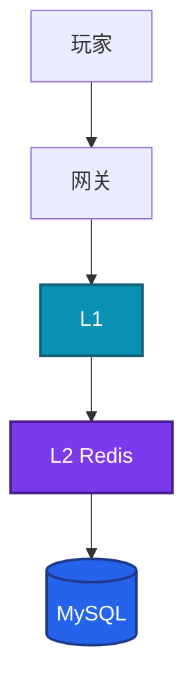
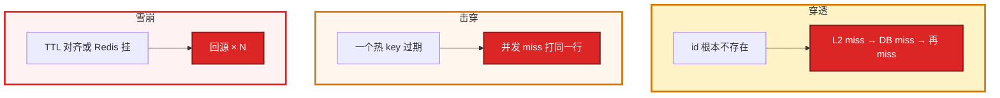

# 03｜缓存架构 · 练习题

先自己画图或口述，再对照解答。每题标了覆盖范围：

| 标记 | 含义 |
|------|------|
| **核心** | 不懂整章就没建立起来 |
| **必会** | 值班和面试都要能讲 |
| **常用** | 线上会反复碰到 |
| **常考** | 白板和追问的高频口径 |

Redis 进程 / fork / 大 key 见 02。本章偏怎么用缓存、怎么不让 DB 死。

## 本题目录

- [Q1 L1 / L2 / DB 架构](#q1)
- [Q2 Cache Aside 与双写](#q2)
- [Q3 穿透 / 击穿 / 雪崩](#q3)
- [Q4 DB ×5 Redis 还活着](#q4)
- [Q5 延迟双删 / Canal / 强一致](#q5)
- [Q6 活动预热](#q6)
- [Q7 Redis 挂了 SOP](#q7)
- [Q8 道具 / 排行 / 会话](#q8)
- [Q9 命中率 / 支付慢](#q9)
- [Q10 空值 / 布隆](#q10)
- [Q11 超时当 miss](#q11)
- [Q12 只删 L2 / 排障分流](#q12)
- [合上书](#合上书)

---

## Q1

**★★★★★｜缓存层怎么画？这一层失效下一层乘多少？**

**覆盖**：核心 · 必会 · 常考

### 场景

白板：「画从玩家到 DB。Redis ping 通为什么还不能结案？」有人开始背 LRU。

### 完整解答

盯的是命中率和回源 QPS，不是 Redis `up`。权威在 MySQL。

接口 QPS 20000、命中 95% → 回源 1000；命中 70% → 回源 6000（×6）。DB 上限 3000 时已经死。连接池：`实例 × 池`，滚动按翻倍算。超时必须 **> Redis P99**。L1 每 Pod 一份，必然短暂不一致。

### 再追问

全局命中率 99%？——公告会抬高。必须按登录 / 支付 / 活动拆。托管 Redis 能跳过本章吗？——不能。回源放大和降级开关仍是你的。

---

## Q2

**★★★★★｜Cache Aside 读写标准流程？为什么写是删缓存不是更新？**

**覆盖**：核心 · 必会 · 常考

### 场景

商城改完价格，有人在写路径里 `SET` 新对象进 Redis。并发两条更新，线上价格来回跳。另一派主张先删缓存再写 DB，「空窗短一点」。

### 完整解答

读：GET → miss 则查 DB 再 SET TTL。写：先提交 DB，再 DEL。回填只发生在读路径。DB 是权威。

并发更新缓存容易旧值盖新值；部分字段 SET 容易和 DB 不一致。删失败用重试或 binlog 补偿。

先删再写：DEL → 写 DB 未提交 → 并发读 miss → 旧行被 SET 回去，脏得更久。生产默认先写再删。关键路径写后读主（余额、发货）。

Write Through 少用（延迟高）。Write Behind 能丢，钱包 / 背包 / 邮件禁用。

### 再追问

先删再写呢？——空窗里读会把旧行回填。延迟双删解决的是回填旧值，不是这个空窗的首选方案。把窗口说成「最多脏多久」，不要只说最终一致。

---

## Q3

**★★★★★｜穿透、击穿、雪崩各是什么？各给两套治理。**

**覆盖**：核心 · 必会 · 常考

### 场景

开场就问「缓存三大问题」。有人把 Redis 挂了说成击穿，把扫号说成雪崩。要求三个都答到，并画出回源路径。

### 完整解答

必须分清「几个 key、缓存里有没有过、DB 有没有」。

| | 治理（至少两套） |
|--|------------------|
| 穿透 | 空值短 TTL；布隆；网关限流；校验 id 空间 |
| 击穿 | 互斥锁重建；逻辑过期（返回旧值异步刷）；热点永驻 |
| 雪崩 | TTL + random；HA；限流降级；预热；非核心熔断 |

观测：回源 QPS、DB QPS、是否单 key、Redis `up`。止血：限流回源、延长热点 TTL、打开 L1、非核心降级。互斥锁副作用：P99 升高。极热用逻辑过期。singleflight 只挡一 Pod 内，挡不住 2000 Pod。

### 再追问

上了 Cluster 就没有三大问题？——否。HA ≠ 怎么用缓存。哨兵解决切主，解决不了超时当 miss。

---

## Q4

**★★★★★｜线上 DB QPS 突然 ×5，Redis 进程还活着，怎么查？**

**覆盖**：核心 · 必会 · 常用

### 场景

活动开始 2 分钟，MySQL 连接打满。Redis `ping` 通，CPU 不高。全局命中率还显示 97%。刚发过一版，改了序列化。

### 完整解答

Redis alive 不等于命中率正常。全局 97% 会掩盖单个接口全 miss。**先限流回源 / 开 L1 / 关非核心**，再对齐时间线：发布 / 活动 / flush / 切主。

发版改 key 前缀 / 序列化 → 新代码 GET 全 miss → 回源 ×5。也可能：fork 超时被当 miss、evict 热数据、扫号穿透。

按接口看 miss。看超时是否 < Redis P99。看 `keyspace_hits/misses`、`latest_fork_usec`、`evicted_keys`、慢 SQL。禁止 `FLUSHALL` 当发布步骤。发版改序列化换 key 版本。

### 再追问

fork 和 miss 有什么关系？——父进程卡住超时，应用当 miss 打 DB，表现为雪崩。Redis 进程还活着。先 explain 已死的 DB？——顺序反了。

---

## Q5

**★★★★☆｜延迟双删和 Canal 各解决什么？强一致怎么办？**

**覆盖**：必会 · 常用 · 常考

### 场景

写后立刻读偶发旧值。有人 sleep 500ms 再删一次。另一边多个服务共享玩家缓存，想接 Canal。支付同学问「锁一下是不是就强一致了」。

### 完整解答

延迟双删：sleep 后再删一次，清掉并发回填的旧值。sleep 必须大于「miss → 查库 → SET」的 P99，压测得出，不是拍 500ms。写路径被拉长。它**不解决删失败**。

Canal：业务只写 DB，binlog 异步删，适合多服务共享缓存。秒级窗口；Canal 要 HA；消费幂等（重复 DEL 无害）。Canal 挂了要有积压告警。

强一致：不缓存或写后读主 + 唯一约束，不要指望 Redis 锁当事务。

### 再追问

sleep 500ms 行不行？——必须大于回填 P99。删失败仍要补偿。Canal 绿着 Redis 也绿着就可以不管积压？——否。补偿停了窗口变 TTL 全长。

---

## Q6

**★★★★★｜活动高峰缓存怎么准备？预热为什么不能扫库？**

**覆盖**：必会 · 常用 · 常考

### 场景

周五 20:00 限时礼包。有人计划 19:50 `KEYS activity*` 预热。TTL 全是 3600，整点过期。回源限流按 Redis 能扛的 QPS 设的。降级开关还在需求文档里。

### 完整解答

发布前：① 用热点商品 id 列表批量 GET，miss 再回源 SET（**限速**）② TTL = `base + rand`，热点配置逻辑过期 ③ 热点进 L1 ④ 回源限流 = **DB 压测上限** ⑤ 降级开关在值班人手里，演练过摘 Redis。

禁止预热时无限速打 DB。`KEYS` 会卡住 Redis（02）。活动开始 1 分钟盯回源和 DB 连接。命中率掉先问「是不是发版改了 key」。

库存预热的是商品详情，不是库存数字当权威。扣库存打 DB。

### 再追问

本地缓存多副本不一致？——TTL 短或发失效消息。不要假设立刻一致。只删 L2，L1 会继续吐旧值。

---

## Q7

**★★★★☆｜Redis 挂了完整止血 SOP？为什么恢复后要先预热？**

**覆盖**：必会 · 常用

### 场景

Cluster 多数派丢了。DB 连接已经在涨。群里有人要立刻把所有流量切直连 DB，「先保证功能」。

### 完整解答

没有开关就硬打 DB，会全站 504。顺序不能反：确认范围 → 开关限流直连 DB 或降级数据 → 保登录/支付，关排行 → 恢复 Redis → **预热**热点列表（限速）→ 放量，盯命中率和 DB QPS。

预热在放量前：冷启动全 miss，恢复瞬间第二次雪崩。演练时真摘 Redis，不要只写 runbook。档位预先写进值班手册。

### 再追问

预热为什么要在放量前？——冷启动全 miss，恢复瞬间第二次雪崩。只保登录支付够不够？——活动期排行可关；支付不能 Write Behind 顶。

---

## Q8

**★★★★☆｜道具、排行榜、会话分别怎么缓存？**

**覆盖**：必会 · 常考

### 场景

有人要把扣钻改成先写 Redis 再异步刷 DB。排行发奖以 ZSet 为准。会话只放 Redis 且没有降级。背包写完立刻走从库读（01）又走 L2。

### 完整解答

| 数据 | 做法 |
|------|------|
| 道具数量 / 扣减 | DB 权威；L2 只缓存展示；写后 DEL；刚买读主 |
| 排行 | Redis ZSet 展示（02）；发奖流水在 MySQL；挂了关排行或 DB 重算 |
| 会话 | L2 + TTL≈心跳；挂了踢回登录，不要当无降级唯一库 |
| 库存写 | 不靠缓存挡 `UPDATE stock` |

Write Behind 仅可丢计数展示，且要对账。拿在线人数做发奖门槛，丢了就是事故。Cache Aside 才是默认。

### 再追问

支付该不该碰 Redis？——余额、发货状态：不缓存或写后读主。订单详情展示可以短 TTL。不要一刀切「支付不能碰 Redis」。

---

## Q9

**★★★★☆｜命中率 99% 为什么支付接口还慢？**

**覆盖**：必会 · 常用

### 场景

大盘缓存命中率 99.2%，支付 P99 800ms。公告和皮肤预览 QPS 占了 90% 读。支付短 TTL，有的路径根本没走缓存。

### 完整解答

全局命中率被读多的公告接口抬高。必须按接口 / 业务线拆。支付可能根本不该走缓存，或短 TTL 命中率低是正常的，慢在 DB / 下游。

告警不要只钉全局命中率。登录、支付、活动回源 QPS 分开。钱包走缓存还用 Write Behind，是另一条红线。发版后 5 分钟看曲线。

### 再追问

支付该不该缓存？——余额、发货状态不缓存或读主。订单详情展示可以短 TTL。

---

## Q10

**★★★☆☆｜空值缓存的坑？布隆在活动期能不能开？Write Behind 呢？**

**覆盖**：常用 · 常考

### 场景

防扫号上了空值 TTL=10 分钟。新注册玩家立刻登录，提示角色不存在。活动新道具 id 还没进布隆，商城全 404。另有人要把点赞和背包都改 Write Behind。

### 完整解答

TTL 太长会挡住刚插入的合法数据；太短防不住扫号。扫号还能用空值打满 Redis，必须限流 + 校验 id。网关是第一道，空值第二道，布隆第三道。

布隆：说不存在一定没有；说存在可能误判。活动新 id 还没进过滤器会被当成不存在。先写 DB 再加过滤器，或活动期关闭布隆只靠空值。活动结束 id 空间变化要重建。

Write Behind：钱包、背包、邮件禁用。在线人数展示可以，发奖门槛不行。

### 再追问

空值 key 把 Redis 打满？——短 TTL 空值 × 扫号 QPS。先限流，不是先加 Redis 内存。

---

## Q11

**★★★☆☆｜超时 50ms、Redis P99 80ms，这算哪一种事故？**

**覆盖**：常用 · 常考

### 场景

网关把下游超时设成 50ms。Redis 正常 P99 是 80ms，fork 时到 200ms。DB QPS 跟 Redis 延迟一起抖。

### 完整解答

自己制造击穿 / 雪崩。超时当 miss 再打 DB，等于把 Redis 的每一次慢，放大成一次回源。fork 尖刺时变成真雪崩。

先对齐超时：应用 > 网关读超时之前，还要 **大于 Redis 正常 P99 并留余量**。再谈容量。连接池耗尽同样表现为 Redis 指标还好、应用大量 timeout。超时过长会让慢请求占满连接池。和网关 504 同一逻辑，见 04。治本仍是 fork、大 key、热 key（02）。

### 再追问

调大超时是不是就好了？——对齐是前提。治本仍在进程侧和热 key。超时过长故障放大。

---

## Q12

**★★★☆☆｜只删了 L2，部分 Pod 还在吐旧活动开关？给出现象你先走哪条？**

**覆盖**：必会 · 常用

### 场景

运营关了活动。DB 和 Redis 都更新了。大约三分之一的逻辑服还在卖。另四个工单：① 扫号 DB 爆命中率不跌 ② 整点过期 ③ Redis 挂了有人要直连 DB ④ 发版全 miss。

### 完整解答

L1 每 Pod 一份，只删 L2 不会碰到它。更新路径必须是 DB → 删 L2 → 广播删 L1（或等 L1 TTL）。发版改结构要换 key 版本（`v2`）。配置类 5～30s 是常见折中；L1 TTL 改成 1 秒会把读放大送回 L2。开关类走配置中心。

| # | 走哪条 | 不要做 |
|---|--------|--------|
| ① | 穿透：空值+限流+校验 id | 当雪崩加 Redis |
| ② | 随机 TTL / 逻辑过期 | 重启 Redis |
| ③ | 降级开关 → 预热再放量 | 硬切全部直连 DB |
| ④ | key 版本 / 序列化 | 先 explain 已死 DB |

现场：先限流 → 时间线 → 按接口命中 → Redis P99/fork/evict → 再动 DB。

### 再追问

L1 TTL 改成 1 秒行不行？——读放大会回到 L2，热 key 问题回来。配置类 5～30s。要即时，发失效，不要幻想 L1 强一致。

---

## 合上书

- [ ] 能画出 L1 / L2 / DB，并用乘法算出命中率掉了 DB 死不死
- [ ] 能讲 Cache Aside：读 miss 回填，写先提交再 DEL；先删再写为什么更脏
- [ ] 能分开穿透 / 击穿 / 雪崩，各两套治理；空值太长挡新号
- [ ] 能讲道具 / 排行 / 会话各自允许多脏，库存不靠缓存扣
- [ ] 能走 Redis 挂了六步，并说明恢复后先预热
- [ ] 能用延迟双删 / Canal / 读主三种窗口谈一致性，不把锁当强一致
- [ ] 能用分流图处理「Redis 还活着、DB ×5」，而不是先 explain
