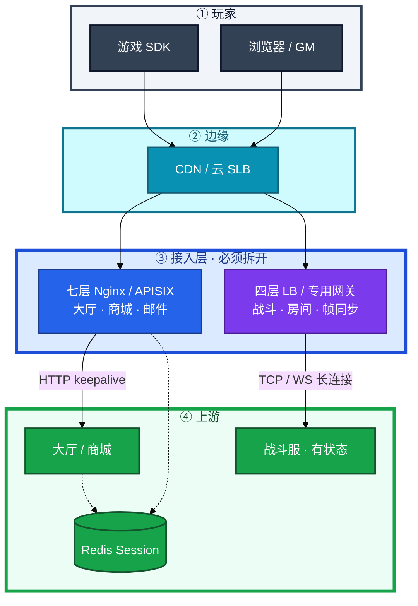
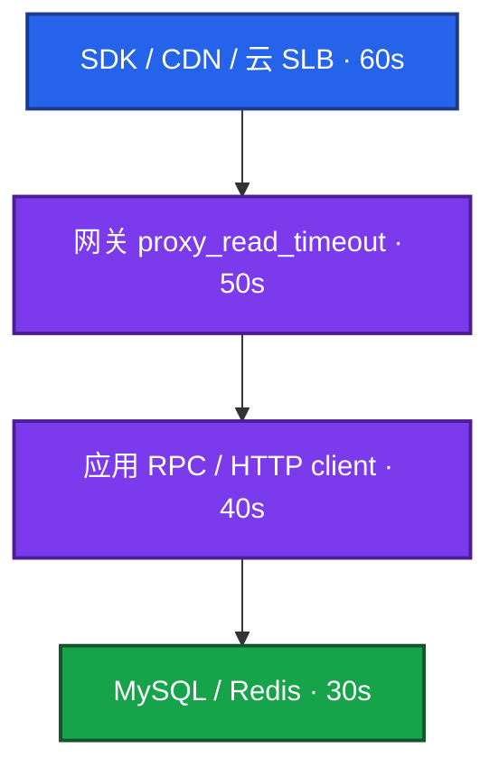
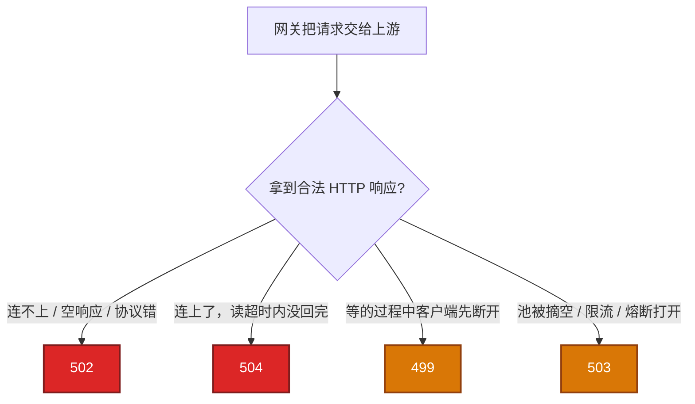
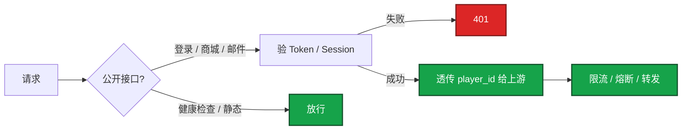
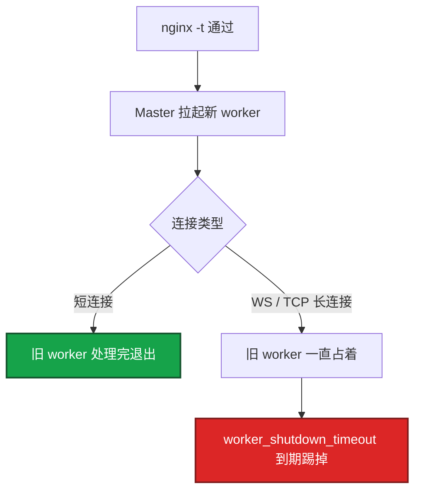
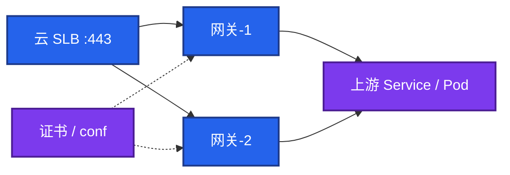
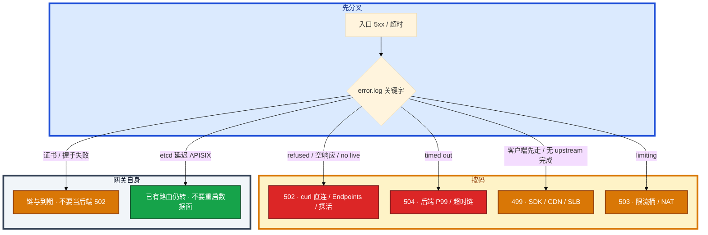

# 接入网关


活动整点，满屏 502 / 504 / 499。有人重启逻辑服，有人把 `proxy_read_timeout` 加到 120s，另有人要对战斗 WebSocket 做一次 `nginx -s reload`。

先别动手。这一章后半全是你会动手的：**怎么对超时链、怎么分码、怎么限流熔断灰度、怎么改路由不踢长连接、证书和扩容怎么滚。** 前面的概念和原理，是为了让你动手时不选错路。

**读完你能：** 白板上画出玩家到 DB 每一跳谁先放弃；看见 499/502/504/503 能分路；鉴权、限流、熔断、灰度能讲清挂在哪一层；战斗长连接不进默认七层；会 reload / 热配、扩容、升级回滚。

## 本章目录

缩进 = 上下级。3 下面才是 3.1。

想钉在**正文左边**跟着滚：菜单 **查看 → 打开视图 → 大纲**。Markdown 预览做不到独立左栏，目录只能写在文章开头。

- [1. 基本概念](#1-基本概念)
- [2. 架构图](#2-架构图)
- [3. 原理](#3-原理)
  - [3.1 超时链](#31-超时链谁先放弃)
  - [3.2 状态码](#32-状态码499--502--504--503)
  - [3.3 鉴权](#33-鉴权网关验票后端验权)
  - [3.4 限流](#34-限流漏桶令牌桶按谁限)
  - [3.5 熔断](#35-熔断失败才停送不是超时本身)
  - [3.6 灰度](#36-灰度权重--uid-hash--header)
  - [3.7 长连接与 reload](#37-长连接与-reload)
- [4. 安装部署](#4-安装部署)
  - [4.1 生产怎么选](#41-生产怎么选)
  - [4.2 落地你实际看到什么](#42-落地你实际看到什么)
- [5. 核心配置](#5-核心配置)
- [6. 常用命令](#6-常用命令)
- [7. 常用操作](#7-常用操作)
  - [7.1 改路由](#71-改路由)
  - [7.2 证书](#72-证书轮转)
  - [7.3 扩容](#73-扩容)
  - [7.4 升级](#74-升级)
  - [7.5 回滚](#75-回滚)
  - [7.6 灰度切流](#76-灰度切流)
  - [7.7 拆长连接](#77-拆长连接http-与战斗入口)
- [8. 生产排障](#8-生产排障)
- [9. 必会 · 常考](#9-必会--常考)
- [合上书](#合上书问自己)

**本章不讲：** worker 数、epoll、host / location 写法、证书文件路径 → [02-23 Nginx](../../02-基础底座/23-Nginx/)；Keepalived / LVS → [02-16](../../02-基础底座/16-LVS与四层负载均衡/) / [02-24](../../02-基础底座/24-HAProxy与Keepalived/)；Ingress 对象、TLS 自动签发 → [04-14](../../04-Kubernetes/14-Ingress与流量/)；etcd Raft / quorum → [04-02](../../04-Kubernetes/02-etcd/)；超时当 miss 打爆 DB → [03 缓存架构](../03-缓存架构/)；战斗服弱网、帧同步细节 → [08-08](../../08-游戏运维专题/08-游戏网络与对抗/)；K8s 工作负载灰度对象 → [04-15](../../04-Kubernetes/15-灰度与回滚/)。

---

## 1. 基本概念

接入网关是玩家进业务的 **第一跳七层（或专用长连接）入口**。它不是又一个 Nginx 课，也不是云 SLB 本身。现场首先问的是：**这一跳谁先放弃、这张票验没验、这路流量该不该打满后端。**

三个角色不要混：

| 角色 | 干什么 |
|------|--------|
| **云 SLB / CDN** | 四层或边缘扛连接、TLS 卸载、把流量打到多台网关 |
| **接入网关** | 路由、鉴权、限流、熔断、灰度、超时、日志；HTTP 常用 Nginx / APISIX / Envoy |
| **应用 / 战斗服** | 真正的业务；网关不代替它做账、不代替它做房间状态 |

网关提供的能力和游戏实际用到的：

| 网关能力 | 游戏怎么用 |
|----------|------------|
| 反向代理 / 路由 | 大厅、商城、邮件、GM 走 HTTP；按 path / host 拆上游 |
| TLS 终止 | 证书在网关，后端内网明文或 mTLS |
| 鉴权 | 登录态 / JWT 在网关验签，非法 401 不进逻辑服 |
| 限流 | 活动接口按账号；心跳单独桶 |
| 熔断 | 上游连续失败 fail-fast，保护线程池 |
| 灰度 | uid hash / header / 权重切新版本 |
| 长连接 | **战斗 WS/TCP 通常不走默认七层**，见 3.7 |

| 在网关里 | 不在网关里 |
|----------|------------|
| 入口超时、5xx 分码、真实 IP 透传 | 容器进程、MySQL 慢查询本身 |
| 对上游 keepalive、被动/主动探活 | 战斗房间状态、帧同步 |
| 插件链（鉴权/限流/灰度） | 支付账本、发奖幂等（01 / 05） |

> **记住**：玩家 → 网关是一条连接；网关 → 上游 HTTP 是另一条（要 keepalive）。战斗玩家 → 四层/专用网关是第三条，跟上面两条无关。不要把三条混成「长连接开了就行」。

---

## 2. 架构图

先把整张图钉住。后面超时、鉴权、reload、排障都对着这张图说话。



图上三条线：

1. **大厅 HTTP 走七层**；改路由、鉴权、限流、灰度都挂在这里。
2. **战斗长连接走四层或专用网关**；默认 `proxy_read_timeout 60s` 和七层 reload 都会踢人。
3. **Session 外置 Redis**，后端无状态才能随便摘七层节点。无状态 HTTP 不要 `ip_hash` 绑死；有状态逻辑服是 08 的事，不是网关粘滞能解决的。

三种数据面（装的时候选，改配置时代价不一样）：


| | Nginx | APISIX | Envoy |
|--|-------|--------|-------|
| 配置 | 文件 + reload | **etcd + watch，进程内热更新** | **xDS** 热更新 |
| 扩展 | 模块 / 静态 | **插件链**（限流 / 鉴权 / 灰度） | Filter 链 |
| 运维额外成本 | 低 | **etcd 集群** | 控制面（Istio 等） |

APISIX 数据面仍是 OpenResty。Admin API（**9180**）只给 CI / 内网。配置在 etcd，watch 进进程内存，改路由 / 插件不用 reload。Envoy：服务网格 sidecar 和部分新网关的数据面；和 Nginx 比的是「动态控制面」，不是背 Listener 配置项。

不是「一定要上 APISIX」。纯反代 Nginx 更简单。灰度 Nginx 用 upstream 权重也能做。需要「改完立刻生效、按路由挂不同插件」时 APISIX 才值得。

---

## 3. 原理

原理只保留动手和面试会用到的：谁先超时、码怎么分、鉴权限流熔断灰度挂哪、长连接为什么不能跟 HTTP 共用一条七层。

**本节 7 块：** 3.1 超时链 · 3.2 状态码 · 3.3 鉴权 · 3.4 限流 · 3.5 熔断 · 3.6 灰度 · 3.7 长连接

### 3.1 超时链：谁先放弃

玩家点开商城，请求从 SDK 进 CDN、进网关、进应用、进 MySQL。口令：**每一跳都要比它里面那一跳略长**，内层先失败，错误才能传出来。常见配法 **60 → 50 → 40 → 30**。游戏 HTTP 接口（商城、邮件）按 P99 留 **2～3 倍**。



| 跳 | 应对齐成 | 太短你会看到 |
|----|----------|----------------|
| 游戏 SDK / 浏览器 | ≥ CDN | 用户错误页；网关 **499** |
| CDN / SLB | ≥ 网关读超时 | 499 或 SLB 504 |
| 网关 `proxy_read_timeout` | ≥ 应用超时，按 P99×2～3 | 入口 **504**，应用还在跑 |
| 应用 HTTP client | ≥ DB/Redis，且 < 网关 | 应用先返回；网关可能仍是 200 |
| DB / Redis | 最短 | 应用报错；网关不一定 504 |

反了就会：CDN 30s、网关 60s → 玩家先走，网关记 **499**，应用继续跑完，浪费线程，用户刷新再打一次。网关 10s、应用 30s、DB 慢查询 20s → 入口已经 **504**，应用还在跑。

整条链要把客户端 SDK 算进去。手机切网、后台回前台，SDK 自己的 10s deadline 比网关更短，表现为 499，后端还在跑。对齐表按「这一跳的**客户端**超时」写，不要只改 Nginx。

三种超时不要混：

| 指令 | 含义 | 怎么配 |
|------|------|--------|
| `proxy_connect_timeout` | 建连 | 几秒够；过长把故障请求堆住 |
| `proxy_send_timeout` | 发给上游 | 按请求体，一般短 |
| `proxy_read_timeout` | **等响应** | **504 的主因**；长轮询 / SSE / WS 单独 location 拉长，不能全局 60s |

调大超时只是止血，要设过期时间。治本是后端慢。超时过长会让 worker 和连接被慢请求占满，故障放大。和缓存章「超时当 miss」是同一类错误：时间预算没对齐。

应用超时 50ms、网关 60s、Redis P99 80ms：入口很少 504，DB 却被 miss 打满。超时链要对齐每一跳的客户端，不是只对齐 CDN 和网关。细节传导见 03。

Ingress-nginx 数据面仍是 Nginx，超时 / 502 / 504 同一套。改注解前确认渲染出的 `proxy_read_timeout`，不要假设等于集群默认。对齐单子：SDK ≥ CDN ≥ 网关读 ≥ 应用 ≥ DB；WS 单独拉长；应用超时 > Redis/DB 正常 P99；调大任何一跳都要设截止。

> **记住**：越往外超时越长；反了就是 499 / 504 满天飞，后面的请求还在跑。

### 3.2 状态码：499 / 502 / 504 / 503

网关把请求交给上游之后分码，不要只盯一个计数。



| 码 | 含义 | error.log | 先做什么 |
|----|------|-----------|----------|
| **502** | 没拿到合法上游 HTTP 响应 | `connect() failed` / `Connection refused` / 空响应 | 直连 `curl` 后端端口；是否刚发版、探针杀了进程 |
| **504** | 连上了，读超时 | `upstream timed out` | 对后端 P99 和 `proxy_read_timeout`；治本是后端 |
| **499** | 客户端先断开 | 常无 upstream 完成 | 查浏览器 / SLB / Ingress / SDK 超时是否更短 |
| **413** | 请求体过大 |  | `client_max_body_size`（配置细节 02-23） |
| **503** | 限流、熔断打开、或无可用 upstream | `limit_req` / `no live upstreams` | 不要当成 502 去重启后端 |

502：时间线、error.log 关键字、网关机 `curl -v` 直连 upstream 端口（绕开 DNS / `proxy_pass`）。504：`$upstream_response_time`、后端 P99、超时链谁最短。499 不是后端没启动：更上游更短、用户撤请求、切网、杀进程都会。`no live upstreams` = 池摘空（`max_fails` 过严、整批发版探针失败）。SLB 探活源 IP 没放行 → 间歇 502。

502 误判：keepalive 池里半截响应；`proxy_pass` 域名解析到旧 Pod；协议错；K8s 滚动 Endpoints 空一截。

证书到期单独 **30 天**告警，和 5xx 分开。中间链丢了像「随机 502」。`ssl_protocols` 只留 **1.2/1.3**。真实 IP 只信紧邻 SLB，`X-Forwarded-For` 可伪造。必透传 `Host`、`X-Real-IP`、`X-Forwarded-For`、`X-Forwarded-Proto`，否则日志和限流全是网关 IP。host 写法见 02-23。

### 3.3 鉴权：网关验票，后端验权

鉴权在网关上做的是 **验票**：签名对不对、过没过期、是不是这条路由要登录。鉴权失败 **401**，请求不应打到逻辑服。细粒度「这个号能不能改别人的邮件」仍在应用 RBAC，网关不替代。



| 做法 | 用在哪 | 坑 |
|------|--------|-----|
| JWT / 登录 Token 验签 | 玩家 HTTP API | 密钥轮转；过期要和 SDK 刷新对齐 |
| Session 查 Redis | 要能踢人、要能续期 | Redis 挂了 = 全站 401，要降级策略 |
| HMAC / 渠道签名 | 支付回调、SDK 登录 | 验签失败不要当 502 |
| mTLS / IP 允许名单 | GM、Admin、内部 | 和玩家入口分开 server |
| 客户端传来的 `user_id` | **不要当鉴权** | 可伪造；player_id 从登录态取 |

游戏：握手和心跳可以带短 token，**不要每帧 JWT 验签**。战斗长连接在握手验一次，之后靠连接上的会话；断线重连用一次性 reconnect token，挂在专用网关，不走商城那条插件链。

APISIX 用 jwt-auth / key-auth 等插件挂在路由上，改完热更新。Nginx 用 `auth_request` 或 lua，改完通常要 reload。Admin :9180、GM 入口禁止对公网。

> **记住**：网关 401 = 票不对；应用 403 = 票对但没权限。限流 key 从登录态取，不要信客户端 user_id，也不要信 XFF 第一段。

### 3.4 限流：漏桶、令牌桶、按谁限

默认对上游短连接，高 QPS 会打爆后端 `TIME_WAIT` 和端口——那是连接复用（3.7 旁），和限流不是一件事。限流管的是 **进来的速率和并发**。

| 手段 | 行为 | 超限 |
|------|------|------|
| `limit_req` 漏桶 | 按 key 平滑速率，可设 burst | **503** |
| 令牌桶（APISIX / 应用） | 允许短突发，长期不超过平均 | 503 或业务码 |
| `limit_conn` | 限并发连接，防慢请求占满 worker | 503 |

`limit_req` 按 IP（`$binary_remote_addr`）；NAT 后整服一个 IP 会误伤。活动接口按 `user_id` / `account` 在应用或 APISIX 插件限更准。心跳、握手不要和业务 API 共用一个 100r/s 桶，否则把玩家踢下线。

漏桶和超时链叠在一起：桶满返回 503 很快；如果限流写成**阻塞等待**，worker 被占满，后面的请求会变成 504。活动接口宁可 503 降级，不要把人堆在网关里等。按账号限流时，key 从登录态取，不要信客户端传来的 user_id。

集群多网关：单机漏桶会「每台一份额度」。要全局限流，key 放到 Redis，接受 Redis 延迟；不要在高峰才第一次上全局限流。

容量：反代一条客户端请求占 **2 个 fd**（对客户端 + 对 upstream）。打满表现 `too many open files` 或 accept 失败。`worker_processes × worker_connections` 还要 ≤ `ulimit -n`，三层对齐。先查 fd，不是先加机器。具体怎么配在 02-23。`stub_status` 的 Active / Waiting 要进监控。

### 3.5 熔断：失败才停送，不是超时本身

超时是**这一次**没等完。熔断是**连续失败之后不再送**，fail-fast，给上游喘息。开源 Nginx 没有完整熔断器，只有被动 `max_fails` / `fail_timeout`：真实请求失败才摘，有探伤窗口。主动探活要 Plus / OpenResty / 云 LB / APISIX / Envoy。


探伤窗口：节点已经挂了，还要等 N 次真实失败才摘。这 N 次用户都是 502。阈值 1 又会在一次超时后把池摘空。生产用云 LB 主动探活挡一层，网关被动阈值不要按「失败一次就踢」拍。

熔断打开返回 **503**，要和 502 区分。熔断不要套战斗长连接：摘掉的是房间，不是一个 HTTP 请求。战斗服挂了由房间管理器迁人，不是网关 half-open。

keepalive 可能把请求粘在已坏的节点上，要和健康检查一起看 `$upstream_addr`。完整 upstream 块在 02-23：

```nginx
# keepalive 数字是空闲连接；还要 HTTP/1.1 + 清空 Connection
# max_fails / fail_timeout 过严会摘空 → no live upstreams
upstream api {
    server 10.0.0.1:8080 max_fails=3 fail_timeout=30s;
    keepalive 32;
}
```

对上游 keepalive + HTTP/1.1 + 清空 `Connection` 头是标配。默认短连接高 QPS 打爆后端 TIME_WAIT。玩家到战斗服的长连接是另一件事，不要混。

### 3.6 灰度：权重 / uid hash / header

换网关不是做灰度的理由。Nginx upstream 权重就能切 10%。APISIX / Envoy 的加分是按路由挂规则、改完热生效。

| 方式 | 适合 | 不适合 |
|------|------|--------|
| upstream 权重 | 无状态 HTTP 金丝雀 | 要按人、按版本号精细切 |
| `uid % 100` | 同一玩家始终打同一套 | 战斗中途把人切到另一房间 |
| Header / Cookie | 内部号、QA | 玩家可伪造；生产要鉴权后的 uid |
| 按 path 切 | `/v2/shop` | 客户端没发版时旧包打不进 |

活动整点不要做灰度切主流量。先小流量看 5xx / P99，再放量。回滚 = 把权重打回旧上游，或 APISIX 把规则切回去——要比「全量 reload 新 conf」快。K8s Deployment 的金丝雀对象见 04-15，网关这层只负责入口切流。

### 3.7 长连接与 reload

你改了商城路由，执行 `nginx -t && nginx -s reload`。`nginx -t` 失败则不 reload，线上仍跑旧配置。reload：新 worker 接新连接，旧 worker 处理完退出。短连接几乎无中断。

**长连接**可能导致旧 worker 不退、内存翻倍。设 `worker_shutdown_timeout`。生产禁止 `kill -9` master。热升级二进制才是 **USR2**，和 reload 配置不是一回事。



游戏接入必须拆开：

```
  大厅 / 商城 / 邮件 / GM     →  Nginx / APISIX（HTTP）
  战斗 / 帧同步 / 房间长连接  →  四层 LB 或专用网关
                                 不要套默认 60s 读超时
```

战斗 WS / TCP：

1. 默认 60s `proxy_read_timeout` 会踢人，必须单独 location，读超时 ≥ 心跳间隔的 **2～3 倍**
2. WebSocket 要 `Upgrade` / `Connection`（指令写法 02-23）
3. reload 会断线；变更放低峰或别挂在频繁变配的七层上
4. 限流不要把握手和心跳算进同一 API 桶
5. 握手验 token 一次；重连用 reconnect token，房间状态在战斗服 / Redis，不在网关进程里

心跳 20s、读超时 60s 看起来够，但一次 GC 超过 60s 仍会踢人。按心跳间隔的 2～3 倍留，活动期 GC 更差，宁可单独把战斗入口拉到四层。Nginx 当 WS 入口时 reload 仍会断线，这是架构选择，不是调参能消掉的。

APISIX 热更新路由**不用 reload worker**，这是选它的主要理由之一。HTTP 接口仍要 `nginx -t`；不要因为 APISIX 能热配就把战斗连接也塞进同一条七层。

etcd 不可用时 APISIX 你眼睛看到的：

1. **已加载路由继续转发**，不会因为 etcd 挂了立刻全站 502
2. Admin 不能增删改
3. etcd 延迟高则配置生效变慢，不是立刻 5xx
4. 此时不要重启 APISIX 进程——内存路由会丢，若无法再 watch，才会真正中断

不要把 etcd Raft、quorum 在本章展开，见 04-02。APISIX 口述三句就停：热配、插件、etcd 挂了仍转发。

插件链按路由挂，请求进数据面走一圈再出：请求 → rewrite / auth / limit-req → 转上游 → 响应插件 → 客户端。改 URI、鉴权、限流都在进程内，不用 reload。

日志切割用 `nginx -s reopen`（或 logrotate 里 USR1），不要 `rm` 正在写的 access.log。

---

## 4. 安装部署

### 4.1 生产怎么选

| 项 | 选 | 不选 |
|----|----|------|
| HTTP 入口 | 多台 Nginx 或 APISIX + 云 SLB | 单台裸奔；战斗 WS 和商城共用一条默认 60s 七层 |
| 长连接 | 四层 LB / 专用网关，独立超时和限流桶 | 挂在频繁 reload 的七层上 |
| 数据面 | 纯反代用 Nginx；要热配插件再用 APISIX | 「为了灰度」整站迁 APISIX |
| 高可用 | ≥2 台 + SLB / Keepalived VIP | 单实例；Session 存在网关内存 |
| 网络 | SLB 探活源 IP 放行；2379 式管理口不对公网 | Admin 9180 对 VPC 裸奔 |
| 证书 | 独立监控到期 30 天；链完整 | 用 5xx 曲线当证书告警 |

入口高可用：多台 Nginx / APISIX + 云 SLB / Keepalived VIP。大规模 **四层扛连接、七层做 TLS / 路由**。Session 外置（Redis），后端无状态才能随便摘节点。Keepalived 细节在 02-24。

托管 Ingress：你改的是注解和对象，数据面仍这套超时码。上线前问清谁轮转证书、reload 会不会踢 WS、SLB 探活路径。

### 4.2 落地你实际看到什么



验收：进程在不算数。必须从网关机 `curl -v` 直连上游端口通；SLB 探活路径 200；`nginx -t` 干净；证书链完整；大厅 HTTP 和战斗入口是两套超时。不要只探 TCP 443。

K8s 里 Ingress-nginx：改注解前 `kubectl describe ingress` / 看生成的 conf，确认 `proxy_read_timeout`。滚动时 readiness 没过不要进 Endpoints，否则间歇 502。

---

## 5. 核心配置

只动有证据的项。改 Nginx conf 必须 `-t` 再 reload。APISIX 改路由看 Admin 是否成功，不要去 reload worker。`proxy_read_timeout` 和 SDK / CDN 必须一起改。

| 参数 | 常见默认 | 生产怎么用 | 改错会怎样 |
|------|----------|------------|------------|
| `proxy_connect_timeout` | 60s 量级 | **几秒** | 过长堆故障连接 |
| `proxy_read_timeout` | 60s | HTTP 按 P99×2～3，且 < 外层；WS **单独** ≥ 心跳×2～3 | 全局 60s 踢战斗；过长占满 worker |
| `keepalive` | 关 | 对上游开，HTTP/1.1，清空 Connection | TIME_WAIT / 端口耗尽 |
| `max_fails` / `fail_timeout` | 1 / 10s 量级 | 不要 1 次就踢；配主动探活 | `no live upstreams` 雪崩 |
| `limit_req` zone | 无 | 活动按账号；心跳单独桶 | NAT 下按 IP 误伤整服 |
| `worker_shutdown_timeout` | 无/很长 | 长连接必须设 | reload 内存翻倍、worker 不退 |
| `client_max_body_size` | 1m | 上传/工单按业务 | 413，不像 502 |
| `ssl_protocols` | 含旧版 | **仅 1.2/1.3** | 老客户端或被扫 |

> **记住**：调大超时是止血，治本是后端。限流超限是 503。Admin 9180 只给内网。

---

## 6. 常用命令

证书和 conf 路径写成变量，避免每条重复。

```bash
NGINX_BIN=/usr/sbin/nginx
curl -v --resolve shop.example.com:443:10.0.1.10 https://shop.example.com/health
```

| 目的 | 命令 | 看什么 |
|------|------|--------|
| 配置语法 | `nginx -t` | 失败则**不要** reload |
| 平滑 reload | `nginx -s reload` | 短连接平滑；长连接看 shutdown_timeout |
| 重开日志 | `nginx -s reopen` | 切割后新文件有写入 |
| 直连上游 | `curl -v http://10.0.0.1:8080/health` | 绕开 DNS / proxy_pass |
| 看生成超时 | Ingress：`kubectl describe ingress` + 生成 conf | 注解是否真写进 `proxy_read_timeout` |
| 连接与 fd | `ss -antp \| wc`；`lsof -p $pid \| wc` | 先 fd 再加机器 |
| stub | `curl 127.0.0.1/nginx_status` | Active / Waiting |
| APISIX 路由 | Admin API 查 route（只内网） | 不要重启 Pod 来「刷新配置」 |

值班先跑这几条：

```bash
nginx -t
tail -n 200 /var/log/nginx/error.log
# 关键字：refused / timed out / no live upstreams / limiting
# access：status、$request_time、$upstream_response_time、$upstream_addr
curl -v http://<upstream_ip>:<port>/health
```

日志：access 必须能拆开总耗时和上游耗时。Nginx 里是 `$request_time` 和 `$upstream_response_time`；APISIX / Envoy 看各自的 latency 拆分，逻辑一样。

```nginx
log_format main '$remote_addr $status $request_time '
                '$upstream_connect_time $upstream_response_time '
                '$upstream_addr $upstream_status $request';
```

| 现象 | 含义 |
|------|------|
| `$request_time` 大，`$upstream_response_time` 小 | 慢在客户端、TLS、网关自身、或等请求体 |
| 两者都大 | 后端慢（线程池、GC、MySQL、Redis） |
| `$upstream_addr` 总打同一台 | 被动检查没摘，或 keepalive 粘在坏节点 |
| `$upstream_connect_time` 大 | 建连问题，502 近亲 |
| `$status` ≠ `$upstream_status` | 网关改写了码（限流 503、超时 504） |

排障先看 error.log 关键字，再对 access 这两列。不要只看入口 5xx 计数。

指标：入口 5xx 分码（499/502/504/503 分开）；P99；upstream 失败率；证书剩余 **< 30 天**；fd / Active；APISIX 则加 etcd 延迟，不要用「进程重启」当探活。

---

## 7. 常用操作

### 7.1 改路由

HTTP / Nginx：改 conf → `nginx -t` → 低峰 `reload`。长连接在同一 master 上时，接受 `worker_shutdown_timeout` 踢人，或先把 WS 摘到四层。

APISIX：Admin / CI 改 etcd，watch 生效。etcd 抖动时不要重启数据面。验收：打一条带 host/path 的请求，看 `$upstream_addr` 是否新上游。

### 7.2 证书轮转

换 pem / Ingress secret 后，Nginx 要 reload 才加载新证；只改文件不 reload，进程还握着旧证。中间链必须带上。到期单独日历告警 **30 天**，不要用 5xx。部分渠道包校验证书更严，链丢了像随机失败，不一定打满 502。

### 7.3 扩容

七层无状态：加机器挂 SLB 即可。先确认 Session 在 Redis，否则新节点打不开登录态。连接数受 fd 和 `worker_connections` 限制，加机器前先对齐 ulimit。

战斗长连接：扩的是战斗服和四层入口，不是给 Nginx 加两台就能分房间。有状态扩容见 08。

K8s：HPA 网关 Pod 可以，但滚动策略要保 `minAvailable`；探针失败会制造 502 毛刺。

### 7.4 升级

1. **先备份 conf / APISIX 路由导出**，记下证书和 upstream 列表。
2. **滚动**：SLB 摘一台 → 升包 → 探活通过再挂回。不要两台一起换二进制。
3. 二进制用 **USR2** 热升级（Nginx）；不要和 reload conf 搞混。
4. Ingress-nginx 跟集群版本走，不要私自换镜像抢控制器。

### 7.5 回滚

Nginx：把上一份 conf 放回去，`nginx -t` 再 reload。二进制回滚要有旧包，USR2 / 重启会断长连接。

APISIX：把 etcd 里路由/插件切回旧 revision，不要重启全集群 Pod。

没有上一份 conf / 路由导出 = 没有回滚。

### 7.6 灰度切流

权重从 5% → 20% → 100%。看新上游 5xx 和 P99，不是只看发版单。异常把权重打回 0。按 uid hash 的规则要保证回滚后同一批人回到旧包。活动整点禁止切大盘。

### 7.7 拆长连接：HTTP 与战斗入口

已误挂在七层上的 WS：维护窗口把 DNS / SLB 切到四层或专用网关；七层只留大厅 HTTP。单独 location 拉长超时只是过渡，reload 仍会踢人。

---

## 8. 生产排障

和别章同一套三问：进程还在不在？还能不能进新请求？已有长连接还在不在？

**网关 5xx ≠ 立刻重启逻辑服。** 先分码。重启网关会再踢一轮长连接；战斗服如果误挂在七层上会二次掉线。



现场顺序：

```bash
# 1 时间线是否和发布、扩缩容、证书重合
# 2 error.log：refused / timed out / no live / limiting
# 3 网关机 curl -v 直连 upstream IP:端口
# 4 后端进程、监听、安全组、K8s Endpoints
# 5 access：$upstream_addr 是否总打同一台
# 6 504：线程池、GC、MySQL / Redis、慢查询
# 7 499：更上游和 SDK deadline
# 8 503：限流还是 no live upstreams —— 限流不要重启后端
```

| 现象 | 先做什么 | 不要做什么 |
|------|----------|------------|
| `Connection refused` | 直连端口、Endpoints、探针 | 调大 timeout（连不上不是 504） |
| `upstream timed out` | 后端 P99、超时链 | 先重启网关 |
| 499 暴涨 | SDK / CDN / SLB 是否更短 | 按 502 重启后端 |
| `no live upstreams` | `max_fails`、整批发版 | 再重启一轮后端 |
| `limit_req` 503 | 按账号限；NAT | 当 502 重启逻辑服 |
| 部分玩家「随机 502」 | 证书链、渠道 TLS | 只看 5xx 曲线 |
| APISIX etcd 抖动 | 已有路由仍转 | 重启全部 APISIX Pod |
| 活动三种码同时有 | 先限流、停滚动，再按关键字分类 | 无脑重启网关 |

三种码同一分钟：通常是发版 + 超时链反了 + 下游打满。K8s 滚动间歇 502：新 Pod 未 Ready、Endpoints 空、探针过严、SLB 探活源 IP 没放行。从网关机 `curl -v` 直连 Pod IP:端口。连不上不要先调 timeout。

---

## 9. 必会 · 常考

白板和追问高频，能一口回：

| 说法 | 对错 | 口径 |
|------|:----:|------|
| 超时越往内越长 | 错 | 越往外越长；反了 499/504 |
| 调大 `proxy_read_timeout` 就能治 504 | 错 | 止血；治本是后端 |
| 502 就是后端慢 | 错 | 502 是没拿到合法响应；慢是 504 |
| 499 说明后端没启动 | 错 | 客户端先走 |
| 限流超限是 502，应重启后端 | 错 | 503；不要重启 |
| 开源 Nginx 有主动健康检查 | 错 | 只有被动；过严摘空 |
| 战斗 WS 可以和商城共用全局 60s | 错 | 单独超时或走四层 |
| reload 和 USR2 是一回事 | 错 | reload 换配置；USR2 换二进制 |
| APISIX etcd 挂了会立刻全站 502 | 错 | 已有路由仍转；不要重启数据面 |
| 一定要上 APISIX 才能灰度 | 错 | Nginx 权重也能做 |
| 限流 key 用 XFF 第一段 | 错 | 可伪造；只信紧邻 SLB |
| Ingress-nginx 超时等于集群默认 | 错 | 看注解渲染值 |
| 无状态 HTTP 用 ip_hash 最稳 | 错 | Session 放 Redis，不要绑死 |
| 应用 50ms、网关 60s 一定安全 | 错 | 假 miss 打爆 DB，入口还不 504 |

数字：超时链常见 **60→50→40→30**；P99 **2～3 倍**；证书告警 **30 天**；TLS **1.2/1.3**；心跳读超时 **×2～3**；一条请求 **2 个 fd**；Admin **9180** 内网；SLB 探活源 IP 要放行。

易混：502 vs 504 vs 499 vs 503；keepalive（对上游复用）vs 战斗长连接；被动摘节点 vs 熔断半开；reload vs USR2；Nginx 文件 vs APISIX watch；限流 503 vs 池摘空；网关 401 vs 应用 403。

---

## 合上书，问自己

1. 超时链从外到内怎么排？SDK 比网关短会看到什么码？
2. 502 / 504 / 499 / 503 各看 error.log 哪类关键字？不要做什么？
3. 鉴权、限流、熔断、灰度分别挂哪一层？限流按 IP 的坑？
4. 对上游 keepalive 为什么要开？被动探活过严会怎样？
5. 战斗长连接为什么不能挂默认七层？reload 和 USR2 差在哪？
6. APISIX etcd 挂了该不该重启数据面？证书链丢了为什么不像满屏 5xx？

六题都能口述，这一章就过了。Nginx worker / host 写法回 02-23；下一章把 Kafka 的 ISR、积压和发奖链路剖开。
