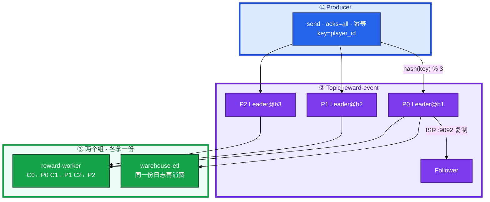
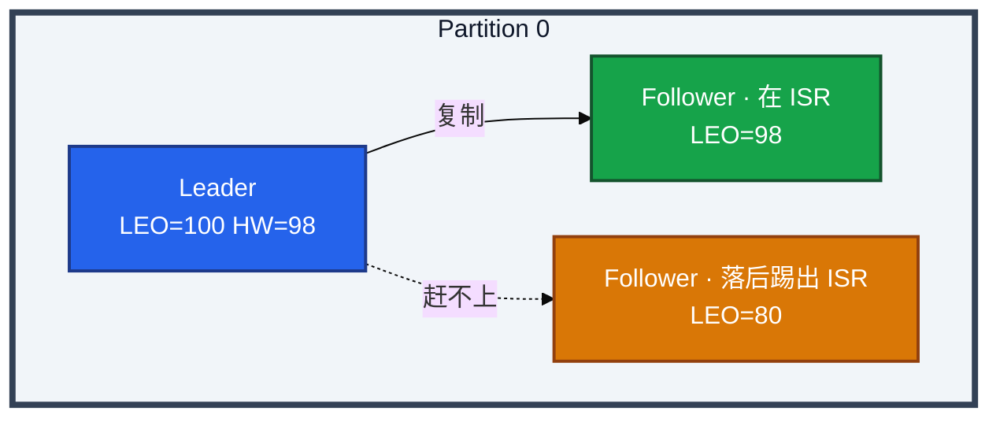
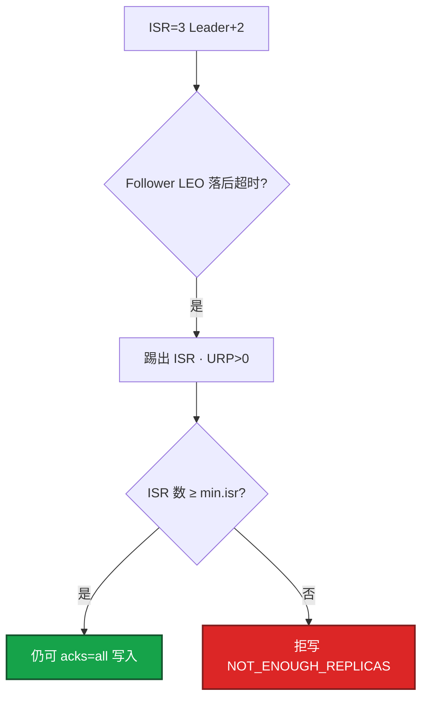
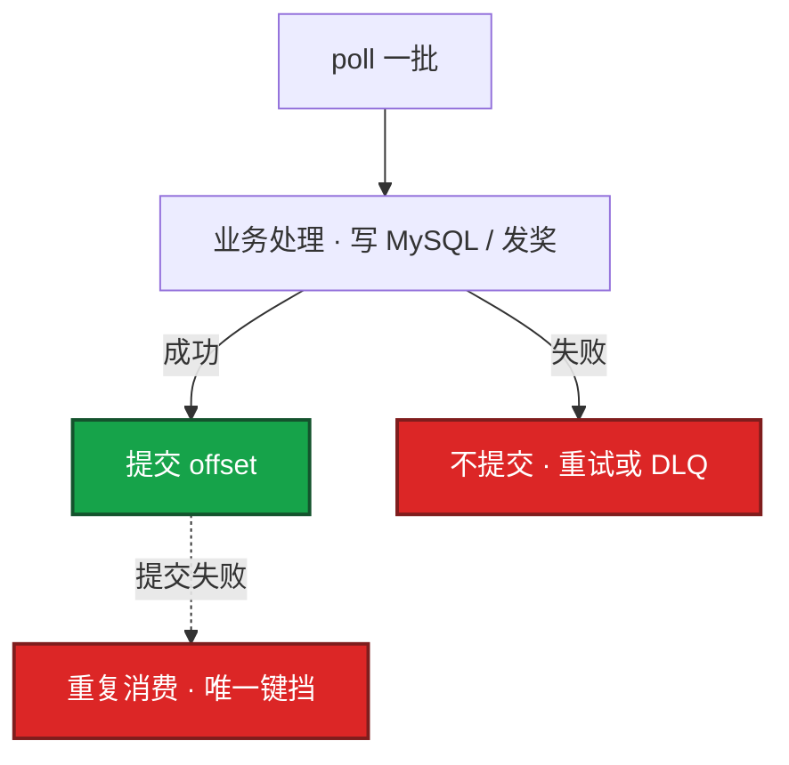
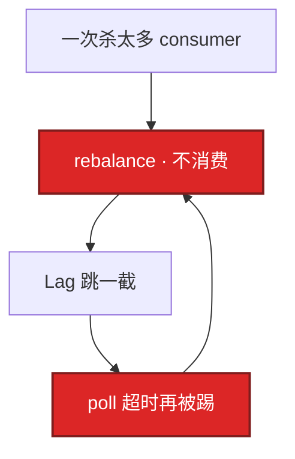
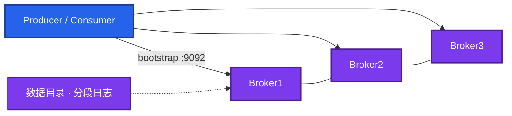
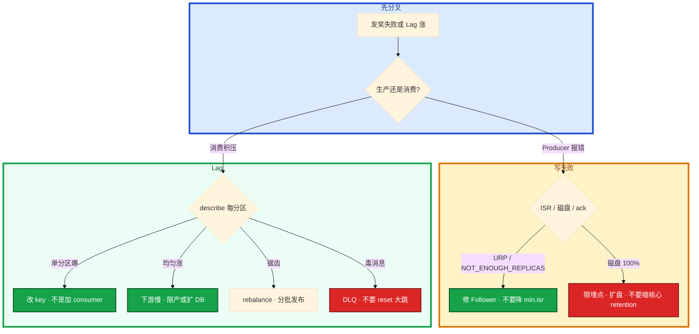

# Kafka


活动整点发奖，监控里 `reward-worker` 的 Lag 从 0 飙到 80 万。群里有人说「Kafka 丢消息了」，有人要把消费组 `--reset-offsets --to-latest` 清积压，另有人悄悄把 `min.insync.replicas` 改成 1 先让写进去——三刀下去，没发出去的奖和被跳过的积压叠在一起。

**本章主线（排障就按这三步想）：**

1. **分层**：Producer → Leader 分区 → ISR 复制 → Consumer offset；Lag = LEO − 已提交位点。
2. **归类**：写失败 → ISR / 磁盘 / acks；Lag 涨 → 单分区热点 vs 下游慢 vs rebalance。
3. **留证**：`describe --topic` + `describe --group` 按分区看，reset 必须 dry-run。

**读完你能：** 白板上画出分区、ISR、HW/LEO；Lag 能分热点还是下游慢；发奖链路能讲幂等和毒消息；会备份位点、滚动升级、失败回滚、换盘/扩分区。

## 本章目录

- [1. 基本概念](#1-基本概念)
- [2. 架构图](#2-架构图)
- [3. 原理](#3-原理)
  - [3.1 一次写入：acks / ISR / HW / LEO](#31-一次写入acks--isr--hw--leo)
  - [3.2 ISR 收缩](#32-isr-收缩)
  - [3.3 分区与顺序](#33-分区与顺序)
  - [3.4 消费与 offset](#34-消费与-offset)
  - [3.5 积压 Lag](#35-积压-lag)
  - [3.6 Rebalance](#36-rebalance)
  - [3.7 丢消息分层](#37-丢消息分层)
- [4. 落地](#4-落地)
- [5. 核心配置](#5-核心配置)
- [6. 命令与操作](#6-命令与操作)
- [7. 生产排障](#7-生产排障)
- [8. 必会 · 常考](#8-必会--常考)
- [合上书](#合上书问自己)

**本章不讲：** 落库唯一键、大事务拖垮消费 → [01 MySQL](../01-MySQL/)；热 key / 缓存被消费打爆 → [02 Redis](../02-Redis/)、[03 缓存架构](../03-缓存架构/)；活动流量模型、限流降级 → [08-05](../../08-游戏运维专题/05-活动高峰与压测/)；ZK 运维、KRaft 迁移方案 → 项目文档，本章只要求知道新集群用 KRaft；日志检索、埋点聚合 → [09 ES](../09-Elasticsearch/)。RabbitMQ / RocketMQ 不单开章，对照在 3.7 末。

---

## 1. 基本概念

值班里什么时候碰到 Kafka？发奖写不进去、Lag 告警、客服说「奖没到」、滚 Broker 前对 ISR——都是这一章的事。

Kafka 不是「一个队列里抢消息」，而是 **按 Topic 分类的追加日志**。Partition 是真正的并行单位：分区内有序、跨分区无序。Consumer Group 决定「这份日志被谁分摊」：组内一人一块分区，组与组互不影响。

发奖服务 `send(topic=reward-event, key=uid:10001, value=发 10 钻)`。有 key 就 `hash(key) % 分区数` 进固定分区；无 key 轮询，顺序不保证。

| 角色 | 干什么 | 值班里碰到 |
|------|--------|------------|
| **Producer** | 往分区 Leader 追加；`acks=all` 等 ISR | 写失败、`NOT_ENOUGH_REPLICAS` |
| **Broker / 分区副本** | Leader 接读写；Follower 同步；ISR 是跟上的那批 | URP>0、磁盘满、滚节点 |
| **Consumer Group** | 组内分摊分区；组间各拿一份同一条日志 | Lag、rebalance、reset |

| 在 Kafka 里 | 不在 Kafka 里 |
|-------------|---------------|
| Topic / 分区日志 / offset / ISR | 发奖是否入账（那是 MySQL 唯一键） |
| Lag、HW、LEO | 玩家当前在线状态（那是 Redis / 战斗服） |
| retention 到期删除 | 「业务丢了」的全部原因（见 3.7） |

读概念时记住两句：

1. **并行度上限 = 分区数。** 分区 3、组里塞 10 个消费者，7 个空转。堆积时先看分区和下游，不要先加机器。
2. **组间各拿一份。** 发奖组和数仓组互不抢 offset。别把登录、打点、发奖、CDC 塞进同一个 Topic 组。

磁盘估算：`写入 MB/s × 保留秒 × 副本数 × 1.3`。满盘 = 全集群拒绝生产。核心 Topic 与埋点 Topic **分集群或至少分盘**，避免日志把发货打挂。新集群用 **KRaft**；老集群可能还挂着 ZK，迁移是项目，不是本章主菜。

> **记住**：Kafka 保的是日志和位点，不保跨系统 exactly once。游戏发奖默认 **At least once + 消费幂等**。

---

## 2. 架构图

后面 ISR、Lag、滚 Broker 都对着这张图说话。



**读图三句话：**

1. **写打 Leader**；Follower 复制进 ISR 之后，HW 才前进——排障写失败从 Leader 和 ISR 查，不要先 reset 消费组。
2. **同一时刻组内一个分区只给一个消费者**——加消费者超分区数没用，Lag 要从「哪几个分区」看起。
3. **没有箭头从业务直接改 Broker 上的日志文件**——`--reset-offsets` 改的是组位点，必须 dry-run + owner 签字。

每个分区的副本关系（ISR / HW / LEO 在 3.1 展开）：



---

## 3. 原理

**本节 7 块：** 3.1 写入 · 3.2 ISR 收缩 · 3.3 顺序 · 3.4 消费 · 3.5 Lag · 3.6 Rebalance · 3.7 丢消息

### 3.1 一次写入：acks / ISR / HW / LEO

**一句话：** `acks=all` 等的是 ISR 全部确认，HW 前进后消费者才读得到。

**打个比方**：Leader 是总仓记账，Follower 是分仓抄账；HW 是「所有合格分仓都抄到的页码」——总仓自己多记两页（Leader LEO 更大），对外发货只能发到 HW 那一页。

**现场走一遍**（发奖写不进去，Producer 报 `NOT_ENOUGH_REPLICAS`）：

1. 跳板机看 Topic 和 ISR：

```bash
export BS=broker1:9092,broker2:9092,broker3:9092
kafka-topics.sh --bootstrap-server $BS --describe --topic reward-event
```

2. 屏幕出现：

```text
Topic: reward-event  PartitionCount: 3  ReplicationFactor: 3
  Topic: reward-event  Partition: 0  Leader: 1  Replicas: 1,2,3  Isr: 1
  Topic: reward-event  Partition: 1  Leader: 2  Replicas: 2,3,1  Isr: 2,3
  Topic: reward-event  Partition: 2  Leader: 3  Replicas: 3,1,2  Isr: 3,1,2
```

3. **说明什么**：P0 的 ISR 只剩 Leader（broker1），`min.insync.replicas=2` 时 **拒写是保数据**，不是 Kafka 坏了。
4. 下一步：查 broker2、broker3 上 P0 的 Follower 盘 / GC / 网，修副本——**不要降 min.isr**。

三个位点不要混：

| 位点 | 是什么 | 谁用 |
|------|--------|------|
| **LEO** | 该副本本地日志最后一条的下一条 offset | 每个副本一份，Leader 通常最大 |
| **HW** | ISR 里 **最小的 LEO**；已提交、可被消费的水位 | 消费者最多读到 HW 之前 |
| **Consumer offset** | 该组在该分区已经处理到哪 | 组协调器 / `__consumer_offsets` |


生产默认：

```properties
replication.factor=3
min.insync.replicas=2
acks=all
enable.idempotence=true
retries=2147483647
```

| acks | 等什么 | 游戏核心 |
|------|--------|----------|
| all | ISR 全部 | **默认** |
| 1 | 只等 Leader | Leader 挂且未同步就丢 |
| 0 | 不等 | **禁用** |

**幂等 Producer** 防网络重试导致 Broker **同一条写两遍**（PID + 序号去重）。它不防消费侧重复，也不跨 Topic、跨会话。口头仍是 **At least once + 消费幂等**；进 MySQL 靠 `order_id + event_type` 唯一键。

**输出解读**（上面 describe 片段）：

| 列 | 含义 | 异常信号 |
|----|------|----------|
| Leader | 当前读写节点 | OfflinePartitions>0 时为空 |
| Replicas | 应有几份副本 | 少于 rf = 配置问题 |
| Isr | 跟上 Leader 的副本 | **Isr 数 < min.isr → 拒写** |
| P0 Isr:1 vs P1 Isr:2,3 | 按分区看 | 不能只看集群平均 |

**面试怎么说**：「acks=all 等 ISR 全部确认，不是每台 Broker。HW 是 ISR 最小 LEO，消费者读不到 HW 之后。ISR 不够拒写是保数据，我先修 Follower，不降 min.isr。」

### 3.2 ISR 收缩

**一句话：** Follower 落后超时会被踢出 ISR；ISR < min.isr 时 acks=all 拒写。

**打个比方**：消防队要求至少 2 人在岗（min.isr=2）；一人掉队出 ISR，还能写；只剩队长一人——宁可关门也不单人值班，否则队长一倒就全丢。

**现场走一遍**（监控 `UnderReplicatedPartitions > 0` 持续 10 分钟）：

1. describe Topic，记下哪些分区 Isr 少于 Replicas。
2. 上 lag 的 Follower 节点：

```bash
df -h /var/lib/kafka
# 看 Broker 日志：slow replica、IO wait、GC
```

3. 屏幕若 `Use% 92%` 且 Follower 复制慢 → 磁盘 IO 是根因，不是「Kafka 抽风」。
4. 滚动 Broker：**一次一台**，等该分区 Isr 恢复、URP=0 再下一台。活动中途不要滚。



`replica.lag.time.max.ms` 常见默认 **30s**：Follower 在这窗口内 LEO 追不上 Leader 就踢出 ISR。

`unclean.leader.election.enable` 生产必须 **false**——禁止选 ISR 外副本当 Leader，否则 HW 回退、已 ack 的消息可能丢。把 `min.isr` 降到 1 = 允许单副本写入，再挂 Leader 就丢。

**输出解读**：URP（UnderReplicatedPartitions）= Replicas 数 − Isr 数（按分区）。URP>0 持续 = 丢冗余；再挂一台 Leader 就可能丢数据或拒写。

**面试怎么说**：「ISR 收缩常见盘、IO、跨 AZ 延迟。拒写说明 min.isr 在起作用。unclean 必须 false；滚动一次一台等 ISR 齐，活动窗口不滚。」

### 3.3 分区与顺序

**一句话：** 同 key 进同一分区 + 该分区串行消费 = 该 key 有序。

**打个比方**：银行窗口按身份证号分窗口——同一人的业务在同一窗口排队，窗口之间不保证谁先办完。

**现场走一遍**（订单状态乱序，排查 Producer）：

1. 查代码：发奖是否带 `key=player_id`？若 `key=null` → 轮询进不同分区，Broker 侧已经乱序。
2. 若近期 `--alter --partitions` 从 3 扩到 6 → `hash(key) % n` 变了，同一玩家可能换分区。
3. 若消费端多线程「谁先处理完谁先提交」→ 分区内顺序被打乱。

会打破顺序的三件事：

1. **无 key**：轮询跨分区，单线程 Producer 也救不了。
2. **扩分区**：只增不减；依赖顺序的组要评估，必要时新 Topic + 双写。
3. **消费多线程按完成时间处理**：可以并行拉，但 **按分区串行处理或按 key 再排队**。

分区数按峰值消费并行度和单分区吞吐估，宁少勿多。过多：选举、恢复、元数据都变贵；过少：加消费者没用。

**面试怎么说**：「顺序靠 key 加分区串行消费。无 key 轮询、扩分区改 hash、消费乱序提交都会破序。全局有序要单分区，吞吐崩，我们只保同订单/同玩家有序。」

### 3.4 消费与 offset

**一句话：** 处理成功再提交 offset；先提交后处理 = 静默丢。

**打个比方**：快递签收单——先签字再开箱，丢了货还能追责；先签字后丢件，系统认为你已收货。

**现场走一遍**（同一条发奖流水反复出现，或分区头卡住）：

1. 看消费组 Lag 是否 **只有一个分区** 在涨：

```bash
kafka-consumer-groups.sh --bootstrap-server $BS \
  --describe --group reward-worker
```

2. 屏幕出现：

```text
GROUP           TOPIC           PARTITION  CURRENT-OFFSET  LOG-END-OFFSET  LAG
reward-worker   reward-event    0          120045          120048          3
reward-worker   reward-event    1          98001           98001           0
reward-worker   reward-event    2          450000          520000          70000
```

3. P2 Lag=70000 且 CURRENT 长时间不动 → 分区头上 **毒消息** 反复失败，堵住了后面所有人。
4. 正确做法：重试 N 次进 **DLQ**，人工补；**不要用 reset 往后跳**。重复消费（P0 Lag 小、MySQL 唯一键冲突）是 At least once 正常代价。



游戏发奖：流水号唯一索引，**先写发奖结果再提交 offset**。埋点、可丢失打点可以开自动提交；发奖、支付、合服流水 **禁用** 自动提交。

**输出解读**：Lag = LOG-END − CURRENT（该分区）。CURRENT 不动、LEO 还在涨 = 消费卡死在该 offset；CURRENT 在涨 = 在消化，看速率差。

**面试怎么说**：「发奖先落库再提交 offset。毒消息进 DLQ，reset 不是止血。多线程可以，offset 仍须按分区顺序提交。」

### 3.5 积压 Lag

**一句话：** Lag 是 LEO 减已提交位点；先比生产消费速率，再看是不是单分区热点。

**打个比方**：仓库入库（生产）和出库（消费）——入库 1 万件/分、出库 5 千，Lag 一定涨；若只有一个货架（分区）堆满，加再多搬运工（消费者）也超不过货架数（分区数）。

**现场走一遍**（活动整点 Lag 80 万，有人要加 20 个 consumer）：

1. describe 组，**按分区** 看 Lag（不要只看 Grafana 平均）：

```bash
kafka-consumer-groups.sh --bootstrap-server $BS \
  --describe --group reward-worker
```

2. 对比生产和消费速率（监控或两次 describe 做差）：

```text
# 10:00:00  P2 LAG=70000  CURRENT=450000
# 10:05:00  P2 LAG=85000  CURRENT=465000  → 5分钟消费1.5万，生产3.5万，还在恶化
```

3. 分支判断：

| 你看到的 | 说明 | 下一步 |
|----------|------|--------|
| P0/P1 Lag≈0，P2 爆 | key 倾斜（活动 id 当 key） | 改 key 为 player_id |
| 三分区均匀涨 | 下游整体慢 | 限产或扩 MySQL/发奖接口，别加 consumer |
| Lag 大但 CURRENT 追 LEO | 在消化历史 | 看速率差是否为负 |
| Lag 锯齿 | rebalance | 见 3.6，分批发布 |
| 超过 retention | 合法过期 | 不是还能追上，业务侧像「丢了」 |

5. 查的顺序（口算用）：

```
  1. 哪个 Topic / Group / 哪些分区？
  2. 生产速率 vs 消费速率
  3. 消费者在线吗、是不是一直 rebalance
  4. 处理耗时：MySQL / Redis / HTTP
  5. Broker：磁盘、URP、拉取 P99
```

**输出解读**：上例 P2 五分钟 Lag +15000、CURRENT +15000 → 消费 3000/min，若生产 7000/min，差 +4000/min，加 consumer 若已到 3 个（=分区数）则无效。

**面试怎么说**：「Lag 按分区分，平均会骗人。单分区爆查 key 倾斜；均匀涨查下游，不加 consumer 打 DB。retention 外的积压已经没了，不是追就能追上。」

> **记住**：先比生产和消费速率，再看是不是单分区热点。

### 3.6 Rebalance

**一句话：** 组成员变化或 poll 超时触发 rebalance，经典协议下这段 **Stop-the-world 不消费**。

**打个比方**：班级重新分桌——分桌那几分钟没人听课，Lag 跳一截；分完发现有人处理太慢又被踢出去再分桌，锯齿就来了。

**现场走一遍**（发布新版本后 Lag 锯齿、客户端日志频繁 join/leave）：

1. 确认是否一次滚动换了太多 consumer 实例。
2. 查 `max.poll.records` 是否过大，一轮处理超过 `max.poll.interval.ms`（常见 5min）→ 被踢 → 再 rebalance → 更慢。
3. 止血：减小 `max.poll.records`；发布 **分批**；调大 interval 是止痛，治本是缩短单条处理时间。



Producer 侧：`batch.size` + `linger.ms` 换吞吐；`compression.type=lz4` 降磁盘和网；必须处理发送失败 callback。

**面试怎么说**：「Lag 锯齿先怀疑 rebalance。活动整点别扩 consumer——触发停消费。协作式 rebalance 缩短窗口，不能替代处理慢的根本修复。」

### 3.7 丢消息分层

**一句话：** 「奖没到」先拿消息 ID 分层查，别一上来怪 Kafka 或 reset。

**打个比方**：快递没收到——要查寄件人有没有寄出、中转有没有丢、门卫有没有签收、你是不是填错地址，不能直接把快递单撕了当「没寄」。

**现场走一遍**（客服工单 + 有人提议 `--to-latest`）：

1. 拿到 `event_id` / offset / 时间戳。
2. 查 Producer 发送日志：有没有 ack、callback 有没有告警、失败进没进补偿表。
3. 在对应分区按 offset 查消息还在不在（`kafka-console-consumer.sh --offset`）。
4. 查消费日志和 MySQL 发奖流水：消息在、流水没有 → 消费或业务问题。
5. **红线**：禁止 `--to-latest` 当止血——跳过的是还没发的奖 + 真实积压。

分层清单：

```
  Producer：没等 ack、callback 没告警、异步 send 不看失败
  Broker：  acks 非 all、ISR 不够、磁盘满、retention 到期
  Consumer：先提交后处理；异常被吞；误 reset --to-latest
  业务：    错 Topic、过滤条件、处理成功但没改状态
```

**活动发奖事故链**（整点）：埋点和发货同盘 → 打点打满盘 → 发货 `acks=all` 失败 → 有人 `--to-latest` → 没 ack 的 + 被跳过的叠在一起。正确顺序：**保盘和 ISR、限埋点、补偿表重放**。

```
  活动整点
     +-- 生产打满：限日志 Topic，保 reward-event
     +-- 消费变慢：看下游，不要加 consumer 打死 DB
     +-- 滚动发版：分批，避开 rebalance 和整点
     +-- URP>0：先别滚下一台 Broker
```

怎么证明 Kafka 没丢：消息 ID 在 Leader 日志里还在 → 消费/业务问题；不在且超过 retention → 合法过期；从未出现在日志 → 生产没写成功。

**RabbitMQ / RocketMQ 对照**：Kafka 是 **分区日志**——可重放、按组多次消费、并行靠加分区。RabbitMQ 是 **Broker 队列**——每条被一个消费者取走，重放和「同一份给数仓再给风控」都别扭；路由、死信好用，吞吐和堆积回放不是长项。RocketMQ 更像 Kafka（队列/位点、事务消息）；排障仍是并行度、位点、积压速率、幂等。游戏事件总线、CDC、活动打点 → Kafka；短任务分发、低流量灵活路由 → RabbitMQ。

**面试怎么说**：「丢消息四层：生产、Broker、消费、业务。retention 到期是合法删不是丢。reset --to-latest 是业务当丢，活动窗口禁用。跨系统 exactly once 靠业务唯一键，不靠 Kafka 事务 alone。」

---

## 4. 落地

### 4.1 生产怎么选

| 项 | 选 | 不选 |
|----|----|------|
| 节点 | ≥3 Broker，rf=3 | 单 Broker 当生产 |
| 磁盘 | 独立 SSD；核心与埋点分盘 | 和游戏日志 / 发货同盘 |
| 网络 | 同城多 AZ，`broker.rack` | 跨 region 当一套 |
| 协议 | 新集群 **KRaft** | 新开还上 ZK |
| 选举 | `unclean.leader.election=false` | ISR 外选主换可用性 |
| 客户端 | `advertised.listeners` 对端可达 | 配成 localhost |

跨 AZ 消费会让延迟和流量费一起涨，副本应机架感知。托管 MSK / 云 Kafka：问清磁盘是否独立、谁看 URP、升级是否滚动、retention 默认值。

### 4.2 落地你实际看到什么



验收：进程在不算数。必须 `describe` 看 ISR 等于副本列表；打一条带 key 的消息能被组消费；磁盘告警已接。不要只探 TCP 9092。

---

## 5. 核心配置

只动有证据的项。降 `min.isr`、缩 retention、一次杀光 consumer 都是变更。

| 参数 | 常见默认 | 生产怎么用 | 改错会怎样 |
|------|----------|------------|------------|
| `replication.factor` | 1～3 | **3** | 1 = 无冗余 |
| `min.insync.replicas` | 1 | **2**（配 acks=all） | 降到 1 = 允许丢 |
| `unclean.leader.election.enable` | 视版本 | **false** | true = 已 ack 也可能丢 |
| `replica.lag.time.max.ms` | 30000 | 同城保持 | 过小 ISR 抖；过大假同步 |
| `retention.ms` | 7d 量级 | 埋点 24～72h；发货更长 | 短于最慢组 = 合法删 |
| `advertised.listeners` | hostname | **对端可达地址** | localhost 进集群就断 |
| `max.poll.interval.ms` / `max.poll.records` | 5min / 500 | 一轮处理落在 interval 内 | 太大被踢 → 循环 rebalance |
| `batch.size` / `linger.ms` | 16KB / 0 | 吞吐不够再加；lz4 | 不顾 callback 仍会丢 |

> **记住**：ISR 不够拒写是保数据。quota 式「先改 min.isr」和 etcd 只加不治理一样，会再炸。

---

## 6. 命令与操作

`BS` 写成变量：

```bash
export BS=broker1:9092,broker2:9092,broker3:9092
```

| 目的 | 命令 | 看什么 |
|------|------|--------|
| Topic 与 ISR | `kafka-topics.sh --bootstrap-server $BS --describe --topic reward-event` | Isr 是否等于 Replicas |
| 消费组 Lag | `kafka-consumer-groups.sh --bootstrap-server $BS --describe --group reward-worker` | **每分区** LAG |
| 列组 | `--list` | 组名写错会 reset 到空组 |
| 扩分区 | `--alter --partitions` | 只增不减 |
| 位点 dry-run | `--reset-offsets --dry-run` | 将要写的位点，owner 签字 |

值班先跑：

```bash
kafka-topics.sh --bootstrap-server $BS --describe --topic reward-event
kafka-consumer-groups.sh --bootstrap-server $BS --describe --group reward-worker
df -h /var/lib/kafka
```

指标：`UnderReplicatedPartitions > 0` **P1**，持续则 P0；磁盘 **>80%** 告警，**85%** 删旧段或扩盘，**100%** 拒写；Lag 按组和分区；频繁 rebalance。

日志：`NOT_ENOUGH_REPLICAS` = ISR < min.isr；满盘；组成员反复 join/leave = rebalance。

### 6.1 备份位点

对业务「备份」= **消费位点 + 下游库 + 发奖补偿表**。变更前 `describe` 组打出每分区 CURRENT-OFFSET，存档。没有演练过「从补偿表重放」= 发奖没有备份。季度演练：停消费 → 从指定 offset 重放一小段 → 对账。

### 6.2 扩分区

只增不减；带 key 时映射会变。低峰 `--alter --partitions` → 会 rebalance（算停消费）→ 仍倾斜则改 key，不是再加分区。活动整点不要扩。

### 6.3 滚动换 Broker

1. 确认 ISR、URP、磁盘。
2. 摘一台：等 ISR 不含它再停。
3. 修盘 / 换机 / 改 listeners。
4. 拉起，等 ISR 齐、URP=0，再下一台。

ISR 大面积不够：先限非核心 Topic，保发货，修 Follower——**不要降 min.isr**。

### 6.4 磁盘满与迁盘

容量 ≈ `写入 MB/s × 保留秒 × 副本 × 1.3`。80% 告警；85% 删旧段或扩盘；100% 全集群拒写。核心与 debug 埋点分盘。缩 retention 等于主动删还没被最慢消费者读完的数据。

换盘：保证 ISR 上其它副本还在 → 停该 Broker → 拷数据目录 → 改挂载 → 拉起 → 等 ISR。

### 6.5 升级

1. 记下位点、导出 Topic 配置。
2. **滚动**：一次一台；等 ISR 齐、URP=0。
3. 不要三台同时换包；不要跳大版本。
4. 日志格式升过，回退可能要靠镜像 Topic 或补偿表重放。

### 6.6 回滚

Broker 版本回滚看官方兼容表。没有升级前位点存档和补偿表 = 发奖没有回滚。一台 ISR 落后：先看该节点盘和网，按 6.3 摘重加——不要全集群回滚二进制。

### 6.7 重置 offset

`--reset-offsets` 必须 `--dry-run`，业务 owner 签字。

```
  --to-latest    = 跳过积压（业务当丢）——活动窗口禁用
  --to-earliest  = 全量重放（可能打爆下游）
  按时间戳重置    → 确认时区
  消费组名写错    → reset 到空组，看起来成功、生产组没动
```

降 `min.insync`、缩 retention、删 Topic 都是变更。生产变更避开活动整点。

---

## 7. 生产排障

三问：还能不能生产？还能不能消费？已提交的位点还在不在？

**Kafka 拒写 ≠ 立刻 reset offset。** 已落库的奖还在；没 ack 的走补偿表。



| 现象 | 先做什么 | 不要做什么 |
|------|----------|------------|
| `NOT_ENOUGH_REPLICAS` | 查 ISR、盘、GC；修 Follower | 把 min.isr 改成 1 |
| URP>0 | 一次一台等 ISR | 继续滚下一台 Broker |
| Lag 均匀涨 | 下游 MySQL / 发奖接口 | 加 consumer 把 DB 打死 |
| 单分区 Lag 爆 | 改 key（活动 id 倾斜） | 只看平均 Lag |
| Lag 锯齿 | 分批发布、减小 poll records | 整点扩 consumer |
| 「丢了」 | 消息 ID 分层：生产/Broker/消费/业务 | 先怪 Kafka、先 reset |
| 满盘 | 限埋点、扩盘 | `--to-latest` 清 Lag |
| 毒消息堵头 | DLQ，保留 offset | 往后跳一大截 |

**真实现象举例**：

- **ISR**：整点发奖时 P0 Isr 只剩 1，Producer 全红——Follower 盘 95%，不是业务 bug。
- **Lag**：P2 Lag 70 万、P0/P1 为 0——运营把 `activity_id` 当 key，全服公告进同一分区。
- **reset**：有人 dry-run 都没跑就 `--to-latest`，客服工单一夜翻倍——跳过的 offset 不会自动补发。

---

## 8. 必会 · 常考

| 说法 | 对错 | 口径 |
|------|:----:|------|
| 加 consumer 一定能消化 Lag | 错 | 并行度 ≤ 分区数；下游慢会更死 |
| `acks=all` 等于每台 Broker 都写完 | 错 | 等的是 ISR 全部 |
| ISR 不够拒写是故障，应降 min.isr | 错 | 保数据 |
| HW 就是 Leader 的 LEO | 错 | HW = ISR 最小 LEO |
| 无 key 也能靠单线程 Producer 保序 | 错 | 轮询已跨分区 |
| 扩分区不影响同 key 顺序 | 错 | `hash % n` 会变 |
| 幂等 Producer 开了消费不会重复 | 错 | 只去重 Broker 侧重试 |
| Kafka 事务 = 进 MySQL 也 exactly once | 错 | 出 Kafka 仍要唯一键 |
| 平均 Lag 不高就没事 | 错 | 按分区告警 |
| retention 到期是 Broker 丢消息 | 错 | 合法过期 |
| `--to-latest` 可以当积压止血 | 错 | 业务当丢 |
| 4 个 Broker 比 3 个更能抗 2 台？ | 看 rf | 冗余看副本和 ISR，不是台数口算 |

数字：rf **3**、min.isr **2**；replica lag 常见 **30s**；磁盘 **80 / 85 / 100%**；埋点 retention **24～72h**；`max.poll.interval.ms` 与一轮处理时间对齐。

易混：LEO vs HW vs consumer offset；ISR 收缩 vs 丢消息；Lag 热点 vs 下游慢 vs rebalance；扩分区 vs 改 key；reset vs DLQ；RabbitMQ 队列 vs Kafka 日志。

> **别混**：拒写（ISR 不够）和丢消息（先提交后处理、reset）——前者是 Kafka 在拦你，后者往往是人或业务配置。

---

## 合上书，问自己

1. 并行度为什么等于分区数？组间为什么不抢 offset？
2. acks=all 等的是谁？LEO / HW / consumer offset 各是什么？
3. ISR 收缩什么时候拒写？为什么不能降 min.isr？滚动 Broker 等什么？
4. 同 key 如何保序？扩分区为什么要评估？
5. Lag 五步怎么查？平均 Lag 为什么骗人？发奖 offset 何时提交？
6. 「丢消息」四层怎么查？reset 三条红线？活动整点先保什么？

六题都能口述，这一章就过了。落库唯一键回 01；下一章把 Mongo 的副本集、分片和玩家文档模型剖开。
