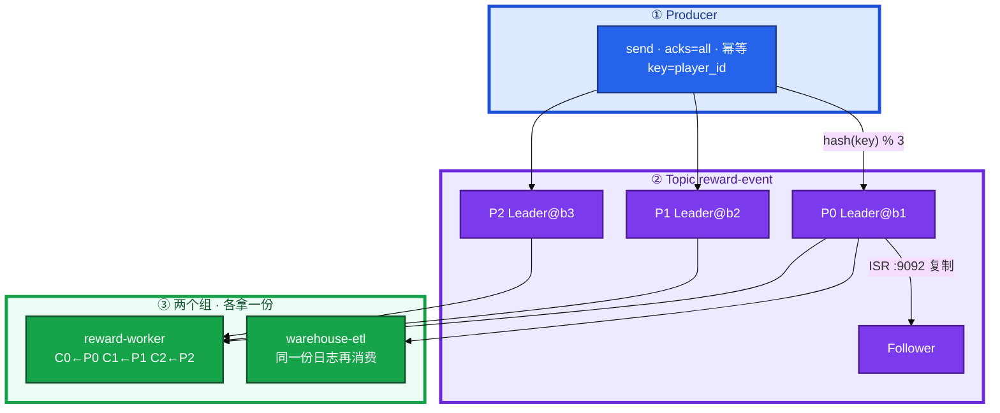
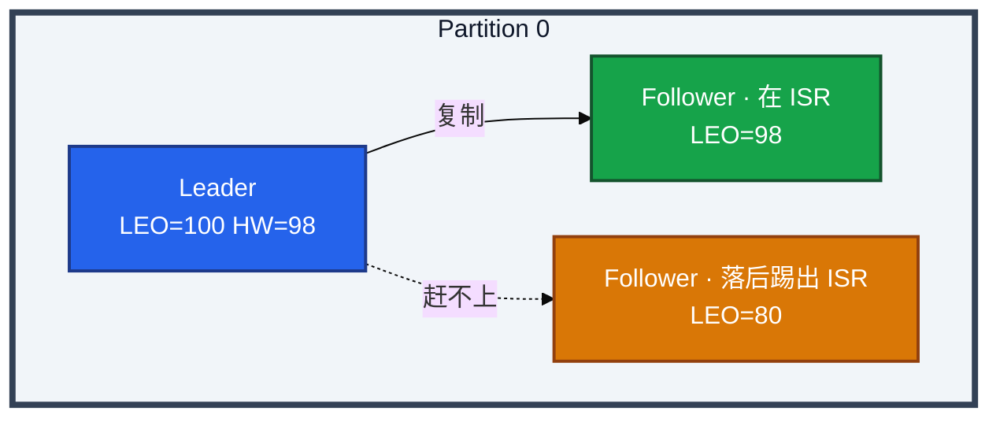
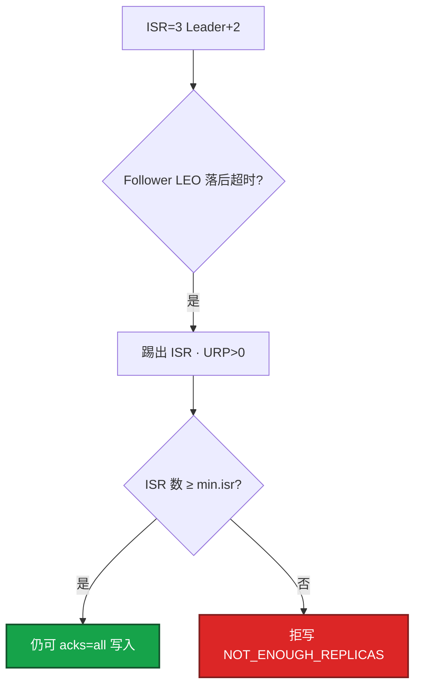
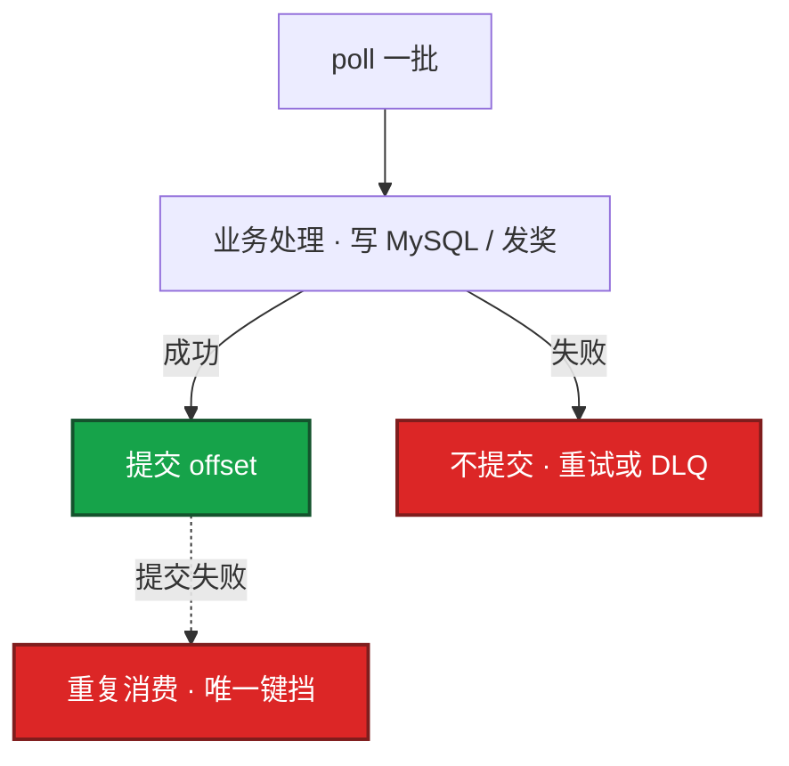
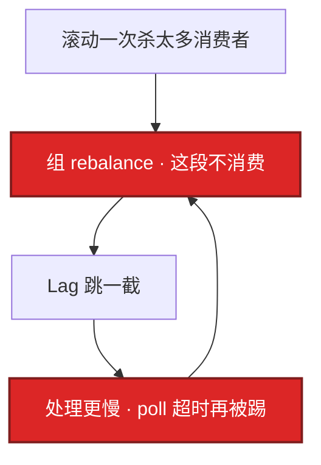
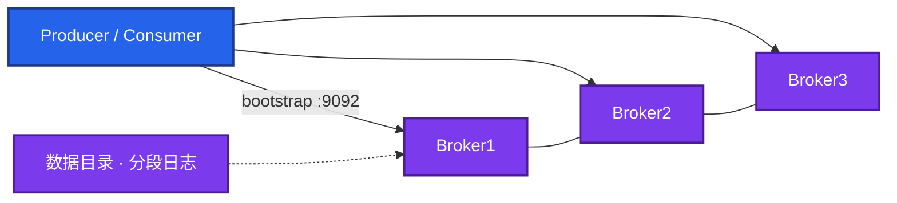
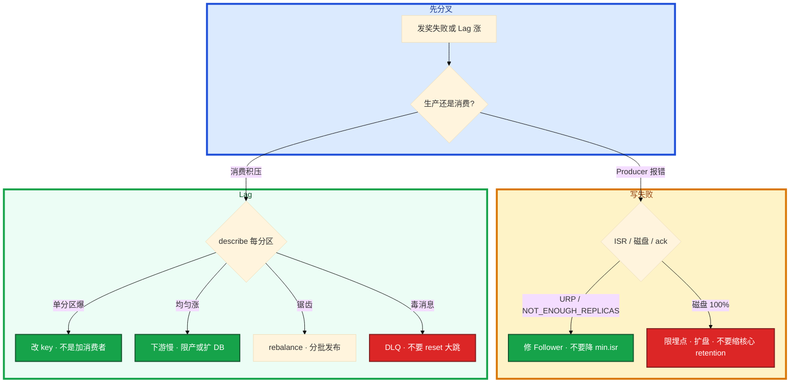

# Kafka


活动整点发奖，Lag 飙到几十万。有人说丢消息，有人要把消费组 `--reset-offsets --to-latest`，另有人把 `min.insync.replicas` 改成 1 先顶过去。

先别动手。这一章后半全是你会动手的：**怎么看 ISR 和 Lag、怎么扩分区、怎么滚 Broker、怎么 reset、磁盘满和拒写分别怎么止血。** 前面的概念和原理，是为了让你动手时不选错路。

**读完你能：** 白板上画出分区、ISR、HW/LEO；Lag 能分热点还是下游慢；发奖链路能讲幂等和毒消息；会备份位点、滚动升级、失败回滚、换盘/扩分区。

**本章主线（排障就按这三步想）：**

1. **分层**：Producer → Leader 分区 → ISR 复制 → Consumer offset；Lag = LEO − 已提交位点。
2. **归类**：写失败 → ISR/磁盘/acks；Lag 涨 → 单分区热点 vs 下游慢 vs rebalance。
3. **留证**：`describe --topic` + `describe --group` 按分区看，reset 必须 dry-run。

## 本章目录

- [1. 基本概念](#1-基本概念)
- [2. 架构图](#2-架构图)
- [3. 原理](#3-原理)
  - [3.1 一次写入](#31-一次写入acks-isr-hw-leo)
  - [3.2 ISR 收缩](#32-isr-收缩)
  - [3.3 分区与顺序](#33-分区与顺序)
  - [3.4 消费与 offset](#34-消费与-offset)
  - [3.5 积压 Lag](#35-积压-lag)
  - [3.6 Rebalance](#36-rebalance)
  - [3.7 丢消息分层](#37-丢消息分层)
- [4. 落地](#4-落地)
  - [4.1 生产怎么选](#41-生产怎么选)
  - [4.2 落地你实际看到什么](#42-落地你实际看到什么)
- [5. 核心配置](#5-核心配置)
- [6. 命令与操作](#6-命令与操作)
  - [6.1 备份位点](#61-备份位点)
  - [6.2 扩分区](#62-扩分区)
  - [6.3 滚动换 Broker](#63-滚动换-broker)
  - [6.4 磁盘满与迁盘](#64-磁盘满与迁盘)
  - [6.5 升级](#65-升级)
  - [6.6 回滚](#66-回滚)
  - [6.7 重置 offset](#67-重置-offset)
- [7. 生产排障](#7-生产排障)
- [8. 必会 · 常考](#8-必会-常考)
- [合上书](#合上书问自己)

**本章不讲：** 落库唯一键、大事务拖垮消费 → [01 MySQL](../01-MySQL/)；热 key / 缓存被消费打爆 → [02 Redis](../02-Redis/)、[03 缓存架构](../03-缓存架构/)；活动流量模型、限流降级 → [08-05](../../08-游戏运维专题/05-活动高峰与压测/)；ZK 运维、KRaft 迁移方案 → 项目文档，本章只要求知道新集群用 KRaft；日志检索、埋点聚合 → [09 ES](../09-Elasticsearch/)。RabbitMQ / RocketMQ 不单开章，对照在 3.7 末。

---

## 1. 基本概念

Kafka 不是「一个队列里抢消息」，而是 **按 Topic 分类的追加日志**。Partition 是真正的并行单位：分区内有序、跨分区无序。Consumer Group 决定「这份日志被谁分摊」：组内一人一块分区，组与组互不影响。

发奖服务 `send(topic=reward-event, key=uid:10001, value=发 10 钻)`。有 key 就 `hash(key) % 分区数` 进固定分区；无 key 轮询，顺序不保证。

三个角色不要混：

| 角色 | 干什么 |
|------|--------|
| **Producer** | 往分区 Leader 追加；`acks=all` 等 ISR |
| **Broker / 分区副本** | Leader 接读写；Follower 同步；ISR 是跟上的那批 |
| **Consumer Group** | 组内分摊分区；组间各拿一份同一条日志 |

| 在 Kafka 里 | 不在 Kafka 里 |
|-------------|---------------|
| Topic / 分区日志 / offset / ISR | 发奖是否入账（那是 MySQL 唯一键） |
| Lag、HW、LEO | 玩家当前在线状态（那是 Redis / 战斗服） |
| retention 到期删除 | 「业务丢了」的全部原因（见 3.7） |

读概念时记住两句：

1. **并行度上限 = 分区数。** 分区 3、组里塞 10 个消费者，7 个空转。堆积时先看分区和下游，不要先加机器。
2. **组间各拿一份。** 发奖组和数仓组互不抢 offset。别把登录、打点、发奖、CDC 塞进同一个 Topic 组。

磁盘：`写入 MB/s × 保留秒 × 副本数 × 1.3`。满盘 = 全集群拒绝生产。核心 Topic 与埋点 Topic **分集群或至少分盘**，避免日志把发货打挂。新集群用 **KRaft**；老集群可能还挂着 ZK，迁移是项目，不是本章主菜。

> **记住**：Kafka 保的是日志和位点，不保跨系统 exactly once。游戏发奖默认 **At least once + 消费幂等**。

---

## 2. 架构图

先把整张图钉住。后面 ISR、Lag、滚 Broker 都对着这张图说话。



图上三条线：

1. **写打 Leader**；Follower 复制进 ISR 之后，HW 才前进，消费者才能读到。
2. **同一时刻组内一个分区只给一个消费者。**
3. **没有箭头从业务直接改 Broker 上的日志文件。** `kafka-consumer-groups.sh --reset-offsets` 是变更，要 dry-run。

每个分区的副本关系（ISR / HW / LEO 在 3.1 展开）：



---

## 3. 原理

原理只保留动手和面试会用到的：谁能写、HW 是什么、顺序怎么保、Lag 先看哪、reset 为什么是事故。

**本节 7 块：** 3.1 写入 · 3.2 ISR 收缩 · 3.3 顺序 · 3.4 消费 · 3.5 Lag · 3.6 Rebalance · 3.7 丢消息

### 3.1 一次写入：acks / ISR / HW / LEO

每个分区有一个 Leader 接读写，Follower 同步。**ISR（In-Sync Replica）** = 跟上 Leader 的副本。`acks=all` 等的不是「集群里每一台」，而是 **ISR 全部确认**。

三个位点不要混：

| 位点 | 是什么 | 谁用 |
|------|--------|------|
| **LEO**（Log End Offset） | 该副本本地日志最后一条的下一条 offset | 每个副本自己一份，Leader 通常最大 |
| **HW**（High Watermark） | ISR 里 **最小的 LEO**；已提交、可被消费的水位 | 消费者最多读到 HW 之前 |
| **Consumer offset** | 该组在该分区已经处理到哪 | 组协调器 / `__consumer_offsets` |


消费者看不到 HW 之后的消息——即使 Leader 本地 LEO 已经更大。这是为了切主后不读到未复制数据。

生产默认这样配：

```properties
# Topic
replication.factor=3
min.insync.replicas=2
# Producer
acks=all
enable.idempotence=true
retries=2147483647
```

`rf=3, min.insync.replicas=2, acks=all`：ISR ≥ 2 才写成功；ISR 只剩 Leader 时 **拒绝写入**（`NOT_ENOUGH_REPLICAS`）。这是保数据，不是故障。你眼睛看到的：发奖写不进去。先查 ISR，不要先重启业务。

`acks=1` 只等 Leader，Leader 挂且未同步就丢。`acks=0` 游戏核心禁用。

**幂等 Producer** 防的是：网络重试导致 Broker **同一条写两遍**。PID + 序号在 Broker 侧去重。它不防消费侧重复，也不跨 Topic、跨会话保证。重启 Producer 会换 PID，所以生产口头仍是 **At least once + 消费幂等**。

| 语义 | 含义 | 实践 |
|------|------|------|
| At most once | 可能丢 | 先提交 offset 再处理，核心禁用 |
| At least once | 可能重 | **默认**，业务用唯一键消化 |
| Exactly once | Kafka 事务 / EOS 只在 Kafka 链路内 | 出了 Kafka 进 MySQL 仍要幂等表 |

`acks=all` 还不够：消费端必须 **处理成功再提交 offset**，下游落库用 `order_id + event_type` 唯一键。Kafka 事务解决不了「消息进了 MySQL 又进了 Redis」的跨系统 exactly once。

### 3.2 ISR 收缩

Follower 的 LEO 在 `replica.lag.time.max.ms`（常见默认 **30s**）内赶不上 Leader，就会被 **踢出 ISR**。`UnderReplicatedPartitions > 0` 持续 = 丢冗余，再挂一台就可能丢数据或拒写。

ISR 变少常见原因：Follower 磁盘 / IO、GC、跨机房延迟、网络丢包。不是「Kafka 坏了」，是这个副本暂时不是合格冗余。



`unclean.leader.election.enable` 生产必须 **false**：禁止选 ISR 之外的副本当 Leader，否则 HW 回退、已 ack 的消息可能丢。ISR 掉光只剩 Leader 时，宁可发奖写不进去，也不要静默丢。把 `min.isr` 降到 1 等于允许单副本写入，再挂 Leader 就丢。

滚动 Broker **一次一台**，等 ISR 齐、URP 回 0 再下一台。活动中途不要滚。

### 3.3 分区与顺序

同业务 key 进同一分区 + 该分区 **串行消费** = 该 key 有序。订单用 `order_id` 做 key，发奖用 `player_id`。全局有序 = 单分区，吞吐崩，只保证「同订单有序」，不要保证「全服所有事件一条时间线」。


会打破顺序的操作：

1. **无 key**：轮询到不同分区，Broker 侧已经乱了。Producer 单线程也救不了。
2. **扩分区**：只增不减。`hash(key) % n` 在 n 变大后，同一 key 可能换分区。依赖顺序的消费组要评估，必要时新 Topic + 双写，不要活动中途扩。
3. **消费多线程按完成时间处理**：分区内顺序被打乱。多线程可以，但 **按分区串行处理或按 key 再排队**。

分区数按峰值消费并行度和单分区吞吐估，宁少勿多。过多：选举、恢复、监控元数据都变贵；过少：加消费者没用。带 key 的历史映射在扩容后会变，这是变更不是运维命令的副作用。

### 3.4 消费与 offset

组协调器把分区派给成员。发奖 worker `poll` 到 `uid=10001 发 10 钻`。正确顺序：先写发奖流水（唯一索引），再提交 offset。



自动提交或先提交后处理 = **静默丢**：进程在提交之后、处理之前挂了，这条再也不会被拉到。提交失败会重复消费，这是 At least once 的正常代价，用业务唯一 ID 消化，不要指望 Kafka 替你去重。消费多线程处理时，**offset 仍须按分区顺序提交**；按完成时间乱序提交，会把中间失败的消息标成已消费——这是真丢。

游戏发奖：流水号唯一索引，先写发奖结果再提交 offset。毒消息卡在分区头上会堵住后面所有人，重试 N 次进 **DLQ**，人工补，**死信没有 oncall = 静默丢业务**。不要用 reset 往后跳一大截当止血。

卡住先看哪：同一条发奖流水反复进唯一键冲突 → 重复消费，正常；分区头上一条一直失败、Lag 只在这个分区涨 → 毒消息，跳进 DLQ，不要加消费者。

埋点、可丢失的打点可以开自动提交。发奖、支付、合服流水禁用。

### 3.5 积压 Lag

Lag = 该分区 `LOG-END-OFFSET − CURRENT-OFFSET`（LEO 与组提交位点之差）。活动整点 `reward-worker` Lag 从 0 跳到 80 万。持续涨按这个顺序查，不要一上来加消费者：

```
  1. 哪个 Topic / Group / 哪些分区？   ← 单分区爆 = key 倾斜
  2. 生产速率 vs 消费速率               ← 差为正才是还在恶化
  3. 消费者在不在线、是不是一直 rebalance
  4. 处理耗时：下游 MySQL / Redis / HTTP、线程池
  5. Broker：磁盘、URP、生产/拉取 P99
```

```bash
kafka-consumer-groups.sh --bootstrap-server $BS \
  --describe --group reward-worker
# PARTITION  CURRENT-OFFSET  LOG-END-OFFSET  LAG
# 不要只看平均 Lag：平均不高、一个热点分区已经爆，照样丢时效
```

逐步对应你眼睛看到的：

1. **三个分区 Lag 均匀涨** → 下游整体慢（发奖接口、MySQL）。加消费者只会把已经慢的 DB 打得更死。止血：限产或扩下游。
2. **只有 P2 Lag 爆、P0/P1 接近 0** → key 倾斜。活动 id / 全服公告 id 当 key，所有事件进同一分区。改 key（玩家 id、订单 id），不要用单调时间戳当唯一路由。
3. **Lag 很大但消费速率已经追上生产** → 在消化历史，看速率差是否为负。**超过 retention 的那截已经没了**，不是还能追上——这是合法过期，业务侧表现为「丢了」。
4. **Lag 呈锯齿** → 在 rebalance，见 3.6。

分区不够再扩分区。毒消息跳过进死信，保留 offset 现场。

监控：Lag 按 **组和分区** 告警；URP > 0；OfflinePartitions > 0；磁盘 > 80%；频繁 rebalance；生产错误率。

> **记住**：先比生产和消费速率，再看是不是单分区热点；平均 Lag 会骗人。

### 3.6 Rebalance

成员加减、订阅变化、分区数变化、`max.poll.interval.ms` 内没 poll（处理太慢被踢），都会触发 rebalance。经典协议下组 **Stop-the-world 不消费**。处理太慢被踢 → 再均衡 → 更慢 → 循环，Lag 呈锯齿。



你眼睛看到的：客户端日志里组成员频繁进出、Lag 锯齿、组协调器抖动。活动中途扩消费者，本身就会触发一次停消费，要算进窗口，不要在整点发奖那一分钟扩。

治理：

1. 稳定副本数，滚动发布 **分批**，不要一次换光组员。
2. `max.poll.records` 减小，保证一轮处理落在 `max.poll.interval.ms` 内。
3. 调大 `max.poll.interval.ms` 是止痛；治本是缩短处理，或异步化但 **提交仍按顺序**。
4. 新版本协作式 rebalance 能缩短停消费窗口，但不能当「处理慢」的补丁。

Producer：`batch.size` + `linger.ms` 换吞吐；`compression.type=lz4` 降磁盘和网；必须处理发送失败（重试耗尽、超时）。Consumer：`max.poll.records` 太大 → 一轮处理超时被踢 → 循环 rebalance。

### 3.7 丢消息分层

客服说「奖没到」。先拿到消息 ID，对发送日志和消费日志，对不上再下 Kafka 位点。分层：

```
  Producer：没等 ack、callback 没告警、失败没进补偿表
            异步 send 不看 callback = 静默丢
  Broker：  acks 非 all、ISR 不够、磁盘满、retention 到期被删
            （消费者太慢超过保留窗口 = 合法删除，不是 Broker 丢）
  Consumer：先提交后处理；异常被吞；误 reset --to-latest
  业务：    错 Topic、过滤条件、处理成功但没改状态
```

检查单：

1. Producer 是否检查 ack / callback。
2. 失败是否进补偿表，有没有人扫这张表。
3. Topic `min.isr` 与 `acks` 是否匹配。
4. 磁盘是否写满、ISR 是否在掉。
5. retention 是否短于最慢消费者 + 重放窗口。
6. Consumer 是否处理后才提交。
7. 是否有人 `reset-offsets --to-latest`。
8. 业务是否滤错 Tag / Topic。

retention 到了不是丢，是过期。Lag 超过保留窗口才是真丢。埋点 **24～72h**；发货事件更长，或落库确认后再让 Kafka 删。

怎么证明 Kafka 没丢：用消息 ID 在对应分区里按 offset / 时间戳查还在不在。还在而消费日志没有 = 消费或业务问题。不在且超过 retention = 过期。从未出现在 Leader 日志 = 生产没写成功。

**活动发奖 Kafka** 一条事故链（整点）：埋点和发货同盘 → 打点打满盘 → 发货 `acks=all` 失败 → 有人重置消费组 `--to-latest` 想清 Lag → 没发出去的奖和被跳过的积压叠在一起。正确顺序是：保盘和 ISR、限埋点、补偿表重放，**不要用 reset 当止血**。

```
  活动整点
     +-- 生产打满：限日志 Topic，保 reward-event
     +-- 消费变慢：看下游发奖接口 / MySQL，不要加消费者把 DB 打死
     +-- 滚动发版：分批，避开 rebalance 和整点重叠
     +-- URP>0：先别滚下一台 Broker
```

登录、打点、发奖、CDC 不要共用一套磁盘配额。key 用 `player_id`，同玩家有序；流水号唯一索引。

被问到 RabbitMQ / RocketMQ：Kafka 是 **分区日志**：可重放、按组多次消费、并行靠加分区。RabbitMQ 是 **Broker 队列**：每条消息被一个消费者取走，ack 粒度在消息上，重放和「同一份给数仓再给风控」都别扭；路由键、死信、工作队列好用，吞吐和堆积回放不是长项。游戏事件总线、CDC、活动打点、要按 key 保序 → Kafka。短任务分发、低流量、要灵活路由 → RabbitMQ。RocketMQ 和 Kafka 更像（队列/位点、事务消息），国内有人用它做发货；排障思路仍是：分区或队列并行度、位点、积压速率、重复消费幂等。不单开章。

---

## 4. 落地

### 4.1 生产怎么选

| 项 | 选 | 不选 |
|----|----|------|
| 节点 | ≥3 Broker，rf=3 | 单 Broker 当生产；偶数「看起来多一台」 |
| 磁盘 | 独立 SSD；核心与埋点分盘 | 和游戏日志 / 发货同盘 |
| 网络 | 同城多 AZ，`broker.rack` | 跨 region 当一套；所有 Leader 挤一个 AZ |
| 协议 | 新集群 **KRaft** | 新开还上 ZK |
| 选举 | `unclean.leader.election=false` | ISR 外选主换可用性 |
| 客户端 | `advertised.listeners` 对端可达 | 配成 localhost：bootstrap 通、进集群就断 |

跨 AZ 消费会让延迟和流量费一起涨，副本应机架感知。托管 MSK / 云 Kafka：问清磁盘是否独立、谁看 URP、升级是否滚动、retention 默认值。

### 4.2 落地你实际看到什么



验收：进程在不算数。必须 `kafka-topics.sh --describe` 看 ISR 等于副本列表；打一条带 key 的发奖消息能被组消费；磁盘告警已接。不要只探 TCP 9092。

---

## 5. 核心配置

只动有证据的项。降 `min.isr`、缩 retention、一次杀光消费者都是变更。

| 参数 | 常见默认 | 生产怎么用 | 改错会怎样 |
|------|----------|------------|------------|
| `replication.factor` | 1～3 | **3** | 1 = 无冗余 |
| `min.insync.replicas` | 1 | **2**（配 acks=all） | 降到 1 换吞吐 = 允许丢 |
| `unclean.leader.election.enable` | 视版本 | **false** | true = 已 ack 也可能丢 |
| `replica.lag.time.max.ms` | 30000 | 同城保持；跨 AZ 先别靠调大藏延迟 | 过小 ISR 抖；过大假同步 |
| `retention.ms` | 7d 量级 | 埋点 24～72h；发货更长 | 短于最慢组 = 合法删 |
| `advertised.listeners` | hostname | **对端可达地址** | localhost 进集群就断 |
| `max.poll.interval.ms` / `max.poll.records` | 5min / 500 | 一轮处理必须落在 interval 内 | 太大被踢 → 循环 rebalance |
| `batch.size` / `linger.ms` | 16KB / 0 | 吞吐不够再加；lz4 | 不顾失败 callback 仍会丢 |

> **记住**：ISR 不够拒写是保数据。quota 式的「先改 min.isr」和 etcd 只加不治理一样，会再炸。

---

## 6. 命令与操作

`BS` 写成变量。

```bash
export BS=broker1:9092,broker2:9092,broker3:9092
```

| 目的 | 命令 | 看什么 |
|------|------|--------|
| Topic 与 ISR | `kafka-topics.sh --bootstrap-server $BS --describe --topic reward-event` | ISR 是否等于副本；缺人就是 URP |
| 消费组 Lag | `kafka-consumer-groups.sh --bootstrap-server $BS --describe --group reward-worker` | 每分区 LAG，不要只看平均 |
| 列组 | `--list` | 组名写错会 reset 到空组 |
| 打 Topic | `--create` / `--alter --partitions` | 分区只增不减 |
| 位点 dry-run | `--reset-offsets --dry-run` | 将要写的位点，owner 签字 |
| Broker 日志 | 服务日志 + 磁盘 `df` | 满盘、ISR 收缩、慢副本 |

值班先跑这几条：

```bash
kafka-topics.sh --bootstrap-server $BS --describe --topic reward-event
kafka-consumer-groups.sh --bootstrap-server $BS --describe --group reward-worker
df -h /var/lib/kafka   # 实际数据目录
# 监控：URP、OfflinePartitions、磁盘 80%、生产错误率
```

指标：`UnderReplicatedPartitions > 0` **P1**，持续则 P0；磁盘 **> 80%** 告警，**85%** 删旧段或扩盘，**100%** 拒绝生产；Lag 按组和分区；频繁 rebalance。

日志：`NOT_ENOUGH_REPLICAS` = ISR < min.isr；满盘；组成员反复 join/leave = rebalance。

---

### 6.1 备份位点

Kafka 日志本身按 retention 留。对业务「备份」= **消费位点 + 下游库** + 发奖补偿表。变更前 `describe` 组打出每分区 CURRENT-OFFSET，存档。没有演练过「从补偿表重放」= 发奖没有备份。本机 cron 只 dump 日志不算。

核心 Topic 保留窗口要盖住最慢组 + 一次故障重放。季度做一次：停消费 → 从指定 offset 重放一小段 → 对账。

### 6.2 扩分区

只增不减。带 key 时映射会变。步骤：评估顺序依赖 → 低峰 `--alter --partitions` → 消费组会 rebalance（算一次停消费）→ 观察 Lag 是否仍倾斜（倾斜不是扩分区能治的，要改 key）。

活动整点不要扩。依赖同 key 同分区的组，宁可新 Topic 双写切流。

### 6.3 滚动换 Broker

多数副本还在、URP 可收敛：**不要**用删数据目录当修复。

1. 确认 ISR、URP、磁盘、该节点是否 Leader 过多。
2. 摘一台：停进程或迁 Leader，等 ISR 不含它之后再下。
3. 修盘 / 换机 / 改 `advertised.listeners`。
4. 拉起，等 ISR 齐、URP=0，再下一台。

ISR 大面积不够：先停产非核心 Topic，保发货，修 Follower 盘和 GC，**不要降 min.isr**。

### 6.4 磁盘满与迁盘

容量 ≈ `写入 MB/s × 保留秒 × 副本 × 1.3`。80% 告警；85% 删旧段或扩盘；100% = 全集群拒绝生产。满盘不是「Kafka 丢消息」，是写不进去。

核心与 debug 埋点分集群或至少分盘、分配额。缩 retention 能腾空间，等于主动删还没被最慢消费者读完的数据，核心 Topic 不要靠缩 retention 救命。换盘：先保证 ISR 上其它副本还在，停该 Broker → 拷数据目录 → 改挂载 → 拉起 → 等 ISR。

### 6.5 升级

先对客户端兼容的 Broker 版本，不能凭「最新 Kafka」硬上。

1. **先记下位点、导出 Topic 配置**，核心组 describe 存档。
2. **滚动**：一次一台 Broker；等 ISR 齐、URP=0。先 Follower 角色多的节点。
3. 不要三台同时换包；不要跳大版本。
4. 协议 / 消息格式升级后，回退可能要靠旧集群或镜像 Topic，不是简单换回二进制。

### 6.6 回滚

Broker 版本回滚看官方兼容表；日志格式升过可能回不去。回退 = 停写窗口 + 从仍兼容的副本 / 镜像集群恢复，或业务从补偿表重放。没有升级前位点存档和补偿表 = 发奖没有回滚。不要三台一起改回镜像。

一台 ISR 落后：先看该节点盘和网，必要时按 7.3 摘掉重加。不要全集群回滚二进制。

### 6.7 重置 offset

`kafka-consumer-groups.sh --reset-offsets` 必须 `--dry-run` 打出将要写的位点，业务 owner 签字。

```
  --to-latest    = 跳过积压（业务当丢）
  --to-earliest  = 全量重放（可能打爆下游）
  按时间戳重置    → 确认时区
  消费组名写错    → 重置到空组，看起来成功、生产组没动
```

Topic 扩分区、改 `retention`、降 `min.insync` 都是变更。降副本抢磁盘会直接掉冗余。删 Topic 不可逆。生产变更窗口避开活动整点。

---

## 7. 生产排障

和别章同一套三问：还能不能生产？还能不能消费？已提交的位点还在不在？

**Kafka 拒写 ≠ 立刻重置 offset。** 已落库的奖还在；没 ack 的走补偿表。



现场顺序：

```bash
kafka-topics.sh --bootstrap-server $BS --describe --topic reward-event
kafka-consumer-groups.sh --bootstrap-server $BS --describe --group reward-worker
df -h <kafka-data>
# URP / OfflinePartitions / 生产错误率
```

| 现象 | 先做什么 | 不要做什么 |
|------|----------|------------|
| `NOT_ENOUGH_REPLICAS` | 查 ISR、盘、GC；修 Follower | 把 min.isr 改成 1 |
| URP>0 | 一次一台等 ISR | 继续滚下一台 Broker |
| Lag 均匀涨 | 下游 MySQL / 发奖接口 | 加消费者把 DB 打死 |
| 单分区 Lag 爆 | 改 key（活动 id 倾斜） | 只看平均 Lag |
| Lag 锯齿 | 分批发布、减小 poll records | 整点扩消费者 |
| 「丢了」 | 消息 ID 分层：生产/Broker/消费/业务 | 先怪 Kafka、先 reset |
| 满盘 | 限埋点、扩盘 | `--to-latest` 清 Lag |
| 毒消息堵头 | DLQ，保留 offset | 往后跳一大截 |

---

## 8. 必会 · 常考

白板和追问高频，能一口回：

| 说法 | 对错 | 口径 |
|------|:----:|------|
| 加消费者一定能消化 Lag | 错 | 并行度 ≤ 分区数；下游慢会更死 |
| `acks=all` 等于每台 Broker 都写完 | 错 | 等的是 ISR 全部 |
| ISR 不够拒写是故障，应降 min.isr | 错 | 保数据 |
| HW 就是 Leader 的 LEO | 错 | HW = ISR 最小 LEO；消费者读到 HW |
| 无 key 也能靠单线程 Producer 保序 | 错 | 轮询已跨分区 |
| 扩分区不影响同 key 顺序 | 错 | `hash % n` 会变 |
| 幂等 Producer 开了消费不会重复 | 错 | 只去重 Broker 侧重试 |
| Kafka 事务 = 进 MySQL 也 exactly once | 错 | 出 Kafka 仍要唯一键 |
| 平均 Lag 不高就没事 | 错 | 按分区告警 |
| retention 到期是 Broker 丢消息 | 错 | 合法过期 |
| `--to-latest` 可以当积压止血 | 错 | 业务当丢 |
| 4 个 Broker 比 3 个更能抗 2 台？ | 看 rf | 冗余看副本和 ISR，不是台数口算 |

数字：rf **3**、min.isr **2**；replica lag 常见 **30s**；磁盘 **80 / 85 / 100%**；埋点 retention **24～72h**；心跳式 poll 窗口与 `max.poll.interval.ms` 对齐。

易混：LEO vs HW vs consumer offset；ISR 收缩 vs 丢消息；Lag 热点 vs 下游慢 vs rebalance；扩分区 vs 改 key；reset vs DLQ；RabbitMQ 队列 vs Kafka 日志。

---

## 合上书，问自己

1. 并行度为什么等于分区数？组间为什么不抢 offset？
2. acks=all 等的是谁？LEO / HW / consumer offset 各是什么？
3. ISR 收缩什么时候拒写？为什么不能降 min.isr？滚动 Broker 等什么？
4. 同 key 如何保序？扩分区为什么要评估？
5. Lag 五步怎么查？平均 Lag 为什么骗人？发奖 offset 何时提交？
6. 「丢消息」四层怎么查？reset 三条红线？活动整点先保什么？

六题都能口述，这一章就过了。落库唯一键回 01；下一章把 Mongo 的副本集、分片和玩家文档模型剖开。
