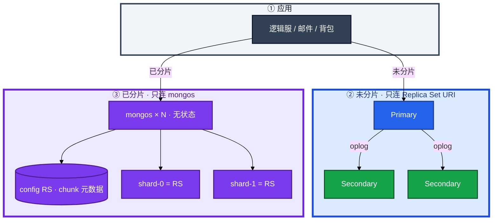
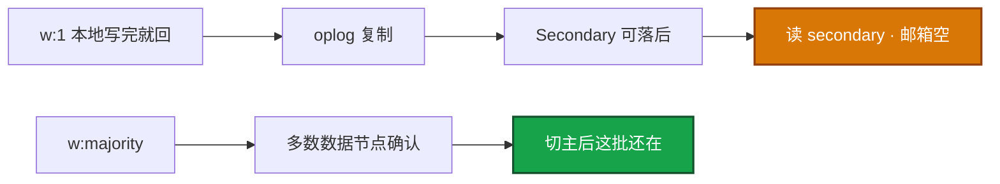
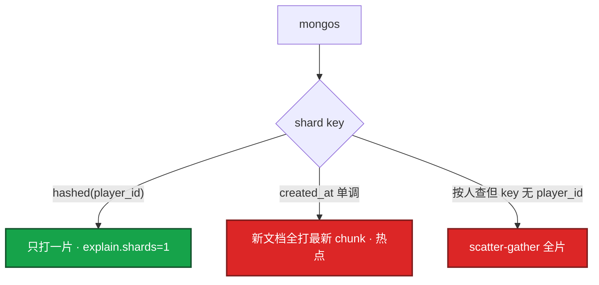
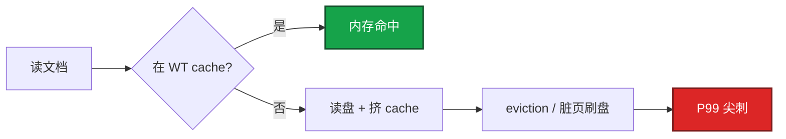
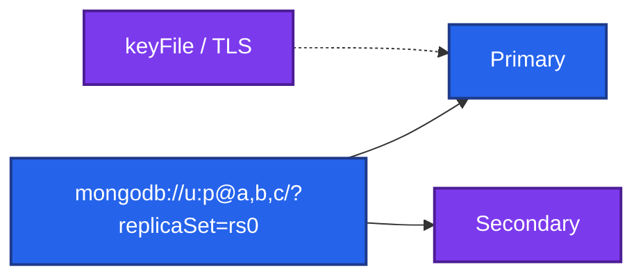
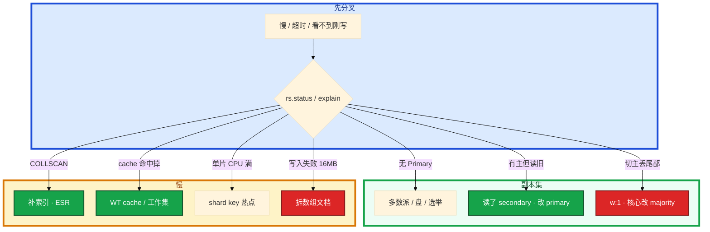

# MongoDB


活动高峰，邮箱打不开。有人把读偏好改成 `secondary` 分担压力，玩家说刚领的邮件没有；另有人要把测试 TTL 打到生产集合；群里准备 `mongorestore` 只还 Mongo。

先别动手。这一章后半全是你会动手的：**怎么查副本集和慢查询、怎么加成员/加片、怎么备份 restore、缓存打满和 16MB 分别怎么止血。** 前面的概念和原理，是为了让你动手时不选错路。

**读完你能：** 白板上画出副本集和分片差在哪；刚写立刻读走哪；shard key 选错能说出后果；玩家文档哪些嵌哪些拆；会备份、滚动升级、失败回滚、换机器/换盘。

**本章主线（排障就按这三步想）：**

1. **分层**：应用 URI/mongos → 副本集 Primary 或分片；权威仍在 MySQL，Mongo 是文档层。
2. **归类**：刚写看不见 → 读 secondary/w:1；慢 → COLLSCAN/WT cache；16MB → 文档模型。
3. **留证**：`rs.status()` + `explain` + profiler，切主后 URI 不能写死 IP。

## 本章目录

- [1. 基本概念](#1-基本概念)
- [2. 架构图](#2-架构图)
- [3. 原理](#3-原理)
  - [3.1 副本集](#31-副本集写关注与读偏好)
  - [3.2 分片与 shard key](#32-分片与-shard-key)
  - [3.3 玩家文档模型](#33-玩家文档模型)
  - [3.4 WiredTiger 缓存](#34-wiredtiger-缓存)
  - [3.5 索引 / TTL / 16MB](#35-索引-ttl-16mb)
- [4. 落地](#4-落地)
  - [4.1 生产怎么选](#41-生产怎么选)
  - [4.2 落地你实际看到什么](#42-落地你实际看到什么)
- [5. 核心配置](#5-核心配置)
- [6. 命令与操作](#6-命令与操作)
  - [6.1 备份](#61-备份)
  - [6.2 多数派还在](#62-多数派还在换成员)
  - [6.3 restore 与 PITR](#63-restore-与-pitr)
  - [6.4 加片与均衡](#64-加片与均衡)
  - [6.5 升级](#65-升级)
  - [6.6 回滚](#66-回滚)
  - [6.7 迁移](#67-迁移换盘改-ip)
- [7. 生产排障](#7-生产排障)
- [8. 必会 · 常考](#8-必会-常考)
- [合上书](#合上书问自己)

**本章不讲：** 强事务、JOIN、Explain 方法论 → [01 MySQL](../01-MySQL/)；合服冲突、映射、窗口 → [08-02](../../08-游戏运维专题/02-开服合服/)；备份 RPO、误操作回档流程 → [08-07](../../08-游戏运维专题/07-玩家数据备份与回档/)；全文检索、倒排 → [09 Elasticsearch](../09-Elasticsearch/)；消息积压、发奖流水 → [05 Kafka](../05-Kafka/)。

---

## 1. 基本概念

MongoDB 存的是 **BSON 文档**（类 JSON），同一集合里字段可以不一样。适合装备、邮件、活动存档这种「结构常变、天然嵌套」的数据。不适合订单那种要跨很多实体做强事务、复杂 JOIN 的账。

逻辑服插入一封邮件：

```javascript
db.mail.insertOne({
  _id: ObjectId(),
  player_id: 10001,
  title: "开服奖励",
  items: [{ item: "diamond", count: 50 }],
  expire_at: ISODate("2026-09-26T00:00:00Z")
})
```

未分片时这条写打到副本集的 Primary；已分片时客户端连 **mongos**，由 shard key 决定落哪一片。

三个角色不要混：

| 角色 | 干什么 |
|------|--------|
| **Replica Set** | 内置选主的高可用；**不**水平扩展写 |
| **Shard 集群** | mongos + config RS + 多片；每片本身仍是副本集 |
| **应用 URI** | 连副本集地址或 mongos，**不要写死某一台 IP** |

| 在 Mongo 里 | 不在 Mongo 里 |
|-------------|---------------|
| 玩家存档、装备、邮件、灵活活动字段 | 钱包、发货账本（仍以 MySQL 为准） |
| 单文档原子；TTL 过期文档 | 跨实体强一致转账 |
| WiredTiger 缓存里的热文档 | 全文倒排（去 09 ES） |

适用：灵活 schema、文档嵌套、要按文档水平拆。  
不适用：多表关联、跨文档强一致账本、固定约束。单文档操作是原子的；4.0+ 副本集多文档事务、4.2+ 分片事务能用，但慢、限制多，**不是选型理由**。要复杂事务回 MySQL。可以并存：进度在 Mongo，账在 MySQL。

> **记住**：有事务 ≠ 适合当账本。应用连 replica set URI 或 mongos，不要写死旧主 IP。

---

## 2. 架构图

先把整张图钉住。后面切主、分片、缓存、排障都对着这张图说话。

**副本集 vs 分片** 是本章最容易混的一对：副本集解决「主挂了谁顶」；分片解决「一张集合写不下、热打在一台」。分片的每一片 **仍然是一套副本集**。不要把 Secondary 当成「分片」。



图上三条线：

1. **未分片没有 mongos。** 直连某一台 Secondary 当「读写分离入口」会在切主后连错。
2. **mongos 无状态**，可多台；**config server 挂了**路由元数据不可用，比丢一个 shard 更像全站。
3. **每片都是 Replica Set**。片的高可用仍靠该片的多数派，不是靠「片数够多」。

单文档示例（玩家+有界背包可以嵌；邮件不要嵌，见 3.3）：

```javascript
{ _id, player_id, name,
  inventory: [{ item: "sword", count: 1 }],
  updated_at: ISODate(...) }
```

---

## 3. 原理

原理只保留动手和面试会用到的：刚写为什么从库没有、key 怎么选、文档怎么拆、缓存为什么比加 CPU 先看。

**本节 5 块：** 3.1 副本集 · 3.2 分片 · 3.3 文档模型 · 3.4 WT 缓存 · 3.5 索引/TTL/16MB

### 3.1 副本集：写关注与读偏好

副本集 = 内置选主的主从。Primary 接写；Secondary 复制 oplog。**Arbiter** 只投票不存数据，用来凑奇数——生产能三数据节点就不要用 Arbiter 顶容灾，Arbiter 不提供数据副本。`w: majority` 要的是 **数据节点**多数。两个数据节点 + Arbiter 的容灾比三数据节点弱，磁盘坏一块就少一份数据。

玩家刚领完邮件立刻打开邮箱。应用用了 `readPreference=secondary`。



逐步对应你眼睛看到的：

1. **insert 返回成功（`w: 1`）**  
   Primary 本地写完就回。Secondary 还在追 oplog。这时读 Secondary，邮箱是空的。客诉会说「回档了」——其实是复制延迟。

2. **`w: majority` 才等多数副本确认**  
   核心邮件/交易用 majority。切主窗口里部分写会失败，应用要重试且幂等（流水号），否则 majority 也会写出重复文档。本地 `w: 1` 更快，切主可能丢最后几笔。打点、可丢的日志才 w:1。

3. **读偏好怎么选**

| 偏好 | 行为 | 坑 |
|------|------|-----|
| `primary` | 只读主 | 强一致；读把主打满 |
| `secondary` | 只读从 | **刚写立刻读可能旧** |
| `nearest` | 最近节点 | 跨 AZ 延迟低，一致性不保证 |

游戏：刚发的邮件立刻打开邮箱，读 Secondary 可能看不到。邮箱、背包、充值结果走 `primary`；排行榜展示、非即时邮件列表才考虑 secondary。延迟大时先修从库，不要把读流量加到已经落后的节点。

故障转移：旧主挂了，多数派选出新主（秒级）。这和 MySQL + MHA/Patroni 比：**选主是内置的**，开箱简单；生态上 binlog CDC、级联复制不如 MySQL/PG 灵活。Mongo 副本集主要是 HA 和读分担，不是异构同步中枢。应用必须连 replica set URI，不能直连旧主 IP。

读关注 `linearizable` 贵，默认不必开。

监控：副本集状态、选举次数、**oplog 窗口**、复制延迟。从库断很久再连，oplog 已经转掉，只能全量同步。延迟持续涨先看 Secondary 磁盘和慢查询。

### 3.2 分片与 shard key

水平扩展按 **shard key** 把文档打到不同 shard，每片本身仍是副本集。客户端连 mongos，不要直连某一片的 Primary 当「分片」。条目没到过亿、单副本集盘和 CPU 还够，**不要为了架构图先上分片**。

运营查 `player_id=10001` 的邮件。mongos 看 shard key 能不能定位到片。



选 key 三条：

1. **高基数**：值够多才能打散。状态枚举、活动 id 不行。
2. **写入均匀**：不要所有新行都落同一片。单调递增（时间戳、自增 id）会打最新 chunk。
3. **查询能定位到片**：按玩家查邮件，key 里要有 `player_id`。

好的例子：哈希后的 `player_id`，或 `player_id` + 一个查询常用字段的复合。差的例子：时间戳、状态枚举、活动 id。

选错三种后果：数据不均；整点活动全打一个 key；查询 scatter-gather 拖全集群。哈希 key 对**范围查询不友好**（按时间扫邮件会跨片）。范围查询多就用复合键，或时间查询走别的库/索引，不要为了范围把单调时间当 shard key。

shard key **一旦定了极难改**（4.2 以前基本要迁集合；4.2+ 能改但重、风险大）。这是 MongoDB 最难撤回的决策，上线前用真实查询模式压一遍。

组件：mongos 路由；config server 存 chunk 分布（本身也是副本集，挂了路由元数据不可用）；shard 存数据。chunk 迁移是均衡器的事，活动高峰不要开激进均衡，迁移会抢 IO。

> **记住**：shard key 要能定位查询、打散写入；单调键会热点，定错极难改。副本集抗的是节点故障，分片抗的是数据量和写入面。

### 3.3 玩家文档模型

游戏最容易把「一个玩家」做成一张无限涨的大文档。模型对了，TTL、16MB、分片、合服才有地方下手。

| 数据 | 嵌进玩家文档 | 独立集合 |
|------|--------------|----------|
| 昵称、等级、头像、登录时间 | 可以，字段稳定 | — |
| 装备栏有上限（例如 200 格） | 可以嵌数组 | 格数会涨到上千则拆 |
| 邮件、聊天、日志、好友列表 | **不要** | `{ player_id, ... }` 一封/一条一行 |
| 金币流水、交易 | 不要 | 账在 MySQL；Mongo 最多存展示摘要 |

```javascript
// 对：邮件一封一个文档，TTL 能删其中一封
db.mail.insertOne({ player_id: 10001, title: "...", expire_at: ISODate(...) })

// 错：嵌进 player.mails[] —— TTL 删的是整玩家；数组推向 16MB
```

拆开之后还要分片吗？条目过亿再分片，shard key 仍用 `player_id`，保证一个人的道具/邮件在一片，避免按人查扫全网。好友列表短期可嵌，无限涨会撞 16MB，查询和复制都会变重。

合服时 Mongo 集合同样要映射 `player_id`，TTL 邮件可以按服删或按过期自然清，不要在合服窗口对超大集合新建索引。回档对齐 08-07：只还 Mongo、不还 Redis/MySQL，玩家会看到「一半新一半旧」。

止血撞 16MB：拆集合、禁止再往该数组写、给客户端降级空背包而不是卡死登录。根因是数据模型把「一对多」塞进单文档。

### 3.4 WiredTiger 缓存

存储引擎是 **WiredTiger**。热文档应在 WT cache 里；cache 打满就 eviction，读打到盘上，表现像「Mongo 突然变慢」。先看缓存命中和慢查询，不要先加 CPU。



| 项 | 口径 |
|----|------|
| 默认大小 | 大约 **(RAM − 1GB) / 2**，随版本略有差异 |
| 工作集 | 热数据应能进 cache；cache 8GB、工作集 40GB 会持续读盘 |
| 不要 | cache = 全部 RAM（OS、连接、排序、oplog 还要内存） |
| 脏页 / eviction | 脏比例高、eviction 扫不过来 → 写入 stall |
| checkpoint | 定期把脏页落盘（常见约 60s 量级），会抖 P99 |

内存不够先加内存或减工作集（索引过大、COLLSCAN、大数组文档），别先加 CPU。监控 WT cache 命中、脏页比例、eviction 时间。和 Redis 的「热数据在内存」是同一类题，只是引擎名不同。

### 3.5 索引 / TTL / 16MB

索引类型和关系库类似：单字段、复合、哈希（分片用）、文本、地理。复合索引记 **ESR**：Equality → Sort → Range，等值在最左，再排序，再范围。

```javascript
db.players.createIndex({ player_id: 1 })
db.players.createIndex({ name: 1, level: -1 })   // 复合，注意 ESR
db.mail.createIndex({ player_id: 1, time: -1 }) // 等值 player_id，再按 time 排
```

没索引的大查询 = **COLLSCAN**，主从都会被拖死。上线前用 `explain` 看是 `IXSCAN` 还是 `COLLSCAN`。卡住先看哪：慢查询先 `explain`，看到 `COLLSCAN` 就补 `player_id` 索引，不要先加 CPU。每个字段都建单索引不行：写放大、内存浪费（还占 WT cache），优化器也不一定用到。按真实查询建，定期砍无用索引。文本检索、倒排不是 Mongo 的长项，要搜日志内容去 09 ES。

**TTL 索引**按日期字段到期删文档，适合邮件、公告、验证码、短期日志，不适合金币和背包。

```javascript
// 邮件 30 天后过期；TTL monitor 默认约 60s 扫一轮，不是整点准时删
db.mail.createIndex(
  { expire_at: 1 },
  { expireAfterSeconds: 0 }   // 到 expire_at 这个时刻过期
)
// 或：从 created_at 起 86400 秒
db.logs.createIndex(
  { created_at: 1 },
  { expireAfterSeconds: 86400 }
)
```

一封邮件到期后：TTL monitor 大约每 **60s** 扫一轮索引，到点的文档在 **Primary** 上删掉，再复制到 Secondary。不是整点准时、也不是秒级精确，积压时更慢。「过期了还看得到」先看 monitor 和索引是否建在日期字段上。不会两边各删各的；你看到的不一致更常见是读了落后的 Secondary。

生产注意：

1. TTL 删的是 **整篇文档**。一封邮件一个文档才适合；把 1000 封嵌进玩家文档的数组，TTL 删不掉其中一封，数组还会把文档堆向 **16MB** 上限。
2. 过期不是秒级精确，monitor 周期大约一分钟，积压时更慢。
3. 不要在业务高峰对超大集合新建 TTL，会扫索引。
4. 钱、道具、交易流水不要靠 TTL「自动清」。清档、合服是 08-02 / 08-07 的流程，不是 TTL。

单文档 **16MB** 硬上限。数组只 append 必撞。拆成 `{ player_id, item_id, count }`，或按页分文档。

---

## 4. 落地

### 4.1 生产怎么选

| 项 | 选 | 不选 |
|----|----|------|
| 拓扑 | 先 3 数据节点副本集；写不下再分片 | 一上来分片；2 数据节点 + Arbiter 当生产容灾 |
| 磁盘 | 独立 SSD；journal / data 分离更好 | 和游戏日志同盘 |
| 网络 | 同城多 AZ；应用连 URI / mongos | 跨 region 一套副本集当同步 |
| 连接 | replicaSet=... 或 mongos 列表 | 写死 Primary IP |
| 引擎 | WiredTiger cache 按内存留 OS | cache 吃光机器 |

托管 Atlas / 云 Mongo：问清备份 RPO、谁 restore、是否滚动、磁盘是否独立、WT cache 可见指标。

### 4.2 落地你实际看到什么



验收：进程在不算数。必须 `rs.status()` 有 Primary、延迟可接受；应用 URI 能在切主后自动换；`explain` 关键查询不是 COLLSCAN。分片集群再加：mongos 可连、config RS 健康、balancer 窗口不在活动整点。

---

## 5. 核心配置

只动有证据的项。写关注、读偏好、WT cache 三处改错会直接表现为「回档了」或「突然慢」。

| 参数 | 常见默认 | 生产怎么用 | 改错会怎样 |
|------|----------|------------|------------|
| `w` | 1 | 核心邮件/交易 **majority** | w:1 切主丢尾部 |
| `readPreference` | primary | 邮箱背包 **primary** | secondary = 刚写看不见 |
| `wiredTigerCacheSizeGB` | 约 (RAM-1GB)/2 | 热数据能进；给 OS 留内存 | 设成全部 RAM → OOM / 抖 |
| `slowms` / profiler | 关或 100ms | 排障临时开，看完关 | 长期 0 级打满盘 |
| TTL | 无 | 邮件独立文档 + 日期字段 | 嵌套数组或 TTL 清钱 |

> **记住**：刚写立刻读走 primary；cache 比乱加 CPU 更先看。linearizable 贵，默认不必开。

---

## 6. 命令与操作

| 目的 | 命令 | 看什么 |
|------|------|--------|
| 副本集 | `rs.status()` | 成员、延迟、谁是主、选举 |
| 当前操作 | `db.currentOp()` | 谁在跑、是否卡住 |
| 慢查询 | `db.setProfilingLevel(1, { slowms: 100 })` 然后 `db.system.profile.find()` | COLLSCAN / 时长 |
| 计划 | `db.mail.find({player_id:10001}).explain("executionStats")` | IXSCAN vs COLLSCAN；分片看 `shards` |
| 建索引 | `createIndex` | ESR；高峰勿对超大集合新建 |
| dump | `mongodump` / `mongorestore` | 逻辑备份，大库慢 |

值班先跑这几条：

```javascript
rs.status()
db.currentOp()
db.setProfilingLevel(1, { slowms: 100 })
db.system.profile.find().sort({ ts: -1 }).limit(5)
```

指标：连接数、profiler 慢查询、副本延迟、oplog 窗口、chunk 是否倾斜、**WiredTiger cache 命中 / 脏页 / eviction**。证书或 keyFile 失败表现为成员拆伙，和 5xx 分开看。

---

### 6.1 备份

`mongodump` / `mongorestore` 逻辑备份，大库慢。文件系统快照做物理备份。oplog 类似 binlog，可增量、可 **PITR**。至少按 RPO 打；发版、合服、改 shard key 前加打一份。异地留。本机定时 dump 不算演练过的备份。

回档不要只还 Mongo：玩家进度往往还在 Redis / MySQL，必须按 08-07 对齐 RPO，禁止直接改库「补一下」。恢复前先停写、对条数和对账，再开流量。

### 6.2 多数派还在：换成员

3 数据节点丢 1，多数派还在：**不要**全量 restore。`rs.status` 确认还有 Primary → `rs.remove` 坏节点 → 新机器配盘和复制密钥 → `rs.add` → 追 oplog。oplog 窗口不够会全量初始同步，窗口期会打盘。

Arbiter 顶上来不算「数据冗余回来了」。

### 6.3 restore 与 PITR

多数派没了、数据目录损坏、误 TTL 扫库：停写窗口，用快照 + oplog 放到时间点。只 restore Mongo、不还 Redis/MySQL = 半新半旧，比不还更糟。误把测试 TTL 打到生产：不要一上来 `mongorestore` 覆盖整个库，先定范围、审批、防二次伤害（08-07）。

卡住：restore 完应用仍连旧 IP → URI 要用副本集；条数对不上 → 停写对账。

### 6.4 加片与均衡

先确认 shard key 没选错，否则加片只是把热点换个地方。加片 = 新副本集加入、balancer 迁 chunk。活动高峰 **关掉或收紧 balancer 窗口**，迁移抢 IO。均衡器不是「CPU 高就开」。

### 6.5 升级

先对官方兼容的版本路径，不能凭最新硬上。

1. **先快照 + dump 关键集合条数**。
2. **滚动**：先 Secondary，再 stepDown Primary。始终保多数派。
3. 不要三台同时换包；FCV（featureCompatibilityVersion）升过，降级往往不能靠换回二进制。
4. 分片集群：config RS → shard → mongos 按官方顺序。

### 6.6 回滚

FCV / 数据文件升过，默认 **不能靠换回旧二进制**。回退 = 升级前快照 restore（停写，对齐 7.3）。没有升级前快照 = 没有回滚。一台落后先看该节点盘和复制，必要时按 7.2 摘掉重加，不要三台一起回滚。

### 6.7 迁移：换盘、改 IP

- **换机器** = 7.2 加新成员、再删旧成员。
- **只换盘：** 先确认不是唯一数据副本 → 停该成员 → 拷 dbPath → 拉起 → 追平。
- **改 IP：** replica set 成员地址要 `rs.reconfig`，应用 URI 同步改。写死 IP 的客户端会在切主后全部失败。

未分片改分片是项目，活动中不要做。

---

## 7. 生产排障

三问：还能不能写？读到的是不是刚写的？已有玩家文档还在不在？

**Primary 切了 ≠ 立刻回档。** 读 secondary 导致「邮件没了」先换 primary 再查延迟。



现场顺序：

```javascript
rs.status()
db.currentOp()
db.system.profile.find().sort({ ts: -1 }).limit(5)
// explain 是否 COLLSCAN、分片是否 scatter
// WT cache 命中、脏页、eviction
```

| 现象 | 先做什么 | 不要做什么 |
|------|----------|------------|
| 刚领邮件列表没有 | 读偏好、复制延迟 | 当回档去 restore |
| COLLSCAN CPU 满 | 补 player_id 索引 | 先加 CPU |
| 单片热点 | 查 shard key 是否单调/活动 id | 高峰开激进 balancer |
| 背包打不开 16MB | 拆集合 | 继续往数组 append |
| 「突然变慢」内存够 | WT cache 命中 | 先加 CPU |
| 误 TTL 删邮件 | 08-07 对齐 Redis/MySQL | 只 mongorestore 覆盖整库 |
| oplog 窗口过短 | 修从库延迟、加大窗口 | 从库断很久还指望增量 |

常见误判链：文档数组只 append → 16MB；读 Secondary 当强一致 → 复制延迟；shard key 用活动 id → 整点一片打满。

---

## 8. 必会 · 常考

白板和追问高频，能一口回：

| 说法 | 对错 | 口径 |
|------|:----:|------|
| Mongo 有事务就能当支付库 | 错 | 多文档事务不是选型理由 |
| 副本集 = 水平扩展写 | 错 | 副本集是 HA；扩写靠分片 |
| Secondary 就是分片 | 错 | 每片自己是一套副本集 |
| 刚写立刻读 secondary 一定能看见 | 错 | 复制延迟；邮箱走 primary |
| w:1 切主不丢 | 错 | 可能丢最后几笔 |
| Arbiter 算一份数据副本 | 错 | 只投票 |
| shard key 用 created_at 最自然 | 错 | 单调键热点 |
| 哈希 key 范围查询也很好 | 错 | 跨片 scatter |
| shard key 随时能改 | 错 | 极难改 |
| TTL 嵌在玩家数组里能删一封邮件 | 错 | 删整篇文档 |
| TTL 是整点准时、秒级 | 错 | monitor ~60s |
| 钱可以 TTL 自动清 | 错 | 走合服/回档流程 |
| Mongo 突然慢先加 CPU | 错 | 先 COLLSCAN 和 WT cache |
| 只还 Mongo 就算回档 | 错 | 要对齐 Redis/MySQL |
| 每个字段建一个索引 | 错 | 写放大、占 cache |

数字：单文档 **16MB**；TTL monitor 约 **60s**；三数据节点；WT cache 约 **(RAM−1GB)/2**；邮件独立文档 + `expireAfterSeconds`。

易混：副本集 vs 分片；w:1 vs majority；primary vs secondary 读；嵌入 vs 引用；compact 式的 TTL vs 业务清档；COLLSCAN vs cache miss；mongos 无状态 vs config 有状态。

---

## 合上书，问自己

1. 什么数据进 Mongo、什么留 MySQL？应用连谁、为什么不能写死 IP？
2. 副本集和分片各解决什么？每片为什么还是副本集？
3. w:1 / majority、读 secondary 各会看到什么？Arbiter 的坑？
4. shard key 三条原则？单调键和哈希键各坑什么？
5. 玩家文档哪些嵌、哪些拆？TTL 和 16MB 怎么踩？
6. WT cache 打满什么样？备份怎样才算有？切主丢写怎么避免？

六题都能口述，这一章就过了。发奖流水回 05 Kafka；合服映射去 08-02。
