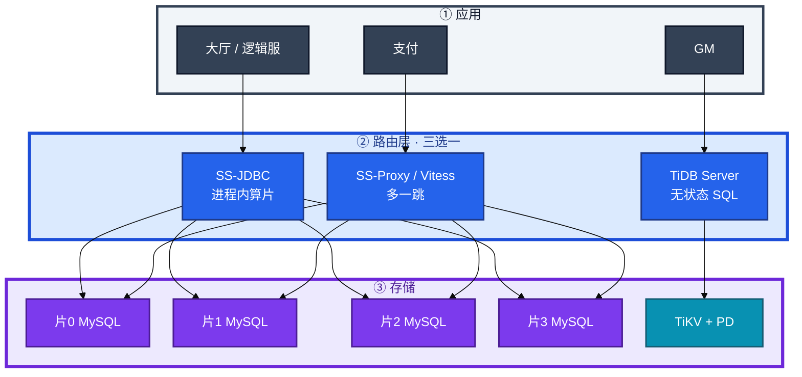
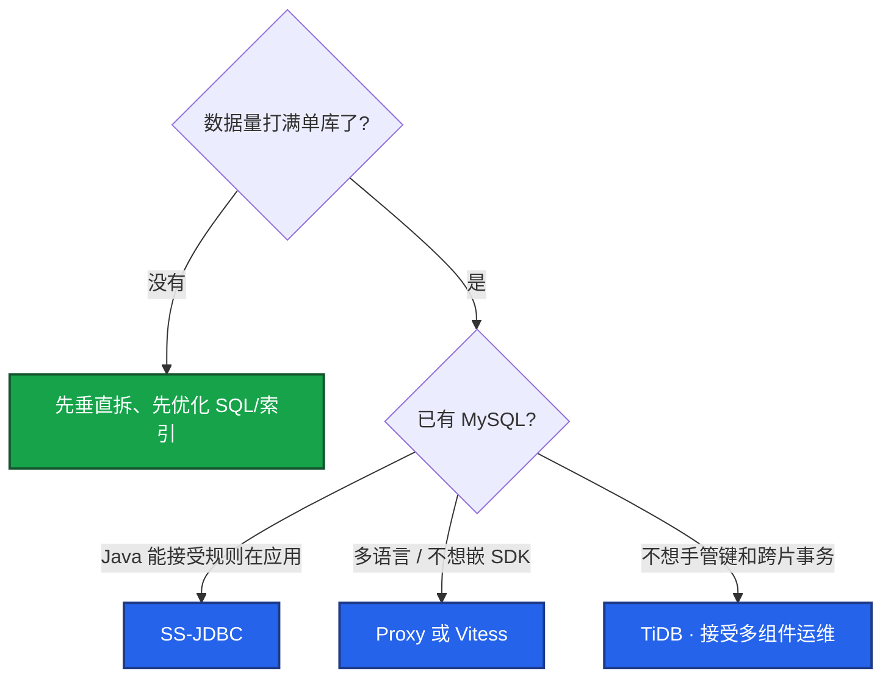
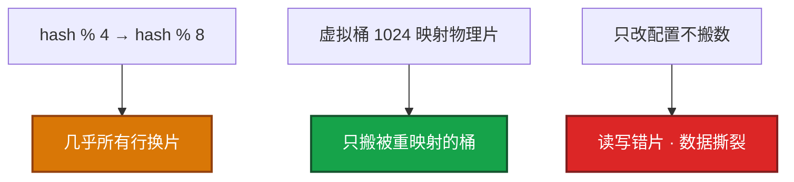
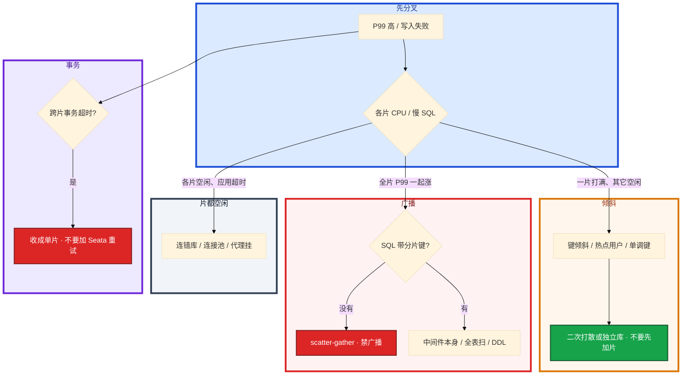

# 分库分表与中间件


活动整点前二十分钟，角色表已经 8000 万行，策划要加一列 `season_id`，DBA 说 DDL 至少锁两小时；写入把主库 CPU 顶到 95%，群里有人喊「上 TiDB」，另有人要把 `mysqldump` 跑完直接切 DNS——两边都没看过分片键长什么样。

**本章主线（排障就按这三步想）：**

1. **分层**：应用 → JDBC/Proxy/TiDB → 各片 MySQL；中间件只路由，键和跨片语义还在。
2. **归类**：单片满 → 键倾斜/热点；全片涨 → scatter-gather/无分片键；事务 → 先同键同片。
3. **留证**：各片慢日志是否带键、行数对账、迁移双写 + CDC 可回退。

**读完你能：** 白板上画出垂直和水平；判断该不该拆；选出分片键并说出选错的三种后果；跨片事务先设计避免再谈 Seata；会双写 + CDC 迁移和扩片；合服会留映射、回档整组回。

## 本章目录

- [1. 基本概念](#1-基本概念)
- [2. 架构图](#2-架构图)
- [3. 原理](#3-原理)
  - [3.1 拆分键](#31-拆分键路由均匀稳定)
  - [3.2 跨片语义](#32-跨片语义join事务聚合)
  - [3.3 跨库事务](#33-跨库事务为什么先别上-seata)
  - [3.4 全局 ID](#34-全局-id雪花号段uuid)
  - [3.5 合服映射](#35-合服映射键和-id-必须预留位置)
- [4. 落地](#4-落地)
  - [4.1 生产怎么选](#41-生产怎么选)
  - [4.2 落地你实际看到什么](#42-落地你实际看到什么)
- [5. 核心配置](#5-核心配置)
- [6. 命令与操作](#6-命令与操作)
  - [6.1 备份](#61-备份)
  - [6.2 不停机迁移](#62-不停机迁移双写-cdc)
  - [6.3 扩容迁移](#63-扩容迁移4-变-8)
  - [6.4 合服数据迁移](#64-合服数据迁移)
  - [6.5 回档](#65-回档整组同一时间点)
- [7. 生产排障](#7-生产排障)
- [8. 必会 · 常考](#8-必会--常考)
- [合上书](#合上书问自己)

**本章不讲：** 单库索引、事务、DDL、主从 → [01 MySQL](../01-MySQL/)；合服窗口、审批、回滚流水线 → [08-02 开服合服](../../08-游戏运维专题/02-开服合服/)；回档 RPO、多存储对齐 → [08-07](../../08-游戏运维专题/07-玩家数据备份与回档/)；分析型聚合、CH vs ES → [09 Elasticsearch](../09-Elasticsearch/)；Mongo 的 shard key → [06 MongoDB](../06-MongoDB/)。

---

## 1. 基本概念

分库分表把**数据和压力打散**。上了中间件不算分布式；中间件只是路由。目标是：大部分线上 SQL 落到单片，单片体积和写入都能扛，故障域不再是「一台挂全业务」。

**值班里什么时候碰到**：大厅要查 `uid=10001` 的背包。还没水平拆时，这条 SQL 打到唯一的 `game_db.bag`。拆完之后，同一条 SQL 必须能算出「去哪一片」，否则变成扫全部片——P99 从 20ms 飙到 800ms，监控上看「每片 CPU 都不高」，其实是 scatter-gather。

| 在分片里要解决的 | 分片解决不了的 |
|------------------|----------------|
| 单表千万～亿行、写入打满一台、大表 DDL、单实例故障面 | 慢 SQL 没索引、错误的事务隔离、从库延迟 |
| 把行按键打散到多库多表 | 「全局随便 JOIN 还很快」 |
| 游戏跨服、全服邮件、合服时「片」暴露出来 | 合服冲突、回档窗口（那是 08 的数据面） |

三种不要混：

| 做法 | 干什么 | 不干什么 |
|------|--------|----------|
| **垂直拆分** | 按业务拆库（账号 / 支付 / 玩法），或把大字段拆到副表 | **行数还在一张表里涨** |
| **水平拆分** | 按分片键把行分散到多表/多库 | 不自动消灭跨片 JOIN / 事务 |
| **读写分离** | 读打从库，扛读流量 | 不解决单表行数和 DDL；从库延迟规则和 01 一样 |

**打个比方**：垂直拆分像把「仓库、收银台、客服」分到三栋楼——各干各的，但某栋楼里的货架仍会满。水平拆分像同一类货架按客户编号分到四个库房——找某个客户的东西只进一个库，但「按商品编号全局搜」得跑四个库。读写分离是多加几个「只读副本」，客人看价签不打收银台，**货架本身还是那一套**。

生产顺序通常是：先垂直（账号、支付、玩法分开）→ 单表仍撑不住再水平。游戏区服本身就是一种垂直 + 水平：**一服一库**。跨服玩法、全服邮件、合服，才会把「片」暴露出来。不要把所有玩法一张全球表哈希了事。

分片之后每一片仍是一套 MySQL：索引、DDL、主从延迟、备份，规则还在。别把「上了 Proxy」理解成两种问题一起消失。

> **记住**：先垂直隔离业务，再水平打散行。水平才引入跨片。数据量没打满单库、慢 SQL 没索引，先看 01，不要上分布式。

> **别混**：读写分离 ≠ 分片；垂直拆库 ≠ 行数问题解决；上了中间件 ≠ 分布式事务自动搞定。

---

## 2. 架构图

先把整张图钉住。后面选型、配置、排障都对着这张图说话。



**读图四句话：**

1. **从应用往下查**：慢 SQL 先看应用有没有带分片键 → 再看中间件路由日志 → 最后看各片 MySQL 慢日志，**不要跳层 blaming 中间件**。
2. **SS-JDBC**：Java 进程内算片，直连各 MySQL，少一跳；规则随应用发版，改键 = 发版。
3. **SS-Proxy / Vitess**：应用连代理再连各片，多语言统一入口；代理本身是容量和故障点，要 2+ 节点。
4. **TiDB**：应用连 TiDB Server，TiKV 按 region 自动打散；你改管 PD / TiKV，不是「换驱动就完事」。

TiDB 一眼：TiDB Server 无状态 SQL 层，TiKV Raft 多副本，PD 调度。优势是自动打散、分布式事务对应用透明；代价是组件多、小数据量杀鸡、排查要懂 region。Vitess（vtgate）K8s 常见，**分片键和跨片限制还在**。不要两种路由同时管同一张表。

---

## 3. 原理

原理只保留动手和面试会用到的：键怎么选、跨片为什么贵、事务为什么先别上 Seata、合服为什么会撞 id。

**本节 5 块：** 3.1 拆分键 · 3.2 跨片语义 · 3.3 跨库事务 · 3.4 全局 ID · 3.5 合服映射

### 3.1 拆分键：路由、均匀、稳定

**一句话：** 分片键决定 SQL 打几片；键选错比选中间件更致命，改键等于再迁一次。

**打个比方**：像快递分拣——按收件人手机号分拣，查某人的包裹只开一个格口；按「下单日期」分拣，今天所有包裹堆同一个格口，快递员忙死别的格口空着。

**现场走一遍**（逻辑服查背包，P99 突然从 20ms 到 800ms）：

1. 登录 Proxy 管理口或各片 MySQL，拉最近 5 分钟慢 SQL：

```bash
# 片 0～3 各执行
mysql -h 10.0.1.11 -e "SELECT sql_text, rows_examined FROM mysql.slow_log ORDER BY start_time DESC LIMIT 5\G"
```

2. 屏幕出现两种典型形态：

```text
# 形态 A — 只有片 2 有记录（正常）
SELECT * FROM bag WHERE user_id=10001 LIMIT 50;
rows_examined: 48

# 形态 B — 四片都有同一条 query_id（广播）
SELECT * FROM bag WHERE item_id=88888;
rows_examined: 12000000   # 每片都扫千万行
```

3. **说明什么**：形态 A 带了 `user_id`，中间件只路由到 `hash(10001) % 4 = 片 2`。形态 B 只有 `item_id`，中间件对 4 片都发 SQL 再合并——scatter-gather，全片 P99 一起涨。

4. 下一步：形态 B 查代码谁漏了分片键；形态 A 但单片 CPU 90%、其它 10% → 查热点用户或大 R，不是加片。第三种：键是 `created_at` 或自增 → 写入打最新片，热点。

**输出解读**（路由审计一行）：

```text
2026-08-28 14:02:11 route: ds2.bag_2, shard_key=user_id=10001, cost=0.3ms
2026-08-28 14:02:12 route: ds0,ds1,ds2,ds3 broadcast, reason=missing_shard_key
```

| 字段 | 正常 | 异常 |
|------|------|------|
| `route:` | 单个 `dsN` | `ds0,ds1,ds2,ds3` = 广播 |
| `shard_key=` | 有 `user_id=xxx` | `missing_shard_key` |
| `cost=` | < 1ms | 合并结果时 > 10ms 要查 |

三种常见策略：

| 策略 | 做法 | 适合 | 坑 |
|------|------|------|-----|
| 范围 | id 1–1e7 在片 1 | 范围扫描、按月归档 | 递增写入打最新片 |
| 哈希 | `hash(user_id) % N` | OLTP 打散写入 | 范围查询要扫全片；**N 一变几乎全表搬家** |
| 一致性哈希 | 节点落在环上 | 加减节点少迁移 | 仍要处理热点和跨片；**不能免掉选键** |

选键五条（缺一条都会在线上现原形）：

1. **查询能定位单片**：主路径 80% 以上的 QPS 带这个键。按人查就用人。
2. **高基数、写入均匀**：避免活动 id、状态枚举、区服号这种低基数。
3. **关联表同一个键**：用户、订单、背包都按 `user_id`，从设计上避免跨片 JOIN。
4. **稳定**：键写入后不应变。`user_id` 几乎不变；`guild_id` 会换会、会合会，不适合当主键路由。
5. **给合服留映射**：游戏角色 id 不要把「区服内自增」当真全局。见 3.5。

选错三种后果：某片过载、热点、大量 scatter-gather。热点不会因哈希消失（大 R、明星公会）；只分表不分库扛不住写入打满；虚拟桶 1024 只减扩片搬家，不代替选键。

**面试怎么说**：「我选分片键看三条：主路径查询能带键落单片、写入均匀、关联表同键。不带键的 SQL 我会拦或改设计，不会靠 Proxy 扛广播。改键或改取模 N 都是迁移项目，不是改配置。」

> **记住**：线上查询要能落到单片；一致性哈希只减少扩片搬家，不代替选键。

---

### 3.2 跨片语义：JOIN、事务、聚合

**一句话：** 分片难点在跨片语义；设计上避免，真避免不了再上分布式事务或分析库。

**打个比方**：四个独立仓库，要查「A 仓的客户买了 B 仓的货」——要么事先把相关货放同一仓（同键同片），要么跑四个仓再人工汇总（应用层两次查），不能指望仓管员自动帮你全球 JOIN。

**现场走一遍**（支付扣钻石 + 写订单，偶发超时）：

1. 看表结构：用户在 `player` 按 `user_id` 分片，订单在 `orders` 按 `order_id` 分片——**键不一致**。
2. 抓一条失败事务的 SQL 日志，Proxy 显示：

```text
BEGIN
UPDATE player SET diamond=diamond-100 WHERE user_id=10001   → ds1
INSERT INTO orders (order_id, user_id, ...) VALUES (...)      → ds3
-- 跨片，未在同一 InnoDB 事务
COMMIT timeout after 5000ms
```

3. **说明什么**：两片各开一个本地事务，中间件或应用要协调；没设计好就超时或半成功。
4. 修法：订单表也按 `user_id` 分片，和 `player` 绑成 binding table，一条 SQL 落同片。

**输出解读**（跨片聚合 `COUNT(*)` 各片结果）：

```text
片0: 1,024,500
片1: 1,018,200
片2: 1,031,800
片3: 1,025,500
合计: 4,100,000   # 中间件 merge，比单片慢 4 倍+
```

| 场景 | 默认做法 | 别做 |
|------|----------|------|
| 跨片 JOIN | binding table 或应用层两次查 | OLTP 全服随便 JOIN |
| 跨片聚合 | 下沉分析库 / ES / CH | 事务库上大跨度 sum/sort |
| 字典表 | `broadcastTables` 每片一份 | 把用户表当广播 |

「上了 TiDB 就不会跨片了」——应用乱 JOIN 照样慢，只是引擎在扛。大跨度 JOIN、热点 region 照样疼。

**面试怎么说**：「跨片 JOIN 我优先同键同片 + bindingTables；聚合走分析库。TiDB 协议兼容不等于代价消失，应用仍要按数据分布设计。」

---

### 3.3 跨库事务：为什么先别上 Seata

**一句话：** 跨片事务的正确解法是让它不再跨片，不是换 Seata 开关。

**打个比方**：两个城市各有一个银行，转账要两边同时扣款——要么把钱事先都汇到同城一个账户（单片事务），要么走央行两阶段清算（慢、会堵）；别在高峰期临时发明「电话确认两边都扣了」。

**现场走一遍**（活动整点扣道具 + 写流水，Seata 全局锁超时）：

1. 监控：`seata_global_lock_wait` 飙红，业务报 `Global lock timeout`。
2. 看事务涉及表：`bag` 在片 1、`flow_log` 在片 2——设计时按不同键拆了。
3. **说明什么**：Seata AT 要全局锁 + undo，冲突重；活动高峰等于把协调者变单点。
4. 修法：流水也按 `user_id` 分片，收成单片 InnoDB；或改最终一致 + 本地消息表异步补。

**输出解读**（Seata 超时日志）：

```text
Global lock timeout, xid=192.168.1.10:8091:1234567890
branch: ds1 UPDATE bag ...
branch: ds3 INSERT flow_log ...
```

| 字段 | 含义 | 你的动作 |
|------|------|----------|
| `Global lock timeout` | 等全局锁超过阈值 | 不要加超时重试，改同片 |
| 两个 `branch` 不同 ds | 跨片 | 表改同键或改 Saga |

| 方案 | 怎么做 | 代价 | 游戏里什么时候才碰 |
|------|--------|------|-------------------|
| **单片本地事务** | 同键同片，InnoDB 提交 | 几乎无额外代价 | **默认该走的路** |
| **XA / 2PC** | 各片 prepare 再 commit | 协调者挂了会阻塞 | 几乎不要在活动高峰用 |
| **TCC** | Try / Confirm / Cancel | 业务要写补偿 | 支付渠道回调，不是背包扣道具 |
| **Seata AT** | 自动补 undo，全局锁 | 冲突重、回滚窗口长 | 能不用就不用 |
| **Saga / 出箱** | 本地事务写消息，异步补 | 最终一致；要对账 | 发邮件、跨服同步 |

**面试怎么说**：「跨片事务我先问能不能同 user_id 同片；必须跨片再问能不能最终一致 + 对账。Seata 不是魔法，活动高峰两阶段会把锁变成瓶颈。」

> **记住**：跨片 JOIN / 事务 / 聚合靠设计避免。真跨片先问能不能最终一致 + 对账，再问要不要两阶段。

---

### 3.4 全局 ID：雪花、号段、UUID

**一句话：** 各片自增会撞号；订单用雪花，别用 UUID 当 InnoDB 主键。

**打个比方**：四个分店各自发号码牌——1 号店发到 500、2 号店也发到 500，合并报表就撞了。要么总部统一发号（号段），要么牌上印时间 + 店号 + 序号（雪花）。

**现场走一遍**（合服前发现订单 id 重复）：

1. 片 0 和片 2 各查：

```sql
SELECT MAX(order_id) FROM orders;  -- 片0: 9000123
SELECT MAX(order_id) FROM orders;  -- 片2: 9000456
```

2. 两边都用 `AUTO_INCREMENT`，区间重叠——合服或跨片关联时撞 id。
3. 切雪花或号段，新订单 id 形如 `1847562901234567890`（64 位趋势递增）。

**输出解读**（雪花 id 结构，口算拆解）：

```text
id = 1847562901234567890
     │        │    └── 12 bit 序列 = 7890 mod 4096
     │        └─────── 10 bit 机器 = ...
     └──────────────── 41 bit 毫秒时间戳
```

| 方案 | 做法 | 适合 | 坑 |
|------|------|------|-----|
| 雪花 | 时间 + 机器 + 序列 | 订单号、日志 id | 时钟回拨要拒发或换 worker |
| 号段 / Leaf | 中心一次发 1000 个 id | 少打中心 QPS | 中心要高可用；进程崩溃浪费一段 |
| UUID | 无中心 | 临时、外部关联 | **无序**，InnoDB 主键页分裂 |

NTP 回拨：雪花 worker 要拒发或换 id，不要默默发重复。号段一次发一段（如 1000），应用内存里递增。

游戏角色 id 还要给合服留映射空间，别把「区服内自增」当真全局。

**面试怎么说**：「分片后不用各片 auto_increment 当全局 id，用雪花或号段。UUID 可以当业务字段，不当 InnoDB 聚簇主键。」

---

### 3.5 合服映射：键和 ID 必须预留位置

**一句话：** 合服不是中间件功能；两服 `user_id=10001` 哈希可能同片，id 仍冲突，必须映射表。

**打个比方**：两个班级合并，两边都有学号 7 号——合并后必须重新编全局学号，并更新所有「点名册、奖状、好友名单」上的旧号，不能只改班主任通讯录。

**现场走一遍**（合服后玩家收不到邮件，查是别人的）：

1. 服 A、服 B 合到服 C。哈希后两服 `user_id=10001` 都在 `db3`——中间件路由「正确」，但 **id 冲突**。
2. 合服脚本只改了 `player` 表，漏改 `mail` 表外键——邮件仍指向旧 id。
3. 查映射表：

```sql
SELECT old_sid, old_uid, global_id FROM merge_map WHERE old_sid=12 AND old_uid=10001;
-- 12, 10001, 120010001
```

4. `mail.to_uid` 仍是 `10001` 没改成 `120010001` → 邮件进错人。
5. **说明什么**：合服是业务数据面 + 全表外键，不是 Proxy「自动合并分片」。漏一片 = 二次伤害，整组回滚。

**输出解读**（合服对账）：

```text
player:  源A 50000 + 源B 48000 = 98000, 目标 98000  OK
mail:    源A 120000 + 源B 115000 = 235000, 目标 230000  DIFF -5000
```

| 结果 | 含义 | 动作 |
|------|------|------|
| player OK, mail DIFF | 外键漏改 | **停服，整组回滚**，不要线上 patch 单片 |
| 全 OK | 可开服 | 抽样 100 账号验邮件/公会 |

窗口、审批、回滚流水线见 [08-02](../../08-游戏运维专题/02-开服合服/)。回档必须 **所有相关片一起回** 到同一时间点，见 [08-07](../../08-游戏运维专题/07-玩家数据备份与回档/)。

**面试怎么说**：「合服我预留 merge_map，停写、全片同点备份、改全表外键、对账条数。中间件只路由，不会自动解决 id 冲突。漏改一片就整组回滚。」

> **记住**：分片键和全局 ID 设计要给映射留位置；回档粒度是「一组存储」不是「一张表」。

---

## 4. 落地

### 4.1 生产怎么选

| 方案 | 类型 | 你还管什么 | 适合 |
|------|------|------------|------|
| ShardingSphere-JDBC | 客户端分片 | 规则、键、扩片、跨片自己兜 | Java 为主，已有 MySQL |
| ShardingSphere-Proxy | 代理分片 | 多语言都能连，多一跳延迟 | 多语言、统一入口 |
| Vitess | 代理（YouTube） | 分片、连接池、K8s 生态 | MySQL 协议、云原生 |
| TiDB | 分布式数据库 | 少管分片键，管 PD/TiKV 运维 | 透明分片 + 分布式事务 + HTAP |
| MyCAT | 老代理 | 社区不活跃 | **不新上** |



已有 MySQL + Java → SS-JDBC 最轻。多语言 → Proxy 或 Vitess。要透明分片和原生分布式事务、有人能运维多组件 → TiDB。小数据量上 TiDB 是杀鸡。**TiDB 不是「不用管分片」，是改管另一套组件。**

选：先垂直、键按用户、关联表同键。不选：数据量没到就上分布式、按活动 id 分片、MyCAT 新上、两种路由管同一张表。

### 4.2 落地你实际看到什么

JDBC：规则在 `application.yml` / 注册中心，进程启动时加载。改规则 = 发版（或配置中心推送后重启连接）。每个实例都要能连 **全部片** 的地址。

Proxy / vtgate：前面挂负载均衡，应用只认一个入口。代理后面是各片主从。代理本身要 2+ 节点，探活、限流、连接池在这一层。

TiDB：至少 TiDB Server × 2、PD × 3、TiKV × 3。验收看 PD 健康、region 打散、不是「能连上 4000 端口」。

每片仍是 MySQL：独立数据盘、独立备份、独立监控。中间件挂了，JDBC 还能直连（如果应用兜了），Proxy 挂了应用进不去。

清单里必须有的（ShardingSphere 示意）：

```yaml
# ShardingSphere 示意 — 四片 + 同键绑定 + 字典广播
rules:
  - !SHARDING
    tables:
      bag:
        actualDataNodes: ds${0..3}.bag_${0..3}
        tableStrategy:
          standard: { shardingColumn: user_id, shardingAlgorithmName: bag_inline }
    shardingAlgorithms:
      bag_inline: { type: INLINE, props: { algorithm-expression: bag_${user_id % 16} } }
    bindingTables: [bag, player_mail, orders]
    broadcastTables: [item_dict]
```

验收：带分片键的 SQL 只打一片（看各片慢日志 / 代理审计）；不带键的 SQL 被拦或明确允许；对账 count 能对上。不要只探 Proxy TCP 端口。

---

## 5. 核心配置

只动有证据的项。改分片表达式等于改路由，必须当变更：备份、窗口、回滚。

| 参数 / 项 | 生产怎么用 | 改错会怎样 |
|-----------|------------|------------|
| `shardingColumn` | 主路径查询的那一列，通常 `user_id` | 选成 `order_id` / 时间 → 跨片或热点 |
| `algorithm-expression` / 取模 N | 与实际库表数一致；扩片不能只改 N | N 从 4 改 8 = 几乎全表搬家 |
| `bindingTables` | 同键关联表绑在一起 | 漏绑 → 同键也会跨片 JOIN |
| `broadcastTables` | 小字典每片一份 | 把用户表当广播 = 每片全量副本 |
| 连接池（每片） | 按片设，总连接 = 池 × 片数 | 4 片会打满 MySQL `max_connections` |
| 禁止全表广播 | 无分片键的 SQL 默认拒绝 | 活动接口打一次 = 打穿所有片 |
| 读写分离 | 每片仍可有从库；活动写后读走主 | 不能当成「分片已解决读旧」 |

> **记住**：改取模 N、改分片列，都是数据迁移，不是改个配置热更。连接池按片乘上去算。

---

## 6. 命令与操作

值班先确认：SQL 有没有带键、打到了哪一片、各片复制是否落后。

| 目的 | 命令 / 看什么 | 正常 vs 异常 |
|------|----------------|--------------|
| 慢 SQL 是否带键 | 各片 `slow_query_log` / Proxy 审计 | WHERE 有 `user_id` = 正常 |
| 是不是广播 | 同一 `query_id` 是否出现在全部片 | 全片都有 = scatter |
| 单片是否倾斜 | 各片 CPU、QPS、行数 | 一片 90%、其它 10% = 键倾斜 |
| 复制延迟 | 每片 `SHOW REPLICA STATUS` | 活动写后读 **> 1s** = P1 |
| 行数对账 | 各片 `COUNT(*)` 再加总 | 迁移动作准入 |
| Proxy 连接 | 代理管理口连接数、后端探活 | 打满 = P1 |
| TiDB | PD dashboard、热点 region | 乱 JOIN / 热点 region |

应用侧把 `/* shard user_id=10001 */` 打进 SQL 注释，方便审计。强制路由只给补偿脚本。

指标（Prometheus，按片打标签）：

| 指标 | 阈值 | 级别 |
|------|------|------|
| 单片 CPU / 其它片 | 一片 >80% 且其它 <30% | **P1** 键倾斜 |
| 无分片键请求占比 | **> 1%** 要查 | P1 广播 |
| 各片复制延迟 | 活动写后读 **> 1s** | P1 |
| Proxy 连接 / 拒绝 | 打满 | P1 |
| 对账差异 | count/sum 对不上 | **P0**（迁移中） |

日志：`broadcast` / `route to all` = 没带键；单片 `lock wait` 其它片空闲 = 热点行。

---

### 6.1 备份

每一片独立备份，保留同一套时间点。合服、扩片、切写前 **所有片加打一份**。异地 7～30 天。只备 Proxy 机器不算备份。

回档粒度是「一组存储」不是「一张表」。见 6.5。

**季度做一次：从备份恢复一片，校验行数。** 没有演练 = 没有备份。

### 6.2 不停机迁移：双写 + CDC

不停机迁到分片库，核心是 **全程可回退**，不是一次切流赌赢。背包表要从单库迁到 4 片：


**现场走一遍**（单库 → 4 片，活动不能停）：

1. **双写**：应用写旧库同时写新分片。对账脚本每 5 分钟跑：

```bash
# 旧库
mysql -h old-db -e "SELECT COUNT(*), SUM(gold) FROM bag"
# 新片合计
for i in 0 1 2 3; do mysql -h 10.0.1.1$i -e "SELECT COUNT(*), SUM(gold) FROM bag"; done
```

2. 屏幕：`old count=80000000 sum=...` vs `new 四片合计 count=79999800` → **差 200 条**，停切流，修差异。
3. **历史批量搬** + **binlog/CDC**（Canal / Debezium）追增量。CDC 断流当事故。
4. **影子读**：读旧库，同时读新库比对。不一致先修新库。
5. **切写窗口**：避开活动整点。灰度小流量。切完盯复制延迟。
6. 停双写，下线旧库。

任一步对不上 → 切回旧库。**不要 dump 完直接切 DNS。**

### 6.3 扩容迁移：4 变 8

扩片同样是迁移：哈希取模一变，大量行要搬家。



流程与 6.2 同类：新片双写或按桶搬迁 → CDC / 校验 → 切路由 → 停旧映射。**不要只改 `% 8` 重启 Proxy**；热点用户加片无效，活动中不做 stacked 扩片。

### 6.4 合服数据迁移

合服不是中间件「自动合并分片」。冲突、改名、邮件、排行榜是业务数据问题，必须按 08 的流水线做。本章只钉数据面和分片的接口：

1. **停写**，所有相关片 + Redis 打同一时间点备份。
2. **映射表**：`old_sid + old_uid → global_id`，写入前就该能加。
3. 改邮件、公会、排行、好友外键；校验条数。
4. 只开目标服。漏改一片 → 邮件指向别人。
5. 回滚 = 整组 restore 到停写前快照。

窗口、审批见 [08-02](../../08-游戏运维专题/02-开服合服/)。

### 6.5 回档：整组同一时间点

所有相关片、以及 Redis / 其它库，回到 **同一时间点**。只回一片 = 二次伤害。审批和防误伤见 [08-07](../../08-游戏运维专题/07-玩家数据备份与回档/)。

分片之后，合服 / 回档的粒度是「一组存储」不是「一张表」。

---

## 7. 生产排障

和 01 同一套三问：进程还在不在？还能不能变更？已有流量还通不通？

**单片打满 ≠ 全部分片挂了。** 先看是键倾斜还是广播，不要先加片、先上 TiDB。



| 现象 | 先做什么 | 不要做什么 |
|------|----------|------------|
| 单片 CPU 打满、别的片空闲 | 查键、热点用户 | 先加片、先上 TiDB |
| 全片 P99 一起涨 | 查广播、全表扫 | 给每片加 CPU |
| DDL 仍要锁很久 | 只垂直了没水平，或每片仍太大 | 换中间件当 DDL 工具 |
| 双写条数对不上 | 停切流，修差异 | dump 完切 DNS |
| 合服后邮件指向别人 | 外键映射漏片，整组回滚 | 只改当前报错那一片 |
| 「上了 TiDB 还是慢」 | 热点 region、乱 JOIN | 当成分片键选错去改应用哈希 |

活动高峰分片和日志同盘，单片 IO 打满看起来像中间件挂了。正确处理：确认进程还在 → 停止发版和合服 → 看键 / 广播 / 盘 → 恢复后先对账再开写。

---

## 8. 必会 · 常考

白板和追问高频，能一口回：

| 说法 | 对错 | 口径 |
|------|:----:|------|
| 上了中间件就算分布式 | 错 | 中间件只路由；键和跨片还在 |
| 读写分离能解决单表行数 | 错 | 只扛读；行数和 DDL 还在主库 |
| 4 库哈希，按 `order_id` 分订单、按人查 | 错 | 每次 scatter；订单也按 `user_id` |
| 一致性哈希能免掉选键 | 错 | 只减少扩片搬家 |
| 跨片事务上 Seata 就安全 | 错 | 先同键同片；两阶段有悬挂 |
| 各片 `auto_increment` 当全局 id | 错 | 会撞号；雪花或号段 |
| UUID 当 InnoDB 主键没问题 | 错 | 无序写聚簇，页分裂 |
| 数据量没到也可以先上 TiDB | 错 | 杀鸡；先垂直、先优化 01 |
| 上了 TiDB 就可以随便 JOIN | 错 | 引擎在扛，大跨度照样慢 |
| 扩片只要把 `% 4` 改成 `% 8` | 错 | 几乎全表搬家，走迁移 |
| 合服靠中间件自动合并分片 | 错 | 只路由；映射是业务数据面 |
| 回档只回最忙的那一片 | 错 | 整组同一时间点 |
| 只分表不分库就能扛写入打满 | 错 | 连接和 IO 还在同一实例 |
| dump 完切 DNS 算不停机迁移 | 错 | 必须双写 + CDC + 对账 + 可回退 |

数字：单表千万～亿考虑水平；主路径查询应落单片；号段一次发一段（如 1000）；备份合服/扩片前全片加打；对账 count/sum/抽样；Bulk 迁移窗口避开活动整点；无分片键请求 **> 1%** 要查；写后读复制延迟 **> 1s** 为 P1。

易混：垂直 vs 水平；读写分离 vs 分片；哈希 vs 范围 vs 一致性哈希；JDBC vs Proxy vs TiDB；换键 vs 扩片 vs 合服；单片事务 vs XA/TCC；只回一片 vs 整组回档。

---

## 合上书，问自己

1. 什么时候拆？垂直和水平差在哪？读写分离算不算分片？
2. 分片键五条怎么选？选错三种后果？改键意味着什么？
3. 跨片 JOIN / 事务 / 聚合默认怎么避免？什么时候才碰 Seata？
4. SS-JDBC / Proxy / Vitess / TiDB 怎么选？小数据量先做什么？
5. 不停机迁移七步是哪七步？扩片 4 变 8 为什么不能只改配置？
6. 合服为什么会撞 id？回档为什么必须整组同一时间点？

六题都能口述，这一章就过了。下一章把注册中心和配置中心剖开：名单怎么来、开关怎么下去、中心抖了调用还通不通。
