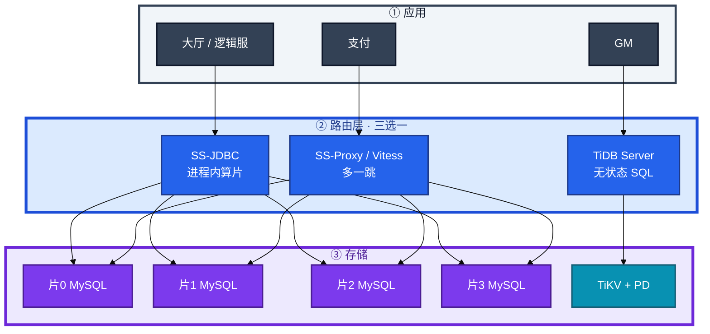
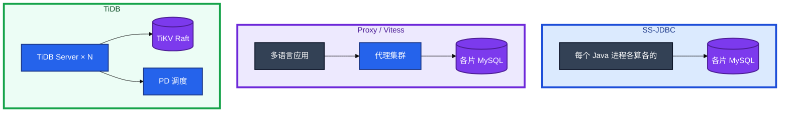
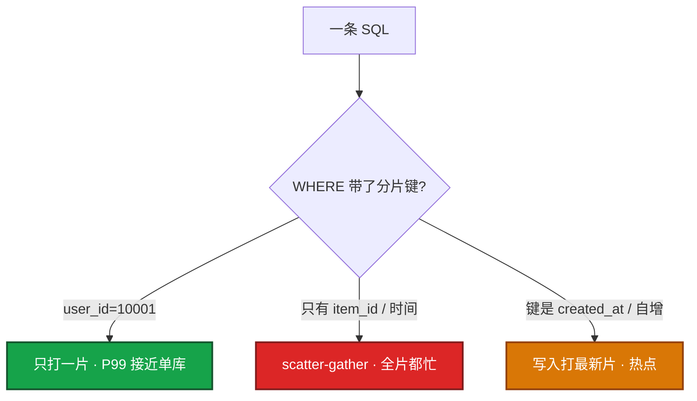
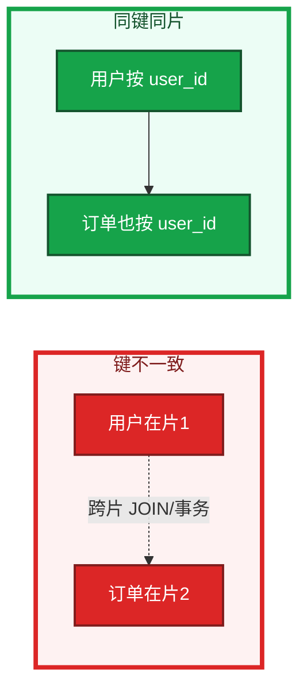
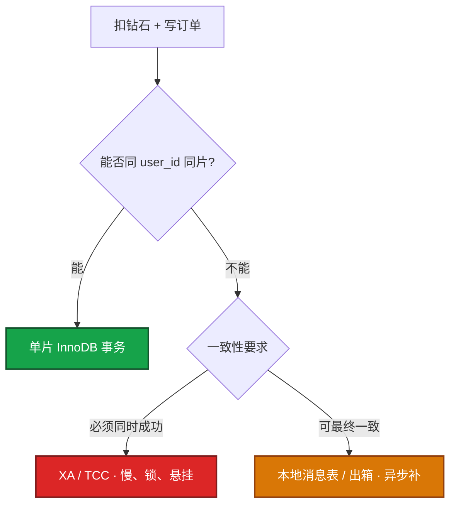
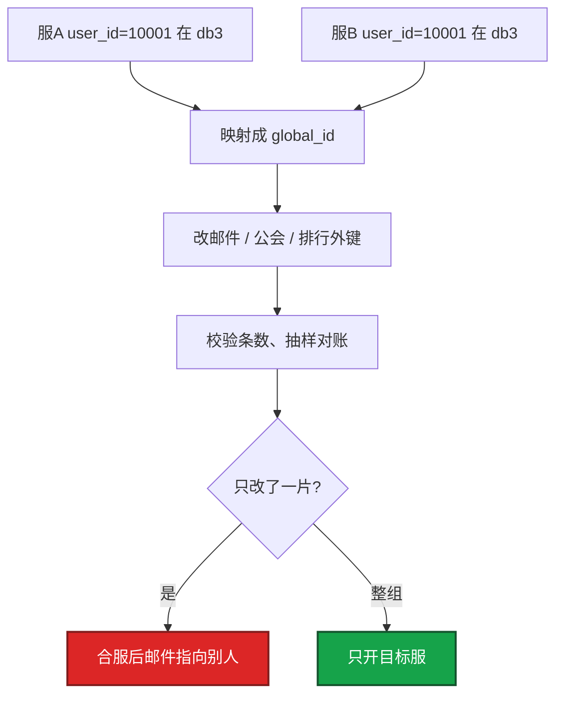
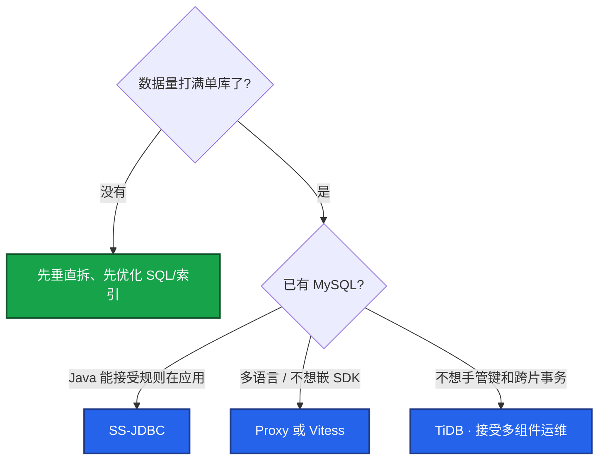
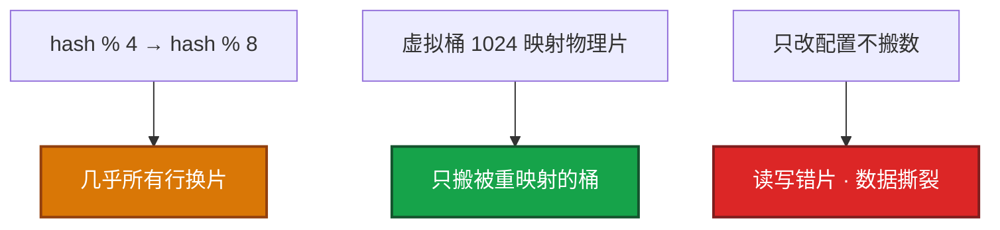
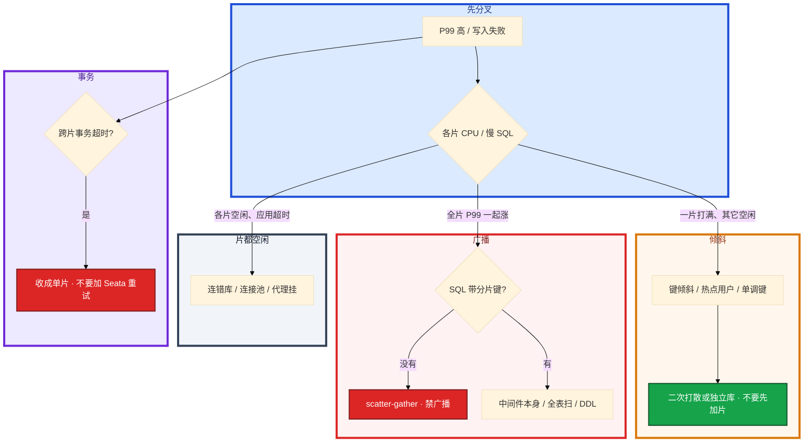

# 分库分表与中间件


活动高峰，角色表 8000 万行，加一列 DDL 要小时级。写入打满主库 CPU。群里有人要上 TiDB，另有人要把 dump 完直接切 DNS。

先别动手。这一章后半全是你会动手的：**怎么选键、怎么迁、怎么扩片、合服怎么映射、回档怎么整组回。** 前面的概念和原理，是为了让你动手时不选错路。

**读完你能：** 白板上画出垂直和水平；判断该不该拆；选出分片键并说出选错的三种后果；跨片事务先设计避免再谈 Seata；会双写 + CDC 迁移和扩片；合服会留映射、回档整组回。

**本章主线（排障就按这三步想）：**

1. **分层**：应用 → JDBC/Proxy/TiDB → 各片 MySQL；中间件只路由，键和跨片语义还在。
2. **归类**：单片满 → 键倾斜/热点；全片涨 → scatter-gather/无分片键；事务 → 先同键同片。
3. **留证**：各片慢日志是否带键、行数对账、迁移双写+CDC 可回退。

## 本章目录

- [1. 基本概念](#1-基本概念)
- [2. 架构图](#2-架构图)
- [3. 原理](#3-原理)
  - [3.1 拆分键](#31-拆分键路由均匀稳定)
  - [3.2 跨片语义](#32-跨片语义join事务聚合)
  - [3.3 跨库事务](#33-跨库事务为什么先别上-seata)
  - [3.4 全局 ID](#34-全局-id雪花号段uuid)
  - [3.5 合服映射](#35-合服映射键和-id-必须预留位置)
- [4. 落地](#4-落地)
  - [4.1 生产怎么选](#41-生产怎么选)
  - [4.2 落地你实际看到什么](#42-落地你实际看到什么)
- [5. 核心配置](#5-核心配置)
- [6. 命令与操作](#6-命令与操作)
  - [6.1 备份](#61-备份)
  - [6.2 不停机迁移](#62-不停机迁移双写-cdc)
  - [6.3 扩容迁移](#63-扩容迁移4-变-8)
  - [6.4 合服数据迁移](#64-合服数据迁移)
  - [6.5 回档](#65-回档整组同一时间点)
- [7. 生产排障](#7-生产排障)
- [8. 必会 · 常考](#8-必会-常考)
- [合上书](#合上书问自己)

**本章不讲：** 单库索引、事务、DDL、主从 → [01 MySQL](../01-MySQL/)；合服窗口、审批、回滚流水线 → [08-02 开服合服](../../08-游戏运维专题/02-开服合服/)；回档 RPO、多存储对齐 → [08-07](../../08-游戏运维专题/07-玩家数据备份与回档/)；分析型聚合、CH vs ES → [09 Elasticsearch](../09-Elasticsearch/)；Mongo 的 shard key → [06 MongoDB](../06-MongoDB/)。

---

## 1. 基本概念

分库分表把**数据和压力打散**。上了中间件不算分布式；中间件只是路由。目标是：大部分线上 SQL 落到单片，单片体积和写入都能扛，故障域不再是「一台挂全业务」。

大厅要查 `uid=10001` 的背包。还没水平拆时，这条 SQL 打到唯一的 `game_db.bag`。拆完之后，同一条 SQL 必须能算出「去哪一片」，否则变成扫全部片。

| 在分片里要解决的 | 分片解决不了的 |
|------------------|----------------|
| 单表千万～亿行、写入打满一台、大表 DDL、单实例故障面 | 慢 SQL 没索引、错误的事务隔离、从库延迟 |
| 把行按键打散到多库多表 | 「全局随便 JOIN 还很快」 |
| 游戏跨服、全服邮件、合服时「片」暴露出来 | 合服冲突、回档窗口（那是 08 的数据面） |

三种不要混：

| 做法 | 干什么 | 不干什么 |
|------|--------|----------|
| **垂直拆分** | 按业务拆库（账号 / 支付 / 玩法），或把大字段拆到副表 | **行数还在一张表里涨** |
| **水平拆分** | 按分片键把行分散到多表/多库 | 不自动消灭跨片 JOIN / 事务 |
| **读写分离** | 读打从库，扛读流量 | 不解决单表行数和 DDL；从库延迟规则和 01 一样 |

生产顺序通常是：先垂直（账号、支付、玩法分开）→ 单表仍撑不住再水平。游戏区服本身就是一种垂直+水平：**一服一库**。跨服玩法、全服邮件、合服，才会把「片」暴露出来。不要把所有玩法一张全球表哈希了事。

分片之后每一片仍是一套 MySQL：索引、DDL、主从延迟、备份，规则还在。别把「上了 Proxy」理解成两种问题一起消失。

> **记住**：先垂直隔离业务，再水平打散行。水平才引入跨片。数据量没打满单库、慢 SQL 没索引，先看 01，不要上分布式。

---

## 2. 架构图

先把整张图钉住。后面选型、配置、排障都对着这张图说话。



图上三条路：

1. **SS-JDBC**：进程内用分片键算片，直连各 MySQL。少一跳；规则随应用发版。
2. **SS-Proxy / Vitess**：应用连代理，代理再连各片。多语言、统一入口；代理是容量和故障点。
3. **TiDB**：应用连 TiDB Server，后面 TiKV 按 region 自动打散。应用不写分片规则；你运维 PD / TiKV。

不要两种路由同时管同一张表。规则跟应用走：改分片键要发版所有服务。规则在代理：改一次全局生效，但代理要扩容、探活、盯连接。

三种生产形态（装的时候选，挂的时候故障域不一样）：



TiDB 一眼：TiDB Server 无状态 SQL 层，TiKV 存数据 Raft 多副本，PD 调度，TiFlash 列存做分析。优势是自动打散和分布式事务对应用透明。代价是组件多、资源贵、小数据量是杀鸡用牛刀；故障排查要懂 region / PD，不是「换个 JDBC 驱动就结束」。中小规模 + 已有 MySQL，中间件更轻。

Vitess 把 MySQL 切成 shard，连接和缓冲在代理层（vtgate），K8s 上常见。和 ShardingSphere 一样，**分片键和跨片限制还在**，只是运维面不同。

---

## 3. 原理

原理只保留动手和面试会用到的：键怎么选、跨片为什么贵、事务为什么先别上 Seata、合服为什么会撞 id。

**本节 5 块：** 3.1 拆分键 · 3.2 跨片语义 · 3.3 跨库事务 · 3.4 全局 ID · 3.5 合服映射

### 3.1 拆分键：路由、均匀、稳定

分片键是路由依据。目标：**大部分线上查询能落到单片**，写入大致均匀。键一旦写入，改起来等于再做一次迁移。

逻辑服执行 `SELECT * FROM bag WHERE user_id=10001`。中间件（或 JDBC 插件）用 `hash(10001) % 4` 算出片 3，只打 `db3`。



逐步对应你眼睛看到的：

1. **WHERE 带了 `user_id`**  
   慢日志里只有一片的 SQL。P99 和单库时代接近。这是你要的。
2. **WHERE 只有 `item_id` 或时间范围**  
   中间件对 4 个库都发 SQL，再合并。全片 P99 一起涨，CPU 却每片都不高。这叫 scatter-gather。
3. **写入全打最新片**  
   键是 `created_at` 或自增 id。单片 CPU 打满、别的片空闲。

三种常见策略：

| 策略 | 做法 | 适合 | 坑 |
|------|------|------|-----|
| 范围 | id 1–1e7 在片 1 | 范围扫描、按月归档 | 递增写入打最新片 |
| 哈希 | `hash(user_id) % N` | OLTP 打散写入 | 范围查询要扫全片；**N 一变几乎全表搬家** |
| 一致性哈希 | 节点落在环上 | 加减节点少迁移 | 仍要处理热点和跨片；**不能免掉选键** |

选键五条（缺一条都会在线上现原形）：

1. **查询能定位单片**：主路径 80% 以上的 QPS 带这个键。按人查就用人。
2. **高基数、写入均匀**：避免活动 id、状态枚举、区服号这种低基数。
3. **关联表同一个键**：用户、订单、背包都按 `user_id`，从设计上避免跨片 JOIN。
4. **稳定**：键写入后不应变。`user_id` 几乎不变；`guild_id` 会换会、会合会，不适合当主键路由。
5. **给合服留映射**：游戏角色 id 不要把「区服内自增」当真全局。见 3.5。

选错三种后果：某片过载、热点、大量 scatter-gather。没有免费的「全局随便查还很快」。

热点不会因为哈希消失：大 R、机器人、明星公会仍会把某一片打满。要二次打散或独立库，不要先加片——加片会再迁移，倾斜的键还在同一逻辑热点上。

只分表不分库：能减单表体积和 DDL，写入和连接还在同一实例上。写满 CPU/IO 必须分库或换实例。按月分表是一种范围拆分，对归档友好，解决不了「当天写入打满」；当天仍要哈希或独立写库。

中间层映射（虚拟桶 1024，再映射到物理片）能让扩片少搬行，但查询能不能落单片，仍取决于键。一致性哈希同理：**只减少加减节点时的迁移量，不代替选键。**

> **记住**：线上查询要能落到单片；键选错比选中间件更致命，改键等于再迁一次。

---

### 3.2 跨片语义：JOIN、事务、聚合

分片的难点不在中间件语法，在 **跨片语义**。原则：设计上避免；真避免不了再上分布式事务或下沉到分析库。

支付要「扣钻石 + 写订单」。如果用户在片 1、订单按 `order_id` 在片 2：



1. **跨片 JOIN**：相关表同键同片（binding table）；不行就应用层先查 A 再查 B。不要让 OLTP 库做全服随便 JOIN。广播表（字典、兑换码配置）每片一份，不要当事实表去 JOIN 用户。
2. **跨片聚合**：`count/sum/sort/limit` 要各片查完再合并，大范围别在事务库上跑。报表、留存去分析库（选型见 [09-ES](../09-Elasticsearch/) 末节的 CH，不单开章）。
3. **Hint / 强制路由**：运维和补偿脚本可以指定片，业务接口不要靠 hint 当设计。

「上了 TiDB 就不会跨片了」——应用乱 JOIN 照样慢，只是引擎在扛。协议兼容不等于代价消失。大跨度 JOIN、热点 region 照样疼。应用仍要按数据分布来。

### 3.3 跨库事务：为什么先别上 Seata

尽量单片事务。真要跨片才 Seata / TCC / XA，有性能和悬挂代价。支付、发货能收成「一笔用户侧事务」就不要拆到两片再两阶段。



| 方案 | 怎么做 | 代价 | 游戏里什么时候才碰 |
|------|--------|------|-------------------|
| **单片本地事务** | 同键同片，InnoDB 提交 | 几乎无额外代价 | **默认该走的路** |
| **XA / 2PC** | 各片 prepare 再 commit | 协调者挂了会阻塞；锁持有时间长 | 几乎不要在活动高峰用 |
| **TCC** | Try / Confirm / Cancel | 业务要写补偿；Confirm 失败会悬挂 | 支付渠道回调这类，不是背包扣道具 |
| **Seata AT** | 自动补 undo，全局锁 | 不是魔法；冲突重、回滚窗口长 | 能不用就不用 |
| **Saga / 出箱** | 本地事务写下消息，异步补另一片 | 最终一致；要对账、要幂等 | 发邮件、发公告、跨服同步 |

卡住时的口径：跨片事务的正确解法是 **让它不再跨片**，不是换一个中间件开关。活动整点两阶段 = 把锁和协调者变成单点。

> **记住**：跨片 JOIN / 事务 / 聚合靠设计避免。真跨片先问能不能最终一致 + 对账，再问要不要两阶段。

### 3.4 全局 ID：雪花、号段、UUID

各片自增会冲突。三种常见：

| 方案 | 做法 | 适合 | 坑 |
|------|------|------|-----|
| 雪花 | 时间 + 机器 + 序列，趋势递增 | 订单号、日志 id | 依赖时钟；回拨要拒发或换 worker |
| 号段 / Leaf | 中心一次发 1000 个 id 给某应用 | 减少对中心的 QPS | 中心要高可用；进程崩溃会浪费一段 |
| UUID | 无中心 | 临时、外部关联 | **无序**，当 InnoDB 主键会随机写聚簇索引，页分裂，大表导入更疼 |

雪花依赖时钟，NTP 见基础底座 19。回拨要拒发或换 worker，不要默默发重复 id。号段模式：中心一次发一段，应用内存里用，少打中心。

游戏角色 id 还要给合服留映射空间，别把「区服内自增」当真全局。合服会把两套「看起来唯一」的 id 撞到一起。

### 3.5 合服映射：键和 ID 必须预留位置

合服在分片上的具体疼法：哈希可能把两服的 `user_id=10001` 撞在同一片，**id 仍冲突**。中间件只路由，不会自动改名。



分片键和全局 ID 的设计要能加映射表，不能假设永远一服一库。操作流程、停写窗口、回滚见 [08-02](../../08-游戏运维专题/02-开服合服/)。回档必须 **所有相关片一起回** 到同一时间点，只回一片是二次伤害，见 [08-07](../../08-游戏运维专题/07-玩家数据备份与回档/)。

这些步骤的窗口、审批、回滚写在 08-02 / 08-07，本章只要求：分片键和全局 ID 必须给映射留位置，**合服不是中间件功能**。

---

## 4. 落地

### 4.1 生产怎么选

| 方案 | 类型 | 你还管什么 | 适合 |
|------|------|------------|------|
| ShardingSphere-JDBC | 客户端分片 | 规则、键、扩片、跨片自己兜 | Java 为主，已有 MySQL |
| ShardingSphere-Proxy | 代理分片 | 多语言都能连，多一跳延迟 | 多语言、统一入口 |
| Vitess | 代理（YouTube） | 分片、连接池、K8s 生态 | MySQL 协议、云原生 |
| TiDB | 分布式数据库 | 少管分片键，管 PD/TiKV 运维和容量 | 要透明分片 + 分布式事务 + HTAP |
| MyCAT | 老代理 | 社区不活跃 | **不新上** |



已有 MySQL + Java → SS-JDBC 最轻。多语言 → Proxy 或 Vitess。要透明分片和原生分布式事务、有人能运维多组件 → TiDB。小数据量上 TiDB 是杀鸡。**TiDB 不是「不用管分片」，是改管另一套组件。**

选：先垂直、键按用户、关联表同键。不选：数据量没到就上分布式、按活动 id 分片、MyCAT 新上、两种路由管同一张表。

### 4.2 落地你实际看到什么

JDBC：规则在 `application.yml` / 注册中心，进程启动时加载。改规则 = 发版（或配置中心推送后重启连接）。每个实例都要能连 **全部片** 的地址。

Proxy / vtgate：前面挂负载均衡，应用只认一个入口。代理后面是各片主从。代理本身要 2+ 节点，探活、限流、连接池在这一层。

TiDB：至少 TiDB Server × 2、PD × 3、TiKV × 3。验收看 PD 健康、region 打散、不是「能连上 4000 端口」。

每片仍是 MySQL：独立数据盘、独立备份、独立监控。中间件挂了，已有连接看实现——JDBC 还能直连（如果应用兜了），Proxy 挂了应用进不去。

清单里必须有的（ShardingSphere 示意）：

```yaml
dataSources:
  ds0: { jdbcUrl: jdbc:mysql://10.0.1.11:3306/game }
  ds1: { jdbcUrl: jdbc:mysql://10.0.1.12:3306/game }
  ds2: { jdbcUrl: jdbc:mysql://10.0.1.13:3306/game }
  ds3: { jdbcUrl: jdbc:mysql://10.0.1.14:3306/game }
rules:
  - !SHARDING
    tables:
      bag:
        actualDataNodes: ds${0..3}.bag_${0..3}
        tableStrategy:
          standard:
            shardingColumn: user_id
            shardingAlgorithmName: bag_inline
    shardingAlgorithms:
      bag_inline:
        type: INLINE
        props:
          algorithm-expression: bag_${user_id % 16}
    bindingTables:
      - bag,player_mail,orders
    broadcastTables:
      - item_dict
```

验收：带分片键的 SQL 只打一片（看各片慢日志 / 代理审计）；不带键的 SQL 被你拦下来或明确允许的广播；对账 count 能对上。不要只探 Proxy TCP 端口。

---

## 5. 核心配置

只动有证据的项。改分片表达式等于改路由，必须当变更：备份、窗口、回滚。

| 参数 / 项 | 生产怎么用 | 改错会怎样 |
|-----------|------------|------------|
| `shardingColumn` | 主路径查询的那一列，通常 `user_id` | 选成 `order_id` / 时间 → 跨片或热点 |
| `algorithm-expression` / 取模 N | 与实际库表数一致；扩片不能只改 N | N 从 4 改 8 = 几乎全表搬家 |
| `bindingTables` | 同键关联表绑在一起 | 漏绑 → 同键也会按两套路由走，JOIN 变跨片 |
| `broadcastTables` | 小字典每片一份 | 把用户表当广播 = 每片全量副本 |
| 连接池（每片） | 按片设，总连接 = 池 × 片数 | 只按单库设池，4 片会打满 MySQL `max_connections` |
| 禁止全表广播 | 无分片键的 SQL 默认拒绝 | 活动接口打一次 = 打穿所有片 |
| 读写分离 | 每片仍可有从库；活动写后读走主 | 当成「分片已解决读旧」 |

> **记住**：改取模 N、改分片列，都是数据迁移，不是改个配置热更。连接池按片乘上去算。

---

## 6. 命令与操作

值班先确认：SQL 有没有带键、打到了哪一片、各片复制是否落后。

| 目的 | 命令 / 看什么 | 看什么 |
|------|----------------|--------|
| 慢 SQL 是否带键 | 各片 `slow_query_log` / Proxy 审计 | WHERE 有没有 `user_id` |
| 是不是广播 | 同一 `query_id` 是否出现在全部片 | 全片都有 = scatter |
| 单片是否倾斜 | 各片 CPU、QPS、行数 | 一片 90%、其它 10% = 键倾斜 |
| 复制延迟 | 每片 `SHOW REPLICA STATUS` | 分片后每一片都是一套主从 |
| 行数对账 | 各片 `COUNT(*)` 再加总，对旧库 | 迁移动作的准入 |
| Proxy 连接 | 代理管理口连接数、后端探活 | 代理本身打满 |
| TiDB | `INFORMATION_SCHEMA.TIKV_REGION_STATUS`、PD dashboard | 热点 region，不是「分片键错了」这一套词 |

应用侧把 `/* shard user_id=10001 */` 打进 SQL 注释，方便审计。强制路由只给补偿脚本。

指标（Prometheus，按片打标签）：

| 指标 | 阈值 | 级别 |
|------|------|------|
| 单片 CPU / 其它片 | 一片 >80% 且其它 <30% | **P1** 键倾斜 |
| 无分片键请求占比 | **> 1%** 要查 | P1 广播 |
| 各片复制延迟 | 活动写后读场景 **> 1s** | P1 |
| Proxy 连接 / 拒绝 | 打满 | P1 |
| 对账差异 | count/sum 对不上 | **P0**（迁移中） |

日志：`broadcast` / `route to all` = 没带键；单片 `lock wait` 其它片空闲 = 热点行；DDL 还要小时级 = 只垂直了没水平，或每片仍然太大。

---

### 6.1 备份

每一片独立备份，保留同一套时间点。合服、扩片、切写前 **所有片加打一份**。异地 7～30 天。只备 Proxy 机器不算备份。

回档粒度是「一组存储」不是「一张表」。见 7.5。

**季度做一次：从备份恢复一片，校验行数。** 没有演练 = 没有备份。

### 6.2 不停机迁移：双写 + CDC

不停机迁到分片库，核心是 **全程可回退**，不是一次切流赌赢。背包表要从单库迁到 4 片：


1. **双写**：写旧库同时写新分片。条数对不上 → 定时对账，修差异，不要急着切读。
2. **历史批量搬** + **binlog/CDC**（Canal / Debezium）追增量。CDC 断流要当事故，不要默默落后再全量对。
3. **对账**：count / sum / 抽样。对不上 → 切回旧库。
4. **影子读**：应用读旧库，同时读新库比对。不一致先修新库，流量还在旧库。
5. **切写窗口**：避开活动整点。灰度先小流量。切完盯每片复制延迟和慢 SQL。
6. 停双写，下线旧库。

任一步对不上 → 切回旧库。灰度观察没有回滚点，等于没有迁移方案。不要 dump 完直接切 DNS。

### 6.3 扩容迁移：4 变 8

扩片同样是迁移：哈希取模一变，大量行要搬家。能用一致性哈希或中间层映射（虚拟桶）减轻，但游戏核心表仍要当变更做：备份、窗口、回滚预案。



流程与 7.2 同类：新片双写或按桶搬迁 → CDC / 校验 → 切路由 → 停旧映射。不要只改 `user_id % 8` 然后重启 Proxy。

一致性哈希能减少搬家比例，**查询能不能落单片仍取决于键**。热点用户加片无效，要打散或独立库。

Stacked 把 4 片扩到 8 片是项目，活动中不要做。

### 6.4 合服数据迁移

合服不是中间件「自动合并分片」。冲突、改名、邮件、排行榜是业务数据问题，必须按 08 的流水线做。本章只钉数据面和分片的接口：

1. **停写**，所有相关片 + Redis 打同一时间点备份。
2. **映射表**：`old_sid + old_uid → global_id`，写入前就该能加，不要合服当晚才发明。
3. 改邮件、公会、排行、好友外键；校验条数。
4. 只开目标服。漏改一片 → 邮件指向别人。
5. 回滚 = 整组 restore 到停写前快照，不是「再合一次反过来」。

窗口、审批、回滚见 [08-02](../../08-游戏运维专题/02-开服合服/)。

### 6.5 回档：整组同一时间点

所有相关片、以及 Redis / 其它库，回到 **同一时间点**。只回一片 = 二次伤害。审批和防误伤见 [08-07](../../08-游戏运维专题/07-玩家数据备份与回档/)。

分片之后，合服 / 回档的粒度是「一组存储」不是「一张表」。

---

## 7. 生产排障

和 01 同一套三问：进程还在不在？还能不能变更？已有流量还通不通？

**单片打满 ≠ 全部分片挂了。** 先看是键倾斜还是广播，不要先加片、先上 TiDB。



现场顺序：

1. 慢 SQL 是否带分片键、是否 scatter。
2. 各片 CPU / QPS / 行数，是不是一片独高。
3. 中间件连接池、代理探活。
4. 单片复制延迟（写后读）。
5. 迁移 / 合服期间：对账差异，不要继续切流。

| 现象 | 先做什么 | 不要做什么 |
|------|----------|------------|
| 单片 CPU 打满、别的片空闲 | 查键、热点用户 | 先加片、先上 TiDB |
| 全片 P99 一起涨 | 查广播、全表扫、中间件 | 给每片加 CPU |
| DDL 仍要锁很久 | 只垂直了没水平，或每片仍然太大 | 换中间件当 DDL 工具 |
| 双写条数对不上 | 停切流，修差异 | dump 完切 DNS |
| 合服后邮件指向别人 | 外键映射漏片，整组回滚再修 | 只改当前报错那一片 |
| 「上了 TiDB 还是慢」 | 热点 region、乱 JOIN | 当成分片键选错那一套词去改应用哈希 |

活动高峰分片和日志同盘，单片 IO 打满看起来像中间件挂了。正确处理：确认进程还在 → 停止发版和合服 → 看键 / 广播 / 盘 → 恢复后先对账再开写。

---

## 8. 必会 · 常考

白板和追问高频，能一口回：

| 说法 | 对错 | 口径 |
|------|:----:|------|
| 上了中间件就算分布式 | 错 | 中间件只路由；键和跨片还在 |
| 读写分离能解决单表行数 | 错 | 只扛读；行数和 DDL 还在主库 |
| 4 库哈希，按 `order_id` 分订单、按人查 | 错 | 每次 scatter；订单也按 `user_id` |
| 一致性哈希能免掉选键 | 错 | 只减少扩片搬家 |
| 跨片事务上 Seata 就安全 | 错 | 先同键同片；两阶段有悬挂 |
| 各片 `auto_increment` 当全局 id | 错 | 会撞号；雪花或号段 |
| UUID 当 InnoDB 主键没问题 | 错 | 无序写聚簇，页分裂 |
| 数据量没到也可以先上 TiDB | 错 | 杀鸡；先垂直、先优化 01 |
| 上了 TiDB 就可以随便 JOIN | 错 | 引擎在扛，大跨度照样慢 |
| 扩片只要把 `% 4` 改成 `% 8` | 错 | 几乎全表搬家，走迁移 |
| 合服靠中间件自动合并分片 | 错 | 只路由；映射是业务数据面 |
| 回档只回最忙的那一片 | 错 | 整组同一时间点 |
| 只分表不分库就能扛写入打满 | 错 | 连接和 IO 还在同一实例 |
| dump 完切 DNS 算不停机迁移 | 错 | 必须双写 + CDC + 对账 + 可回退 |

数字：单表千万～亿考虑水平；主路径查询应落单片；号段一次发一段（如 1000）；备份合服/扩片前全片加打；对账 count/sum/抽样；Bulk 迁移窗口避开活动整点。

易混：垂直 vs 水平；读写分离 vs 分片；哈希 vs 范围 vs 一致性哈希；JDBC vs Proxy vs TiDB；换键 vs 扩片 vs 合服；单片事务 vs XA/TCC；只回一片 vs 整组回档。

---

## 合上书，问自己

1. 什么时候拆？垂直和水平差在哪？读写分离算不算分片？
2. 分片键三条（其实五条）怎么选？选错三种后果？改键意味着什么？
3. 跨片 JOIN / 事务 / 聚合默认怎么避免？什么时候才碰 Seata？
4. SS-JDBC / Proxy / Vitess / TiDB 怎么选？小数据量先做什么？
5. 不停机迁移七步是哪七步？扩片 4 变 8 为什么不能只改配置？
6. 合服为什么会撞 id？回档为什么必须整组同一时间点？

六题都能口述，这一章就过了。下一章把注册中心和配置中心剖开：名单怎么来、开关怎么下去、中心抖了调用还通不通。
