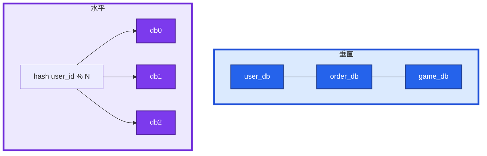
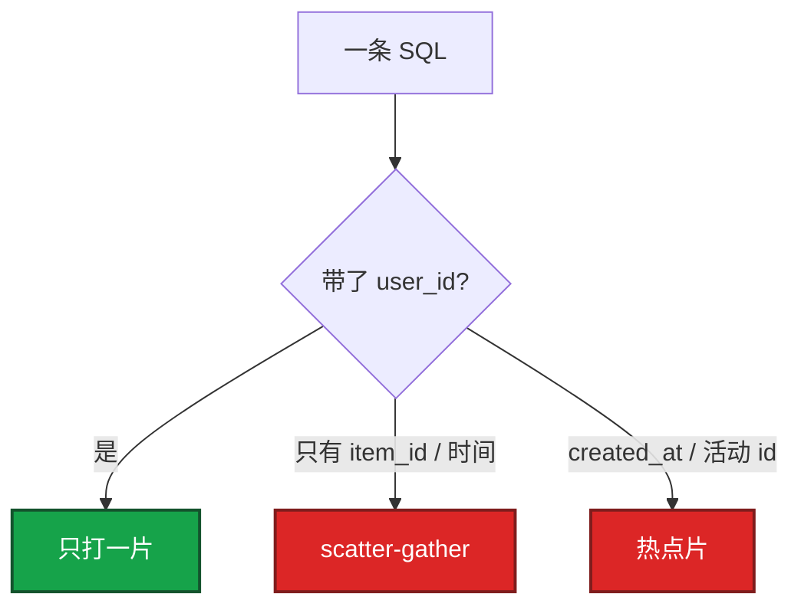
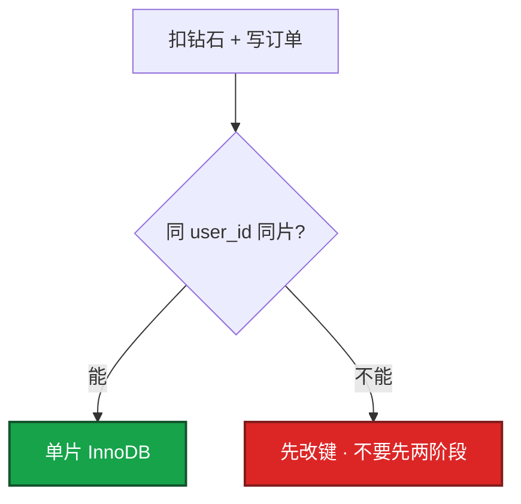
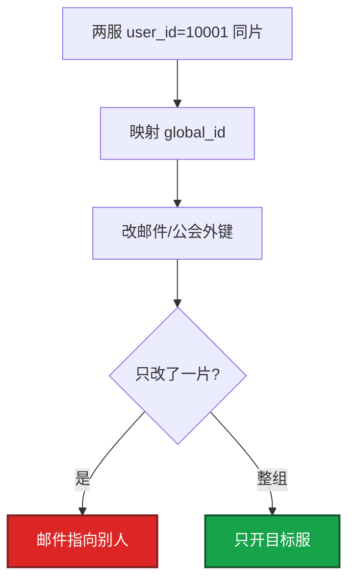
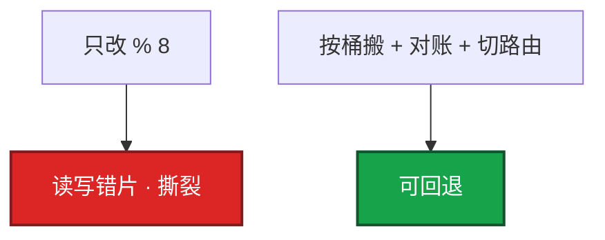

# 07｜分库分表与中间件 · 练习题

先自己画图或口述，再对照解答。每题标了覆盖范围：

| 标记 | 含义 |
|------|------|
| **核心** | 不懂整章就没建立起来 |
| **必会** | 值班和面试都要能讲 |
| **常用** | 线上会反复碰到 |
| **常考** | 白板和追问的高频口径 |

## 本题目录

- [Q1 什么时候拆、垂直 vs 水平](#q1)
- [Q2 分片键怎么选](#q2)
- [Q3 跨片 JOIN / 事务](#q3)
- [Q4 中间件 vs TiDB](#q4)
- [Q5 不停机迁移](#q5)
- [Q6 全局 ID](#q6)
- [Q7 合服数据迁移](#q7)
- [Q8 扩片 4 变 8](#q8)
- [Q9 排障分流](#q9)
- [合上书](#合上书)

---

## Q1

**★★★★★｜什么时候要分库分表？垂直和水平差在哪？**

**覆盖**：核心 · 必会 · 常考

### 场景

白板：「角色表 8000 万行，DDL 小时级，写入打满主库。上 TiDB 还是先按业务拆库？」有人开始背中间件配置。

### 完整解答

单表千万～亿、查询变慢、写入扛不住、DDL 锁太久、单库故障面太大时考虑拆。先问有没有把账号、支付、玩法混在一个实例。

垂直：隔离故障和锁，**行数还在**。水平：行和写入打散，**引入跨片**。生产常先垂直再水平。游戏一服一库已经是拆过的形态；全服一张表才需要水平。数据量没到、慢 SQL 没索引，先看 01，不要上分布式。读写分离 ≠ 分片。

### 再追问

- 只分表不分库够不够？——能减单表体积和 DDL，写入和连接还在同一实例。写满 CPU/IO 必须分库或换实例。
- 按月分表算水平吗？——算范围拆分。对归档友好，解决不了当天写入打满。

---

## Q2

**★★★★★｜分片键怎么选？选错了会怎样？**

**覆盖**：核心 · 必会 · 常考

### 场景

订单按 `order_id` 哈希，用户后台全是「查某个人的全部订单」。每个请求打 16 个库再合并。活动发奖按 `activity_id` 分片，整点一片打满。

### 完整解答

键要让 **主路径查询落单片**，写入大致均匀、稳定、关联表同键。按人查就用人。

对：用户、订单、背包都按 `user_id`。错：订单按 `order_id`；按 `created_at` / 活动 id。选错：某片过载、热点、scatter-gather。键写入后极难改，等于再迁移一次。范围对扫描友好但递增会热点；哈希均匀但范围要扫全片。

### 再追问

- 一致性哈希能免掉选键吗？——不能。它只减少加减节点时的迁移量。
- 大 R 把哈希也打歪？——会。二次打散或独立库，不要先加片。

---

## Q3

**★★★★★｜跨片 JOIN 和跨片事务怎么办？为什么先别上 Seata？**

**覆盖**：核心 · 必会 · 常考

### 场景

用户在片 1，订单在片 2。下单要扣余额 + 写订单，有人准备上 Seata。报表要全服 sum。

### 完整解答

核心是设计避免跨片。同键 → 单片事务、同片 JOIN。真跨片才 XA / TCC / Seata，慢、悬挂、回滚难。支付发货能收成用户侧一笔，不要拆两片再两阶段。全服聚合不要打 OLTP 分片，下沉分析库。应用层分步查比在中间件里伪装成单机 JOIN 更可控。

### 再追问

- 怎么避免跨片 JOIN？——相关数据同一分片键；广播表只放小字典。
- 出箱 / 本地消息表？——最终一致 + 对账 + 幂等；适合发邮件，不适合「扣款必须同时成功」却还把表拆开的设计。

---

## Q4

**★★★★☆｜ShardingSphere、Vitess、TiDB 怎么选？**

**覆盖**：必会 · 常用 · 常考

### 场景

Java 为主的已有 MySQL。领导听过「TiDB 自动分片」。团队没有专职跑 PD / TiKV 的人。

### 完整解答

| | ShardingSphere | Vitess | TiDB |
|--|----------------|--------|------|
| 本质 | 中间件（客户端或代理） | MySQL 分片代理 | 分布式数据库 |
| 分片键 | 你自己定 | 你自己定 | 引擎打 region |
| 跨片事务 | 你兜或少做 | 限制仍在 | 引擎提供 |
| 运维 | 规则 + MySQL | 代理 + MySQL + K8s | PD / TiKV / TiDB 多组件 |
| 适合 | 已有 MySQL、中小到中大 | 云原生 MySQL 分片 | 要透明分片 + HTAP，接受复杂度 |

已有 MySQL + Java → SS-JDBC 最轻。多语言 → Proxy 或 Vitess。要透明分片和原生分布式事务、有人能运维多组件 → TiDB。小数据量上 TiDB 是杀鸡。**TiDB 不是「不用管分片」，是改管另一套组件。** 不要两种路由管同一张表。MyCAT 不新上。

### 再追问

- 上了 TiDB 应用就可以随便 JOIN 了吗？——否。大跨度 JOIN、热点 region 照样慢。
- JDBC 和 Proxy 差在哪？——规则在应用 vs 在代理；少一跳 vs 多语言统一入口。

---

## Q5

**★★★★☆｜不停机迁到分片库怎么做？双写不一致怎么办？**

**覆盖**：必会 · 常用

### 场景

要在不停服的情况下把角色表从单库迁到 8 库。有人想 dump 完直接切 DNS。

### 完整解答

用 Canal / Debezium 追 binlog。对账 count / sum / 抽样。切读先影子读、再小流量。切写避开活动整点。CDC 落后当事故。任一步失败 → 切回旧库。

不一致：记下差异修数，不要一边对账一边全量切。灰度观察没有回滚点，等于没有迁移方案。

### 再追问

- 影子读是什么？——读旧库，同时读新库比对；流量还在旧库。
- CDC 断流？——当事故，不要默默落后再全量对。

---

## Q6

**★★★★☆｜全局 ID 怎么发？UUID 行不行？**

**覆盖**：必会 · 常用 · 常考

### 场景

分片后各库 `auto_increment` 撞号。有人用 UUID 当主键，插入和按时间扫都变慢。

### 完整解答

各片自增会冲突。常用：

1. 雪花：时间 + 机器 + 序列，趋势递增，注意时钟回拨。
2. 号段：中心发一段给各应用，少打中心。
3. UUID：无序，聚簇索引页分裂，慎当主键。

游戏角色 id 还要给合服留映射，不要把「区服内自增」当真全局唯一。合服冲突处理见 08-02。

### 再追问

- 时钟回拨对雪花会怎样？——可能发重复 id。生产要 NTP（基础底座 19），回拨时拒绝发号或换 worker。
- 号段中心挂了？——已发出去的段还能用一会儿；中心要高可用，不是单机 Redis  incr。

---

## Q7

**★★★★☆｜游戏合服、回档和分片有什么关系？**

**覆盖**：必会 · 常用 · 常考

### 场景

两区都按 `user_id % 16` 分片。合服后 id 冲突。出事故后只回了其中几个分片。

### 完整解答

分片键和全局 ID 在合服前就要能加 **映射表**，不能假设永远一服一库。合服是数据面最高危操作之一：停写、备份、映射、校验、只开目标服。窗口和回滚见 [08-02](../../08-游戏运维专题/02-开服合服/)。

回档：所有相关片、以及 Redis / 其它库，回到 **同一时间点**。只回一片 = 二次伤害。本章只要求：分片之后，合服 / 回档的粒度是「一组存储」不是「一张表」。中间件只路由，不能自动合并分片。

### 再追问

- 合服能不能靠中间件自动合并？——不能。冲突、改名、邮件、排行榜是业务数据问题。
- 回滚怎么做？——整组 restore 到停写前快照，不是「再合一次反过来」。

---

## Q8

**★★★★☆｜扩片 4 变 8？范围分片和哈希怎么选？**

**覆盖**：必会 · 常用

### 场景

有人把配置里 `user_id % 4` 改成 `% 8` 然后重启 Proxy。另一次流水表按时间范围分片，白天写入全打当天那片。

### 完整解答

扩片是迁移，不是改配置。`hash % N` 一变，几乎所有行换片。要走和 7.2 同类的流程：搬迁 / 双写 → 对账 → 切路由。虚拟桶或一致性哈希能减少搬家比例，查询落单片仍取决于键。活动中不要做。

范围：扫描友好，递增写入 = 热点。哈希：写入均匀，时间范围 = 扫全片。OLTP 主路径按用户哈希。时间范围报表不要打在事务分片上。

### 再追问

- 按月分表能扛当天写入吗？——不能。当天仍要哈希或独立写库。
- 加片能治热点大 R 吗？——不能。倾斜的键还在同一逻辑热点上。

---

## Q9

**★★★★☆｜上了分片之后慢，你先走哪条排障路？**

**覆盖**：必会 · 常用

### 场景

四个工单：① 8 个库总 QPS 不高，db3 CPU 90%、其它 10% ② 全片 P99 一起涨 ③ 各片空闲、应用超时 ④ 跨片事务活动整点超时。

### 完整解答

| # | 走哪条 | 不要做 |
|---|--------|--------|
| ① | 键倾斜 / 热点用户 / 单调键；二次打散 | 先加片、先上 TiDB |
| ② | SQL 有没有带分片键；broadcast | 给每片加 CPU |
| ③ | 连错库、连接池、代理挂 | 当成分片算法错了去改键 |
| ④ | 收成单片事务 | 加 Seata 重试 |

现场：慢 SQL 是否带键 → 各片 CPU / 行数 → 中间件连接池 → 每片复制延迟。broadcast 一条变成 N 条，活动接口打一次等于打穿所有片。

### 再追问

- 读写分离从库延迟？——分片后每一片仍是一套 MySQL，规则和 01 一样。
- 托管了这章能跳过吗？——不能。键、跨片、合服映射、回档整组仍是你的。

---

## 合上书

- [ ] 能画出垂直 / 水平，并说出读写分离不是分片
- [ ] 能选出分片键，并说出选错的三种后果、改键 = 再迁移
- [ ] 能把跨片 JOIN / 事务讲成「先同键同片，再谈 Seata」
- [ ] 能说出 JDBC / Proxy / Vitess / TiDB 差在哪，小数据量先优化单库
- [ ] 能默写双写 + CDC + 对账 + 灰度，并说明扩片不能只改 `% N`
- [ ] 能说明合服要映射表、回档整组同一时间点，中间件不能自动合服
- [ ] 能用倾斜 / 广播 / 连错库分流，而不是先加片
