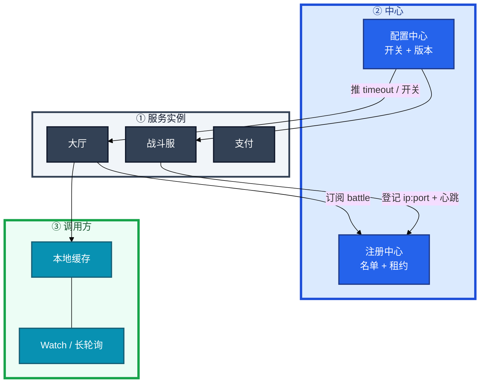
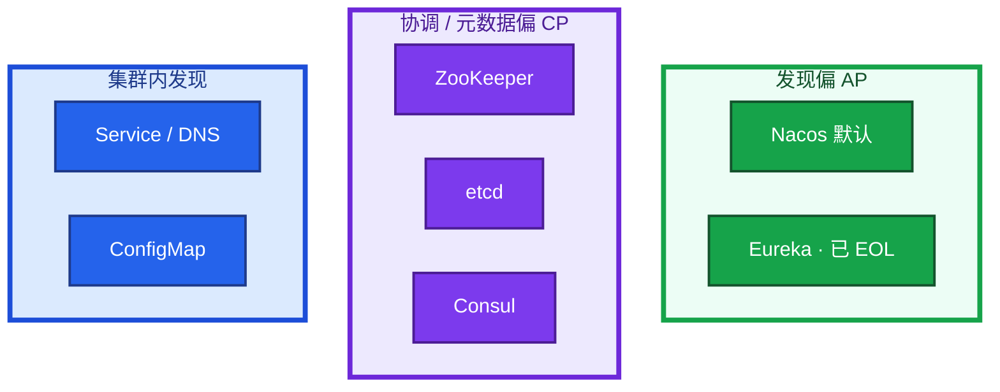
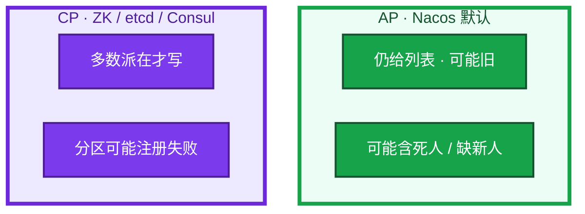
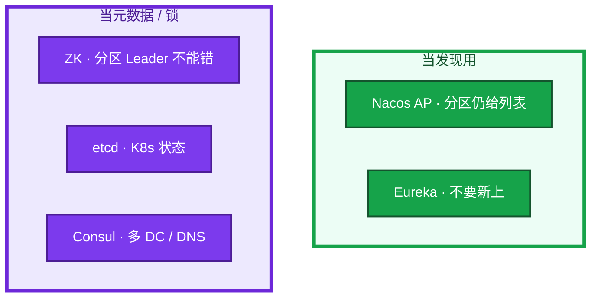
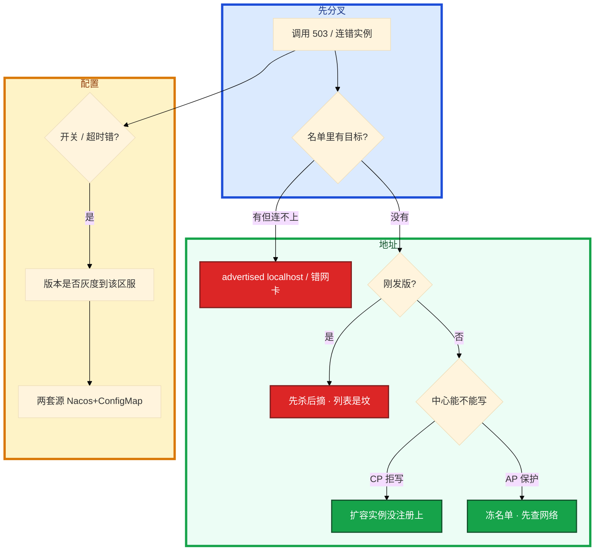

# 注册中心与配置中心


活动整点扩了 10 台大厅，机房到 Nacos 的网抖了 30 秒。监控上心跳超时实例占比飙红，控制台里 healthy 参差；群里有人要重启全部逻辑服「重新注册」，另有人要把保护模式里「不健康」实例全部手动下线——两边都在制造雪崩。

先别动手。这一章后半全是你会动手的：**怎么查名单、怎么摘流、怎么灰度开关、怎么回滚配置。** 前面的概念和原理，是为了让你动手时不选错路。

**本章主线（排障就按这三步想）：**

1. **分层**：注册中心（名单+租约）vs 配置中心（开关+版本）；长连接不经中心。
2. **归类**：502/连错 → advertised/先杀后摘；中心抖 → AP 冻名单 vs CP 拒写；开关错 → 配置版本。
3. **留证**：名单地址从调用方 telnet + 进程日志配置版本号。

**读完你能：** 白板上画出谁注册、谁订阅；中心挂了能判断长连接还在不在；能对比 Nacos / ZK / Consul / etcd；会配置热更新、灰度、回滚；滚动发布先摘流再杀进程。

## 本章目录

- [1. 基本概念](#1-基本概念)
- [2. 架构图](#2-架构图)
- [3. 原理](#3-原理)
  - [3.1 一次注册](#31-一次注册大厅怎么找到新战斗服)
  - [3.2 AP vs CP](#32-ap-vs-cp中心抖了调用还通不通)
  - [3.3 Nacos / ZK / Consul / etcd](#33-nacos-zk-consul-etcd对比)
  - [3.4 配置热更新](#34-配置热更新推到进程才算下去)
- [4. 落地](#4-落地)
  - [4.1 生产怎么选](#41-生产怎么选)
  - [4.2 落地你实际看到什么](#42-落地你实际看到什么)
- [5. 核心配置](#5-核心配置)
- [6. 命令与操作](#6-命令与操作)
  - [6.1 摘流与滚动](#61-摘流与滚动先摘再杀)
  - [6.2 配置灰度与回滚](#62-配置灰度与回滚)
  - [6.3 保护模式](#63-保护模式不要清名单)
- [7. 生产排障](#7-生产排障)
- [8. 必会 · 常考](#8-必会常考)
- [合上书](#合上书问自己)

**本章不讲：** etcd Raft、quorum、备份、磁盘 → [04-02 etcd](../../04-Kubernetes/02-etcd/)；ConfigMap / Secret 注入 → [04-12](../../04-Kubernetes/12-配置与密钥/)；优雅退出、摘流顺序细节 → [04-04 Pod](../../04-Kubernetes/04-Pod生命周期/)；网关动态路由、APISIX+etcd → [04 接入网关](../04-接入网关/)；Kafka 老集群的 ZK 运维 → [05 Kafka](../05-Kafka/)。

---

## 1. 基本概念

**值班里什么时候碰到**：大厅报「匹配不到战斗服」、发版后登录 502、运营要改活动开关、合服后区服入口变了——背后往往要么是「名单里谁还在」，要么是「开关推到了没有」。

进程自己**不知道**对面谁还活着。写死 IP 等于把「谁在」刻进发版包：扩一个、挂一台、迁一次机都要改配置。注册中心把「谁在」收成一份可订阅的名单；**租约 / 心跳是那扇门**——到期不续，名单里就该消失。配置中心是另一扇门：开关和超时不该为改一个数字就发版。

| 在注册/配置中心 | 不在这里 |
|-----------------|----------|
| 实例 ip:port、元数据、健康状态 | 已经打上的长连接、内核里的转发规则 |
| 超时、活动开关、区服入口、维护公告 | 线程池、监听端口、要重建的数据结构 |
| 订阅变更、本地缓存、灰度版本 | K8s 里 Pod 什么时候 SIGTERM（04-04） |

四个角色不要混：

| 角色 | 干什么 | 值班里认 |
|------|--------|----------|
| **注册中心** | 登记、发现、按租约剔除 | 「战斗服 ip:port 列表从哪来」 |
| **配置中心** | 集中存放、watch 下发、版本 / 灰度 / 回滚 | 「活动开关、超时从哪推」 |
| **调用方本地缓存** | 中心抖了短时间还能打 | 「Nacos 挂了为什么还能打一会儿」 |
| **进程自己的摘流** | preStop / 停匹配 / 主动下线 | 「滚动发布谁先摘谁后杀」 |

职责四件：注册、发现、健康剔除、配置下发（很多产品一身二职）。游戏大厅找战斗服、GM 找区服、微服务找支付，都是这一张图。合服后「区服入口」更像配置（名单、维护公告），用配置中心推，不要让每个登录请求去问注册中心「这服还开不开」。

**打个比方**：注册中心像商场电子屏上的「营业店铺名单」——新店开业登记、关门撤牌；配置中心像总部下发的「今日促销规则」——改规则不用重装每家店。已经进店的顾客（长连接）不经过那块屏；屏坏了影响的是「新客找哪家店」。

> **记住**：注册中心挂了 ≠ 正在打的 RPC 立刻全断。已有连接和本地缓存还能撑一会儿；新实例上不来、死人摘不掉。名单里还有、进程已经要下了，中心不替你做优雅摘流。

**面试怎么说**：「注册中心管名单和租约，配置中心管开关和版本；长连接已打上的不经中心，中心影响新发现、扩缩和摘流。」

---

## 2. 架构图

先把整张图钉住。后面选型、命令、排障都对着这张图说话。



**读图三句话：**

1. **没有箭头要求每个 RPC 都问中心。** 调用方订阅 + 本地缓存。每请求问中心会把中心打成单点——从调用方日志看 QPS 飙高就是这条。
2. **已打上的长连接不经中心。** 中心影响的是新发现、扩缩、摘流。排障先问「老连接还在不在」，再问「新实例上没上」。
3. **配置走另一条推送。** 改完不是文件换了就行，是进程 watch 到、用上、出问题能退——从进程日志对版本号，不是只看控制台「已发布」。

三种产品形态（装的时候选，分区时语义不一样）：



选型心法：**发现优先可用（AP）**，**配置优先一致（CP）**。K8s 里 Service 发现走 API/DNS，不是业务进程直连 etcd 当 Dubbo 注册中心。集群内无状态服务用 ConfigMap 即可；跨集群、非 K8s、要精细灰度，用 Nacos / Apollo。两边概念类似，范围不同，不要叠两套改同一份超时。

---

## 3. 原理

原理只保留动手和面试会用到的：名单怎么更新、分区时选 AP 还是 CP、几套产品差在哪、配置怎样才算热更新成功。

**本节 4 块：** 3.1 一次注册 · 3.2 AP vs CP · 3.3 产品对比 · 3.4 配置热更新

### 3.1 一次注册：大厅怎么找到新战斗服

**一句话：** 实例登记 + 心跳续约，调用方订阅更新本地缓存；长连接已打上的不经中心。

**打个比方**：像外卖平台——新店在后台登记地址（注册），骑手 App 订阅附近店铺列表（发现）；已经送到顾客手里的订单（长连接）不会因为后台抖一下立刻取消。

**现场走一遍**（活动整点刚扩了 3 台战斗服，看名单有没有、大厅能不能打到）：

1. 战斗服 Pod 启动，进程向 Nacos 登记 `ip:port` + 元数据（区服、房间类型），开始按租约心跳。
2. 你在跳板机查名单：

```bash
curl -s "http://nacos:8848/nacos/v1/ns/instance/list?serviceName=battle"
```

3. 屏幕出现（节选）：

```text
{"hosts":[
  {"ip":"10.0.12.41","port":9001,"healthy":true,"metadata":{"zone":"s1"}},
  {"ip":"10.0.12.42","port":9001,"healthy":true,"metadata":{"zone":"s1"}},
  {"ip":"10.0.12.43","port":9001,"healthy":true,"metadata":{"zone":"s1"}}
]}
```

4. **说明什么**：3 台新实例 healthy=true，注册成功。大厅之前已订阅 `battle`，watch 到变更后本地缓存更新——**新登录**可以分到这三台。
5. 从**大厅机器**验证 advertised 可达（绕开「控制台看起来在」）：

```bash
nc -zv 10.0.12.41 9001
```

6. 若 `Connection refused` 或超时，而名单里 healthy=true → **advertised 写错**（常见 localhost、容器内网 IP），和 Kafka 的 `advertised.listeners` 同一类坑。下一步查进程注册 IP，不是重启 Nacos。
7. 已有玩家在长连接里打的还是旧那几台——**不经中心**，这是正常的。

**输出解读**：

| 字段 | 正常 | 异常 | 下一步 |
|------|------|------|--------|
| `healthy` | true | false 但进程在 | 心跳断 / 保护模式 / 依赖挂了 |
| `ip:port` | 调用方 nc 通 | nc 不通 | advertised / 安全组 |
| 实例数 | 与扩缩一致 | 扩容后没增加 | CP 拒写 / 注册失败 |
| 大厅日志 | 有实例变更事件 | 无变更 | 订阅没生效 / namespace 错 |

Watch 和拉：大厅本地缓存 + 订阅。健康检查只探 TCP 端口不够：进程在但读不了配置、依赖挂了，仍该从列表摘掉。注册中心剔除是慢路径（心跳超时秒级）；调用方超时、熔断、摘除是快路径。两层都要。

探活把下游依赖全探一遍会雪崩：依赖抖动让实例在列表里进进出出。探自己「能不能接请求」，下游失败用熔断，不要把 Redis 抖动翻译成「全部注销」。

**面试怎么说**：「扩战斗服后我先 curl 名单看 healthy 和实例数，再从大厅机器 nc 验证 advertised；已有长连接不经中心，新发现靠订阅更新缓存。」

### 3.2 AP vs CP：中心抖了，调用还通不通

**一句话：** 发现偏 AP 分区仍给列表（可能旧），配置偏 CP 分裂不能接受。

**打个比方**：AP 像电话簿网断了还给你看**上一版**通讯录——可能有个别人已搬家，但总比「查无此人、全打不出去」强。CP 像银行账本——网络分区时宁可暂停开户（拒写），也不能两个窗口各记一套账。

**现场走一遍**（机房到 Nacos 网抖 30 秒，两种截然不同的屏幕）：

**场景 A · Nacos 默认 AP + 保护模式**

1. 监控：心跳超时实例占比从 2% 飙到 40%。
2. 控制台：大量实例 `healthy=false`，但**仍在列表里**——保护模式冻住了名单。
3. 大厅侧：本地缓存仍是抖动前的列表；已有长连接 RPC **还在打**；新登录可能打到个别刚下线的实例 → 502 / 超时。
4. **说明什么**：不是业务全死，是「名单略旧 + 个别死人」。先查中心到机房网络，**不要**手动清全部 unhealthy，**不要**重启全部逻辑服。

**场景 B · ZK / etcd CP 集群**

1. 分区后少数派节点：写请求返回失败或超时。
2. 刚扩的 10 台战斗服：**注册失败**，名单里看不到。
3. 大厅：流量仍打旧实例，登录排队，旧实例被打满。
4. **说明什么**：不是「列表有死人」，是「新人进不了列表」。先看中心能不能写、有没有 Leader，**不要**先加机器。



**输出解读**（对比两种分区时的「第一眼看什么」）：

| 维度 | AP / 保护模式 | CP 拒写 |
|------|---------------|---------|
| 已有长连接 | 通常还在 | 通常还在 |
| 新实例注册 | 可能延迟 / 旧列表 | **失败**，名单缺新人 |
| 名单形态 | 有死人 / 冻住 | 缺新人 / 写不进 |
| 第一刀 | 查中心到机房网络 | 查 Leader / quorum |
| 别做 | 手动清全部 unhealthy | 先加机器 |

配置分裂比发现略旧更糟。发现旧列表最多打到一台刚下线的，超时重试。配置一半开活动一半不开，是 **业务语义错**，不是超时。Nacos 配置走 CP、发现走 AP，就是这个拆法。

> **记住**：中心挂了，已有调用靠缓存和长连接；扩容摘流会停。发现选 AP，配置选 CP。不要为了「做点什么」重启还活着的战斗服。

**面试怎么说**：「发现失败整条链没下游，所以偏 AP；配置分裂是业务语义错，所以偏 CP。中心抖了先看已有长连接还在不在，AP 场景别清保护模式名单，CP 场景先看扩容有没有注册上。」

### 3.3 Nacos / ZK / Consul / etcd：对比

**一句话：** Nacos 发现+配置国内首选；etcd 给 K8s 用运维见 04-02；ZK 管元数据不是默认发现。

**打个比方**：Nacos 像国内商场自带的「店铺屏 + 广播系统」——一体够用。ZK 像老写字楼的「门禁临时卡」——人走卡消，抖一下可能误删。Consul 像跨国连锁的「总部目录 + 各地 DNS」。etcd 是 K8s 这栋楼的「物业总台账」——别和业务店铺屏混谈。

**现场走一遍**（面试被问「你们注册中心是什么？etcd 挂过吗？」）：

1. 先分叉：**业务发现**还是 **K8s 控制面**？——后者答 Service/DNS + etcd 存集群状态，etcd 运维细节去 04-02。
2. 业务发现答 Nacos（国内常见）：Open API **8848**，客户端 gRPC **9848**。
3. 老 Dubbo / 老 Kafka 可能还在 ZK：**2181**，临时节点断连从树上消失。
4. HashiCorp 栈可能 Consul：**8500** HTTP、**8600** DNS（`*.service.consul`）。
5. **说明什么**：四套东西 CAP、健康机制、运维对象都不一样，不能一句「都是注册中心」带过。

| 方案 | CAP | 一身二职 | 健康怎么摘 | 现场怎么记 |
|------|-----|----------|------------|------------|
| **Nacos** | AP/CP 可选，默认 AP | 注册 + 配置 | 心跳超时才摘，窗口更长 | 国内微服务最常见 |
| **ZooKeeper** | CP | 协调（锁、选主、注册） | 临时节点断连从树上消失 | 老 Dubbo / 老 Kafka |
| **etcd** | CP | K8s 状态；也可当发现 | lease 过期删 key | 运维细节在 04-02 |
| **Consul** | CP | 发现 + KV + 多 DC | 主动 HTTP/TCP check；原生 DNS | HashiCorp 栈 |
| **Eureka** | AP | 注册 | 心跳 | 已 EOL，只在老项目 |



**输出解读**（追问对照）：

1. **ZK 临时节点**：TCP 抖动会误删，客户端要防抖。适合「进程在才有节点」。Kafka 仍用它（或用 KRaft 取代）是因为 **分区 Leader 信息不能错**，那是元数据不是服务列表。Dubbo 老集群同理。新微服务发现不必再默认 ZK。
2. **etcd**：K8s 用它存集群状态，Service 发现走 API/DNS。watch 推变更，可以当配置/锁，但游戏业务发现国内更常见 Nacos。lease 过短导致抖动、过长导致死人残留——若落到 K8s 组件上，去 04-02，不要在业务发现里手搓一套 etcd TTL 当 Nacos 用。
3. **Consul**：服务注册 + KV + **多数据中心 WAN gossip**，自带 DNS 接口。健康检查是中心主动探，和 Nacos 客户端心跳不同。CP：分区时写失败，和 ZK 同类取舍。
4. **Nacos vs Apollo**：Nacos 一体够中小规模；多团队改开关、要强权限灰度审计，配置侧看 Apollo。

业务发现：新项目 Nacos。已有 ZK 生态继续 ZK。K8s 服务发现走 Service / DNS。Consul 适合要 DNS 和多 DC 的那套。etcd 和 Nacos **不是同一个运维对象**。

**面试怎么说**：「业务发现我选 Nacos AP；etcd 是 K8s 控制面，运维问 04-02；ZK 适合不能看错的元数据比如 Kafka Leader，不是新项目的默认发现；Consul 强在 DNS 和多 DC。」

### 3.4 配置热更新：推到进程才算下去

**一句话：** 配置下去 = 进程 watch 到且日志版本号对得上；不是控制台「已发布」。

**打个比方**：像给前线发新作战口令——总部文件柜里换了（控制台已发布）不算数，每个连队电台收到并确认（进程 listener + 版本号）才算生效。

**现场走一遍**（运营要把 s1 区服礼包开关打开，23:59 活动整点）：

1. 在 Nacos 控制台改 `activity.yaml`，带版本号，**先灰度到 s1** 一个区服——不要全量一把推。
2. 查配置内容：

```bash
curl -s "http://nacos:8848/nacos/v1/cs/configs?dataId=activity.yaml&group=DEFAULT_GROUP"
```

3. 屏幕出现：

```text
gift.enabled=true
# md5: a3f2b8c1...
```

4. SSH 到 s1 一台战斗服，grep 进程日志：

```bash
grep -i 'config\|nacos\|refresh' /var/log/battle/app.log | tail -5
```

5. 正常应看到类似：

```text
[Nacos] Received config change, dataId=activity.yaml, version=47, md5=a3f2b8c1
[Config] gift.enabled=true applied
```

6. **说明什么**：版本 47、md5 与控制台一致 → 热更新成功。若控制台已发布但日志仍是 version=46 → **没 watch / listener 没实现 / namespace 错**。
7. 观察 s1 结算、客服单 10 分钟 → 确认再全量。失败 → **回滚上一版本**，秒级，不要再发版救。


热更新不是所有键都能热更：

| 能热更 | 仍要重启 |
|--------|----------|
| 开关、超时、名单、活动开始时间、排队阈值 | 线程池大小、监听端口、数据结构变了 |
| 区服入口、维护公告 | 连接串、证书路径、分片规则（那是 07 的迁移） |

推送机制：Nacos 长轮询 + 推；ZK / etcd / Consul 是 watch。进程必须实现 listener，不是「中心里有值」就算热更新。相关键放同一个 dataId，避免一半新一半旧。

两套源：Nacos + ConfigMap 改同一份超时，值还不一样——同一份超时不要两套源。集群内无状态用 ConfigMap 即可（04-12，热更能力看挂载方式）；跨集群、非 K8s、要精细灰度，用 Nacos / Apollo。

Spring `@RefreshScope` 会重建 bean，进行中的请求可能打到半新半旧。长生命周期对象（线程池）改大小不安全。能热更的键要在文档里列白名单。

> **记住**：配置下去 = 进程日志里的版本号对得上。不是控制台显示已发布。推错支付开关 = 事故。

**面试怎么说**：「热更新成功看进程日志版本号和 md5，不是控制台；活动开关先灰度一个区服，失败回滚上一版本；同一份超时不要 ConfigMap 和 Nacos 两套源。」

---

## 4. 落地

### 4.1 生产怎么选

| 项 | 选 | 不选 |
|----|----|------|
| 业务发现 | Nacos（AP）；已有 ZK 生态可继续 | 新项目默认 ZK；Eureka 新上；业务 Pod 直连 etcd |
| 配置 | Nacos CP 或 Apollo；集群内 ConfigMap | 两套源改同一份超时；SSH 改文件 |
| 多 DC / DNS 发现 | Consul | 用 ZK 硬撑跨城 |
| 节点数 | 3（CP 要奇数）；Nacos 集群同样不要单点 | 单机当生产 |
| 地址 | advertised 对端可达 | localhost、容器内网 IP 对不上 |

托管 / 自建：上线前问清谁管集群、怎么备份配置版本、权限模型、是否和 K8s DNS 抢发现。

### 4.2 落地你实际看到什么

Nacos：主端口 **8848**（控制台 / Open API），客户端 gRPC **9848**。集群节点写 `cluster.conf`。数据盘独立。鉴权打开，不要对整个 VPC 裸奔。

ZK：2181，ZAB 集群 3 或 5。`zoo.cfg` 里 `tickTime` / `initLimit` / `syncLimit`。临时节点 + watch。不要当大配置仓库灌。

Consul：8500 HTTP、8600 DNS。agent 每台或每机房；server 3 或 5。跨 DC 走 WAN gossip，不是再拼一套 ZK。

etcd 当业务发现：能跑，国内少见。K8s 那套运维（2379/2380、quota、fsync）去 04-02。

验收：控制台名单里的地址，从 **调用方机器** telnet 通；订阅方日志有版本 / 实例变更；杀掉一个实例，超时窗口后名单消失（或主动下线立即消失）。不要只探 8848 TCP。

---

## 5. 核心配置

只动有证据的项。心跳、保护模式、鉴权会改变「死人还在不在名单里」。

| 参数 / 项 | 生产怎么用 | 改错会怎样 |
|-----------|------------|------------|
| 心跳间隔 / 超时 | 覆盖同城 RTT + GC 停顿；过短误摘 | 过长死人残留；过短抖动 |
| Nacos 保护模式 | **开着**；大量失联时冻名单 | 关掉 + 网抖 = 发现为空雪崩 |
| advertised / IP | 调用方可达的 IP/DNS | 名单有、连不上 |
| 配置 dataId / group / namespace | 环境隔离；相关键同一份 | 改了 test 打到 prod；半新半旧 |
| 鉴权、审计 | 生产强制 | 个人 token 直改支付开关 |
| 客户端缓存 TTL | 有上限，配合推送 | 永不刷新打坟场；刷新太勤打中心 |
| ConfigMap vs Nacos | 同一份超时只留一套 | 两套源打架 |

> **记住**：保护模式看起来像「死人还在」，先查网络，不要手动清列表。心跳用来覆盖同城抖动，不是用来扛跨地域。

---

## 6. 命令与操作

证书和 token 写成变量。Nacos 示意（Open API）：

```bash
# 服务实例列表
curl -s "http://nacos:8848/nacos/v1/ns/instance/list?serviceName=battle"
# 配置（带 tenant/group）
curl -s "http://nacos:8848/nacos/v1/cs/configs?dataId=timeout.yaml&group=DEFAULT_GROUP"
# ZK 临时节点（老 Dubbo）
echo stat | nc zk1 2181
zkCli.sh -server zk1:2181 ls /dubbo/com.example.BattleService/providers
# Consul
consul members
consul catalog services
dig @127.0.0.1 -p 8600 battle.service.consul
```

| 目的 | 看什么 | 正常 / 异常 |
|------|--------|-------------|
| 名单里有没有目标 | 实例 IP/port、healthy、元数据区服 | 扩容后实例数应增加 |
| advertised 可达 | 从调用方机器 `nc -zv IP port` | 不通 = advertised 错 |
| 配置版本 | 控制台版本号 vs 进程日志 | 对不上 = 没 watch |
| 保护模式 | 大量 unhealthy 但仍在列表 | 先查网络，别清名单 |
| 不要做 | 高峰重启注册中心；手动清空保护模式名单 | 会再抖一轮 |

值班先跑这几条：名单有没有实例 → 地址能不能连 → 是不是刚发版先杀后摘 → 配置版本是否灰度到该区服 → 两套源是否打架。

指标：

| 指标 | 阈值 | 级别 |
|------|------|------|
| 注册中心进程 / 多数派 | 挂 / 无 Leader | **P0** 扩容摘流停 |
| 心跳超时实例占比 | 突然大面积 | P1 先看中心到机房网络 |
| 配置推送失败 / 版本不一致 | 支付、活动开关 | **P0** |
| 客户端打中心 QPS | 每请求都问 | P1 缓存没生效 |

日志关键词：`localhost` 注册、`connection refused` 打名单地址、配置 `md5` / 版本对不上、保护模式 `protect`。

---

### 6.1 摘流与滚动：先摘再杀

K8s 滚大厅。正确顺序：先从注册中心摘流 → 打完存量连接 → 再杀进程。注册中心不替你做这一步。配合 preStop 和就绪探针，见 04-04。


**现场走一遍**（K8s 直接杀 Pod，登录 502）：

1. 发版后名单里地址还在，大厅把新请求打到正在退出的进程。
2. 查滚动顺序：是不是 **先杀后摘**？——列表是坟，502 正常。
3. 正确做法：preStop 里主动从 Nacos 下线 → 等存量连接打完 → 再 SIGTERM。
4. 健康检查不要只探 TCP：进程在但 Redis 挂了，仍应摘掉。

先杀再摘 = 列表是坟，调用 502 / 超时。

### 6.2 配置灰度与回滚

1. 改配置带版本。
2. 灰度到 s1（一个区服）。看结算、客服单。
3. 确认再全量。失败 → 回滚上一版本，不要再发版救。
4. 进程日志版本号对得上才算下去。

支付开关、活动整点开关必须走这条。权限和审批按配置中心的，不要个人 token 直改生产。

### 6.3 保护模式：不要清名单

Nacos **保护模式**：大量实例同时失联（往往是注册中心到机房的网络，不是业务全死）时，不立刻清空列表，避免「误剔除 → 发现为空 → 雪崩」。

**现场走一遍**（活动整点网抖 30 秒——本章开篇那个场景）：

1. 20:00 活动开始，机房到 Nacos 专线抖 30 秒。
2. 控制台：实例还在列表里，healthy 参差（有的 false 有的 true）；日志里出现 `protect mode enabled`。
3. 大厅：仍按**抖动前**的本地缓存打；已有长连接正常；个别请求 502 是打到真死人，不是名单被清空。
4. 群里有人要把全部 unhealthy 手动下线——**等于自己制造发现为空、登录全挂**。
5. **第一刀**：查中心到机房网络（mtr / 专线告警），等心跳恢复。保护模式会自动解除。
6. 30 秒后网络恢复，心跳陆续变 healthy，业务自行恢复。

看起来「死人还在列表里」可能是保护，先查网络和中心健康，不要再手动清列表。关掉保护模式更「真实」？——网抖时会发现为空，生产**开着**。

---

## 7. 生产排障

和 01 同一套三问：进程还在不在？还能不能变更？已有流量还通不通？

**注册中心不可用 = 不能扩容摘流，不是立刻踢玩家。** 已打上的长连接通常还在。



现场顺序：从调用方机器连名单里的地址；对配置版本号；看滚动是不是先杀后摘。不要先重启注册中心——重启会再抖一轮名单。

| 现象 | 先做什么 | 不要做什么 |
|------|----------|------------|
| 中心挂了 | 已有长连接通常还在；修中心 | 重启全部逻辑服 |
| 保护模式冻名单 | 查中心到机房网络 | 手动清掉全部 unhealthy |
| 502 刚发版 | 先摘后杀、preStop | 加机器 |
| 名单有连不上 | advertised；从调用方 telnet | 当中心坏了去重启 |
| 一半开活动一半关 | 配置版本 / 灰度 / 两套源 | 再发版救 |
| 每请求打中心 | 订阅 + 缓存 | 给中心加节点当第一刀 |

常见误判：① 中心挂了 = 业务全死 ② CP 注册中心更「企业级」 ③ etcd 运维题在这章展开 ④ 健康检查只探 TCP。

---

## 8. 必会 · 常考

白板和追问高频，能一口回：

| 说法 | 对错 | 口径 |
|------|:----:|------|
| 注册中心挂了，战斗长连接立刻全断 | 错 | 长连接不经中心；扩容摘流会停 |
| 发现应该选 CP 更安全 | 错 | 发现优先 AP；配置优先 CP |
| 新项目用 ZK 当默认注册中心 | 错 | 元数据/锁才强依赖 CP；发现用 Nacos |
| 业务 Pod 直连 etcd 当 Dubbo 注册 | 错 | K8s 发现走 API/DNS；etcd 运维在 04-02 |
| Consul 和 Nacos 没区别 | 错 | Consul CP + 主动探活 + DNS + 多 DC |
| Eureka 还可以新上 | 错 | 已 EOL |
| 改了配置控制台显示已发布就算热更新 | 错 | 进程日志版本号对得上才算 |
| 所有配置都能热更 | 错 | 端口、线程池、结构变化要重启 |
| 滚动可以先杀 Pod 再等心跳摘流 | 错 | 先摘再杀，否则列表是坟 |
| 保护模式下应手动清掉不健康实例 | 错 | 先查网络，清名单会雪崩 |
| 健康检查探 TCP 就够 | 错 | 进程在但依赖挂了仍该摘 |
| Nacos 和 ConfigMap 可以同时改同一份超时 | 错 | 两套源打架 |
| advertised 写成 localhost 没问题 | 错 | 别的机器连 127.0.0.1 |
| 每个 RPC 都问注册中心最新名单 | 错 | 订阅 + 本地缓存 |

**数字**：Nacos **8848** / **9848**；ZK **2181**；Consul **8500** / **8600** DNS；CP 集群 **3 或 5**；保护模式对应「机房到中心网抖」而不是业务全死；配置灰度先一个区服。

**易混**：注册 vs 配置；AP vs CP；Nacos vs ZK vs Consul vs etcd；心跳摘除 vs 调用方超时；保护模式 vs 真有死人；热更新 vs 重启项；ConfigMap vs Nacos；先摘 vs 先杀。

> **别混**：发现略旧（AP）可以超时重试兜；配置分裂（一半开活动一半关）是业务语义错，必须 CP + 灰度 + 版本号。

---

## 合上书，问自己

1. 注册中心解决什么？配置中心解决什么？长连接经过中心吗？
2. 发现为什么偏 AP、配置为什么偏 CP？中心挂了还能不能扩容？
3. Nacos / ZK / Consul / etcd 各适合什么？etcd 运维问哪一章？
4. 配置热更新怎样才算成功？哪些键不能热更？灰度怎么走？
5. 滚动发布注册中心这边先做什么？advertised 写成 localhost 会怎样？
6. 保护模式是什么？该不该手动清名单？该不该重启全部逻辑服？

六题都能口述，这一章就过了。下一章把 Elasticsearch 剖开：倒排、分片、黄红、堆和磁盘。
