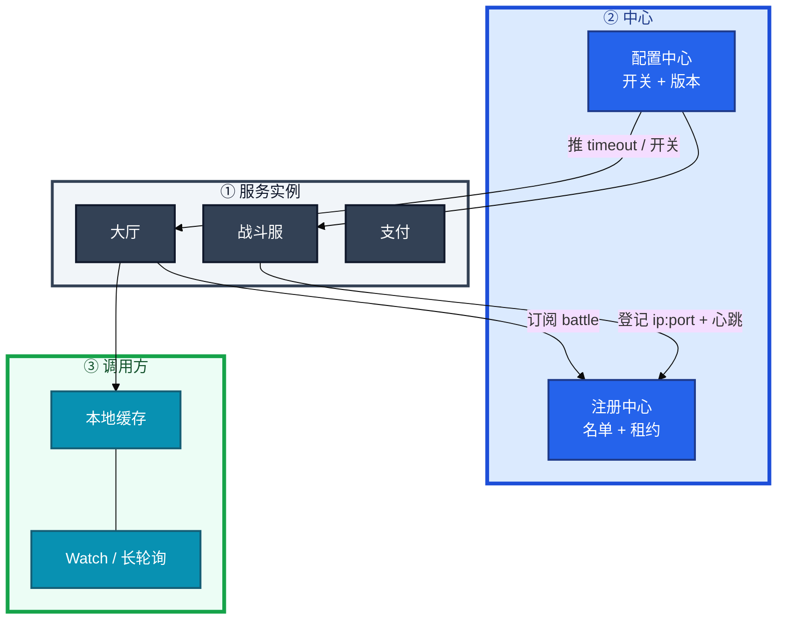
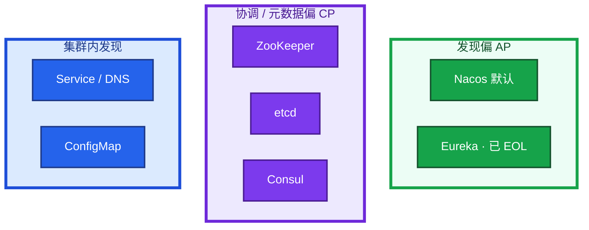
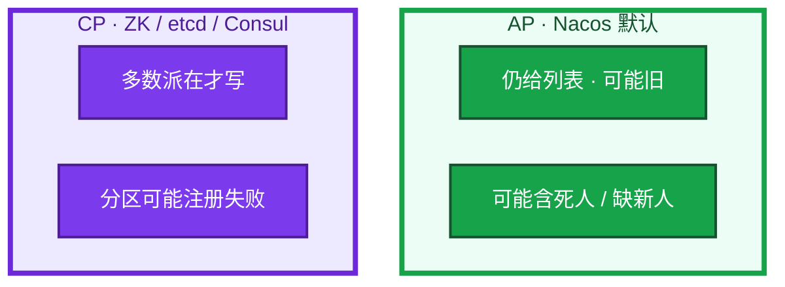
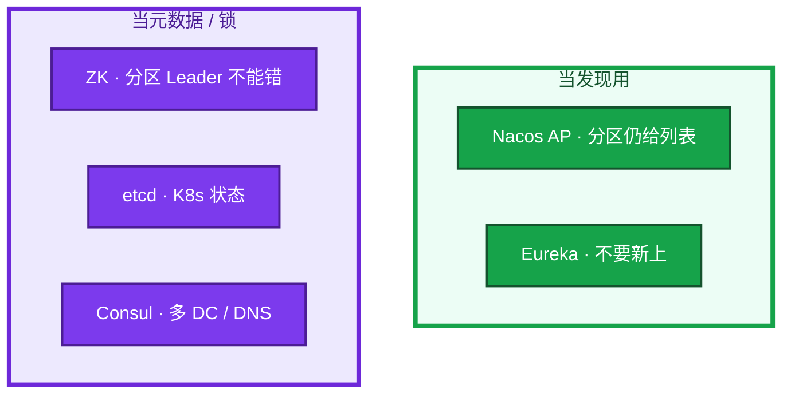
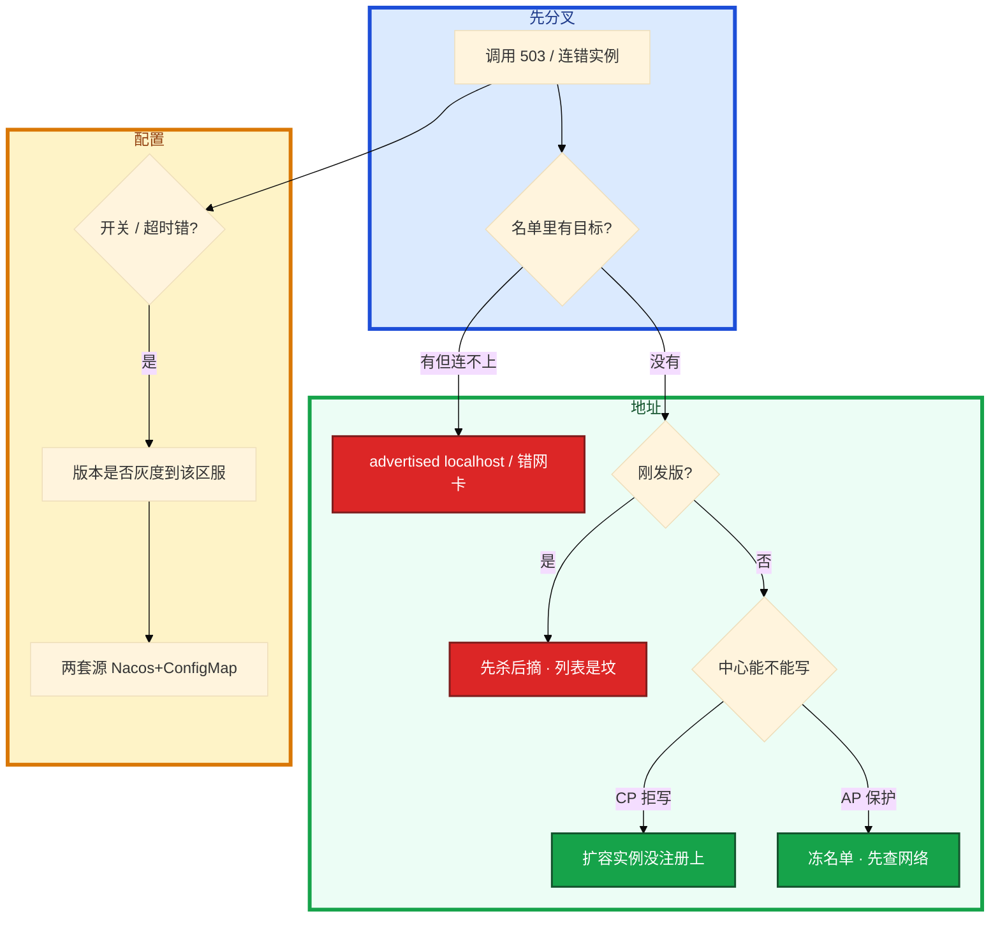

# 注册中心与配置中心


活动整点扩了 10 台大厅，机房到 Nacos 的网抖了 30 秒。群里有人要重启全部逻辑服「重新注册」，另有人要把保护模式里「不健康」实例全部手动下线。

先别动手。这一章后半全是你会动手的：**怎么查名单、怎么摘流、怎么灰度开关、怎么回滚配置。** 前面的概念和原理，是为了让你动手时不选错路。

**读完你能：** 白板上画出谁注册、谁订阅；中心挂了能判断长连接还在不在；能对比 Nacos / ZK / Consul / etcd；会配置热更新、灰度、回滚；滚动发布先摘流再杀进程。

**本章主线（排障就按这三步想）：**

1. **分层**：注册中心（名单+租约）vs 配置中心（开关+版本）；长连接不经中心。
2. **归类**：502/连错 → advertised/先杀后摘；中心抖 → AP 冻名单 vs CP 拒写；开关错 → 配置版本。
3. **留证**：名单地址从调用方 telnet + 进程日志配置版本号。

## 本章目录

- [1. 基本概念](#1-基本概念)
- [2. 架构图](#2-架构图)
- [3. 原理](#3-原理)
  - [3.1 一次注册](#31-一次注册大厅怎么找到新战斗服)
  - [3.2 AP vs CP](#32-ap-vs-cp中心抖了调用还通不通)
  - [3.3 Nacos / ZK / Consul / etcd](#33-nacos-zk-consul-etcd对比)
  - [3.4 配置热更新](#34-配置热更新推到进程才算下去)
- [4. 落地](#4-落地)
  - [4.1 生产怎么选](#41-生产怎么选)
  - [4.2 落地你实际看到什么](#42-落地你实际看到什么)
- [5. 核心配置](#5-核心配置)
- [6. 命令与操作](#6-命令与操作)
  - [6.1 摘流与滚动](#61-摘流与滚动先摘再杀)
  - [6.2 配置灰度与回滚](#62-配置灰度与回滚)
  - [6.3 保护模式](#63-保护模式不要清名单)
- [7. 生产排障](#7-生产排障)
- [8. 必会 · 常考](#8-必会-常考)
- [合上书](#合上书问自己)

**本章不讲：** etcd Raft、quorum、备份、磁盘 → [04-02 etcd](../../04-Kubernetes/02-etcd/)；ConfigMap / Secret 注入 → [04-12](../../04-Kubernetes/12-配置与密钥/)；优雅退出、摘流顺序细节 → [04-04 Pod](../../04-Kubernetes/04-Pod生命周期/)；网关动态路由、APISIX+etcd → [04 接入网关](../04-接入网关/)；Kafka 老集群的 ZK 运维 → [05 Kafka](../05-Kafka/)。

---

## 1. 基本概念

进程自己**不知道**对面谁还活着。写死 IP 等于把「谁在」刻进发版包：扩一个、挂一台、迁一次机都要改配置。注册中心把「谁在」收成一份可订阅的名单；**租约 / 心跳是那扇门**——到期不续，名单里就该消失。配置中心是另一扇门：开关和超时不该为改一个数字就发版。

| 在注册/配置中心 | 不在这里 |
|-----------------|----------|
| 实例 ip:port、元数据、健康状态 | 已经打上的长连接、内核里的转发规则 |
| 超时、活动开关、区服入口、维护公告 | 线程池、监听端口、要重建的数据结构 |
| 订阅变更、本地缓存、灰度版本 | K8s 里 Pod 什么时候 SIGTERM（04-04） |

四个角色不要混：

| 角色 | 干什么 |
|------|--------|
| **注册中心** | 登记、发现、按租约剔除 |
| **配置中心** | 集中存放、watch 下发、版本 / 灰度 / 回滚 |
| **调用方本地缓存** | 中心抖了短时间还能打；要有 TTL 和失败摘除 |
| **进程自己的摘流** | 注册中心不替你做优雅下线；preStop / 停匹配要自己做 |

职责四件：注册、发现、健康剔除、配置下发（很多产品一身二职）。游戏大厅找战斗服、GM 找区服、微服务找支付，都是这一张图。合服后「区服入口」更像配置（名单、维护公告），用配置中心推，不要让每个登录请求去问注册中心「这服还开不开」。

> **记住**：注册中心挂了 ≠ 正在打的 RPC 立刻全断。已有连接和本地缓存还能撑一会儿；新实例上不来、死人摘不掉。名单里还有、进程已经要下了，中心不替你做优雅摘流。

---

## 2. 架构图

先把整张图钉住。后面选型、命令、排障都对着这张图说话。



图上三条线：

1. **没有箭头要求每个 RPC 都问中心。** 调用方订阅 + 本地缓存。每请求问中心会把中心打成单点。
2. **已打上的长连接不经中心。** 中心影响的是新发现、扩缩、摘流。
3. **配置走另一条推送。** 改完不是文件换了就行，是进程 watch 到、用上、出问题能退。

三种产品形态（装的时候选，分区时语义不一样）：



选型心法：**发现优先可用（AP）**，**配置优先一致（CP）**。K8s 里 Service 发现走 API/DNS，不是业务进程直连 etcd 当 Dubbo 注册中心。集群内无状态服务用 ConfigMap 即可；跨集群、非 K8s、要精细灰度，用 Nacos / Apollo。两边概念类似，范围不同，不要叠两套改同一份超时。

---

## 3. 原理

原理只保留动手和面试会用到的：名单怎么更新、分区时选 AP 还是 CP、几套产品差在哪、配置怎样才算热更新成功。

**本节 4 块：** 3.1 一次注册 · 3.2 AP vs CP · 3.3 产品对比 · 3.4 配置热更新

### 3.1 一次注册：大厅怎么找到新战斗服

你扩了一台战斗服。进程启动后向 Nacos 登记 `ip:port` + 元数据（区服、房间类型），然后按租约心跳。大厅已经订阅了这个服务名。


逐步对应你眼睛看到的：

1. **注册成功**  
   控制台名单里多了一行。大厅 watch 到变更，本地缓存更新。新登录可以打到这台。已有长连接还打旧的那几台，不经中心。
2. **心跳停了**  
   进程被杀、网卡抖、租约到期。过了超时窗口，名单摘掉。大厅下次选服不再分给它。窗口内仍可能把请求打到坟上——所以调用方自己还要有超时和失败摘除。
3. **advertised 写成 localhost**  
   名单里有实例，别的机器连不上。和 Kafka 的 `advertised.listeners` 同一类坑。从大厅机器 `curl` / telnet 名单里的地址端口，绕开「控制台看起来在」。

调用方应订阅变更，不要每个请求都问中心。缓存要有 TTL 和主动推送，两者缺一：只推不缓存，中心挂了立刻盲；只缓存不推，扩缩要等过期。

Watch 和拉：大厅本地缓存 + 订阅。健康检查只探 TCP 端口不够：进程在但读不了配置、依赖挂了，仍该从列表摘掉。注册中心剔除是慢路径（心跳超时秒级）；调用方超时、熔断、摘除是快路径。两层都要。

探活把下游依赖全探一遍会雪崩：依赖抖动让实例在列表里进进出出。探自己「能不能接请求」，下游失败用熔断，不要把 Redis 抖动翻译成「全部注销」。

### 3.2 AP vs CP：中心抖了，调用还通不通

CAP 在分区时要在 C 和 A 里选。注册中心的分区意味着：一部分节点看不到新实例。



逐步对应你眼睛看到的：

1. **已有长连接、已缓存的名单**  
   RPC 通常还在打。这和「控制面挂了、已运行 Pod 还在」是同一类影响面。不要一上来答「全站挂了」。
2. **新实例注册失败（CP）**  
   扩容的那 10 台进不了列表，流量还打旧的。登录排队，旧实例被打满。先看中心能不能写，不要先加机器。
3. **名单里有死人（AP / 保护模式）**  
   调用 502 / 超时。先看是不是保护模式冻名单（7.3），再看心跳是不是真断了。

所以发现选 AP：宁可拿到略旧的地址，也不要「发现失败 → 登录全挂」。配置选 CP：超时、开关、支付开关不能一半实例 3 秒一半 30 秒。Nacos 配置走 CP、发现走 AP，就是这个拆法。

配置分裂比发现略旧更糟。发现旧列表最多打到一台刚下线的，超时重试。配置一半开活动一半不开，是 **业务语义错**，不是超时。

> **记住**：中心挂了，已有调用靠缓存和长连接；扩容摘流会停。发现选 AP，配置选 CP。不要为了「做点什么」重启还活着的战斗服。

### 3.3 Nacos / ZK / Consul / etcd：对比

国内面试最容易把 K8s 控制面和业务发现搅在一起。先把产品钉死，再谈运维。

| 方案 | CAP | 一身二职 | 健康怎么摘 | 现场怎么记 |
|------|-----|----------|------------|------------|
| **Nacos** | AP/CP 可选，默认 AP | 注册 + 配置 | 心跳超时才摘，窗口更长 | 国内微服务最常见 |
| **ZooKeeper** | CP | 协调（锁、选主、注册） | 临时节点断连从树上消失 | 老 Dubbo / 老 Kafka |
| **etcd** | CP | K8s 状态；也可当发现 | lease 过期删 key | 运维细节在 04-02 |
| **Consul** | CP | 发现 + KV + 多 DC | 主动 HTTP/TCP check；原生 DNS | HashiCorp 栈 |
| **Eureka** | AP | 注册 | 心跳 | 已 EOL，只在老项目 |



对照细节（追问会问到）：

1. **ZK 临时节点**：TCP 抖动会误删，客户端要防抖。适合「进程在才有节点」。CP 在分区时注册失败。Kafka 仍用它（或用 KRaft 取代）是因为 **分区 Leader 信息不能错**，那是元数据不是服务列表。Dubbo 老集群同理。新微服务发现不必再默认 ZK。
2. **etcd**：K8s 用它存集群状态，Service 发现走 API/DNS。watch 推变更，可以当配置/锁，但游戏业务发现国内更常见 Nacos。lease 过短导致抖动、过长导致死人残留——若落到 K8s 组件上，去 04-02，不要在业务发现里手搓一套 etcd TTL 当 Nacos 用。磁盘、quorum、备份不问这章。
3. **Consul**：服务注册 + KV + **多数据中心 WAN gossip**，自带 DNS 接口（`*.service.consul`）。健康检查是中心主动探，和 Nacos 客户端心跳不同。HashiCorp 栈（Nomad / Vault）常见；国内游戏业务发现仍以 Nacos 居多。CP：分区时写失败，和 ZK 同类取舍。
4. **Nacos**：发现默认 AP，配置可走 CP。保护模式见 7.3。一体够中小规模；多团队改开关、要强权限灰度审计，配置侧看 Apollo。

业务发现：新项目 Nacos。已有 ZK 生态继续 ZK。K8s 服务发现走 Service / DNS。Consul 适合要 DNS 和多 DC 的那套。etcd 和 Nacos **不是同一个运维对象**。

### 3.4 配置热更新：推到进程才算下去

运营要把某区服的礼包开关打开。不该为这一个数字发版。配置中心要：集中存放、环境隔离、变更可审计、能回滚、能灰度。改完不是「文件换了就行」，是 **进程 watch 到、用上、出问题能退**。


热更新不是所有键都能热更：

| 能热更 | 仍要重启 |
|--------|----------|
| 开关、超时、名单、活动开始时间、排队阈值 | 线程池大小、监听端口、数据结构变了 |
| 区服入口、维护公告 | 连接串、证书路径、分片规则（那是 07 的迁移） |

推送机制：Nacos 长轮询 + 推；ZK / etcd / Consul 是 watch。进程必须实现 listener，不是「中心里有值」就算热更新。相关键放同一个 dataId，避免一半新一半旧。日志里应能看到配置版本号。

灰度：先 1% 实例 / 先一个区服。支付开关、活动整点开关必须走这条，不要全量一把推。失败 → 回滚上一版本，秒级，不要再发版救。权限和审批按配置中心的，不要个人 token 直改生产。推错支付开关 = 事故。

两套源：Nacos + ConfigMap 改同一份超时，值还不一样。同一份超时不要两套源。集群内无状态用 ConfigMap 即可（04-12，热更能力看挂载方式）；跨集群、非 K8s、要精细灰度，用 Nacos / Apollo。

Apollo：权限、灰度、审计更强，多团队改开关时更合适。Nacos 一体够中小规模。AP 配置中心能用，但要接受短暂不一致，用版本号和对账兜；支付、活动开关不要赌这段窗口。

Spring `@RefreshScope` 会重建 bean，进行中的请求可能打到半新半旧。长生命周期对象（线程池）改大小不安全。能热更的键要在文档里列白名单。

游戏：活动开关、排队阈值、区服入口从配置中心推，比发版快。合服名单、维护公告也走配置，不要 SSH 改文件。大厅发现战斗服用注册；区服开关、活动开关用配置，灰度后全量。

> **记住**：配置下去 = 进程日志里的版本号对得上。不是控制台显示已发布。

---

## 4. 落地

### 4.1 生产怎么选

| 项 | 选 | 不选 |
|----|----|------|
| 业务发现 | Nacos（AP）；已有 ZK 生态可继续 | 新项目默认 ZK；Eureka 新上；业务 Pod 直连 etcd |
| 配置 | Nacos CP 或 Apollo；集群内 ConfigMap | 两套源改同一份超时；SSH 改文件 |
| 多 DC / DNS 发现 | Consul | 用 ZK 硬撑跨城 |
| 节点数 | 3（CP 要奇数）；Nacos 集群同样不要单点 | 单机当生产 |
| 地址 | advertised 对端可达 | localhost、容器内网 IP 对不上 |

托管 / 自建：上线前问清谁管集群、怎么备份配置版本、权限模型、是否和 K8s DNS 抢发现。

### 4.2 落地你实际看到什么

Nacos：主端口 **8848**（控制台 / Open API），客户端 gRPC **9848**。集群节点写 `cluster.conf`。数据盘独立。鉴权打开，不要对整个 VPC 裸奔。

ZK：2181，ZAB 集群 3 或 5。`zoo.cfg` 里 `tickTime` / `initLimit` / `syncLimit`。临时节点 + watch。不要当大配置仓库灌。

Consul：8500 HTTP、8600 DNS。agent 每台或每机房；server 3 或 5。跨 DC 走 WAN gossip，不是再拼一套 ZK。

etcd 当业务发现：能跑，国内少见。K8s 那套运维（2379/2380、quota、fsync）去 04-02。

验收：控制台名单里的地址，从 **调用方机器** telnet 通；订阅方日志有版本 / 实例变更；杀掉一个实例，超时窗口后名单消失（或主动下线立即消失）。不要只探 8848 TCP。

---

## 5. 核心配置

只动有证据的项。心跳、保护模式、鉴权会改变「死人还在不在名单里」。

| 参数 / 项 | 生产怎么用 | 改错会怎样 |
|-----------|------------|------------|
| 心跳间隔 / 超时 | 覆盖同城 RTT + GC 停顿；过短误摘 | 过长死人残留；过短抖动 |
| Nacos 保护模式 | **开着**；大量失联时冻名单 | 关掉 + 网抖 = 发现为空雪崩 |
| advertised / IP | 调用方可达的 IP/DNS | 名单有、连不上 |
| 配置 dataId / group / namespace | 环境隔离；相关键同一份 | 改了 test 打到 prod；半新半旧 |
| 鉴权、审计 | 生产强制 | 个人 token 直改支付开关 |
| 客户端缓存 TTL | 有上限，配合推送 | 永不刷新打坟场；刷新太勤打中心 |
| ConfigMap vs Nacos | 同一份超时只留一套 | 两套源打架 |

> **记住**：保护模式看起来像「死人还在」，先查网络，不要手动清列表。心跳用来覆盖同城抖动，不是用来扛跨地域。

---

## 6. 命令与操作

证书和 token 写成变量。Nacos 示意（Open API）：

```bash
# 服务实例列表
curl -s "http://nacos:8848/nacos/v1/ns/instance/list?serviceName=battle"
# 配置（带 tenant/group）
curl -s "http://nacos:8848/nacos/v1/cs/configs?dataId=timeout.yaml&group=DEFAULT_GROUP"
```

| 目的 | 看什么 |
|------|--------|
| 名单里有没有目标 | 实例 IP/port、healthy、元数据区服 |
| advertised 可达 | 从调用方机器 telnet 该 IP:port |
| 配置版本 | 控制台版本号 vs 进程日志 |
| 保护模式 | 大量 unhealthy 但仍在列表 |
| ZK | `ls /dubbo/...`、`stat` 临时节点 |
| Consul | `consul members`、`consul catalog services`、DNS 查询 |
| 不要做 | 高峰重启注册中心；手动清空保护模式名单 |

值班先跑这几条：名单有没有实例 → 地址能不能连 → 是不是刚发版先杀后摘 → 配置版本是否灰度到该区服 → 两套源是否打架。

指标：

| 指标 | 阈值 | 级别 |
|------|------|------|
| 注册中心进程 / 多数派 | 挂 / 无 Leader | **P0** 扩容摘流停 |
| 心跳超时实例占比 | 突然大面积 | P1 先看中心到机房网络 |
| 配置推送失败 / 版本不一致 | 支付、活动开关 | **P0** |
| 客户端打中心 QPS | 每请求都问 | P1 缓存没生效 |

日志：`localhost` 注册、`connection refused` 打名单地址、配置 `md5` / 版本对不上、保护模式 `protect`。

---

### 6.1 摘流与滚动：先摘再杀

K8s 滚大厅。正确顺序：先从注册中心摘流 → 打完存量连接 → 再杀进程。注册中心不替你做这一步。配合 preStop 和就绪探针，见 04-04。


先杀再摘 = 列表是坟，调用 502 / 超时。健康检查不要只探 TCP。

### 6.2 配置灰度与回滚

1. 改配置带版本。
2. 灰度到 s1（一个区服）。看结算、客服单。
3. 确认再全量。失败 → 回滚上一版本，不要再发版救。
4. 进程日志版本号对得上才算下去。

支付开关、活动整点开关必须走这条。

### 6.3 保护模式：不要清名单

Nacos **保护模式**：大量实例同时失联（往往是注册中心到机房的网络，不是业务全死）时，不立刻清空列表，避免「误剔除 → 发现为空 → 雪崩」。看起来「死人还在列表里」可能是保护，先查网络和中心健康，不要再手动清列表。

一次活动整点的形状：机房到 Nacos 的网抖 30 秒，心跳大批超时。保护模式把名单冻住，大厅仍按旧列表打。你眼睛看到：控制台里实例还在、healthy 参差，调用 502 是个别死人，不是名单被清空。此时手动下线全部「不健康」实例，等于自己制造发现为空、登录全挂。先查中心到机房的网络，等心跳恢复。

---

## 7. 生产排障

和 01 同一套三问：进程还在不在？还能不能变更？已有流量还通不通？

**注册中心不可用 = 不能扩容摘流，不是立刻踢玩家。** 已打上的长连接通常还在。



现场顺序：从调用方机器连名单里的地址；对配置版本号；看滚动是不是先杀后摘。不要先重启注册中心——重启会再抖一轮名单。

| 现象 | 先做什么 | 不要做什么 |
|------|----------|------------|
| 中心挂了 | 已有长连接通常还在；修中心 | 重启全部逻辑服 |
| 保护模式冻名单 | 查中心到机房网络 | 手动清掉全部不健康 |
| 502 刚发版 | 先摘后杀、preStop | 加机器 |
| 名单有连不上 | advertised | 当中心坏了去重启 |
| 一半开活动一半关 | 配置版本 / 灰度 / 两套源 | 再发版救 |
| 每请求打中心 | 订阅 + 缓存 | 给中心加节点当第一刀 |

常见误判：① 中心挂了 = 业务全死 ② CP 注册中心更「企业级」 ③ etcd 运维题在这章展开 ④ 健康检查只探 TCP。

---

## 8. 必会 · 常考

白板和追问高频，能一口回：

| 说法 | 对错 | 口径 |
|------|:----:|------|
| 注册中心挂了，战斗长连接立刻全断 | 错 | 长连接不经中心；扩容摘流会停 |
| 发现应该选 CP 更安全 | 错 | 发现优先 AP；配置优先 CP |
| 新项目用 ZK 当默认注册中心 | 错 | 元数据/锁才强依赖 CP；发现用 Nacos |
| 业务 Pod 直连 etcd 当 Dubbo 注册 | 错 | K8s 发现走 API/DNS；etcd 运维在 04-02 |
| Consul 和 Nacos 没区别 | 错 | Consul CP + 主动探活 + DNS + 多 DC |
| Eureka 还可以新上 | 错 | 已 EOL |
| 改了配置控制台显示已发布就算热更新 | 错 | 进程日志版本号对得上才算 |
| 所有配置都能热更 | 错 | 端口、线程池、结构变化要重启 |
| 滚动可以先杀 Pod 再等心跳摘流 | 错 | 先摘再杀，否则列表是坟 |
| 保护模式下应手动清掉不健康实例 | 错 | 先查网络，清名单会雪崩 |
| 健康检查探 TCP 就够 | 错 | 进程在但依赖挂了仍该摘 |
| Nacos 和 ConfigMap 可以同时改同一份超时 | 错 | 两套源打架 |
| advertised 写成 localhost 没问题 | 错 | 别的机器连 127.0.0.1 |
| 每个 RPC 都问注册中心最新名单 | 错 | 订阅 + 本地缓存 |

数字：Nacos 8848 / 9848；ZK 2181；Consul 8500 / 8600 DNS；CP 集群 3 或 5；保护模式对应「机房到中心网抖」而不是业务全死；配置灰度先一个区服。

易混：注册 vs 配置；AP vs CP；Nacos vs ZK vs Consul vs etcd；心跳摘除 vs 调用方超时；保护模式 vs 真有死人；热更新 vs 重启项；ConfigMap vs Nacos；先摘 vs 先杀。

---

## 合上书，问自己

1. 注册中心解决什么？配置中心解决什么？长连接经过中心吗？
2. 发现为什么偏 AP、配置为什么偏 CP？中心挂了还能不能扩容？
3. Nacos / ZK / Consul / etcd 各适合什么？etcd 运维问哪一章？
4. 配置热更新怎样才算成功？哪些键不能热更？灰度怎么走？
5. 滚动发布注册中心这边先做什么？advertised 写成 localhost 会怎样？
6. 保护模式是什么？该不该手动清名单？该不该重启全部逻辑服？

六题都能口述，这一章就过了。下一章把 Elasticsearch 剖开：倒排、分片、黄红、堆和磁盘。
