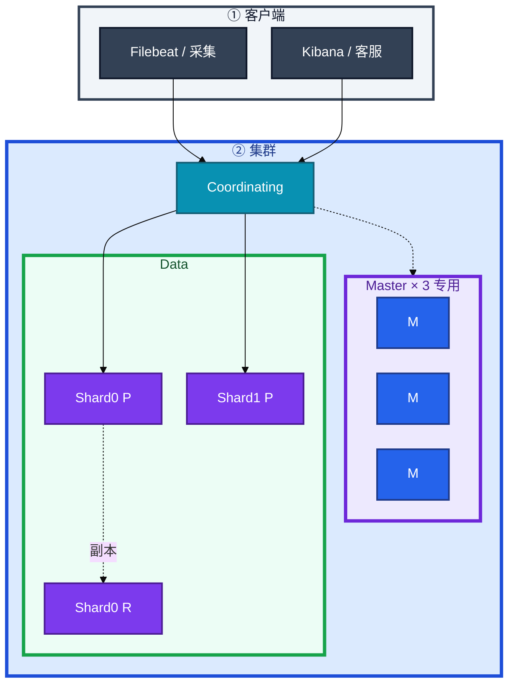
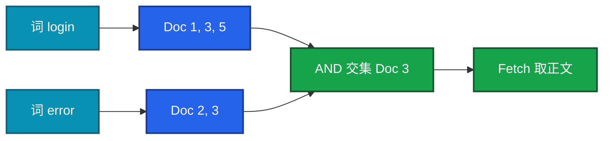
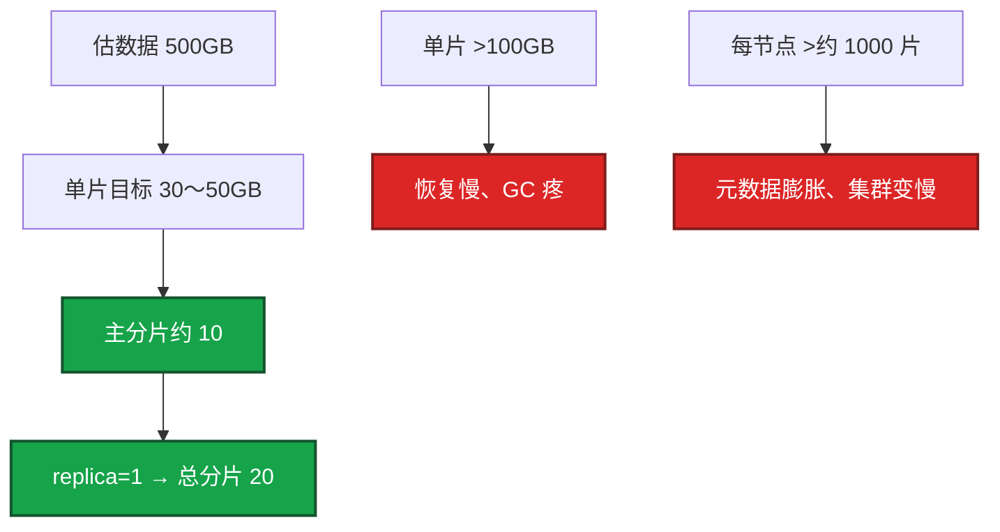
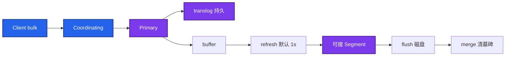
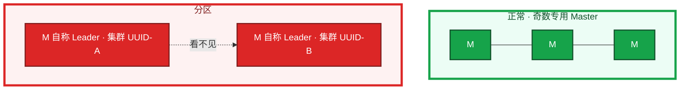
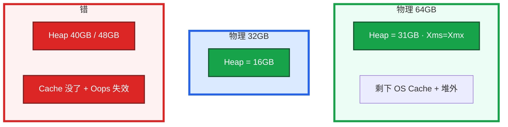
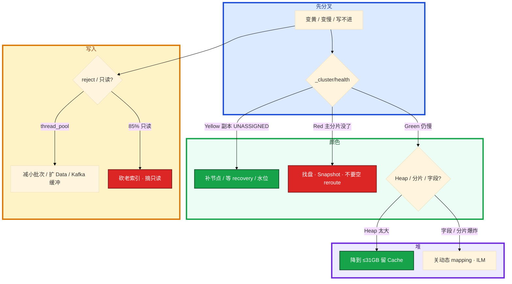

# Elasticsearch


活动高峰集群变黄，查询变慢。群里有人要把 Heap 加到 40GB，另有人要重启 Data 节点「变绿」。采集还在跑，磁盘 87%。

先别动手。这一章后半全是你会动手的：**怎么看黄红、怎么救磁盘水位、怎么 ILM、怎么 snapshot。** 前面的概念和原理，是为了让你动手时不选错路。

**读完你能：** 白板上画出倒排和分片；Yellow / Red 能判断能不能搜全；Heap 不超过 31GB；会 ILM、水位摘只读、Snapshot；能区分日志检索和业务检索，以及 ES / Loki / CH。

## 本章目录

缩进 = 上下级。3 下面才是 3.1。

想钉在**正文左边**跟着滚：菜单 **查看 → 打开视图 → 大纲**。Markdown 预览做不到独立左栏，目录只能写在文章开头。

- [1. 基本概念](#1-基本概念)
- [2. 架构图](#2-架构图)
- [3. 原理](#3-原理)
  - [3.1 倒排](#31-倒排词查文档不是扫日志)
  - [3.2 分片与副本](#32-分片与副本大小主分片改不了)
  - [3.3 一次写入](#33-一次写入refresh-后才可搜)
  - [3.4 脑裂](#34-脑裂两个-master-各写各的)
  - [3.5 GC 与堆](#35-gc-与堆为什么不能-40gb)
  - [3.6 日志检索 vs 业务检索](#36-日志检索-vs-业务检索)
- [4. 安装部署](#4-安装部署)
  - [4.1 生产怎么选](#41-生产怎么选)
  - [4.2 落地你实际看到什么](#42-落地你实际看到什么)
- [5. 核心配置](#5-核心配置)
- [6. 常用命令](#6-常用命令)
- [7. 常用操作](#7-常用操作)
  - [7.1 ILM](#71-ilm)
  - [7.2 Snapshot](#72-snapshot)
  - [7.3 Yellow / Red](#73-yellow--red)
  - [7.4 磁盘水位](#74-磁盘水位摘只读)
- [8. 生产排障](#8-生产排障)
- [9. 必会 · 常考](#9-必会--常考)
- [合上书](#合上书问自己)

**本章不讲：** 采集、EFK vs Loki 架构 → [04-19 日志](../../04-Kubernetes/19-日志管理/)；消息管道、积压 → [05 Kafka](../05-Kafka/)；文档库、TTL 邮件 → [06 MongoDB](../06-MongoDB/)；列存 SQL 细节不单开，选型见 3.6。

---

## 1. 基本概念

ES 是基于 Lucene 的分布式搜索和分析引擎。快，是因为 **倒排索引**（词 → 文档列表）加上 **分片并行**。它不是通用数据库：写入近实时、堆贵、磁盘水位狠，适合搜，不适合当账本。

客服搜「玩家 10001 登录失败」。请求打到 Coordinating 节点，散到 `logs-game` 的各分片，再汇总。

| 在 ES 里 | 不在 ES 里 |
|----------|------------|
| 倒排、分片、副本、Segment | 玩家钱包、发货账本（01 MySQL） |
| 全文、多条件筛选、客服按关键词 | 超大范围 group by（ClickHouse） |
| 近实时可搜（refresh 后） | 实时（默认 1s 间隔） |

RDBMS 对照：Index ≈ 表，Document ≈ 行，Field ≈ 列，Mapping ≈ schema，Shard ≈ 分区，Replica ≈ 从副本。7.x 后一 Index 一表更干净。

三个角色不要混：

| 角色 | 干什么 |
|------|--------|
| **Master** | 元数据、分片分配；生产 **3 台专用**，不存业务数据 |
| **Data** | 存数据、建倒排、查 |
| **Coordinating** | 收请求、散到各分片、汇总（大集群可独立；小集群 Data 兼任） |

> **记住**：倒排是词查文档，不是扫日志。ES 不当 MySQL 存玩家档。用 ES 当源数据是选型错误。

---

## 2. 架构图

先把整张图钉住。后面安装、命令、排障都对着这张图说话。



图上三条线：

1. **写入打 Primary**，再复制到 Replica。搜可以打副本。
2. **Master 不存业务数据。** Data 的 GC 不要拖集群状态——所以 Master 专用。
3. **Index 下面是 Shard，Shard 下面是 Segment**（Lucene 不可变文件）。

三种检索不要混（装的时候选索引设计，挂的时候成本不一样）：


采集侧应有 Kafka 缓冲（05），ES 拒写时日志还在队列里，否则丢的是检索不是管道。CH 不单开章。

---

## 3. 原理

原理只保留动手和面试会用到的：为什么快、片怎么规划、为什么不是实时、两个 Master 为什么危险、堆为什么不能 40GB、日志和业务检索为什么不要一个 Index。

**本节 6 块：** 3.1 倒排 · 3.2 分片副本 · 3.3 写入 · 3.4 脑裂 · 3.5 GC · 3.6 日志 vs 业务

### 3.1 倒排：词查文档，不是扫日志

正排：文档 → 里面有哪些词（扫文档）。倒排：词 → 哪些文档含它（查表）。



倒排由 **词典（term dictionary）+ 倒排表（posting list）** 组成。分词器（analyzer）把正文切成 term：`text` 会分词，`keyword` 整值不分词。过滤、聚合、routing 用 keyword；全文用 text。

查询两阶段：

1. **Query**：各分片报 ID + 分数，协调节点汇总排序取 TopN。
2. **Fetch**：再按 ID 取正文。

按玩家检索加上 `routing=player_id`，避免每次客服查询 scatter 全部分片。`player_id` 用 keyword 做过滤，正文用 text。

一句话收口：**倒排是词查文档，不是扫日志；Query 拿 ID，Fetch 拿正文。**

### 3.2 分片与副本：大小、主分片改不了

主分片数创建后不能改（要 reindex）。副本可动态改。文档落到哪片：`hash(routing) % 主分片数`，默认 routing 是 `_id`，可改成 `player_id` 让同一玩家在一片。

估一把游戏日志：



过少：不并行、迁一次要搬很久。过多：Master 和堆都被元数据吃掉。日志用 ILM rollover，按天或按 50GB 切新 Index，不要手建无限 `logs-yyyy.MM.dd` 还不删。

副本：replica ≥ 1，跨 AZ / 机架（awareness），别把主副放同一故障域。副本可升主。配置了 replica=1 **不等于已经有副本**——Yellow 拖很久等于你已经没有冗余。单节点集群没有地方放副本，会一直黄，这是拓扑不是故障。

卡住先看哪：查询慢且每次打全部分片 → 没 routing，或分片太多元数据膨胀。单片恢复要几十分钟 → 片太大，该 reindex 拆开。

> **记住**：单片 30～50GB；主分片数创建后不能改；日志靠 ILM 防分片爆炸。

### 3.3 一次写入：refresh 后才可搜

采集端（Filebeat / 自研）把一条登录失败日志 bulk 进来。Segment 不可变：写入先进内存 buffer + translog，`refresh`（默认 1s）后成新 Segment 才可搜——所以是近实时不是实时。删除只是打墓碑，空间要 merge 才吐出来。更新 = 删旧 + 写新。



逐步对应你眼睛看到的：

1. **bulk 返回 200，立刻搜还没有**  
   正常。等 refresh。活动灌日志可把 `refresh_interval` 调到 30s 换吞吐，代价是更晚可搜。
2. **bulk reject**  
   线程池 `write` / `bulk` / `search` queue 满。看 `_cat/thread_pool`。生产写入走 Bulk，单批大约 5～15MB。不要关 translog 换吞吐还当不丢。
3. **删了文档，磁盘没掉**  
   墓碑还在，等 merge。温数据低峰 `forcemerge` 到少量 Segment。热 Index 上 forcemerge 会抢 IO，写入更差。

写入优化（活动灌日志）：Bulk、调大 refresh、临时 replica=0（有窗口风险，写完改回）、多客户端并行、看 bulk reject。reject 了这批没进 ES，采集侧要重试或进 Kafka 缓冲。

### 3.4 脑裂：两个 Master 各写各的

脑裂 = 网络分区后 **两个 Master-eligible 节点都认为自己当选**，形成两套集群状态、两套数据。ES 不是「自动合并」；合错了是数据撕裂。



怎么防：

1. **Master 3 台专用、奇数。** 4 台容错不比 3 好（和 etcd 同一类多数派）。3 丢 1 还能选主能写；丢 2 控制面停。
2. **7.x+**：`cluster.initial_master_nodes` **只用于第一次 bootstrap**；之后靠集群状态。日常发现用 `discovery.seed_hosts`。不要每次启动都当新集群初始化。
3. 老 6.x：`discovery.zen.minimum_master_nodes = N/2+1`。新集群不要再靠这套。
4. Master 不要和 Data 混——Data Full GC 会让 Master 失联，看起来像分区，诱发选主抖动、分片分配卡住。
5. 已经裂成两团：**不要尝试合并。** 保住有数据的那一团，另一团清数据目录后以新节点加入。不要用 reroute 把空主分片「分配」到新节点当修复成功——那是空数据。

偶数 Master 没有更好的容错，别上 4 台觉得更稳。跨 AZ 放 Master，避免一个机房网络把多数派切走。

### 3.5 GC 与堆：为什么不能 40GB

查询变慢，有人要把 Heap 加到 40GB。Lucene 靠 OS Page Cache mmap 读 Segment。Heap 太大，Cache 没了，查询变磁盘。Heap 超过约 31GB，压缩指针（Compressed Oops）失效，指针变 8 字节，GC 更差。



铁律：Heap **不超过物理内存一半**，**不超过 31GB**。`Xms=Xmx`。7.x+ 用 G1（CMS 已退）。

GC 疼从哪来：fielddata 膨胀、段太多、动态 mapping 字段爆炸、巨大聚合、分片过多导致堆上元数据。限 fielddata、circuit breaker；温数据低峰 forcemerge。不要用加 Heap 掩盖分片爆炸。

Data 节点 Full GC 会冻住，若混部 Master，集群状态和分片分配一起抖——这是 3.4 要专用 Master 的原因。

> **记住**：64GB 机器 Heap 31GB，不是 48GB「显得大方」。超过 31GB 指针变 8 字节，同样数据占更多堆，GC 扫描更重。

### 3.6 日志检索 vs 业务检索

两者都用倒排，**Index 设计、保留、routing、能不能丢** 完全不是一套。不要一个大 Index 扛所有。

| | 日志检索 | 业务检索 |
|--|----------|----------|
| 典型 | 登录失败原文、异常堆栈、按 keyword 搜报错 | 客服按 `player_id` 搜操作、聊天、道具流水 |
| 写入 | 极高、可 Kafka 削峰；reject 可重试 | 中等；映射要严，丢了就是客服事故 |
| Mapping | 动态要关或白名单；`message` text + 少量 keyword | `player_id` keyword + routing；正文 text；**关动态 mapping** |
| 生命周期 | ILM：1 天或 50GB rollover，7～30 天删 | 更长；按业务过期，常要 reindex 改 mapping |
| 查询 | 时间范围 + 关键词；可接受 scatter | **必须 routing**，避免全分片扫 |
| 源数据 | 日志本来就不是账本 | 源仍在 MySQL / Mongo；ES 是索引 |
| 可以换成 | 只按 label 捞 → Loki | 不能换成 Loki；漏斗仍去 CH |

字段爆炸：动态 mapping 把每次活动 JSON 里的新 key 建成新字段，集群状态膨胀，Master 变慢。生产关闭动态 mapping 或白名单。高基数聚合、无限字段是集群变慢的常见原因。真正的漏斗分析仍去 CH。

和 Mongo 的差别：Mongo 适合按 `player_id` 拉文档。要全文、多条件、高并发检索用 ES。邮件过期用 Mongo TTL（06），不要靠 ES 当源数据。

游戏：客服检索、异常 IP、版本对比日志用 ES。只按服 / 等级扫应用日志、成本敏感用 Loki。运营报表不要逼 ES 做列存的活。三者可以并存。

| | Elasticsearch | Loki | ClickHouse |
|--|---------------|------|------------|
| 擅长 | 全文搜、多条件筛选 | 按 label 捞日志 | OLAP 聚合 |
| 索引 | 正文倒排 | 只索引 label | 列存 |
| 成本 | 堆 + 盘都贵 | 低 | 中 |
| 不擅长 | 超大范围 group by | 内容全文、复杂检索 | 全文搜 |

```
  「搜这段报错原文 / 玩家聊天 / 客服按关键词」 --> ES
  「按 namespace、level、pod 拉一段时间日志」   --> Loki（K8s 19）
  「留存、付费漏斗、亿级 group by」             --> ClickHouse
  管道、削峰、重放                               --> Kafka（05）
```

---

## 4. 安装部署

### 4.1 生产怎么选

| 项 | 选 | 不选 |
|----|----|------|
| Master | 3 专用，奇数 | 4 台；和 Data 混部 |
| 副本 | replica ≥ 1，跨 AZ | 单节点还开副本却怪一直黄 |
| 磁盘 | 独立 SSD；盯水位 | 和游戏日志 / 容器盘混用到 85% |
| 堆 | ≤ 一半内存且 ≤31GB，Xms=Xmx | 40GB Heap |
| 检索 | 日志一套 ILM Index；业务一套严 mapping | 一个集群一个 Index 扛所有 |
| 缓冲 | 前面 Kafka | Filebeat 直打 ES 还当不丢 |

云上 Data 跨 AZ，避免主副同一机架。定期 Snapshot 到 OSS/S3。

### 4.2 落地你实际看到什么

角色在 `elasticsearch.yml`：`node.roles: [master]` 或 `[data]`。发现：`discovery.seed_hosts`；**仅首次** `cluster.initial_master_nodes`。数据目录 `path.data` 是数据。HTTP **9200**，节点间 **9300**。

```yaml
cluster.name: game-es
node.name: es-master-1
node.roles: [ master ]
network.host: 10.0.1.11
http.port: 9200
discovery.seed_hosts: ["10.0.1.11", "10.0.1.12", "10.0.1.13"]
cluster.initial_master_nodes: ["es-master-1", "es-master-2", "es-master-3"]
path.data: /var/lib/elasticsearch
bootstrap.memory_lock: true
```

`initial_master_nodes` 只在空白集群第一次用。已经组过群再写，可能当成新集群，诱发脑裂。Heap 在 `jvm.options`：`-Xms31g -Xmx31g`。

验收：`GET _cluster/health` 为 green（或单节点预期 yellow）；`_cat/nodes` 角色对；不要只探 TCP 9200。

---

## 5. 核心配置

只动有证据的项。改主分片数不等于改配置——要 reindex。

| 参数 | 生产怎么用 | 改错会怎样 |
|------|------------|------------|
| 主分片数 | 按 30～50GB/片估，创建时定死 | 过多元数据爆炸；过少恢复/GC 疼 |
| `number_of_replicas` | ≥1，可动态改 | 单节点一直黄是拓扑 |
| `refresh_interval` | 默认 1s；灌日志可 30s | 当实时；或关 translog 换吞吐 |
| 磁盘水位 | 80% 告警；85% 只读 | 当成采集挂了去重启 Filebeat |
| Heap | ≤50% 且 ≤31GB | Cache 没了 / Oops 失效 |
| 动态 mapping | 关或白名单 | 字段爆炸打满集群状态 |
| `cluster.initial_master_nodes` | 仅首次 bootstrap | 每次启动当新集群 → 脑裂风险 |

> **记住**：清完盘必须手动摘 `read_only_allow_delete`。quota 式的磁盘水位是硬的，不是「再写一点」。

---

## 6. 常用命令

值班先问能不能搜全，再动手。

```bash
GET _cluster/health          # status, unassigned_shards
GET _cat/nodes?v
GET _cat/shards?v            # 哪片 UNASSIGNED
GET _cat/indices?v
GET _cluster/allocation/explain
GET _cat/recovery?v
GET _cat/allocation?v        # 磁盘
GET _cat/thread_pool?v       # reject
```

| 目的 | 看什么 |
|------|--------|
| 颜色 | Green 全在；Yellow 缺副本还能搜全；Red 缺主分片 |
| 未分配原因 | `allocation/explain`：磁盘水位、节点不够、规则 |
| 写入 | `thread_pool` reject；不要只看 CPU |
| 堆 / GC | 节点 stats、GC 日志；不要先加到 40GB |

指标：

| 指标 | 阈值 | 级别 |
|------|------|------|
| 集群 Red | 有主分片没了 | **P0** |
| 磁盘 | **80%** 告警；**85%** 只读；**95%** 更狠 | P0/P1 |
| bulk reject | 持续出现 | P1 |
| Heap / GC 停顿 | Data 混 Master 时选主抖 | P1 |
| 字段数 / 分片数 | 爆炸 | P1 |

日志：`flood stage` = 水位；`rejected execution` = 线程池；`failed to ping` Master = 网络或 GC。

---

## 7. 常用操作

### 7.1 ILM

日志必须 ILM：Hot 写 → Warm forcemerge → Cold 便宜盘 → Delete。游戏行为日志 7～30 天全文，更老的要么归档对象存储，要么根本不进 ES。

```
  Hot    正在写、正在搜     rollover：1 天或 50GB
  Warm   只读、合并段       forcemerge 到少量 Segment
  Cold   便宜盘 / 少副本    很少查
  Delete 到期删             不要手留一年日索引
```

按天索引不 ILM，三个月后 Master 被分片数拖死。

### 7.2 Snapshot

Snapshot 到 OSS/S3。Red 且主分片回不来才 restore。快照不是 WAL，RPO 看快照间隔。不要用 reroute 空主当分片修复。

### 7.3 Yellow / Red

集群颜色是运维第一句。先问能不能搜全，不要先重启 Data 节点。

| 颜色 | 含义 | 现场 |
|------|------|------|
| Green | 主分片+副本都在 | 正常 |
| Yellow | 主分片全在，副本缺 | **能搜全，冗余不够** |
| Red | 有主分片没了 | **数据不完整，紧急** |

Yellow：节点数不够放副本、磁盘水位、节点在重启、分配延迟。先补节点或等 recovery，**不要重启还活着的 Data 节点**——可能把主分片打掉，黄变红。

Red：Data 节点挂了且那片没有别的主、磁盘 95% 禁写、恢复失败。先找主分片在哪台盘、能不能拉起来，再谈 Snapshot 恢复。缺主分片的那部分数据搜不全。能做的：① 修盘/换盘让原节点带着数据回来 ② 回来不了，从 Snapshot restore 对应 Index ③ 不要把空主分片分配到新节点当成功。

预防：replica≥1 且跨 AZ。副本在为什么还会 Red？可能副本从未同步完，或分配规则把副本和主限制在同一故障域。看 `allocation/explain`。

### 7.4 磁盘水位：摘只读

水位是硬的：大约 **85% 只读**（`read_only_allow_delete`），**95% 禁写**。不是「再写一点」，是集群开始拒写、分片分不出去，Yellow/Red 一起出现。采集还在跑，业务以为 Filebeat 挂了。

```
  磁盘涨
     80%  告警、砍索引、扩盘
     85%  索引只读 --> 日志写不进去
     95%  更狠
  清理后必须手动摘只读：
     PUT idx/_settings  {"index.blocks.read_only_allow_delete": null}
```

先确认是 `read_only_allow_delete`。删当天热索引会丢正在进的日志。应删 **ILM 该过期的老 Index**、扩盘、或 forcemerge 温数据腾空间。不摘只读，盘空了也写不进去。

---

## 8. 生产排障

和 01 同一套三问：进程还在不在？还能不能搜全？写入还进不进得去？

**Yellow ≠ 挂了。** 黄了别重启 Data。



现场顺序：`health` → `shards` → `allocation/explain` → `allocation` 磁盘 → `thread_pool`。

| 现象 | 先做什么 | 不要做什么 |
|------|----------|------------|
| Yellow | 能搜全；补副本、等 recovery | 重启 Data 黄变红 |
| Red | 找主分片在哪台盘 | 空 reroute；当采集故障 |
| 查询慢就加 Heap | 给 OS Cache；查分片/字段 | 加到 40GB |
| 磁盘 85% 只读 | 砍 ILM 老索引，摘只读 | 重启 Filebeat；删当天热索引 |
| bulk reject | Kafka 缓冲、减小批次 | 关 translog |
| 两个集群 UUID | 保有数据的一团 | 强行合并 |
| 用 ES 扛全服付费 group by | 去 CH | 加 Data 节点硬扛 |

误判：① 查询慢就加 Heap ② Yellow 重启节点 ③ 磁盘只读当成采集故障 ④ 按天索引不 ILM ⑤ 用 ES 当 MySQL ⑥ 动态 mapping 无限字段。

---

## 9. 必会 · 常考

白板和追问高频，能一口回：

| 说法 | 对错 | 口径 |
|------|:----:|------|
| ES 快是因为扫文档很快 | 错 | 倒排：词 → 文档；Query 再 Fetch |
| 主分片数可以随时改 | 错 | 创建后不能改，要 reindex |
| Yellow 不能搜、要重启 Data | 错 | 能搜全；重启可能黄变红 |
| Heap 越大越好，64GB 机器给 48GB | 错 | ≤一半且 ≤31GB，留给 Page Cache |
| 超过 31GB 只是「没用完压缩指针」 | 错 | 指针 8 字节，GC 更差 |
| 4 台 Master 比 3 台更能抗 2 台故障 | 错 | 偶数没收益；专用 3 台 |
| 已经组群每次都写 initial_master_nodes | 错 | 仅首次；否则脑裂风险 |
| 关 translog 换写入吞吐可以 | 错 | 崩溃丢数据 |
| 磁盘 85% 还能再写一点 | 错 | 只读；清完要手动摘 |
| 日志和客服检索可以一个大 Index | 错 | ILM vs 严 mapping + routing |
| 用 ES 当玩家档 / 当 MySQL | 错 | 源数据在 01/06 |
| Loki 能替 ES 做全文客服检索 | 错 | Loki 只索引 label |
| 用 ES 做亿级 group by | 错 | ClickHouse |
| replica=1 配置等于已经有副本 | 错 | Yellow 拖很久 = 没有冗余 |
| reject 了数据一定在 ES 里 | 错 | 这批没进；靠 Kafka 重试 |

数字：单片 **30～50GB**；>100GB 疼；每节点别堆过约 **1000** 片；refresh **1s**；Bulk **5～15MB**；Heap **31GB** 红线；磁盘 **80 / 85 / 95%**；Master **3**；行为日志 **7～30 天**；rollover **1 天或 50GB**。

易混：Yellow vs Red；compact 式 merge vs forcemerge 时机；Heap vs Page Cache；日志 Index vs 业务 Index；ES vs Loki vs CH；脑裂 vs 普通 Master 丢 1；主分片不可改 vs 副本可改。

---

## 合上书，问自己

1. 倒排是什么？Query / Fetch 两阶段？为什么不是实时？
2. 500GB 怎么估主分片？主分片数能改吗？routing 干什么？
3. Heap 两条铁律？为什么不能 40GB？Master 为什么专用且奇数？
4. Yellow / Red 能不能搜全？黄了为什么别重启 Data？
5. 85% 只读怎么恢复？ILM 四阶段？Snapshot 的 RPO？
6. 日志检索和业务检索 Index 怎么分开？什么时候用 Loki / CH？脑裂已经发生怎么办？

六题都能口述，这一章就过了。中间件与数据库模块到此收口：账本在 MySQL，缓存在 Redis，管道在 Kafka，文档在 Mongo，打散在分片，发现在注册中心，检索在 ES。
