# 集群架构


活动高峰，`kubectl` 全部超时。群里有人说：集群挂了，重启逻辑服吧。先别动手。这一章要在你脑子里留下一张图——**哪些还在转，哪些已经停了**。看完再开口，答案会完全不一样。后面安装、命令、排障都对着这张图说话。

**读完你能：** 白板上画出集群；把一次发版讲成一条链；Stacked / External / 托管差在哪；回答「API 挂了，玩家还在不在」。

## 本章目录

缩进 = 上下级。3 下面才是 3.1。

想钉在**正文左边**跟着滚：菜单 **查看 → 打开视图 → 大纲**。Markdown 预览做不到独立左栏，目录只能写在文章开头。

- [1. 基本概念](#1-基本概念)
- [2. 架构图](#2-架构图)
- [3. 原理](#3-原理)
  - [3.1 声明式](#31-你提交的是要什么)
  - [3.2 控制循环](#32-每个控制器都在转同一圈)
  - [3.3 只跟 API 说话](#33-组件之间不互相打电话)
  - [3.4 控制面职责](#34-控制面谁在做决定)
  - [3.5 节点职责](#35-节点谁在跑进程)
  - [3.6 插件](#36-插件没有它们集群是裸的)
- [4. 安装部署](#4-安装部署)
  - [4.1 三种拓扑](#41-三种拓扑stacked--external--托管)
  - [4.2 kubeadm 落地](#42-kubeadm-落地你实际看到什么)
- [5. 核心配置](#5-核心配置)
- [6. 常用命令](#6-常用命令)
- [7. 常用操作](#7-常用操作)
  - [7.1 一次发版](#71-一次发版到有流量)
  - [7.2 升级](#72-升级)
  - [7.3 紧急扩容](#73-紧急扩容)
- [8. 生产排障](#8-生产排障)
- [9. 必会 · 常考](#9-必会--常考)
- [合上书](#合上书问自己)

**本章不讲：** Raft 和备份 → [02 etcd](../02-etcd/)；认证准入、Watch Cache、APF → [03 API Server](../03-API-Server/)；三探针与优雅退出 → [04 Pod 生命周期](../04-Pod生命周期/)；Deploy / STS / PDB → [05 工作负载控制器](../05-工作负载控制器/)；过滤打分、污点 → [06 调度机制](../06-调度机制/)；CNI 实现 → [10 CNI](../10-CNI与网络策略/)；Service 摘流 → [08](../08-Service与kube-proxy/)。

---

## 1. 基本概念

Kubernetes 不是「一台大机器跑很多容器」。先把三层钉住：

| 层 | 干什么 |
|----|--------|
| **控制面** | 把期望存住，推动现状追上去。不跑你的游戏进程 |
| **节点** | kubelet + 运行时真正起容器；kube-proxy 改内核规则 |
| **插件** | 跨节点网络（CNI）、集群 DNS（CoreDNS）。裸集群没有 |

三个角色不要混：

| 角色 | 干什么 |
|------|--------|
| **etcd** | 把写成功的那份对象存住，多副本之间一致 |
| **API Server** | 唯一入口：认证、鉴权、准入之后才读写 etcd；读路径上有 Watch Cache |
| **其它组件** | Scheduler、Controller、kubelet、kubectl、CI，**全部只连 API** |

etcd 里有什么、没有什么：

| 在 etcd 里 | 不在 etcd 里 |
|------------|--------------|
| Pod / Deployment / Service / Node / Secret / CR | 容器进程、容器可写层 |
| spec、status、Event、Completed Job | 节点上的 iptables、已打上的长连接 |
| 路径形如 `/registry/<resource>/<namespace>/<name>` | 业务库、镜像、日志文件 |

> **记住**：etcd 里是对象。etcd 里没有容器进程，也没有已经打上的玩家长连接。谁直连 etcd，谁就绕过认证、鉴权、准入、审计。`etcdctl` 只做 health / member / snapshot，不要手改 `/registry`。

生产形态先认这三档（装的时候选，挂的时候故障域不一样）：

| 形态 | 一句话 |
|------|--------|
| **单控制面** | 开发机。一台挂 = 不能变更 |
| **Stacked HA** | kubeadm 默认。每台控制面 = API + etcd 成员。**这就是 HA**，不是「没做高可用」 |
| **External etcd** | API 一组、etcd 一组。故障域干净，要人看盘和证书 |
| **托管 ACK / EKS** | ssh 不进控制面。厂商修二进制；影响面、Webhook、节点仍是你的 |

Stacked ≠ 非 HA。3 台 Stacked + LB `:6443` 探 `/readyz`，就是生产最小 HA。External 只是把 etcd 拆出去，不是「只有 External 才叫 HA」。

---

## 2. 架构图

先把整张图钉住。后面安装、命令、排障都对着这张图说话。

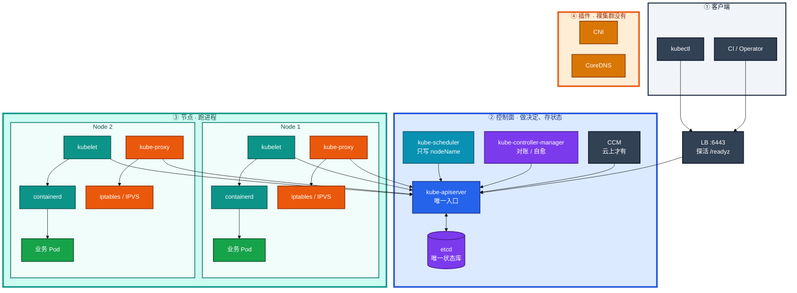

图上只有三条必须记住的线：

1. **所有人只跟 API Server 说话。** 只有它读写 etcd。kubelet、Scheduler、你的 CI，都不许直连 etcd。
2. **调度成功 ≠ 容器起来。** Scheduler 只在对象上写下 `nodeName`。真正起进程的是节点上的 kubelet + containerd。
3. **控制面 + kubelet 仍然是裸集群。** 跨节点网络靠 CNI，集群内 DNS 靠 CoreDNS。云盘、云负载均衡还要 CCM。

数据在这张图上怎么流：

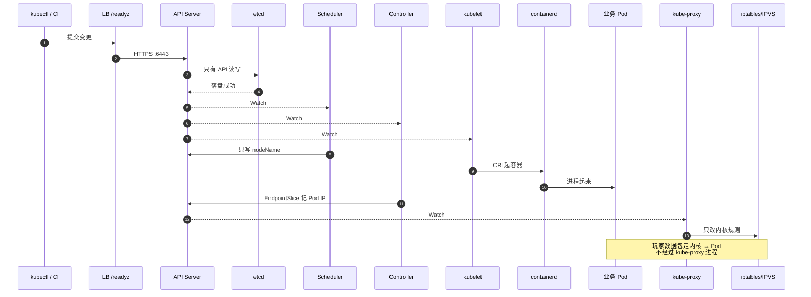

API 大门里面还有三块，本章只钉位置，细节在 03：

| 块 | 在图上干什么 | 挂了你看到什么 |
|----|--------------|----------------|
| **认证 / 鉴权 / 准入 Webhook** | 写 etcd 之前的三道门 | 401 / 403 / apply 报 webhook timeout |
| **Watch Cache** | API 内存挡大部分 List/Watch/Get | 写仍过 etcd；cache miss 才打盘 |
| **APF** | 按 FlowSchema 排队 | 429；leader-election 不该和狂 List 挤一条道 |

生产里慢，十次里九次是 **etcd 磁盘** 或 **Webhook 超时**，不是 API CPU 不够。LB 必须探 `/readyz`，只探 TCP 6443 会把「进程在、etcd 不通」的实例留在池里。

---

## 3. 原理

原理只保留动手和面试会用到的：为什么是声明式、控制器在转什么圈、谁跟谁说话、每个盒子坏了图还转不转。

**本节 6 块：** 3.1 声明式 · 3.2 控制循环 · 3.3 只跟 API · 3.4 控制面 · 3.5 节点 · 3.6 插件

### 3.1 你提交的是「要什么」

```yaml
spec:
  replicas: 2   # 期望：始终 2 个可互换的大厅
```

你没有说「现在去那台机器上 docker run」。你留下一份期望。系统自己去对账。

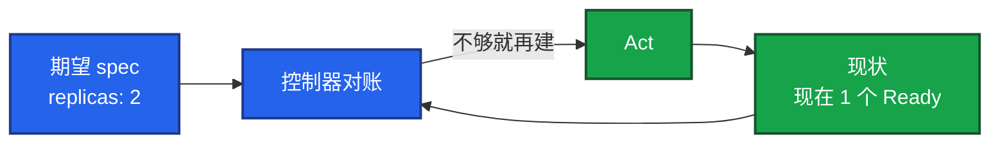

所以失败了再 apply 一次就行；Pod 没了会再被补上；Git 里那份 YAML 才是真相。应急可以 `kubectl scale`，**当天补回 Git**。否则 HPA 扩到 20，流水线再 apply `replicas: 3`，现场会被打回去。HPA 管副本时，流水线不要再写死 `replicas`。

工作负载怎么选（只钉选型，滚动细节在 05）：可互换大厅 → Deployment；固定名字 / 独立盘 / 区服身份 → StatefulSet；每节点日志 / CNI → DaemonSet；合服备份 → Job。**房间绑在内存里的战斗服，不要当 Deployment 默认滚**——滚动等于杀对局。

### 3.2 每个控制器都在转同一圈

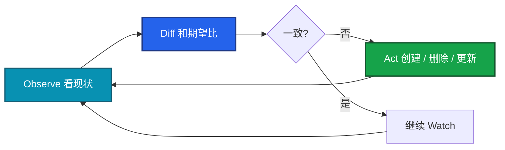

Deployment 在转、EndpointSlice 在转、Node 控制器也在转。不是一次性脚本。这就是自愈，也是 GitOps 能接上的原因。多副本 controller-manager 必须开 **leader-elect**，否则会双写。

滚动和 PDB 都依赖 **Ready**，不是 Running。没有 readiness，Deployment 以为新 Pod 已服役，PDB 也按 Running 计数——账面满足、流量已 502（04、05）。

### 3.3 组件之间不互相打电话

Scheduler **不会** 给 kubelet 发 RPC。大家都 Watch API、改 API。好处是：单组件能独立升级；脏数据进 etcd 之前，必须过认证、鉴权、准入。

> **记住**：谁直连 etcd，谁就绕过了这三道门。写坏的对象会被控制器当成期望去执行。

### 3.4 控制面：谁在做决定

控制面不跑你的游戏进程。它负责：**把期望存住，并推动现状追上去**。

**kube-apiserver：唯一大门。** 自己不调度、不起容器。请求进 `:6443`：认证 → 鉴权 → 准入 Webhook → 写 etcd。生产上前面挂负载均衡。探活用 **`/readyz`**，不要只探 TCP 6443——进程在监听，不代表它愿意接流量。Webhook 配成 `failurePolicy=Fail` 且 Webhook 挂了，**写路径会一起死**（细节在 03）。`failurePolicy=Ignore` 是紧急窗口，不是长期方案。

**etcd：集群的记忆。** 强一致的 KV。对象路径形如 `/registry/pods/default/hall-xxx`。写必须过 Leader 的 WAL **fsync** 和 **多数派 ACK**。盘一慢，整张图上所有 `kubectl` 都慢——看起来像 API 挂了，根因经常在盘。生产 **3 或 5** 台、同城多 AZ。Raft、备份、restore 整章在 02。

**kube-scheduler：只写一个字段。** 过滤（predicate）失败 → 一直 Pending；打分（priority）只在剩余节点里选一个，不会 Pending。然后只写 `spec.nodeName`，容器还不存在。镜像拉不下来、CNI 失败、磁盘挂不上，都不是调度器的锅。那些发生在 kubelet 接手之后（06、16）。污点 / 容忍、硬反亲和把副本卡死，也是调度章的事。

**kube-controller-manager：一屋子控制器。** 一个进程，很多条控制循环：Deployment/RS 副本与滚动、EndpointSlice、Node 失联、Namespace/GC。多副本必须开 **leader-elect**，否则会双写。

> **记住**：EndpointSlice **不是** Deployment 控制器写的。是 EndpointSlice 控制器按 `selector` + **Ready** 去填后端名单。

**cloud-controller-manager：云上才有。** 对接云主机是否还在、云负载均衡、云盘。自建裸金属通常没有这个进程。ACK / EKS 上你 ssh 不进去，但 `LoadBalancer` Service、云盘 PVC 都走它。

### 3.5 节点：谁在跑进程

控制面机器若用静态 Pod 跑 API / etcd，本机也会有 kubelet。业务则跑在 Worker 上。

**kubelet：本机唯一的代理。**

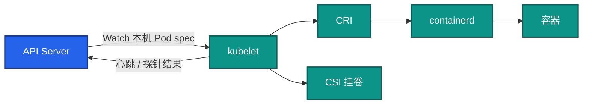

kubelet 不管别的节点，也不给全集群做调度。它挂了：**进程往往还在**。节点会变成 NotReady。先救 kubelet，不要立刻杀业务容器。驱逐是分钟级的事（16）。

真正创建容器的是 **containerd**（或 CRI-O）。kubelet 只通过 CRI 说话，不绑定 Docker。排障会用到 `crictl ps`。

探针（startup / liveness / readiness）和生命周期钩子（postStart / preStop）都是 kubelet 在本机执行的，**不是控制器远程杀进程**。失败动作完全不同：liveness 重启容器，readiness 只摘 Endpoints，preStop 和 SIGTERM 并行（04）。`restartPolicy` 决定崩了是否再拉；Deploy/STS 默认 Always，Job 常用 OnFailure/Never。

**kube-proxy：改规则的人，不是过包的人。** 这是整章最容易答错的点。上面一条路改规则，下面一条路过包，**别画成一条**。

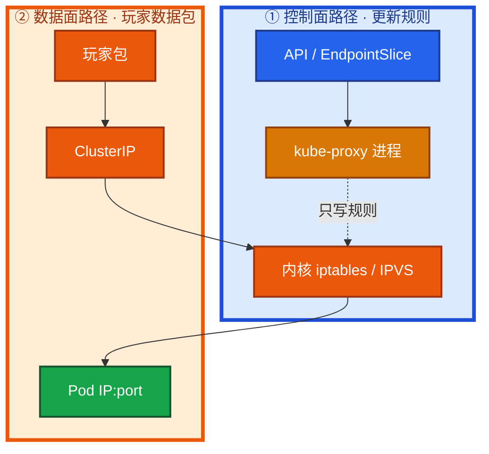

数据包 **不经过** kube-proxy 用户态。它 Watch Service / EndpointSlice，把 ClusterIP 翻译成本机规则。

所以：kube-proxy 挂了，**已经打上的长连接往往还在**；新连接、滚动后的新后端，会打空。部分 CNI（Cilium kube-proxy-replacement）可以不跑它（23），但总得有人实现 Service。

### 3.6 插件：没有它们，集群是裸的

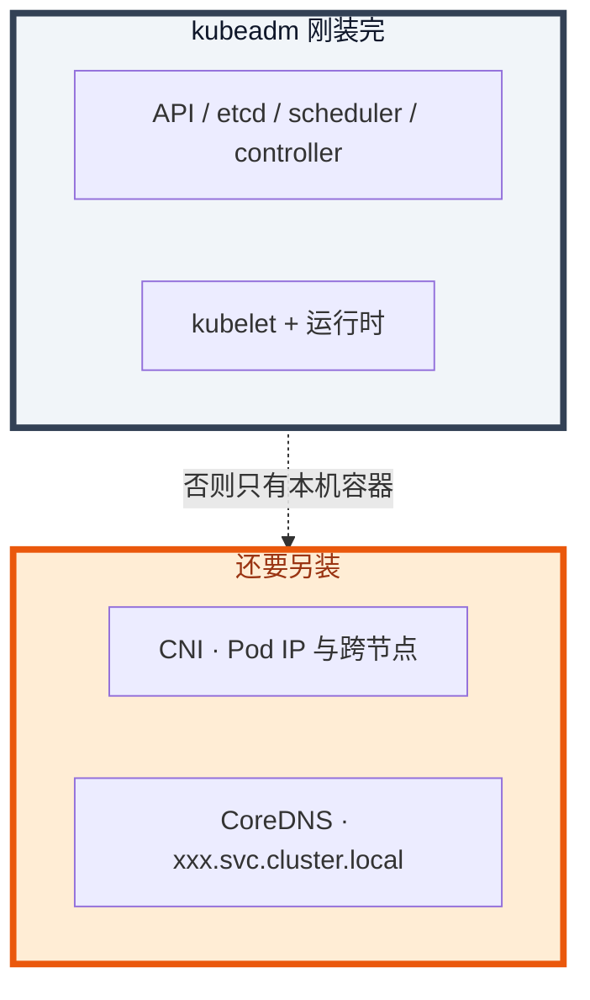

控制面能调度，kubelet 能起进程，但跨节点通信和集群 DNS 不是「装完就有」。监控、日志同样是插件（18、19）。NetworkPolicy、独立节点池也不是默认墙——游戏战斗服和支付同集群时，要自己叠。

Namespace **不是墙**。默认跨 Namespace 网络能通。它是逻辑分组，是 RBAC、Quota 的作用域。要隔离必须自己叠：NetworkPolicy、最小权限、配额；合规硬墙就拆集群或独立节点池。

Label 给选择器，Annotation 不参与。Service、Deployment 只认 Label。`app=logic` 打在 annotation 上，Endpoints 就是空的——进程明明 Running，流量就是不来。

`kubectl delete` 不会立刻从 etcd 抹掉对象。先打上 `deletionTimestamp`，等 finalizer 摘完。卡着，是 CSI / Operator 还没清理完云盘或负载均衡。先查对应控制器，**不要第一时间手抠**。Namespace 删不掉，先列这个 NS 里还带着 finalizer 的对象。

---

## 4. 安装部署

### 4.1 三种拓扑：Stacked / External / 托管

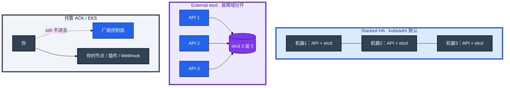

| 形态 | 你要盯什么 | 一台挂掉什么 |
|------|------------|--------------|
| 单控制面 | 仅开发 | API + etcd 一起没，不能变更 |
| **Stacked HA** | kubeadm 默认；`--control-plane-endpoint` 必须是 VIP/LB | 一台挂 = **一个 API + 一个 etcd 成员**一起掉。3 台仍够 quorum |
| **External etcd** | 盘、证书、2379 只放行 API | API 挂不影响 etcd 多数派；etcd 盘仍是写路径瓶颈 |
| 托管 | 影响面、Webhook、节点、CNI、备份 RPO | 厂商修二进制；**停变更的仍是你的业务** |

生产底线：控制面 ≥ 3，etcd **3 或 5**（不要偶数），跨 AZ；etcd 独立 SSD，不和游戏日志混盘；API 入口用 LB，探活 `/readyz`，客户端不要写死单机 IP。

Stacked 改 External 是项目，活动中不要做。托管了仍要懂控制面：API 不可用时的影响面、自己装的 Webhook 把写路径卡死、节点 / CNI / 工作负载故障，都是你的。

### 4.2 kubeadm 落地你实际看到什么

kubeadm 把控制面做成 **静态 Pod**：kubelet 盯着一个目录，里面有 YAML 就保证对应 Pod 在。

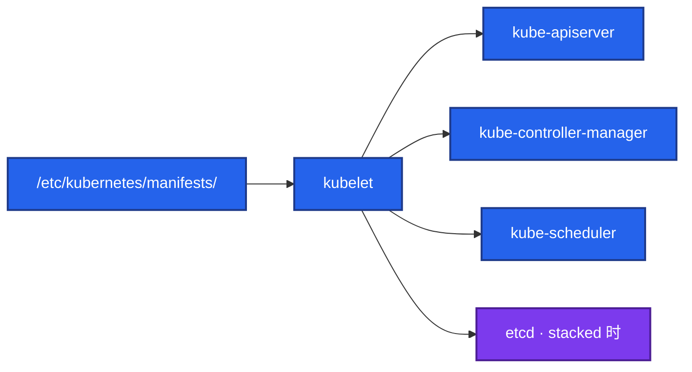

| 路径 | 内容 |
|------|------|
| `/etc/kubernetes/manifests/` | API / scheduler / controller-manager；（Stacked 时）etcd |
| `/etc/kubernetes/pki/` | 控制面证书；etcd 子目录在 02 |
| `/etc/kubernetes/admin.conf` | 本机 kubectl；不要当全集群共享管理员 kubeconfig |

Worker 上：systemd 的 kubelet，外加通常是 DaemonSet 的 kube-proxy。CNI、CoreDNS 另装。

改 manifests 目录里的 YAML，等于改控制面。先确认 kubelet 还活着。验收：进程在不算数。必须 `kubectl get --raw /readyz` 通过，且 `kubectl get nodes` 能列出。不要只探 TCP 6443。

---

## 5. 核心配置

只动有证据的项。改 manifests 后等 kubelet 重建该静态 Pod。证书续 pem 后必须重启静态 Pod。

| 参数 / 约定 | 生产怎么用 | 改错会怎样 |
|-------------|------------|------------|
| `--control-plane-endpoint` | VIP 或 LB，kubeadm join 和 kubeconfig 都写它 | 写死单机 IP → 那台挂了 kubectl 全死 |
| LB 探针 | HTTPS `/readyz` | 只探 TCP 6443 → 坏实例留在池里 |
| `--etcd-servers` | Stacked 连本机 `127.0.0.1:2379` 是同命运，不是配错；External 每个 API 写满 3 个地址 | 漏地址 = 单点 |
| `--leader-elect` | controller-manager / scheduler **必须开** | 多副本否则双写 |
| kubelet 版本 | 最多比 API **低一个次版本** | 控制面刚升完同一秒全员重启 kubelet = 雪崩 |
| `--anonymous-auth` | `false` | 匿名扩大攻击面，排障绕弯 |
| Webhook | 超时 <3s，多副本 + PDB；`failurePolicy` 想清楚 | 单副本 Fail 管所有 CREATE = 写路径焊死 |

> **记住**：Stacked 的 API 连本机 etcd 是设计，不是配错。External 才需要每个 API 写满 etcd 列表。证书过期当天是控制面 P0；续完必须重启静态 Pod。

---

## 6. 常用命令

值班先跑这几条：

```bash
kubectl cluster-info
kubectl get --raw /readyz?verbose
kubectl get nodes -o wide
kubectl -n kube-system get pods
kubectl get deploy,po,svc,endpointslice -n <ns>
kubectl describe po <pod>
kubectl get events -n <ns> --sort-by='.lastTimestamp'
```

`/readyz?verbose` 会列出每一项检查。etcd 不通、Webhook 超时，经常先在这里露馅。

| 目的 | 命令 | 看什么 |
|------|------|--------|
| 控制面愿不愿接流量 | `kubectl get --raw /readyz?verbose` | 每一项 ok；etcd / webhook 常先挂 |
| 节点 | `kubectl get nodes -o wide` | Ready / SchedulingDisabled / 角色 |
| 控制面静态 Pod | `kubectl -n kube-system get pods` | apiserver / etcd / scheduler / controller |
| 卡住的对象 | `kubectl describe po <pod>` | Events：Pending / 探针 / 退出码 |
| 流量名单 | `kubectl get endpointslice -n <ns>` | Ready 的 Pod IP，不是 Deployment 控制器写的 |
| 权限 | `kubectl auth can-i delete pods --as=...` | 403 时确认是 RBAC 不是「API 坏了」 |

控制面慢：十次里九次是 **etcd 磁盘** 或 **Webhook 超时**，不是 API CPU 不够。429 先查 APF 肇事客户端（03），不要先给 API 加核。

---

## 7. 常用操作

### 7.1 一次发版到有流量

大厅：`Deployment` `replicas: 2`，再配一个 `Service` `selector: app=hall`。玩家打 ClusterIP，不是某个 Pod IP。

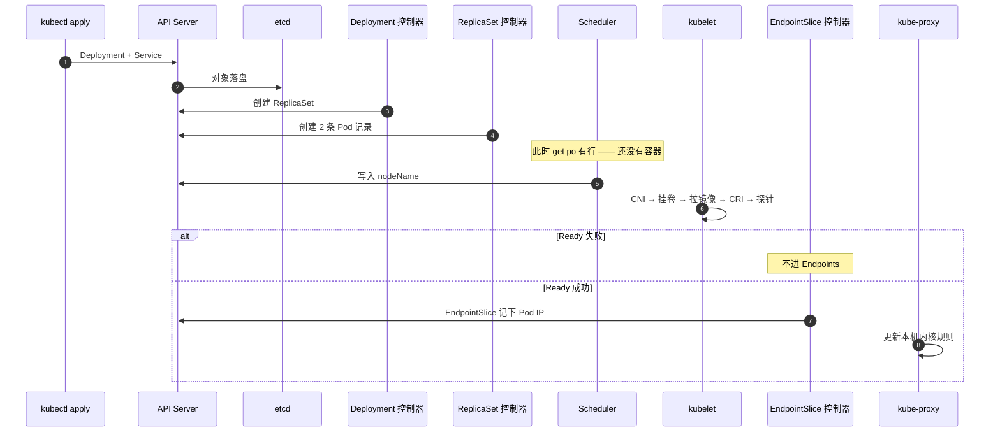

卡在哪一层，对照这张表。**先定位层，再动手。**

| 你看到的 | 卡在图上的哪一格 | 先看 |
|----------|------------------|------|
| Deployment 有了，`get po` 空 | 控制器还没建出 Pod | Events、controller-manager |
| Pending，NODE 列是空的 | Scheduler 还没写 nodeName | 资源、污点、亲和、PVC |
| ContainerCreating | 调度完了，本机没起成功 | 镜像、CSI、CNI、containerd |
| Running，Endpoints 为空 | 进程在，Service 不认 | readiness；Label 是否打成了 annotation |
| Endpoints 有 IP，ClusterIP 仍不通 | 名单有了，转发坏了 | kube-proxy、CNI、targetPort |

一句话串起来：

**Pending = 调度；ContainerCreating = 本机起进程；Running 但没流量 = 探针或标签；有 Endpoints 仍不通 = 转发。**

Running 只说明进程在。Ready 才说明可以进 Service。

### 7.2 升级

先 etcd 快照（02）→ 滚动升控制面（一次一台 API，LB 里始终留健康实例）→ 再滚 kubelet。kubelet 最多比 API **低一个次版本**。不要控制面刚升完，同一秒全员重启 kubelet。

kubeadm：`kubeadm upgrade apply` 会带 etcd，不要在它之外抢改静态 Pod 镜像。Stacked 下一台挂掉等于少一个 etcd 成员，始终保 quorum。

### 7.3 紧急扩容

活动要紧急把大厅从 8 扩到 20。现场可以 `kubectl scale`，但必须当天把 `replicas: 20` 补回 Git。否则下一次流水线或 Argo CD 同步会拿仓库里的 `replicas: 8` 把你打回去。

HPA 和 YAML 抢的是同一个字段。HPA 管副本时，流水线不要再写死 `replicas`。战斗服不要靠 HPA 缩容——会杀正在打仗的进程（05、07）。

---

## 8. 生产排障

不要答「集群挂了」。固定问三句：

1. 已经在跑的进程还在不在？
2. 还能不能变更（发版 / 扩容 / 自愈）？
3. 已有流量还通不通？

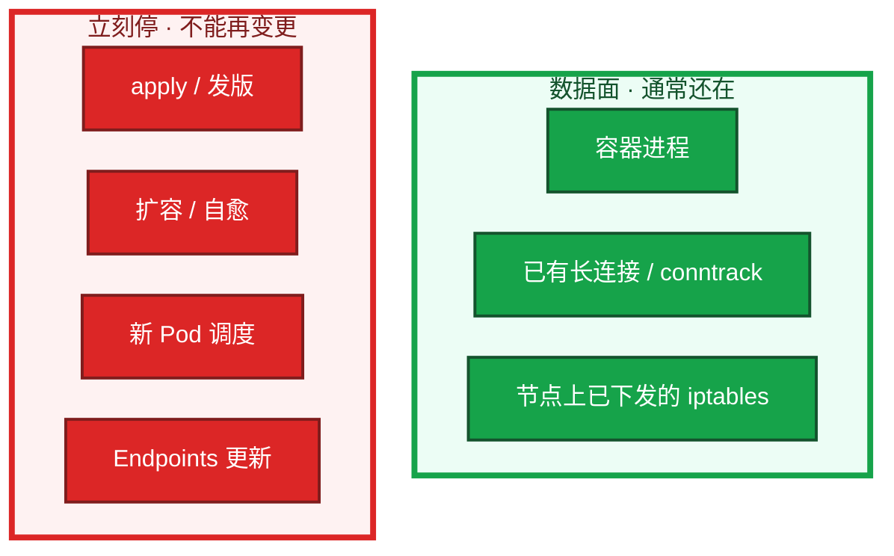

**控制面挂 = 不能决策。数据面进程不立刻死。** 内核规则不会瞬间蒸发，变的是再也更新不了。

| 挂谁 | 已运行 Pod | 发版 / 扩容 / 自愈 | 已有 Service 流量 |
|------|:----------:|:------------------:|:-----------------:|
| etcd / API Server | 在 | **停** | 规则在内核，一般还在 |
| Scheduler | 在 | 新 Pod 一直 Pending | 在 |
| Controller Manager | 在 | 掉了不补、滚不动 | 在 |
| kubelet | **在** | 本节点不探针、不上报 | 先别杀进程 |
| kube-proxy | 在 | 规则不更新 | 存量可能还在；**新连接会出问题** |

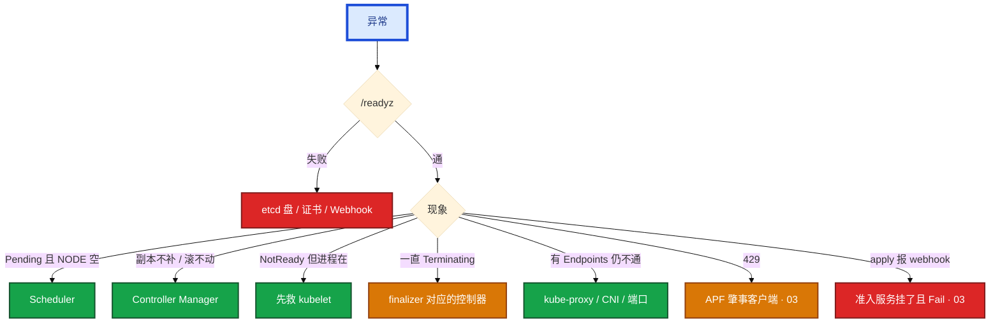

现场顺序：`/readyz` → `get nodes` → `kube-system` 的 Pod → `describe` 卡住的对象。  
不要做的事：为了「做点什么」去重启还活着的逻辑服。

活动高峰 etcd 和日志同盘，fsync 打到几百毫秒。正确处理：确认进程还在 → 停止发版和重启战斗服 → 救盘 / quorum / Webhook → 恢复后先 `get nodes`，再补自愈。

| 现象 | 先做什么 | 不要做什么 |
|------|----------|------------|
| `kubectl` 超时，`/readyz` 失败 | etcd 盘、证书、Webhook | 重启全部游戏服 |
| 新 Pod Pending，NODE 空 | 资源、污点、亲和、PVC | 查镜像、重启业务 |
| 已经 Scheduled，一直 ContainerCreating | CNI、CSI、镜像、containerd | 当 Scheduler 坏了 |
| Running，Service 没有 Endpoints | Ready / Label（是否打成 annotation） | 重装 kube-proxy |
| Endpoints 有 IP，ClusterIP 不通 | kube-proxy、CNI、targetPort | 重启逻辑服 |
| 节点 NotReady，`crictl ps` 里业务还在 | 救 kubelet | 立刻杀容器「重建试试」 |
| drain 卡住 | PDB（05） | 上来删 PDB 赶战斗服 |
| 控制面慢，CPU 不忙 | etcd 盘 / Webhook，再看 APF | 先给 API 加核 |

---

## 9. 必会 · 常考

白板和追问高频，能一口回：

| 说法 | 对错 | 口径 |
|------|:----:|------|
| kubelet 可以直连 etcd 拉 Pod spec | 错 | 只连 API Server |
| API 挂了，游戏服进程立刻没了 | 错 | 进程还在；不能变更 |
| 调度成功就是容器起来了 | 错 | Scheduler 只写 `nodeName`；kubelet + CRI 才起进程 |
| 玩家的包经过 kube-proxy 进程 | 错 | 走内核 iptables/IPVS；kube-proxy 只改规则 |
| Stacked 不是高可用 | 错 | 3 台 Stacked + LB 就是生产最小 HA；一台挂 = API 和一个 etcd 成员一起掉 |
| 4 台 etcd 比 3 台更能抗 2 台故障 | 错 | 4 台容错仍是 1（02） |
| Namespace 默认隔离子网 | 错 | 逻辑分组；要隔离自己叠 NetworkPolicy |
| Label 和 Annotation 都能被 Service 选中 | 错 | 选择器只认 Label |
| EndpointSlice 是 Deployment 控制器写的 | 错 | EndpointSlice 控制器按 selector + Ready |
| Terminating 就该立刻手抠 finalizer | 错 | 先查 CSI / Operator |
| LB 探 TCP 6443 就够了 | 错 | 必须 `/readyz` |
| 托管了不用懂控制面 | 错 | 影响面、Webhook、节点仍是你的 |
| 有状态战斗服可以当 Deployment 默认滚 | 错 | 滚动等于杀对局；STS 也不解决内存状态（05） |
| controller-manager 多副本可以不开 leader-elect | 错 | 否则双写 |

数字：控制面 ≥ 3；etcd **3 或 5**；kubelet 最多比 API 低 **一个次版本**；Webhook 超时 **<3s**；证书告警思路对齐 02 的 **14 天**。

易混：Stacked vs External（故障域，不是「谁才叫 HA」）；进程还在 vs 还能变更 vs 流量还通；Pending vs ContainerCreating vs Running 无 EP；kube-proxy 控制面路径 vs 数据面路径；Label vs Annotation；Webhook 超时 vs etcd 盘慢 vs APF 429。

---

## 合上书，问自己

1. 能画出第 2 节那张图，并指出谁唯一碰 etcd 吗？
2. Scheduler 和 kubelet，谁负责「容器跑起来」？过滤失败和打分失败哪个会 Pending？
3. 玩家的包会经过 kube-proxy 进程吗？
4. apply 之后，从 etcd 到 ClusterIP 通，中间经过哪些控制器？EndpointSlice 是谁写的？
5. API 挂了，已经在打的长连接还在吗？该不该重启逻辑服？
6. Stacked 和 External 故障域差在哪？Namespace 默认隔离子网吗？Label 和 Annotation 谁进 Service？

六题都能口述，这一章就过了。细节分别进 02（etcd）、03（API）、04（探针）、05（控制器）、06（调度）、08（Service）。下一章把 etcd 剖开：盘一慢，为什么整张图上的 `kubectl` 一起卡死。
