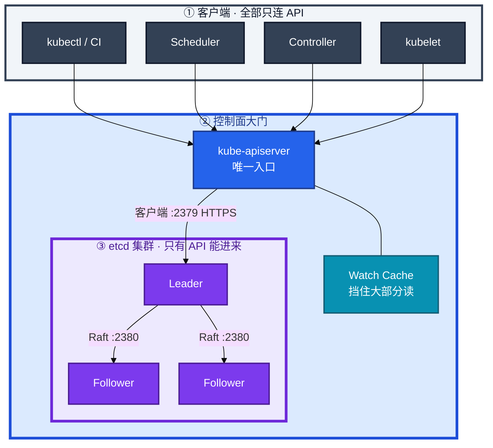
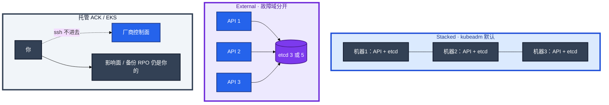
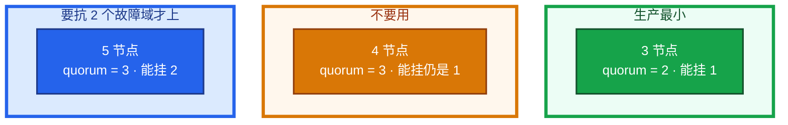
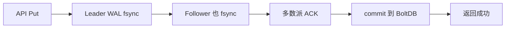
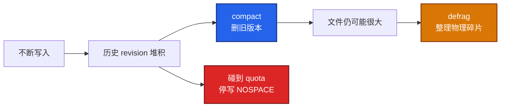
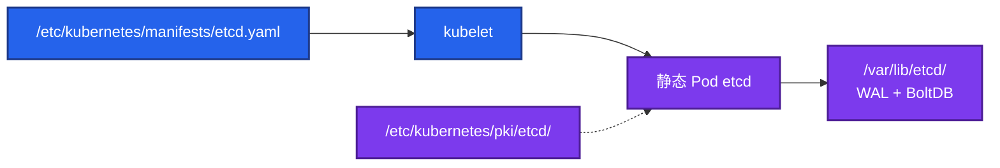
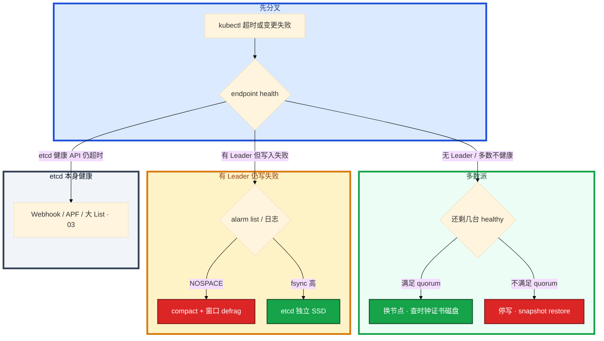

# etcd


活动高峰，`kubectl` 全部超时。API CPU 并不忙。群里有人要重启逻辑服，另有人要把上周 snapshot 往还活着的两台上 restore。

先别动手。这一章后半全是你会动手的：**怎么装、怎么查、怎么换节点、怎么 restore、盘慢和 quota 满分别怎么止血。** 前面的概念和原理，是为了让你动手时不选错路。

**读完你能：** 白板上画出谁连 2379；etcd 坏了能判断换节点还是 restore；会备份、滚动升级、失败回滚、换机器/换盘。

## 本章目录

缩进 = 上下级。3 下面才是 3.1。

想钉在**正文左边**跟着滚：菜单 **查看 → 打开视图 → 大纲**。Markdown 预览做不到独立左栏，目录只能写在文章开头。

- [1. 基本概念](#1-基本概念)
- [2. 架构图](#2-架构图)
- [3. 原理](#3-原理)
  - [3.1 Raft](#31-raft选主复制提交)
  - [3.2 多数派](#32-多数派3--4--5-怎么选)
  - [3.3 一次写入](#33-一次写入最贵的是-fsync)
  - [3.4 compact / defrag / quota](#34-compact--defrag--quota)
- [4. 安装部署](#4-安装部署)
  - [4.1 生产怎么选](#41-生产怎么选)
  - [4.2 kubeadm 落地](#42-kubeadm-落地你实际看到什么)
- [5. 核心配置](#5-核心配置)
- [6. 常用命令](#6-常用命令)
- [7. 常用操作](#7-常用操作)
  - [7.1 备份](#71-备份)
  - [7.2 换节点](#72-多数派还在换坏节点)
  - [7.3 restore](#73-多数派没了snapshot-restore)
  - [7.4 NOSPACE](#74-nospacecompact--窗口-defrag)
  - [7.5 证书](#75-证书轮转)
  - [7.6 升级](#76-升级)
  - [7.7 回滚](#77-回滚)
  - [7.8 迁移](#78-迁移)
- [8. 生产排障](#8-生产排障)
- [9. 必会 · 常考](#9-必会--常考)
- [合上书](#合上书问自己)

**本章不讲：** 认证准入、Watch Cache、APF → [03 API Server](../03-API-Server/)；控制面挂了的总影响面 → [01 集群架构](../01-集群架构/)。

---

## 1. 基本概念

etcd 是一个 **分布式、强一致的 KV**。用 Raft 做共识，用 MVCC（revision）做多版本，并提供 Watch。

在 Kubernetes 里，它不是 Redis，也不是消息队列。它是控制面的 **唯一状态库**。

| 在 etcd 里 | 不在 etcd 里 |
|------------|--------------|
| Pod / Deployment / Service / Node / Secret / CR | 容器进程、容器可写层 |
| spec、status、Event、Completed Job | 节点上的 iptables、已打上的长连接 |
| 路径形如 `/registry/<resource>/<namespace>/<name>` | 业务库、镜像、日志文件 |

三个角色不要混：

| 角色 | 干什么 |
|------|--------|
| **etcd** | 把写成功的那份对象存住，多副本之间一致 |
| **API Server** | 唯一入口：认证、鉴权、准入之后才读写 etcd；读路径上有 Watch Cache |
| **其它组件** | Scheduler、Controller、kubelet、kubectl、CI，**全部只连 API** |

etcd 提供的能力和 Kubernetes 实际用到的：

| etcd 能力 | Kubernetes 怎么用 |
|-----------|-------------------|
| 强一致 Put/Get | 每个对象的持久化 |
| revision / compact | List-Watch 的资源版本；过旧会 `too old revision` |
| Watch | Informer、控制器、kubelet 的增量通知（**经 API，不直连**） |
| 租约 Lease | 部分内部对象；业务不要把 etcd 当锁服务打满 |

> **记住**：业务、kubelet、Controller **禁止直连 etcd**。直连绕过 RBAC、准入、审计；写坏的对象会被控制器当成期望去执行。`etcdctl` 只做 health / member / snapshot，不要手改 `/registry`。Secret 进 etcd **默认是明文 JSON**，静止加密是 API Server 的 `EncryptionConfiguration`（12）。

---

## 2. 架构图

先把整张图钉住。后面安装、命令、排障都对着这张图说话。



图上三条线：

1. **没有箭头从 kubelet / Controller / 业务指向 etcd。**
2. **2379** 是客户端口，生产上只允许 API Server；**2380** 是成员之间的 Raft。
3. 任意时刻 **最多一个 Leader**。写打 Leader；Follower 收到写会转给 Leader。

三种生产形态（装的时候选，挂的时候故障域不一样）：



Stacked：一台控制面挂 = API 和一个 etcd 成员一起掉。External：盘和证书要有人盯。托管：你看不见进程，停变更的仍是你的业务。

---

## 3. 原理

原理只保留动手和面试会用到的：谁能写、几台能挂几台、为什么盘一慢全集群卡、库为什么会满。

**本节 4 块：** 3.1 Raft · 3.2 多数派 · 3.3 写入 · 3.4 compact

### 3.1 Raft：选主、复制、提交


1. **选主**：Follower 在 `election-timeout` 内收不到心跳，变成 Candidate 拉票。同一 term 里拿到多数派投票的成为新 Leader。
2. **日志复制**：Leader 把提议追加到自己的 WAL，并行复制给 Follower。
3. **提交**：一条日志获得 **多数派持久化确认** 才 commit，再应用到 BoltDB。

`election-timeout` 必须大于心跳，且 **大于成员 RTT**。默认心跳 100ms、选举超时 1s。控制面 etcd **不要跨地域**；时钟偏移会抖，依赖 NTP（02-19）。

### 3.2 多数派：3 / 4 / 5 怎么选

quorum = `floor(N/2)+1`。写成功、选主，都要过这个数。



| N | Quorum | 能同时挂 | 结论 |
|:--------:|:------:|:--------:|------|
| 1 | 1 | 0 | 仅开发 |
| **3** | 2 | **1** | **生产最小** |
| 4 | 3 | 1 | 浪费 |
| **5** | 3 | **2** | 要同时抗 2 个节点或 2 个 AZ 时才上 |

偶数没有收益。把 3 扩到 5 **写不会更快**——写仍过 Leader。5 只为多抗一台。

**3 丢 1**：还能写，换节点，不要 restore。  
**3 丢 2**：不能写，停 API，snapshot restore。不要对残存那一台乱 `member add`。

### 3.3 一次写入：最贵的是 fsync

每一次 apply、扩容、打 Event、Job 完成，都走这条路：



`fsync` 是最贵的一步。官方把 WAL fsync P99 **超过 25ms** 视为磁盘不合格。机械盘、和游戏日志同盘、云盘突发打满 → `kubectl` 全面超时。看起来像 API 挂了，根因在 etcd 盘。

读：Watch Cache 挡住大部分 List/Watch/Get。etcd 主要扛写和 cache miss。revision 被 compact 后，旧 resourceVersion 会 `too old revision`，客户端重新 List——正常，不是损坏（03）。

### 3.4 compact / defrag / quota

每次写 `revision` 加一，旧版本暂时留着给 Watch 追。



| 操作 | 做什么 | 副作用 |
|------|--------|--------|
| **compact** | 删 compact revision 之前的历史 | 旧 Watch 会 `too old revision` |
| **defrag** | 整理 BoltDB，**物理文件变小** | **阻塞该成员**，高峰等于主动摘一台 |
| **quota** | 库体积上限，默认 **2GB** | 打满：`mvcc: database space exceeded` |

只 compact 不 defrag，`du` 下不来。kubeadm 常见 `--auto-compaction-retention=5m`。灌满库的常见元凶：Event 风暴、Completed Job 无 TTL、超大 CR。大集群 quota 提到 **8GB**；超 8GB 先治理对象。单次写入上限 `--max-request-bytes` **1.5MiB**。

> **记住**：etcd 不是水平扩展的写存储。容量优先 **少写、快盘、按时 compact**，不是加节点。

---

## 4. 安装部署

### 4.1 生产怎么选

| 项 | 选 | 不选 |
|----|----|------|
| 节点数 | 3 或 5 | 2、4、跨地域一套 |
| 磁盘 | 本地 NVMe/SSD，独立盘 | 机械盘、和游戏日志/容器盘混用 |
| 网络 | 同城多 AZ，RTT 远小于 election-timeout | 跨 region |
| 形态 | kubeadm 静态 Pod，或托管 | 业务 Worker 上顺手跑 etcd |
| 证书 | 独立 CA，peer 与 client 分开，强制双向认证 | 2379 对整个 VPC 裸奔 |

托管（ACK / EKS）：ssh 不进机器，上线前问清备份 RPO、谁 restore、升级是否滚动 etcd、磁盘是否独立。

### 4.2 kubeadm 落地你实际看到什么

etcd 是 **静态 Pod**，kubelet 盯 manifests 目录。



| 路径 | 内容 |
|------|------|
| `/etc/kubernetes/manifests/etcd.yaml` | kubelet 保证这个 Pod 在 |
| `/etc/kubernetes/pki/etcd/` | CA、server、peer、healthcheck |
| `/var/lib/etcd/` | **这就是数据** |
| `127.0.0.1:2379` | 本机 API 常用 localhost 连本机 etcd |

| 端口 | 谁连 |
|------|------|
| **2379** | 仅 API Server，HTTPS + 客户端证书 |
| **2380** | 仅 etcd 成员互访 |

清单里必须有的监听与认证（示意）：

```yaml
- --advertise-client-urls=https://10.0.1.11:2379
- --listen-client-urls=https://127.0.0.1:2379,https://10.0.1.11:2379
- --listen-peer-urls=https://10.0.1.11:2380
- --initial-cluster=ctrl1=https://10.0.1.11:2380,ctrl2=https://10.0.1.12:2380,ctrl3=https://10.0.1.13:2380
- --data-dir=/var/lib/etcd
- --client-cert-auth=true
- --peer-client-cert-auth=true
```

验收：进程在不算数。必须 `etcdctl endpoint health --cluster` 全 healthy，且 `kubectl get --raw /readyz` 通过。不要只探 TCP 2379。

Kubernetes RBAC **管不到** etcd。证书合法就能读写 `/registry`。2379 只放行 API 网段，2380 只放行成员。

证书：peer 过期 = 成员拆伙；client 过期 = API 连不上 etcd。`kubeadm certs check-expiration`，剩余 **< 14 天** 当 P1。续 pem 后必须重启静态 Pod。

独立 systemd 部署：要求和上面相同，3/5、2379/2380、HTTPS 双向认证、独立数据盘。

---

## 5. 核心配置

只动有证据的项。改 `etcd.yaml` 后等 kubelet 重建该静态 Pod。`election-timeout` 三台必须一致。

| 参数 | 默认 | 生产怎么用 | 改错会怎样 |
|------|------|------------|------------|
| `--heartbeat-interval` | 100ms | 同城保持默认 | 过大故障检测慢；过小心跳打满网 |
| `--election-timeout` | 1000ms | 心跳的 5～10 倍，且 **> 成员 RTT** | 过小频繁丢 Leader；跨 region 再大也治不好 |
| `--snapshot-count` | 10000 | 默认即可 | 过小频繁打快照；过大恢复重放变长 |
| `--auto-compaction-retention` | kubeadm 常见 `5m` | **必须开** | 关闭 db 只涨；过短 Informer 集中 List |
| `--quota-backend-bytes` | 2GiB | 大集群显式 **8GiB** | 只加不治理会再满 |
| `--max-request-bytes` | 1.5MiB | 一般不动 | 盲目加大等于允许把库灌肥 |
| `--enable-v2` | 3.4+ 关 | 保持关闭 | 打开无收益 |

> **记住**：`election-timeout` 用来覆盖 **同城 RTT**，不是用来扛跨地域。quota 从 2GB 提到 8GB 是容量措施，根治是少写 Event、给 Job 加 TTL。

---

## 6. 常用命令

证书写成变量，避免每条重复路径。

```bash
export ETCDCTL_API=3
export ETCDCTL_ENDPOINTS=https://127.0.0.1:2379
export ETCDCTL_CACERT=/etc/kubernetes/pki/etcd/ca.crt
export ETCDCTL_CERT=/etc/kubernetes/pki/etcd/server.crt
export ETCDCTL_KEY=/etc/kubernetes/pki/etcd/server.key
```

| 目的 | 命令 | 看什么 |
|------|------|--------|
| 集群健康 | `etcdctl endpoint health --cluster` | 每成员 `healthy`，不要只有本机 true |
| 成员与 Leader | `etcdctl endpoint status --cluster -w table` | `IS LEADER`、`DB SIZE`、`RAFT INDEX` |
| 成员列表 | `etcdctl member list -w table` | ID、peer URL |
| 告警 | `etcdctl alarm list` | `NOSPACE` = quota 满 |
| 打快照 | `etcdctl snapshot save /backup/etcd-$(date +%Y%m%d-%H%M).db` | 成功且文件非空 |
| 检查快照 | `etcdctl snapshot status <file> -w table` | hash、revision，确认可读 |
| 压缩 | `etcdctl compact <revision>` | 通常交给 auto-compaction |
| 整理碎片 | `etcdctl defrag`（单成员） | **窗口逐节点**，不要高峰 `--cluster` |
| 只读探活 | `etcdctl get / --prefix --keys-only --limit=1` | API 已死时确认 etcd 还能应答 |

值班先跑这四条：

```bash
etcdctl endpoint health --cluster
etcdctl endpoint status --cluster -w table
etcdctl member list -w table
etcdctl alarm list
```

`get /registry/...` 只在 API 不可用、且只读确认时用。`etcdctl put` 改 `/registry` 等于事故。

指标（Prometheus，kubeadm 一般随控制面抓）：

| 指标 | 阈值 | 级别 |
|------|------|------|
| `etcd_server_has_leader` | `== 0` | **P0** |
| WAL fsync P99 | **> 25ms** | P0/P1 |
| DB SIZE / quota | **> 0.8** | P1；到 1.0 = NOSPACE |
| 证书剩余天数 | **< 14 天** | P1 |

日志：`took too long` / `wal: sync duration` = 盘；`database space exceeded` = quota；`lost leader` = 选举或网络。

---

## 7. 常用操作

### 7.1 备份

至少每 **6 小时**；发版、扩容控制面、合服前加打一份。异地 **7～30 天**。本机 cron 不算备份。

```bash
etcdctl snapshot save /backup/etcd-$(date +%Y%m%d-%H%M).db
etcdctl snapshot status /backup/etcd-xxx.db -w table
```

**季度做一次 restore 演练**，记下 RTO。没有演练 = 没有备份。

### 7.2 多数派还在：换坏节点

3 丢 1、5 丢 1 或 2（仍满足 quorum）。**不要 restore。**


1. `endpoint health --cluster` 确认还有 Leader。
2. `member list` 记下坏节点 ID，`member remove <id>`。
3. 新机器配好数据盘、证书、peer URL。
4. `member add <name> --peer-urls=https://<new-ip>:2380`。
5. 用返回的 `initial-cluster` 启动，`--initial-cluster-state=existing`。
6. health 三（或五）台都 true。

restore 会生成 **新成员身份**。多数派还在时 restore，容易组不成群。

### 7.3 多数派没了：snapshot restore

3 丢 2、5 丢 3，或数据目录整体损坏。停写窗口，广播「控制面不能变更」。


```bash
etcdctl snapshot restore /backup/etcd-xxx.db \
  --name=ctrl1 \
  --initial-cluster=ctrl1=https://10.0.1.11:2380,ctrl2=https://10.0.1.12:2380,ctrl3=https://10.0.1.13:2380 \
  --initial-cluster-token=etcd-restore-$(date +%Y%m%d) \
  --initial-advertise-peer-urls=https://10.0.1.11:2380 \
  --data-dir=/var/lib/etcd
```

卡住：health 通 API 仍超时 → `--etcd-servers` 和客户端证书。组不成群 → 先对 token / peer URL，不要反复 `member add`。

### 7.4 NOSPACE：compact + 窗口 defrag

先把体积压下去再 `alarm disarm`，不要只加 quota。维护窗口 **逐台** `defrag`，追上 Leader 再做下一台。回头查 Event、Completed Job、大 CR。

### 7.5 证书轮转

`kubeadm certs renew` 后重启 control plane 静态 Pod。只改 pem 不重启，进程还拿着旧证。

### 7.6 升级

先对 Kubernetes 支持的 etcd 版本，不能凭「最新 etcd」硬上。

1. **先 snapshot**，异地留一份。
2. **滚动**：先升 Follower；Leader 放到最后（或先 `move-leader`）。始终保 quorum。
3. 不要三台同时换镜像；不要跳大版本（3.4 → 3.5 按官方路径）。
4. 数据目录升级后默认 **不能靠换回二进制降级**，回退靠快照 restore。

kubeadm：`kubeadm upgrade apply` 会带 etcd，不要在它之外抢改静态 Pod 镜像。

### 7.7 回滚

数据目录升级后，默认 **不能靠换回旧二进制降级**。回退 = 用升级前的快照做 restore。

1. 停全部 API Server 和 etcd。
2. 用升级前那一份快照，按 7.3：同一份文件 + 同一个新 token。
3. 先 etcd health，再拉 API。

没有升级前快照 = 没有回滚。

### 7.8 迁移

- **换机器** = 7.2 换节点（member remove / add）。
- **只换盘：** 先 snapshot → 停该成员 → 拷 `/var/lib/etcd` → 拉起。
- **只改 IP：** `member update`，yaml 里 advertise/listen 一起改。

Stacked 改 External 是项目，活动中不要做。

---

## 8. 生产排障

和 01 同一套三问：进程还在不在？还能不能变更？已有流量还通不通？

**etcd 不可用 = 不能变更，不是立刻踢玩家。** 已运行容器、已有 iptables、已有 conntrack 通常还在。



现场顺序：

```bash
kubectl get --raw /readyz?verbose
etcdctl endpoint health --cluster
etcdctl endpoint status --cluster -w table
etcdctl alarm list
df -h /var/lib/etcd && iostat -x 1
kubectl -n kube-system logs etcd-<node> --tail=200
```

| 现象 | 先做什么 | 不要做什么 |
|------|----------|------------|
| `has_leader==0` | health/status；磁盘、NTP、证书 | 重启全部业务 Pod |
| `NOSPACE` | compact + 窗口 defrag；清 Event/Job | 格式化数据盘 |
| API 慢，仍有 Leader | etcd 盘 fsync；再查 Webhook | 先给 API 加核 |
| 单节点 unhealthy，另外两台 true | member 替换 | restore |
| 只剩一台 healthy | 停写，restore | 对残存节点 `member add` |
| `too old revision` | Informer 重新 List | 当数据丢失去 restore |
| 升级后一台 INDEX 落后 | 该节点盘和网；必要时摘掉重加 | 三台一起回滚二进制 |

活动高峰 etcd 和日志同盘，fsync 打到几百毫秒。正确处理：确认进程还在 → 停止发版和重启战斗服 → 救盘 / quorum / quota → 恢复后先 `get nodes`，再补自愈。

---

## 9. 必会 · 常考

白板和追问高频，能一口回：

| 说法 | 对错 | 口径 |
|------|:----:|------|
| kubelet 可以直连 etcd 拉 Pod spec | 错 | 只连 API Server |
| etcd 挂了，游戏服进程立刻没了 | 错 | 进程还在；不能变更 |
| 4 台比 3 台更能抗 2 台故障 | 错 | 4 台容错仍是 1 |
| 控制面 etcd 可以跨两个 region | 错 | RTT 拖垮选举 |
| 3 丢 1 应该马上 snapshot restore | 错 | 换节点 |
| WAL fsync 慢先给 API 加 CPU | 错 | 先换/独立 etcd 盘 |
| 3 扩到 5，写入会变快 | 错 | 写仍过 Leader |
| compact 之后 `du` 一定下降 | 错 | 物理文件要 defrag |
| `too old revision` 表示损坏 | 错 | compact 后正常，重新 List |
| Secret 进 etcd 默认加密 | 错 | 静止加密在 API Server |
| 托管不用关心备份 | 错 | 停变更的是你的业务 |
| 三台一起换镜像缩短窗口 | 错 | 必须滚动，保 quorum |

数字：quorum 3→2、5→3；fsync P99 **25ms**；quota 默认 **2GB** / 大集群 **8GB**；心跳 100ms、选举 1s；备份 6h + 异地 7～30 天；证书告警 **14 天**；auto-compaction 常见 **5m**；`--max-request-bytes` **1.5MiB**。

易混：无 Leader vs NOSPACE（后者可能仍有 Leader）；compact vs defrag；member 替换 vs restore；Watch Cache 慢 vs etcd 写慢；扩成员 vs 扩容量；etcd TLS vs K8s 静止加密。

---

## 合上书，问自己

1. 谁唯一碰 etcd？对象在哪条路径下？
2. 生产 3 还是 5？Stacked 和 External 故障域差在哪？
3. 一次写入哪一步最贵？25ms 红线是什么？
4. 值班四条 `etcdctl` 是哪四条？`NOSPACE` 看哪条命令？
5. 3 丢 1 和 3 丢 2 分别做什么？备份怎样才算有？
6. etcd 挂了该不该重启逻辑服？证书 peer / client 过期各是什么表现？

六题都能口述，这一章就过了。下一章把 API Server 剖开：认证准入、Watch Cache、Webhook 怎样把这条写路径焊死。
