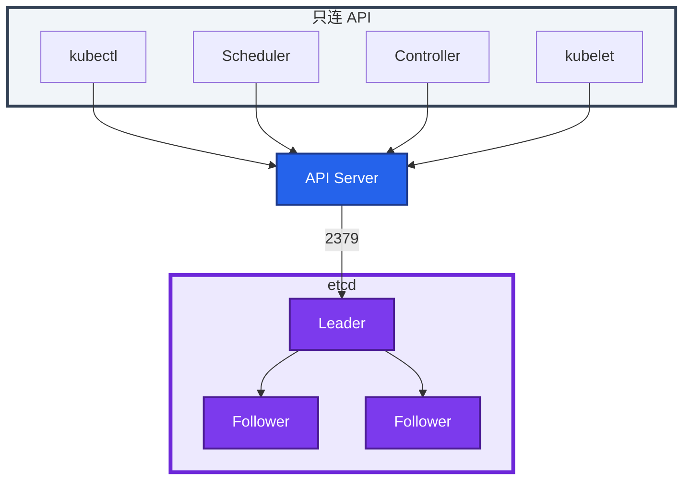
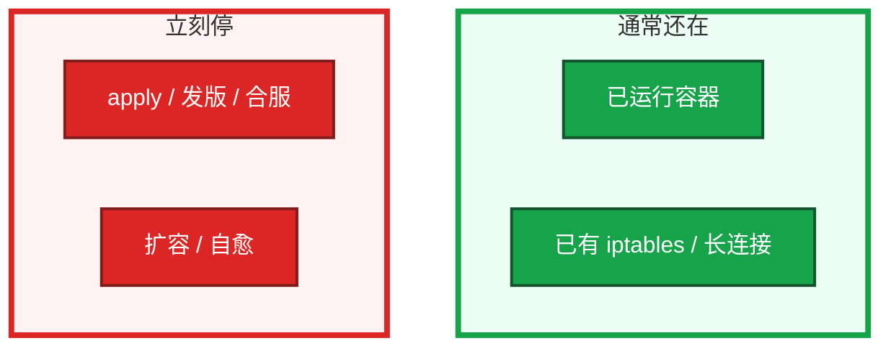
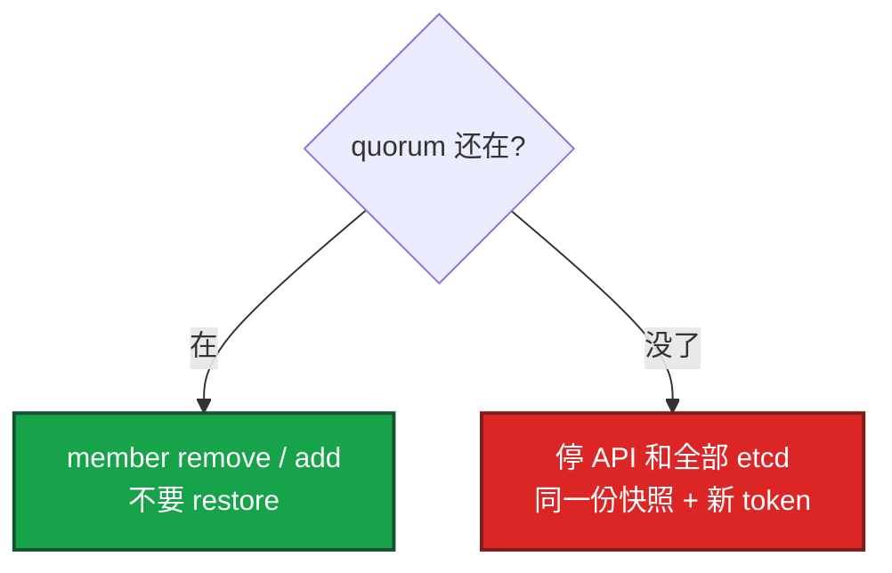
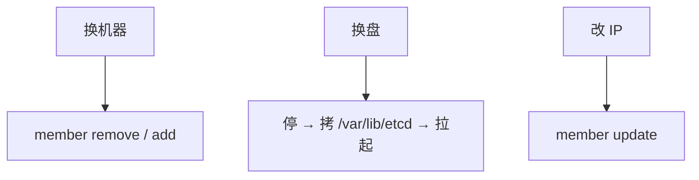

# 02｜etcd · 练习题

先对照 [知识点](知识点.md) **本章主线** 自己口述，再对答案。每题标了覆盖范围：

| 标记 | 含义 |
|------|------|
| **核心** | 不懂整章就没建立起来 |
| **必会** | 值班和面试都要能讲 |
| **常用** | 线上会反复碰到 |
| **常考** | 白板和追问的高频口径 |

## 本题目录

- [Q1 是什么、谁读写](#q1)
- [Q2 挂了，游戏服还在吗](#q2)
- [Q3 奇数、3 丢 1](#q3)
- [Q4 盘慢 / fsync](#q4)
- [Q5 生产怎么放](#q5)
- [Q6 值班命令 / NOSPACE](#q6)
- [Q7 换节点 vs restore](#q7)
- [Q8 升级、回滚、迁移](#q8)
- [Q9 排障分流](#q9)
- [合上书](#合上书)

---

## Q1

**★★★★★｜etcd 是什么？谁读写？画架构**

**覆盖**：核心 · 必会 · 常考  
**对应**：知识点 §1 · §2

### 场景

白板：「画控制面，kubelet 要不要直连 etcd？」有人开始背命令。

### 完整解答

**一句话**：etcd 是唯一状态库；只有 API Server 读写，kubelet/业务禁止直连。

etcd 是集群 **唯一状态库**。对象在 `/registry/...`。**只有 API Server 读写。**



直连会绕过认证、准入、审计。`etcdctl` 只做 health / member / snapshot。

### 再追问

- Watch Cache？——在 API 内存里挡读；**写仍过 etcd**。
- Secret 默认加密？——否。静止加密是 API Server `EncryptionConfiguration`。
- 2379 和 2380？——2379 只给 API；2380 只给成员 Raft。业务连 2379 也算直连。

---

## Q2

**★★★★★｜etcd 挂了，游戏服还在吗？**

**覆盖**：核心 · 必会 · 常考  
**对应**：知识点 §8

### 场景

活动中 API 全超时。有人要重启逻辑服。「玩家会不会掉线？」

### 完整解答

**一句话**：etcd 挂了 = 不能变更，不是立刻踢玩家；已运行容器和长连接通常还在。

三问：进程？变更？流量？



长连接通常不马上掉。不要重启还活着的战斗服。先救 quorum 和盘。

### 再追问

流量为什么还能走？——规则已在内核，etcd 挂了更新不了，不会瞬间蒸发。

---

## Q3

**★★★★★｜为什么必须奇数？3 丢 1 做什么？**

**覆盖**：核心 · 必会 · 常考  
**对应**：知识点 §3.2

### 场景

有人说「4 台更稳」，另有人要把成员跨 region。

### 完整解答

**一句话**：quorum = `floor(N/2)+1`，必须奇数；3 丢 1 换节点，3 丢 2 才 restore。

quorum = `floor(N/2)+1`。4 台容错仍是 1，浪费。生产最小 **3**，同城多 AZ；要抗 2 个故障域才上 **5**。不要跨地域。扩到 5 **写不会更快**。

- 3 丢 1：还能写 → **换节点**，不要 restore
- 3 丢 2：不能写 → 停 API，**snapshot restore**；不要对残存节点 `member add`
- 5 丢 2：quorum 还在 → 换节点；5 丢 3 才 restore

### 再追问

- 时钟不同步？——选主抖。先 NTP，再查盘。
- 上 7 台更稳？——否。复制更重、写更慢；K8s 用 3 或 5。
- 网络 2+1 会双 Leader 双写吗？——不会。多数派继续写，少数派拒绝；不是 MySQL 脑裂。

---

## Q4

**★★★★★｜API 慢为什么先看 etcd 盘？一次写入哪步最贵？**

**覆盖**：核心 · 必会 · 常用  
**对应**：知识点 §3.3

### 场景

API P99 从 20ms 到 2s。API CPU 不忙。etcd 和游戏日志同盘。

### 完整解答

**一句话**：写路径最贵是 WAL fsync；P99 > 25ms 盘不合格，先看 etcd 盘别给 API 加核。

写路径：Leader **WAL fsync** → 复制 Follower（也 fsync）→ 多数派 ACK → commit。最贵是 fsync。P99 **> 25ms** 盘不合格。先 `iostat` 看 etcd 盘，不要先给 API 加核。Webhook 是另一条放大器（03）。

### 再追问

- 只读会慢吗？——热数据走 Watch Cache；写和 cache miss 仍打 etcd。很多「读」其实夹着 Event/status 写。
- 读打 Follower 给 Leader 减负？——默认线性一致读走 **Leader**。`serializable` 可读本地但可能旧，控制面不靠这条分担。

---

## Q5

**★★★★☆｜生产怎么放？kubeadm 落地看哪些路径？**

**覆盖**：必会 · 常用 · 常考  
**对应**：知识点 §4.1 · §4.2

### 场景

新集群：Stacked 还是 External？老板说上 ACK 就不用懂安装。

### 完整解答

**一句话**：选 3/5 + 独立 NVMe + 同城多 AZ；kubeadm 盯 manifests、pki、`/var/lib/etcd`。

| 形态 | 你要盯什么 |
|------|------------|
| Stacked | 一台挂 = API + 一个 etcd 成员一起掉 |
| External | 故障域干净；要人看盘和证书 |
| 托管 | 问清 RPO、谁 restore、是否滚动、盘是否独立 |

选：3 或 5、独立 NVMe、同城多 AZ。不选：偶数、跨 region、Worker 上顺手跑 etcd。

kubeadm 路径：`manifests/etcd.yaml`、`pki/etcd/`、**`/var/lib/etcd/` 才是数据**。2379 仅 API，2380 仅成员。验收看 `endpoint health --cluster` + `/readyz`，不要只探 TCP 2379。

### 再追问

- RBAC 管不管 etcd？——不管。证书合法就能读写 `/registry`。
- `--etcd-servers` 怎么写？——Stacked 连本机 `127.0.0.1:2379` 是同命运，不是配错；External 每个 API 写满 3 个地址。
- 内存怎么留？——工作集约 DB 的 **2 倍**；quota 8GB、内存 4GB 会先 OOM。

---

## Q6

**★★★★☆｜值班先跑哪几条命令？NOSPACE 怎么止血？**

**覆盖**：必会 · 常用  
**对应**：知识点 §6 · §7.4

### 场景

开服夜写失败：`mvcc: database space exceeded`。有人要把 quota 加到 16GB。另一次只是「感觉 API 慢」，不知道先敲什么。

### 完整解答

**一句话**：值班四条 health / status / member / alarm；NOSPACE 先 compact 再窗口逐台 defrag。

先这四条：

```bash
etcdctl endpoint health --cluster
etcdctl endpoint status --cluster -w table
etcdctl member list -w table
etcdctl alarm list
```

`IS LEADER`、`DB SIZE`、`RAFT INDEX`；`alarm list` 出 `NOSPACE` 就是 quota 满。默认 **2GB**。

止血：compact → 窗口 **逐台** defrag → 停 Event/Job 爆炸 → 必要时临时加到 8GB。只加不治理会再满。高峰全集群 defrag = 主动摘节点。`too old revision` 是 compact 后正常现象，重新 List。

### 再追问

- compact 后 `du` 一定下降吗？——不一定，物理文件要 defrag。
- 只 `alarm disarm`？——不行。先 compact + 逐台 defrag，体积下来再 disarm。

---

## Q7

**★★★★☆｜3 丢 1 要不要 restore？备份怎样才算有？**

**覆盖**：必会 · 常用 · 常考  
**对应**：知识点 §7.1 · §7.2 · §7.3

### 场景

「有 cron 打快照」，从没 restore 过。丢了 1 台，有人要把上周快照套到剩下两台上。

### 完整解答

**一句话**：quorum 还在换节点不要 restore；备份 = 异地快照 + restore 演练。



restore 换身份。多数派还在时 restore，等于放弃还活着的日志。

备份：6h + 变更前；异地 7～30 天；`snapshot status` 能读；**做过 restore 演练**。本机 cron 不算。RPO ≈ 距上次成功快照的间隔，不是 0。

### 再追问

- 证书 peer / client 过期各怎样？——peer 拆伙无 Leader；client 则 API 连不上 etcd。续 pem 必须重启静态 Pod。
- restore 能沿用旧 cluster token 吗？——不能。必须 **新 token** + 同一份快照，否则组不进。

---

## Q8

**★★★★☆｜升级失败怎么回滚？换机器和换盘走哪条？**

**覆盖**：必会 · 常用  
**对应**：知识点 §7.6 · §7.7 · §7.8

### 场景

控制面刚升完，一台 INDEX 落后，有人要把三台镜像一起改回去。另一次要把 etcd 从机械盘迁到 NVMe。

### 完整解答

**一句话**：升级失败靠升级前快照 restore，不能换回旧二进制；换机器 / 换盘 / 改 IP 各走不同路径。

升级失败 **不能靠换回旧二进制**。数据目录升过就回不去，回滚 = 升级前快照 + 7.3 restore（停全部 API/etcd，同一份快照、同一个新 token）。

所以升级第一步是 snapshot，不是换镜像。滚动：Follower 先，Leader 最后（或先 `move-leader`），一台 health 追上再下一台。

迁移只记三岔：



Stacked 改 External 是项目，活动中不要做。

### 再追问

一台 INDEX 落后，三台一起把镜像改回去？——不要。先看该节点盘和网，必要时按 7.2 摘掉重加。回滚只用升级前快照。

---

## Q9

**★★★★☆｜给出现象，你先走哪条排障路？**

**覆盖**：必会 · 常用  
**对应**：知识点 §8

### 场景

四个工单：① `has_leader==0` ② 有 Leader 但 NOSPACE ③ API 慢 fsync 高 ④ etcd health 全 true 但 kubectl 仍超时。

### 完整解答

**一句话**：先 `/readyz` → health → status → alarm → iostat；有 Leader 的慢不等于要 restore。

| # | 走哪条 | 不要做 |
|---|--------|--------|
| ① | 盘 / NTP / 证书；多数派没了才 restore | 重启逻辑服 |
| ② | compact + 窗口 defrag；清 Event | 格式化数据盘 |
| ③ | 独立 SSD，迁出口日志 | 先给 API 加核 |
| ④ | Webhook / APF / 大 List（03） | 当 etcd 坏了去 restore |

现场：`/readyz` → health → status → alarm → `iostat` 看 **etcd 数据盘**。

### 再追问

托管了这章能跳过吗？——不能。影响面、RPO、自己的 Event/Webhook 仍是你的。NOSPACE 厂商看 quota，你先停 Event 风暴。

---

## 合上书

- [ ] 能画出「只有 API 碰 etcd」和 2379 / 2380
- [ ] 能说出 Stacked / External / 托管差在哪，kubeadm 三个路径
- [ ] 能把写入讲到 fsync 25ms；3/5 怎么选
- [ ] 能默写值班四条命令，并处理 NOSPACE
- [ ] 能区分换节点 vs restore，并能说明备份 = 异地 + 演练
- [ ] 能说升级怎么滚、失败用升级前快照 restore；换机器 / 换盘 / 改 IP 各走哪条
- [ ] 能用三问 + 分流图处理 API 超时，而不是重启逻辑服
