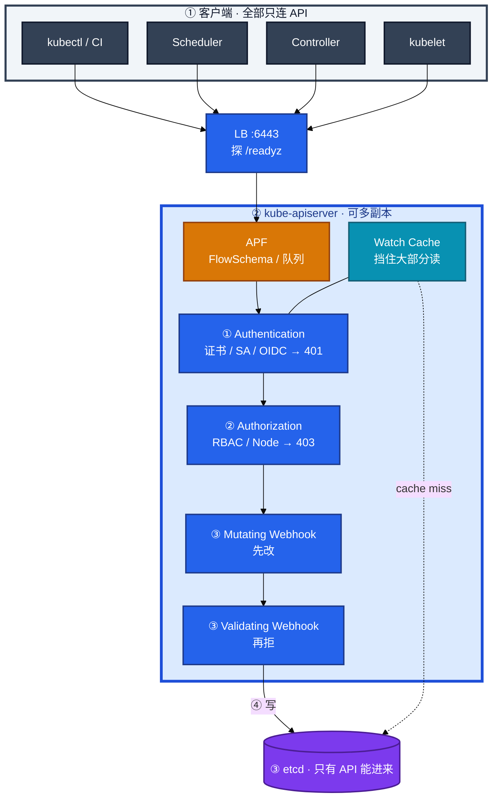
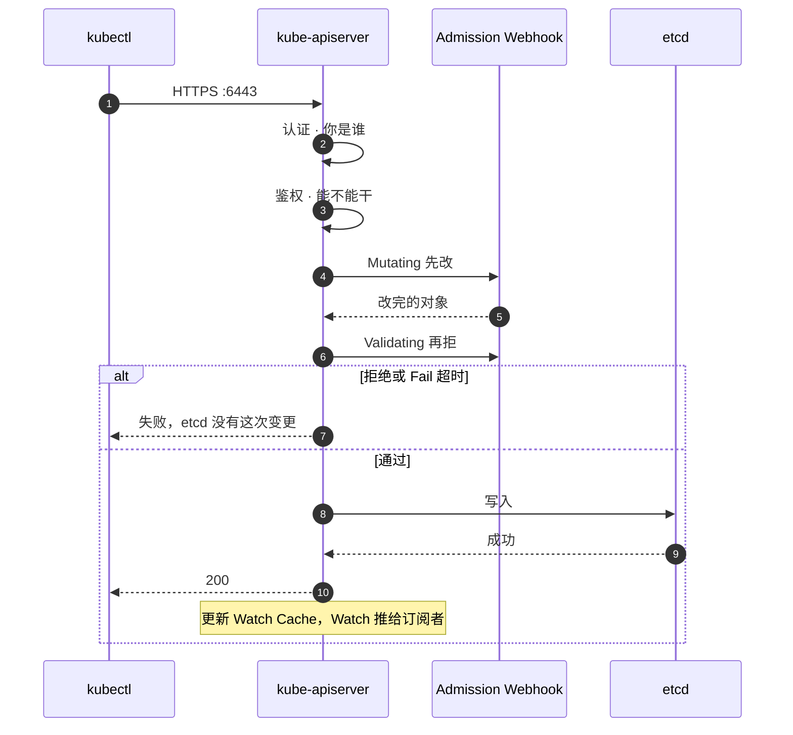
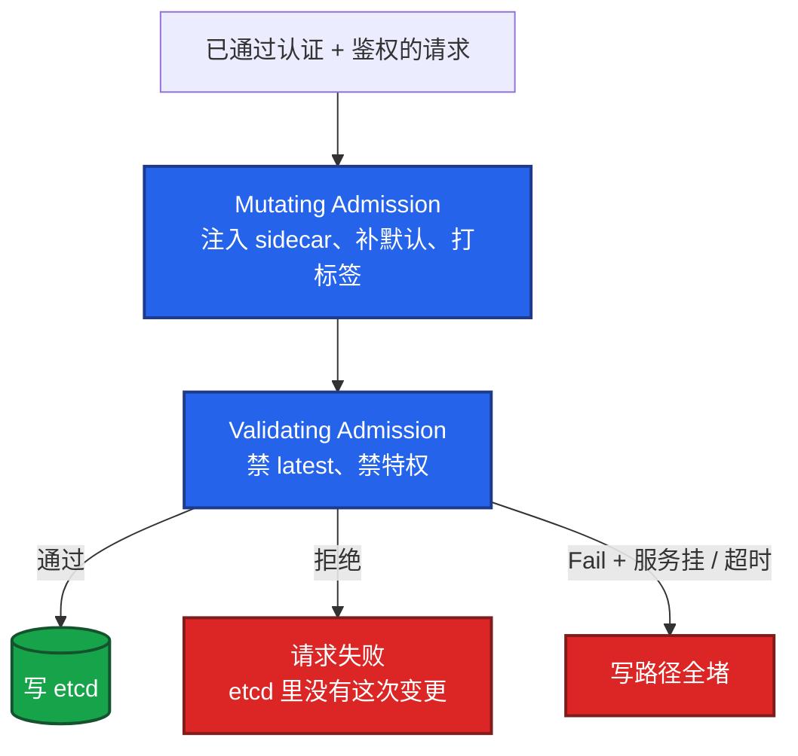
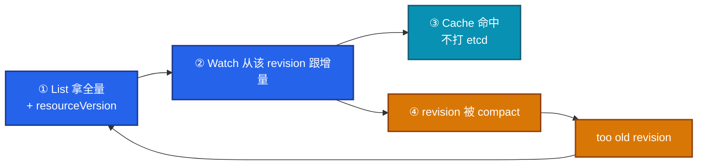
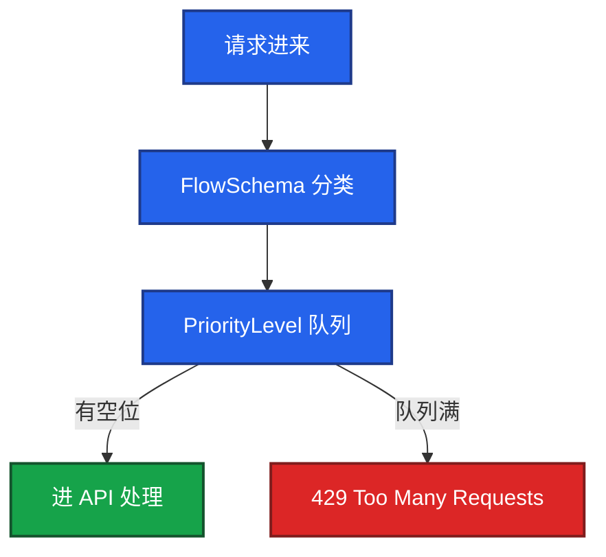
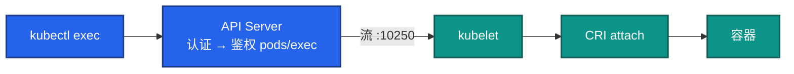
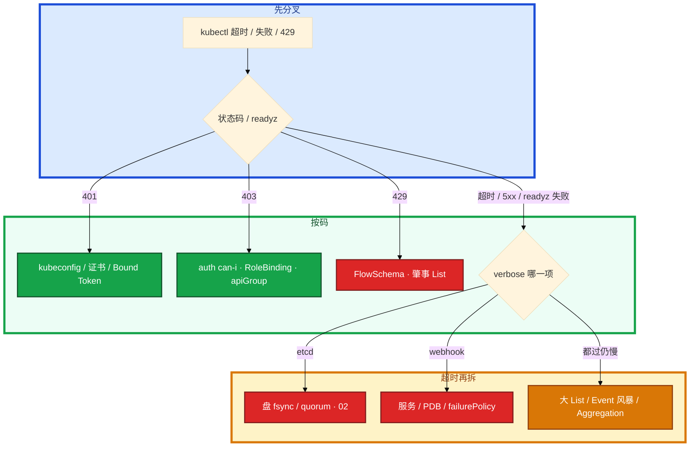

# API Server


写路径被 Webhook 或限流焊死。`kubectl` 超时或 429。群里有人要给 API 加核，另有人要重启 etcd。先分清是认证、鉴权、准入还是 etcd，再动手。

**读完你能：** 把一次 apply 讲成三道门；Webhook Fail 会焊死写路径；Watch Cache 挡住什么、写仍过谁；429 找肇事者而不是加 inflight；LB 必须探 `/readyz`。

## 本章目录

缩进 = 上下级。3 下面才是 3.1。

想钉在**正文左边**跟着滚：菜单 **查看 → 打开视图 → 大纲**。Markdown 预览做不到独立左栏，目录只能写在文章开头。

- [1. 基本概念](#1-基本概念)
- [2. 架构图](#2-架构图)
- [3. 原理](#3-原理)
  - [3.1 三道门](#31-三道门认证鉴权准入)
  - [3.2 Admission Webhook](#32-mutating-先改validating-再拒)
  - [3.3 Watch Cache](#33-list-watch-与-watch-cache)
  - [3.4 APF](#34-apf-与-429)
  - [3.5 exec / logs](#35-execlogsport-forward)
- [4. 安装部署](#4-安装部署)
- [5. 核心配置](#5-核心配置)
- [6. 常用命令](#6-常用命令)
- [7. 常用操作](#7-常用操作)
  - [7.1 证书](#71-证书轮转)
  - [7.2 审计](#72-审计)
  - [7.3 Webhook 紧急放行](#73-webhook-紧急放行)
- [8. 生产排障](#8-生产排障)
- [9. 必会 · 常考](#9-必会--常考)
- [合上书](#合上书问自己)

**本章不讲：** Raft、fsync、备份、defrag → [02 etcd](../02-etcd/)；组件挂了的总影响面 → [01 集群架构](../01-集群架构/)；RBAC 细则、PSS、配额 → [13](../13-RBAC与安全/)；HPA unknown、metrics-server → [07](../07-弹性伸缩/)；GitOps / SSA 工程化 → [05](../05-工作负载控制器/)、[22](../22-GitOps-ArgoCD与Tekton/)。

---

## 1. 基本概念

API Server 是控制面 **唯一入口**。kubectl、Scheduler、Controller、kubelet、Operator，全部只和它说话。它自己 **无状态**，数据在 etcd，所以可以多副本 + LB。它不调度、不起容器。

你执行 `kubectl apply -f hall.yaml`，请求进 `:6443`。三道门 **串行**，任何一步停。鉴权不管 YAML 合不合规，合规是准入的事。没权限到不了准入；有权限但 YAML 违规，是准入拒。

| 状态码 / 现象 | 卡在哪 | 不是什么 |
|---------------|--------|----------|
| **401** | 不知道你是谁。kubeconfig / 证书过期 / Token 无效（1.24+ Bound Token 会过期） | API 挂了 |
| **403** | 知道你是谁但没权限。RoleBinding、apiGroup | 「API 坏了」 |
| **创建被拒、报 webhook** | 过了鉴权，卡在准入。etcd 里没有这次变更 | etcd 盘 |
| **429** | APF 队列满 | CPU 不够 |
| **整体超时、readyz 失败** | 多半 etcd 不通或 Webhook 挂死 | API 自己缺 CPU |

> **记住**：先看状态码是 401、403、429 还是超时，再决定查证书、RBAC、Webhook 还是 etcd。生产里慢，多半是 etcd 磁盘或 Webhook 超时，不是 API 自己缺 CPU。

CRD 把新类型注册进 API。Aggregation（APIService）把请求反代到 metrics-server 等扩展 API。SSA（Server-Side Apply）用 FieldManager 分字段归属，避免 Helm、HPA、人手 apply 互相覆盖 `replicas`。

---

## 2. 架构图

先把整张图钉住。后面配置、命令、排障都对着这张图说话。



图上三条线：

1. **没有箭头从 kubelet / Controller 指向 etcd。** 读大多打 Watch Cache；写仍必须过 etcd。
2. **LB 必须探 `/readyz`。** 只探 TCP `:6443` 会把「进程在、etcd 不通、实际不能写」的实例留在池里。
3. **Webhook 是同步调用。** `failurePolicy: Fail` 且服务挂了 / 超时 = 写路径全堵。

生产形态（和 01 同一套）：Stacked 时每台 API 常连本机 `127.0.0.1:2379`，同命运不是配错；External 每个 API 写满 3 个 etcd 地址；托管你配的是云 LB 健康检查路径，不要只填端口。

---

## 3. 原理

原理只保留动手和面试会用到的：三道门谁先谁后、Webhook 怎么焊死、Cache 挡什么、429 找谁、exec 为什么 get 可以它不行。

**本节 5 块：** 3.1 三道门 · 3.2 Webhook · 3.3 Watch Cache · 3.4 APF · 3.5 exec

### 3.1 三道门：认证、鉴权、准入



三道门串行。**鉴权先，准入后。** 没权限到不了准入。有权限但 YAML 违规，是准入拒。鉴权不管对象合不合规。

认证常见来源：客户端证书、ServiceAccount Token、OIDC。生产应 `--anonymous-auth=false`。匿名开着时，没带证的请求可能落到 `system:anonymous`，再被 RBAC 拒成 403，排障会绕弯。

Node 鉴权给 kubelet 最小节点范围，避免一张 kubelet 证能读全集群 Secret。共享集群管理员 kubeconfig、完全无审计，这三件在生产里会被当成没管过控制面。

1.24+ ServiceAccount 用 Bound Token，会过期。过期就是 401，不是 RBAC 丢了。长期跑的 Controller 要用正确的 Token 投影或自动轮换，不要把过期 Token 写进 Secret 再忘。

现场 `-v=9` 能看到真实 HTTP verb 和 URL。403 时用来确认打的是哪个 apiGroup：`""`（core）还是 `apps` 写错，看起来像没权限，其实是规则写歪。

### 3.2 Mutating 先改，Validating 再拒

策略组上线了一个 Validating Webhook：禁 `latest`、禁特权。Webhook 服务只起了 1 个副本，没有 PDB。当晚那个 Pod 被驱逐，大厅发版全部失败。

准入发生在鉴权之后、写 etcd 之前。顺序是硬的：



Validating 在 Mutating 之后，才能看到「改完之后的对象」。如果先校验再改，注入出来的字段没人管。策略引擎、PSS、往 Pod 里塞代理，都走这条。

Webhook 是同步调用。超时建议 **<3s**，服务要多副本 + PDB。单副本 Webhook 没有 PDB，是生产事故的经典形状。

`failurePolicy: Fail` 且服务挂了 / 超时 = **创建和更新被全拒**。你眼睛看到的：`kubectl apply` 报 webhook timeout 或 connection refused；`kubectl get validatingwebhookconfiguration` 能看到这条规则；etcd 里没有新 ReplicaSet。卡住先看 Webhook 服务和 PDB，不要先给 API 加核。

`failurePolicy: Ignore`：当没这道门，放行。紧急窗口（要审批）才改 Ignore 或临时删 Configuration。修完改回 Fail。改 Ignore 的代价：策略失效，特权 Pod、latest 镜像可能被放进来。

CRD 的 conversion webhook 超时只影响那一类自定义资源；若 webhook 规则配得太宽（比如匹配了所有 pods/deployments），会误伤内置资源创建。metrics-server 挂了，`kubectl top` 失败、HPA 变 unknown（07），**API 本身仍可读写业务对象**。别把「top 不行」说成「API 挂了」。Aggregation 挂了会占 inflight，但不应该让核心资源写路径全死。

> **记住**：Webhook Fail + 服务挂 = 写路径焊死；超时 <3s，多副本 + PDB。规则配太宽会误伤内置资源。

### 3.3 List-Watch 与 Watch Cache

Deployment 控制器不是每秒 List 一次全集群。它先 List 拿全量，再 Watch 跟增量。etcd compact 把旧 revision 删掉之后，这条 Watch 会断。



Watch Cache 在 API Server **内存**里。读大多打 Cache，不打 etcd。写仍必须过 etcd。compact 之后游标过期，客户端报 `too old revision`，重新 List 即可。你眼睛看到的：Controller 日志里出现 too old revision，然后一次大 List；正常几秒就跟上。卡住——所有 Informer 同时 List、APF 开始 429——查 etcd compact 窗口是不是过激（02），不是先重启 API。

规模化靠 Cache 把读从 etcd 卸下来，不是靠每个组件直连 etcd，也不是靠无脑加 etcd 节点。热数据走 Cache；写和 cache miss 仍打 etcd。很多「读」其实夹着 Event/status 写。

默认线性一致读走 **Leader**。Controller 不直连 etcd：安全、一致、限流、审计都在 API。直连会打爆 etcd，也绕过 RBAC。

> **记住**：`too old revision` 是 compact 后的正常重 List，不是 etcd 坏了。不要为此去 restore。

### 3.4 APF 与 429：先找肇事者，不要加 inflight

CI 某次坏了，每个 Job 都 `kubectl get pods -A` 狂轮询。过一会儿交互式 kubectl 开始 429，leader-election 也抖。这不是 API CPU 不够。

API Priority and Fairness 按 FlowSchema 把请求分类，送进不同 PriorityLevel 队列。leader-election、kubectl 交互、疯狂 List 的 Controller **不应挤同一条道**。队列满返回 **429**。



肇事客户端把某条队列打满，API 返回 429 保护 etcd。你眼睛看到的：`kubectl get po` 偶发 429；`kubectl get flowschema` 能对上哪类请求；API 审计/日志里同一条 List 刷屏。卡住先给肇事组件限速或降优先级，给 leader-election 高优先级。不要无脑加大 `--max-requests-inflight`（默认读 400 / 写 200）——那只是推迟打爆 etcd。只加 API 副本，肇事客户端会 **一起锤 etcd**。

常见肇事者：坏掉的 CI 狂 List、Informer 没 Watch 只轮询、监控组件 List 全集群 Pod、Event 风暴。

429 和 Webhook 超时怎么区分：429 是进 API 之前/公平队列被拒，响应码就是 429。Webhook 超时是已经在处理，写路径等准入，表现是请求变慢或失败，码不一定是 429。先看响应码和 FlowSchema 指标。

> **记住**：429 找肇事客户端，不要加 inflight，也不要只加 API 副本。

### 3.5 exec / logs / port-forward：过 API，再到 kubelet

排障要进大厅容器看配置。`kubectl get po` 正常，`kubectl exec` 失败。这不是 Pod 挂了，也不是 kubectl 直连容器。



exec/logs/port-forward 仍过 API，再升级成到 kubelet `:10250` 的流。防火墙只放 6443 不放 10250，就会「get 可以、exec 不行」。你眼睛看到的：get 200；exec 超时或 connection refused；`-v=9` 能看到升级后的 URL。卡住先查 API→kubelet 10250、kubelet 证书、RBAC `pods/exec`。NetworkPolicy 拦这条路同样失败，即使 Pod 是 Running。

exec 是连到已有 Pod 的子资源，主要卡在鉴权（`pods/exec`）和到 kubelet 的流。创建 Pod 才走完整 Mutating/Validating。别把「exec 失败」第一刀开在 Webhook 上。

> **记住**：exec 不是直连 Pod IP，是 API 再转到 kubelet `:10250`。

---

## 4. 安装部署

kubeadm 静态 Pod：`/etc/kubernetes/manifests/kube-apiserver.yaml`。证书过期当天是控制面 P0。

| 项 | 选 | 不选 |
|----|----|------|
| 副本 | ≥3 + LB，跨 AZ | 单副本控制面 |
| LB 探针 | HTTPS `/readyz` | 只探 6443 TCP |
| 鉴权 | `Node,RBAC`，关匿名 | 共享集群管理员 kubeconfig |
| Webhook | 超时 <3s，多副本+PDB；失败策略想清楚 | 单副本 + `failurePolicy: Fail` 管所有 CREATE |
| 审计 | 开，Secret 单独加严 | 完全无审计 |
| APF | 给 leader-election 高优先级 | 默认全挤一条队列还狂 List |
| Stacked `--etcd-servers` | 本机 `127.0.0.1:2379` | 误当成配错去改成外网 |
| External `--etcd-servers` | 写满 3 或 5 个 HTTPS 地址 | 漏地址变成单点 |

托管集群证书轮换跟厂商文档，不要套 kubeadm 命令。你配的是云 LB 健康检查路径，不要只填端口。

`/livez`：进程活着没有（该不该重启）。`/readyz`：能不能接流量（etcd 通不通、关键检查过不过）。**LB 用这个。** `/readyz?verbose`：哪一项失败，排障第一刀。

etcd 某台磁盘抖，其中一台 API 实例已经写不进去，但进程还在，TCP `:6443` 照样 accept。LB 如果只探端口，坏实例留在池里，一部分 kubectl 超时、一部分正常。`/readyz` 失败时这台实例上的长 Watch 会断，客户端重连到健康实例。所以坏实例必须从池里摘掉，否则重连可能又打回来。

验收：进程在不算数。必须 `/readyz` 通过。不要只探 TCP 6443。

---

## 5. 核心配置

只动有证据的项。改 `kube-apiserver.yaml` 后等 kubelet 重建该静态 Pod。续 pem 后必须重启。

| 参数 | 默认 / 常见 | 生产怎么用 | 改错会怎样 |
|------|-------------|------------|------------|
| `--anonymous-auth` | 建议 `false` | 关掉 | 匿名落到 system:anonymous，排障绕弯 |
| `--authorization-mode` | `Node,RBAC` | 保持 | 乱加 AlwaysAllow = 没鉴权 |
| `--etcd-servers` | Stacked 本机；External 全列表 | 见 4 | 漏地址单点 |
| `--max-requests-inflight` | 读 400 | 一般不动 | 加大只是推迟打爆 etcd |
| `--max-mutating-requests-inflight` | 写 200 | 一般不动 | 同上 |
| `--audit-log-path` + Policy | 关则无 | **必须开**；Secret 单独加严 | 出事只能猜；写满盘反噬 API |
| `--enable-admission-plugins` | kubeadm 已含 | 不要随便摘 NamespaceLifecycle / LimitRanger / ResourceQuota | 摘掉等于少一道内置门 |
| `--encryption-provider-config` | 无 | Secret 静止加密在这里，不在 etcd | etcd 默认明文 JSON（02） |

> **记住**：证书续完要重启静态 Pod；审计尤其 Secret，写满盘会反噬 API，要轮转。quota / compact 在 02，不要在 API 这边「加大 inflight」当容量手段。

生产最少看：请求 P99、5xx、429、etcd 请求延迟、当前 inflight、Webhook 延迟、证书剩余天数。

| 周期 | 看什么 |
|------|--------|
| 日常 | `/readyz`、P99、429、证书天数 |
| 变更前 | 新增 Webhook 的超时和 failurePolicy、是否多副本 |
| 事故 | 先分 401/403/429/5xx，再分 etcd 还是准入 |

指标：`apiserver_request_duration_seconds`、`etcd_request_duration_seconds`、`apiserver_flowcontrol_rejected_requests_total`、Webhook 延迟。Event 风暴、无 Watch Cache 的狂 List、慢 Webhook 是三大元凶。

---

## 6. 常用命令

```bash
kubectl get --raw /readyz?verbose
kubectl auth can-i delete pods --as=system:serviceaccount:ns:sa
kubectl get pods -v=9
kubectl get validatingwebhookconfiguration,mutatingwebhookconfiguration
kubectl get flowschema
kubectl logs -n kube-system -l component=kube-apiserver --tail=100
kubeadm certs check-expiration
```

| 目的 | 命令 | 看什么 |
|------|------|--------|
| 愿不愿接流量 | `kubectl get --raw /readyz?verbose` | 哪一项 fail；etcd / webhook 常先挂 |
| 401 vs 403 | `kubectl auth can-i ... --as=...` | 403 时确认是 RBAC |
| 真实 verb / URL | `kubectl get pods -v=9` | apiGroup 写歪看起来像没权限 |
| 写路径焊死 | `get validatingwebhookconfiguration,mutatingwebhookconfiguration` | 规则范围、failurePolicy |
| 429 | `kubectl get flowschema` | 哪类请求挤满 |
| 证书 | `kubeadm certs check-expiration` | 剩余 **< 14 天** 当 P1 |

值班先跑：`/readyz?verbose` → webhook 列表 → flowschema → API 日志。不要先重启全部 API。

---

## 7. 常用操作

### 7.1 证书轮转

你跑 `kubeadm certs check-expiration`，发现还剩 3 天。`kubeadm certs renew` 续的是磁盘上的 pem，**必须重启静态 Pod** 才会加载新 pem。只改 pem 不重启，进程还拿着旧证。托管集群跟厂商文档，不要套 kubeadm。监控剩余天数，过期当天是控制面 P0。

### 7.2 审计

出事要回答谁在何时对 Secret/RBAC 做了什么。没有审计只能猜。Secret 建议 `RequestResponse` 或至少 Metadata。全量 RequestResponse 会很大，按资源分级。审计写满盘会反噬 API，要轮转。

匿名、共享 admin kubeconfig、无审计，这三件说明没人把控制面当生产系统管。共享 admin 无法追责；匿名扩大攻击面；无审计出事只能猜。

### 7.3 Webhook 紧急放行

要审批、留窗口：把关键 webhook 的 `failurePolicy` 改 `Ignore`，或临时删 Configuration。修服务后改回 Fail。这是止血，不是长期方案。改 Ignore 的代价：策略失效，特权 Pod、latest 镜像可能被放进来。窗口要短。

新增 Webhook 上线前：超时 <3s、多副本跨节点 + PDB、规则不要配成匹配所有内置资源、`failurePolicy` 想清楚。

SSA：现场 `-v=9` 能看到真实 HTTP verb。HPA 和 Git 抢 `replicas` 时用 FieldManager 分归属（05、07）。

---

## 8. 生产排障

写路径上有三处会把「看起来 API 慢」放大，先不要给 API Server 加 CPU：



```
  kubectl --> API Server --> Admission Webhook --> etcd fsync
                 |                 |                    |
              自己很少是瓶颈    超时=写路径一起死     磁盘慢=全集群慢
              429 找客户端
```

| 现象 | 先做什么 | 不要做什么 |
|------|----------|------------|
| 401 | kubeconfig / 证书过期 / Token 无效（1.24+ Bound Token 会过期） | 当 API 挂了去重启 |
| 403 | `auth can-i --as=...`；查 RoleBinding 和 apiGroup | 「API 坏了」 |
| 429 | 查 FlowSchema、谁在狂 List；给肇事组件限速 | 加大 inflight；只加 API 副本 |
| 写全部失败 / 创建超时 | **先看 Validating/MutatingWebhookConfiguration**；Webhook 服务挂了且 Fail = 全堵 | 先给 API 加核 |
| API P99 高 | etcd fsync、Webhook 延迟、大 List、Event 风暴 | 先加 CPU |
| 证书过期 | 续期并重启 API；监控剩余天数 | 只续 pem 不重启 |
| get 可以、exec 不行 | API→kubelet :10250、kubelet 证书、RBAC pods/exec | 第一刀开 Webhook |
| `too old revision` | Informer 重新 List；compact 窗口（02） | 当数据丢失去 restore |
| `kubectl top` 失败 | Aggregation / metrics-server（07） | 说成「API 挂了」 |
| CRD webhook 连 Deployment 也建不了 | 规则配太宽 | 只查那个 CR |

现场：

```bash
kubectl get --raw /readyz?verbose
kubectl get validatingwebhookconfiguration,mutatingwebhookconfiguration
kubectl get flowschema
kubectl logs -n kube-system -l component=kube-apiserver --tail=100
```

Webhook 紧急放行要审批、留窗口。修完改回 Fail。活动高峰 etcd 和日志同盘时，对齐 01/02：确认进程还在 → 停发版 → 救盘 / Webhook / APF → 不要重启逻辑服。

---

## 9. 必会 · 常考

白板和追问高频，能一口回：

| 说法 | 对错 | 口径 |
|------|:----:|------|
| 鉴权管 YAML 合不合规 | 错 | 鉴权管「能不能干」；合规是准入 |
| Mutating 和 Validating 谁先都行 | 错 | 必须先改再校验 |
| Webhook Fail + 服务挂只影响那条策略 | 错 | 写路径可以全堵 |
| Watch Cache 把写也挡住了 | 错 | 写仍过 etcd |
| `too old revision` 表示 etcd 损坏 | 错 | compact 后正常，重新 List |
| 429 加 API 副本就能好 | 错 | 一起锤 etcd；找肇事客户端 |
| 加大 inflight 是正确容量手段 | 错 | 只是推迟打爆 etcd |
| LB 探 TCP 6443 就够了 | 错 | 必须 `/readyz` |
| exec 是 kubectl 直连 Pod IP | 错 | API 再转到 kubelet :10250 |
| 证书 renew 完立刻生效 | 错 | 必须重启静态 Pod |
| Secret 进 etcd 默认加密 | 错 | 静止加密是 API `EncryptionConfiguration` |
| metrics-server 挂了就是 API 挂了 | 错 | 业务对象仍可读写 |
| 托管不用关心 Webhook / 审计 | 错 | 自己装的准入、影响面仍是你的 |
| 匿名可以开着方便排障 | 错 | `--anonymous-auth=false` |

数字：Webhook 超时 **<3s**；inflight 默认读 **400** / 写 **200**；证书告警 **14 天**；Bound Token 1.24+ 会过期。

易混：401 vs 403 vs 429；Webhook 超时 vs etcd 盘慢 vs APF；`/livez` vs `/readyz`；Fail vs Ignore；Watch Cache 慢 vs etcd 写慢；conversion webhook 误伤内置资源 vs metrics-server 只影响 top。

---

## 合上书，问自己

1. 请求链：认证 401 → 鉴权 403 → Mutating 改 → Validating 拒 → 写 etcd；谁先谁后？
2. Webhook `failurePolicy: Fail` + 服务挂会发生什么？超时、副本、PDB 怎么配？Ignore 的代价？
3. Watch Cache 挡什么？写过不过 etcd？`too old revision` 是不是损坏？
4. 429 找谁？加 inflight、只加 API 副本为什么不够？
5. LB 为什么必须探 `/readyz`？exec 为什么 get 可以它不行？
6. 证书续完为什么还过期？审计为什么必开、尤其 Secret？

六题都能口述，这一章就过了。下一章把 Pod 剖开：探针配错会把逻辑服杀光。
