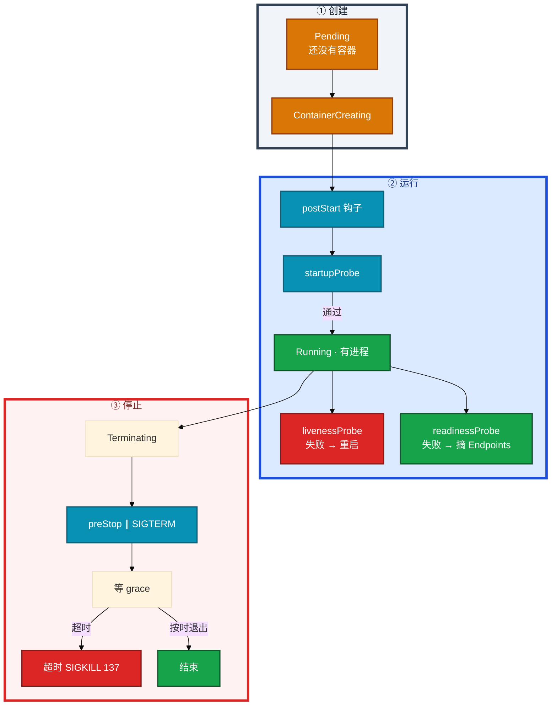
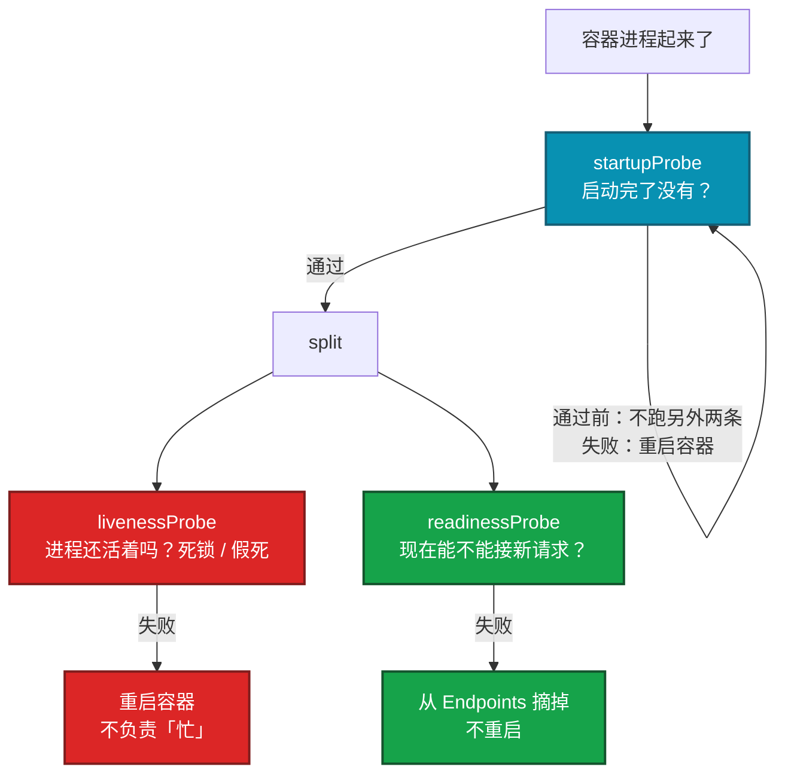
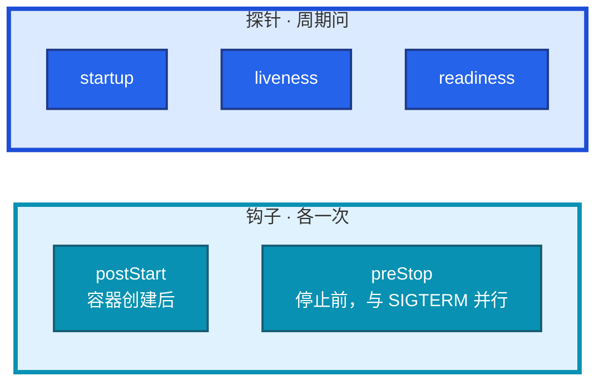
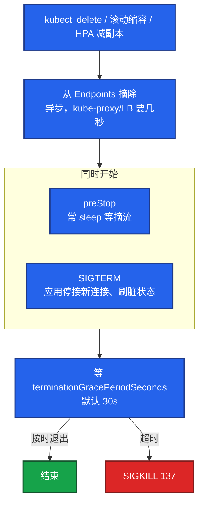
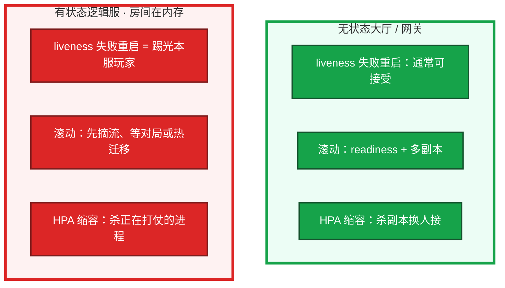
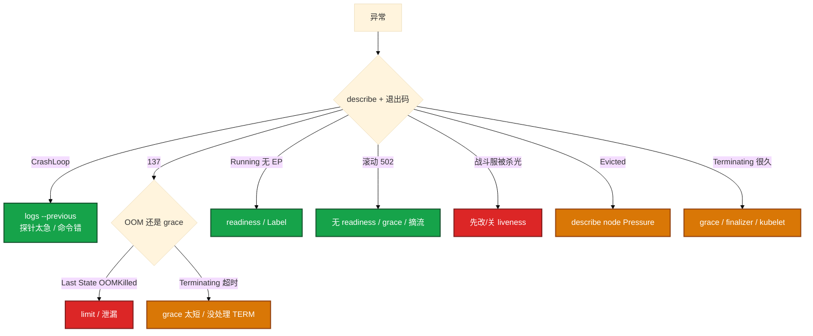

# Pod 生命周期


探针配错把逻辑服杀光。滚动一堆 502。有人要把有状态战斗服按 Web 模板抄 liveness。先别动手。这一章把三探针、生命周期钩子、优雅退出、QoS 和「能不能杀」钉死。

**读完你能：** 三条探针失败动作不同；探针和 postStart/preStop 不是一回事；restartPolicy 决定崩了是否再拉；滚动 502 能对上摘流和 SIGTERM；有状态战斗服慎 liveness、禁无脑滚。

## 本章目录

缩进 = 上下级。3 下面才是 3.1。

想钉在**正文左边**跟着滚：菜单 **查看 → 打开视图 → 大纲**。Markdown 预览做不到独立左栏，目录只能写在文章开头。

- [1. 基本概念](#1-基本概念)
- [2. 架构图](#2-架构图)
- [3. 原理](#3-原理)
  - [3.1 三探针](#31-三探针问的不是同一件事)
  - [3.2 探针 vs 钩子](#32-探针-vs-生命周期钩子)
  - [3.3 restartPolicy](#33-restartpolicy)
  - [3.4 优雅退出](#34-优雅退出502-从这里来)
  - [3.5 QoS](#35-qos节点-oom-先杀谁)
  - [3.6 有状态能不能杀](#36-游戏有状态能不能杀)
- [4. 安装部署](#4-安装部署)
- [5. 核心配置](#5-核心配置)
- [6. 常用命令](#6-常用命令)
- [7. 常用操作](#7-常用操作)
- [8. 生产排障](#8-生产排障)
- [9. 必会 · 常考](#9-必会--常考)
- [合上书](#合上书问自己)

**本章不讲：** Deploy/STS 滚动、PDB → [05 工作负载控制器](../05-工作负载控制器/)；Pending、污点、request 记账 → [06 调度机制](../06-调度机制/)；HPA 缩容杀进程 → [07](../07-弹性伸缩/)；Endpoints 为空、摘流细节 → [08](../08-Service与kube-proxy/)；节点 NotReady 驱逐 → [16](../16-节点运行时与升级/)；CrashLoop/OOM 排障串题 → [17](../17-排障实战/)。

---

## 1. 基本概念

你 apply 了一份大厅 Deployment。几秒后 `kubectl get po` 有行了。STATUS 从 Pending 变到 Running，不代表玩家已经能打进来。状态变化要能对上「卡在哪一层」——Pending 还没容器，Running 不等于能接流量。

Pod 是调度和探针的最小单位。kubelet 在本机执行探针和钩子，**不是控制器远程杀进程**。

| 状态 | 含义 | 先看 |
|------|------|------|
| Pending | 没绑上节点或卷 | Events：资源/污点/PVC（06、11） |
| ContainerCreating | 在起沙箱 | CNI、CSI、拉镜像 |
| Running | 有进程 | **不等于 Ready**，不等于进了 Endpoints |
| CrashLoopBackOff | 反复崩 | `logs --previous` + 退出码 |
| OOMKilled | 超 memory limit | cgroup 总量，不只堆 |
| Evicted | 节点压力 | Disk/Memory/PID Pressure |
| Terminating | 在收尾 | preStop / 没处理 SIGTERM / finalizer |

退出码先看再猜：137 = 128+9 SIGKILL（OOM 或 grace 超时强杀）；143 = 128+15 SIGTERM；139 段错误；1 自己退出。没有日志先看退出码，再 `--previous`。

两条不要混：

| | 探针 Probes | 生命周期钩子 Lifecycle hooks |
|--|-------------|------------------------------|
| 谁跑 | kubelet 周期问容器 | kubelet 在启动/停止时各跑一次 |
| 种类 | startup / liveness / readiness | postStart / preStop |
| 失败 | 重启或摘 Endpoints | 钩子失败会影响启动/停止，**不是**周期健康检查 |
| 和 SIGTERM | 无关 | preStop **和** SIGTERM 并行，不是「跑完再发」 |

> **记住**：Pending 是调度；ContainerCreating 是本机起进程；Running 不等于能接流量。探针问「活着吗 / 能否接流量」；钩子是启动和退出时的一次性动作。

---

## 2. 架构图

先把一个 Pod 从创建到被杀钉住。后面探针、退出、排障都对着这张图说话。



图上三条必须记住的线：

1. **startup 没过，liveness / readiness 不跑。** 用它护慢启动，不要把 liveness `initialDelay` 拉到两分钟。
2. **liveness 失败重启容器；readiness 失败只摘流。** 两条不要写成同一个 `/health`。
3. **删 Pod 时：Endpoints 摘除是异步的；preStop 和 SIGTERM 同时走。** 超时就是 137。

旁路：CrashLoopBackOff、OOMKilled、Evicted 都从 Running 岔出去，不是一种独立探针。CrashLoop 是 `restartPolicy: Always`（Deploy/STS 默认）下反复崩的退避。

---

## 3. 原理

原理只保留动手和面试会用到的：三条探针、钩子和探针的差别、崩了谁再拉、502 从哪来、节点 OOM 先杀谁、游戏服能不能杀。

**本节 6 块：** 3.1 三探针 · 3.2 探针 vs 钩子 · 3.3 restartPolicy · 3.4 优雅退出 · 3.5 QoS · 3.6 有状态

### 3.1 三探针：问的不是同一件事

大厅 JVM 加载配置表要 90s。有人把 liveness `initialDelay` 写成 5s，容器还没 listen 就被杀，CrashLoop。另一边有人把 liveness 和 readiness 配成同一条「业务健康」，请求一慢就被重启。



集群里发生了什么：kubelet 按探针结果动手。startup 没过，另外两条不跑；liveness 失败重启容器；readiness 失败只从 Endpoints 摘掉，进程还在。你眼睛看到的：

- startup/liveness 太急 → CrashLoop，`describe` Events 里探针失败。
- 只有 readiness 失败 → STATUS=Running，`kubectl get ep` 没有这个 Pod（08）。
- 两条写成同一条 → 慢请求变成重启，雪上加霜。

检测：httpGet / tcpSocket / exec / grpc。关键参数：`initialDelaySeconds`、`periodSeconds`、`failureThreshold`、`timeoutSeconds`。startup 的「最坏启动时间」≈ `failureThreshold × periodSeconds`，用来替代把 liveness `initialDelay` 拉到两分钟。

例：JVM / 游戏服加载配置表可能 90s。startup: period=10, failureThreshold=18 → 最坏约 180s 才判启动失败。通过后 liveness 保持短周期（如 10s × 3），专抓死锁。不要：liveness initialDelay=120，中间 90s 盲区，或 delay=5 启动中被杀。

`timeoutSeconds` 太短，接口稍慢就算失败。exec 探针会在容器里起进程，高密度节点上别用太重的脚本当探针。

**错误配法：**

1. liveness 和 readiness 同一条「业务健康」：请求一慢就被重启，雪上加霜。
2. 没有 startup，却把 liveness `initialDelay` 拉到 120s：起来只要 30s，中间 90s 等于盲区；或 delay 太短，启动中被杀，CrashLoop。
3. liveness 打依赖（MySQL/Redis）：依赖抖一下，逻辑服被集体重启。
4. readiness 永远成功：滚动时未就绪就进 Endpoints，502。

**正确：** startup 护启动；liveness 只问进程/死锁（浅）；readiness 问能否接流量（依赖、预热、队列）。liveness 失败会重启；重启过程中也会短暂不在 Endpoints。摘流本身是 readiness 的事。不要靠 liveness 当摘流开关。

readiness 打 Redis 可以：失败只摘流、不杀进程。依赖恢复后重新进 Endpoints。这正是 readiness 和 liveness 要拆开的原因。

> **记住**：startup 护启动；liveness 失败重启；readiness 失败摘流不重启。两条不要写成同一条。

### 3.2 探针 vs 生命周期钩子

白板最容易把 `lifecycle` 和探针画成一回事。不是。



| | postStart | preStop | 三探针 |
|--|-----------|---------|--------|
| 时机 | 容器创建之后，**不保证**主进程已 listen | 收到停止时 | 按 period 反复 |
| 和 SIGTERM | 无关 | **并行**，不是跑完再发 | 无关 |
| 失败 | 可能把容器判失败并重启（看实现/策略） | 占用 grace；太慢会被 137 | 见 3.1 |
| 典型用法 | 写个文件、注册一下（少用，易踩时序） | `sleep` 等数据面摘流 | 健康与摘流 |

postStart 和主容器入口 **异步**。不要在 postStart 里做「必须先于主进程」的事——主进程可能已经在跑，钩子还没完。需要严格先后，用 Init 容器。

preStop 的 `sleep` **不能**替代应用处理 SIGTERM。sleep 只等 kube-proxy / 云 LB 摘干净。应用仍要停接新连接、刷脏状态。

> **记住**：钩子是一次性动作；探针是周期健康检查。preStop 不是「跑完再发 SIGTERM」。

### 3.3 restartPolicy

`restartPolicy` 作用在 **Pod** 上，决定容器退出后 kubelet 要不要再拉。不是探针字段。

| 值 | 谁用 | 行为 |
|----|------|------|
| **Always** | Deployment / StatefulSet / DaemonSet **默认** | 任何退出都重启；CrashLoopBackOff 是退避，不是独立探针 |
| **OnFailure** | Job 常用 | 只有非 0 退出才重启；成功（0）就停 |
| **Never** | Job 一次性、排障 Pod | 不重启 |

Deploy/STS/DS 的 template 里写 `Never` 会被拒或被当成不符合控制器语义——控制器期望副本始终在。Job 才需要 OnFailure/Never。Job 写成 Always：成功也会被再拉，completions 对不上。

CrashLoopBackOff：Always 下反复崩，间隔指数退避。第一刀 `logs --previous`，不是重启节点。探针过严也会看起来像 CrashLoop（刚起来就被 liveness 杀）。

Init 容器失败：整个 Pod 按 restartPolicy 重启，**主容器不会启动**。一个 Init 失败就卡住。长时间/可失败重试的批处理用 Job，不要塞 Init。1.28+ 原生 sidecar：`initContainers` 里 `restartPolicy: Always`，kubelet 先起 sidecar、等它 Ready 再起主容器；主容器退出时 sidecar 也能收尾。旧写法 sidecar 可能抢跑或先退出。展开见 05。普通 Init 跑完就退出，不能当常驻代理。

> **记住**：CrashLoopBackOff 是 Always 下的退避。Job 才用 OnFailure/Never。Init 失败主容器起不来。

### 3.4 优雅退出：502 从这里来

你滚动大厅：新副本 Ready 了，旧副本被删。玩家打到 Service 上一堆 502。不是镜像坏了，是摘流和应用退出抢跑。

删 Pod、滚动缩容、HPA 减副本，走的都是这条。**preStop 不是「跑完再发 SIGTERM」。** 和 SIGTERM 并行。



集群里发生了什么：控制面把 Pod 从 Endpoints 摘掉，同时 kubelet 发 SIGTERM 并跑 preStop。kube-proxy / IPVS / 云 LB 摘流要几秒。应用若立刻退出，路上的包打空连接 → 502。你眼睛看到的：`get ep` 已经没有这个 IP，但部分节点 ipvs 还指着它；容器退出码 137 说明 grace 不够，被 SIGKILL。卡住先查 readiness 有没有先摘、grace 够不够、应用有没有处理 TERM。

生产默认套路：

```yaml
terminationGracePeriodSeconds: 60   # 要大于 preStop + 业务刷盘
lifecycle:
  preStop:
    exec:
      command: ["/bin/sh", "-c", "sleep 5"]  # 等数据面摘流，不是让业务多睡
```

应用必须处理 SIGTERM：停接新连接、刷脏状态、再退出。Java/Go 要在容器里当 PID 1 或有 init（tini / dumb-init）转信号，否则 shell 当 PID 1 收不到 TERM，只会等到被 KILL。`terminationGracePeriodSeconds` 必须大于 preStop + 刷盘时间，否则 sleep 还没完就被 137。

没有 readiness，新 Pod 一 Running 就进 Service，旧的已 TERM，中间空窗。IPVS 还可能把新连接打到正在退出的 Pod。`maxUnavailable=0` 还 502，问题在探针/grace/摘流，不是滚动公式 alone（05、15）。

> **记住**：摘流是异步的；preStop 和 SIGTERM 同时走；超时就是 137。sleep 5 不能替代应用处理 TERM。

### 3.5 QoS：节点 OOM 先杀谁

战斗服没写 request，HPA 算不了利用率，调度当 0。节点内存一紧，kubelet 先赶 BestEffort。你看到 Pod Evicted，不是这个容器自己超了 limit。

Scheduler 看 **request** 记账；节点内存不够时 kubelet 按 **QoS + limit** 赶人。CPU 超 limit：throttle，不杀。内存超 limit：OOMKill。


容器 RSS 超过自己的 memory **limit** → 内核 OOMKill 这个容器（137）。节点 Memory/Disk/PID Pressure → kubelet 按 QoS 赶人，那是 Evicted。你眼睛看到的：`describe pod` Last State 是 OOMKilled，看本容器 limit；`describe node` Conditions 有 Pressure，才是 Evicted。卡住别只说「加内存」：RSS 持续涨是泄漏；启动就顶满是 limit 不够或启动峰值。

核心战斗服、支付不要 BestEffort。limit 按 **cgroup 总量**（堆外、缓冲、运行时），Java/Go 通常要留 30–50%，不是只填堆大小。没写 request，HPA 算不了利用率（07），调度当 0，容易超卖后 Evict。

| | OOMKilled | Evicted |
|--|-----------|---------|
| 谁动手 | 本容器超了自己的 memory **limit** | 节点 Memory/Disk/PID Pressure，kubelet 按 QoS 赶人 |
| 先看 | `describe` Last State；RSS 趋势 | `describe node` Conditions |
| 处理 | limit 过小还是泄漏 | 清镜像/日志/emptyDir，或扩节点 |

Guaranteed 就一定不被杀吗？节点压力极大时仍可能被 Evict，只是顺序最后。单副本战斗服还要 PDB 和别把节点打满（05、16）。QoS 不是「永不杀」。DiskPressure 常是镜像/日志/emptyDir。emptyDir 当盘用满也会触发。被 Evict 的战斗服：先看节点压力能不能马上消；有状态服被 Evict 等于非自愿中断，PDB 挡不住。

> **记住**：调度看 request；容器 OOM 看 limit；节点压力赶人看 QoS，那叫 Evicted。

### 3.6 游戏有状态：能不能杀？

无状态大厅：杀一个，Service 换另一个，会话在 Redis。战斗服：玩家 Session、战斗帧、房间在 **进程内存**，TCP/WebSocket 绑在这一份 Pod 上。有人给战斗服配了和大厅一样的 liveness，Redis 抖一下，整区玩家被踢光。



kubelet 不管你是不是游戏服，liveness 失败就重启，HPA 缩容就删 Pod。你眼睛看到的：战斗服 Restart Count 往上跳，玩家掉线；`get ep` 空了又满了，对局状态回不来。卡住 **先改/关有问题的 liveness**，再查 Redis，不要先重启节点。这和 01「etcd 挂了别重启战斗服」是同一类现场纪律：已经在跑的长连接优先保住，先停错误的自愈。

| 操作 | 无状态 API | 有状态逻辑服 |
|------|------------|--------------|
| liveness 失败重启 | 通常可接受 | **等于踢光本服玩家、战斗可能丢** |
| 滚动更新 | readiness + 多副本即可 | 要先摘流、等对局结束或热迁移，不能当 Deployment 默认滚 |
| HPA 缩容 | 杀副本 | 会杀正在打仗的进程（07） |
| drain | PDB 保最低副本（05） | 还要看单副本是否就是「一个区服」 |

**结论：**

1. 逻辑服 **慎配 liveness**，或只探「进程死锁」且失败阈值拉宽；不要把「匹配队列长」「Redis 抖」写成 liveness。
2. 杀之前：停匹配、禁新进、等对局结束或持久化，再删 Pod。
3. 副本可互换的大厅/网关可以按 Web 来；**绑定了房间/场景的进程按有状态来**，控制器往往是 STS 或自研调度，不是裸 Deployment（05）。换了 STS 仍会按序杀 Pod，不解决内存里的对局。
4. 断线重连、状态落 Redis，是研发能力；运维不能假设「杀了会自己恢复」。
5. **readiness 仍要配。** 没准备好（加载配置表、连 Redis）不应进 Endpoints。readiness 摘流 ≠ 杀进程。滚动和 PDB 都靠 Ready（05、08）。

QoS：核心战斗服 Guaranteed。节点 OOM 时最后才轮到它。

> **记住**：有状态逻辑服慎 liveness、禁无脑滚动/HPA 缩；readiness 仍要，没就绪不要进 Endpoints。

---

## 4. 安装部署

Pod 没有单独「安装」。生产落地是 YAML 约定和节点 QoS 预留。

| 项 | 选 | 不选 |
|----|----|------|
| 大厅 / 网关 | Deploy + 三探针拆开 + grace + preStop | liveness=readiness 同一 URL |
| 战斗服 | 浅 liveness 或慎配；readiness 必配；STS 或自研 | 按 Web 模板抄业务健康 liveness；当 Deploy 默认滚 |
| QoS | 核心 Guaranteed（request=limit） | 业务节点混 BestEffort |
| Init | 等依赖、短迁移 | 小时级 schema 当 Init 反复跑 |
| sidecar | 1.28+ `initContainers` + `restartPolicy: Always` | 旧 Init hack 抢跑 |

kubelet 在每个节点上。控制面机器若用静态 Pod，本机也有 kubelet。探针和钩子都是这台机器上的 kubelet 在执行。

---

## 5. 核心配置

只动有证据的项。改探针等于改自愈行为，活动中误改 liveness 能把全区杀光。

| 字段 | 生产怎么用 | 改错会怎样 |
|------|------------|------------|
| `startupProbe` | 慢启动用 failureThreshold × period 覆盖最坏时间 | 没有它、liveness delay 太短 → CrashLoop |
| `livenessProbe` | 浅，只问死锁/进程；逻辑服慎配 | 打 Redis / 业务忙 → 集体重启 |
| `readinessProbe` | 问能否接流量；滚动必配 | 永远成功 → 502；不配 → Running 就进 Service |
| `timeoutSeconds` | 接口允许的慢 | 太短，稍慢就算失败 |
| `terminationGracePeriodSeconds` | **> preStop + 刷盘**，常 60s | 默认 30s 不够 → 137 |
| `lifecycle.preStop` | sleep 等摘流 | 以为会先跑完再 TERM |
| `lifecycle.postStart` | 少用 | 和主进程抢时序 |
| `restartPolicy` | Deploy 保持 Always；Job 用 OnFailure/Never | Deploy 写 Never 不符合控制器语义 |
| `resources.requests/limits` | 核心 request=limit；limit 按 cgroup 总量 | 没 request 调度当 0；limit 只填堆 → OOM |

> **记住**：startup 的窗口是 failureThreshold × period，不是把 liveness delay 拉长。grace 必须大于 preStop + 刷盘。

---

## 6. 常用命令

```bash
kubectl describe pod <pod> -n <ns>          # Events + 探针 + 退出码
kubectl logs <pod> -n <ns> --previous       # 上次死前输出
kubectl exec -it <pod> -n <ns> -- /bin/sh   # 还活着才进得去
kubectl get po -o wide
kubectl get ep,endpointslice -n <ns>
```

| 目的 | 命令 | 看什么 |
|------|------|--------|
| 探针失败 / 退出码 | `describe pod` | Events、Last State、Ready |
| CrashLoop 没日志 | `logs --previous` | 上次死前输出 |
| 没进 Service | `get ep` / endpointslice | Ready 失败或 Label 打成 annotation |
| OOM vs Evict | `describe pod` Last State；`describe node` Conditions | limit vs Pressure |
| 退出码 | describe 的 Exit Code | 137 / 143 / 139 / 1 |

---

## 7. 常用操作

滚动大厅：readiness 挡住未就绪；preStop 等摘流；grace 够长；应用处理 SIGTERM。战斗服滚动前停匹配、等对局或热迁，不要当 Deployment 默认滚（05）。

游戏服被错误 liveness 杀光：先把探针改浅或关掉止血，再查 Redis/依赖，不要先重启节点或重启全部 Pod。

Terminating 卡很久：先分是 grace 内还是超时后。grace 内 → 应用没处理 TERM，或 preStop 太慢。超时后还在 → 本该已被 KILL；还卡就不是 grace 的事：finalizer（CSI / Operator，见 01）、kubelet 失联、PVC 卸载。节点已经 NotReady，控制面删不掉本机 Pod，要修 kubelet。`--force` 会在 etcd 里删掉对象，节点上进程可能还在，变成孤儿。游戏服强删等于断电。确认外部已无、业务允许，再补救，留变更记录。

kubelet 先按 grace 停容器；对象从 etcd 消失还要等 finalizer 摘完。PVC/Operator 卡住时，进程可能已经没了，对象还在 Terminating。不要随手 `kubectl` 抠 finalizer。

支付 Pod 加了 Init 等 MySQL。Init 失败，主容器永远起不来，整个 Pod 按 restartPolicy 重启。有人把一次小时级 schema 迁移塞进 Init，每次重建都重跑，滚动被拖死。不要把长时间任务塞进 Init 当 Job 用。

---

## 8. 生产排障



| 现象 | 第一刀 | 不要做什么 |
|------|--------|------------|
| CrashLoop | `logs --previous`；看退出码 137/1/139 | 先重启节点 |
| 刚启动就重启 | startup/liveness 太急，或命令写错 | 加内存碰运气 |
| Running 但 Service 没有它 | readiness 失败，`describe` 看探针（08） | 重装 kube-proxy |
| 滚动一堆 502 | 无 readiness，或 grace 太短、没处理 TERM | 只改滚动公式 |
| 游戏服被探针杀光 | **先改/关有问题的 liveness**，再查依赖抖动 | 重启节点或再杀一轮 Pod |
| OOMKilled | `describe` 的 Last State；limit 过小还是泄漏 | 只说「加内存」 |
| Evicted | 看节点 Pressure，不要只重启 Pod | 按 OOM 去加 limit |
| Terminating 很久 | grace / finalizer / kubelet 失联 | 第一时间 `--force` |

```bash
kubectl describe pod <pod> -n <ns>
kubectl logs <pod> -n <ns> --previous
```

---

## 9. 必会 · 常考

白板和追问高频，能一口回：

| 说法 | 对错 | 口径 |
|------|:----:|------|
| liveness 和 readiness 可以用同一个 /health | 错 | 慢请求会变成重启 |
| preStop 跑完才发 SIGTERM | 错 | 并行 |
| Running 就能进 Service | 错 | 要 Ready |
| startup 没过也会跑 liveness | 错 | 通过前另外两条不跑 |
| 钩子就是探针 | 错 | 钩子一次性；探针周期问 |
| CrashLoopBackOff 是一种探针 | 错 | Always 下反复崩的退避 |
| Deploy 应写 restartPolicy: Never | 错 | 默认 Always；Never 是 Job |
| 137 一定是 OOM | 错 | 也可能是 grace 超时 SIGKILL |
| Evicted 就是这个容器超了 limit | 错 | 节点 Pressure，按 QoS 赶人 |
| 调度看瞬时 top | 错 | 看 request / Allocatable |
| 有状态战斗服按 Web 抄 liveness | 错 | 依赖一抖全区被杀 |
| 战斗服不用 readiness | 错 | 没就绪不应进 Endpoints |
| sleep 5 能替代处理 TERM | 错 | sleep 只等摘流 |
| Guaranteed 永不被杀 | 错 | 只是节点 OOM 顺序最后 |
| 换了 STS 就可以无脑滚战斗服 | 错 | 仍会按序杀进程（05） |

数字：grace 默认 **30s**，生产常 **60s**；startup 窗口 ≈ failureThreshold × period；Java/Go limit 留 **30–50%** 给堆外。

易混：探针 vs 钩子；liveness vs readiness；OOMKilled vs Evicted；137 vs 143；Always vs OnFailure vs Never；摘流异步 vs 进程还在；Init 失败 vs 主容器 CrashLoop。

---

## 合上书，问自己

1. startup / liveness / readiness 失败分别发生什么？能不能用同一个 /health？
2. postStart / preStop 和探针差在哪？preStop 跑完才发 SIGTERM 吗？
3. restartPolicy Always / OnFailure / Never 谁用？CrashLoopBackOff 是什么？
4. 滚动 502 怎么配探针和退出？grace 和 137？
5. QoS 三级？OOMKilled 和 Evicted 谁动手？调度看什么？
6. 有状态逻辑服能不能随便配 liveness、随便杀？readiness 还要不要？

六题都能口述，这一章就过了。下一章把控制器剖开：大厅和战斗服不该用同一种滚动。
