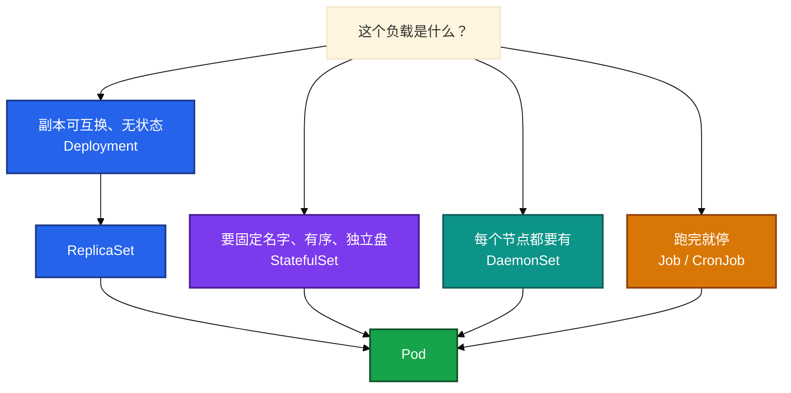
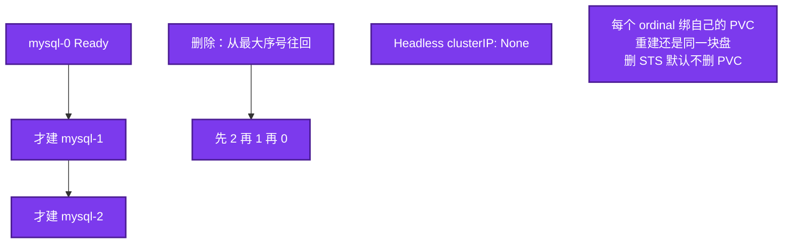
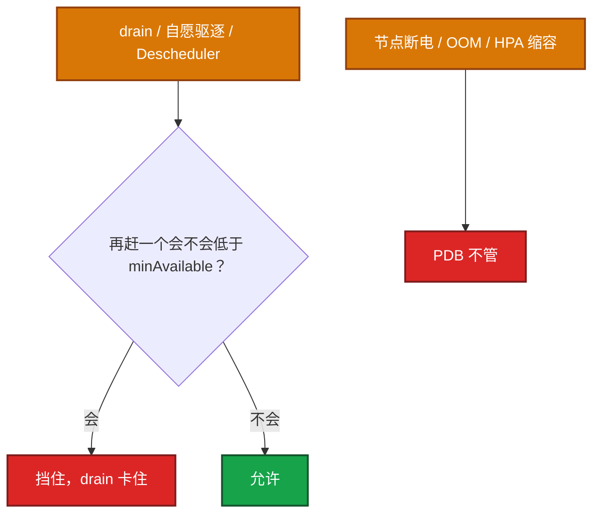
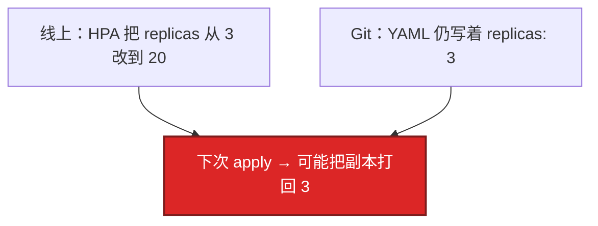
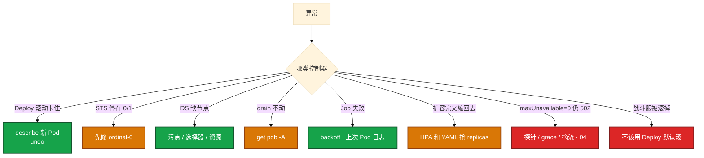

# 工作负载控制器


大厅、战斗服、日志、备份该用哪种控制器。滚动会不会杀对局。drain 被 PDB 挡住。有人把房间服写成 Deployment 默认滚。先选对控制器，再谈滚动公式。

**读完你能：** 四种控制器怎么选；零停机怎么配 surge / unavailable；STS 保证什么、不保证什么；PDB 只拦自愿中断；有状态游戏服不要当 Deployment 滚。

## 本章目录

缩进 = 上下级。3 下面才是 3.1。

想钉在**正文左边**跟着滚：菜单 **查看 → 打开视图 → 大纲**。Markdown 预览做不到独立左栏，目录只能写在文章开头。

- [1. 基本概念](#1-基本概念)
- [2. 架构图](#2-架构图)
- [3. 原理](#3-原理)
  - [3.1 四种差别](#31-deploy--sts--ds--job-差别)
  - [3.2 Deployment 滚动](#32-deployment-滚动与回滚)
  - [3.3 StatefulSet](#33-statefulset-身份和盘不是可以无脑滚)
  - [3.4 PDB](#34-pdb-只拦自愿中断)
  - [3.5 DaemonSet 与 Job](#35-daemonset-与-job)
  - [3.6 Sidecar](#36-原生-sidecar128)
- [4. 安装部署](#4-安装部署)
- [5. 核心配置](#5-核心配置)
- [6. 常用命令](#6-常用命令)
- [7. 常用操作](#7-常用操作)
- [8. 生产排障](#8-生产排障)
- [9. 必会 · 常考](#9-必会--常考)
- [合上书](#合上书问自己)

**本章不讲：** 三探针、优雅退出、QoS → [04 Pod 生命周期](../04-Pod生命周期/)；HPA 公式、有状态不能缩 → [07](../07-弹性伸缩/)；灰度 / 蓝绿 / 回滚 RTO → [15](../15-灰度与回滚/)；GitOps 流水线 → [22](../22-GitOps-ArgoCD与Tekton/)；存储 PVC Retain → [11](../11-存储/)；过滤打分 → [06](../06-调度机制/)。

---

## 1. 基本概念

控制器只 Reconcile API 对象，**不直接起容器**。真正拉进程的是 kubelet。差别是「期望」怎么定义：可互换副本、固定身份、每节点一个、还是跑完就停。

| 控制器 | 身份 | 存储 | 场景 |
|--------|------|------|------|
| **Deployment** | 可互换 | 共享或无盘 | 大厅、网关、HTTP API |
| **StatefulSet** | 固定 ordinal + DNS | volumeClaimTemplates | MySQL/Redis、要稳定网络 ID 的服 |
| **DaemonSet** | 每节点 | 常 hostPath | 日志、监控、CNI |
| **Job/CronJob** | 跑完就停 | 可选 | 迁移、备份 |
| ReplicaSet | 只保副本数 | — | **不要直接用** |

同一套 Reconcile：读期望 → 看实际 → 创建/删除/更新 Pod。滚动和 PDB 都依赖 **Ready**。没有 readiness，Deployment 以为新 Pod 已服役，PDB 也按 Running 计数——账面满足、流量已 502（04）。

> **记住**：可互换用 Deploy，固定身份和盘用 STS，每节点用 DS，跑完就停用 Job；不要手建 RS。游戏：可互换用 Deploy；**一室一进程用 STS 或自研，禁止当 Web 默认滚**。换了 STS 仍会按序杀 Pod，不解决内存里的对局。

---

## 2. 架构图

先把选型钉住。后面滚动、PDB、排障都对着这张图说话。



你 apply 的是 Deployment，控制器先建 ReplicaSet，再建模出的 Pod 对象。Scheduler 和 kubelet 后面才干活（01）。你眼睛看到的：`kubectl get deploy,rs,po` 三层都在；手建 RS 没有 `rollout undo`。卡住——有 Deployment 没有 Pod——看 controller-manager 和 Events，不是先看镜像。

四种不要画成「都能滚」：

| | Deployment | StatefulSet | DaemonSet | Job |
|--|------------|-------------|-----------|-----|
| 副本 | replicas，可互换 | ordinal 0..N-1，身份固定 | 每节点一个 | completions / parallelism |
| 滚动 | RollingUpdate / Recreate | RollingUpdate 按序；OnDelete | RollingUpdate / OnDelete | 不滚，跑完停 |
| 网络 | Service 选一批 | Headless `name-N` DNS | 通常不进普通 Service | 通常不接流量 |
| 盘 | 共享或无 | 每 N 一块 PVC，删 STS 默认留 | hostPath 常见 | 可选 |
| 游戏 | 大厅、网关 | 区服身份、本机盘 | 日志 / CNI | 合服备份 |
| 不能干什么 | **房间服默认滚** | **不解决内存对局** | 用 Deploy 副本数=节点数模拟 | 当常驻服 |

---

## 3. 原理

原理只保留动手和面试会用到的：怎么选、怎么滚、STS 保证什么、PDB 拦什么、DS/Job 踩什么。

**本节 6 块：** 3.1 差别 · 3.2 Deploy 滚动 · 3.3 STS · 3.4 PDB · 3.5 DS/Job · 3.6 Sidecar

### 3.1 Deploy / STS / DS / Job 差别

不要用 Deploy + 副本数=节点数模拟 DaemonSet。节点增减不会自动对齐，调度也不保证一节点一个。每节点一个就是 DS。

不要手建 ReplicaSet：没有滚动策略和 revision 历史，回滚和发布都弱。Deploy 就是在 RS 上面加了这两样。

房间绑内存的战斗服：进程不可互换，**不能当 Web 用 Deploy 默认滚**。身份固定用 STS 或自研；滚动仍要业务停匹配/热迁。副本可互换的大厅：Deploy + unavailable=0 + readiness + PDB。和战斗服拆开选控制器，不要一套 YAML 打天下。

Recreate：不能双版本并存（独占锁、不兼容协议）才用——会中断。游戏热更若新旧协议不能同时在线，Recreate 或蓝绿切流（15），并接受中断窗口。Rolling 默认，适合可互换、可双版本短暂并存。

### 3.2 Deployment 滚动与回滚

你把大厅镜像从 `hall:1.2` 改成 `hall:1.3` 再 apply。控制器不会原地改容器，会新建一个 ReplicaSet，按 surge / unavailable 步进。


新 RS 从 0 长，每步等新 Pod Ready（探针过 + minReadySeconds），再缩旧 RS。你眼睛看到的：`kubectl rollout status deploy/hall` 在等 Ready，不要只看 Running；`get rs` 能看到新旧两条。卡住——新 Pod Pending/CrashLoop/探针不过 → `ProgressDeadlineExceeded`。**不会自动 undo**，要人决断。止血：`rollout undo`，再查新 Pod Events。默认 deadline 约 10 分钟。镜像拉不下、探针永远失败最常见。开服窗口别把 deadline 设太短。

| 配法 | 效果 |
|------|------|
| surge=1, unavailable=0 | 先起再杀，容量不掉，多吃 1 个副本资源 |
| surge=0, unavailable=1 | 先杀再起，省资源，有缺口 |
| 25%/25% | 大副本加快滚动 |

零停机常用 **unavailable=0 + surge=1 + readiness**。资源紧才 unavailable=1。`minReadySeconds` 避免「Ready 立刻又挂」被当成成功——探针过了立刻又失败时，没有这段观察窗口，滚动会把半死不活的版本当成已服役。镜像不要 `latest`，回滚要对得上 revision 里的 tag。`revisionHistoryLimit=0` 会没法 undo。游戏开服窗口把 deadline 设太短，镜像拉得慢会被误判失败。

```bash
kubectl rollout status deploy/web     # 等 Ready，不要只看 Running
kubectl rollout history deploy/web    # 看 revision
kubectl rollout undo deploy/web       # 切回旧 RS
kubectl rollout pause/resume deploy/web
```

旧 RS 还在（靠 `revisionHistoryLimit`）。undo 把旧 template 的 RS 拉起来、新的缩掉。Config/Secret 若已改成坏值，只 undo Deploy 不够，要一起回（12、15）。

`maxUnavailable=0` 还 502：查探针/grace/摘流（04、08），不是只改滚动公式。

> **记住**：滚动等 Ready 不是等 Running；deadline 到了不会自动 undo，要人 `rollout undo`。

### 3.3 StatefulSet：身份和盘，不是「可以无脑滚」

MySQL 用 STS：`mysql-0`、`mysql-1`、`mysql-2`。某次滚动 `mysql-0` 探针不过，`mysql-1`/`mysql-2` 不会自己跳号往前。游戏区服进程要稳定身份、本地盘或独立云盘，也用 STS。但 STS 滚动默认仍是按序换 Pod——**对局里的进程一样会被杀**。



DNS（必须配 Headless，`clusterIP: None`）：`mysql-0.mysql-headless.ns.svc.cluster.local`。

STS 保证固定名 `name-N`、有序起停、Headless DNS 稳定、每个 N 一块盘。不能跳号修 2 而 0 是坏的。你眼睛看到的：`kubectl get po` 停在 `mysql-0` CrashLoop，后面的序号还没建；删 STS 后 PVC 还在。卡住先修 ordinal-0，不要以为换了 STS 就可以无脑发版。扩容慢是因为要等前一个 Ready。

更新策略：RollingUpdate 按序换；`OnDelete` 只在你删 Pod 时才用新 template——游戏区服常用这个，避免控制器自己杀 `xxx-0`。`spec.updateStrategy.rollingUpdate.partition` 可以只滚序号 ≥ partition 的 Pod，做金丝雀（15）。

Retain：删 STS 云盘还在是预期。不要当成泄漏就去盘清，先确认是不是还要数据。

STS 解决身份和盘，不解决内存状态。还要业务侧停匹配/热迁。

> **记住**：STS 保证名/序/盘/DNS；滚动仍会杀进程，不解决内存对局。游戏服上 STS 不能随便滚。

### 3.4 PDB：只拦自愿中断

维护要 drain 网关节点。`kubectl drain` 卡住不动。先 `kubectl get pdb -A`，经常是 PDB：再赶一个就低于 `minAvailable`。

```yaml
apiVersion: policy/v1
kind: PodDisruptionBudget
metadata:
  name: gateway-pdb
spec:
  minAvailable: 2          # 或 maxUnavailable: 1，二选一
  selector:
    matchLabels:
      app: gateway
```



drain 属于自愿中断，API 问 PDB 还允不允许赶。你眼睛看到的：drain 超时；`kubectl get pdb` 的 ALLOWED DISRUPTIONS=0。卡住先看是不是保护生效，扩容或等迁移，不要上来删 PDB。单副本战斗服 PDB `minAvailable: 1` 会让 drain **直接卡死**——这是保护，先迁玩家再放行。删 PDB 把正在打的局赶走，才是事故。

| 记住 | 说明 |
|------|------|
| 管什么 | **自愿中断**：drain、驱逐、部分驱逐类升级、Descheduler |
| 不管什么 | 节点断电、kubelet 杀、OOM、磁盘坏、**HPA 改 replicas**、apply 把副本打回去 |
| drain 卡住 | 经常是 PDB：再赶一个就低于 minAvailable |
| 和 HPA | `minReplicas` 必须 ≥ PDB 的 minAvailable，否则永远赶不走 |
| 单副本战斗服 | PDB `minAvailable: 1` 会让 drain **直接卡死**——这是保护，先迁玩家再放行 |

生产：网关/大厅/无状态多副本必配。有状态单副本不要幻想 PDB 能防宕机，要做对端热备或接受该服不可用。两台节点一起挂，PDB 无能为力。

没有 readiness，PDB 按 Running 计数，账面满足、流量已 502。

apply / HPA 改 replicas 不是自愿中断那条路。PDB 挡不住「YAML 把副本打回 3」。要在 Git 和 HPA 的字段归属上解，不是加一个 PDB。

> **记住**：PDB 只拦 drain 这类自愿中断，不拦宕机，也不拦 HPA 改 replicas。

### 3.5 DaemonSet 与 Job

新加一台战斗节点，日志采集没跟上。DS 本应新节点自动有、删节点自动走。控制面污点要 `tolerations: Exists`，否则 kube-system 组件上不去。你眼睛看到的：`kubectl get po -o wide -n kube-system` 这台节点没有 log agent。卡住先看污点、选择器、资源。更新策略 RollingUpdate 要控制 `maxUnavailable`，CNI/代理不能一次踢光——规则不更新，表现像 08 的 kube-proxy 挂了：存量连接可能还在，新连接和滚动后的新 Pod 会出问题。CNI、kube-proxy 必须能上所有节点。

合服迁移跑 Job：`completions` / `parallelism` / `backoffLimit`。失败看对应 Pod `logs`。`backoffLimit` 用尽就 Failed。`activeDeadlineSeconds` 防跑飞。Completed Pod 堆积会灌 etcd（02），要 `ttlSecondsAfterFinished`。表现是 API 写失败，不像业务 OOM。

CronJob：`concurrencyPolicy: Forbid` 防备份叠罗汉；`Allow` 允许并行；`Replace` 杀掉旧的再起新的。看 `lastScheduleTime`。卡住——备份跑了两次互相锁库——就是没配 Forbid。长时间迁移不能塞 Init：Init 失败整个 Pod 起不来（04）。

> **记住**：DS 缺节点先看污点；Job 失败看上次 Pod 日志，Completed 要 TTL 别灌 etcd。

### 3.6 原生 Sidecar（1.28+）

大厅要注入 Envoy。1.28 之前 sidecar 靠 Init 常驻 hack，时序不稳定：代理可能抢跑或先退出。1.28+ 在 `initContainers` 里加 `restartPolicy: Always`，kubelet 保证 sidecar Ready 后再起主容器，主容器退出时 sidecar 也能优雅退出。

```yaml
spec:
  initContainers:
    - name: envoy-proxy
      image: envoyproxy:v1.29
      restartPolicy: Always     # 这就是原生 sidecar
  containers:
    - name: game-server
      image: game-server:1.2.0
```

kubelet 先起 sidecar、等它 Ready，再起 `game-server`。你眼睛看到的：Init 栏里这个容器一直 Running，不是 Completed。卡住——主容器已经 Ready、代理还没 listen——查是不是旧写法、sidecar 自己的探针。

用途：流量代理、日志采集、监控 agent。网格注入也走这类 sidecar，细节不在本章展开。知道「时序由 kubelet 保证」即可。

> **记住**：1.28+ 原生 sidecar 靠 initContainers + restartPolicy Always，时序由 kubelet 保证。

---

## 4. 安装部署

控制器随 kube-controller-manager 跑，kubeadm 静态 Pod。多副本必须 **leader-elect**（01）。你 apply 的是工作负载 YAML，不是再装一套控制器。

| 负载 | 选 | 不选 |
|------|----|------|
| 大厅 / 匹配 / HTTP | Deploy + unavailable=0 + readiness + PDB | 手建 RS；无 readiness |
| 区服 / MySQL | STS + Headless；滚动 OnDelete 或先停匹配 | 当 Deploy 默认 RollingUpdate |
| 日志 / CNI / kube-proxy | DS + 容忍控制面污点 | Deploy 副本数=节点数 |
| 备份 / 迁移 | CronJob Forbid + Job TTL | 塞 Init；Allow 叠罗汉 |
| 战斗服 | STS 或自研；禁无脑滚 | Web 模板一套 YAML 打天下 |

---

## 5. 核心配置

| 字段 | 生产怎么用 | 改错会怎样 |
|------|------------|------------|
| `strategy.maxUnavailable` | 零停机 = 0 | 1 则有缺口 |
| `strategy.maxSurge` | 零停机 = 1（或多吃资源） | 0 且 unavailable=0 滚不动 |
| `minReadySeconds` | 避免 Ready 立刻又挂 | 没有则半死版本被当成已服役 |
| `revisionHistoryLimit` | >0 才能 undo | 0 没法回滚 |
| `progressDeadlineSeconds` | 开服窗口别太短 | 镜像慢被误判失败；到了 **不会自动 undo** |
| STS `updateStrategy` | 区服常用 OnDelete | RollingUpdate 会按序杀 xxx-0 |
| STS `partition` | 金丝雀只滚 ≥ N | 忘了改回 0，旧序号永远不滚 |
| PDB minAvailable | 多副本网关必配 | 单副本 =1 让 drain 卡死（保护） |
| HPA minReplicas | ≥ PDB minAvailable | 永远赶不走 |
| Job `ttlSecondsAfterFinished` | **必须** | Completed 灌 etcd |
| CronJob `concurrencyPolicy` | 备份用 Forbid | 叠罗汉锁库 |

replicas 和 YAML 会抢（对齐 01、07）：



HPA 和 Git 抢同一个字段。应急 `kubectl scale` 可以，当天补回 Git。YAML 里不要写死 replicas 当唯一真相，或用 SSA FieldManager 让 HPA 管这个字段。常见「扩容完又缩回去」。PDB 挡不住这次打回。

> **记住**：HPA 改过的 replicas，下次 apply 可能打回去；应急 scale 当天补 Git。

---

## 6. 常用命令

```bash
kubectl get deploy,rs,sts,ds,job,pdb -n <ns>
kubectl rollout status deploy/web
kubectl rollout history deploy/web
kubectl rollout undo deploy/web
kubectl get pdb -A
kubectl describe sts <name>
kubectl logs job/<name> -n <ns>
```

| 目的 | 命令 | 看什么 |
|------|------|--------|
| 滚动是否等 Ready | `rollout status` | 不要只看 Running |
| 回滚 | `rollout undo` | 旧 RS；limit=0 则没有 |
| drain 卡住 | `kubectl get pdb -A` | ALLOWED DISRUPTIONS=0 |
| STS 停在 0/1 | `describe sts` / 看 ordinal-0 | 后面不会跳号 |
| DS 缺节点 | `get po -o wide` | 污点、选择器 |
| Job 失败 | 对应 Pod logs | backoff 耗尽 |

---

## 7. 常用操作

滚动卡住：`rollout status` + describe 新 Pod。业务止血用 `rollout undo`，再查探针/镜像/资源。`ProgressDeadlineExceeded` 不会自动 undo。

STS 停在 0/1：先修 ordinal-0。区服发版：OnDelete 或先停匹配，不要让控制器自己杀正在打的 `xxx-0`。`partition` 金丝雀：只滚序号 ≥ N 的 Pod，观察后再把 partition 改回 0。忘了改回，旧序号永远不滚。

drain：先 `get pdb -A`。单副本战斗服卡死是保护，先迁玩家。不要上来删 PDB。Descheduler 同样是自愿中断，战斗服不要进范围（06）。

Job Failed：看上次 Pod 日志。Completed 堆几千个：上 TTL，对齐 02 NOSPACE。

删 STS 盘还在：Retain，人删 PVC/云盘。

### 7.1 游戏发版怎么拆

大厅 / 网关（可互换）：Deploy + `maxUnavailable: 0` + `maxSurge: 1` + readiness + PDB。滚动等 Ready，不是等 Running。失败 `rollout undo`。

战斗房（房间在内存）：**不要当 Deployment 默认 RollingUpdate。** 身份固定用 STS 或自研。滚动前：停匹配、禁新进、等对局结束或热迁，再按 ordinal 换。`OnDelete` 让你决定何时删 `xxx-0`。换了 STS 仍会按序杀进程——STS 解决名/盘/DNS，不解决内存对局。

协议不兼容、不能双版本并存：Recreate 或蓝绿切流（15），并接受中断窗口。不要用默认 Rolling 把新旧协议混在同一条 Service 上。

HPA：大厅可以扩；战斗服缩容等于随机杀战场（07）。应急 `kubectl scale` 大厅之后，当天把 replicas 补回 Git，否则流水线打回去。

| 负载 | 控制器 | 滚动 | 备注 |
|------|--------|------|------|
| 大厅 / 网关 | Deployment | unavailable=0 + surge + Ready | 可互换，PDB 必配 |
| 战斗房 | STS 或自研 | OnDelete 或先停匹配 | **禁止 Deploy 默认滚** |
| 日志 / CNI | DaemonSet | maxUnavailable 要小 | 容忍控制面污点 |
| 合服备份 | CronJob | 不滚 | Forbid + Job TTL |

---

## 8. 生产排障



| 现象 | 处理 | 不要做什么 |
|------|------|------------|
| 滚动卡住 | describe 新 Pod；超时 `rollout undo` | 等它自动 undo |
| STS 停在 0/1 | 先修 ordinal-0，后面不会自己跳号 | 以为换 STS 就能无脑发版 |
| DS 缺节点 | 污点、选择器、资源 | 先删 DS |
| drain 不动 | `kubectl get pdb -A`；扩容或临时放宽（审批） | 上来删 PDB 赶战斗服 |
| Job 失败 | backoff 耗尽；看上次 Pod 日志 | 当常驻服重启 |
| 删 STS 盘还在 | 预期；Retain 要人删 PVC/云盘 | 当泄漏格式化 |
| 扩容完又缩回去 | HPA 和 YAML 抢 replicas | 加一个 PDB 挡 apply |
| ProgressDeadlineExceeded | 不会自动成功；undo 或修新 Pod | 把 deadline 再缩短碰运气 |
| 房间服 Deploy 一滚玩家全掉 | 停滚动；改 STS/自研 + 业务热迁 | 「K8s 自愈」再滚一轮 |

`maxUnavailable=0` 还 502：查探针/grace/摘流（04、08），不是只改滚动公式。

---

## 9. 必会 · 常考

白板和追问高频，能一口回：

| 说法 | 对错 | 口径 |
|------|:----:|------|
| 手建 ReplicaSet 和 Deploy 一样 | 错 | 无滚动策略、无 revision |
| 滚动等 Running 就算成功 | 错 | 等 Ready + minReadySeconds |
| ProgressDeadlineExceeded 会自动 undo | 错 | 要人 `rollout undo` |
| STS 保证滚动不杀进程 | 错 | 保证名/序/盘/DNS；仍会按序杀 |
| 游戏房间服用 Deploy 默认滚 | 错 | 进程不可互换；杀对局 |
| 换了 STS 就可以无脑滚战斗服 | 错 | 不解决内存状态 |
| PDB 能防机器宕机 | 错 | 只拦自愿中断 |
| PDB 能挡住 HPA 缩容 | 错 | HPA 直接改 replicas |
| 单副本 minAvailable=1 让 drain 卡死是 PDB 坏了 | 错 | 这是保护，先迁玩家 |
| 用 Deploy 副本数=节点数当 DS | 错 | 节点增减对不齐 |
| 删 STS 盘还在是泄漏 | 错 | 默认留 PVC |
| Job Completed 堆着没关系 | 错 | 灌 etcd |
| 只 undo Deploy 一定够 | 错 | Config/Secret 坏了要一起回 |
| 备份 CronJob 用 Allow | 错 | Forbid 防叠罗汉 |

数字：零停机 unavailable=**0** surge=**1**；deadline 默认约 **10 分钟**；HPA min ≥ PDB minAvailable。

易混：Deploy vs STS（身份 vs 可互换）；RollingUpdate vs Recreate vs OnDelete；自愿中断 vs 宕机 vs HPA；Ready vs Running；partition 金丝雀 vs 全量滚。

---

## 合上书，问自己

1. 可互换 / 固定身份 / 每节点 / 跑完就停，各用哪个？为什么不手建 RS？
2. 零停机 surge / unavailable 怎么配？滚动卡住第一件事？deadline 会自动 undo 吗？
3. STS 保证名/序/盘/DNS 的哪几条？游戏服上 STS 就能随便滚吗？
4. PDB 拦什么、不拦什么？drain 被挡住怎么办？单副本 minAvailable=1 为什么是保护？
5. DS 上不了控制面？Job 会灌 etcd 吗？HPA 改过的 replicas 下次 apply 会怎样？
6. 有状态游戏服 ≠ 默认 RollingUpdate；和大厅怎么拆开选控制器？

六题都能口述，这一章就过了。下一章把调度剖开：Pending 到底是资源、污点还是硬反亲和。
