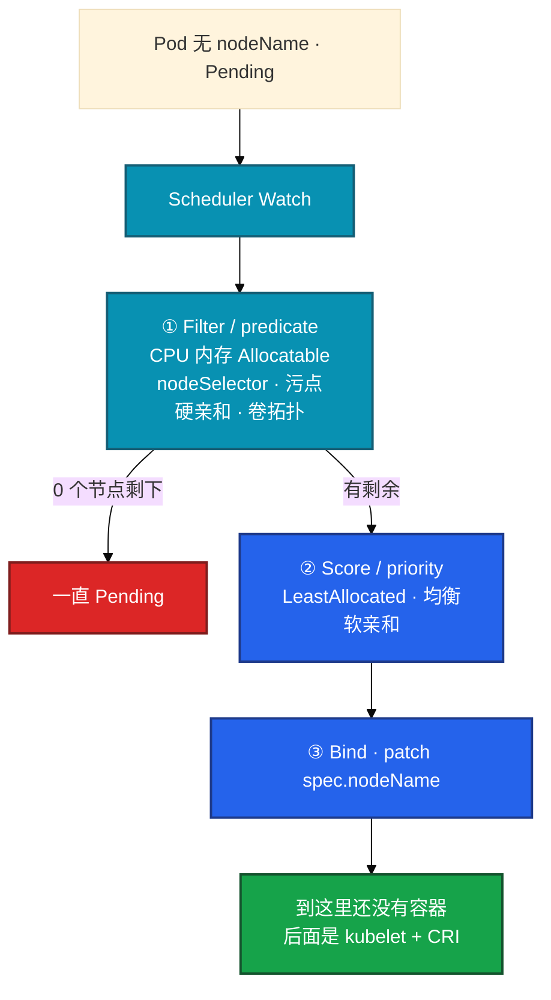
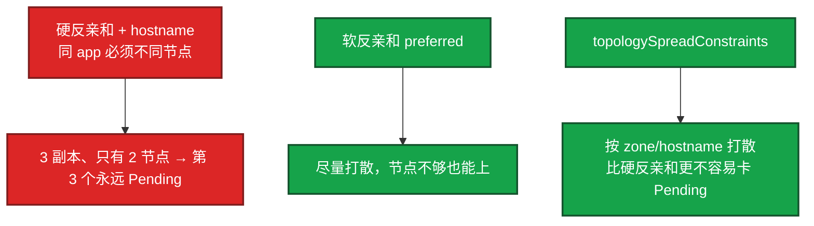
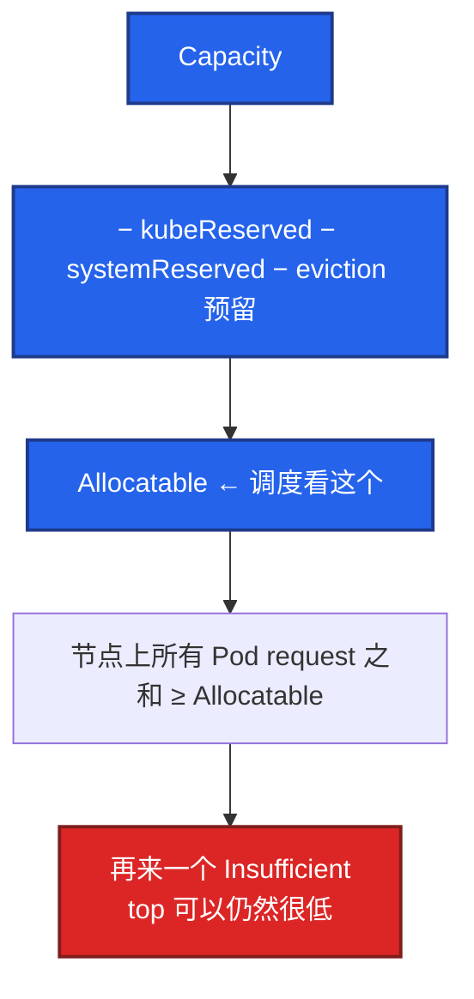
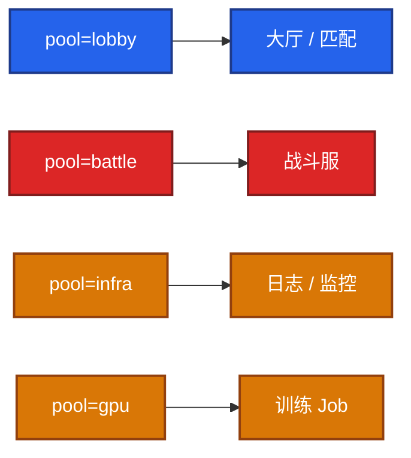
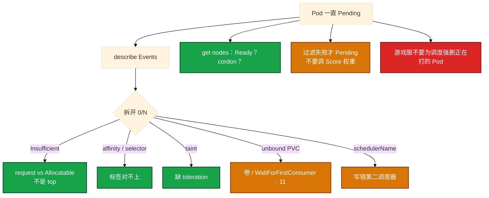

# 调度机制


Pod 一直 Pending。分不清是资源、污点、亲和还是卷。打散配成硬条件后副本永远上不去。大厅 HPA 一扩占满战斗机。先 Events，不要先改调度器源码。

**读完你能：** 过滤（predicate）失败才 Pending、打分（priority）只是选一个；硬反亲和要算节点数；污点拒人、容忍开门、NoExecute 才赶已有 Pod；独占池靠污点不靠口头约定。

**本章主线（Pending 就按这三步）：**

1. **两阶段**：Filter 为 0 才 Pending；Score 只是在剩余里选一个。
2. **Events**：Insufficient / taint / affinity / unbound PVC——按条拆，不要调 Score 权重。
3. **分池**：独占战斗服靠污点，不靠口头约定；改亲和只影响下一轮调度。

## 本章目录

- [1. 基本概念](#1-基本概念)
- [2. 架构图](#2-架构图)
- [3. 原理](#3-原理)
  - [3.1 Filter / Score](#31-filter-predicate--score-priority)
  - [3.2 亲和与 spread](#32-选择器亲和反亲和-spread)
  - [3.3 污点与容忍](#33-污点与容忍)
  - [3.4 request 记账](#34-request-记账limit-管运行时)
  - [3.5 优先级与抢占](#35-优先级与抢占)
  - [3.6 Descheduler](#36-descheduler)
- [4. 安装部署](#4-安装部署)
- [5. 核心配置](#5-核心配置)
- [6. 命令与操作](#6-命令与操作)
- [7. 生产排障](#7-生产排障)
- [8. 必会 · 常考](#8-必会--常考)
- [合上书](#合上书问自己)

**本章不讲：** 容器起不来、探针、QoS 细节 → [04](../04-Pod生命周期/)；PDB、drain 卡住 → [05](../05-工作负载控制器/)；HPA 顶满仍 Pending、CA → [07](../07-弹性伸缩/)；PVC / WaitForFirstConsumer → [11](../11-存储/)；节点 NotReady、NoExecute 驱逐展开 → [16](../16-节点运行时与升级/)。

---

## 1. 基本概念

你 apply 了大厅 Deployment，`replicas: 3`。其中一个 Pod 一直 Pending，`NODE` 列是空的。Scheduler 给 **没有 nodeName** 的 Pod 选节点，写下 `spec.nodeName`。**不管镜像拉没拉下来，不管探针过不过。** 调度成功 ≠ 容器起来。

两阶段名字要对上（面试会用旧名追问）：

| 现在常说 | 旧名 / 源码口吻 | 干什么 |
|----------|-----------------|--------|
| **Filter** | 预选 / **predicate** | 去掉不够的节点。0 个剩下 → **一直 Pending** |
| **Score** | 优选 / **priority** | 给剩下的打分。只选一个，**不会** Pending |
| **Bind** | — | patch `spec.nodeName`。到这里还没有容器 |

Scheduler 挂了：已有 Pod 不动，新的一直 Pending。流量还在（对齐 01）。

**Allocatable ≠ Capacity。** Scheduler 看的是 `Capacity − kubeReserved − systemReserved − eviction 预留`。节点 `top` 还空、但 Pending Insufficient，多半是 **request 之和** 把 Allocatable 吃满，不是瞬时 CPU 真满了。

> **记住**：过滤失败才 Pending；打分只是选一个；写上 nodeName 还不等于容器起来。kubelet + CRI 才拉镜像、起进程（04）。

---

## 2. 架构图

先把调度链钉住。后面亲和、污点、Pending 都对着这张图说话。



图上三条线：

1. **Filter 为 0 才 Pending。** Score 失败不会让你看不到节点——没有候选才写 `0/N nodes are available`。
2. **predicate 常见过滤：** 资源、污点、nodeSelector / 硬亲和、PVC 拓扑、cordon（SchedulingDisabled）。
3. **priority 常见打分：** 资源余量（LeastAllocated）、软亲和、topology spread 的软约束。不要去调 Score 权重来「修 Pending」。

生产 Pending 99% 不是要换调度器。`schedulerName` 指定第二调度器是加分项，写错了 Events 很直白却常被忽略。简历没写现场不必展开自定义调度器。

---

## 3. 原理

原理只保留动手和面试会用到的：两阶段、打散怎么配、污点三档、request 记账、抢占、再平衡。

**本节 6 块：** 3.1 Filter/Score · 3.2 亲和 · 3.3 污点 · 3.4 资源 · 3.5 抢占 · 3.6 Descheduler

### 3.1 Filter（predicate）与 Score（priority）

**Filter 去掉不够的节点，一个都不剩才 Pending；Score 只是在剩余里选一个。**

Filter 去掉不够的节点；一个都不剩就一直 Pending。Score 只在剩余节点里选一个，打分失败不会 Pending。Bind 只写 `spec.nodeName`。你眼睛看到的：`kubectl get po -o wide` 的 NODE 空；`describe` Events 写 `0/N nodes are available` 并拆开原因。卡住先 Events，不要先改 scheduler 源码，也不要去调 Score 权重。

生产调度器把 Filter / Score 做成插件。面试能对上旧名 **predicate / priority** 即可，不必背源码文件名。常见过滤（任一不过就去掉该节点）：

| 插件（predicate） | 卡住时 Events 像什么 |
|-------------------|----------------------|
| NodeResourcesFit | Insufficient cpu/memory |
| TaintToleration | had taint ... didn't tolerate |
| NodeAffinity / NodeSelector | didn't match node affinity / selector |
| VolumeBinding | unbound PersistentVolumeClaims；WaitForFirstConsumer 在等（11） |
| PodTopologySpread / 硬 anti-affinity | didn't match pod anti-affinity / spread |
| NodeUnschedulable | 节点已 cordon（SchedulingDisabled） |

常见打分（priority，只在剩余里选，不会单独让你 Pending）：LeastAllocated（余量多的优先）、BalancedAllocation、ImageLocality、软亲和 / 软 spread。把 Pending 当成「打分配错」去调权重，是错路。

多条件叠加时 Events 会写 `0/12 nodes are available: 8 Insufficient cpu, 4 node(s) had taint`，按条拆。过滤是 AND：每条都可能把某台节点去掉，最后空了就是 Pending。SchedulingGates 未摘掉时 Pod 也不会进调度队列，Events 会写 scheduling gated——少见，先确认是不是控制器忘了摘门。

谁把容器拉起来？kubelet + CRI。ContainerCreating 就不是调度的锅。

已 Running 的 Pod：改亲和/选择器只影响 **下一轮调度**；要搬家靠驱逐或滚动。这是 `IgnoredDuringExecution` 的字面意思。NoExecute 除外，它会赶已有的。游戏服不要为了「调度出去」强删正在打的 Pod。

### 3.2 放哪：选择器、亲和、反亲和、spread

**硬反亲和要算节点数；无状态优先 preferred 或 topologySpread。**

大厅要打散到不同节点。有人配了硬反亲和 `topologyKey: kubernetes.io/hostname`，3 副本只有 2 台机，第 3 个永远 Pending。开服扩副本时这个问题会再来一次。

**nodeSelector**：等值，如 `disktype: ssd`。简单，不够用就上 affinity。  
**nodeAffinity**：`requiredDuringSchedulingIgnoredDuringExecution` 硬限制；`preferredDuringSchedulingIgnoredDuringExecution` 软偏好。名字里 *IgnoredDuringExecution*：调度后再改节点标签，**不会**把已经跑着的 Pod 赶走（除非配合污点 NoExecute）。

**podAffinity / podAntiAffinity**：相对「已经在的 Pod」的标签。硬 anti-affinity 典型写法：

```yaml
affinity:
  podAntiAffinity:
    requiredDuringSchedulingIgnoredDuringExecution:
      - labelSelector:
          matchLabels: { app: hall }
        topologyKey: kubernetes.io/hostname
```

3 副本只有 2 台 Ready 节点时，第 3 个永远 Pending。改成 `preferredDuringSchedulingIgnoredDuringExecution`（带 `weight`）或 `topologySpreadConstraints`（`maxSkew: 1`，`whenUnsatisfiable: ScheduleAnyway`）才能在节点不够时仍调度上去。`whenUnsatisfiable: DoNotSchedule` 和硬反亲和一样会卡 Pending。



required 不满足，Filter 阶段候选为 0。preferred / spread 尽量满足，节点不够也能上。你眼睛看到的：两个 Running 一个 Pending；Events 写 didn't match pod anti-affinity。卡住把硬条件改成 preferred 或 spread，或保证节点数 ≥ 副本。`kubectl get pod -o wide` 看是不是全落在同一台——反亲和没生效时，单点宕机就是全区大厅没了。

硬反亲和在节点不够时会 **Pending**。生产无状态常用 preferred 或 spread，硬 anti-affinity 留给「必须不同节点」的双副本，并且保证节点数 ≥ 副本。spread 的 `maxSkew` 控制同一拓扑最多差几个；比「必须不同 hostname」宽松，开服扩副本时不容易把第 N 个卡死。无状态优先 spread。

> **记住**：硬反亲和要算节点数；无状态优先用 preferred 或 spread。

### 3.3 污点与容忍

**污点拒人、容忍开门；NoExecute 才会赶已经在跑的 Pod。**

战斗服用独占节点池。大厅 HPA 一扩，副本跑到战斗机上抢 CPU。口头约定「别往这调」没用，要靠污点。

Taint 在节点上拒人；Toleration 在 Pod 上开门。


| Effect | 新 Pod | 已有 Pod |
|--------|--------|----------|
| **NoSchedule** | 无容忍则不调度 | 不动 |
| **PreferNoSchedule** | 尽量不来 | 不动 |
| **NoExecute** | 不来 | **驱逐**无容忍者 |

NoSchedule 挡新 Pod，已有不动；PreferNoSchedule 尽量不来；NoExecute 不来且 **驱逐**无容忍者。你眼睛看到的：大厅新 Pod Pending，Events `had taint ... didn't tolerate`；`kubectl describe node | grep Taint` 能对上。卡住给对的负载加 toleration，或确认不该上的就不要加。

节点 NotReady 时控制面会打 NoExecute 类污点，不容忍的会被赶（16）。这和 drain（自愿、尊重 PDB）不是同一条路：NotReady 驱逐是控制面认为节点已经不能干活。游戏服被赶等于非自愿中断，PDB 挡不住 NotReady 那条。先救 kubelet（对齐 01）。DaemonSet 通常 `tolerations: Exists`。

cordon = SchedulingDisabled，Filter 阶段就去掉。已有 Pod 还在，直到 drain 或自己被删。只 cordon 不 drain，战斗服进程还在跑。

> **记住**：独占池靠污点，不靠口头约定；NoExecute 才会赶已经在跑的 Pod。

### 3.4 资源：request 记账，limit 管运行时

**Scheduler 用 request 减 Allocatable 记账，不看瞬时 top。**

大厅 YAML 里 request 写成 `cpu: 4`，节点 Allocatable 只剩 2 核，Pod Pending。`top` 看起来还很闲——Scheduler 不看 top。

```yaml
resources:
  requests: { cpu: "500m", memory: "512Mi" }  # 调度记账；HPA 利用率分母
  limits:   { cpu: "2",    memory: "1Gi" }    # CPU 超了 throttle；内存超了 OOM
```

Scheduler 拿 request 去减 Allocatable。limit 不参与调度。CPU 超 limit 只 throttle；内存超 limit 才 OOMKill（04）。你眼睛看到的：Events `Insufficient cpu`；`describe node | grep -A12 Allocatable` 比 `top` 有用。卡住降 request 或加节点，不要先改镜像。



| | request | limit |
|--|---------|-------|
| 调度 | 看这个 vs Allocatable | 不看 |
| CPU 超了 | — | throttle，不杀 |
| 内存超了 | — | OOMKill |
| 没写 request | 调度当 0，易超卖后 Evict | HPA 算不了利用率（07） |

核心服 Guaranteed（request=limit，见 04）。request 按实测 P95 留余量，不要拍脑袋 4C8G，也不要为了「能调度进去」写 0。记账的是 **request 之和**，不是瞬时 usage。大家都写 2C request、实际用 10%，Allocatable 仍满。治理：按实测调 request，或用 VPA 建议值。VPA 给建议可以，和生产 HPA 同时改规格要小心（07）。

加节点还是降 request？HPA 已经顶满、整池 Allocatable 不够 → 加节点 / CA。单个 Pod request 明显虚高 → 降 request。先分清是「这一个太大」还是「池子满了」。

> **记住**：调度看 request/Allocatable，不看 top；没写 request 等于调度当 0。

### 3.5 优先级与抢占

**低优先级 Pod 可被挤掉；战斗服不要标低优先级让出资源。**

批处理离线任务和战斗服混部。节点一紧，战斗服 Pending，批处理还占着。有人给战斗服标低优先级「让出资源」。

低优先级 Pod 可被挤掉给高优先级。生产少给在线业务开抢占。


抢占是自愿中断的亲戚：会删正在跑的 Pod。PDB 拦不拦取决于实现和策略，不要靠抢当容量规划。游戏逻辑服不要标成可杀。战斗服正常/高优先级，避免 Pending。

Pending 是不是该上第二调度器？先 Events。99% 是资源/污点/亲和/PVC。`schedulerName` 写错会 Pending，Events 很直白。

### 3.6 Descheduler：创建后再平衡，不是第二套 Scheduler

**Descheduler 是创建后再平衡，会驱逐运行中 Pod，战斗服不要进范围。**

扩了 10 台新节点，大厅还堆在老节点。默认 Scheduler **只在创建时调度一次**，之后不管。新加的节点空着、老节点满载，它不会自动迁已运行的 Pod。

Descheduler 是再平衡器：按策略驱逐已运行的 Pod，让 Scheduler 重新调度。手动或定时跑。


Descheduler 按 LowNodeUtilization / RemoveDuplicates / 违反反亲和等策略删 Pod，属于自愿中断，PDB 会拦。你眼睛看到的：老节点 Pod 被删、新节点上重建；drain 一样的 SIGTERM。卡住——战斗服进了范围——立刻把 namespace/label 剔出去。有状态 STS、游戏战斗服不要进范围。常见用法：配合 Cluster Autoscaler，新节点加入后跑一轮均衡。

单副本战斗服 minAvailable=1 时，Descheduler 也赶不走——这是保护。现场 Pending 先 Events，不是先上 Descheduler。

了解到：知道它解决什么、风险是什么即可，不必背每个参数。

> **记住**：Descheduler 会驱逐运行中 Pod；战斗服不要进范围，PDB 拦自愿中断。

---

## 4. 安装部署

kube-scheduler 是控制面静态 Pod（01）。多副本必须 leader-elect。业务侧「部署」是节点标签、污点和亲和约定。

| 场景 | 做法 |
|------|------|
| 网关高可用 | preferred 反亲和或 spread 打散节点/AZ；硬反亲和要算节点数 |
| 逻辑服绑节点盘 | nodeAffinity + 本地卷拓扑；或 STS + WaitForFirstConsumer |
| GPU / 独占机 | 污点 + 容忍，避免 Web 作业占满 |
| 控制面 | 默认污点，业务不要容忍上去 |
| 资源 | 核心服 Guaranteed；request 按实测 P95 留余量 |
| 大厅 / 战斗 / GPU | 分池靠污点和标签，HPA 扩大厅不会占战斗机 |
| 批处理混部 | 低 PriorityClass；战斗服不要标低优先级 |



标签少而稳：`pool=lobby|battle|infra`，`zone=az-a|az-b|az-c`。不要为每个活动发明一套新标签。

绑死的代价：没有同类节点就 Pending，开服预案要算机型库存。本地盘还要卷拓扑（WaitForFirstConsumer，11）。PVC WaitForFirstConsumer 会先等 Pod 调度，看起来像互相等，要看 StorageClass 的 bindingMode。

---

## 5. 核心配置

| 项 | 生产怎么用 | 改错会怎样 |
|----|------------|------------|
| 硬 anti-affinity + hostname | 仅双副本且节点数 ≥ 副本 | 第 N 个永远 Pending |
| preferred / spread | 无状态打散首选 | 没打散 → 单点宕机全区大厅没了 |
| Taint NoSchedule | 独占池 | 口头约定挡不住 HPA |
| NoExecute | 明白会赶已有 Pod | 误打会把战斗服赶走 |
| 业务容忍控制面污点 | **不要** | 业务上到 master |
| CNI / kube-proxy 容忍 | `Exists` | 节点没网络 |
| request | 实测 P95 | 写 0 超卖；写太大 Insufficient |
| PriorityClass | 批处理低；战斗服不要低 | 节点紧先杀对局 |
| schedulerName | 默认空 | 写错第二调度器 → Pending |
| Descheduler 范围 | 排除 STS / 战斗服 | 再平衡等于踢玩家 |

> **记住**：大厅/战斗/GPU 分池靠污点和标签；改亲和只影响下一轮，别为了调度去杀对局。

---

## 6. 命令与操作

```bash
kubectl describe pod <p>                              # Events 第一现场
kubectl describe node <n> | grep -A12 Allocatable     # 不是看 top
kubectl describe node <n> | grep Taint
kubectl get nodes --show-labels
kubectl get nodes                                     # Ready？SchedulingDisabled？
kubectl get pod -o wide                               # 是不是全堆同一台
```

| Events | 原因 |
|--------|------|
| Insufficient cpu/memory | request 太大或节点被占满（看 Allocatable，不是 top） |
| didn't match node affinity / selector | 标签对不上 |
| had taint ... didn't tolerate | 缺 toleration |
| unbound PersistentVolumeClaims | 卷没绑，或 WaitForFirstConsumer 在等调度（11） |
| 0/N nodes are available | 把上面几条叠在一起，Events 会拆开写 |
| schedulerName 不存在 | 写错了第二调度器，Events 很直白却常被忽略 |

节点 SchedulingDisabled（已 cordon）也不会接新 Pod。值班把 `describe` Events 当第一现场，不要先 `kubectl top`。`0/N nodes are available` 后面的分号是清单，按条对表，不要把整句当成「调度器坏了」。

资源类 Insufficient 先看 Allocatable 和 request 之和：这一个 Pod 虚高就降 request；整池被 HPA 顶满就加节点 / CA（07）。亲和 / 污点改完，已 Running 的不会搬家——那是下一轮的事。

---

游戏逻辑服要绑特定机型：节点标签 + required nodeAffinity，或专用污点 + 容忍。大厅 `pool=lobby`，进不去战斗池。绑死之后扩容必须有同类节点，否则 Pending。开服预案要按机型库存算副本上限，不要假设 Scheduler 会「匀到别的池」。

已经 Running 的战斗服，改 affinity **不会**迁走。要搬家靠驱逐或滚动——对局里等于踢人，先停匹配（04、05）。Descheduler 若把战斗服 label 划进 LowNodeUtilization，等于定时踢玩家；范围必须排除。

drain 卡住先看 PDB（05）。只 cordon 不 drain，新 Pod 不来，旧战斗服还在跑。NotReady 打上的 NoExecute 和 drain 不是一条路：前者 PDB 挡不住，先救 kubelet。

污点操作备忘：`kubectl taint nodes <n> pool=battle:NoSchedule`；去掉用 `pool=battle:NoSchedule-`。PreferNoSchedule 挡不住资源紧时的「挤进来」，独占池用 NoSchedule。

GPU 节点同样：`nvidia.com/gpu=:NoSchedule`，只有带对应 toleration 的训练/推理 Job 能上。Web 大厅不要容忍这条。控制面默认污点业务不要加 `Exists`——那是 CNI / kube-proxy 的特权。业务容忍上去等于把 API 机器当 Worker 用。

`topologySpreadConstraints` 比硬 anti-affinity 更适合开服扩副本：`maxSkew` 允许同一 AZ 多几个，`ScheduleAnyway` 在节点不够时仍能上。硬条件留给「必须不同节点」的双活，并且保证节点数 ≥ 副本。

---

## 7. 生产排障



1. `describe pod` Events，对上表分类。  
2. `get nodes` 是否 Ready、是否 cordon。  
3. 资源：降 request 或加节点（HPA 顶满要 CA，见 07）。  
4. 亲和/污点：改的是下一轮调度。  
5. 过滤失败才 Pending；不要去调 Score 权重。  
6. 游戏服不要为了调度强删正在打的 Pod。

现场 Pending 先 Events，不是先上 Descheduler，也不是先换调度器。

---

## 8. 必会 · 常考

白板和追问高频，能一口回：

| 说法 | 对错 | 口径 |
|------|:----:|------|
| Score 失败会 Pending | 错 | 只有 Filter 为 0 才 Pending |
| 调度成功就是容器起来了 | 错 | 只写 nodeName；kubelet 才起进程 |
| Scheduler 挂了已有 Pod 会停 | 错 | 已有继续跑；新的 Pending |
| 硬反亲和节点不够也能上 | 错 | 第 N 个永远 Pending |
| 改了亲和，老 Pod 会搬家 | 错 | IgnoredDuringExecution；要驱逐或滚动 |
| 口头约定能挡住 HPA 占战斗机 | 错 | 靠污点 |
| NoSchedule 会赶走已有 Pod | 错 | 只有 NoExecute 赶已有 |
| 调度看瞬时 top | 错 | request 之和 vs Allocatable |
| 没写 request 没关系 | 错 | 调度当 0，易超卖；HPA unknown |
| 战斗服标低优先级让出资源 | 错 | 节点紧先杀对局 |
| Pending 先换调度器 / 调 Score | 错 | 先 Events |
| Descheduler 是第二套 Scheduler | 错 | 再平衡器，会驱逐运行中 Pod |
| PDB 挡不住 Descheduler | 错 | 都是自愿中断 |
| 用 Deploy 副本数=节点数打散 | 错 | 那是 DS / spread 的事 |
| cordon 会杀掉已有战斗服 | 错 | 只是不接新 Pod |

数字：无状态硬 anti-affinity 要 **节点数 ≥ 副本**；Allocatable = Capacity − 预留。

易混：Filter/predicate vs Score/priority；required vs preferred；NoSchedule vs NoExecute；request vs limit vs top；drain（自愿、PDB）vs NotReady NoExecute（非自愿）；Scheduler 创建时一次 vs Descheduler 再平衡。

---

## 合上书，问自己

1. 调度两阶段？哪个导致 Pending？谁把容器拉起来？Scheduler 挂了已有 Pod 怎样？
2. required 和 preferred 差在哪？硬反亲和 3 副本 2 节点会怎样？
3. 污点三档？独占战斗服池怎么做？改标签已 Running 的会搬家吗？
4. 为什么 top 很低还 Insufficient？Allocatable 是什么？
5. 游戏逻辑服要绑机型怎么做？能不能标低优先级？
6. Descheduler 和 Scheduler 差在哪？会赶走战斗服吗？PDB 拦不拦？

六题都能口述，这一章就过了。下一章把弹性剖开：HPA 解决不了有状态游戏服什么问题。
