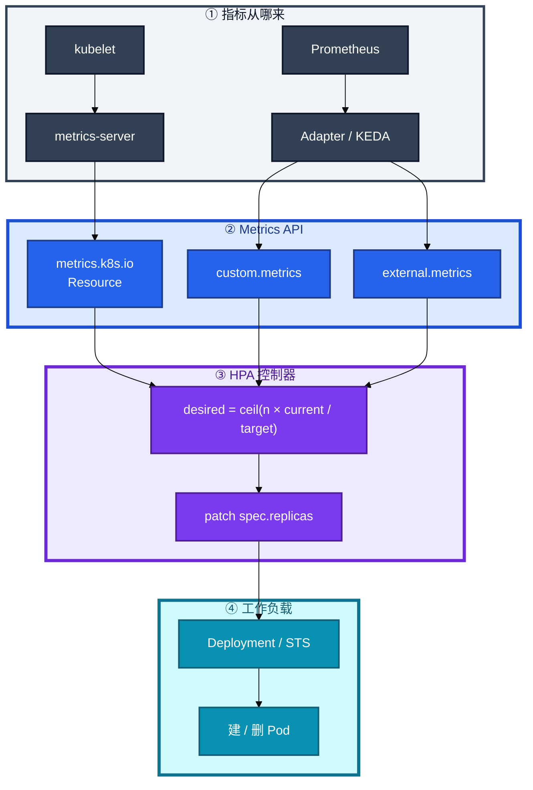
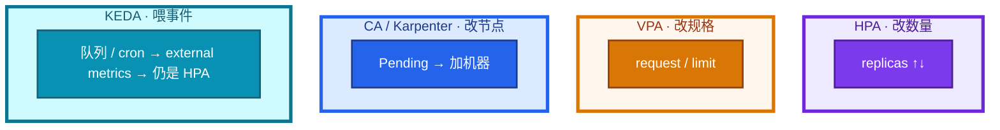
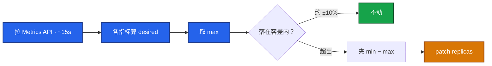
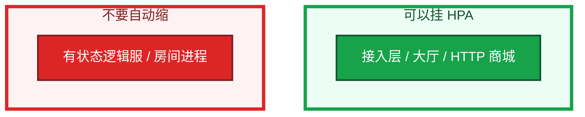
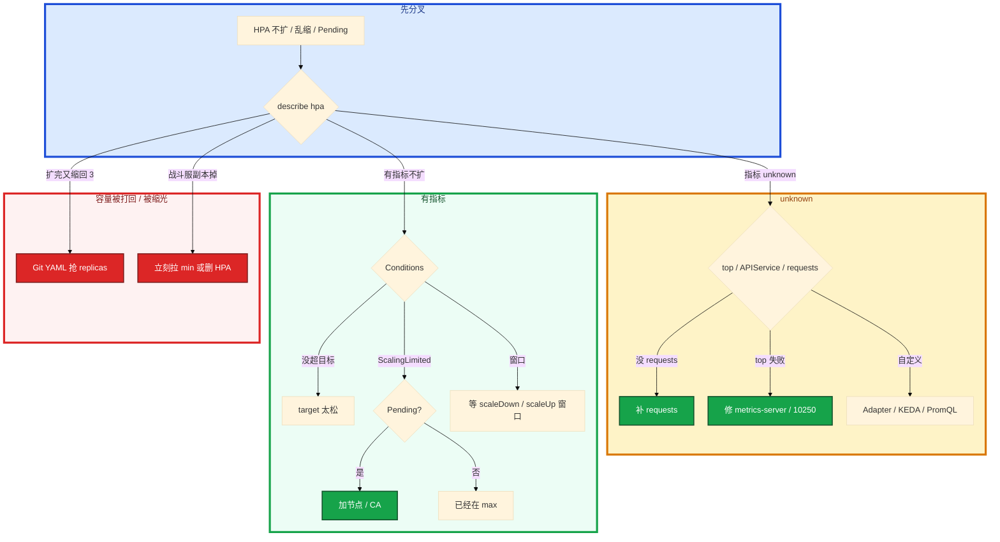

# 弹性伸缩


活动高峰，大厅 CPU 90%，HPA 指标却是 `<unknown>`。群里有人要把 max 加大，另有人给战斗服也挂了一个 70% CPU 的 HPA。低峰一缩，正在打仗的进程被删。

先别动手。这一章后半全是你会动手的：**怎么看 Conditions、怎么提 min、怎么止血被缩光的战斗服、Git 抢 replicas 怎么补。** 前面的公式和指标，是为了让你动手时不选错 Scaler。

**读完你能：** 白板上写出 desired 公式；HPA unknown 能判断缺 requests 还是 metrics-server；会配扩快缩慢、开服预案、KEDA 喂队列；战斗服知道为什么不能自动缩。

**本章主线（HPA 就按这三步）：**

1. **公式**：`ceil(n × current / target)`；多指标各算一遍取 max；分母是 request。
2. **unknown**：先 top / APIService / requests，不要先加大 max。
3. **战斗服**：不要挂自动缩；被缩光立刻拉 min 或删 HPA。

## 本章目录

- [1. 基本概念](#1-基本概念)
- [2. 架构图](#2-架构图)
- [3. 原理](#3-原理)
  - [3.1 公式](#31-公式多指标容差)
  - [3.2 指标](#32-三类指标cpu-不是万能)
  - [3.3 behavior](#33-behavior扩快缩慢)
  - [3.4 HPA / VPA / CA / KEDA](#34-hpa--vpa--ca--keda-各改什么)
  - [3.5 战斗服](#35-hpa-解决不了有状态游戏服什么)
  - [3.6 replicas 抢字段](#36-replicas-和-yaml-会抢)
- [4. 安装部署](#4-安装部署)
  - [4.1 metrics-server](#41-metrics-server-是资源-hpa-的前提)
  - [4.2 Adapter / KEDA / CA](#42-adapter--keda--ca)
- [5. 核心配置](#5-核心配置)
- [6. 命令与操作](#6-命令与操作)
- [7. 生产排障](#7-生产排障)
- [8. 必会 · 常考](#8-必会--常考)
- [合上书](#合上书问自己)

**本章不讲：** 探针、删 Pod、grace → [04 Pod 生命周期](../04-Pod生命周期/)；控制器改副本、PDB 数字 → [05 工作负载](../05-工作负载控制器/)；Pending / Allocatable → [06 调度](../06-调度机制/)；APIService 细节 → [03 API Server](../03-API-Server/)；卷跟不跟节点走 → [11 存储](../11-存储/)；声明式补 Git → [01 集群架构](../01-集群架构/)。

---

## 1. 基本概念

HPA（Horizontal Pod Autoscaler）读指标、算副本、**patch 工作负载的 `spec.replicas`**。它假设副本可互换、杀谁都行、状态在外面。必须有 **`resources.requests`**，利用率分母才不是零。

它不是 Scheduler，也不加 Node。扩出来的 Pod 仍走 04 的创建、06 的调度；缩容 = 控制器删 Pod，走 04 的 SIGTERM。

| 在 HPA 里 | 不在 HPA 里 |
|-----------|-------------|
| 改 Deployment / STS / 部分 CR 的 replicas | 改 request/limit（那是 VPA） |
| 读 Metrics API，约每 15s 同步一次 | 加云主机（那是 CA / Karpenter） |
| 夹在 minReplicas ~ maxReplicas | 迁玩家、认房间、保对局 |

三个角色不要混：

| 角色 | 干什么 |
|------|--------|
| **HPA** | 算副本并 patch replicas |
| **工作负载控制器** | 按 replicas 建/删 Pod（05） |
| **metrics-server / Adapter / KEDA** | 把指标登记成 Metrics API，HPA 只消费 |

例：3 副本，CPU 90%，目标 60% → `ceil(3×90/60)=5`。

> **记住**：HPA 只改 replicas。没 requests 就算不了利用率。顶满仍 Pending 是节点不够，不是再调 HPA。战斗服默认不要挂自动缩。

---

## 2. 架构图

先把整张图钉住。后面安装、命令、排障都对着这张图说话。



图上三条线：

1. **HPA 不直连 kubelet。** 资源指标走 metrics-server；自定义 / 外部走 Adapter 或 KEDA。
2. **公式不变。** KEDA 只换 current 从哪来，不换 `ceil(n × current / target)`。
3. **真正删进程的是控制器。** PDB 拦 drain，**拦不住 HPA 改 replicas**。

三种「看起来都叫弹性」不要装进同一个开关：



生产主流：**HPA + 人手调 request**。VPA 和 HPA 同时盯 CPU 容易打架。节点不够是 CA，不是再调 max。

---

## 3. 原理

原理只保留动手和面试会用到的：公式怎么算、指标从哪来、为什么扩快缩慢、四套弹性各改什么、战斗服为什么不能自动缩、Git 为什么会把容量打回去。

**本节 6 块：** 3.1 公式 · 3.2 指标 · 3.3 behavior · 3.4 四套弹性 · 3.5 战斗服 · 3.6 抢字段

### 3.1 公式：多指标、容差

**desired = ceil(当前副本 × 当前指标 / 目标)；多指标各算一遍取 max。**



```
desired = ceil(当前副本 × 当前值 / 目标值)
```

多指标：各算一遍，**取 max**（保证所有指标都不超目标）。落在容差内（默认约 **10%**）不动，防抖。夹在 `minReplicas` ~ `maxReplicas`。

你眼睛看到的：`kubectl describe hpa hall` 里 current/target、Conditions：`AbleToScale` / `ScalingActive` / `ScalingLimited`（顶到 min/max）。指标 `<unknown>` = metrics-server 或 Adapter 挂了，或没 requests。

> **记住**：CPU 70% 和 QPS 哪个说了算？谁算出的副本多听谁。这是「取 max」，不是两个 HPA 打架。

### 3.2 三类指标：CPU 不是万能

**资源 HPA 分母是 request；没写 requests 就会 unknown。**

网关 CPU 只有 20%，连接已经满了。只看 CPU 的 HPA 还在缩容。长连接、等后端时 CPU 不高，连接已满，只看 CPU 会误缩。游戏大厅用排队人数 / 登录 QPS，比 CPU 贴。

| 类型 | API | 来源 |
|------|-----|------|
| Resource | `metrics.k8s.io` | metrics-server ← kubelet |
| Pods / Object | `custom.metrics.k8s.io` | Prometheus Adapter |
| External | `external.metrics.k8s.io` | 集群外（队列深度）、KEDA |

metrics-server 挂了：`kubectl top` 失败、HPA unknown，**业务对象仍可读写**，别说成 API 挂了。自建集群 metrics-server 常缺 kubelet **10250** 证书，`top` 和资源 HPA 一起哑火时先看 APIService。

不要让 Adapter 高基数指标把 API 打爆（03）。自定义指标公式不变，只是 current 来自另一条 API。

> **记住**：没 `top` 就别指望资源 HPA；网关更常看 QPS / 连接 / 排队，不要只看 CPU。

### 3.3 behavior：扩快缩慢

**扩快缩慢：scaleDown 窗口要长，给 IPVS 摘流时间。**

开服当天进服 1 分钟，HPA 还在 15s 环里算。镜像没拉完、调度没绑上，玩家已经堵在登录。提前把 min 拉到预期峰值的 **1.2–1.5 倍**，**不要等 HPA 在进服瞬间再扩**。活动后再降 min。

```yaml
behavior:
  scaleUp:
    stabilizationWindowSeconds: 0    # 要扩立刻扩
    policies:
    - { type: Percent, value: 100, periodSeconds: 60 }
    selectPolicy: Max
  scaleDown:
    stabilizationWindowSeconds: 300  # 窗口内取最保守
    policies:
    - { type: Percent, value: 10, periodSeconds: 60 }
```

流量来要立刻有容量；刚缩完又来一波会雪崩。缩得太快，IPVS 还没摘干净就会 502（04、08）——慢缩也是为这个，不只是费用。HPA 减副本仍走优雅退出：readiness 摘流、preStop、grace（04）。

只靠 15s 环在进服 1 分钟内补齐镜像 + 调度，一定迟到。

> **记住**：扩快缩慢；开服靠预案提 min，不靠瞬时 15s 环。

### 3.4 HPA / VPA / CA / KEDA 各改什么

**HPA 改副本、VPA 改规格、CA 加节点、KEDA 只喂外部指标。**

| 组件 | 改什么 | 触发 | 生产怎么用 |
|------|--------|------|------------|
| **HPA** | replicas | 指标超目标 | 无状态大厅 / 网关 / HTTP 商城 |
| **VPA** | request / limit | 用量推荐 | 和 HPA 同时盯 CPU 易振荡；主流是 HPA + 人手调 request |
| **CA** | Node | Pod Pending | 扩到 max 仍 Insufficient cpu 时才上 |
| **Karpenter** | Node（动态机型） | Pending | AWS 原生、跳过 ASG；阿里云为主用 CA |
| **KEDA** | 不换公式 | Kafka lag / Redis 长度 / cron / 排队 | 创建并管理 HPA；可 scale to 0 |

VPA 三件套：Recommender 算、Updater 驱逐、Admission 注入。模式 `Off` 只推荐、`Initial` 只在创建时写、`Auto` / `Recreate` 会为了改规格而删 Pod。HPA 用 CPU 利用率，分母是 request；VPA 一改 request，利用率跟着跳，两边对着抖。

KEDA：你管 ScaledObject，它创建 HPA，把 50+ 种事件源变成 `external.metrics`。原生 HPA min 通常不从 0 起；KEDA 支持 **scale to 0**。无状态 Web 按 CPU：普通 HPA 够用。消费队列、定时开服预热、匹配 worker 按排队：KEDA 更贴。


Cluster Autoscaler：看到 Pending，找能放下的节点组，触发云 ASG，链路分钟级。卡住——ASG 配额、机型、污点对不上——不是再调 HPA max。有状态 + 本地盘，新节点来了旧盘过不去，CA 解决不了绑盘（11）。

> **记住**：KEDA 喂指标不换公式，也解决不了内存对局。扩到 max 仍 Pending → 加节点 / CA。

### 3.5 HPA 解决不了有状态游戏服什么

**HPA 假设副本可杀可换；有状态战斗服缩容即踢人。**

HPA 假设：**副本可互换、杀谁都行、状态在外面。** 战斗 / 房间进程不满足。



| HPA 能做 | 对战斗 / 房间服做不到 |
|----------|----------------------|
| 按 CPU 加副本 | 新副本不会自动分走已有房间 |
| 按 CPU 减副本 | **随机杀 Pod** = 踢正在打的玩家 |
| 扩到 max | 玩家在内存里，扩出去的空进程接不到旧会话 |
| 和 PDB 一起缩 | PDB 只拦 drain 类自愿中断；HPA 直接改 replicas |

所以：

1. **接入层、大厅、HTTP 商城**：HPA 合理。指标用 QPS / CPU，缩容要慢，配 PDB。
2. **有状态逻辑服**：不要 HPA 自动缩。扩也是「新开进程接新房间」，匹配服务要认识新实例。
3. 活动高峰：先扩无状态和 DB 连接，逻辑服按 CCU 预案加实例。
4. 需要弹性时：自定义控制器按「空房间 = 0 才缩」，或把状态外置后再谈 HPA。KEDA 一样解决不了——缩容仍是删 Pod，不要 scale to 0 把还在打仗的进程收掉。

被缩光：**立刻把 HPA min 拉回或删 HPA**，停匹配，当故障广播。不要再等算法「自己回来」。扩回来的新副本也接不回旧玩家。

> **记住**：HPA 假设副本可杀可换；有状态游戏服缩容即踢人。PDB 不能当禁止 HPA 缩战斗服的开关。

### 3.6 replicas 和 YAML 会抢

**HPA 和 Git YAML 抢同一个 replicas 字段。**

声明式告诉系统「要什么」。HPA 改的也是同一份期望里的 `replicas`。Git 里的 YAML 如果写死了旧值，下次 apply 会对齐回去。

活动中 HPA 把大厅从 3 扩到 20。有人拿 Git 里那份 `replicas: 3` 再 apply，容量当场被打回去。


YAML 不把 replicas 当唯一真相，或用 SSA / 明确忽略该字段，让 HPA 当这个字段的 FieldManager。应急 `kubectl scale` 可以，**当天补回 Git**（01）。PDB 挡不住这次打回——apply / HPA 改字段不是自愿中断。

> **记住**：HPA 和 YAML 会抢 replicas；应急 scale 当天补 Git。

---

## 4. 安装部署

### 4.1 metrics-server 是资源 HPA 的前提

自建集群要单独装 metrics-server。托管 ACK / EKS 通常已有，仍要验收 `kubectl top` 和 APIService。

| 项 | 选 | 不选 |
|----|----|------|
| 资源 HPA | metrics-server + 每容器 requests | 没 top 就挂 CPU HPA |
| kubelet | 10250 证书让 metrics-server 拉到 | 证书错了还先重启 API Server |
| 副本 | metrics-server 自己也要 HA | 单副本当「指标没了就是控制面挂了」 |

验收：`kubectl get apiservice v1beta1.metrics.k8s.io` 为 True，且 `kubectl top nodes` / `top pods` 出数。进程在不算数。

### 4.2 Adapter / KEDA / CA

| 组件 | 何时装 | 验收 |
|------|--------|------|
| Prometheus Adapter | 要用 QPS / 连接等 custom metrics | HPA 能读到 custom.metrics，且不要高基数打 API |
| KEDA | 队列 / cron / 排队人数 | ScaledObject Ready，底下仍能 `get hpa` |
| Cluster Autoscaler | HPA 经常顶满仍 Pending | Pending 后节点组会加机器；配额和机型对得上 |
| Karpenter | AWS 环境替代 CA | 按 Pod 需求出节点；不是阿里云默认方案 |

不要业务 Worker 上顺手跑 metrics-server。Adapter 的 PromQL 对不上 = HPA unknown，不是公式坏了。

---

## 5. 核心配置

只动有证据的项。HPA min 还得 **≥ PDB minAvailable**，否则 drain 永远赶不走（05）。生产无状态 **min≥2**，min=1 还开 HPA 缩 = 一次抖动就单副本。

| 参数 | 默认 / 常见 | 生产怎么用 | 改错会怎样 |
|------|-------------|------------|------------|
| `minReplicas` | 1 | 无状态 ≥2，且 ≥ PDB minAvailable | 生产 min=1 裸奔；和 PDB 打架 |
| `maxReplicas` | 无上限等于事故 | 有容量规划和告警 | 打满节点 / 打满下游 |
| `targetCPUUtilizationPercentage` 或 v2 metric | 常 60～70 | 网关不要只 CPU | 长连接误缩 |
| 容差 | 约 10% | 狂抖就提高 target 或加长窗口 | 来回扩缩 |
| `scaleUp` 窗口 | 要扩立刻扩 | 开服再叠加提 min | 进服瞬间来不及 |
| `scaleDown` 窗口 | **≥300s**，比例小 | 防雪崩、给 IPVS 摘流 | 腰斩 → 502 |
| requests | 必写，接近真实 | 利用率分母 | 写 1m 骗调度，HPA 乱跳 |
| VPA 模式 | 生产慎 Auto | 与 HPA 分场景 | 规格和副本一起抖 |
| KEDA `minReplicaCount` | 可 0 | 战斗服不要 0 | 收掉还在打仗的进程 |

```yaml
apiVersion: autoscaling/v2
kind: HorizontalPodAutoscaler
spec:
  scaleTargetRef:
    apiVersion: apps/v1
    kind: Deployment
    name: hall
  minReplicas: 4
  maxReplicas: 40
  metrics:
  - type: Resource
    resource:
      name: cpu
      target: { type: Utilization, averageUtilization: 60 }
```

> **记住**：无状态 min≥2 且和 PDB 兼容；战斗服的开关是「不要挂 HPA」，不是指望 PDB。

---

## 6. 命令与操作

值班先跑这几条：

```bash
kubectl get hpa -A
kubectl describe hpa <name>                    # Conditions + 当前/目标
kubectl get apiservice v1beta1.metrics.k8s.io  # metrics-server 在不在
kubectl top pods -n <ns>                       # 没 top 就别指望资源 HPA
kubectl get --raw /apis/metrics.k8s.io/v1beta1/nodes | head
```

| 目的 | 命令 | 看什么 |
|------|------|--------|
| HPA 状态 | `describe hpa` | unknown、AbleToScale / ScalingActive / ScalingLimited |
| 资源指标 | `kubectl top pods` | 没数 = 资源 HPA 算不了 |
| APIService | `get apiservice v1beta1.metrics.k8s.io` | True 才算装上 |
| 自定义指标 | `kubectl get --raw /apis/custom.metrics.k8s.io/v1beta1` | Adapter 登没登上 |
| 外部指标 | `kubectl get --raw /apis/external.metrics.k8s.io/v1beta1` | KEDA / Adapter |
| 工作负载 | `get deploy -o wide` | replicas 是否被 Git 打回 |
| KEDA | `get scaledobject -A` | 底下仍应有对应 HPA |
| 应急扩 | `kubectl scale deploy/hall --replicas=20` | 当天补 Git |

指标（Prometheus，常见 kube-state + metrics-server）：

| 信号 | 阈值 / 现象 | 级别 |
|------|-------------|------|
| HPA `ScalingLimited` 顶 max 且 Pending | 节点不够 | P1 |
| 指标 `<unknown>` | metrics-server / Adapter / 没 requests | P1 |
| 战斗服 replicas 非预期下降 | 错误 HPA 在缩 | **P0** |
| 副本狂抖 | target 太紧或窗口太短 | P2 |

---

### 开服提 min

不要让 15s 环在进服瞬间猜。

1. 按预案把大厅 / 网关 `minReplicas` 提到峰值 1.2–1.5 倍。
2. 确认镜像已预热、节点够、PDB 兼容。
3. 进服后再观察 HPA 是否还要往上加。
4. 活动结束后降 min，避免长期高成本。

### 应急 scale，当天补 Git

```bash
kubectl scale deploy/hall --replicas=20
# 当天：YAML 去掉写死的 replicas，或改成 20，或 SSA 让 HPA 管该字段
```

不补的后果：下次发布把热修覆盖掉，或把 HPA 扩出来的容量打回去。

### 战斗服被缩光


不要等 15s 环，也不要重启还活着的进程（对齐 01 / 02：已运行长连接优先保住）。能救的是还没被删的服，以及靠断线重连 / 状态落库的研发能力。运维不能假设「扩回来就恢复」。

### 修 unknown

max 再大，unknown 也不会扩。

1. 没写 requests → 补，分母才不是零。
2. `top` 失败 → metrics-server / kubelet 10250 证书。
3. 自定义指标 → Adapter PromQL / KEDA Scaler。
4. 有指标但不扩 → 没超目标、已 Limited、稳定窗口还没到。

---

## 7. 生产排障

和 01 同一套三问：进程还在不在？还能不能变更？已有流量还通不通？错误的自动缩是在主动拆进程，先停错误动作。



现场顺序：

```bash
kubectl describe hpa <name>
kubectl get apiservice v1beta1.metrics.k8s.io
kubectl top pods -n <ns>
kubectl get deploy <name> -o jsonpath='{.spec.replicas}{"\n"}'
```

| 现象 | 先做什么 | 不要做什么 |
|------|----------|------------|
| FailedGetResourceMetric / unknown | 修 metrics-server；补 requests | 先把 max 加大 |
| 不扩 | describe Conditions；target / Limited / 窗口 | 先重启 API Server |
| 狂抖 | 提高 target，加长 scaleDown 窗口 | 同时开 VPA Auto |
| 扩到 max 仍 Pending | 加节点 / 开 CA | 再调 HPA max |
| 扩容完又缩回去 | 停那次 apply；YAML 别抢 replicas | 以为 PDB 能挡住 apply |
| 战斗服被缩光 | **立刻 min 拉回或删 HPA**，停匹配 | 等算法、重启还活着的进程 |
| 网关不扩、CPU 很低 | 换 QPS / 连接 / 排队 | 继续降 CPU 目标 |

自建集群 metrics-server 常缺 kubelet 证书。target 太宽松也会「看起来坏了其实没到线」。

---

## 8. 必会 · 常考

白板和追问高频，能一口回：

| 说法 | 对错 | 口径 |
|------|:----:|------|
| HPA 改的是 request | 错 | 只改 replicas |
| 没写 requests 也能算 CPU 利用率 | 错 | 分母是 request |
| 多指标取平均 | 错 | 各算一遍取 **max** |
| 开服可以等 15s 环自动补齐 | 错 | 预案提 min 1.2–1.5 倍 |
| 战斗服挂 CPU HPA 低峰自动缩 | 错 | 缩容即踢人 |
| PDB 能禁止 HPA 缩战斗服 | 错 | PDB 拦 drain，不拦改 replicas |
| KEDA 换了一套公式 | 错 | 只喂 external metrics |
| KEDA scale to 0 可以收战斗服 | 错 | 仍是删 Pod |
| 扩到 max 仍 Pending 再加大 max | 错 | 加节点 / CA |
| VPA + HPA 同时盯 CPU 更稳 | 错 | 规格和副本对着抖 |
| Git 写死 replicas: 3 没关系 | 错 | apply 会把扩容打回去 |
| metrics-server 挂了 = API 挂了 | 错 | 业务对象仍可读写 |
| Karpenter 是阿里云默认 | 错 | AWS 原生；阿里云为主用 CA |
| 应急 scale 不用补 Git | 错 | 当天补，否则下次覆盖 |

数字：同步约 **15s**；容差约 **10%**；开服 min **1.2–1.5×** 峰值；scaleDown 窗口常见 **300s**；无状态 min **≥2**；公式 `ceil(n × current / target)`。

易混：unknown vs 没超目标；HPA 顶满 vs 节点不够；PDB vs HPA；CA vs HPA；KEDA vs 换公式；VPA vs HPA；Git apply vs 自愿中断。

---

## 合上书，问自己

1. desired 公式怎么写？多指标听谁的？为什么必须有 requests？
2. 资源 / 自定义 / 外部指标各走哪条 API？unknown 先看谁？
3. 为什么扩快缩慢？开服为什么不能等 15s 环？
4. HPA / VPA / CA / KEDA 各改什么？为什么不要一起盯 CPU？
5. 战斗服能不能自动缩？PDB 挡得住吗？被缩光第一刀？
6. HPA 扩到 20，流水线再 apply `replicas: 3` 会怎样？

六题都能口述，这一章就过了。下一章把 Service 和 kube-proxy 剖开：VIP 怎么转到 Pod，proxy 挂了长连接还在不在。
