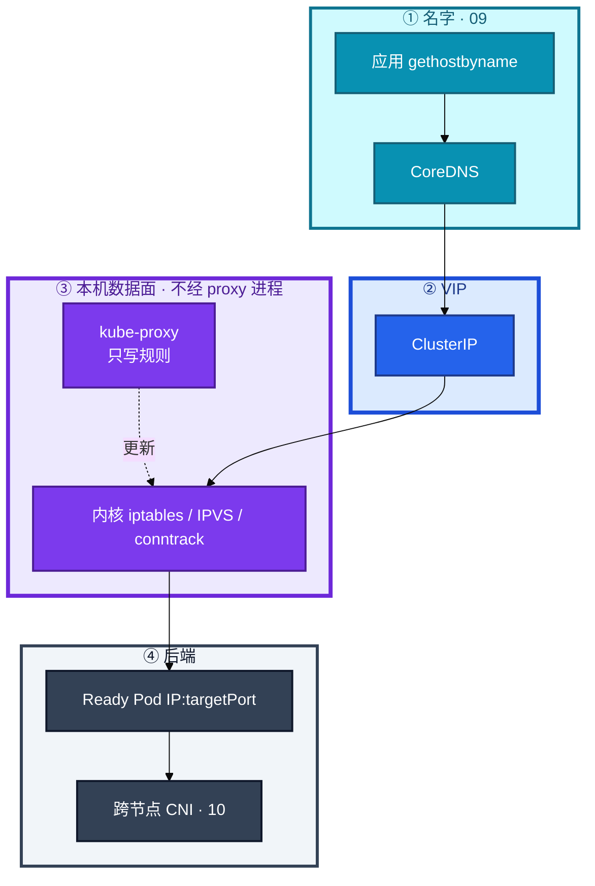
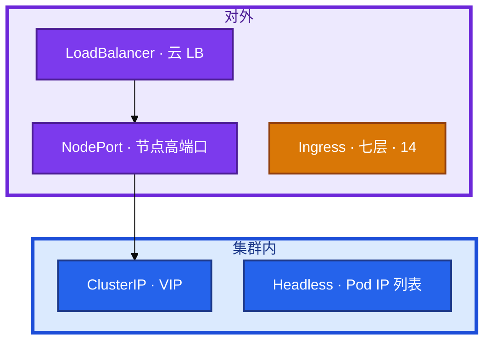
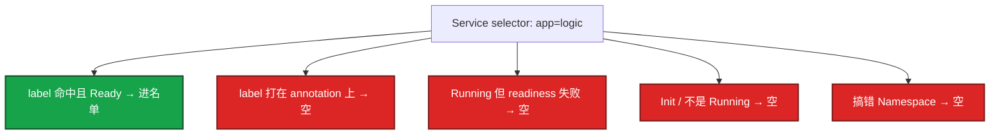
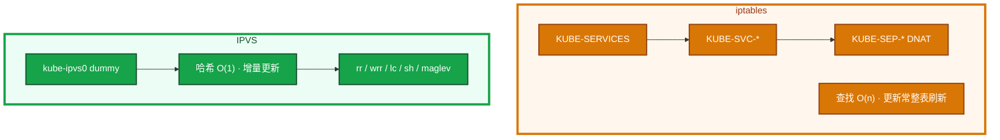
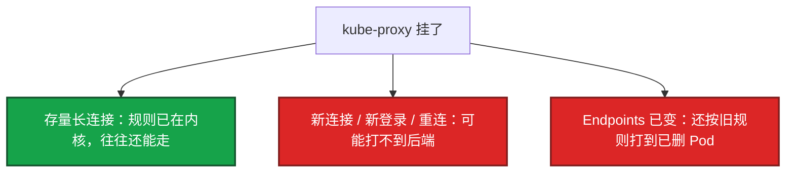
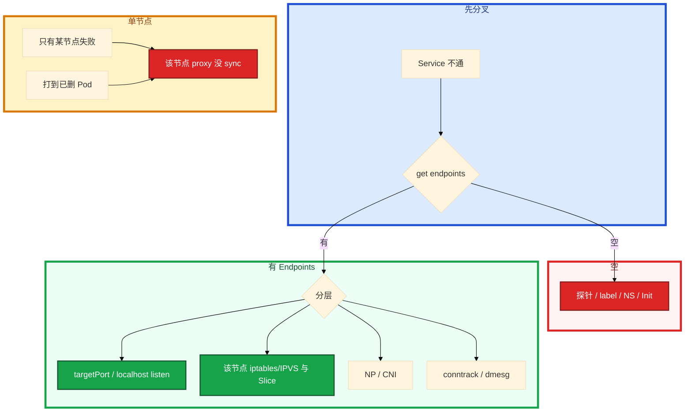

# Service 与 kube-proxy


大厅 Service 建好了，玩家打 ClusterIP 进不去。`get ep` 是空的。群里有人要重启 kube-proxy，另有人要把每个服务开一个云 LB。某节点 proxy 挂了之后，有人准备重启该节点上的战斗服。

先别动手。这一章后半全是你会动手的：**怎么对 Endpoints、怎么核对 iptables/IPVS、proxy 挂了先拉谁、conntrack 满怎么止血。** 前面的类型和数据面，是为了让你动手时不选错入口、不拆还活着的长连接。

**读完你能：** 白板上画出 VIP 怎么转到 Pod；四种类型 + Ingress 边界能一口选；空 Endpoints 先对 label 和探针；proxy 挂了能拆存量长连接和新登录。

## 本章目录

缩进 = 上下级。3 下面才是 3.1。

想钉在**正文左边**跟着滚：菜单 **查看 → 打开视图 → 大纲**。Markdown 预览做不到独立左栏，目录只能写在文章开头。

- [1. 基本概念](#1-基本概念)
- [2. 架构图](#2-架构图)
- [3. 原理](#3-原理)
  - [3.1 四种类型与 Ingress 边界](#31-四种类型与-ingress-边界)
  - [3.2 Endpoints](#32-endpoints空就不转发)
  - [3.3 iptables vs IPVS](#33-iptables-vs-ipvs)
  - [3.4 kube-proxy 挂了](#34-kube-proxy-挂了长连接还在吗)
  - [3.5 摘流与长连接](#35-摘流与长连接)
- [4. 安装部署](#4-安装部署)
- [5. 核心配置](#5-核心配置)
- [6. 常用命令](#6-常用命令)
- [7. 常用操作](#7-常用操作)
  - [7.1 空 Endpoints](#71-空-endpoints)
  - [7.2 切 IPVS](#72-切-ipvs)
  - [7.3 拉起 proxy](#73-拉起该节点-kube-proxy)
  - [7.4 conntrack](#74-conntrack-满)
- [8. 生产排障](#8-生产排障)
- [9. 必会 · 常考](#9-必会--常考)
- [合上书](#合上书问自己)

**本章不讲：** DNS / ndots → [09 CoreDNS](../09-CoreDNS/)；CNI、NetworkPolicy → [10 CNI](../10-CNI与网络策略/)；Ingress / 南北向七层 → [14 Ingress](../14-Ingress与流量管理/)；Cilium 替换 kube-proxy → [23](../23-eBPF与Cilium/)；探针、优雅退出时序 → [04](../04-Pod生命周期/)；Label vs Annotation、组件挂了总影响面 → [01](../01-集群架构/)。

---

## 1. 基本概念

Service 声明「怎么找到这组 Pod」。kube-proxy 是每节点 DaemonSet，把 Service / EndpointSlice **翻译成本机 iptables 或 IPVS**。数据包 **不经过 kube-proxy 用户态**。

ClusterIP 是 VIP，ping 通不等于有后端。`port` 是 Service 端口，`targetPort` 是容器端口，对不上就通不了。

| 在 Service / kube-proxy 里 | 不在这里 |
|---------------------------|----------|
| ClusterIP / NodePort / LB / Headless / ExternalName | Ingress 对象、七层 path（14） |
| EndpointSlice = Ready 且 selector 命中的 Pod | Pod IP 由谁分配（10 CNI） |
| 本机内核 DNAT / IPVS | 名字怎么解析（09） |

三个角色不要混：

| 角色 | 干什么 |
|------|--------|
| **Service** | 名单：selector、port、类型 |
| **kube-proxy** | 把名单写成内核规则，**不经手数据包** |
| **Endpoints / EndpointSlice** | Ready 后端列表；空 = 不转发 |

`sessionAffinity: ClientIP` 四层粘滞（默认超时 **10800s**），滚动时还可能把人粘在旧 Pod 上。游戏长连接通常自己绑房间，不靠这个。

游戏：客户端不直打 ClusterIP；走网关 / LB。集群内大厅→逻辑服用 ClusterIP 或 Headless（看是否要指定进程）。

> **记住**：Service 是名单，转发规则在节点内核；有 VIP 不等于有后端。userspace 模式已废弃。

---

## 2. 架构图

先把整张图钉住。后面安装、命令、排障都对着这张图说话。



图上三条线：

1. **没有箭头从数据包指向 kube-proxy 进程。** 包走内核。
2. **DNS 给 VIP，proxy 给 DNAT，CNI 给跨节点。** 三层各管一段。
3. **conntrack 保证同连接回同一后端。** 游戏长连接靠这张表，不是靠 sessionAffinity。

四种类型先选谁来访问，再选有没有 VIP：



Ingress **不是** Service 类型。它要 Ingress Controller，通常前面再挂 **一个** 云 LB。ExternalName 是 CNAME 到集群外，**不经 kube-proxy**。

---

## 3. 原理

原理只保留动手和面试会用到的：四种怎么选、空 Endpoints 为什么最高频、iptables 为什么撑不住上千 Service、proxy 挂了长连接还在不在、滚动为什么打到正在退出的 Pod。

**本节 5 块：** 3.1 类型边界 · 3.2 Endpoints · 3.3 iptables/IPVS · 3.4 proxy 挂了 · 3.5 摘流

### 3.1 四种类型与 Ingress 边界

| 类型 | 谁来访问 | DNS | 还经过 kube-proxy？ |
|------|----------|-----|---------------------|
| ClusterIP | 集群内 | `svc.ns.svc.cluster.local` → VIP | 是 |
| NodePort | 节点IP:port | 仍有 ClusterIP | 是；默认端口段 **30000–32767** |
| LoadBalancer | 外网 / 云 LB | 云厂商给 hostname | 是；底下仍是 NodePort + ClusterIP |
| Headless | 直连 Pod | A 记录是 **Pod IP 列表**；STS：`pod.svc.ns.svc...` | 几乎不管负载均衡 |
| ExternalName | CNAME 到集群外 | 外部名 | 否 |
| Ingress（14） | HTTP/HTTPS path/host | 通常一个入口 LB | Controller 再打到后端 Service |

对内 ClusterIP，有状态直连 Headless，对外 HTTP **收敛到 Ingress + 一个 LB**，不要每个服务一个云 LB。LoadBalancer 配额用尽时 Service 一直 Pending，看起来像「K8s 坏了」，其实是云 controller 没拿到 LB。

NodePort 每个服务占端口，安全组难收；游戏客户端直连 NodePort 会把节点 IP 暴露给玩家，节点扩缩即全员改地址。Headless 没有 VIP，客户端拿 A 记录自己连。STS 用这个找 `mysql-0`。要用 ClusterIP 当「连指定 ordinal」会连错人。

游戏逻辑服：可互换用 ClusterIP；要指定进程（某房间服）用 Headless。玩家走网关，不把节点 IP 用 NodePort 暴露出去。

> **记住**：对内 ClusterIP，有状态直连 Headless，对外 HTTP 收敛到 Ingress。Ingress 不是第四种 Service。

### 3.2 Endpoints：空就不转发

Endpoints / EndpointSlice = **Ready 且 selector 命中的 Pod**。空 = 不转发。Service 对象存在、ClusterIP 能 ping 通内核规则，也不等于有后端。



卡住按这四条对：

1. **readiness 失败**（探针、依赖、慢启动）（04）
2. **selector 和 Pod label 不一致**（多一个字母，或写在 annotation 上）（01）
3. Pod 还不是 Running/Ready
4. 命名空间搞错

有 Endpoints 仍不通：targetPort、容器没 listen、NetworkPolicy、kube-proxy 规则、CNI。先在 Pod 内 `curl localhost`，再从另一 Pod 打 ClusterIP。不要第一刀重启 kube-proxy。

EndpointSlice 是 Endpoints 的分片，避免超大对象。kube-proxy 默认 watch Slice。排障两者都看。旧控制器只写 Endpoints 时，新 proxy 可能看不到，属版本 / 兼容问题。

> **记住**：空 Endpoints 先对 label 和探针，不要先重启 proxy；Running 不等于进了名单。

### 3.3 iptables vs IPVS

kube-proxy **不经手数据包**（这两种模式），它只维护规则。Service 上千之后，节点上 iptables 规则更新开始打满 CPU。



| | iptables | IPVS |
|--|----------|------|
| 查找 | 链表 O(n) | 哈希 O(1) |
| 更新 | 常整表刷新 | 增量 |
| 规模 | Service 少时够用 | **上千就该评估切换** |
| 前提 | 默认可用 | 节点要 `ip_vs` 内核模块 |
| 算法 | statistic 随机 DNAT | rr 默认；长连接可看 **lc**；粘滞可看 sh / maglev |
| 可见 | `iptables-save \| grep <VIP>` | `ipvsadm -Ln`；dummy 口 `kube-ipvs0` |

切 IPVS 改 ConfigMap 后重启 kube-proxy DS。切完仍是 iptables，先 `lsmod | grep ip_vs`。部分节点 ARP 异常时开 `ipvs.strictARP`。较新版本还有 nftables 模式，本章答到「包仍走内核、规则谁写」即可。

给 proxy 加 CPU 填不满数据面——包根本不进用户态。

> **记住**：包走内核不走 proxy 进程；大集群用 IPVS（O(1)），iptables 链表 O(n)。

### 3.4 kube-proxy 挂了：长连接还在吗

数据包：网卡 → 内核 iptables/IPVS/conntrack → 容器。**不经过 kube-proxy 进程。** 对齐 01 Q10。



已经写进内核的规则和已有 conntrack 不会瞬间蒸发；变的是再也更新不了。止血：拉起该节点 kube-proxy，核对 EndpointSlice 和本机 ipvs/iptables 是否一致。**不要先重启游戏进程**——那会主动拆掉还活着的长连接。

Cilium eBPF 模式不靠 kube-proxy 写 iptables。挂的是 Cilium agent 时，影响面类似「规则不更新」。见 23。本章答到：转发规则在数据面，控制 / agent 挂了不等于立刻断光。没上替换方案就还靠 kube-proxy。Sidecar 网格可以绕过 ClusterIP 直连 Pod，那是另一条数据面，细节不在本章默写 CR。

> **记住**：proxy 挂了存量长连接往往还在；新连接和滚动后的新 Pod 会出问题。先拉 proxy，别杀游戏进程。

### 3.5 摘流与长连接

滚动时会打到正在退出的 Pod：Endpoints 摘除和 IPVS 更新有延迟；应用立刻退出。靠 readiness 先摘 + preStop 等待（04）。sessionAffinity 还可能把人粘在旧 Pod。长连接要业务主动断或等自然结束。Service 对象自己不会「等容器感觉好了」。

`maxUnavailable=0` 保证的是副本数量，不保证数据面已经摘干净（05）。

游戏网关 CCU 高，默认 conntrack **65536** 不够。表现是间歇性超时、新建连接失败，`dmesg` 有 `nf_conntrack: table full`。看起来像 Service 抖，其实是表满了。TIMEOUT 默认空闲过短会砍长连接；过长表更容易满。

> **记住**：摘流靠 readiness，不是靠 Service 对象自己。conntrack 满会间歇超时。

---

## 4. 安装部署

kube-proxy 是 kubeadm 默认的 DaemonSet，`kube-system` ConfigMap `kube-proxy`。托管集群同样有一份，只是你不一定改得了 mode。

| 项 | 选 | 不选 |
|----|----|------|
| 模式 | 规模大用 **IPVS** | 万级 Service 死守 iptables |
| 验收 | `ipvsadm` / `iptables-save` 能看到 VIP | 只看 proxy Pod Running |
| Cilium 替换 | 知道影响面仍是「规则不更新」（23） | 以为上了网格就不用答本章 |

切 IPVS：节点内核模块 → 改 CM `mode: ipvs` → 滚动 DS → 逐节点 `ipvsadm -Ln`。不要活动中全集群一起切。

---

## 5. 核心配置

长连接滚动必须 readiness + 优雅退出，否则 IPVS 还把新连接打到正在 TERM 的 Pod。游戏网关若要真实玩家 IP 做风控，入口用 NLB + `externalTrafficPolicy: Local`。

| 项 | 选 | 不选 |
|----|----|------|
| 对内 | ClusterIP | 每个服务一个云 LB |
| 对外 HTTP | Ingress + 一个 LB（14） | 纯 NodePort 裸奔生产 |
| 有状态直连 | Headless | 用 ClusterIP 当「连指定 ordinal」 |
| 模式 | 规模大用 IPVS | 万级死守 iptables |
| 长连接 | 关注 conntrack max、TIMEOUT | 默认 65k 扛游戏 CCU |
| 滚动 | readiness 决定进不进 Endpoints | 以为 Service 会等容器「感觉好了」 |
| sessionAffinity | 游戏房间自己绑 | 当会话保持银弹，滚动粘旧 Pod |

**externalTrafficPolicy**：

| | Cluster | Local |
|--|---------|-------|
| 源 IP | 变成节点 IP | **保留真实客户端 IP** |
| 转发 | 可跨节点 | 只打本节点 Pod |
| 空节点 | 仍可能接到 | **丢包**；要外部健康检查摘掉，或每节点都有副本 |

`internalTrafficPolicy: Local` 减少跨节点东西向跳，适合同节点 sidecar 密集的场景，副本不够会断。

**externalTrafficPolicy** 和 **internalTrafficPolicy** 都作用在 kube-proxy 写规则的那一层，不作用在 Ingress Controller 自己的七层反代上。七层入口要真实 IP，看 Ingress / NLB 的 Proxy Protocol 或 `X-Forwarded-For`（14），不要以为改了 Service Local 七层就一定看到玩家 IP。

游戏长连接 Service 额外盯三件事：① conntrack max / TIMEOUT ② 滚动时 readiness + preStop，否则 IPVS 还打 TERM 中的 Pod ③ 不要用 sessionAffinity 当房间粘滞——房间自己绑，滚动会把人粘在旧进程上。Headless 直连房间服时，客户端拿到的是 Pod IP，kube-proxy 几乎不管负载均衡，摘流更要靠业务断连 + DNS TTL（09 cache 30s）。

---

## 6. 常用命令

```bash
kubectl get svc,ep,endpointslice -n <ns>
kubectl get pods --show-labels -n <ns>
kubectl get cm kube-proxy -n kube-system -o yaml | grep mode
kubectl logs -n kube-system -l k8s-app=kube-proxy --tail=50
```

| 目的 | 命令 | 看什么 |
|------|------|--------|
| 有没有后端 | `kubectl get endpoints,endpointslice -n <ns> <svc>` | 空就不转发 |
| 对 selector | `kubectl get pods --show-labels` | 别对 annotation |
| 探针 | `kubectl describe pod` | Ready False、失败次数 |
| iptables 规则 | `iptables-save \| grep <ClusterIP>` | 该节点有没有这条 VIP |
| IPVS 规则 | `ipvsadm -Ln \| grep <ClusterIP>` | dummy `kube-ipvs0` |
| 切 IPVS 失败 | `lsmod \| grep ip_vs` | 模块没加载 |
| conntrack | `cat /proc/sys/net/netfilter/nf_conntrack_count` 与 `_max` | >80% 告警 |
| proxy 是否在 | `kubectl -n kube-system get po -o wide -l k8s-app=kube-proxy` | 按节点看 |

值班先跑：`get ep` → `describe pod` 探针 / label → 该节点 `ipvsadm`/`iptables` → conntrack。

---

## 7. 常用操作

### 7.1 空 Endpoints

1. `get ep,endpointslice` 确认空。
2. `get pods --show-labels` 对 selector。
3. `describe pod` 看 Ready / 探针。
4. 对 Namespace。修的是 Pod / 探针 / 标签，不是 proxy。

### 7.2 切 IPVS

1. 节点 `lsmod | grep ip_vs`，没有就加载。
2. 改 `kube-system` ConfigMap `kube-proxy`：`mode: ipvs`，按需 `strictARP`。
3. 滚动 kube-proxy DS，一台看 `ipvsadm -Ln` 再下一台。
4. 算法 rr 默认，长连接可看 lc。

### 7.3 拉起该节点 kube-proxy

proxy 进程没了：拉起该节点 DS Pod，核对 Slice 与本机规则一致。不要先重启游戏进程。滚动后打到已删 Pod：同一刀——规则没 sync。

### 7.4 conntrack 满

```bash
cat /proc/sys/net/netfilter/nf_conntrack_count
cat /proc/sys/net/netfilter/nf_conntrack_max
dmesg | grep conntrack
```

调高 max，查短连接泄漏（没关掉的 HTTP、健康检查打爆），监控 count/max，**>80% 告警**。TIMEOUT 按游戏长连接空闲时间调，不要只加 max 不治理泄漏。

---

## 8. 生产排障

分层：DNS（09）/ Endpoints / proxy 规则 / CNI ping / 端口 listen。不要一层猜。`get` 可以 `exec` 不行是 API→kubelet（03），不是这条 Service 路径。



| 现象 | 先做什么 | 不要做什么 |
|------|----------|------------|
| Service 不通 | `get endpoints` 是否空 | 第一刀重启 proxy |
| 空 | describe Pod 探针；对 label/selector | 改 kube-proxy mode |
| 有 Endpoints 仍不通 | targetPort、localhost 是否 listen | 一层猜到 CNI |
| 间歇超时 | conntrack；dmesg table full | 当 Endpoints 空去改 selector |
| 打到已删 Pod | 该节点 proxy 是否 sync | 先重启游戏进程 |
| 部分节点不通 | 对比该节点规则与 Slice | 当全集群 CNI 坏了 |
| 切 IPVS 失败 | `lsmod \| grep ip_vs` | 给 proxy 加 CPU |
| proxy 进程没了 | 拉起 proxy | 重启逻辑服 |
| LB EXTERNAL-IP Pending | 云配额 / cloud controller | 当 K8s 坏了 |
| Local 丢登录包 | 空节点没被外部摘掉 | 再加 NodePort |

同节点 Pod 互访对照：通则不像 CNI 跨节点（10）。所有节点都空 Endpoints → 偏 selector/探针。单节点规则和 Slice 不一致 → 偏该节点 proxy。

---

## 9. 必会 · 常考

白板和追问高频，能一口回：

| 说法 | 对错 | 口径 |
|------|:----:|------|
| 数据包经过 kube-proxy 用户态 | 错 | 只写规则，包走内核 |
| ClusterIP 能 ping 通就有后端 | 错 | 空 Endpoints 仍可能有 VIP |
| Running 一定进 Endpoints | 错 | 要 Ready 且 selector 命中 |
| selector 写在 annotation 上也行 | 错 | 只看 label |
| Ingress 是第五种 Service | 错 | 七层对象，要 Controller（14） |
| 每个服务一个云 LB 更稳 | 错 | HTTP 收敛到 Ingress |
| Headless 也回 VIP | 错 | A 记录是 Pod IP 列表 |
| 用 ClusterIP 连 mysql-0 | 错 | STS 用 Headless |
| 大集群继续用 iptables 就行 | 错 | 上千评估 IPVS |
| proxy 挂了长连接立刻全断 | 错 | 存量往往还在；新连接会出问题 |
| proxy 挂了先重启战斗服 | 错 | 先拉 proxy |
| Service 对象会等容器感觉好了 | 错 | 摘流靠 readiness |
| Local 一定更好 | 错 | 空节点丢包，要外部摘空节点 |
| conntrack 满 = Endpoints 空 | 错 | 内核跟踪表满，名单可能还在 |
| Cilium 替换后不用答影响面 | 错 | agent 挂了仍是规则不更新 |

数字：NodePort **30000–32767**；sessionAffinity 默认 **10800s**；conntrack 默认常 **65536**；告警 **>80%**。

易混：空 Endpoints vs conntrack 满；iptables vs IPVS；Cluster vs Local；ClusterIP vs Headless DNS；proxy 挂了 vs CNI 跨节点；Service 类型 vs Ingress。

---

## 合上书，问自己

1. 从 Pod A 访问 `http://web:80` 完整路径？包走不走 proxy 进程？
2. 四种类型 + Ingress 怎么选？Headless 的 A 记录是什么？
3. Endpoints 空的四条原因？有 Endpoints 仍不通先看哪？
4. iptables 和 IPVS 差在哪？切 IPVS 失败先看什么？
5. kube-proxy 挂了，存量长连接和新登录各怎样？为什么不能重启战斗服？
6. Local 保什么、丢什么？conntrack 满是什么现象？

六题都能口述，这一章就过了。下一章把名字解析剖开：ndots 怎样把一次外网查询放大成四次。
