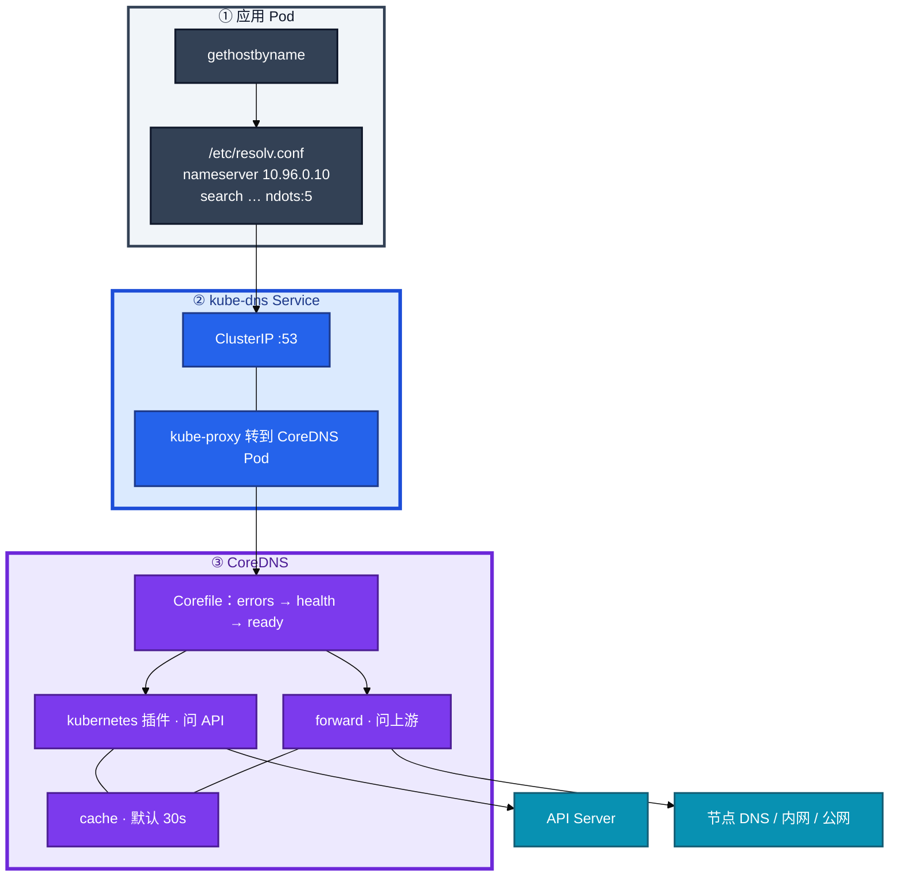
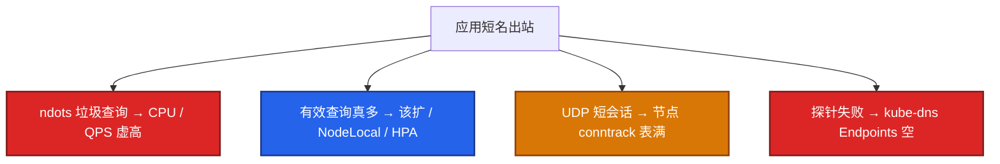
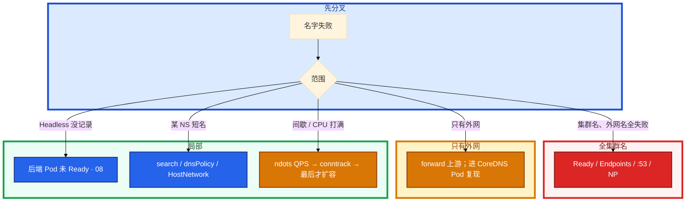

# CoreDNS


活动中 kube-system 里 CoreDNS 全部 NotReady。群里有人说「网络挂了，重启逻辑服」。大厅到战斗服一直用的是 Service 短名。另一边支付 SDK 用 `api.pay.com`，大厅一扩容 CoreDNS CPU 打满，IP 直连支付网关却是通的。

先别动手。这一章后半全是你会动手的：**怎么看 kube-dns Endpoints、怎么修 ndots、怎么分层查名字失败、打满时先分垃圾查询还是 conntrack。** 前面的解析链，是为了让你动手时不把 DNS 当成 CNI。

**读完你能：** 白板上画出应用 → resolv.conf → CoreDNS → VIP；ndots:5 能算出一次外网查询放大成几次；全集群名死先看 Endpoints，不先重启业务。

## 本章目录

缩进 = 上下级。3 下面才是 3.1。

想钉在**正文左边**跟着滚：菜单 **查看 → 打开视图 → 大纲**。Markdown 预览做不到独立左栏，目录只能写在文章开头。

- [1. 基本概念](#1-基本概念)
- [2. 架构图](#2-架构图)
- [3. 原理](#3-原理)
  - [3.1 名字长什么样](#31-名字长什么样谁回答)
  - [3.2 ndots](#32-ndots外网首包慢查询被放大)
  - [3.3 DNS 打满](#33-dns-打满不只是-coredns-cpu)
  - [3.4 dnsPolicy](#34-dnspolicy与-hostnetwork)
- [4. 安装部署](#4-安装部署)
- [5. 核心配置](#5-核心配置)
- [6. 常用命令](#6-常用命令)
- [7. 常用操作](#7-常用操作)
  - [7.1 修 ndots](#71-修-ndots)
  - [7.2 rollout Corefile](#72-改-corefile-后-rollout)
  - [7.3 NodeLocal](#73-nodelocal-dnscache)
  - [7.4 护 PDB](#74-护-coredns-的-pdb)
- [8. 生产排障](#8-生产排障)
- [9. 必会 · 常考](#9-必会--常考)
- [合上书](#合上书问自己)

**本章不讲：** 公网 DNS / CDN → [02-10](../../02-基础底座/10-DNS与CDN/)；VIP 怎么转到 Pod → [08 Service](../08-Service与kube-proxy/)；Pod 之间三层 → [10 CNI](../10-CNI与网络策略/)；上 NP 后 DNS 挂的策略写法 → 10，本章只要求知道要放行 53；Cilium 替 kube-proxy 后的 DNS → [23](../23-eBPF与Cilium/)。

---

## 1. 基本概念

集群 DNS 不是「应用自己随便问 8.8.8.8」。kubelet 给每个 Pod 写好 `/etc/resolv.conf`，nameserver 指向 **kube-dns** 这个 Service（常见 ClusterIP `10.96.0.10`）。后面才是 CoreDNS 进程。

CoreDNS 通常是 `kube-system` 里的 Deployment，Service 名仍叫 `kube-dns`（历史兼容）。挂了：**名字互访全断，已经知道的 IP 还通**——和「网络挂了」不是一回事。

| 在 CoreDNS 里 | 不在 CoreDNS 里 |
|---------------|-----------------|
| 把名字翻译成 ClusterIP 或 Headless Pod IP | 把 VIP DNAT 到 Pod（08） |
| kubernetes 插件问 API；forward 问上游 | Pod 之间三层怎么走（10） |
| resolv.conf 的 nameserver / search / ndots | 公网权威 DNS / CDN（02-10） |

三个角色不要混：

| 角色 | 干什么 |
|------|--------|
| **resolv.conf** | 应用问谁、search 怎么补、ndots 几 |
| **kube-dns Service** | VIP，kube-proxy 转到 CoreDNS Pod |
| **CoreDNS** | kubernetes 管内名，forward 管外名，cache 默认 30s |

CoreDNS 自己也是普通 Deployment：探针失败 → kube-dns Endpoints 空 → **全集群名字一起死**。kubernetes 插件依赖 API Server：控制面挂了，**已经缓存的答案还能撑 TTL，新名字 / 过期后再查会失败**。这和 01「控制面挂了进程还在」是同一类拆法。

CoreDNS 问 API 走的是 ServiceAccount，RBAC 被收太死会出现「CoreDNS Running、管内名 NXDOMAIN」。排障不要只看 53 端口。

> **记住**：名字断了先看 kube-dns 有没有后端，不要先怪 CNI。DNS 给名字，kube-proxy 给 VIP 转发，CNI 给 Pod IP。

---

## 2. 架构图

先把整张图钉住。后面安装、命令、排障都对着这张图说话。



图上三条线：

1. **CoreDNS 挂了，已经知道的 ClusterIP / Pod IP 还能通。** 新连接如果还要解析名字 → 失败。已经用 IP 打上的长连接通常还在。不要重启还活着的逻辑服。
2. **改 Corefile（ConfigMap）之后要 rollout CoreDNS**，只 apply CM 进程不会自动重载所有插件状态。
3. **kube-dns Endpoints 空 = 全集群名死**，和业务 Deploy readiness 失败是同一条机制（08）。Running ≠ 进 Service。只探 TCP :53 不够：进程在、插件卡住、kubernetes 插件连不上 API，TCP 仍通。

---

## 3. 原理

原理只保留动手和面试会用到的：短名怎么补全、ndots 为什么放大查询、打满先分哪一层、HostNetwork 为什么短名全废。

**本节 4 块：** 3.1 名字 · 3.2 ndots · 3.3 打满 · 3.4 dnsPolicy

### 3.1 名字长什么样、谁回答

同 Namespace 可以写短名，靠 search 域补全成 `webapp-svc.<ns>.svc.cluster.local`。跨 NS 必须写全：`<svc>.<ns>.svc.cluster.local`。

| 类型 | A 记录 |
|------|--------|
| ClusterIP Service | 一条 = VIP，再交给 kube-proxy（08） |
| Headless | **多条 = 各 Ready Pod IP**；STS 还有 `<pod>.<svc>.<ns>.svc.cluster.local` |

Headless 没记录，先看后端 Pod 是不是 Ready，不是先骂 CoreDNS。Kafka / STS 找 ordinal 必须 Headless：给 Kafka 建普通 ClusterIP，客户端连上 VIP 被随机打到不同 broker，组元数据全乱。

cache 默认 **30s**。Headless 刚扩出来的 Pod，应用还可能解析到旧列表。排障 `dig` 看 TTL；不要把 TTL 拉到几分钟还指望秒级发现新副本。

短名 NXDOMAIN、FQDN 却通：search 域不对，或 `dnsPolicy` 把 resolv.conf 写飞了。

> **记住**：短名靠 search；跨 NS 写全称；Headless 空先看后端 Ready。

### 3.2 ndots：外网首包慢、查询被放大

`options ndots:5`：**名字里的点少于 5 个，先当相对名，拿 search 域去拼**。`api.example.com` 只有 2 个点，一次应用查询会变成：


这就是 **DNS amplification（查询放大）**：业务没涨，CoreDNS QPS 先炸。Java / 游戏 SDK 扫外网支付、账号、反外挂，P99 会烂在 DNS。一次 `gethostbyname("api.pay.com")` 在 ndots=5 下可变成 **4 次**查询。连接池 + 短 TTL 会把 CoreDNS 打成「活动没开始、DNS 先告警」。glibc 按 ndots 拼 search；有些 musl / 自研 resolver 行为略不同，但生产默认这套就是 kubelet 写的 ndots:5。

**修，按治本到治标：**

1. 代码 / 配置用绝对名：`api.example.com.`（末尾那个点）。
2. Pod `dnsConfig.options: ndots:2`（多数外网 FQDN 够用）。
3. 副本不够就扩 CoreDNS + 反亲和；再上 **NodeLocal DNSCache**，把命中留在节点。

不要靠把 cache TTL 拉到几分钟挡故障切换——Service 刚变、Headless 后端刚 Ready，30s 内仍可能是旧答案，再拉长只会让切流更钝。扩副本治标，**ndots 治本**。先看 QPS 里有多少是 `*.cluster.local` 的 NXDOMAIN。

游戏：活动前支付 SDK 用短 host `api.pay.com`，大厅一扩容，CoreDNS CPU 打满、登录 P99 从 80ms 跳到 2s。IP 直连支付网关是通的。改成 FQDN 加点 + 部分 Pod `ndots:2`，QPS 掉了大半。复盘写的是 search 次数，不是带宽。

NodeLocal DNSCache **不能替代改 ndots**：垃圾查询缓存之后仍是垃圾，只是打到本机。

> **记住**：外网短名先白查三遍集群域；加点或降 ndots，别先加副本。

### 3.3 DNS 打满：不只是 CoreDNS CPU

高频误判是「CPU 高了加 10 个副本」。先分清打满的是哪一层。



| 你看到的 | 是哪一层 |
|----------|----------|
| CPU 高，QPS 里大量 `*.cluster.local` NXDOMAIN | 垃圾查询。先改 ndots / FQDN |
| QPS 真高、NXDOMAIN 不多 | 有效查询。扩副本 + 反亲和，挂 HPA，再上 NodeLocal |
| 偶发失败，CoreDNS P99 20ms，dmesg `nf_conntrack: table full` | DNS 是 UDP 短会话，conntrack 也被打满 |
| kube-dns Endpoints 空，Pod 不 Ready | 探针把后端摘空。全集群名字一起死 |

应用侧超时 2s、CoreDNS P99 20ms，瓶颈在 search 次数或上游，不是「再加副本」。排障用 `dig +norecurse` 打 CoreDNS 并看 TTL，不要只信应用侧一次失败。

NodeLocal：命中留在节点（常见 `127.0.0.1:53` 一类），打中心的只是未命中和失效。它降低超时和中心 QPS，**不替代把 ndots 改对**。

HPA 按有效 QPS 才有意义。否则 HPA 在扩垃圾查询。CoreDNS 要反亲和、limit 防 OOM、PDB 防探针把 Endpoints 摘空。cache 默认 30s 通常够；不要用超长 TTL 当扩容替代。

> **记住**：先分垃圾查询、有效 QPS、conntrack、Endpoints 被摘空，再决定加不加副本。

### 3.4 dnsPolicy 与 HostNetwork

| 策略 | 谁用 | 效果 |
|------|------|------|
| `ClusterFirst` | 默认 | 用集群 DNS，search 走 cluster.local |
| `ClusterFirstWithHostNet` | HostNetwork 还想用集群 DNS | 否则 HostNetwork 会继承节点 DNS |
| `Default` | 跟节点走 | 短名 `webapp-svc` 解析不了 |
| `None` | 完全自定义 | 必须配 `dnsConfig` |

HostNetwork 游戏服若忘了 `ClusterFirstWithHostNet`，会绕过 CoreDNS，集群短名全废。你进 Pod 看 `/etc/resolv.conf`：nameserver 已经是节点 DNS，不是 `10.96.0.10`。看起来像「DNS 挂了」，其实查询根本没打到 kube-dns。

`dnsPolicy=None` 自己写 8.8.8.8：集群短名会废，且绕过你对 CoreDNS 的 SLA。生产要自定义就写完整 dnsConfig，不要漏 nameserver。

自定义 cluster domain 是加分项。生产改了 `cluster.local`，所有硬编码这个后缀的探针、证书 SAN、业务配置会一起炸。已跑着的 Pod 要滚动才会更新 resolv.conf search。改 domain = 一次全集群滚动 + 配置审计，生产默认不要动。

IPv6 / 双栈：A 和 AAAA 都可能返回。应用只连 IPv4 却先拿到 AAAA，会多一次失败超时。

NetworkPolicy 默认拒出站时，**必须放行 kube-system:53**（UDP，很多环境 TCP 53 也要）。这是上 NP 第一天最高频事故，细节在 10。Ingress 放行不够——查 DNS 是 **出站**。

> **记住**：HostNetwork 忘了 ClusterFirstWithHostNet，短名全废，不是 CoreDNS 挂了。

---

## 4. 安装部署

kubeadm 默认装 CoreDNS Deployment + kube-dns Service。托管同样有，副本和 Corefile 仍要你盯。

| 项 | 选 | 不选 |
|----|----|------|
| 副本 | **≥2** + 反亲和 + requests/limits + PDB | 单副本入口 |
| 上游 | 内网可靠 DNS；公司域 StubDomain | 只写 8.8.8.8 还要求 SLA |
| 验收 | 应用 Pod 里 `nslookup kubernetes.default` | 只看 CoreDNS Running |

公司域 `company.internal` 用 StubDomain / 单独 server 块转到内网 DNS，其余走默认 forward。不要让公司域先出公网再绕回来。CoreDNS 自己也要能解析上游——进 coredns Pod 里 `nslookup google.com` 可分清「管内挂」还是「上游挂」。

---

## 5. 核心配置

| 项 | 选 | 不选 |
|----|----|------|
| 外部名 | FQDN 末尾 `.` 或降 ndots:2 | 短名打外网 |
| 规模 | 先修 ndots；HPA 按有效 QPS；NodeLocal | 一个 2 副本扛全集群垃圾查询 |
| cache | 默认 30s 通常够 | 几分钟 TTL 挡故障切换 |
| Corefile | 改完 **rollout** | 只 apply CM 以为重载了 |
| NP | 上策略先放行 53 | 只放行 Ingress 入站 |
| cluster domain | 保持 `cluster.local` | 为了好听改成 `game.local` |

Corefile 只动有证据的块。顺序大致是 errors → health → ready → kubernetes → forward → cache。kubernetes 管 `cluster.local`；其余走 forward。StubDomain 给公司域单独 server 块，避免先出公网再绕回来。

```yaml
# kube-system ConfigMap coredns · 示意
.:53 {
    errors
    health :8080
    ready
    kubernetes cluster.local in-addr.arpa ip6.arpa {
       pods insecure
       fallthrough in-addr.arpa ip6.arpa
    }
    cache 30
    forward . /etc/resolv.conf
}
company.internal:53 {
    errors
    cache 30
    forward . 10.0.0.53
}
```

```yaml
# Pod dnsConfig 示意：降 ndots
dnsConfig:
  options:
  - name: ndots
    value: "2"
```

search 域默认三截：`<ns>.svc.cluster.local`、`svc.cluster.local`、`cluster.local`。这就是 ndots:5 下外网短名白查三遍的来源。不要再往 search 里塞一串业务域——每一次少点的查询都会再乘一遍。

> **记住**：改 Corefile 后 rollout Deployment。cache 拉长挡不住 ndots 放大，只会让 Headless 切流变钝。

---

## 6. 常用命令

```bash
kubectl get deploy,svc,ep -n kube-system -l k8s-app=kube-dns
kubectl exec -it <app> -- cat /etc/resolv.conf
kubectl exec -it <app> -- nslookup kubernetes.default   # 管内
kubectl exec -it <app> -- nslookup api.example.com      # 管外
kubectl logs -n kube-system -l k8s-app=kube-dns --tail=50
kubectl run tmp --image=busybox:1.36 -it --rm -- nslookup webapp-svc
```

| 目的 | 命令 | 看什么 |
|------|------|--------|
| 有没有后端 | `get ep -n kube-system -l k8s-app=kube-dns` | 空 = 全集群名死 |
| resolv.conf | `cat /etc/resolv.conf` | nameserver / search / ndots / 是不是节点 DNS |
| 管内 | `nslookup kubernetes.default` | kubernetes 插件 + API |
| 管外 | `nslookup api.example.com` | forward 上游 |
| 日志 | CoreDNS logs | NXDOMAIN 占比、上游超时 |
| TTL | `dig +norecurse @10.96.0.10 <name>` | 不要只信应用侧一次失败 |

值班先跑：Endpoints → 应用 resolv.conf → 管内 / 管外各一条 nslookup。

---

## 7. 常用操作

### 7.1 修 ndots

1. 配置改成绝对名 `api.pay.com.`。
2. 大厅 / SDK Pod `dnsConfig.options: ndots:2`。
3. 看 CoreDNS 上 `*.cluster.local` NXDOMAIN 是否下降。先加副本是在扩无效查询。

### 7.2 改 Corefile 后 rollout

```bash
kubectl -n kube-system rollout restart deploy/coredns
kubectl -n kube-system rollout status deploy/coredns
```

StubDomain 把 `company.internal` 转到内网 DNS，改完必须滚动。PDB 在，maxUnavailable 要小，避免自己把名字入口拆了。

### 7.3 NodeLocal DNSCache

把命中留在节点，降低中心 QPS 和超时。常见形态：节点上跑 cache Pod / DaemonSet，应用 resolv.conf 指到链路本地或本机口（文档常见 `169.254.20.10` / `127.0.0.1:53` 一类），未命中再打中心 CoreDNS。

它治的是「有效查询太多、跨节点 UDP 超时」。它不治 ndots 垃圾——缓存之后仍是垃圾，只是打到本机。上完回头看 `*.cluster.local` NXDOMAIN 占比，该降 ndots 还是要降。节点 conntrack 仍要盯：NodeLocal 把短会话留在本机，表照样能满。

### 7.4 护 CoreDNS 的 PDB

探针失败 = kube-dns Endpoints 变空 = 全集群不能解析。和业务 Deploy 一样，单副本或滚动时 maxUnavailable 过大，就是自己把名字入口拆了。止血：看探针为什么失败（配置、上游、OOM），不要先重启业务。

---

## 8. 生产排障

大厅报「解析失败」。不要一上来重启 CoreDNS，按失败范围分层。



| 现象 | 先做什么 | 不要做什么 |
|------|----------|------------|
| 集群名、外网名全失败 | CoreDNS Ready、Endpoints、到 :53、NP 放行 53 | 重启逻辑服 |
| 只有外网失败 | forward 上游；进 CoreDNS Pod 里复现 | 先加 10 个副本 |
| Headless 没 A 记录 | 后端 Pod 未 Ready（08） | 骂 CoreDNS 丢了答案 |
| 某 NS 短名失败 | search、dnsPolicy、HostNetwork | 当全集群 DNS 挂了 |
| 间歇失败 | ndots QPS、conntrack | 只看 CoreDNS CPU |
| 应用超时 2s、P99 20ms | search 次数或上游 RTT | 加副本填这段时间 |
| 刚上 NP 名挂 IP 通 | egress 放行 53（10） | 以为 CoreDNS 被策略杀掉 |
| 改了 cluster domain | 硬编码后缀、证书 SAN、滚动 Pod | 当无成本开关 |

卡住先看哪：全集群名死先看 Endpoints；只有外网先看上游；间歇先看 ndots 和 conntrack；某个 NS 短名先看 resolv.conf。

> **记住**：名字失败按范围分层，不要无脑重启 CoreDNS。

---

## 9. 必会 · 常考

白板和追问高频，能一口回：

| 说法 | 对错 | 口径 |
|------|:----:|------|
| CoreDNS 挂了 = 网络挂了，要重启逻辑服 | 错 | 名字断，已知 IP 还通；长连接通常还在 |
| kube-dns Endpoints 空但进程 Running 就没事 | 错 | Running ≠ 进 Service，全集群名死 |
| 只探 TCP :53 够当健康检查 | 错 | 插件卡住 TCP 仍通 |
| ndots:5 下 `api.pay.com` 只查一次 | 错 | 先白查 3 次集群域，共 4 次 |
| 先加 10 个 CoreDNS 副本治外网慢 | 错 | ndots 治本，扩副本治标 |
| NodeLocal 能替代改 ndots | 错 | 垃圾查询缓存之后仍是垃圾 |
| Headless 也回一条 VIP | 错 | 多条 Pod IP |
| HostNetwork 默认走集群 DNS | 错 | 要 ClusterFirstWithHostNet |
| cache 拉到 5 分钟能当容量方案 | 错 | Headless / 故障切换变钝 |
| 上 NP 只放行 Ingress 入站，DNS 会好 | 错 | 解析是 egress :53 |
| 自定义 cluster domain 无成本 | 错 | 探针、SAN、已有 Pod search 一起炸 |
| kubernetes 插件不依赖 API | 错 | 管内名问 API；RBAC 太死会 NXDOMAIN |

数字：常见 kube-dns VIP **10.96.0.10**；ndots 默认 **5**；一次外网短名 → **4** 次查询；cache 默认 **30s**；副本 **≥2**。

易混：名挂 vs IP 通；垃圾查询 vs 有效 QPS；Endpoints 空 vs 上游挂；HostNetwork 继承节点 DNS vs CoreDNS 挂了；NP egress vs Ingress 入站。

---

## 合上书，问自己

1. 一次集群内查询怎么走？CoreDNS 挂了，已经打上的长连接还在吗？
2. ClusterIP 和 Headless 的 A 记录差在哪？
3. ndots:5 让 `api.pay.com` 放大成几次？怎么修？NodeLocal 能替代吗？
4. DNS 打满四层怎么分？应用超时 2s、P99 20ms 还加副本吗？
5. HostNetwork 短名全废是哪条 dnsPolicy？上 NP 为什么先放行 53？
6. kube-dns Endpoints 空但进程还在，会发生什么？改 Corefile 要不要 rollout？

六题都能口述，这一章就过了。下一章把 Pod IP 和 NetworkPolicy 剖开：sandbox 失败时业务还没起，上 NP 先放行 53。
