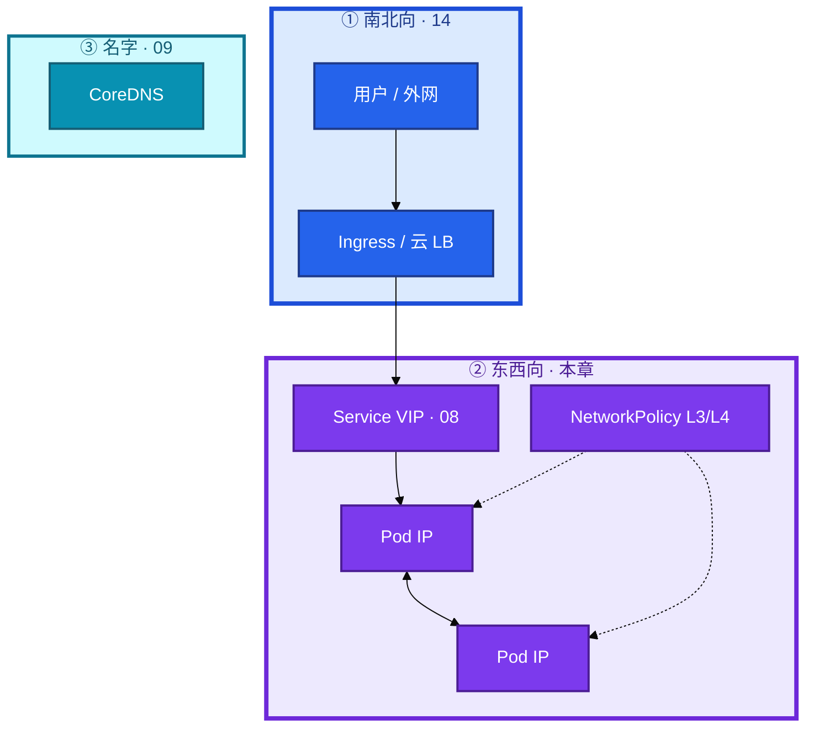
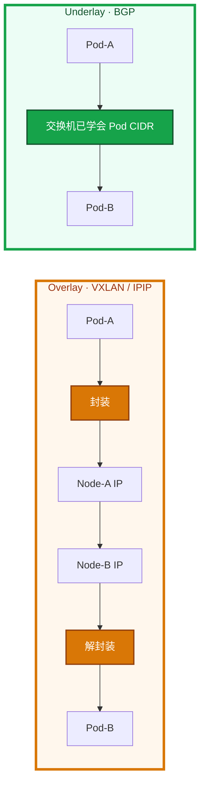
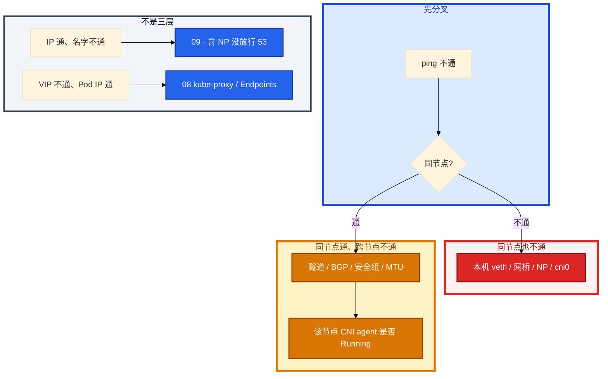

# CNI 与网络策略


新战斗服一直 ContainerCreating，Events 里 `FailedCreatePodSandBox`。应用镜像日志还没有。另一边刚给支付 NS 上了 default-deny，全集群 DNS 挂，IP ping 还通。群里有人开始查应用端口，另有人说「单独一个 NS 就合规了」。

先别动手。这一章后半全是你会动手的：**sandbox 失败查 CNI 和 IP 池、跨节点分层 ping、上 NP 先放行 53、误加 deny-all 怎么秒级回滚。** 前面的三原则和 Overlay，是为了让你动手时不把 VIP 当成 Pod IP。

**读完你能：** 白板上分层画出名字 / VIP / Pod IP / NP；sandbox 失败知道业务还没起；无 NP 全通、被选中后该方向默认拒；Calico / Cilium / Flannel 能选到本章该停的深度。

## 本章目录

缩进 = 上下级。3 下面才是 3.1。

想钉在**正文左边**跟着滚：菜单 **查看 → 打开视图 → 大纲**。Markdown 预览做不到独立左栏，目录只能写在文章开头。

- [1. 基本概念](#1-基本概念)
- [2. 架构图](#2-架构图)
- [3. 原理](#3-原理)
  - [3.1 Pod IP 从哪来](#31-pod-ip-从哪来)
  - [3.2 Overlay / Underlay](#32-跨节点-overlay--underlay)
  - [3.3 Calico / Flannel / Cilium](#33-calico--flannel--cilium-怎么选)
  - [3.4 NetworkPolicy](#34-networkpolicy无策略全通选中后默认拒)
- [4. 安装部署](#4-安装部署)
- [5. 核心配置](#5-核心配置)
- [6. 常用命令](#6-常用命令)
- [7. 常用操作](#7-常用操作)
  - [7.1 上 NP 顺序](#71-上-np-顺序)
  - [7.2 IP 池](#72-ip-池耗尽)
  - [7.3 CNI 滚动](#73-cni-daemonset-滚动)
- [8. 生产排障](#8-生产排障)
- [9. 必会 · 常考](#9-必会--常考)
- [合上书](#合上书问自己)

**本章不讲：** Service / kube-proxy / Endpoints → [08](../08-Service与kube-proxy/)；CoreDNS、ndots、放行 53 的解析细节 → [09](../09-CoreDNS/)；Ingress / 南北向七层 → [14](../14-Ingress与流量管理/)；Cilium eBPF、Hubble、替 kube-proxy、L7 策略 → [23](../23-eBPF与Cilium/)；调度拓扑、同 AZ → [06](../06-调度机制/)；hostNetwork 与 PSS → [13](../13-RBAC与安全/)；NS 不是安全边界（RBAC / 配额）→ [01](../01-集群架构/)、13。

---

## 1. 基本概念

K8s 网络不是 NAT 迷宫。模型是三句话：

1. **每个 Pod 一张 IP**（实际是 pause 持有网络命名空间，业务容器 join 进去）。
2. **Pod 互访无 NAT**——对端看到的是真实 Pod IP，抓包和策略才好做。
3. **节点上的 Agent 能碰到所有 Pod**（kubelet / CNI 自己要管网）。

**Namespace 不是安全边界。** 跨 NS 默认三层能通，有权限的人也能操别的 NS。要隔离必须叠 **RBAC + NetworkPolicy + 配额**；合规上要硬墙，拆集群或独立节点池，不是只建一个 NS。这和 01 同一句话，本章补的是「包怎么拦」。

| 在 CNI / NP 里 | 不在这里 |
|----------------|----------|
| Pod IP、跨节点路由、可选的 L3/L4 策略 | Service VIP → Pod（08） |
| sandbox / IPAM / veth | 名字解析（09） |
| NetworkPolicy 东西向墙 | Ingress 南北向七层（14） |

四个角色不要混：

| 角色 | 干什么 |
|------|--------|
| **CNI** | Pod IP 和跨节点连通（以及可选的 NP 实现） |
| **kube-proxy** | VIP → Pod |
| **CoreDNS** | 名字 → IP |
| **NetworkPolicy** | L3/L4 允不允许发；不管 HTTP path |

对端 IP 真实，conntrack、抓包、NetworkPolicy 才好做。NAT 迷宫里策略只能写节点，拦不住东西向。

> **记住**：CNI 管 Pod 网，proxy 管 VIP，DNS 管名，NP 管允不允许发。NS 不是墙。

---

## 2. 架构图

先把整张图钉住。后面安装、命令、排障都对着这张图说话。



默认东西向是通的：

```
ns: hall  <->  ns: battle  <->  ns: pay
```

战斗服和支付放同一集群时，最低配见 01：独立 NS、最小 RBAC、**NetworkPolicy 默认拒绝只放行该放的**、污点 / 独立节点池。只在 Ingress 做认证拦不住集群内横向。RBAC 管 API，不管包。

---

## 3. 原理

原理只保留动手和面试会用到的：IP 谁发、跨节点包怎么走、三款 CNI 选到哪、NP 默认行为为什么是「无策略全通」。

**本节 4 块：** 3.1 sandbox · 3.2 Overlay · 3.3 选型 · 3.4 NP

### 3.1 Pod IP 从哪来

IP **不是 kube-proxy 发的**，也不是 Scheduler 发的。Scheduler 只写下 nodeName（01、06）。kubelet 创建 Pod 网络沙箱时调 CNI：


`FailedCreatePodSandBox`：这一步失败。CNI 插件挂、IP 池耗尽、节点路由没有、磁盘满写不了。**业务容器还没开始**，去翻应用日志没有用。也不是 Scheduler 的责任。

STATUS=Running 且 `get po -o wide` 已有 IP：sandbox 成功。同节点：veth 接到网桥或直接进 eBPF。跨节点才分 Overlay / Underlay。

`kubeadm --pod-network-cidr` 必须和 CNI 清单一致。改了要重建或迁池，不能只改 YAML 期望魔法生效。存量 Pod 不会自动迁。

IP 规划：集群 /16 → 256 个 /24 节点池；每节点掩码决定 maxPods。/24 理论 256，去掉网关和网络地址，默认 **110** 通常够；把 maxPods 拉到 250 而不改掩码会耗尽。拿一个 /24 当全集群 CIDR，几十个节点就会 sandbox 失败。监控 IP 池使用率 **>80%** 告警，不要等 FailedCreatePodSandBox 才发现。

> **记住**：sandbox 失败时业务还没起，先查 CNI 和 IP 池，别翻应用日志。Pod IP 来自 CNI 的 IPAM。

### 3.2 跨节点：Overlay / Underlay

| | Overlay（Flannel VXLAN / Calico IPIP） | Underlay（Calico BGP） |
|--|----------------------------------------|------------------------|
| 怎么走 | 外层用 Node IP 封装 | 物理网直接路由 Pod CIDR |
| 性能 | 封装 + MTU 要减（常见 **1450**） | 更好 |
| 运维 | 少改物理网 | 要网络团队 / 云是否支持 BGP |



云上注意安全组：VXLAN 常忘 **UDP 4789**，IPIP 忘 **协议 4**，BGP 忘 **TCP 179**。表现是 **同节点通、跨节点全不通**。排障先在两台节点 ping，再 ping 隧道口，再 ping 对端 Pod。

Host-GW（Flannel 一种后端）：节点把对端 Pod CIDR 写成路由，二层直达，无封装。前提是节点二层打通。云上 VPC 通常不保证这个，才被迫 VXLAN / IPIP。二层通、要性能 → Host-GW。跨三层 / 云上不保证二层 → VXLAN 或 Calico IPIP。选了 VXLAN 就把 MTU 减下来，不要 1500 硬扛。

**MTU**：VXLAN 仍用 1500 会分片或黑洞——小包通、大包丢。`ping -M do -s 1400` 能复现。TCP 会表现为奇怪超时，不像「完全 ping 不通」。

游戏长连接：跨 AZ Overlay 每条包多一跳封装，P99 会抖。战斗服和 Redis 尽量同 AZ，用拓扑调度（06），不要让每条包都钻 VXLAN 跨区。

> **记住**：同节点通、跨节点不通，先分层 ping，再查隧道 / BGP / 安全组 / MTU。

### 3.3 Calico / Flannel / Cilium 怎么选

本章只选到「能上生产、知道谁有 NP」。eBPF 地图、Hubble、替换 kube-proxy、L7 策略 → 23。

| | Flannel | Calico | Cilium |
|--|---------|--------|--------|
| 跨节点 | VXLAN / Host-GW | BGP / IPIP / VXLAN | eBPF |
| NetworkPolicy | **默认没有** | 有 | 有，还可 L7（23） |
| 适合 | 简单小集群 | 生产常用 | 要可观测 / 替 iptables 再上 |

YAML 能 apply 不代表 NP 生效。纯 Flannel 上 NP 是死数据。要策略：Canal（Flannel 管连通 + Calico 管 NP，过渡）或换 Calico / Cilium。新生产直接 Calico / Cilium 更干净。

Cilium 本章答到：能选、知道比 Flannel 多策略和可观测。不要在这章背 eBPF 程序类型、Hubble 拓扑、kube-proxy replacement 的 sysctl。那些是 23。

Calico 三种数据面只记选型，不记 BGP 对等细节：

| 模式 | 何时 | 封装 |
|------|------|------|
| BGP / 纯路由 | 网络能学 Pod CIDR | 无 |
| IPIP | 云上不能 BGP | 协议 4，MTU 减 |
| VXLAN | 跨三层、和 Flannel 类似 | UDP 4789，MTU 减 |

Felix 是 Calico 节点 agent 的名字，管路由和 NP 落地。排障「部分节点不通」看该节点 calico-node / Felix 是否 Running，不必把 Felix 配置项背完。IPAM 用 Calico IPPool；池的 cidr 必须落在 `--pod-network-cidr` 里。

> **记住**：生产选带 NP 的 CNI。只要策略却装裸 Flannel，apply 了也不生效。

### 3.4 NetworkPolicy：无策略全通，选中后默认拒

NP 是 L3/L4，不管 HTTP path。用 `podSelector` / `namespaceSelector` / `ipBlock` 选谁、放行谁。`policyTypes` 标明 Ingress / Egress。多条 **并集**（一条放行就通）。

| 状态 | 行为 |
|------|------|
| NS 里没有任何 NP | **全部允许**（跨 NS 也通） |
| Pod 被某 Ingress 规则选中 | **入站默认拒**，只放行写过的 from |
| Pod 被某 Egress 规则选中 | **出站默认拒**，只放行写过的 to |
| 多条 NP | **并集** |
| CNI 不支持 | YAML 能 apply，**不生效**（纯 Flannel） |

同一 NS 里两个 Deployment 默认通。要不通就写 NP。

上 NP 第一天最高频事故：**没放行 kube-system:53**（UDP，很多环境 TCP 53 也要）。名挂、IP 通。细节在 09，本章要求你知道要先放行。Ingress 放行不够——查 DNS 是 **出站**。

默认拒入站示意（先放行 DNS 和本 NS 网关，再收紧）：

```yaml
apiVersion: networking.k8s.io/v1
kind: NetworkPolicy
metadata:
  name: pay-default-deny
  namespace: pay
spec:
  podSelector: {}
  policyTypes: [Ingress, Egress]
  ingress:
  - from:
    - namespaceSelector:
        matchLabels: { kubernetes.io/metadata.name: hall }
    - namespaceSelector:
        matchLabels: { kubernetes.io/metadata.name: ingress-nginx }
  egress:
  - to:
    - namespaceSelector:
        matchLabels: { kubernetes.io/metadata.name: kube-system }
    ports:
    - { protocol: UDP, port: 53 }
    - { protocol: TCP, port: 53 }
  - to:
    - ipBlock: { cidr: 203.0.113.0/24 }   # 支付公网 CIDR 示意
    ports:
    - { protocol: TCP, port: 443 }
```

`podSelector: {}` 选中该 NS 全部 Pod，这一方向立刻默认拒。漏写 `policyTypes` 时，有的实现只生效 Ingress，egress 公网还通——不要靠默认。`ipBlock` 可带 `except`。命名端口要对容器 ports.name，对不上等于没放行。

egress 只放行 DNS 之后，业务访问支付公网会被默拒。要再放行目标 CIDR 或走固定 egress 网关。排障「上了 NP 外网支付挂了」先看 egress，不是 CoreDNS。解析通只说明 53 放行了，HTTPS 出站是另一条。

改 NP **即时生效**，没有「滚动后才有效」。误加 deny-all 是秒级事故，回滚就是删 / 改这条 NP。测试用 netshoot 在同标签 / 不同标签各打一次。

HostPort / hostNetwork：占节点端口，和 NodePort、Ingress hostNetwork 冲突。游戏有人用它降延迟，排障要按「这台机的进程」想，CNI 三原则对这类 Pod **部分失效**。dnsPolicy 要改成 `ClusterFirstWithHostNet`（09）。PSS baseline 默认禁 hostNetwork，要例外写进单独 NS（13）。能不用就不用。

上了 NP 还通的三种：CNI 不支持、selector 没匹配到、另一条 NP 并集放行了。

> **记住**：无 NP 全通；被选中后该方向默认拒；上 NP 先放行 53。

---

## 4. 安装部署

kubeadm 装完 **没有** 默认 CNI，必须自己 apply 一份。`--pod-network-cidr` 和清单里的 CIDR 必须一致。

| 项 | 选 | 不选 |
|----|----|------|
| 生产 CNI | Calico 或 Cilium | 只要 NP 却装裸 Flannel |
| IP 规划 | /16 Pod CIDR，每节点 /24，对齐 maxPods | /24 当全集群 |
| 验收 | 跨节点 ping Pod IP | 只看 calico-node Running |

云安全组在装 CNI 当天就要放行封装口。CNI 是 DaemonSet：calico-node / flannel / cilium。

---

## 5. 核心配置

| 项 | 选 | 不选 |
|----|----|------|
| NP | 先核心库默认拒，必放行 53 | 以为有 RBAC / 有 NS 就够 |
| MTU | Overlay 按封装减 | 默认 1500 不管隧道 |
| 监控 | IP 池、BGP/隧道、sandbox 失败 | IP 耗尽才发现 |
| CNI 滚动 | DS maxUnavailable 要小 | 一次滚光，短暂跨节点黑洞 |
| HostNetwork | 尽量不用 | 当降延迟银弹 |

落地顺序，一步都不能跳：

1. 确认 CNI 支持 NP（Calico / Cilium，不是裸 Flannel）。
2. 核心 NS 默认拒入站。
3. **先放行 DNS 53**，否则「刚上 NP 全网名字挂」。
4. 放行 Ingress Controller / 网关。
5. 再放行 backend → DB 这类东西向。

> **记住**：生产选带 NP 的 CNI，CIDR 对齐 maxPods，滚动别一次滚光。

---

## 6. 常用命令

```bash
kubectl get pods -o wide
kubectl describe pod <p>                          # Events：sandbox / CNI
ls /etc/cni/net.d /opt/cni/bin                    # 节点上
kubectl exec a -- ping -c 2 <同节点另一 Pod IP>
kubectl exec a -- ping -c 2 <跨节点 Pod IP>
```

| 目的 | 命令 | 看什么 |
|------|------|--------|
| IP 和节点 | `get po -o wide` | 有没有 IP、是否同节点 |
| sandbox | `describe pod` Events | FailedCreatePodSandBox |
| CNI 文件 | 节点 `/etc/cni/net.d`、`/opt/cni/bin` | 插件在不在 |
| agent | `get ds -n kube-system`；该节点 calico-node / cilium 是否 Running | 部分节点不通先看这个 |
| MTU | `ping -M do -s 1400` | 小包通大包丢 |
| NP | `kubectl get netpol -A`；测试 NS 删策略看是否立刻通 | 生产要审批 |
| 路由 | 节点 `ip route` | Host-GW / BGP 学到的 CIDR |

---

## 7. 常用操作

### 7.1 上 NP 顺序

先 DNS 53，再网关，再 backend→DB。egress 只放行 DNS 后记得补支付 CIDR。改 NP 不要滚动业务 Pod——即时生效。误加 deny-all：改 / 删这条策略，秒级。

### 7.2 IP 池耗尽

该节点分配给 CNI 的 CIDR 用完了，或 IP 泄漏没回收。新 Pod 过不了 CNI ADD，别的节点可能正常。扩 ippool、减少每节点 CIDR 浪费、清泄漏 IP。使用率 >80% 要告警。改了 CNI YAML 里的 CIDR，存量 Pod **不会**自动迁。

### 7.3 CNI DaemonSet 滚动

agent 重启期间隧道 / eBPF 程序会空窗，出现短暂跨节点黑洞。maxUnavailable 要小，不要一次滚光。同节点 veth 不通：先看是不是 NP，再看是否 agent 重启中。

---

## 8. 生产排障

大厅 ping 战斗服不通。**先分同节点 / 跨节点**，不要一上来抓业务包。



| 现象 | 先做什么 | 不要做什么 |
|------|----------|------------|
| FailedCreatePodSandBox | CNI 日志、IPAM、节点磁盘、CIDR 是否耗尽 | 翻应用日志、怪 Scheduler |
| 上 NP 后全断 | 先确认没放行 DNS / 本应放行的 from；CNI 是否真支持 NP | 以为 CoreDNS 被杀掉 |
| 只有大包丢 | MTU；`ping -M do -s 1400` | 当应用端口坏了 |
| 部分节点 | 该节点 CNI agent 是否 Running | 一次滚光所有 agent |
| 上了 NP 外网支付挂 | egress，不是 CoreDNS | 回到 09 重启 CoreDNS |
| YAML 已 apply 包还全通 | CNI 不支持 / selector 没匹配 / 并集放行 | 再加一条 deny 而不查生效 |
| sandbox 单节点 | 该节点 CIDR / 泄漏 | 把全集群 CIDR 改掉指望魔法迁 |

临时验证 NP：在测试 NS 删策略看是否立刻通（生产要审批）。

> **记住**：先 ping IP 分同节点/跨节点，再决定是 CNI、NP 还是 DNS。

---

## 9. 必会 · 常考

白板和追问高频，能一口回：

| 说法 | 对错 | 口径 |
|------|:----:|------|
| Pod 互访要 NAT | 错 | 三原则：无 NAT，对端 IP 真实 |
| Pod IP 是 kube-proxy 发的 | 错 | CNI IPAM |
| sandbox 失败去看应用日志 | 错 | 业务容器还没起 |
| 单独一个 NS 就是安全边界 | 错 | 跨 NS 默认三层能通 |
| 纯 Flannel 上 NP 会生效 | 错 | YAML 能 apply，不生效 |
| 无 NP 时东西向默认拒 | 错 | 无策略 **全通** |
| 被 Ingress 规则选中后入站仍全通 | 错 | 该方向默认拒 |
| 多条 NP 取交集 | 错 | **并集** |
| 上 NP 只放行 Ingress 入站，DNS 会好 | 错 | 解析是 egress :53 |
| 改 NP 要滚动业务 Pod | 错 | 即时生效 |
| Cilium 的 Hubble 必须在本章背完 | 错 | 深水在 23 |
| VXLAN 用 MTU 1500 没问题 | 错 | 要减封装；小包通大包丢 |
| /24 当全集群 CIDR 够用 | 错 | 几十节点就会耗尽 |
| 改 CIDR YAML 存量自动迁 | 错 | 一次迁移，不是魔法 |
| 只在 Ingress 做认证够挡横向 | 错 | 东西向靠 NP |
| hostNetwork 仍完全服从三原则 | 错 | 部分失效，能不用就不用 |

数字：每节点默认 maxPods 常见 **110**；IP 池告警 **>80%**；VXLAN **UDP 4789**；IPIP **协议 4**；BGP **TCP 179**；VXLAN MTU 常见 **1450**。

易混：同节点 vs 跨节点；NP 不生效 vs 没放行 53；egress 支付挂 vs CoreDNS；VIP 不通 vs Pod IP 不通；Flannel 无 NP vs Calico 有 NP。

---

## 合上书，问自己

1. 三原则是哪三句？CNI / proxy / DNS / NP 怎么分工？NS 是墙吗？
2. Pod IP 谁分配？FailedCreatePodSandBox 时业务起了没？
3. Overlay 和 Underlay 差在哪？同节点通跨节点不通先 ping 哪三层？
4. Flannel / Calico / Cilium 谁有 NP？本章对 Cilium 答到哪？
5. 无 NP 默认怎样？被选中后呢？上线顺序为什么先放行 53？
6. 改 NP 要不要滚动？egress 只放行 DNS 后支付公网为什么挂？

六题都能口述，这一章就过了。下一章把盘剖开：PVC 一直 Pending 不一定是故障，Delete 删申请会毁云盘。
