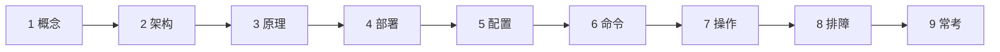
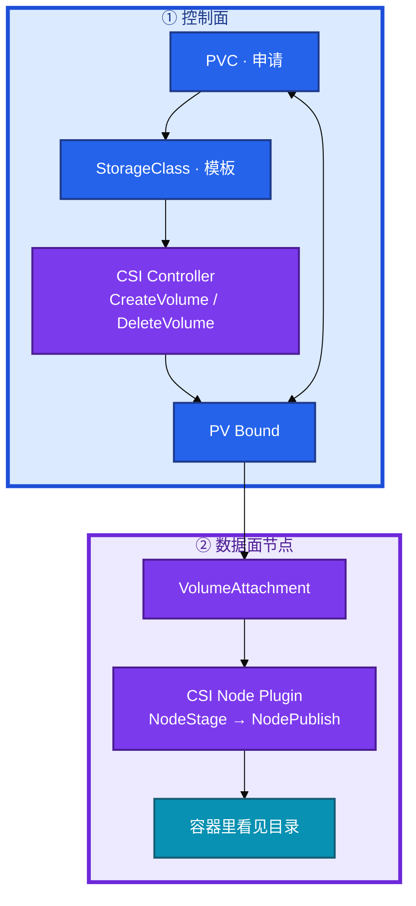
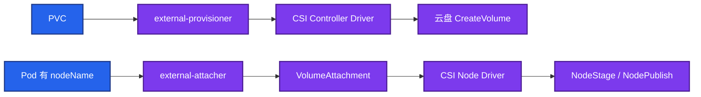
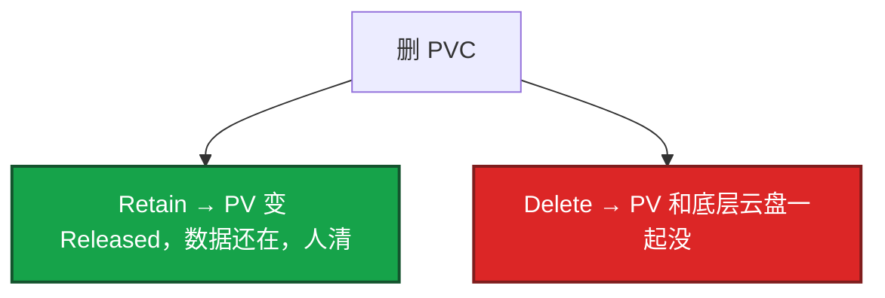
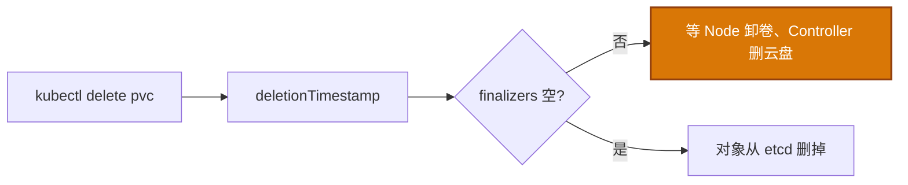
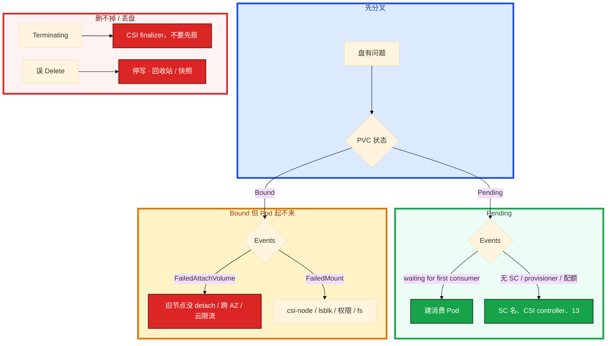

# 存储



MySQL PVC 一直 Pending，Events 写 `waiting for first consumer`。有人说 CSI 挂了。另一边有人清理「无用 PVC」，生产 SC 是 Delete，云控制台盘没了。群里要立刻把业务拉起来。还有人准备 `kubectl patch` 把 finalizers 抠掉。

先别动手。这一章后半全是你会动手的：**Pending 怎么对 Events、Retain 误删怎么复盘、Terminating 先查 CSI、扩容后怎么对 df。** 前面的 PV/PVC/SC/CSI，是为了让你动手时不把申请当成盘、不把 Delete 当成「只删对象」。

**读完你能：** 白板上画出 PVC → SC → CSI → PV Bound → NodePublish；RWO 多副本抢盘能一口回；生产 Retain；WFFC 不是故障。

## 本章目录

缩进 = 上下级。3 下面才是 3.1。

想钉在**正文左边**跟着滚：菜单 **查看 → 打开视图 → 大纲**。Markdown 预览做不到独立左栏，目录只能写在文章开头。

- [1. 基本概念](#1-基本概念)
- [2. 架构图](#2-架构图)
- [3. 原理](#3-原理)
  - [3.1 绑定与 WFFC](#31-绑定挂载与-waitforfirstconsumer)
  - [3.2 RWO vs RWX](#32-rwo-vs-rwx)
  - [3.3 回收与 STS](#33-回收丢盘与-sts-缩容)
  - [3.4 CSI 与 finalizer](#34-csi-两段与-finalizer)
- [4. 安装部署](#4-安装部署)
- [5. 核心配置](#5-核心配置)
- [6. 常用命令](#6-常用命令)
- [7. 常用操作](#7-常用操作)
  - [7.1 扩容](#71-pvc-扩容)
  - [7.2 误删复盘](#72-误-delete-复盘)
  - [7.3 Terminating](#73-terminating)
  - [7.4 静态导入](#74-静态-pv-导入)
- [8. 生产排障](#8-生产排障)
- [9. 必会 · 常考](#9-必会--常考)
- [合上书](#合上书问自己)

**本章不讲：** 调度、拓扑、AZ → [06](../06-调度机制/)；节点 drain、本地盘、运行时 → [16](../16-节点运行时与升级/)；对象 Terminating 的通用机制 → [01](../01-集群架构/)；游戏回档流程、RPO 运营 → [08-07](../../08-游戏运维专题/07-玩家数据备份与回档/)；配额把 PVC 卡住 → [13](../13-RBAC与安全/)；GitOps 怎么管 YAML → [22](../22-GitOps-ArgoCD与Tekton/)。

---

## 1. 基本概念

应用不直接点云盘。它只认 **PVC 名字**。谁去真的建盘、挂到节点，是 CSI。大厅 STS 的 YAML 里只有 `volumes.persistentVolumeClaim.claimName: data-hall-0`，没有云盘 ID。

| 对象 | 干什么 |
|------|--------|
| **PVC** | 我要什么：容量、RWO/RWX、用哪个 SC |
| **PV** | 集群里这块实际卷（静态人预建，或动态被 provisioner 建出来） |
| **StorageClass** | 按什么规格自动建：provisioner 名、参数、ReclaimPolicy、VolumeBindingMode |
| **CSI Controller** | CreateVolume / DeleteVolume、ControllerPublish（attach） |
| **CSI Node Plugin** | NodeStage → NodePublish，目录出现在容器里 |

绑定要匹配：容量（PV ≥ PVC）、accessMode、storageClassName、volumeMode。**一对一**。应用只引用 PVC 名，不写云盘 ID。

静态 PV 适合：已有盘导入、特殊盘不走 provisioner、误删后把回收站里的盘重新 import。日常不要手工堆 PV——多 AZ 和扩容时一定会崩。Released 清 `claimRef` 再绑，属于静态补救，不是日常路径。

> **记住**：应用只认 PVC 名；CSI 建盘、挂盘；SC 是模板不是盘。

---

## 2. 架构图

先把整张图钉住。后面安装、命令、排障都对着这张图说话。



CSI 常见 sidecar（面试能点名即可，不必背参数）：external-provisioner、attacher、resizer、snapshotter、livenessprobe、node-driver-registrar。Controller 挂了：新盘建不出、删不掉（Pending / Terminating）。Node Plugin 挂了：本节点 FailedMount，已经挂上的盘不一定立刻掉。

CSI 调用链（控制面一次建盘，数据面一次挂载）：



sidecar 各管一段：provisioner 看 PVC 调 CreateVolume；attacher 看 VolumeAttachment 调 ControllerPublish；resizer 看 PVC 扩容；snapshotter 看 VolumeSnapshot；node-driver-registrar 向 kubelet 注册；livenessprobe 探驱动。面试点名即可，排障按「卡在 Bound 前还是挂载」选日志，不要六份一起翻。

`kubectl get csidriver` 先确认驱动在不在，再翻 provisioner 日志。

SC 不是盘，是模板。生产至少看这几项：

```yaml
apiVersion: storage.k8s.io/v1
kind: StorageClass
metadata:
  name: cloud-ssd-retain
provisioner: diskplugin.csi.example.com
reclaimPolicy: Retain
volumeBindingMode: WaitForFirstConsumer
allowVolumeExpansion: true
parameters:
  type: cloud_ssd          # IOPS / 吞吐跟这里走，不跟 PVC 的 Gi
  fstype: ext4
allowedTopologies:
- matchLabelExpressions:
  - key: topology.kubernetes.io/zone
    values: ["cn-hangzhou-a", "cn-hangzhou-b"]
```

`parameters` 是厂商方言：云盘类型、加密、吞吐。PVC 只声明 Gi，日志盘和 DB 盘不要共用一个「便宜 HDD」SC，就是因为参数绑在这里。`allowedTopologies` / CSI `topologyKeys` 让 WFFC 知道「这个 AZ 才能建」。`volumeMode: Block` 给要裸盘的库，绑定时也要和 PV 一致；默认 Filesystem。

---

## 3. 原理

原理只保留动手和面试会用到的：为什么 WFFC、为什么云盘不能多人抢、Delete 为什么毁数据、Terminating 为什么先查 CSI。

**本节 4 块：** 3.1 绑定 · 3.2 RWO · 3.3 回收 · 3.4 CSI/finalizer

### 3.1 绑定、挂载与 WaitForFirstConsumer

动态供给常见路径：PVC Pending → SC.provisioner → CSI CreateVolume → 云盘出现 → PV Bound → Pod 调度到节点 → NodeStage / NodePublish → 容器里看见目录。

云盘跟 AZ。**WaitForFirstConsumer（WFFC）**：等 Pod 落到某个节点 / AZ，再在该拓扑建盘。Immediate 会先在 A 区建盘，Pod 调到 B 区永远 `FailedAttachVolume`。本地盘、拓扑感知同样需要 WFFC。

| 卡在 | 你看到的 | 先看 |
|------|----------|------|
| 还没消费 Pod | PVC Pending，`waiting for first consumer` | **不是故障**，把 STS/Pod 建出来 |
| provisioner | PVC Pending，无 waiting | SC 名、CSI controller、配额（13） |
| 盘在错的 AZ | FailedAttachVolume | WFFC vs Immediate、旧节点没 detach |
| 本机没挂上 | FailedMount | csi-node、lsblk、权限、文件系统 |
| 删不掉 | Terminating | CSI finalizer，不要先抠 |

RWO 从节点 A 迁到 B：先 detach 再 attach，有中断。本地盘更绑死节点——drain 前必须迁，和节点同生共死（16）。游戏服切节点要接受这段中断，不要当零停机。强删旧 Pod 有时仍要等云侧 detach 超时。

volumeMode：Filesystem 常见；Block 给要裸盘的库。绑定时也要匹配。

> **记住**：WFFC 等 Pod 落点再在该 AZ 建盘；Immediate 会跨区 FailedAttach。`waiting for first consumer` 去建 Pod，不是先重启 CSI。

### 3.2 RWO vs RWX

| 模式 | 含义 | 典型后端 |
|------|------|----------|
| ReadWriteOnce（RWO） | **单节点**读写 | 云盘（EBS / 云盘） |
| ReadWriteMany（RWX） | **多节点**同时挂 | NFS / EFS / CephFS |
| ReadOnlyMany（ROX） | 多节点只读 | 镜像盘、配置盘 |
| ReadWriteOncePod | 整个集群只有一个 Pod 能挂（比 RWO 更严） | 1.22+ 防双挂 |

Deployment `replicas: 3` + 同一块 RWO 云盘：一个 Running、两个一直 Pending，Events 写盘已被占用。不要把云盘 SC 的 accessMode 改成 RWX 幻想会变共享——后端不支持，YAML 改了也挂不上。

一人一盘走 **StatefulSet `volumeClaimTemplates`** → `data-<sts>-N`。共享文件才上 RWX。排障「两个 Pod 抢盘」看 RWO vs ReadWriteOncePod。战斗回放要多副本同时写一份文件：真正的共享走 RWX 或对象存储。

PVC 只声明 Gi，IOPS / 吞吐跟云盘规格和 SC 参数绑定。游戏日志盘和 DB 盘不要共用一个「便宜 HDD」SC。

战斗热状态在内存里，emptyDir / 共享 NFS 都救不了杀进程。该走的是「不杀对局」的发布约束（15），不是上 RWX。emptyDir：随 Pod 删。drain 带 `--delete-emptydir-data` 会丢。有状态不要靠它当存档盘。

> **记住**：云盘是 RWO，Deployment 多副本抢一块只会有一个 Running。

### 3.3 回收、丢盘与 STS 缩容

删 PVC 实际发生的取决于 SC 的 ReclaimPolicy：



测试用 Delete 图省事。生产库、战斗回放盘必须 **Retain** + 备份（快照 / Velero）。删 PVC ≠ 同意毁数据。Released 的 PV 不能直接再绑，要清 `claimRef` 才能复用，或删 PV 留云盘再静态导入。

**丢失盘的复盘顺序：**

1. 确认 ReclaimPolicy 和谁删了 PVC。
2. 看云控制台盘是否进回收站 / 有没有快照。
3. 最后才谈从备份回档。

不要在空 PVC 上把业务拉起来当「修复成功」。游戏回档：RPO 看快照频率，不是看 PVC Bound。先停服再挂旧盘，避免双写。

VolumeSnapshot 是 **盘级**崩溃一致，不是应用一致。对象链：VolumeSnapshotClass → VolumeSnapshot → VolumeSnapshotContent（类似 SC / PVC / PV）。MySQL 要先 flush 或停写，否则回档出来走崩溃恢复。游戏道具库同理。从快照恢复通常是「新 PVC 用 dataSource 指向 Snapshot」，不是原地改正在挂的盘。K8s 只提供「挂旧盘 / 从快照建新 PVC」的能力，运营回档流程见 08-07。Velero 一类工具也是在这层之上做编排，原理仍是快照 + PVC 绑定。

CSI 扩容后文件系统不一定自动长。ext4 常见要 `resize2fs`；xfs 要 `xfs_growfs` 且只能在挂载点上做。有的云盘 CSI 会在 Node 阶段自动 resize，有的不会——所以 **扩完必须对 df**，不能只看 PVC capacity。Block 模式没有文件系统这一层，扩的是裸设备大小，应用自己认。

STS：每个 ordinal 一块盘。扩容出新 PVC。缩容 **不会自动删** 高序号 PVC——防止误删数据，也防止你以为缩容释放了费用。删 STS 默认不级联删 PVC。要释放费用必须显式删 PVC；Retain 还要再删云盘。这是预期，不是泄漏。

> **记住**：生产 Retain；Delete 删 PVC 会毁云盘；STS 删了默认留盘。

### 3.4 CSI 两段与 finalizer

删对象时先打 `deletionTimestamp`，列表里的 finalizer 没摘完会一直 **Terminating**。PVC / PV / VolumeAttachment 都靠它等 CSI 卸卷、删云盘。这和 01 里 Namespace / 普通对象的 Terminating 是同一条机制。



生产手抠 finalizer = 告诉 API「外部已经清完了」。如果云盘还在，会留孤儿盘；如果卷还挂着，可能脏数据。先确认外部已无、业务允许，再补救，**留变更记录**。不要作为第一反应。

Namespace 一直 Terminating，往往是 NS 里还有带 finalizer 的 PVC / 云资源。先列这个 NS 里卡死的资源，不要先删 NS 对象本身。

> **记住**：Terminating 先看 CSI finalizer，不要随手抠。

---

## 4. 安装部署

生产默认动态 SC + CSI，按需建、少人工。云厂商 CSI 驱动通常是 Deployment（controller）+ DaemonSet（node）。

| 项 | 选 | 不选 |
|----|----|------|
| 供给 | 动态 SC + CSI | 手工堆 PV |
| 验收 | `get sc,csidriver`；建一个测试 PVC 能 Bound 并挂上 | 只看 CSI Pod Running |
| 静态 | 导入旧盘、误删恢复 | 日常每块盘手工建 PV |

托管 ACK / EKS 自带云盘 SC。自建要自己装对应 CSI。WFFC 要在 SC 上写明，不是 PVC 上临时想。

验收不要只看 CSI Pod Running。最小闭环：建一个测试 PVC + 消费 Pod，等到 Bound 且容器内 `df` 看见目录，再删（Retain 的 SC 还要记得清 PV / 云盘，别用生产 SC 做实验）。CSI controller 副本 ≥2，但 CreateVolume 是按 PVC 串行的，加副本不等于建盘变快。node plugin 是 DS，某节点 csi-node NotReady，只有调度到那台的挂载会 FailedMount，别的节点不受影响。

云 API 限流是 FailedAttach 的常客：短时间大量 attach/detach（滚动有状态、抢节点）会打满厂商配额。表现像「K8s 挂载坏了」，Events 里往往有 cloud provider / CSI timeout。先看云控制台 attachment 和限流，不要连环强删 Pod。

---

## 5. 核心配置

| 项 | 选 | 不选 |
|----|----|------|
| 回收 | 生产 **Retain** | 生产 Delete |
| 云盘 | **WFFC** + 拓扑 | Immediate 跨区赌 |
| 扩容 | `allowVolumeExpansion` | 满了才发现不能扩 |
| 备份 | 快照 + 应用一致（先停写 / 刷盘） | 只靠盘，不管 DB 事务 |
| 游戏 | 回档盘、日志盘分 SC；热数据别全扔 RWX NFS | 战斗状态只活在 emptyDir |
| 规格 | SC 参数绑 IOPS / 吞吐 | PVC 只写 Gi 就以为够 |

PVC 扩是 **单向** 的。文件系统层有的 CSI 自动 resize，有的要进容器 `resize2fs` / `xfs_growfs`。**不能缩容**是常态；要缩只能新盘 + 拷数据。扩完看 PVC capacity 和容器内 `df` 是否一致——只改了 PVC、文件系统没长，应用仍会写满。

挂载权限：`securityContext.fsGroup` 让 kubelet 把卷属组改成该 gid，非 root 容器才能写。缺了表现为 Permission denied，Events 不一定点名 PVC。`mountOptions` 写在 SC 或 PV 上（如 NFS `vers=4.1`），写错会 FailedMount。这些是节点挂载问题，不是 provisioner 没建盘。

> **记住**：生产 Retain；云盘 WFFC；扩完要对 df。

---

## 6. 常用命令

```bash
kubectl get sc,pvc,pv,csidriver,volumeattachment
kubectl describe pvc <n> -n <ns>     # Events 比 get 有用
kubectl get events -n <ns> | grep -iE 'mount|attach|provision'
kubectl logs -n kube-system -l app=csi-provisioner --tail=30
```

| 目的 | 命令 | 看什么 |
|------|------|--------|
| 卡在哪 | `describe pvc` | waiting for first consumer / no SC / 配额 |
| 盘到没到机 | `get volumeattachment`；云控制台 attachment | FailedAttach vs FailedMount |
| 本机 | 节点 `lsblk`；csi-node 日志 | 挂载点、权限 |
| 扩容 | `kubectl patch pvc` + 容器内 `df` | capacity 和 df 一致 |
| finalizer | `kubectl get pvc -o yaml` | deletionTimestamp、metadata.finalizers |
| 驱动 | `get csidriver` | 先确认在不在 |

扩容示意：

```bash
kubectl patch pvc data --type merge -p '{"spec":{"resources":{"requests":{"storage":"100Gi"}}}}'
```

---

## 7. 常用操作

### 7.1 PVC 扩容

1. 确认 SC `allowVolumeExpansion: true`。
2. patch PVC 容量（只能变大）。
3. 看云盘是否真的变大（控制台 / CSI 日志 `ControllerExpandVolume`）。
4. 进容器 `df`；必要时 `resize2fs` / `xfs_growfs`。
5. PVC capacity 和 `df` 不一致 = 只扩了对象，文件系统没长。

在线扩可以，但高峰给 DB 盘扩仍可能卡在文件系统 resize。给窗口。扩完不缩——别承诺财务「先扩再缩回去」。

### 7.2 误 Delete 复盘

1. 停一切写，不要对空盘恢复业务。
2. 云控制台：回收站 / 快照还在不在。
3. 有快照再回档；没有就按 RPO 谈损失。
4. 演练环境用 Delete 防垃圾；生产误用过的，要改 SC 并审计已有 PV。

RPO 不看 PVC Bound。Bound 只说明挂上了。RPO 看快照频率和应用是否刷盘。

### 7.3 Terminating

先看 `deletionTimestamp` 和 `metadata.finalizers`。有 CSI finalizer 就表示控制器还在卸卷、删云盘。查 csi-controller、csi-node、云 API 删盘是否失败。手抠是最后补救，留变更记录。

### 7.4 静态 PV 导入

Released 清 `claimRef` 再绑，或删 PV 留云盘再静态导入。属于误删恢复 / 迁云导入，不是日常路径。

静态 PV 必须手写 `volumeHandle` / 云盘 ID、accessMode、capacity ≥ PVC。WFFC 对静态盘同样有意义：PV 上的 `nodeAffinity` / zone label 要对消费 Pod，否则 Bound 了仍 FailedAttach。import 完用测试 Pod 挂一次再交给业务，避免「对象 Bound、目录是空的」。

PV 的 `persistentVolumeReclaimPolicy` 可以和 SC 不一致——对象上写了什么算什么。从 Delete SC 建出来的旧 PV，生产要改成 Retain 得 patch 已有 PV，只改 SC 不会回溯。

查日志按卡点选 sidecar，不要六份一起翻：

| 卡点 | 先看 |
|------|------|
| PVC 不 Bound | provisioner / CreateVolume |
| FailedAttach | attacher / VolumeAttachment / 云 API |
| FailedMount | 该节点 csi-node / NodePublish |
| 扩容 df 不变 | resizer 然后容器内 resizefs |
| 快照 | snapshotter |

---

## 8. 生产排障

Pending 看 Events；挂不上分 attach/mount；扩完要对 df。



| 现象 | 先做什么 | 不要做什么 |
|------|----------|------------|
| PVC Pending | describe Events | 一上来重启 CSI |
| waiting for first consumer | 建消费 Pod | 当故障 |
| FailedAttachVolume | 盘还挂在旧节点、跨 AZ、云 API 限流 | 当零停机切节点 |
| FailedMount | CSI node、权限、文件系统、lsblk | 和 Attach 当成一回事 |
| 删 STS 数据还在 | 预期；要删 PVC 才动盘 | 当泄漏 |
| 一直 Terminating | 看 finalizer 对应哪个 CSI | 先手抠 |
| 误 Delete | 停一切写，看云回收站 / 快照 | 对空盘恢复业务 |
| 两个副本抢盘 | RWO + 同一 PVC | 把云盘 SC 改成 RWX |
| 扩完仍写满 | 容器内 df / resizefs | 只看 PVC capacity |

回档盘要 Retain + 快照；战斗热状态不要指望 emptyDir 或 RWX NFS 救命。性能：节点本地盘快但和节点同生共死。

---

## 9. 必会 · 常考

白板和追问高频，能一口回：

| 说法 | 对错 | 口径 |
|------|:----:|------|
| 应用 YAML 应写云盘 ID | 错 | 只认 PVC 名 |
| SC 就是一块盘 | 错 | 模板，provisioner 按需建 |
| RWO 云盘可以 3 副本一起写 | 错 | 单节点；两人抢只会一个 Running |
| 改 accessMode 成 RWX 云盘就共享了 | 错 | 后端不支持挂不上 |
| 生产 Delete 更省事 | 错 | 删 PVC 毁云盘；生产 Retain |
| RPO 看 PVC Bound | 错 | 看快照频率和应用是否刷盘 |
| waiting for first consumer 是 CSI 挂了 | 错 | WFFC 在等消费 Pod |
| Immediate 更早建盘所以更好 | 错 | 云盘跟 AZ，会跨区 FailedAttach |
| Terminating 先抠 finalizer | 错 | 先查 CSI；抠了可能孤儿盘 / 脏数据 |
| 删 STS 会级联删 PVC | 错 | 默认不删，防误删数据 |
| 缩容 STS 会释放云盘费用 | 错 | 高序号 PVC 还在 |
| PVC 能缩容 | 错 | 单向；要缩只能新盘 + 拷 |
| VolumeSnapshot 可直接当 MySQL 回档 | 错 | 盘级一致；要先 flush / 停写 |
| CSI Controller 挂了已挂上的盘立刻掉 | 错 | Node Plugin 管本机挂载 |
| 战斗状态放 RWX NFS 就能杀进程 | 错 | 热状态在内存；见 15 |

易混：Pending（WFFC）vs Pending（没 provisioner）；FailedAttach vs FailedMount；Retain vs Delete；RWO vs RWX vs ReadWriteOncePod；Controller vs Node Plugin；动态 vs 静态。

---

## 合上书，问自己

1. PVC / PV / SC / CSI Controller / Node Plugin 各干什么？应用为什么只写 PVC 名？
2. WFFC 解决什么？`waiting for first consumer` 是故障吗？
3. RWO 三副本挂一块云盘会怎样？STS volumeClaimTemplates 解决什么？
4. 生产为什么 Retain？误 Delete 复盘三步？RPO 看 Bound 吗？
5. Terminating 先看什么？为什么不能随手抠 finalizer？
6. 扩容后为什么还要对 df？删 STS / 缩容为什么盘还在？

六题都能口述，这一章就过了。下一章把配置和密钥剖开：Secret 默认不是加密，静止加密是 API Server 的 EncryptionConfiguration。
