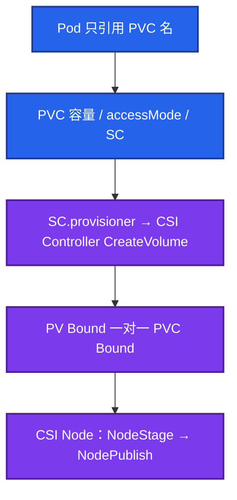

# 11｜存储 · 练习题

先自己画图或口述，再对照解答。每题标了覆盖范围：

| 标记 | 含义 |
|------|------|
| **核心** | 不懂整章就没建立起来 |
| **必会** | 值班和面试都要能讲 |
| **常用** | 线上会反复碰到 |
| **常考** | 白板和追问的高频口径 |

## 本题目录

- [Q1 PV PVC SC CSI](#q1)
- [Q2 RWO vs RWX](#q2)
- [Q3 Retain / 误 Delete](#q3)
- [Q4 Terminating / finalizer](#q4)
- [Q5 Pending / WFFC](#q5)
- [Q6 FailedAttach](#q6)
- [Q7 STS 缩容留盘](#q7)
- [Q8 扩容 / 快照](#q8)
- [Q9 动态 vs 静态](#q9)
- [Q10 战斗状态 / 回档盘](#q10)
- [合上书](#合上书)

---

## Q1

**★★★★★｜PV / PVC / StorageClass / CSI 各干什么？画一下从申请到挂上。**

**覆盖**：核心 · 必会 · 常考

### 场景

开场问：「应用 YAML 为什么只写 PVC 名？盘是谁建的？」有人把 PV 和 PVC 背反了。

### 完整解答

PVC 是申请，PV 是实际卷，SC 是动态供给模板。CSI 分控制面建盘和节点挂载。



动态：PVC → Provisioner → 云盘 → PV Bound。静态：人先建 PV 再匹配。绑定要容量、模式、SC 名一致。应用能用静态 PV 写云盘 ID，但生产默认走动态 SC。换云厂商才不用改业务 YAML。

### 再追问

- CSI Controller 和 Node Plugin 谁挂了分别怎样？——Controller 挂：新盘建不出、删不掉。Node Plugin 挂：本节点 FailedMount，已经挂上的盘不一定立刻掉。

---

## Q2

**★★★★★｜RWO 和 RWX？Deployment 3 副本挂一块云盘会怎样？**

**覆盖**：核心 · 必会 · 常考

### 场景

大厅 Deployment 扩到 3，共用一块 EBS 风格的 RWO 盘。两个副本一直 Pending。有人把 SC 的 accessMode 改成 RWX。

### 完整解答

RWO：单节点读写，云盘典型。RWX：多节点，需要 NFS / EFS / CephFS。云盘不会因为你改 YAML 就变成共享文件系统。

```
replicas=3 + 同一 PVC（RWO）
  Pod-0 Running（盘挂在 node-0）
  Pod-1 / Pod-2 Pending
```

一人一盘用 STS `volumeClaimTemplates`。排障「两个 Pod 抢盘」再看 ReadWriteOncePod（比 RWO 更严，整个集群只有一个 Pod）。战斗回放要多副本同时写一份文件：真正的共享走 RWX 或对象存储。不要幻想改 accessMode。

### 再追问

- PVC 只写了 100Gi，IOPS 一定够吗？——不一定。IOPS / 吞吐跟云盘规格、SC 参数绑定。日志盘和 DB 盘不要共用便宜 HDD SC。

---

## Q3

**★★★★★｜生产 ReclaimPolicy 为什么用 Retain？误 Delete 怎么复盘？**

**覆盖**：核心 · 必会 · 常考

### 场景

有人清理「无用 PVC」，生产 SC 是 Delete。云控制台盘没了。群里要立刻把业务拉起来。

### 完整解答

Delete：删 PVC = 删 PV = 删底层盘。Retain：PV 变 Released，数据还在，人清。生产库、回放盘必须 Retain + 备份。删申请不等于同意毁数据。

```
误删 PVC（Delete）
  1. 停一切写，不要对空盘恢复业务
  2. 云控制台：回收站 / 快照还在不在
  3. 有快照再回档；没有就按 RPO 谈损失
```

Released 的 PV 不能直接再绑，要清 `claimRef` 或删 PV 留云盘再静态导入。演练环境用 Delete 防垃圾；生产误用过的，要改 SC 并审计已有 PV。RPO 不看 PVC Bound。Bound 只说明挂上了。游戏回档流程见 08-07。

### 再追问

- VolumeSnapshot 能直接当 MySQL 回档吗？——不能当应用一致。盘级崩溃一致；要先 flush 或停写。先停服再挂旧盘，避免双写。

---

## Q4

**★★★★★｜PVC 一直 Terminating，能不能 kubectl 把 finalizer 抠掉？**

**覆盖**：核心 · 必会 · 常考

### 场景

PVC 删了十分钟还在。有人准备 `kubectl patch` 把 finalizers 置空。节点上盘可能还挂着。

### 完整解答

先看 `deletionTimestamp` 和 `metadata.finalizers`。有 CSI finalizer 就表示控制器还在卸卷、删云盘。控制器挂了会永远 Terminating。这和 01 里对象删不掉是同一条机制。

```
delete → deletionTimestamp → finalizers 空?
                              否 → 查 CSI Node / Controller / 云 API
                              是 → etcd 里删除
```

手抠 = 告诉 API「外部已经清完了」。云盘还在会留孤儿；卷还挂着可能脏数据。先确认外部已无、业务允许，再补救，**留变更记录**。不要作为第一反应。

Namespace 一直 Terminating：往往是 NS 里还有带 finalizer 的 PVC。先列这个 NS 里卡死的资源，不要先删 NS 对象本身。

### 再追问

- VolumeAttachment 卡住呢？——同一类：数据面还没 detach 完。看云控制台 attachment 和 csi-attacher，不要先抠 PVC。

---

## Q5

**★★★★☆｜PVC 一直 Pending 怎么查？waiting for first consumer 是故障吗？**

**覆盖**：必会 · 常用 · 常考

### 场景

新 PVC Pending。Events 有 `waiting for first consumer`。有人说 CSI 挂了。

### 完整解答

describe Events，对层：

- 无 SC / provisioner 挂 / 配额 / 无匹配静态 PV → 真故障
- `VolumeBindingMode=WaitForFirstConsumer` 等消费 Pod 被调度到某 AZ 再建盘 → **正常**，去建 Pod

WFFC 解决的是：Immediate 先在 A 区建盘，Pod 调到 B 区永远 FailedAttach。云盘跟 AZ，本地盘跟节点。`get sc,pv` + provisioner 日志。WFFC 先建 Pod，不是先重启 CSI。

### 再追问

- 为什么 WFFC 存在？——盘和 Pod 必须同拓扑。Immediate 是在赌调度结果。

---

## Q6

**★★★★☆｜FailedAttachVolume 常见原因？游戏服切节点为什么会中断？**

**覆盖**：必会 · 常用

### 场景

drain 一个节点后新 Pod FailedAttachVolume。旧节点上 VolumeAttachment 还在。

### 完整解答

常见：旧节点没 detach 完、跨 AZ、云盘 API 限流、节点 CSI 挂了。RWO 云盘同一时刻只能挂一个节点。

```
旧 Pod 还在 node-A（或附件没摘干净）
        → 新 Pod 在 node-B 等 attach → FailedAttachVolume
```

看云控制台 attachment。强删旧 Pod 有时仍要等云侧超时。游戏服切节点要接受这段中断，不要当零停机。

FailedAttach：盘还没挂到这台机。FailedMount：已经到机了，CSI node / 权限 / 文件系统 / lsblk 有问题。

### 再追问

- 本地盘呢？——更绑死节点，drain 前必须迁，和节点同生共死（16）。

---

## Q7

**★★★★☆｜删 StatefulSet 为什么盘还在？缩容会释放费用吗？**

**覆盖**：必会 · 常用

### 场景

STS 从 5 缩到 2。财务问为什么云盘还是 5 块。有人再删了 STS 对象，PVC 还在。

### 完整解答

默认不级联删 PVC，防误删数据。缩容 **不会自动删** 高序号 PVC。要释放费用必须显式删 PVC；Retain 还要再删云盘。这是预期，不是泄漏。扩容会出新的 `data-<sts>-N`。一人一盘的模型就是这样。

emptyDir 不能当游戏存档盘。Pod 删或 drain `--delete-emptydir-data` 就没了。存档走 PV 或对象存储。

### 再追问

- 要释放费用的正确顺序？——确认业务不要这块数据 → 显式删 PVC → Retain 再去云控制台删盘。

---

## Q8

**★★★★☆｜PVC 能扩容吗？能不能缩？快照能直接当 MySQL 回档吗？**

**覆盖**：必会 · 常用

### 场景

盘 90%。SC 开了 allowVolumeExpansion。有人 patch 完以为立刻能缩回去省钱。DBA 拿 VolumeSnapshot 直接挂去当回档。

### 完整解答

扩是单向的。文件系统层有的 CSI 自动 resize，有的要进容器 `resize2fs`。不能缩是常态；要缩只能新盘 + 拷数据。扩完看 PVC capacity 和容器内 `df` 是否一致。

VolumeSnapshot 是 **盘级**。MySQL 要先 flush 或停写，否则出来是崩溃恢复。游戏回档：先停服再挂旧盘，避免双写。K8s 只提供挂盘能力，流程在 08-07。Velero 原理仍是快照 + PVC 绑定。

### 再追问

- 只改了 PVC、文件系统没长会怎样？——应用仍会写满。要对 df。

---

## Q9

**★★★★☆｜动态供给和静态 PV 怎么选？**

**覆盖**：必会 · 常用

### 场景

从机房迁云。有人坚持每块盘手工建 PV「更可控」。

### 完整解答

生产默认动态 SC + CSI，按需建、少人工。静态适合：已有盘要导入、特殊盘不走 provisioner、误删后把回收站里的盘重新 import。手工堆 PV 会在扩容和多 AZ 时崩。能讲清「Released 清 claimRef 再绑」属于静态补救，不是日常路径。

sidecar 能点名即可：provisioner、attacher、resizer、snapshotter、node-driver-registrar。

### 再追问

- `kubectl get csidriver` 没有驱动还 describe PVC？——先确认驱动在不在，再翻 provisioner 日志。

---

## Q10

**★★★★☆｜战斗状态能不能只活在 emptyDir，回档盘用什么 SC？**

**覆盖**：必会 · 常考

### 场景

有人说战斗服是有状态的，所以必须 RWX NFS，把房间状态放共享盘。

### 完整解答

战斗热状态在内存里，emptyDir / 共享 NFS 都救不了杀进程。该走的是「不杀对局」的发布约束（15），不是上 RWX。

回档盘、日志盘分 SC：回档要 Retain + 快照；日志要吞吐，不一定要 RWX。热数据别全扔 NFS。本地盘快但和节点同生共死，drain 前必须迁（16）。

### 再追问

- 那有状态库的盘怎么挂？——STS + volumeClaimTemplates + RWO 云盘 + WFFC + Retain。一人一盘，不是 Deployment 抢一块。

---

## 合上书

- [ ] 能画出 PVC → SC → CSI Controller → PV Bound → NodePublish
- [ ] 能说出 RWO 三副本抢盘只会一个 Running；一人一盘用 STS
- [ ] 能讲生产 Retain；误 Delete 停写 → 回收站 / 快照 → 再回档
- [ ] 能区分 WFFC 等待消费 Pod vs 真的 provisioner 故障
- [ ] 能分 FailedAttach / FailedMount；Terminating 先查 CSI 不先抠
- [ ] 能讲扩容单向要对 df；STS 删了默认留盘；战斗热状态不靠 NFS
