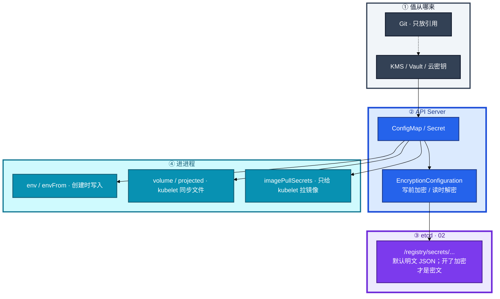
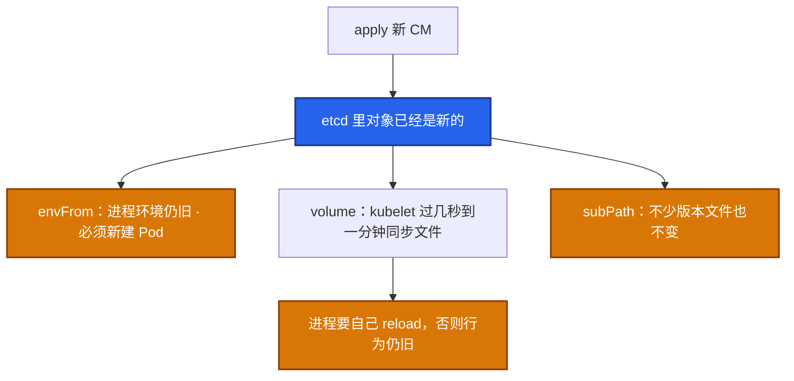
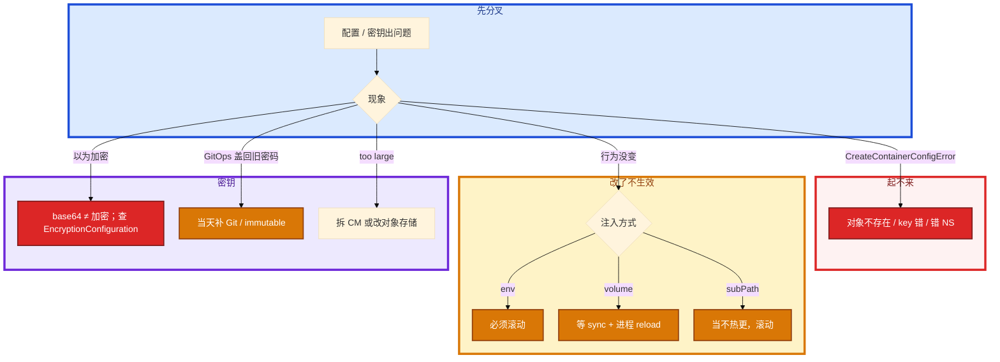

# 配置与密钥


值班把数据库密码放进 Secret，以为「K8s 加密了」。你 `kubectl get secret -o yaml` 再 `base64 -d` 就是明文。etcd 那章已经说了：Secret 进 etcd **默认是明文 JSON**，静止加密是 API Server 的 `EncryptionConfiguration`。群里另一次是改了 ConfigMap，支付开关没变——YAML 是 envFrom。

先别动手。这一章后半全是你会动手的：**怎么开静止加密、怎么轮换密钥、env 改了怎么滚动、CreateContainerConfigError 先看引用。** 前面的注入方式和 base64，是为了让你动手时不把 Secret 当保险箱、不把热更新幻想成改完立刻变。

**读完你能：** 白板上画出 CM/Secret → etcd → 三种注入；能讲 EncryptionConfiguration 链；轮换走新对象；大表不进 etcd。

## 本章目录

缩进 = 上下级。3 下面才是 3.1。

想钉在**正文左边**跟着滚：菜单 **查看 → 打开视图 → 大纲**。Markdown 预览做不到独立左栏，目录只能写在文章开头。

- [1. 基本概念](#1-基本概念)
- [2. 架构图](#2-架构图)
- [3. 原理](#3-原理)
  - [3.1 三种注入](#31-三种注入热更新各不相同)
  - [3.2 Secret 不是保险箱](#32-secret-不是保险箱)
  - [3.3 EncryptionConfiguration](#33-encryptionconfiguration静止加密)
  - [3.4 游戏热更](#34-游戏热更-cm-只适合当指针)
- [4. 安装部署](#4-安装部署)
- [5. 核心配置](#5-核心配置)
- [6. 常用命令](#6-常用命令)
- [7. 常用操作](#7-常用操作)
  - [7.1 开静止加密](#71-开静止加密)
  - [7.2 轮换密钥](#72-轮换-encryption-key)
  - [7.3 密码轮换](#73-业务密码轮换)
  - [7.4 标准变更](#74-配置变更标准动作)
- [8. 生产排障](#8-生产排障)
- [9. 必会 · 常考](#9-必会--常考)
- [合上书](#合上书问自己)

**本章不讲：** etcd 磁盘、quorum、直连禁令 → [02 etcd](../02-etcd/)（02 只点到「静止加密在 12」）；RBAC 少给 get secret、PSS 读文件权限 → [13](../13-RBAC与安全/)；镜像仓库 401、containerd → [16](../16-节点运行时与升级/)；Helm values、checksum 模板 → [21](../21-Helm与Kustomize/)；GitOps 同步把热修盖回去 → [22](../22-GitOps-ArgoCD与Tekton/)；热更 / 灰度发布单 → [15](../15-灰度与回滚/)、08-03。Vault / KMS **产品怎么搭**不在本库单开。

---

## 1. 基本概念

ConfigMap 放非敏感，Secret 放敏感——**两者都进 etcd**。Secret 默认只是 **base64，不是加密**。`kubectl get secret -o yaml` 再 `base64 -d` 就是密码。etcd 未做 Encryption at Rest 时，能碰控制面数据目录 ≈ 能读所有 Secret。

单对象 **1MiB**（etcd `--max-request-bytes` 常见上限，对齐 02）。大表、技能配置不进 CM，放对象存储，CM 只留地址或版本指针。跨 NS **不能引用**，要复制或用外部同步（ExternalSecret 一类）。

| 在 CM / Secret 里 | 不在这里 |
|-------------------|----------|
| 非敏感配置 / 敏感值的对象，落 etcd | Vault 集群怎么搭 |
| 三种注入：env、volume、imagePullSecrets | Helm 模板、GitOps 流水线（21、22） |
| API Server 写 etcd 前的 EncryptionConfiguration | etcd 自己的 TLS（02） |

三个角色不要混：

| 角色 | 干什么 |
|------|--------|
| **ConfigMap / Secret** | 对象；Secret 类型 Opaque / tls / dockerconfigjson |
| **kubelet** | 把 volume 同步成文件；env 只在创建时写入 |
| **API Server EncryptionConfiguration** | 写 etcd 前加密、读时解密；**etcd 里不再是明文 JSON** |

`stringData` 提交后 API 存 `data`（base64）。Git 不要提交 stringData 明文「图省事」。base64 不是加密，进了 Git 就等于进了密码本。

> **记住**：CM/Secret 都进 etcd；Secret = base64。静止加密是 API Server 的 EncryptionConfiguration，不是 etcd 自己的开关。

---

## 2. 架构图

先把整张图钉住。后面安装、命令、排障都对着这张图说话。



图上三条线：

1. **etcd TLS ≠ 静止加密。** 02 的 peer/client 证书管的是谁能连 2379；EncryptionConfiguration 管的是盘上 / 快照里 Secret 是不是明文。
2. **能 `get secret` 就能看明文**（对 API 来说解密后给你）。RBAC 少给 get / list secrets。
3. **进进程的方式决定改了热不热。** env 必须滚动；volume 文件会变，进程要 reload。

生产不要幻想「改完立刻所有进程变了」。kubelet 同步周期常见秒到分钟级（`configMapAndSecretChangeDetectionStrategy`，常见 Cache + TTL），刚 apply 立刻 exec cat 可能还是旧文件，等一轮再判断「热更新坏了」。immutable 对象 kubelet 不再 watch 原地变更，正好配合「只发新对象」。

---

## 3. 原理

原理只保留动手和面试会用到的：三种注入、为什么 Secret 不是保险箱、EncryptionConfiguration 怎么链、大表为什么不进 CM。

**本节 4 块：** 3.1 注入 · 3.2 保险箱 · 3.3 静止加密 · 3.4 游戏热更

### 3.1 三种注入：热更新各不相同

| 方式 | 热更新 | 用途 |
|------|--------|------|
| env / envFrom | **否**，创建时写入进程环境 | 开关、简单键 |
| volume / projected | kubelet 同步文件（常见秒到分钟级） | 配置文件、证书 |
| imagePullSecrets | — | 拉私有镜像，不是业务 env |
| subPath 挂单文件 | 不少版本 **不会** 热更新 | 必须滚动 |



Helm checksum annotation / Reloader 可把「CM 变了」自动变成「滚 Pod」。checksum 在 Pod template 里，CM 一变就滚动——误改也会自动推全集群，活动中要冻结或只盯非生产。

**projected volume** 可把 CM、Secret、DownwardAPI 合成一个目录，减少挂载点。SA token 也是 projected，1.24+ Bound Token 自动轮换。老的永不过期 Secret Token 少用：泄漏后无法靠过期自愈，RCE 后长期能打 API。不需要调 API 的业务 Pod 应关掉 automount（13）。

**DownwardAPI** 把 Pod 名、NS、资源 request 注入文件或 env，给应用做日志标签，不必再配一份 CM。

Secret 类型：Opaque、`kubernetes.io/tls`（`tls.crt` / `tls.key`）、`kubernetes.io/dockerconfigjson`。volume 建议 `defaultMode: 0400`。二进制证书用 tls 类型或 `binaryData`，不要把 PEM 再 base64 一层塞进 Opaque 然后应用解两遍。

镜像拉取：`imagePullSecrets` 在 Pod 上，和业务 env 里的仓库密码不是一回事。私有仓 401 先看这个和节点 runtime 配置（16）。ImagePullBackOff：先分清 runtime 配置还是 imagePullSecrets，不要先改业务环境变量。

0400 只有属主读。容器 `runAsUser` 对不上文件属主就会 Permission denied，Events 不一定点名 Secret。对一下 uid，或把 defaultMode 调成 0440 并配 fsGroup（要评估敏感度）。不要为了省事改成 0777（13）。

> **记住**：env 必须滚动；volume 文件会变但进程要 reload；subPath 常常不热更。不要说「凡是 volume 都会热更」。

### 3.2 Secret 不是保险箱

```bash
kubectl get secret db-pass -o jsonpath='{.data.password}' | base64 -d
# 屏幕上就是明文。能 get 就能看。
```

默认路径上，能 `get secret` 就能看明文。静态加密后仍要护 encryption key。本库不单开 Vault 章——外部保险箱只是「值不进 Git、少进 etcd」这一层。不要指望单独一个 Vault 集群当银弹。

生产补丁叠在一起：

1. RBAC **少给 get / list secrets**（开发可以 list CM，Secret 只给值班和 CI 专用 SA）（13）。
2. etcd Encryption at Rest（下一节，API Server 配）。
3. Git 里只放 ExternalSecret / Sealed 一类引用，**值**在 KMS / Vault / 云密钥里。
4. 审计 `get secret`。`kubectl get secret -o yaml` 进工单要留记录。
5. immutable Secret / CM：禁止原地改，逼你发新对象再切引用。减少 kubelet 狂 watch 原地变更；审计清晰：变更 = 新对象 + 切引用。

业务密码轮换顺序必须是：

```
1. 新建 Secret（新密码）
2. 改引用（Deploy / STS）
3. 滚动完成，验证连接
4. 删旧 Secret
```

反序会有一批 Pod 仍拿旧密码打新库。反例：有人在生产 `kubectl edit secret` 改密码，Git 仍是旧的，下次同步把新密码盖回去，业务连不上还以为是 DB 挂了。immutable + GitOps 就是为了堵这条。应急可以 edit，当天必须补回 Git（01）。

1MiB 打满：etcd 写失败，apply 报 too large。拆文件或改对象存储。多个小 CM 狂更新同样打 etcd，活动开关不要每秒 apply 一次。

Reloader / checksum 自动滚动会在 CM 误改时自动把坏配置推全集群。要和发布冻结窗口一起用。

> **记住**：Secret = base64；生产叠 RBAC + etcd 加密 + 值放 KMS + 审计。

### 3.3 EncryptionConfiguration：静止加密

02 说：Secret 进 etcd 默认明文 JSON，静止加密是 API Server 的 `EncryptionConfiguration`（本章）。它发生在 **写 etcd 之前**：API Server 按 providers 列表加密 payload，etcd 里看到的是密文；读路径再解密给客户端。etcd 自己无感知。

```yaml
# EncryptionConfiguration 示意
apiVersion: apiserver.config.k8s.io/v1
kind: EncryptionConfiguration
resources:
  - resources:
    - secrets
    providers:
    - aescbc:
        keys:
        - name: key2          # 新密钥必须排第一：新写用它
          secret: <base64-32-bytes>
        - name: key1          # 旧密钥留下：还要能解密存量
          secret: <base64-old>
    - identity: {}            # 最后：解密尚未加密的旧明文
```

kube-apiserver：`--encryption-provider-config=/etc/kubernetes/enc.yaml`。改完必须 **重启所有 API Server**。只改文件不重启，进程还拿着旧链。三台配置必须同一份文件、同一条链，否则有的 API 写出密文、有的还写明文，读路径会对不上。

Stacked 控制面（02）上，这份 yaml 和证书一样跟着静态 Pod 走：改 `/etc/kubernetes/manifests/kube-apiserver.yaml` 的参数，kubelet 重建该静态 Pod。不要只改一台。

| provider | 干什么 | 生产 |
|----------|--------|------|
| `identity` | 明文 | 必须留在链尾，用来读尚未加密的旧对象；**不要放第一**（放第一 = 新写又变明文） |
| `aescbc` | AES-CBC | 常见；密钥 32 字节 |
| `aesgcm` | AES-GCM | 比 CBC 更现代 |
| `secretbox` | XSalsa20+Poly1305 | 可用 |
| `kms` / `kmsv2` | 信封加密，DEK 由 KMS 管 | 托管 / 要轮换密钥不碰静态文件时优先 |

链的规则：

1. **第一个能加密的 provider 负责新写。**
2. **整条链都能用来解密**——所以旧 key 必须留到存量都改写完。
3. **不要删仍需要解密的 provider。** 删了 = 那批 Secret 读不出来。
4. 轮换：新 key 插到列表第一 → 重启全部 API → 触发 rewrite（如 `kubectl get secrets -A -o json | kubectl replace -f -`）→ 确认存量都是新 key 再撤旧 key。
5. `identity` 放第一 = 关闭加密。备份快照里会重新出现明文 Secret。

静态加密后：etcd 快照、数据目录不再是明文密码本。但仍要护 encryption key 文件和 KMS 权限——拿到 key ≈ 能解密快照。托管 ACK / EKS 问清是否默认开、key 在谁那、谁负责轮换。

> **记住**：静止加密在 API Server，不在 etcd 进程。新 key 放第一；identity 放最后；重启全部 API；旧 key 留到 rewrite 完成。

etcd 快照一旦带着明文 Secret 流出，事后再开加密也救不回那份旧快照——旧备份仍按当时的明文 / 旧 key 理解。备份加密后的快照时，encryption key 要和快照一起按同等密级保管，否则 restore 出来 API 解不开。

### 3.4 游戏热更：CM 只适合当指针

运营要热更大厅技能表。把整张表塞进 ConfigMap 会打到 1MiB 上限，etcd 写失败。游戏热更大表、技能配置，不进 etcd。常见做法：对象存储放表 + 进程内 watch / reload，CM 只存版本号或开关。热更失败回滚的是「版本指针」，不是整份 1MiB YAML。

仅当应用 **watch 挂载文件并安全 reload** 时，才可以只改 CM 不滚动。逻辑服内存表结构变了，仍要按热更方案走，不是 K8s 自动完成。热更成功、滚动失败可以并存：脚本热更了，进程没换，下一次 Deploy 仍会杀进程。两套通道要写在同一张发布单上（15）。

配置导致业务坏：先 undo Deployment（若 checksum 在 template 里），或回上一版 CM。volume 型也要确认进程真的 reload 了，否则当发布流程做滚动。

> **记住**：大表放对象存储，CM 放指针；热更 ≠ 滚动，两套通道写一张单。

---

## 4. 安装部署

CM / Secret 是 API 内置资源，不用单独装。要装的是静止加密、ExternalSecret、以及你选的 Reloader。

| 项 | 选 | 不选 |
|----|----|------|
| 静止加密 | 所有 API Server 同一份 EncryptionConfiguration | 只改一台、不重启 |
| 外部值 | ExternalSecret / Sealed + KMS | Git 明文 stringData |
| 验收 | `get secret` 仍可读（API 解密）；etcd 里对应 key 不是明文 JSON | 以为 get 不到就是加密成功 |

托管：ssh 不进 API 机器时，问清 Encryption at Rest 是否默认开、谁轮换 key。影响面仍是你的业务。

独立检查 etcd 里是否已加密（只读、维护窗口）：用 etcdctl get `/registry/secrets/...` 看是不是可读 JSON。开了加密应看到乱码 / 前缀标识（常见 `k8s:enc:aescbc:v1:` 一类），不是 `"apiVersion": "v1"` 明文。不要在生产对 `/registry` 做 put（02）。

rewrite 存量不是「再 apply 一遍 YAML 就一定重写」。API 若判断对象没变，可能不写 etcd。常用迫写：`kubectl get secrets --all-namespaces -o json | kubectl replace -f -`（维护窗口，会打 API）。只加密 `secrets` 资源即可；把 Pod 也加密收益小、密钥轮换面更大。kms / kmsv2 把 DEK 交给云 KMS，链规则不变：第一 = 新写，旧 provider 留到存量改写完。

---

## 5. 核心配置

生产清单，缺一项就当还没上完密钥：etcd 加密、ExternalSecret、审计 get secret、volume 0400、immutable 或 checksum 滚动、大文件不进 CM、禁止 Git 明文。

| 项 | 选 | 不选 |
|----|----|------|
| env 变更 | rollout restart | 以为 apply CM 进程就变了 |
| volume | 确认进程 reload；subPath 当不热更 | 「凡是 volume 都会热更」 |
| Secret 权限 | 0400 + 对上 runAsUser | 0777 |
| 跨 NS | 复制或 ExternalSecret | 改引用路径 |
| 活动开关 | 不要每秒 apply | 高基数打 etcd |
| Reloader | 活动中冻结或只盯非生产 | 误改自动推全集群 |
| identity | 链尾 | 链头（等于关加密） |

Helm 值渲染出来仍是 CM / Secret，包管理和 GitOps 在 21、22，这里不展开。

> **记住**：起不来先看引用；改了不生效先分 env / volume / subPath。

---

## 6. 常用命令

```bash
kubectl describe pod <p>            # CreateContainerConfigError 看 Events
kubectl exec <p> -- env | grep KEY
kubectl exec <p> -- cat /path/to/file
kubectl rollout restart deploy/<d>  # env 型变更后必做
kubectl get secret db-pass -o jsonpath='{.data.password}' | base64 -d
```

| 目的 | 命令 | 看什么 |
|------|------|--------|
| 引用失败 | `describe pod` Events | Secret/CM 不存在、key 错、错 NS |
| env 是否新 | `exec env` | apply 成功但 env 旧 = 没滚动 |
| 文件是否新 | `exec cat` | 立刻 cat 可能还旧；等一轮 |
| 滚动 | `rollout restart` / `rollout undo` | checksum 在 template 里 undo 会带回旧引用 |
| 静止加密是否在干活 | 维护窗口 etcdctl 只读 get `/registry/secrets/...` | 不应是明文 JSON |
| API 配置 | 静态 Pod yaml 里 `--encryption-provider-config` | 三台都要有、路径一致 |

---

## 7. 常用操作

### 7.1 开静止加密

1. 生成 32 字节 key，写成 EncryptionConfiguration；`aescbc`（或 kms）在前，`identity` 在最后。
2. 分发到 **每台** 控制面，apiserver 加 `--encryption-provider-config`。
3. 滚动重启全部 API Server（一台 ready 再下一台，对齐 03）。
4. rewrite 存量 Secret：读出再 replace，迫使用新 provider 写回。
5. 用 etcdctl 只读抽查不再是明文 JSON。

### 7.2 轮换 encryption key

新 key 插入 providers **第一** → 重启全部 API → rewrite 存量 → 确认 → 再撤旧 key。永远不要先删旧 key。KMS 方案把 DEK 轮换交给云，仍要懂「第一 = 新写」。

### 7.3 业务密码轮换

新建 Secret → 改 Deploy/STS 引用 → 滚动验证 → 删旧。不要原地 edit 当日常。immutable 逼你走这条。应急 edit 当天补 Git。

### 7.4 配置变更标准动作

1. Git 改 CM/Secret（或 ExternalSecret）。
2. `kubectl diff` / 看 checksum 是否变。
3. env 型：rollout restart；volume 型：确认进程 reload 或同样滚动。
4. exec 核对容器内值和 Git 一致。
5. 失败：undo Deploy + 回上一版 CM。热更指针和 Deploy 滚动不是同一条通道，不要只回其中一个。

先 apply 配置再发工作负载。CreateContainerConfigError 时业务容器还没开始，不要先看应用日志。

---

## 8. 生产排障



| 现象 | 先做什么 | 不要做什么 |
|------|----------|------------|
| CreateContainerConfigError | describe Events；先 apply 配置再发工作负载 | 先看应用日志 |
| 改了不生效 | 是否 env；volume 是否等了 sync；进程是否 reload；是不是 subPath | 怪 kubelet 坏了 |
| 权限太死 | 0400 + 非 root 读不了，对 runAsUser | 改 0777 |
| 跨 NS | 复制对象或 ExternalSecret | 改引用路径 |
| ImagePullBackOff | 先分清 runtime 还是 imagePullSecrets（16） | 先改业务 env 里的仓库密码 |
| apply too large | 拆 CM 或改对象存储 | 加大 etcd 单次写入硬顶活动表 |
| 密码放 Secret 就安全 | 叠 RBAC + EncryptionConfiguration + KMS + 审计 | 单靠 Vault 章或单靠 base64 |
| checksum 把坏开关推全集群 | undo Deploy + 回上一版 CM | 只回其中一个通道 |
| 开了加密 get secret 仍能看 | 正常，API 解密后给你 | 以为没开成功就关 identity 放到第一 |

---

## 9. 必会 · 常考

白板和追问高频，能一口回：

| 说法 | 对错 | 口径 |
|------|:----:|------|
| Secret 进 etcd 默认加密 | 错 | 默认明文 JSON；静止加密在 API Server |
| base64 就是加密 | 错 | 能 get 就能 decode |
| etcd TLS 等于静止加密 | 错 | TLS 管谁能连；EncryptionConfiguration 管盘上是不是明文 |
| EncryptionConfiguration 配在 etcd.yaml | 错 | kube-apiserver `--encryption-provider-config` |
| identity 放第一更安全 | 错 | 新写又变明文 |
| 新 key 追加在列表最后 | 错 | **第一**才负责新写 |
| 只改 pem/yaml 不重启 API 就加密了 | 错 | 必须重启全部 API Server |
| 轮换时立刻删旧 key | 错 | 存量还要靠旧 key 解密 |
| env 改 CM 立刻变 | 错 | 必须滚动 |
| 凡是 volume 都会热更 | 错 | 进程要 reload；subPath 常常不热更 |
| 跨 NS 改个路径就能引用 Secret | 错 | 复制或 ExternalSecret |
| Git 可以放 stringData 图省事 | 错 | API 仍存 data；明文进了密码本 |
| imagePullSecrets 就是业务 env 里的仓库密码 | 错 | 给 kubelet 拉镜像 |
| 大表塞进 CM | 错 | 1MiB 上限；放对象存储，CM 放指针 |
| 单靠 Vault 章就不用懂这章 | 错 | 值不进 Git 仍要懂注入、滚动、静止加密 |
| 生产长期 edit secret 不补 Git | 错 | 下次同步盖回去 |

数字：单对象 **1MiB**；kubelet 同步常见 **秒到分钟**；aescbc key **32 字节**；SA Bound Token 自 **1.24+**。

易混：env vs volume vs subPath；etcd TLS vs EncryptionConfiguration；get secret 能看 vs 盘上明文；热更指针 vs Deploy 滚动；imagePullSecrets vs 业务密码；identity 链头 vs 链尾。

---

## 合上书，问自己

1. Secret 默认加密吗？谁能看明文？静止加密配在哪个进程？
2. EncryptionConfiguration 链：新 key 放哪、identity 放哪、为什么要重启全部 API？
3. env / volume / subPath 改了各怎样才生效？
4. 密码轮换四步？生产 edit secret 第二天会怎样？
5. 1MiB 限制为什么存在？游戏热更大表放哪？
6. CreateContainerConfigError 先看什么？跨 NS 为什么不行？

六题都能口述，这一章就过了。下一章把 RBAC 和安全边界剖开：少给 get secret，PSS 怎么管文件权限。
