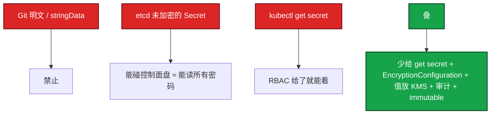

# 12｜配置与密钥 · 练习题

先自己画图或口述，再对照解答。每题标了覆盖范围：

| 标记 | 含义 |
|------|------|
| **核心** | 不懂整章就没建立起来 |
| **必会** | 值班和面试都要能讲 |
| **常用** | 线上会反复碰到 |
| **常考** | 白板和追问的高频口径 |

## 本题目录

- [Q1 Secret 是否加密 / EncryptionConfiguration](#q1)
- [Q2 三种注入与热更新](#q2)
- [Q3 CreateContainerConfigError / 跨 NS](#q3)
- [Q4 密码轮换 / edit secret](#q4)
- [Q5 1MiB / 活动开关](#q5)
- [Q6 0400 / DownwardAPI](#q6)
- [Q7 imagePullSecrets](#q7)
- [Q8 projected / SA token](#q8)
- [Q9 stringData / 证书](#q9)
- [Q10 改坏了怎么回](#q10)
- [Q11 开加密与轮换 key](#q11)
- [合上书](#合上书)

---

## Q1

**★★★★★｜Secret 是加密的吗？生产怎么补？能不能靠一个 Vault 章解决问题？**

**覆盖**：核心 · 必会 · 常考

### 场景

「我们把密码放 Secret 里了所以是安全的。」追问：`kubectl get secret -o yaml` 能看到什么？etcd 没开静态加密呢？02 说静止加密在 12，配在哪？

### 完整解答

不是加密。etcd 里默认是明文 JSON（base64 只是编码）。有 get / list secrets 就能解码。静止加密是 **API Server** 的 `EncryptionConfiguration`，写 etcd 前加密、读时解密。etcd TLS 管谁能连 2379，不管盘上是不是明文。



本库不单开 Vault 章——外部保险箱只是「值不进 Git、少进 etcd」这一层。静态加密后仍要护 encryption key。轮换走新对象 + 滚动，不要原地 edit 当日常。Git 只放引用，不放值。

### 再追问

- 谁能看密码？——有 get secret 的人；etcd 未静态加密时，能读控制面数据目录的人。开了加密，get 仍能看（API 解密后给你），盘上 / 快照不再是明文。
- 配在 etcd.yaml 吗？——否。kube-apiserver `--encryption-provider-config`。

---

## Q2

**★★★★★｜三种注入和热更新？改了 ConfigMap 为什么进程没变？**

**覆盖**：核心 · 必会 · 常考

### 场景

改了 CM，支付开关没变。YAML 是 envFrom。有人说 kubelet 坏了。另一份配置是 volume subPath 挂单文件，同样不更新。

### 完整解答

| 方式 | 热更新 |
|------|--------|
| env / envFrom | 创建时写入 → 改 CM 必须滚动 Pod |
| volume | kubelet 同步文件 → 文件会变，进程要自己 reload |
| subPath 挂单文件 | 不少版本不同步 → 必须滚动 |
| imagePullSecrets | 只给 kubelet 拉镜像，不是业务 env |

改 env 必须 `rollout restart`。checksum / Reloader 可自动滚。不要说「凡是 volume 都会热更」。生产不要幻想改完立刻所有进程变了。刚 apply 立刻 exec cat 可能还是旧文件，等一轮再判断。

checksum 自动滚动风险：CM 误改会自动把坏配置推全集群。活动中要冻结 CM，或 Reloader 只盯非生产。

### 再追问

- `get cm` 已经新、`exec env` 仍旧？——没滚动。文件新了进程没变？——没 reload。

---

## Q3

**★★★★★｜CreateContainerConfigError 怎么查？跨 NS 引用为什么不行？**

**覆盖**：核心 · 必会 · 常用

### 场景

新 Deploy 起不来。Events 写 `secret "db-pass" not found`。Secret 在另一个 NS 里明明有。

### 完整解答

引用的 CM / Secret / key 不存在，或 NS 不对。describe Pod Events 会写名字。先 apply 配置再发工作负载。业务容器还没开始，不要先看应用日志。

跨 NS **不能**改个路径就引用。要复制对象，或用 ExternalSecret 同步。这不是 bug，是边界。key 写错和对象不存在：Events 会指出哪个 key。exec 都进不去容器，因为容器还没创建。

### 再追问

- 支付 NS 的 Pod 写 `secretRef: name: hall-db` 行吗？——对象在 hall NS 就不行。复制一份或走 ExternalSecret。

---

## Q4

**★★★★★｜密码轮换顺序？生产 kubectl edit secret 会怎样？**

**覆盖**：核心 · 必会 · 常考

### 场景

DB 要轮换密码。有人先改库再 `kubectl edit secret`。一部分 Pod 连不上。第二天 GitOps 又把 Secret 同步回旧值。

### 完整解答

正确顺序：① 新建 Secret（新密码）② 改 Deploy / STS 引用 ③ 滚动完成，验证连接 ④ 删旧 Secret。

反序 = 一批 Pod 仍拿旧密码打新库。生产 edit 是止血，当天必须补 Git，否则下次同步把新密码盖回去，业务连不上还以为 DB 挂了。immutable 禁止原地改，逼你走新对象；也减少 kubelet 狂 watch 原地变更，审计清晰：变更 = 新对象 + 切引用。

### 再追问

- 这和 01 声明式纪律什么关系？——应急可以改集群，24 小时内让仓库一致。

---

## Q5

**★★★★☆｜CM 为什么有 1MiB 限制？活动开关每秒 apply 一次行吗？**

**覆盖**：必会 · 常用

### 场景

技能表塞进 CM，apply 报 too large。另一边运营平台每秒改一次活动开关 CM。

### 完整解答

etcd 单对象上限（对齐 02 `--max-request-bytes` 常见 1.5MiB，对象自身 1MiB）。超大配置放 OSS / 对象存储，CM 放指针或版本号。多个小 CM 狂更新同样打 etcd，活动开关不要每秒 apply。

游戏热更大表不进 etcd。回滚的是版本指针，不是整份 YAML。仅当应用 watch 挂载文件并安全 reload，才可以只改 CM 不滚动。内存表结构变了，仍要按热更方案，不是 K8s 自动完成。见 15、08-03。

### 再追问

- 热更成功、下一次 Deploy 仍杀进程？——两套通道。要写在同一张发布单上。

---

## Q6

**★★★★☆｜0400 挂了 Secret，非 root 容器读不了？**

**覆盖**：必会 · 常用

### 场景

PSS restricted 要求非 root。证书 volume `defaultMode: 0400`。容器报 permission denied。

### 完整解答

0400 只有属主读。容器 `runAsUser` 对不上文件属主就会读不了。对一下 SecurityContext 的 uid，或把 defaultMode 调成 0440 并配 fsGroup（要评估敏感度）。不要为了省事改成 0777。Events 不一定点名 Secret。见 13。

DownwardAPI：把 Pod 名、NS、资源 request 注入文件或 env，给日志标签用，不必再配一份 CM。

### 再追问

- 二进制证书怎么放？——`kubernetes.io/tls` 或 `binaryData`。不要把 PEM 再 base64 一层塞进 Opaque 让应用解两遍。

---

## Q7

**★★★★☆｜imagePullSecrets 和业务里的仓库密码是一回事吗？**

**覆盖**：必会 · 常用

### 场景

ImagePullBackOff。业务 env 里有一份 docker 密码，看起来是对的。

### 完整解答

不是一回事。`imagePullSecrets` 给 kubelet 拉镜像；业务 env 给应用自己用。401 先看 Pod 上的 imagePullSecrets 和节点 runtime 配置（16），不要先改业务环境变量。`kubernetes.io/dockerconfigjson` 专门给拉镜像用，和 Opaque 里随手塞密码分开，少混用。

### 再追问

- 节点已经配了 containerd 镜像加速，还要 imagePullSecrets 吗？——私有仓认证仍要。加速解决的是拉取路径，不是 401。

---

## Q8

**★★★★☆｜projected volume 和 SA token 有什么关系？**

**覆盖**：必会 · 常用

### 场景

1.24 之后有人还在用老的永不过期 SA Secret 当 token 挂进容器。

### 完整解答

projected 可把 CM、Secret、DownwardAPI、SA token 合成一个目录。1.24+ Bound Token 有过期、自动轮换。老的永不过期 Secret Token 少用。不需要调 API 的业务 Pod 应关掉 automount（13）。泄漏后无法靠过期自愈，RCE 后长期能打 API。

### 再追问

- 为什么少用永不过期 token？——泄漏窗口无限。Bound Token 过期是自愈的一部分。

---

## Q9

**★★★★☆｜stringData 和 data 差在哪？Git 里能放 stringData 吗？**

**覆盖**：必会 · 常考

### 场景

为了「看起来不是密文」，YAML 用 stringData 写了数据库密码并推进 Git。

### 完整解答

`stringData` 只是提交时的方便字段，API 存的仍是 `data`（base64）。Git 里用 Sealed / ExternalSecret，不要提交明文「图省事」。base64 不是加密，进了 Git 就等于进了密码本。

### 再追问

- 从 Git 里 decode 出来和 etcd 未加密读出来有什么差别？——都是明文密码本。一个在仓库历史，一个在控制面盘 / 快照。两层都要堵。

---

## Q10

**★★★★☆｜配置改坏了怎么回？env 型和 volume 型一样吗？**

**覆盖**：必会 · 常用

### 场景

checksum 滚动把错误开关推到全集群大厅。登录失败。Git 里上一版 CM 还在。

### 完整解答

- checksum 在 template 里 → undo Deployment 会连同旧 CM 引用一起回
- 只改了 CM、靠进程 reload → 回上一版 CM，确认进程真的 reload
- 两套都不确定 → 滚动到已知好版本，exec 核对容器内值

失败路径写进发布单：undo Deploy + 回上一版 CM。热更指针和 Deploy 滚动不是同一条通道，不要只回其中一个。

### 再追问

- 活动中 Reloader 盯着生产 CM 行吗？——误改会自动推全集群。活动中锁 CM 变更，或 Reloader 只盯非生产。

---

## Q11

**★★★★☆｜怎么开 EncryptionConfiguration？轮换 key 时新密钥放哪？**

**覆盖**：必会 · 常考

### 场景

审计要求 etcd 里 Secret 不能再是明文。有人只改了一台 apiserver 的 yaml。另一次轮换把旧 key 从列表删掉，一批 Secret 读不出来。

### 完整解答

```
providers:
  - aescbc:        # 第一 = 新写
      keys: [key2, key1]
  - identity: {}   # 最后 = 还能读旧明文；不要放第一
```

1. 配置放到 **每台** API Server，`--encryption-provider-config`。
2. 滚动重启全部 API。只改文件不重启，进程还拿着旧链。
3. rewrite 存量（读出再 replace），迫使用新 provider 写回。
4. etcdctl 只读抽查 `/registry/secrets/...` 不应再是明文 JSON。不要 put（02）。

轮换：新 key **插到第一** → 重启全部 API → rewrite → 确认再撤旧 key。不要先删仍要用来解密的 provider。`identity` 放第一 = 关闭加密，快照里重新出现明文。KMS / kmsv2 把 DEK 交给云，链规则相同。托管问清是否默认开、谁轮换。

### 再追问

- 开了加密，`kubectl get secret` 还能看到明文吗？——能。那是 API 解密后的视图。要挡的是盘、快照、etcdctl 直读。RBAC 仍然要少给 get secret。

---

## 合上书

- [ ] 能说出 Secret 默认明文 JSON；静止加密在 API Server EncryptionConfiguration
- [ ] 能讲链：新 key 第一、identity 最后、重启全部 API、旧 key 留到 rewrite 完
- [ ] 能分 env / volume / subPath 热更新，不说「凡是 volume 都会热更」
- [ ] 能走密码轮换四步；应急 edit 当天补 Git
- [ ] 能处理 CreateContainerConfigError、跨 NS、1MiB、imagePullSecrets ≠ 业务密码
- [ ] 能讲大表放对象存储、CM 放指针；热更和滚动是两条通道
