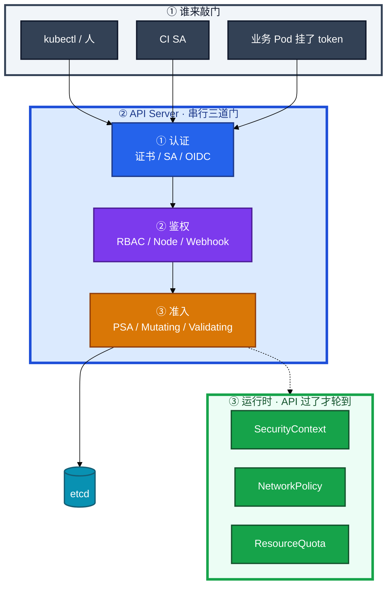
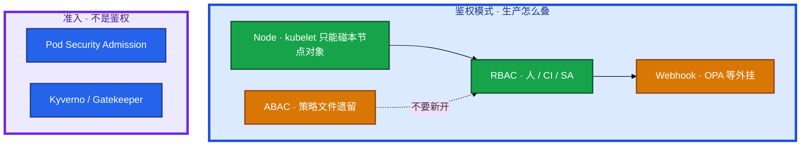
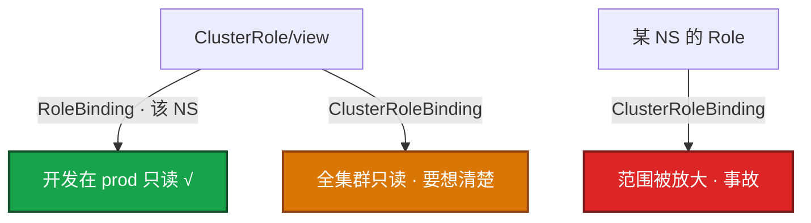
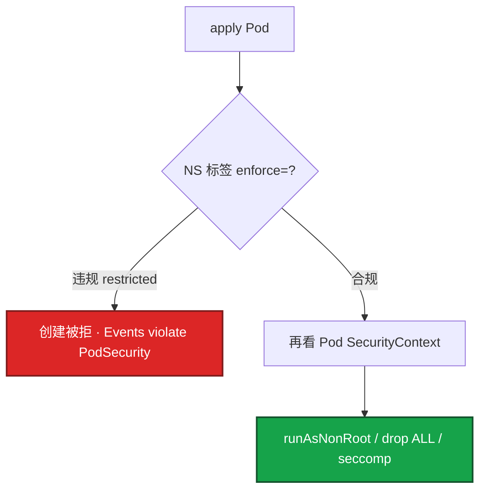
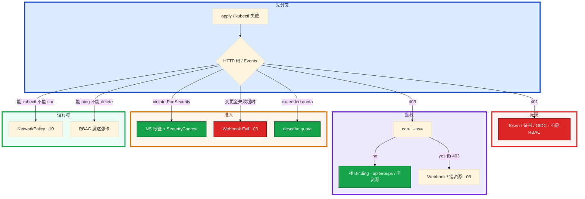

# RBAC 与安全


CI 拿着 `cluster-admin` kubeconfig 到处 apply。支付 NS 里一个没写 `saName` 的大厅 Pod 被 RCE，接着就能 `get secrets`。群里有人要把 prod 的 PSS 改成 privileged 顶过去。

先别动手。这一章后半全是你会动手的：**怎么发卡、怎么 `can-i`、怎么给 NS 打 PSS、Quota 满了怎么看。** 前面的概念和原理，是为了让你动手时不把 401、403、PSA、NetworkPolicy 混成一句「没权限」。

**读完你能：** 白板上画出四道门；分清 RBAC / ABAC / PSA；CI 禁止 cluster-admin、default SA 零权限；403 查到 Binding 和 apiGroup；支付 NS 收到 restricted，例外不降全 prod。

## 本章目录

缩进 = 上下级。3 下面才是 3.1。

想钉在**正文左边**跟着滚：菜单 **查看 → 打开视图 → 大纲**。Markdown 预览做不到独立左栏，目录只能写在文章开头。

- [1. 基本概念](#1-基本概念)
- [2. 架构图](#2-架构图)
- [3. 原理](#3-原理)
  - [3.1 四道门](#31-四道门认证鉴权准入运行时)
  - [3.2 RBAC / ABAC / PSA](#32-rbac--abac--psa别混成一种授权)
  - [3.3 RBAC 四件套](#33-rbac-四件套和-serviceaccount)
  - [3.4 PSS 与 SecurityContext](#34-pss-与-securitycontext)
  - [3.5 配额与租户](#35-配额与租户ns-是账本不是墙)
- [4. 安装部署](#4-安装部署)
  - [4.1 kubeadm 默认开什么](#41-kubeadm-默认开什么)
  - [4.2 最小权限怎么落地](#42-最小权限怎么落地)
- [5. 核心配置](#5-核心配置)
- [6. 常用命令](#6-常用命令)
- [7. 常用操作](#7-常用操作)
  - [7.1 发卡与收权](#71-发卡与收权)
  - [7.2 PSS 从 audit 收到 enforce](#72-pss-从-audit-收到-enforce)
  - [7.3 Quota / LimitRange](#73-quota--limitrange)
  - [7.4 租户升级](#74-租户升级)
- [8. 生产排障](#8-生产排障)
- [9. 必会 · 常考](#9-必会--常考)
- [合上书](#合上书问自己)

**本章不讲：** 认证链、Webhook `failurePolicy`、APF 429、审计怎么开 → [03 API Server](../03-API-Server/)；东西向包、NS 不是墙（包） → [10 CNI](../10-CNI与网络策略/)；Secret get、0400 → [12 配置与密钥](../12-配置与密钥/)；镜像禁 latest、扫描、签名 → [05-03 制品与镜像](../../05-工程化与自动化/03-制品与镜像/)；GitOps 谁有权 sync → [22](../22-GitOps-ArgoCD与Tekton/)。

---

## 1. 基本概念

能进 API ≠ 能发数据包。CI 机器人 apply 大厅、业务 Pod 被打了之后列 Secret、战斗服 ping 支付，走的不是同一道门。

| 门 | 问的是 | 失败码 / 现象 | 不管什么 |
|----|--------|---------------|----------|
| **认证 Authentication** | 你是谁（证书 / SA / OIDC） | **401** | 你能不能干、YAML 合不合规 |
| **鉴权 Authorization** | 你能不能（RBAC 为主） | **403** | 包能不能到 Pod、Pod 能不能特权 |
| **准入 Admission** | YAML 合不合规、Webhook、**PSA** | 创建被拒，Events 写原因 | 已经在跑的进程 |
| **运行时** | PSS 过了之后的 SC / NetworkPolicy | curl 不通、特权进不了内核 | kubectl 动词 |

三个「授权」不要混：

| 机制 | 哪一层 | 管什么 | 现在还用吗 |
|------|--------|--------|------------|
| **RBAC** | 鉴权 | User / Group / SA × 动词 × 资源 | **生产默认** |
| **ABAC** | 鉴权 | 属性策略文件（user、ns、resource、readonly） | 旧集群遗留；**不要新开** |
| **PSA** | **准入**，不是鉴权 | Pod 声明能不能特权 / hostNetwork / root | **PSP 已废后的硬墙** |

Subject：User / Group / ServiceAccount。人走 OIDC / 证书，不要共享一份永久 kubeconfig。Pod / CI 调 API 用 SA。1.24+ Bound Token 有过期；老的永不过期 Secret Token 少用。

> **记住**：RBAC 不管包，NetworkPolicy 不管 kubectl。有 cluster-admin 但 NP 默认拒，仍然 curl 不到支付 Pod；能 ping 通也不等于能 delete pod。PSA 拒的是创建，不是 403。

---

## 2. 架构图

先把整张图钉住。后面发卡、`can-i`、排障都对着这张图说话。



图上三条线：

1. **认证失败 401，鉴权失败 403，准入失败是创建被拒**——不是同一种「没权限」。
2. **Webhook `failurePolicy: Fail` 挂掉 = 写路径死**，细节在 03。已经在跑的 Pod 还在；新的 apply / 发版过不了门。这和 01「控制面挂了进程还在」是同一类拆法，只是卡在准入这一层。
3. **PSA 打在 Namespace 标签上**，SecurityContext 写在 Pod 上。门禁过了，进程声明仍要自己写。

鉴权模式可以并存（`--authorization-mode` 逗号列表，**短路：任一允许即过**）：



AlwaysAllow / AlwaysDeny 只给开发。生产：**Node,RBAC**；要外挂策略再加 Webhook。ABAC 没有 RoleBinding 对象，`kubectl get` 看不见谁有权，审计对不上人。

---

## 3. 原理

原理只保留动手和面试会用到的：四道门怎么过、RBAC 怎么发卡、PSA 打在哪、账本和墙差在哪。

**本节 5 块：** 3.1 四道门 · 3.2 RBAC/ABAC/PSA · 3.3 四件套 · 3.4 PSS · 3.5 配额

### 3.1 四道门：认证、鉴权、准入、运行时


1. **认证**：证书、SA Token、OIDC。失败 **401**。Token 过期、kubeconfig 指错用户，都停在这层。
2. **鉴权**：RBAC 查 Binding → Role 的 verbs × resources × apiGroups。失败 **403**。
3. **准入**：PSA、LimitRange 默认值、Validating Webhook。失败是 apply 被拒，Events 写 violate PodSecurity 或 admission webhook。
4. **运行时**：NP 拦包；cgroup / seccomp / 非 root 在节点上生效。

现场拆开问：已经在跑的 Pod 还在；新的 apply / 发版过不了门。

### 3.2 RBAC / ABAC / PSA：别混成一种「授权」

| | RBAC | ABAC | PSA |
|--|------|------|-----|
| 层 | Authorization | Authorization | **Admission** |
| 载体 | API 对象：Role / Binding | apiserver 旁路 **策略文件** | NS 标签 `pod-security.kubernetes.io/*` |
| 粒度 | 动词 × 资源 × resourceNames | user / group / ns / resource / readonly | privileged / baseline / restricted |
| 变更 | `kubectl apply` Binding | 改文件 + **重启 API Server** | `kubectl label ns` |
| 审计 | `kubectl get rolebinding` 能列出 | 文件外，值班看不见 | Events：violate PodSecurity |
| 失败 | 403 | 403 | 创建被拒，**不是 403** |
| 生产 | **默认** | 遗留；新集群不要开 | **PSP 替代**；业务收到 restricted |

ABAC 典型一行：`{"user":"alice","namespace":"prod","resource":"pods","readonly":true}`。没有 Binding，没法按 NS 发卡，没法 `can-i` 对照对象。kubeadm **默认不开** ABAC。

Node authorizer：kubelet 只能 get/update 绑到本节点的对象，防止偷别的节点 Secret。Webhook authorizer：外挂 OPA 等，和 RBAC **叠加**（任一允许即过——所以 RBAC 过宽时 Webhook 挡不住）。

PSP（PodSecurityPolicy）已废。面试说「用 PSP」算过期口径。PSS 是内置准入；Kyverno / Gatekeeper 是 Validating Webhook，可强制资源、禁特权、禁 latest——镜像扫描、签名核验见 **05-03**，本章不展开供应链。Webhook 必须多副本，`failurePolicy` 想清楚（03）。

> **记住**：RBAC 问「这个 SA 能不能 get secrets」；PSA 问「这个 Pod 能不能 privileged」。一个过了另一个仍可拒。禁 latest 是准入 / 策略引擎，RBAC 不管镜像标签。

### 3.3 RBAC 四件套和 ServiceAccount

CI 流水线要发大厅。错误做法是把 cluster-admin kubeconfig 写进仓库；正确做法是给 `ci-bot` 这个 SA 发卡，而且只卡本 NS、只卡指定 Deployment。

| 对象 | 干什么 |
|------|--------|
| **Role** | Namespace 内的规则（动词 × 资源 × apiGroup） |
| **ClusterRole** | 集群范围的规则（也可被 RoleBinding 引用） |
| **RoleBinding** | 在某个 NS 内发卡；引用 ClusterRole 时权限仍限该 NS |
| **ClusterRoleBinding** | 全集群发卡 |

**Role 是规则，Binding 才是发卡。** 绑错范围就是提权。



内置 ClusterRole：`view` / `edit` / `admin` / `cluster-admin`。**cluster-admin 绑定任何新增都是事故级变更。** 监控类用 `aggregationRule` 拼只读权限，比复制一份 admin 安全；改聚合源 Role 会影响所有引用方，当集群级变更。

`pods` 不等于 `pods/log`。能 get 不能打日志，十次里有八次是漏了子资源。`deployments` 在 `apps` 组，写在 `""`（core）就是 403，规则看起来「已经写了」。`resourceNames` 可把 Role 收到某一个 Secret 或指定 Deployment。

ServiceAccount 是 **Pod / CI 调 API 的身份**。没写 `serviceAccountName` 就用 `default`。default 一旦绑宽，**该 NS 所有忘写 SA 的 Pod 都继承**。再挂 token，RCE 后直接打 API。

游戏现场：大厅 Pod 挂了 default SA，有人给 default 绑了 `edit`。业务被 RCE 之后，攻击者用 Pod 里的 token `get secrets`，支付库密码就出来了。收法：default 零权限、不调 API 就 `automountServiceAccountToken: false`、Secret 不给业务 SA（12）。CI 的 cluster-admin kubeconfig 进 Git 同样是提权路径，当安全事件收。

### 3.4 PSS 与 SecurityContext

支付 NS 要禁特权、禁 hostNetwork。用 **Pod Security Admission（PSS）**，标签打在 NS 上：

| 级别 | 谁用 |
|------|------|
| privileged | kube-system、需要 hostNetwork 的 agent |
| baseline | 一般业务起步（禁特权、禁 host 命名空间） |
| restricted | 支付 / 核心：non-root、drop ALL、seccomp |

三个模式：`enforce` 拒创建；`warn` / `audit` 先观察再收。一夜 enforce 会让半个业务 NS 创建失败——先 audit/warn 一周，修镜像（非 root、drop cap），再 enforce。



PSS 是门禁，SC 是 Pod 自己声明。0400 挂载 Secret 时，非 root 读不了要对上 `runAsUser`（12）。游戏引擎或反外挂 sidecar 可能要突破 restricted（hostNetwork 等），**单独 NS + 书面例外**，不要把整个 prod 降成 privileged。临时降级要审批，并设回归时间。

### 3.5 配额与租户：NS 是账本，不是墙

同一集群多团队共享，Namespace 是账本边界，**不是安全边界**（01、10）。敌对租户、合规要硬墙 → 拆集群。只建一个 pay NS 不等于合规。

| 工具 | 作用 |
|------|------|
| ResourceQuota | 限制 NS 的 CPU / 内存 / PVC / 对象数上限 |
| LimitRange | 给容器默认 request/limit，防不写资源 |
| RBAC + NP | 限制人和流量不出该 NS 的「逻辑范围」 |

没有 Quota，一个忘写 limit 的作业能吃光节点。没有 LimitRange，研发不写 resources，HPA 和调度都会失真。Quota 满了 Pod 会 Pending 或创建被拒，describe 会写 exceeded。`default` 是 limit，`defaultRequest` 是 request，写反了调度和 HPA 都会按错误值算。Quota 的 `pods` 含 DaemonSet 占用，账本要预留。

租户升级（每升一级写清原因：安全 / 性能 / 合规）：

```
共享 NS → 独立 NS + 配额 → 独立节点池 / 污点 → 独立集群
```

不要跳级。最低配仍是 01 那五条：独立 NS、最小 RBAC、NP 默认拒、独立节点池、真要硬墙再拆集群。

---

## 4. 安装部署

### 4.1 kubeadm 默认开什么

kubeadm 控制面默认 `--authorization-mode=Node,RBAC`，**不开 ABAC**。PSA 作为准入插件默认启用；真正生效靠 NS 标签，没打标签的 NS 等于没有这道墙。

| 项 | 生产 | 不选 |
|----|------|------|
| 鉴权 | Node,RBAC；外挂再加 Webhook | AlwaysAllow、新开 ABAC |
| PSA | 业务 NS 打标签；系统 privileged | 一夜全集群 enforce=restricted |
| SA | Bound Token（1.24+） | 永不过期 Secret Token 当默认 |
| 审计 | API 审计开 `get secrets` / `create clusterrolebinding` | 只靠 grep Binding |

托管（ACK / EKS）：RBAC 和 PSS 仍是你的。厂商给的 `cluster-admin` kubeconfig 不要进 CI；节点组上的 hostNetwork agent 用单独 NS。

### 4.2 最小权限怎么落地

默认没有，全是加出来的：

1. 人走 OIDC，不共享 kubeconfig。
2. CI 独立 SA，只给本 NS 的 get/list/update 指定 Deployment，不给 `*`，禁止 cluster-admin。
3. 业务 Pod 默认 `automountServiceAccountToken: false`——不调 API 就不要把 token 挂进去。
4. 每个 NS 的 `default` SA 保持 **零权限**。没写 saName 的 Pod 都继承它，绑宽一次等于给所有人发卡。
5. 开发默认不给 get secrets（12）。`resourceNames` 可把 Role 收到某一个 Secret。
6. 定期扫 ClusterRoleBinding；`create clusterrolebinding`、`get secrets` 进审计 / SIEM。

发现来历不明的 cluster-admin Binding，当安全事件：谁绑的、何时、能否立刻收。不要等出事才第一次 grep。

---

## 5. 核心配置

只动有证据的项。Binding 写错范围比 YAML 缩进更致命。

| 项 | 生产怎么用 | 改错会怎样 |
|----|------------|------------|
| RoleBinding + ClusterRole | 该 NS 内有效，给开发 view | 改成 ClusterRoleBinding = 全集群 |
| `apiGroups: ["apps"]` | Deployment / ReplicaSet | 写成 `""` → 403，规则「看起来有」 |
| `resources: ["pods/log"]` | 子资源单独写 | 只写 `pods` → 能 get 不能 logs |
| `resourceNames` | CI 只 patch 那个 Deploy | `["*"]` = 本 NS 全开 |
| `automountServiceAccountToken` | 不调 API 的 Pod 关 | 默认挂 token，RCE 后有枪 |
| PSS `enforce` / `warn` / `audit` | 先 warn 再 enforce | 一夜 enforce 半个业务创建失败 |
| LimitRange `default` vs `defaultRequest` | default=limit | 写反 HPA / 调度失真 |
| aggregationRule | 监控只读拼盘 | 改源 Role = 所有引用方一起变 |

PSS 标签：

```bash
kubectl label ns prod \
  pod-security.kubernetes.io/enforce=restricted \
  pod-security.kubernetes.io/warn=restricted \
  pod-security.kubernetes.io/audit=restricted
```

Quota / LimitRange 示意：

```yaml
apiVersion: v1
kind: ResourceQuota
metadata: { name: team-a-quota, namespace: team-a }
spec:
  hard:
    requests.cpu: "40"
    requests.memory: "80Gi"
    persistentvolumeclaims: "20"
    pods: "200"
---
apiVersion: v1
kind: LimitRange
metadata: { name: default-limits, namespace: team-a }
spec:
  limits:
  - type: Container
    default: { cpu: "1", memory: "512Mi" }
    defaultRequest: { cpu: "100m", memory: "128Mi" }
```

> **记住**：RoleBinding 引用 ClusterRole 时权限仍限该 NS。CI 禁止 cluster-admin。Webhook Fail + 不可达 = 全集群创建被堵，可能连修策略组件的人一起焊死（03）。

---

## 6. 常用命令

怀疑 CI 权限过大，或 CI 报 403 发不出去。先复现，再找 Binding。

| 目的 | 命令 | 看什么 |
|------|------|--------|
| 当前身份能干什么 | `kubectl auth can-i --list -n prod` | verbs × 资源 |
| 冒充 SA | `kubectl auth can-i delete pods --as=system:serviceaccount:prod:ci-bot -n prod` | yes / no |
| 扫提权 | `kubectl get clusterrolebinding -o wide \| grep -i admin` | 来历不明当安全事件 |
| Binding 列表 | `kubectl get rolebinding,clusterrolebinding -A` | Subject 和 RoleRef |
| Role 规则 | `kubectl describe clusterrole view` | apiGroups / resources / verbs |
| PSS 标签 | `kubectl get ns prod --show-labels` | enforce / warn / audit |
| Quota | `kubectl describe quota -n team-a` | pods / CPU / PVC 是否顶满 |
| 聚合源 | `kubectl get clusterrole -o yaml \| grep aggregationRule` | 改源影响面 |

值班先跑这几条：

```bash
kubectl auth can-i --list -n prod
kubectl auth can-i delete pods --as=system:serviceaccount:prod:ci-bot -n prod
kubectl get clusterrolebinding -o wide | grep -i admin
kubectl get ns --show-labels | grep pod-security
```

`can-i` 是 yes、apply 仍 403：对的是错资源（apiGroup / 子资源），或后面 Webhook 拒（03）。`can-i` 是 yes、curl 支付 Pod 不通：RBAC 过了，包被 NP 拦了（10）。

---

## 7. 常用操作

### 7.1 发卡与收权

给开发 prod 只读：RoleBinding + ClusterRole/`view`，**不要** ClusterRoleBinding。给监控读 Node：ClusterRoleBinding（Node 是集群资源）。CI：独立 SA + Role，`resourceNames` 收到指定 Deployment，verbs 不要 `*`。

收权：删 Binding 立刻生效（鉴权每次请求都查）。token 泄漏：删 SA / 等 Bound Token 过期；老 Secret Token 必须删 Secret 并滚工作负载。kubeconfig 进 Git：轮换、收 Binding、从 Git 历史清。

### 7.2 PSS 从 audit 收到 enforce

1. 标签 `warn` + `audit`，观察一周。
2. 修镜像：non-root、`drop: [ALL]`、`allowPrivilegeEscalation: false`、seccomp。
3. 工作负载写 SecurityContext，PSS 不替你填 YAML。
4. 再 `enforce=restricted`。
5. 反外挂 / 引擎 sidecar：单独 NS + 书面例外，不降全 prod。

apply 被拒：Events 写哪条规则（root、capabilities、hostNetwork）。优先改 SC / 镜像。值班想把标签改成 privileged 顶过去——要审批和回归时间，不要把 prod 长期留在 privileged。

### 7.3 Quota / LimitRange

新 Pod Pending，Events 写 `exceeded quota: pods` 或 `requests.cpu`——先 `describe quota`，不是先怪调度器（06）。研发没写 resources、HPA 完全不动：没有 LimitRange 时 request 为 0，调度当它不占资源。账本先把默认值垫上。

### 7.4 租户升级

三个游戏项目共用一个集群。开始只分了 NS，后来抢 CPU、互相扫端口、审计要分开：

1. 独立 NS + ResourceQuota + LimitRange（账本）
2. 最小 RBAC，default SA 零权限
3. NetworkPolicy 默认拒
4. 独立节点池 / 污点（性能隔离）
5. 合规要数据不共盘、审计分开 → 拆集群（硬墙）

每升一级写清原因。不要从「加个 NS 名字」直接跳到「已经隔离了」。

---

## 8. 生产排障

和 01 同一套三问：进程还在不在？还能不能变更？已有流量还通不通？卡在门上时：**已经在跑的还在；新的 apply 过不了。**



403 排查顺序固定：

1. `kubectl auth can-i ... --as=...` 先复现。
2. 找 RoleBinding / ClusterRoleBinding。
3. 对 rules：apiGroups / resources / verbs / resourceNames。`deployments` 在 `apps`；`pods/log`、`pods/exec` 是子资源，要单独写。

| 现象 | 先做什么 | 不要做什么 |
|------|----------|------------|
| CI 403 | can-i → Binding → apiGroups | 先改 replicas |
| 能 get pod 不能 logs | 补 `pods/log` | 给 cluster-admin |
| 业务 Pod 能 list secret | 收 default SA、关 automount | 只骂研发「别 RCE」 |
| 写路径全死 | Webhook Fail（03） | 当 RBAC 坏了乱绑 admin |
| PSA 拒绝 | Events + SC；例外单独 NS | 把 prod 改 privileged |
| Quota 满 | describe quota | 怪调度器 |
| 能 kubectl 不能 curl | NP（10） | 加 RoleBinding |
| Kyverno 挂了 Fail | 破窗 / 摘 Webhook（03） | 继续 apply 业务 |

活动高峰策略组件挂了：确认进程还在 → 停止发版 → 按 03 救 Webhook → 不要给所有人临时 cluster-admin。

---

## 9. 必会 · 常考

白板和追问高频，能一口回：

| 说法 | 对错 | 口径 |
|------|:----:|------|
| RBAC 和 NetworkPolicy 管同一件事 | 错 | API vs 包 |
| PSA 失败返回 403 | 错 | 准入拒创建，不是鉴权 |
| ABAC 比 RBAC 更细所以生产该开 | 错 | 文件策略，看不见 Binding；不要新开 |
| RoleBinding 引用 ClusterRole 权限全集群 | 错 | 仍限该 NS |
| ClusterRoleBinding + 某 NS 的 Role 只是方便 | 错 | 范围放大，提权 |
| `pods` 包含 logs / exec | 错 | 子资源单独写 |
| `deployments` 在 core 组 | 错 | `apps` |
| CI 用 cluster-admin 省事 | 错 | 事故级；独立 SA |
| default SA 绑 edit 只影响显式用它的 Pod | 错 | 没写 saName 的全中 |
| 不调 API 也要挂 token | 错 | `automountServiceAccountToken: false` |
| PSP 还是生产硬墙 | 错 | 已废，用 PSS |
| 反外挂要 hostNetwork 就把 prod 改 privileged | 错 | 单独 NS + 书面例外 |
| 只建 pay NS 就算合规隔离 | 错 | NS 不是墙；硬墙拆集群 |
| 禁 latest 是 RBAC | 错 | 准入 / 05-03 |
| 聚合 ClusterRole 改源只影响一个监控 SA | 错 | 所有引用方一起变 |
| Quota 满了是调度器挑不到节点 | 错 | 账本 exceeded |

数字：Bound Token 1.24+ 有过期；PSS 先 audit/warn **一周**再 enforce；证书/审计扫 Binding 当常规；0400 Secret 对非 root（12）。

易混：401 vs 403 vs PSA 拒 vs NP 不通；RBAC vs ABAC vs PSA；RoleBinding vs ClusterRoleBinding；OOM 权限故事 vs 真 RCE 提权；Webhook Fail vs RBAC 403。

---

## 合上书，问自己

1. 四道门各问什么？失败各是什么码 / 现象？
2. RBAC、ABAC、PSA 各在哪一层？为什么 ABAC 不要新开？
3. RoleBinding 引用 ClusterRole 范围在哪？绑错怎样提权？
4. CI 和 default SA 的红线是什么？为什么关 automount？
5. PSS 三级谁用？反外挂要 hostNetwork 怎么办？
6. 403 三条命令怎么查？能 kubectl 不能 curl 去哪一章？

六题都能口述，这一章就过了。下一章把南北向入口剖开：Ingress 是规则、Controller 是执行者，长连接不要硬塞七层。
