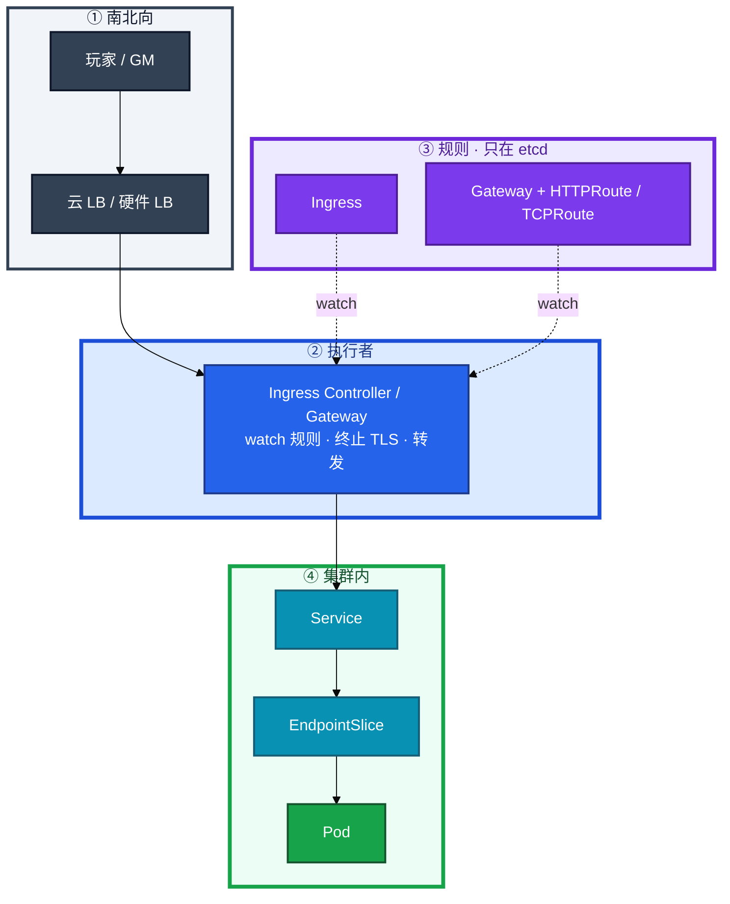
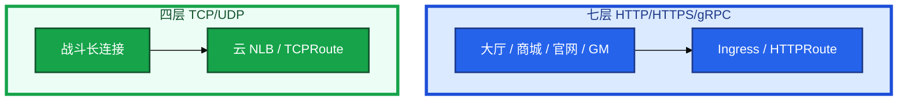
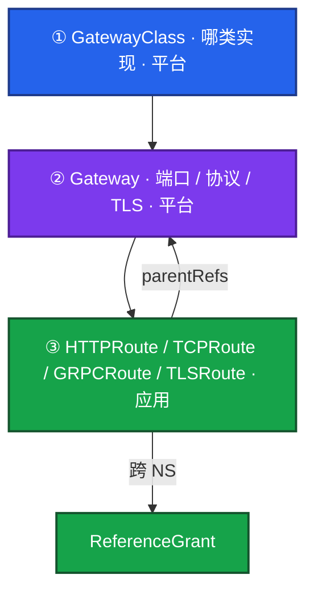
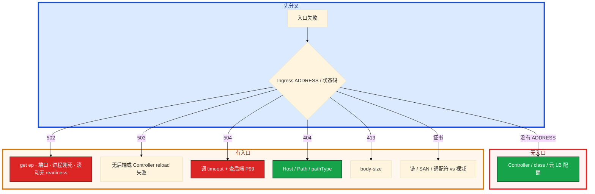

# Ingress 与流量管理


大厅 HTTPS 502。etcd 里 Ingress 对象在。有人要加 nginx 副本，另有人把战斗长连接也塞进同一层七层。证书是 `*.example.com`，apex 域手机打不开。

先别动手。这一章后半全是你会动手的：**怎么认领 class、怎么看 Endpoints、怎么配 TLS、怎么用 HTTPRoute weight 切金丝雀。** 前面的概念，是为了让你动手时不把规则当成执行者，也不把长 TCP 硬塞七层。

**本章主线（排障就按这三步想）：**

1. **分轨**：HTTP 走七层 Ingress / Gateway；战斗长 TCP 走 L4 NLB / TCPRoute。
2. **认执行者**：Ingress 是规则，Controller 才转发；502 先看 Endpoints（08）。
3. **切流**：金丝雀用 weight，不靠副本比例；证书监控剩余天数。

**读完你能：** 白板上画出用户 → LB → Controller → Service → Pod；对比 Ingress 与 Gateway API；HTTP 走七层、战斗长 TCP 走 L4；502 先看 Endpoints；证书监控剩余天数。

## 本章目录

- [1. 基本概念](#1-基本概念)
- [2. 架构图](#2-架构图)
- [3. 原理](#3-原理)
  - [3.1 规则不是执行者](#31-规则不是执行者)
  - [3.2 Ingress vs Gateway API](#32-ingress-vs-gateway-api)
  - [3.3 L4 / L7](#33-l4--l7游戏长连接)
  - [3.4 TLS](#34-tls)
  - [3.5 限流熔断降级](#35-限流熔断降级mesh-只留一段)
- [4. 安装部署](#4-安装部署)
  - [4.1 Controller 怎么放](#41-controller-怎么放)
  - [4.2 Gateway API 落地](#42-gateway-api-落地)
- [5. 核心配置](#5-核心配置)
- [6. 常用命令](#6-常用命令)
- [7. 常用操作](#7-常用操作)
  - [7.1 金丝雀权重](#71-金丝雀权重)
  - [7.2 证书续期](#72-证书续期)
  - [7.3 多 Controller / 裸金属](#73-多-controller--裸金属)
- [8. 生产排障](#8-生产排障)
- [9. 必会 · 常考](#9-必会--常考)
- [合上书](#合上书问自己)

**本章不讲：** Service / Endpoints / kube-proxy → [08](../08-Service与kube-proxy/)；滚动、蓝绿、有状态灰度、回滚 RTO → [15](../15-灰度与回滚/)；证书 Secret 注入、base64 → [12](../12-配置与密钥/)；Cilium Gateway / 无 sidecar Mesh → [23](../23-eBPF与Cilium/)；GitOps 管入口 YAML → [22](../22-GitOps-ArgoCD与Tekton/)；云 WAF / 安全组 → [07 云平台](../../07-云平台/)。Service Mesh 只留一段概念；Istio 控制面、sidecar 成本、何时不上 → [10-04 大规模可靠性架构](../../10-SRE实践/04-大规模可靠性架构/)。

---

## 1. 基本概念

Ingress 是 etcd 里的规则：Host / Path 转到哪个 Service。真正转发的是 **Ingress Controller** 进程（nginx / 云 ALB / APISIX…）。没有 Controller，apply Ingress 无流量效果。

| 组件 | 作用 |
|------|------|
| Ingress 资源 | 声明 Host/Path → Service |
| Ingress Controller | 执行者：生成配置并转发 |
| ingressClassName | 哪个 Controller 认领这条规则 |
| Gateway API | 下一代入口：GatewayClass / Gateway / Route |

为什么要这一层：一个 LB 入口，按域名 / 路径分给多个 Service，比每个 Service 一个云 LB 便宜，证书和域名也能收口。NodePort 是四层、每服务占端口、无 Host/Path，安全组难收。

**pathType：** `Prefix`（`/api` 吃 `/api` 和 `/api/x`）/ `Exact`（只精确匹配）。`ImplementationSpecific` 不可移植。backend 的 port 必须对上 Service。`/` Prefix 吃所有，匹配顺序看 Controller 实现。

注解是厂商货：nginx 的 canary-weight 换到 Traefik 就废。注解不被 API 校验，写错不报错只是不生效。换 Controller 会废的东西，不要当集群标准。

> **记住**：Ingress 是规则，Controller 是执行者；没 Controller 规则不生效。忘写 class，「规则在、流量不来」或被默认 class 抢走。

---

## 2. 架构图

先把整张图钉住。后面安装、命令、排障都对着这张图说话。



图上三条线：

1. **没有箭头从用户指向 Ingress 对象。** 对象不会转发一个包。
2. **Controller 才 listen 80/443**（或被云 LB 打进来）。
3. **后端仍是 Service → EndpointSlice → Pod**（08）。502 先看这一段，不要先加 Controller 副本。

七层与四层不要画成同一条管道：



---

## 3. 原理

原理只保留动手和面试会用到的：谁转发、Ingress 缺什么、长连接为什么掉、证书在哪终止、限流熔断怎么叠。

**本节 5 块：** 3.1 规则 · 3.2 Gateway · 3.3 L4/L7 · 3.4 TLS · 3.5 限流

### 3.1 规则不是执行者

你 apply 一份 Ingress：Host `hall.example.com`，Path `/` 转到 Service `hall`。Controller watch 后生成 nginx / Envoy 配置并 reload。`ingressClassName` 决定谁认领。多个 Controller 并存必须写 class。

### 3.2 Ingress vs Gateway API

Ingress 的局限就是 Gateway API 的动机：主要只管 HTTP；高级路由靠 annotation 厂商绑定；规则和基础设施混在一起，角色不分离。

Gateway API 是官方下一代入口（已 GA）：多协议、标准 weight / header、三层角色分离、换实现少改 YAML。



| | Ingress | Gateway API |
|--|---------|-------------|
| 协议 | 主要 HTTP | HTTP / TCP / UDP / gRPC / TLS |
| 金丝雀 | annotation（厂商绑定） | HTTPRoute `backendRefs.weight` |
| header / 镜像 | 注解或不支持 | 标准 filter / RequestMirror |
| 角色 | 混在一条 Ingress | 平台管 Gateway，应用管 Route |
| 可移植 | 换 Controller 改注解 | 标准字段 |
| 校验 | 注解写错不报错 | 标准字段进 API |

选型：新集群、多团队共享网关、需要 TCP/UDP/gRPC 原生路由 → 优先 Gateway API。存量 Ingress 稳定运行 → 不急着迁。简单 HTTP 入口 Ingress 够用。已用 Cilium 做入口见 23。**Ingress 不会立刻淘汰。**

实现方（知道名字即可）：Envoy Gateway、Cilium、Nginx Gateway Fabric、云厂商 ALB / GKE Gateway。不要为此背一份 Istio CR。

HTTPRoute 金丝雀是标准能力：

```
game.example.com /api
     +-- game-api         weight 90
     +-- game-api-canary  weight 10
```

和 15 章、Argo Rollouts 的关系：Gateway 提供权重；Rollouts 按错误率、延迟自动改权重。入口给能力，发布控制器做渐进。只靠 Deployment 副本 1:9 当金丝雀不准——kube-proxy 近似均分，长连接更偏。

### 3.3 L4 / L7：游戏长连接

大厅 HTTP、商城、官网走七层没问题。战斗长连接塞进 nginx Ingress，过一会儿玩家全掉。

| | 七层 | 四层 |
|--|------|------|
| 协议 | HTTP/HTTPS/gRPC | TCP/UDP |
| 能力 | Host/Path、终止 TLS、weight 金丝雀 | 不看 HTTP |
| 坑 | 缓冲、`proxy-read-timeout`、reload 断连接 | 无七层路由 |
| 谁用 | 大厅 HTTP、商城、官网、GM、活动页 | 战斗长连接、部分 WebSocket 可走七层但要拉超时 |

长连接踩坑：

1. `proxy-read-timeout` 小于会话长度 → 被网关掐断。
2. 缓冲把实时包攒成块。
3. Controller 热加载配置会短暂断连接。副本 ≥2 时只影响打到正在 reload 的那一个；**单副本入口一 reload，长连接全断**。
4. WebSocket 可以走七层，但要把读超时拉到会话长度，并接受 reload 风险。

L4 直连 Pod 的负载均衡：云 NLB + Service `type=LoadBalancer`，或 `ExternalTrafficPolicy: Local` 保源 IP。客户端直连 NodePort 会暴露节点 IP，节点扩缩即全员改地址，生产用云 LB。

转发头：`use-forwarded-headers` 和云 LB 的 X-Forwarded-For 要成套，否则应用看到的是 Controller IP，风控和限流会错。重复信任头会被伪造。L4 保源 IP 是另一条路，不必靠七层头（08）。

### 3.4 TLS

| 模式 | 路径 |
|------|------|
| 最常见 | 客户端 HTTPS → Controller 终止 → 集群内 HTTP |
| 透传 | Controller 按 SNI 转 HTTPS 到 Pod |
| 云 LB 终止 | HTTPS → 云 LB → HTTP → Controller |

证书存 Secret `kubernetes.io/tls`（`tls.crt` / `tls.key`），Ingress `spec.tls` 或 Gateway 监听器引用。生产用 cert-manager 签发和续期，**监控剩余天数**（<30d P2，过期才发现是事故）。

通配符 `*.example.com` **不匹配** `example.com` 本身，要两条 dnsNames。少中间证书时手机打不开、curl 却过——`openssl s_client -showcerts` 看链。SAN 对不上浏览器报错。

### 3.5 限流熔断降级：Mesh 只留一段

五个模式互补，不是选一个：

| 模式 | 解决什么 |
|------|----------|
| 限流 | 防下游被打爆 |
| 熔断 | 防级联：连续失败 → Open 一段时间 |
| 降级 | 非核心返回默认值 / 缓存 / 跳过 |
| 重试 | 只对幂等操作自愈瞬时抖动 |
| 隔离 | 线程池 / 连接池 / Bulkhead，故障不扩散 |

入口限流限制总 QPS，超了 429，保护整个集群。不要和 API Server APF 的 429 混（03）。

| 算法 | 特点 |
|------|------|
| 固定窗口 | 简单，整点边界突刺 |
| 滑动窗口 | 更平滑 |
| 令牌桶 | 允许突发，**生产常用** |
| 漏桶 | 严格匀速，不允许突发 |

游戏登录被刷：入口 RPS + 验证码；匹配暴增：队列 + 排队。服务间可按用户 ID 限频。分布式限流可用 Redis + Lua 或网关能力。

熔断：Closed → 失败率到阈值（如 50%/10s）→ Open → 半开试探 → 成功回 Closed / 失败再 Open。**不要重试 + 熔断同时开**——Open 还重试就是打下游。重试只对幂等：GET 安全；支付 POST 默认不安全。限制 1–2 次、每次独立超时、指数退避 + 抖动。典型事故：网格默认重试把超时的支付打两次 → 双发。

支付不能降级（强一致）；排行榜、好友推荐可以返回空榜 / 旧缓存 / 跳过。隔离：调 B 和调 C 用独立连接池；K8s 层还有 Pod limit → 节点池 / 污点 → NS Quota（13）。

实现可以是 SDK（Sentinel / Resilience4j）或入口层，不必先上网格。游戏：入口限流 + SDK 降级 + 业务开关，已覆盖大部分场景。

**Service Mesh 一段话：** 网格把超时、重试、mTLS、观测收到数据面（常见 sidecar 或 Cilium 无 sidecar）。它是增强不是前提。Cilium 做网格 / L7 策略 / Hubble 见 **23**。Istio / Envoy / sidecar 成本 / 战斗服为什么默认不注入 → [10-04](../../10-SRE实践/04-大规模可靠性架构/)。本章不背 VirtualService 全集。

> **记住**：HTTP 走七层；战斗长 TCP 走 L4。Gateway weight 是标准字段，别写进厂商注解。限流防打爆，熔断防级联，降级保非核心。

---

## 4. 安装部署

### 4.1 Controller 怎么放

| 项 | 选 | 不选 |
|----|----|------|
| 副本 | ≥2 + PDB + 反亲和 | 单副本入口 |
| 形态 | Deployment + Service LB，或云 ALB Ingress | 业务 Worker 上顺手跑一份 nginx |
| class | 显式 ingressClassName | 靠默认 class 碰运气 |
| 超时 / body | 按上传和后端 P99 | 只调大 timeout 不修后端 |
| 限流 / WAF | 云 WAF 或 APISIX | 只调 nginx body-size 当安全 |

Controller 常见：ingress-nginx（注解多）、云 ALB Ingress、APISIX / Kong（限流 WAF）。**注解是厂商货，换 Controller 会废。** 新集群能走 Gateway 就不要把标准能力写进注解。

裸金属暴露：DaemonSet + hostNetwork 80/443，或 NodePort + 外部 LB，注意和节点上其它 hostNetwork 游戏进程抢端口（10、13）。

验收：Controller Ready、Ingress 有 ADDRESS、`curl -H Host` 通、证书链完整。不要只看 etcd 里有对象。

### 4.2 Gateway API 落地

装实现（Envoy Gateway / Cilium / 云 Gateway）→ 建 GatewayClass → 平台建 Gateway（监听 443 + 证书）→ 应用建 HTTPRoute，`parentRefs` 指向 Gateway。跨 NS 用 ReferenceGrant 授权。Gateway API 天然多 Gateway 实例，少靠 class hack。

存量 Ingress 稳定 → 不急着迁。并行期按 Host 拆，不要同一 Host 两套入口抢。

Ingress vs Gateway 选型再收一刀（面试常把「下一代」听成「立刻废」）：

| 场景 | 选 |
|------|----|
| 新集群、多团队共享网关、要 TCP/gRPC 标准路由 | Gateway API |
| 存量 nginx 注解已经跑稳、没有换实现计划 | Ingress 留下 |
| 只要一个 Host 的 HTTP | Ingress 够用 |
| 金丝雀要可移植 weight | Gateway HTTPRoute；不要新写 canary-weight |
| 已用 Cilium 做入口 | 23，不必再叠一层 nginx |

---

## 5. 核心配置

| 项 | 生产怎么用 | 改错会怎样 |
|----|------------|------------|
| ingressClassName | 每个 Ingress 写明 | 无 ADDRESS 或被默认抢走 |
| pathType | Prefix / Exact 显式写 | ImplementationSpecific 不可移植 |
| backend.port | 对上 Service port | 立刻 502 |
| canary-weight 注解 | 仅存量 nginx | 换 Traefik 全失效 |
| HTTPRoute weight | 新集群标准金丝雀 | 只改副本比例不准 |
| proxy-read-timeout | ≥ 会话长度 | 长连接被掐 |
| body-size | 按上传；大文件走对象存储 | 413；不要把入口撑成文件网关 |
| use-forwarded-headers | 与云 LB 成套，只信最外层 hop | 风控看成 Controller IP / 可伪造 |
| TLS Secret | cert-manager 续期 | 过期才发现 |
| Controller 副本 | ≥2 + PDB | 单副本 reload 全断 |

> **记住**：注解不被 API 校验。Gateway `backendRefs.weight` 才是可移植金丝雀。通配符不匹配裸域。

---

## 6. 常用命令

| 目的 | 命令 | 看什么 |
|------|------|--------|
| 规则和入口 | `kubectl get ingress,httproute,gateway -A` | ADDRESS、class |
| 规则细节 | `kubectl describe ingress <n>` | Events、backend、TLS |
| 后端 | `kubectl get endpoints <svc>` | **502 先看这里**（08） |
| Controller | `kubectl get pods -n ingress-nginx` | Ready、reload 日志 |
| 带 Host 探活 | `curl -H "Host: app.example.com" http://<LB>/ -v` | 状态码 |
| 证书链 | `openssl s_client -connect <host>:443 -servername <host> -showcerts` | 中间证书、SAN |

值班先跑：

```bash
kubectl describe ingress <n>
kubectl get pods -n ingress-nginx
curl -H "Host: app.example.com" http://<LB>/ -v
kubectl get endpoints <svc>
```

---

## 7. 常用操作

### 7.1 金丝雀权重

HTTPRoute 主 90 / canary 10。5xx 升高：权重归零或摘 canary backend，不必等 100%。观察窗口看错误率、P99、登录成功，不只看 Pod Ready。决策表在 15。入口这一层的动作就是把 weight 改回去，RTO 可以是秒级。

流量镜像（RequestMirror）：把一份请求拷到影子，**响应丢弃**。只验证读路径；支付 / 写库存不要镜像，会双写。金丝雀才是真实用户流量。镜像细节和回滚一起在 15。

### 7.2 证书续期

cert-manager 出 Certificate status。过期先看 Secret 是否仍被引用、监控为什么没响，不要先重启 Controller。通配符另加 apex 的 dnsName。

### 7.3 多 Controller / 裸金属

测试 nginx、生产 APISIX 同集群：每个 Ingress 写 ingressClassName。忘写会被默认 class 抢走或谁都不认。裸金属 hostNetwork 抢端口时，游戏进程和入口不要同一节点池混部。

---

## 8. 生产排障

三问：进程还在不在（Controller Ready）？还能不能变更（规则能否更新）？已有流量还通不通（长连接 / HTTP）？



| 现象 | 先做什么 | 不要做什么 |
|------|----------|------------|
| Ingress 没有 ADDRESS | Controller、class、云 LB | 先改业务镜像 |
| 502 | `get ep`；滚动回 04 / 15 | 先加 Controller 副本 |
| 503 | 后端 / reload 日志 | 当 DNS 坏了 |
| 504 | timeout + 后端 P99 | 只加大 timeout |
| 404 | Host / Path / pathType | 重启 Controller |
| 413 | body-size；大文件走对象存储 | 把入口当文件网关 |
| 手机打不开 curl 过 | openssl 看链 | 先换 Controller |
| 规则在流量不来 | class 认领 | 当 Service 坏了就停 |
| 滚动期 502 | readiness / grace（04、15） | 只加 nginx |
| 金丝雀 5xx 升 | weight 归零 | 再观察 10 分钟 |

滚动期 502：readiness 没挡住，或 grace 太短，Pod 还在接流量就被杀。回到 04 / 15。

---

## 9. 必会 · 常考

| 说法 | 对错 | 口径 |
|------|:----:|------|
| apply Ingress 就有流量 | 错 | 要有 Controller 认领 |
| Ingress 马上会淘汰 | 错 | 存量稳定不急迁 |
| nginx canary-weight 是集群标准 | 错 | 厂商注解，换实现即废 |
| 副本 1:9 就是 10% 金丝雀 | 错 | kube-proxy 粗；入口权重准 |
| 战斗长 TCP 走七层 Ingress | 错 | timeout / reload 断流；走 L4 |
| 单副本 Controller 也能扛 reload | 错 | 一 reload 长连接全断 |
| 通配符匹配裸域 | 错 | `*.example.com` ≠ `example.com` |
| 502 先加 nginx 副本 | 错 | 先看 Endpoints |
| 504 只加大 timeout | 错 | 还要修后端 P99 |
| 支付可以降级成空响应 | 错 | 强一致；排行榜才可以 |
| 熔断 Open 时继续重试 | 错 | 打下游；支付 POST 默认不重试 |
| 必须上 Istio 才能限流 | 错 | 入口 + SDK + 开关已覆盖大部分 |
| X-Forwarded-For 随便信任 | 错 | 与 LB 成套，只信最外层 |
| 429 一定是 APF | 错 | 入口 429 是南北向；API 429 是 03 |

数字：Controller ≥2；证书告警 **30 天**；重试 1–2 次；金丝雀 5% 已坏就归零。

易混：规则 vs 执行者；Ingress vs Gateway；502 vs 504；L4 vs L7；入口 429 vs APF 429；weight vs 副本比例。

---

## 合上书，问自己

1. Ingress 对象会转发包吗？谁才是执行者？
2. Ingress 和 Gateway API 三层差在哪？要不要立刻迁？
3. 战斗长连接为什么不用七层？L4 怎么暴露？
4. 502 / 504 / 无 ADDRESS 各先看什么？
5. TLS 在哪终止？通配符能配裸域吗？
6. 限流熔断降级各解决什么？支付能降级吗？网格必须上吗？

六题都能口述，这一章就过了。下一章把切流和回滚剖开：滚动四件套、蓝绿秒切、金丝雀权重，以及战斗服为什么不能当 Web 滚。
