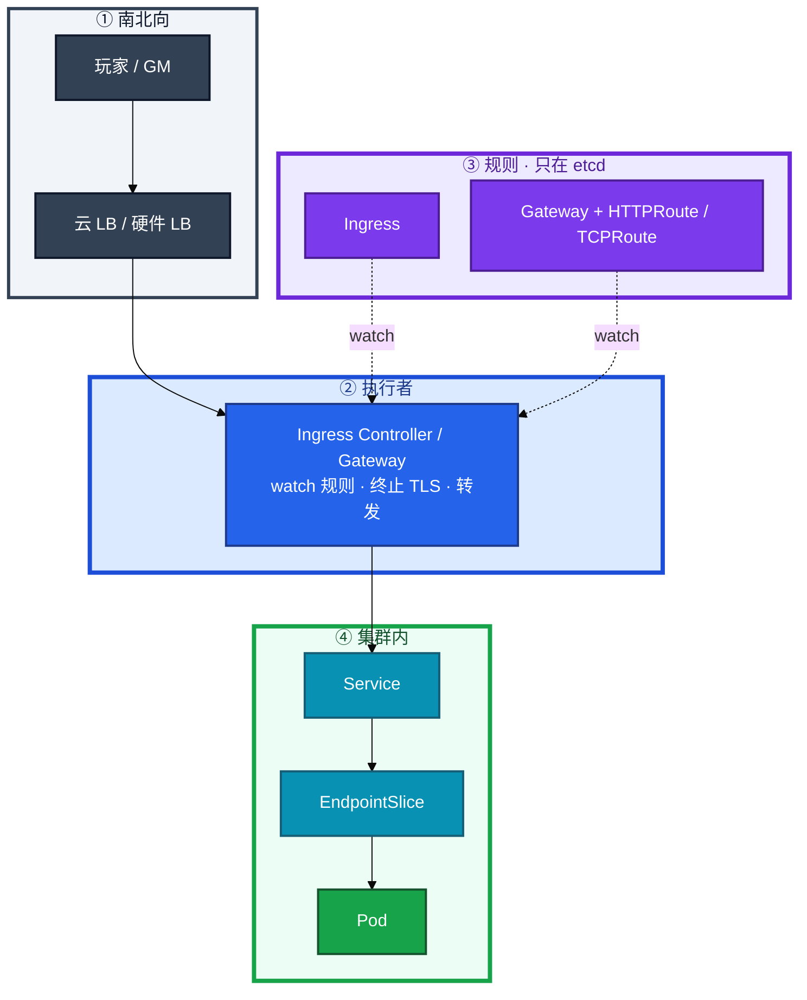
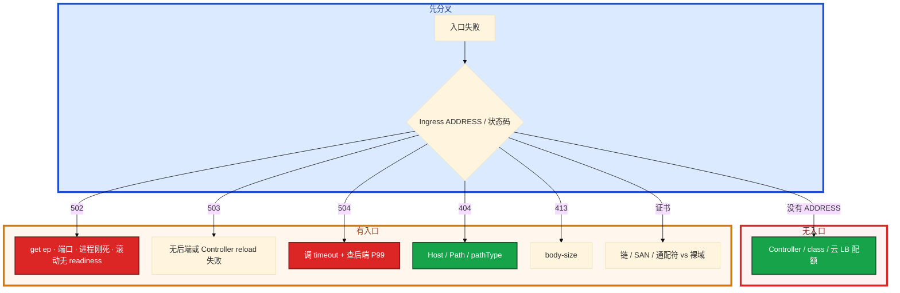

# Ingress 与流量管理


大厅 HTTPS 502。etcd 里 Ingress 对象在。有人要加 nginx 副本，另有人把战斗长连接也塞进同一层七层。证书是 `*.example.com`，apex 域手机打不开——先别动手。

**本章主线（排障就按这三步想）：**

1. **分轨**：HTTP 走七层 Ingress / Gateway；战斗长 TCP 走 L4 NLB / TCPRoute。
2. **认执行者**：Ingress 是规则，Controller 才转发；502 先看 Endpoints（08）。
3. **切流**：金丝雀用 weight，不靠副本比例；证书监控剩余天数。

**读完你能：** 白板上画出用户 → LB → Controller → Service → Pod；对比 Ingress 与 Gateway API；HTTP 走七层、战斗长 TCP 走 L4；502 先看 Endpoints；证书监控剩余天数。

## 本章目录

- [1. 基本概念](#1-基本概念)
- [2. 架构图](#2-架构图)
- [3. 原理](#3-原理)
- [4. 安装部署](#4-安装部署)
- [5. 核心配置](#5-核心配置)
- [6. 命令与操作](#6-命令与操作)
- [7. 生产排障](#7-生产排障)
- [8. 必会 · 常考](#8-必会--常考)
- [合上书](#合上书问自己)

**本章不讲：** Service / Endpoints / kube-proxy → [08](../08-Service与kube-proxy/)；滚动、蓝绿、有状态灰度、回滚 RTO → [15](../15-灰度与回滚/)；证书 Secret 注入、base64 → [12](../12-配置与密钥/)；Cilium Gateway / 无 sidecar Mesh → [23](../23-eBPF与Cilium/)；GitOps 管入口 YAML → [22](../22-GitOps-ArgoCD与Tekton/)；云 WAF / 安全组 → [07 云平台](../../07-云平台/)。Service Mesh 只留一段概念；Istio 控制面、sidecar 成本、何时不上 → [10-04 大规模可靠性架构](../../10-SRE实践/04-大规模可靠性架构/)。

---

## 1. 基本概念

Ingress 是 etcd 里的规则：Host / Path 转到哪个 Service。真正转发的是 **Ingress Controller** 进程（nginx / 云 ALB / APISIX…）。没有 Controller，apply Ingress 无流量效果。

**值班里怎么认现象**：

| 玩家/监控说的 | 技术含义 | 你的第一刀 |
|---------------|----------|------------|
| 「大厅 502」 | 网关到后端断了 | `get endpoints` |
| 「规则在没流量」 | Controller / class 问题 | `describe ingress` ADDRESS |
| 「长连接全掉」 | 七层 reload / timeout | 查 L4 还是 L7 |
| 「手机打不开 curl 过」 | 证书链 / SAN | `openssl s_client` |

| 组件 | 作用 |
|------|------|
| Ingress 资源 | 声明 Host/Path → Service |
| Ingress Controller | 执行者：生成配置并转发 |
| ingressClassName | 哪个 Controller 认领这条规则 |
| Gateway API | 下一代入口：GatewayClass / Gateway / Route |

为什么要这一层：一个 LB 入口，按域名 / 路径分给多个 Service，比每个 Service 一个云 LB 便宜，证书和域名也能收口。NodePort 是四层、每服务占端口、无 Host/Path，安全组难收。

**pathType：** `Prefix`（`/api` 吃 `/api` 和 `/api/x`）/ `Exact`（只精确匹配）。`ImplementationSpecific` 不可移植。backend 的 port 必须对上 Service。`/` Prefix 吃所有，匹配顺序看 Controller 实现。

注解是厂商货：nginx 的 canary-weight 换到 Traefik 就废。注解不被 API 校验，写错不报错只是不生效。

> **记住**：Ingress 是规则，Controller 是执行者；没 Controller 规则不生效。忘写 class，「规则在、流量不来」或被默认 class 抢走。

**面试怎么说**：「Ingress 对象不转发包，Controller 才 listen 80/443。502 我先 Endpoints，不是先加 nginx 副本。」

---

## 2. 架构图

先把整张图钉住。后面安装、命令、排障都对着这张图说话。



**读图三句话：**

1. **没有箭头从用户指向 Ingress 对象。** 对象不会转发一个包。
2. **Controller 才 listen 80/443**（或被云 LB 打进来）。
3. **后端仍是 Service → EndpointSlice → Pod**（08）。502 先看这一段，不要先加 Controller 副本。

七层与四层不要画成同一条管道：


---

## 3. 原理

### 3.1 规则不是执行者

**一句话：** Ingress 是 etcd 里的路牌，Controller 才是开车的司机。

**打个比方**：路牌写着「大厅往左」——没人开车（没有 Controller），玩家照样到不了。

**现场走一遍**（apply 了 Ingress，curl 不通）：

1. 看规则有没有被认领：

```bash
kubectl get ingress hall -n prod
kubectl describe ingress hall -n prod
```

2. 屏幕出现：

```text
Name:             hall
Address:          10.0.1.50
Ingress Class:    nginx
Rules:
  Host             Path  Backends
  ----             ----  --------
  hall.example.com /
                   hall-svc:80 (10.244.1.12:8080,10.244.2.8:8080)
```

3. 若 `Address` 为空——查 Controller 和 `ingressClassName`：

```bash
kubectl get pods -n ingress-nginx
kubectl get ingressclass
```

4. 带 Host 探活（绕过本地 DNS）：

```bash
curl -H "Host: hall.example.com" http://10.0.1.50/ -v -o /dev/null
```

5. 若 HTTP 200 但公网不通 → 查云 LB / DNS，不是 Service 坏了。

**输出解读：**

| 字段 | 正常 | 异常 |
|------|------|------|
| `Address` | 有 LB IP | 空 = Controller / class 问题 |
| `Backends` | 有 Pod IP:port | `<none>` = Endpoints 空 → 502 |
| `Ingress Class` | 与集群 class 一致 | 空 = 可能被默认抢走或谁都不认 |

**面试怎么说**：「apply Ingress 不等于有流量，要有 Controller watch 并认领 class。502 先看 Backends 有没有 Pod IP。」

### 3.2 Ingress vs Gateway API

**一句话：** Ingress 靠注解补能力；Gateway API 把 weight / 多协议写进标准字段。

**打个比方**：Ingress 像各品牌手机充电口不统一；Gateway API 像 USB-C——换实现少改线。

**现场走一遍**（金丝雀 10% 流量）：

1. Gateway API 标准写法（HTTPRoute）：

```bash
kubectl get httproute hall-canary -n prod -o yaml | grep -A10 backendRefs
```

2. 屏幕出现：

```yaml
backendRefs:
- name: hall-v1
  port: 80
  weight: 90
- name: hall-v2
  port: 80
  weight: 10
```

3. 对比 Ingress 注解（仅 nginx）：

```yaml
nginx.ingress.kubernetes.io/canary: "true"
nginx.ingress.kubernetes.io/canary-weight: "10"
```

4. 换 Traefik 注解全废——这就是「不可移植」。

**输出解读：**

| | Ingress | Gateway API |
|--|---------|-------------|
| 协议 | 主要 HTTP | HTTP / TCP / UDP / gRPC / TLS |
| 金丝雀 | annotation（厂商绑定） | `backendRefs.weight` |
| 角色 | 混在一条 Ingress | 平台管 Gateway，应用管 Route |
| 校验 | 注解写错不报错 | 标准字段进 API |

选型：新集群、多团队共享网关、需要 TCP/UDP/gRPC 原生路由 → 优先 Gateway API。存量 Ingress 稳定运行 → 不急着迁。**Ingress 不会立刻淘汰。**

**面试怎么说**：「金丝雀用 HTTPRoute weight，不靠副本 1:9。Gateway 三层：GatewayClass / Gateway / Route，角色分离。」

### 3.3 L4 / L7：游戏长连接

**一句话：** 大厅 HTTP 走七层；战斗长 TCP 走 L4——reload 和 timeout 会掐长连接。

**打个比方**：七层像酒店前台帮你拆信（HTTP）；四层像直接拉一根电话线（TCP）——战斗服要电话线，别硬塞前台。

| | 七层 | 四层 |
|--|------|------|
| 协议 | HTTP/HTTPS/gRPC | TCP/UDP |
| 能力 | Host/Path、终止 TLS、weight 金丝雀 | 不看 HTTP |
| 坑 | 缓冲、`proxy-read-timeout`、reload 断连接 | 无七层路由 |
| 谁用 | 大厅 HTTP、商城、官网、GM | 战斗长连接 |

**现场走一遍**（战斗长连接过 nginx 后全掉）：

1. 查 Controller 日志有没有 reload：

```bash
kubectl logs -n ingress-nginx deploy/ingress-nginx-controller --tail=50 | grep -i reload
```

2. 查 timeout 配置：

```bash
kubectl get configmap -n ingress-nginx ingress-nginx-controller -o yaml | grep timeout
```

3. 典型问题：`proxy-read-timeout` 默认 60s，会话 30 分钟 → 被网关掐断。

4. 正确做法：战斗走云 NLB + `Service type=LoadBalancer`，或 TCPRoute。

**输出解读：** 单副本 Controller 一 reload，长连接全断——副本 ≥2 + PDB。WebSocket 可以走七层，但要把读超时拉到会话长度，并接受 reload 风险。`use-forwarded-headers` 和云 LB 的 X-Forwarded-For 要成套，否则风控看成 Controller IP。

**面试怎么说**：「战斗长 TCP 不走七层 Ingress；timeout 小于会话长度会掐连接。L4 用 NLB 或 TCPRoute。」

### 3.4 TLS

**一句话：** 证书多在 Controller 或云 LB 终止；通配符不匹配裸域。

**打个比方**：`*.example.com` 像「所有子部门工牌」——不含总公司大门（apex 域 `example.com`）本身。

**现场走一遍**（手机打不开，curl 过）：

1. 查证书链：

```bash
openssl s_client -connect hall.example.com:443 -servername hall.example.com -showcerts </dev/null 2>/dev/null | openssl x509 -noout -subject -issuer -dates
```

2. 屏幕出现：

```text
subject=CN = *.example.com
issuer=C = US, O = Let's Encrypt, CN = R3
notAfter=Mar 15 12:00:00 2026 GMT
```

3. 若用户访问的是 `example.com`（裸域）——通配符**不匹配**，手机浏览器报错。

4. cert-manager Certificate 要两条 dnsNames：`*.example.com` 和 `example.com`。

**输出解读：**

| 模式 | 路径 |
|------|------|
| 最常见 | 客户端 HTTPS → Controller 终止 → 集群内 HTTP |
| 透传 | Controller 按 SNI 转 HTTPS 到 Pod |
| 云 LB 终止 | HTTPS → 云 LB → HTTP → Controller |

生产用 cert-manager 签发和续期，**监控剩余天数**（<30d P2，过期才发现是事故）。少中间证书时手机打不开、curl 却过——`openssl s_client -showcerts` 看链。

**面试怎么说**：「TLS 在 Controller 或云 LB 终止；通配符要另加 apex dnsName。证书告警 30 天。」

### 3.5 限流熔断降级：Mesh 只留一段

**一句话：** 限流防打爆，熔断防级联，降级保非核心——入口 + SDK 已覆盖大部分，不必先上 Istio。

**打个比方**：限流像景区限票；熔断像某游乐设施坏了拉警戒线；降级像「今日烟花秀取消，其它照常」。

五个模式互补：

| 模式 | 解决什么 |
|------|----------|
| 限流 | 防下游被打爆 |
| 熔断 | 防级联：连续失败 → Open 一段时间 |
| 降级 | 非核心返回默认值 / 缓存 / 跳过 |
| 重试 | 只对幂等操作自愈瞬时抖动 |
| 隔离 | 线程池 / 连接池 / Bulkhead，故障不扩散 |

**现场走一遍**（登录被刷，网关 429）：

1. 看入口日志 / 指标：RPS 是否触顶。

2. 区分：**入口 429** = 南北向限流；**API Server 429** = APF（03），不是一回事。

3. 游戏登录被刷：入口 RPS + 验证码；匹配暴增：队列 + 排队。

4. 熔断 Open 时**不要继续重试**——Open 还重试就是打下游。支付 POST 默认不重试（双发风险）。

5. 支付不能降级（强一致）；排行榜、好友推荐可以返回空榜 / 旧缓存。

**输出解读：** 令牌桶允许突发，**生产常用**。固定窗口有整点边界突刺。实现可以是 SDK（Sentinel / Resilience4j）或入口层。Service Mesh 是增强不是前提——Cilium / Istio 见 23 和 10-04。

**面试怎么说**：「限流熔断降级各解决不同问题；支付不能降级。必须上 Istio 才能限流——错，入口 + SDK 已够。」

> **记住**：HTTP 走七层；战斗长 TCP 走 L4。Gateway weight 是标准字段，别写进厂商注解。

---

## 4. 安装部署

### 4.1 Controller 怎么放

| 项 | 选 | 不选 |
|----|----|------|
| 副本 | ≥2 + PDB + 反亲和 | 单副本入口 |
| 形态 | Deployment + Service LB，或云 ALB Ingress | 业务 Worker 上顺手跑一份 nginx |
| class | 显式 ingressClassName | 靠默认 class 碰运气 |
| 超时 / body | 按上传和后端 P99 | 只调大 timeout 不修后端 |
| 限流 / WAF | 云 WAF 或 APISIX | 只调 nginx body-size 当安全 |

Controller 常见：ingress-nginx（注解多）、云 ALB Ingress、APISIX / Kong（限流 WAF）。**注解是厂商货，换 Controller 会废。**

裸金属暴露：DaemonSet + hostNetwork 80/443，或 NodePort + 外部 LB，注意和节点上其它 hostNetwork 游戏进程抢端口（10、13）。

验收：Controller Ready、Ingress 有 ADDRESS、`curl -H Host` 通、证书链完整。不要只看 etcd 里有对象。

### 4.2 Gateway API 落地

装实现（Envoy Gateway / Cilium / 云 Gateway）→ 建 GatewayClass → 平台建 Gateway（监听 443 + 证书）→ 应用建 HTTPRoute，`parentRefs` 指向 Gateway。跨 NS 用 ReferenceGrant 授权。

| 场景 | 选 |
|------|----|
| 新集群、多团队共享网关、要 TCP/gRPC 标准路由 | Gateway API |
| 存量 nginx 注解已经跑稳、没有换实现计划 | Ingress 留下 |
| 只要一个 Host 的 HTTP | Ingress 够用 |
| 金丝雀要可移植 weight | Gateway HTTPRoute |
| 已用 Cilium 做入口 | 23，不必再叠一层 nginx |

---

## 5. 核心配置

| 项 | 生产怎么用 | 改错会怎样 |
|----|------------|------------|
| ingressClassName | 每个 Ingress 写明 | 无 ADDRESS 或被默认抢走 |
| pathType | Prefix / Exact 显式写 | ImplementationSpecific 不可移植 |
| backend.port | 对上 Service port | 立刻 502 |
| canary-weight 注解 | 仅存量 nginx | 换 Traefik 全失效 |
| HTTPRoute weight | 新集群标准金丝雀 | 只改副本比例不准 |
| proxy-read-timeout | ≥ 会话长度 | 长连接被掐 |
| body-size | 按上传；大文件走对象存储 | 413；不要把入口撑成文件网关 |
| use-forwarded-headers | 与云 LB 成套，只信最外层 hop | 风控看成 Controller IP / 可伪造 |
| TLS Secret | cert-manager 续期 | 过期才发现 |
| Controller 副本 | ≥2 + PDB | 单副本 reload 全断 |

> **记住**：注解不被 API 校验。Gateway `backendRefs.weight` 才是可移植金丝雀。通配符不匹配裸域。

---

## 6. 命令与操作

### 6.1 命令速查

| 目的 | 命令 | 看什么 |
|------|------|--------|
| 规则和入口 | `kubectl get ingress,httproute,gateway -A` | ADDRESS、class |
| 规则细节 | `kubectl describe ingress <n>` | Events、backend、TLS |
| 后端 | `kubectl get endpoints <svc>` | **502 先看这里**（08） |
| Controller | `kubectl get pods -n ingress-nginx` | Ready、reload 日志 |
| 带 Host 探活 | `curl -H "Host: app.example.com" http://<LB>/ -v` | 状态码 |
| 证书链 | `openssl s_client -connect <host>:443 -servername <host> -showcerts` | 中间证书、SAN |

值班先跑：

```bash
kubectl describe ingress <n>
kubectl get pods -n ingress-nginx
curl -H "Host: app.example.com" http://<LB>/ -v
kubectl get endpoints <svc>
```

### 6.2 金丝雀权重与证书续期

HTTPRoute 主 90 / canary 10。5xx 升高：权重归零或摘 canary backend，不必等 100%。观察窗口看错误率、P99、登录成功，不只看 Pod Ready。决策表在 15。

流量镜像（RequestMirror）：把一份请求拷到影子，**响应丢弃**。只验证读路径；支付 / 写库存不要镜像，会双写。金丝雀才是真实用户流量。

cert-manager 出 Certificate status。过期先看 Secret 是否仍被引用、监控为什么没响，不要先重启 Controller。通配符另加 apex 的 dnsName。

### 6.3 多 Controller / 裸金属

测试 nginx、生产 APISIX 同集群：每个 Ingress 写 ingressClassName。忘写会被默认 class 抢走或谁都不认。裸金属 hostNetwork 抢端口时，游戏进程和入口不要同一节点池混部。

---

## 7. 生产排障

三问：进程还在不在（Controller Ready）？还能不能变更（规则能否更新）？已有流量还通不通（长连接 / HTTP）？



| 现象 | 先做什么 | 不要做什么 |
|------|----------|------------|
| Ingress 没有 ADDRESS | Controller、class、云 LB | 先改业务镜像 |
| 502 | `get ep`；滚动回 04 / 15 | 先加 Controller 副本 |
| 503 | 后端 / reload 日志 | 当 DNS 坏了 |
| 504 | timeout + 后端 P99 | 只加大 timeout |
| 404 | Host / Path / pathType | 重启 Controller |
| 413 | body-size；大文件走对象存储 | 把入口当文件网关 |
| 手机打不开 curl 过 | openssl 看链 | 先换 Controller |
| 规则在流量不来 | class 认领 | 当 Service 坏了就停 |
| 滚动期 502 | readiness / grace（04、15） | 只加 nginx |
| 金丝雀 5xx 升 | weight 归零 | 再观察 10 分钟 |

滚动期 502：readiness 没挡住，或 grace 太短，Pod 还在接流量就被杀。回到 04 / 15。

---

## 8. 必会 · 常考

| 说法 | 对错 | 口径 |
|------|:----:|------|
| apply Ingress 就有流量 | 错 | 要有 Controller 认领 |
| Ingress 马上会淘汰 | 错 | 存量稳定不急迁 |
| nginx canary-weight 是集群标准 | 错 | 厂商注解，换实现即废 |
| 副本 1:9 就是 10% 金丝雀 | 错 | kube-proxy 粗；入口权重准 |
| 战斗长 TCP 走七层 Ingress | 错 | timeout / reload 断流；走 L4 |
| 单副本 Controller 也能扛 reload | 错 | 一 reload 长连接全断 |
| 通配符匹配裸域 | 错 | `*.example.com` ≠ `example.com` |
| 502 先加 nginx 副本 | 错 | 先看 Endpoints |
| 504 只加大 timeout | 错 | 还要修后端 P99 |
| 支付可以降级成空响应 | 错 | 强一致；排行榜才可以 |
| 熔断 Open 时继续重试 | 错 | 打下游；支付 POST 默认不重试 |
| 必须上 Istio 才能限流 | 错 | 入口 + SDK + 开关已覆盖大部分 |
| X-Forwarded-For 随便信任 | 错 | 与 LB 成套，只信最外层 |
| 429 一定是 APF | 错 | 入口 429 是南北向；API 429 是 03 |

数字：Controller ≥2；证书告警 **30 天**；重试 1–2 次；金丝雀 5% 已坏就归零。

易混：规则 vs 执行者；Ingress vs Gateway；502 vs 504；L4 vs L7；入口 429 vs APF 429；weight vs 副本比例。

---

## 合上书，问自己

1. Ingress 对象会转发包吗？谁才是执行者？
2. Ingress 和 Gateway API 三层差在哪？要不要立刻迁？
3. 战斗长连接为什么不用七层？L4 怎么暴露？
4. 502 / 504 / 无 ADDRESS 各先看什么？
5. TLS 在哪终止？通配符能配裸域吗？
6. 限流熔断降级各解决什么？支付能降级吗？网格必须上吗？

六题都能口述，这一章就过了。下一章把切流和回滚剖开：滚动四件套、蓝绿秒切、金丝雀权重，以及战斗服为什么不能当 Web 滚。
