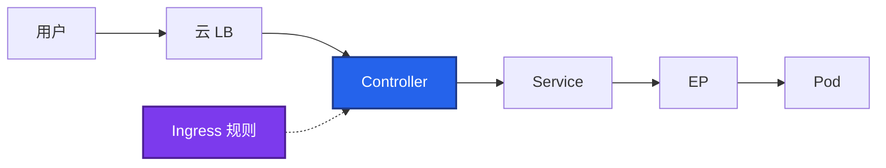

# 14｜Ingress 与流量管理 · 练习题

先自己画图或口述，再对照解答。每题标了覆盖范围：

| 标记 | 含义 |
|------|------|
| **核心** | 不懂整章就没建立起来 |
| **必会** | 值班和面试都要能讲 |
| **常用** | 线上会反复碰到 |
| **常考** | 白板和追问的高频口径 |

## 本题目录

- [Q1 规则与执行者](#q1)
- [Q2 Ingress vs Gateway API](#q2)
- [Q3 长连接与 L4](#q3)
- [Q4 502 / 503 / 504](#q4)
- [Q5 金丝雀权重](#q5)
- [Q6 TLS](#q6)
- [Q7 无 ADDRESS / 多 Controller](#q7)
- [Q8 限流熔断降级](#q8)
- [Q9 令牌桶与登录刷](#q9)
- [Q10 转发头](#q10)
- [Q11 413 与镜像流量](#q11)
- [合上书](#合上书)

---

## Q1

**★★★★★｜Ingress、Controller、Service 什么关系？为什么不每个服务一个 LB？**

**覆盖**：核心 · 必会 · 常考

### 场景

apply 了 Ingress，浏览器没流量。etcd 里对象是有的。有人说 Service 坏了。

### 完整解答

Ingress 是七层规则对象（Host/Path → Service）。Controller 才是反向代理，watch 规则生成配置并转发到 Service → Endpoints → Pod。没有 Controller，规则是死数据。`ingressClassName` 决定谁认领。



一个入口按域名 / 路径分发，比每个 Service 一个云 LB 省钱，证书和域名也能收口。NodePort 是四层、占端口、无 Host/Path。

### 再追问

pathType Prefix `/api` 匹配 `/api` 和 `/api/x`。Exact 只精确匹配。`/` Prefix 吃所有。

---

## Q2

**★★★★★｜Ingress 有什么局限？Gateway API 三层怎么解决？要不要立刻迁移？**

**覆盖**：核心 · 必会 · 常考

### 场景

nginx 的 canary-weight 在测试集群换成 Traefik 全失效。应用团队写的 Ingress 把平台路径盖了。

### 完整解答

局限：主要只管 HTTP；金丝雀 / header / TCP 靠 annotation 厂商绑定；规则和基础设施混在一起；注解不被 API 校验，写错只是不生效。

```
GatewayClass   哪类实现（平台）
Gateway        入口实例：端口 / 协议 / TLS（平台）
Route          HTTPRoute / TCPRoute…（应用）
               parentRefs 挂 Gateway，跨 NS 要 ReferenceGrant
```

Gateway API：标准字段、多协议、weight 金丝雀、角色分离。新集群优先；存量 Ingress 稳定就不急着迁。Ingress 不会立刻淘汰。应用写 HTTPRoute，平台控制谁能接入。

### 再追问

实现方要背 Istio CR 吗？——不要。Envoy Gateway / Cilium / 云 Gateway 知道名字即可。Cilium 深水在 23。

---

## Q3

**★★★★★｜游戏长连接为什么不用七层 Ingress？L4 怎么暴露？**

**覆盖**：核心 · 必会 · 常考

### 场景

战斗 TCP 走了 ingress-nginx。活动中 reload 配置，在线全断。WebSocket 活动页超时被踢。

### 完整解答

七层有 proxy-read-timeout、缓冲、reload 断流。长 TCP / 战斗连接走七层会被掐。HTTP 商城、官网、GM 才用 Ingress / Gateway。

WebSocket 可以走七层，但要把读超时拉到会话长度，并接受 reload。副本 ≥2 只影响正在 reload 的那一个；单副本入口一 reload 全断。

L4：云 NLB + LoadBalancer Service，或 ExternalTrafficPolicy Local 保源 IP。客户端直连 NodePort 会在节点扩缩时全员改地址。Controller 要 ≥2 + PDB：既是可用性，也是 reload 时的断流面。

### 再追问

Gateway TCPRoute 算四层吗？——算。这是 Gateway 相对 Ingress 的协议面，不必靠 nginx stream 注解。

---

## Q4

**★★★★★｜502 / 503 / 504 怎么分？发版时反复 502 先看什么？**

**覆盖**：核心 · 必会 · 常用

### 场景

滚动大厅时入口 502。Endpoints 有时是空的。有人调大 Controller 超时。

### 完整解答

| 码 | 含义 |
|----|------|
| 502 | 后端立刻失败：Endpoints 空、端口错、进程刚死 |
| 503 | 无可用后端，或 Controller 自己 reload 失败 |
| 504 | 等后端超时：调超时 + 查后端 P99 |

先 describe Ingress + get endpoints + Controller 日志，再 `curl -H Host`。滚动 502 回到 readiness 和 grace（04、15），不是先加 nginx 副本。504 只加大 timeout 不够，后端 P99 真慢要修后端。

### 再追问

404？——Host / Path / pathType。413？——body-size。无 ADDRESS？——Controller / class / 云 LB。

---

## Q5

**★★★★☆｜Gateway API 怎么做金丝雀？和 Ingress 注解、和 15 章什么关系？**

**覆盖**：必会 · 常用 · 常考

### 场景

要 10% 流量打到 canary Service。不想写 nginx annotation。错误率已经超阈，有人说再观察 10 分钟。

### 完整解答

HTTPRoute `backendRefs` 多个后端 + weight：主 90、金丝雀 10。标准 API，换实现也一致。Ingress 用 canary-weight / header 注解，厂商绑定。

Argo Rollouts 按指标自动改权重——入口给路由能力，发布控制器做渐进。有状态约束、回滚 RTO 见 15。只靠 Deployment 副本 1:9 不准。长连接更偏。

5xx 升高：权重归零或摘 canary，不必等 100%。RTO 可以是秒级。

### 再追问

流量镜像能代替金丝雀吗？——不能。镜像响应丢弃，且写路径会双写。支付不要镜像。见 15。

---

## Q6

**★★★★☆｜TLS 配在哪？通配符能匹配裸域吗？链不全什么现象？**

**覆盖**：必会 · 常用 · 常考

### 场景

手机打不开、curl 却过。证书是 `*.example.com`。apex 域 `example.com` 浏览器报错。

### 完整解答

常见在 Controller 终止：客户端 HTTPS 到入口，集群内 HTTP。Secret 类型 `kubernetes.io/tls`，Ingress spec.tls 或 Gateway 监听器引用。cert-manager 续期，监控剩余天数 <30d。

通配符 `*.example.com` **不匹配** `example.com`。少中间证书：手机严格、curl 可能过。`openssl s_client -showcerts` 看链。过期先看 Certificate status 和 Secret 引用，不要先重启 Controller。

### 再追问

云 LB 终止 TLS 时 Controller 还要证书吗？——集群内常是 HTTP；若 LB→Controller 仍 HTTPS 则两边都要。

---

## Q7

**★★★★☆｜Ingress 没有 ADDRESS？多个 Controller 怎么共存？**

**覆盖**：必会 · 常用

### 场景

测试 nginx、生产 APISIX 同集群。忘写 ingressClassName，规则在流量不来。

### 完整解答

ADDRESS 空：Controller 没跑、class 不匹配、云 LB 没建出来或配额用尽。查 Controller Pod 和 Service 是否 LoadBalancer。

多 Controller 用 ingressClassName 认领。忘写会被默认 class 抢走或谁都不认。Gateway API 用不同 Gateway 实例，少靠 class hack。

裸金属：DaemonSet + hostNetwork，或 NodePort + 外部 LB。和节点上 hostNetwork 游戏进程抢端口（10、13）。

### 再追问

验收只看 etcd 有 Ingress 对象？——不算。必须有 ADDRESS 且 `curl -H Host` 通。

---

## Q8

**★★★★☆｜限流、熔断、降级、重试、隔离各解决什么？支付能降级吗？**

**覆盖**：必会 · 常用

### 场景

下游排行榜挂了，登录也被拖死。另一边网格默认重试把支付 POST 打了两次。

### 完整解答

限流防打爆；熔断防级联；降级保核心路径；重试只对幂等自愈抖动；隔离让故障不扩散。五个互补。

支付 **不能** 降级，必须强一致。排行榜、好友推荐可以返回空 / 缓存 / 跳过。熔断 Open 时不要重试。重试限制次数 + 退避。不用 Mesh 也能做：入口限流 + SDK + 业务开关 + K8s 资源隔离。网格是增强。Cilium / eBPF 网格见 23。本库不单开 Istio 章。

### 再追问

429 是入口限流还是 API Server APF？——看哪一层返回。入口 429 是南北向；API 429 是控制面（03）。

---

## Q9

**★★★☆☆｜令牌桶和漏桶怎么选？登录被刷怎么限？**

**覆盖**：常用 · 常考

### 场景

开服登录被刷。有人用固定窗口，整点边界被打穿。

### 完整解答

固定窗口简单、边界突刺。滑动窗口更平滑。令牌桶允许突发，生产常用。漏桶严格匀速。登录：入口 RPS + 验证码；服务间按用户 ID 限频。分布式限流可用 Redis + Lua 或网关能力。

### 再追问

匹配暴增？——队列 + 排队，不要只靠入口 429 把合法玩家挡死。

---

## Q10

**★★★☆☆｜X-Forwarded-For 配错会怎样？**

**覆盖**：常用

### 场景

风控把所有请求当成同一个 IP。那个 IP 是 Controller Pod。

### 完整解答

没正确信任云 LB 传来的转发头时，应用看到的是 Controller。重复信任则客户端可伪造。`use-forwarded-headers` 和 LB 要成套，只信最外层 hop。L4 `ExternalTrafficPolicy: Local` 保源 IP 是另一条路，不必靠七层头（08）。

### 再追问

只信最外层还是把整条 XFF 链都信？——只信最外层 hop。链上客户端可插值。

---

## Q11

**★★★☆☆｜413？金丝雀已经 5xx，还要等滚完吗？流量镜像呢？**

**覆盖**：常用

### 场景

GM 上传资源包入口 413。另一边 HTTPRoute weight 10 打 canary，错误率已超阈。有人要用镜像流量代替金丝雀。

### 完整解答

Controller 默认 body 限制（nginx 常见 1m）。按实际上限调，大文件走对象存储直传，不要把入口撑成文件网关。

金丝雀 5xx：权重归零或摘 canary，不必等 100%。观察窗口看错误率、P99、登录成功，不只看 Pod Ready。决策表在 15。

流量镜像：拷请求、丢响应。只适合读路径压新版本；支付 / 写库存会双写。不能代替真实用户金丝雀。

### 再追问

入口 RTO？——改 weight 是秒级。有状态战斗服回滚不是这一层能单独救的，见 15。

---

## 合上书

- [ ] 能画出用户 → LB → Controller → Service → Pod，并说明没 Controller 规则不生效
- [ ] 能对比 Ingress 与 Gateway API 三层，并说出不急迁存量
- [ ] 能说明 HTTP 走七层、战斗长 TCP 走 L4；Controller ≥2 防 reload 全断
- [ ] 能分 502 / 503 / 504 / 无 ADDRESS，滚动 502 回到探针
- [ ] 能用 HTTPRoute weight 做金丝雀，5% 已坏就归零
- [ ] 能讲 TLS 终止位置、通配符不配裸域、证书 30 天告警
- [ ] 能说出限流熔断降级；支付不降级、不乱重试；网格不是前提
