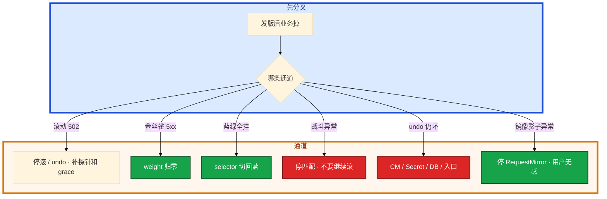

# 灰度与回滚


大厅新版本滚动完，Ready 全绿，登录成功率已经掉。群里有人要再观察 10 分钟。战斗 Deployment 按同一套 `set image` 在滚，对局在内存里。道具表已经 migrate，有人 `rollout undo`。

先别动手。这一章后半全是你会动手的：**怎么滚、怎么切蓝绿、怎么改 weight、怎么 undo、战斗服怎么发。** 前面的概念，是为了让你动手时不把 Ready 当成功，也不把有状态当 Web 滚。

**读完你能：** 画出滚动 / 蓝绿 / 金丝雀 / 流量镜像；回滚 RTO 写进发布单；战斗服不杀对局；undo 不够时知道还要回 CM / DB / 入口。

## 本章目录

缩进 = 上下级。3 下面才是 3.1。

想钉在**正文左边**跟着滚：菜单 **查看 → 打开视图 → 大纲**。Markdown 预览做不到独立左栏，目录只能写在文章开头。

- [1. 基本概念](#1-基本概念)
- [2. 架构图](#2-架构图)
- [3. 原理](#3-原理)
  - [3.1 滚动四件套](#31-滚动四件套)
  - [3.2 蓝绿](#32-蓝绿切-selector)
  - [3.3 金丝雀](#33-金丝雀入口权重准)
  - [3.4 流量镜像](#34-流量镜像shadow)
  - [3.5 游戏服约束](#35-游戏服不能当-web-滚)
- [4. 安装部署](#4-安装部署)
- [5. 核心配置](#5-核心配置)
- [6. 常用命令](#6-常用命令)
- [7. 常用操作](#7-常用操作)
  - [7.1 发前检查单](#71-发前检查单)
  - [7.2 回滚决策](#72-回滚决策)
  - [7.3 冻结窗口与 hotfix](#73-冻结窗口与-hotfix)
- [8. 生产排障](#8-生产排障)
- [9. 必会 · 常考](#9-必会--常考)
- [合上书](#合上书问自己)

**本章不讲：** 探针、preStop、grace → [04](../04-Pod生命周期/)；Deployment 滚动字段、PDB → [05](../05-工作负载控制器/)；HPA 和 replicas → [07](../07-弹性伸缩/)；Ingress / Gateway weight 实现 → [14](../14-Ingress与流量管理/)；CM env 不热更 → [12](../12-配置与密钥/)；热更 / 开合服运营 → [08-02](../../08-游戏运维专题/02-开服合服/)、[08-03](../../08-游戏运维专题/03-热更新与版本发布/)；ArgoCD / Rollouts / Tekton → [22](../22-GitOps-ArgoCD与Tekton/)、[05](../../05-工程化与自动化/)。Helm CR 和流水线在 21、22。

---

## 1. 基本概念

你要发大厅新版本。观察窗口看 **错误率、P99、登录成功率、CCU**，不要只看 Pod Ready。Ready 全绿、登录已经掉，该停。

| 方式 | 怎么切 | 回滚 | 代价 |
|------|--------|------|------|
| **滚动 Rolling** | 同一 Deployment 逐步换副本 | `rollout undo`，分钟级 | 省资源；空窗看四件套 |
| **蓝绿 Blue-Green** | 两套齐活，切 Service / Ingress / Gateway | 切回去，**秒级** | 双倍副本；schema 必须兼容 |
| **金丝雀 Canary** | 小比例或 header，看指标再放量 | 权重归零 | 资源紧、要观察 |
| **流量镜像 Mirror** | 拷请求到影子，**响应丢弃** | 停镜像即可 | 不验证真实用户；写路径会双写 |

回滚 RTO 先写进发布单：无状态目标 **2–5 分钟**（undo 或切流）；有状态按能否不停服定，定不了就不要在高峰发。开服、大活动、合服当晚冻结普通灰度，只留 hotfix 通道。

> **记住**：切流方式决定回滚速度；成功看业务指标，不看 Ready 全绿。镜像不是金丝雀。

---

## 2. 架构图

先把四种切流钉在一张图上。后面命令、检查单、排障都对着这张图说话。

```mermaid
%%{init: {"flowchart": {"padding": 18, "nodeSpacing": 30, "rankSpacing": 50}, "theme": "base"}}%%
flowchart TB
    subgraph roll ["滚动 · 同一 Deployment"]
        r1[旧副本] --> r2[先起新 · readiness 挡住]
        r2 --> r3[TERM / preStop 抽干]
    end

    subgraph bg ["蓝绿 · 两套齐活"]
        blue[hall-blue 接流量]
        green[hall-green 待命]
        sel[改 Service selector]
        blue --- sel
        green --- sel
    end

    subgraph canary ["金丝雀 · 入口权重"]
        w90[v1 weight 90]
        w10[v2 weight 10]
        gw[HTTPRoute / Ingress]
        gw --> w90
        gw --> w10
    end

    subgraph mirror ["镜像 · 影子不接用户"]
        live[正式后端]
        shadow[影子 v2 · 丢响应]
        m[RequestMirror]
        m --> live
        m --> shadow
    end

    classDef a fill:#2563EB,stroke:#1E3A8A,stroke-width:2px,color:#fff
    classDef b fill:#16A34A,stroke:#14532D,stroke-width:2px,color:#fff
    classDef c fill:#7C3AED,stroke:#4C1D95,stroke-width:2px,color:#fff
    classDef d fill:#D97706,stroke:#92400E,stroke-width:2px,color:#fff
    class r1,r2,r3 a
    class blue,green,sel b
    class w90,w10,gw c
    class live,shadow,m d

    style roll fill:#DBEAFE,stroke:#1D4ED8,stroke-width:4px,color:#1E3A8A
    style bg fill:#ECFDF5,stroke:#16A34A,stroke-width:4px,color:#14532D
    style canary fill:#EDE9FE,stroke:#6D28D9,stroke-width:4px,color:#4C1D95
    style mirror fill:#FFF7ED,stroke:#D97706,stroke-width:4px,color:#9A3412
```



选型一口回：要秒级回切且有预算 → 蓝绿。资源紧、要小流量验证 → 金丝雀。默认省资源 → 滚动。只想看新版本扛不扛读流量、不碰用户 → 镜像（只读路径）。

---

## 3. 原理

**本节 5 块：** 3.1 滚动 · 3.2 蓝绿 · 3.3 金丝雀 · 3.4 镜像 · 3.5 游戏

### 3.1 滚动四件套

你 `kubectl set image deploy/hall *=hall:v2`。默认策略。接近零停机靠四件套，缺一件就 502 或卡死：


1. `maxUnavailable: 0`（先起后杀）。
2. **readiness** 挡住未就绪——没有探针，K8s 把 Running 当可接流量。
3. preStop + 处理 SIGTERM，`terminationGracePeriodSeconds` 够。
4. `minReadySeconds` 防「Ready 立刻挂」。

| 卡在 | 你看到的 | 先看 |
|------|----------|------|
| 新 Pod 进了 Endpoints 太早 | 滚动 502 | readiness（04） |
| 新 Pod 永不 Ready | 滚动卡住 | 探针、依赖、liveness 过严 |
| 新 Pod Pending | 滚动不动 | surge 把资源吃满（06） |
| Ready 满、业务掉 | status 成功 | 立刻 undo，看 Grafana |
| undo 无历史 | history 空 | revisionHistoryLimit |
| PDB 挡住 | drain / 滚动等着 | 少副本要把 PDB 和 maxUnavailable=0 一起看（05） |

镜像固定 digest / tag。`revisionHistoryLimit ≥ 5`，否则 undo 无历史。卡住先 `rollout undo`，再查新 Pod。HPA 和 YAML replicas 打架见 05、07。配置 env 不热更，回滚 Deploy 要连 CM 一起回（12）。

滚动中 HPA 的坑：新副本 Ready 前，利用率被旧副本高峰拉高，HPA 加仓，`maxSurge` 再加仓，节点 Insufficient → 看起来像滚动卡死。发版窗口把 HPA 冻结或提高 min、看 surge，写进检查单第 3 条。

`kubectl rollout pause` 停在当前比例观察：有问题 undo，没问题 resume——手工金丝雀。pause 不是蓝绿：流量仍按 Service 均分到已 Ready 的新旧副本，入口没切 weight 时比例仍然粗。

Recreate：先杀光再起。适合不能双版本共存（独占盘、协议硬断）。接受中断窗口，并公告。RTO 等于停服窗口，不是分钟级 undo。战斗协议不兼容时不要「小比例金丝雀互打」。独占 RWO 两套都要盘时往往不能蓝绿，先迁或接受 Recreate 窗口。

### 3.2 蓝绿：切 selector

大厅要秒级回切。两套 Deployment（或两套副本集）都 Ready，再改 Service selector / Ingress backend / Gateway Route。回切同一下。

```
Service selector: app=hall, color=blue
       +-- hall-blue   Ready × N     ← 当前接流量
       +-- hall-green  Ready × N     ← 齐活但不接流量
切流：selector color=green
回滚：selector color=blue     ← 秒级
代价：双倍副本；DB schema 必须双版本兼容
```

绿全 Ready、Endpoints 还全是蓝；切 selector 之后 Endpoints 换成绿。蓝绿切完全挂：selector 切回蓝，再查绿的配置。

**兼容窗口：** 一个发布窗口内新旧代码必须能共读同一份数据。不兼容的表结构变更拆步：先加列 → 发代码 → 再删旧列。游戏道具表乱改是回滚死局——代码能 undo，数据不一定能 undo。绿已经写了新 schema，切回蓝会让旧代码读新数据——蓝绿解决的是进程版本，不是数据兼容。先停写，评估正向修。

### 3.3 金丝雀：入口权重准

入口权重和副本比例不是一回事：

| | 入口（准） | 副本比例（粗） |
|--|-----------|----------------|
| 手段 | Ingress / HTTPRoute weight | 两个 Deploy 共用 selector |
| 例 | v1 90% / v2 10% | v1 9 副本 / v2 1 副本 ≈ 不稳的 10% |
| 长连接 | 新登录才慢慢挪 | 旧房间粘在旧进程，更偏 |

更细：header / cookie 把内部号圈住。只滚服务端、不管客户端包体版本，会把外网当小白鼠——服务端 10% 金丝雀，客户端可能 100% 打到新入口。对：入口 header 金丝雀（内部号 / 白名单），或 Gateway weight + 客户端版本门闸同时开。

自动分析：错误率、延迟、业务指标超阈就回。没有分析的「金丝雀」只是人工少看一眼。5% 已经坏，权重归零，不必等 100%。

工程化：Argo Rollouts / GitOps 把权重和分析自动化，原理仍是金丝雀 + 指标回滚。实现放到 22 和 05，本章不展开 CR。

### 3.4 流量镜像（shadow）

把正式流量拷一份到新版本，用户只吃正式响应。Gateway API `RequestMirror`、部分网格的 mirror 策略走这条。

| 能做什么 | 不能做什么 |
|----------|------------|
| 看新版本 CPU / P99 / 是否 panic | 代替真实用户金丝雀 |
| 回归只读接口 | 镜像支付 / 写库存 / 发货（双写） |
| 不占用户错误率 | 影子没有真实会话状态时战斗服无意义 |

镜像挂了不要当生产事故切流；停 mirror 即可。金丝雀 5xx 才是用户有感。两者可叠：先镜像压读，再小流量金丝雀。

### 3.5 游戏服不能当 Web 滚

对局在内存里。滚 = 杀进程。新副本不会自动接手旧房间。`rollout status` 顺利，CCU 断崖、对局结算失败——立刻停匹配、禁新进，不要继续 rollout。

| 负载 | 可以 | 不可以 |
|------|------|--------|
| 大厅、支付 HTTP、官网 | 滚动 / 金丝雀 / 蓝绿 | 无 readiness 硬滚 |
| 匹配 | 小比例金丝雀，看匹配成功率和耗时 | 和战斗协议不兼容时双版本互打 |
| 房间 / 战斗进程 | 新开空服接新房间；或维护窗口 | **对局中滚动替换** |
| 强更 | 客户端版本门闸，旧客户端进不了新协议 | 只滚服务端不管协议 |
| 热更 | 配置 / 脚本热加载，进程不杀 | 当成 Deployment 滚动 |

```
战斗服发布
1. 停匹配 / 禁新进房间（止血开关）
2. 等对局结束，或只把新房间调度到新实例
3. 旧进程自然空了再下
4. 协议不兼容 → 客户端门闸，不是多滚几个 Pod
```

热更成功、滚动失败可以并存：脚本热更了，进程没换，下一次 Deploy 仍会杀进程。两套通道写在同一张发布单上，避免运营以为「已经热更过了所以这次滚动无感」。热更大表走对象存储 + 版本指针（12），不是 CM 滚动。

开服当天禁止普通灰度：容量是预案，不是现场 HPA + 新版本。必须热修走审批通道。

回滚 RTO：无状态 undo 或切流，目标分钟级。有状态还要问 **数据是否已经用新 schema 写过**——先停写，再决定回代码还是修数据。盲 undo 会把新格式数据交给旧代码。

> **记住**：战斗服不杀对局；热更 ≠ 滚动；强更是客户端门闸。镜像不碰写路径。

---

## 4. 安装部署

灰度不是装一个组件，是发布通道要先存在：

| 通道 | 集群里要有什么 |
|------|----------------|
| 滚动 | Deployment RollingUpdate + 探针 + PDB |
| 蓝绿 | 两套 Deploy + 可改的 Service / Ingress |
| 金丝雀 | Gateway HTTPRoute weight 或 Ingress 注解；指标门禁（18） |
| 镜像 | Gateway RequestMirror；影子 Deploy 不挂正式 Service |
| 游戏战斗 | 独立池、停匹配开关、客户端门闸 |

托管 ACK：点「发布」仍要自己选通道。厂商不会替你停匹配。GitOps / Rollouts 落在 22，本章把通道原理焊死。

---

## 5. 核心配置

| 项 | 生产怎么用 | 改错会怎样 |
|----|------------|------------|
| maxUnavailable | **0** 先起后杀 | 默认 25% 滚动空窗 502 |
| maxSurge | 留余量；资源紧别一次拉满 | Pending 看起来像滚动卡死 |
| minReadySeconds | 防 Ready 立刻挂 | 抖一下算成功 |
| revisionHistoryLimit | **≥ 5** | 0 = 拆掉 undo |
| 镜像 | digest / 不可变 tag | latest 回不去 |
| HTTPRoute weight | 金丝雀准切 | 只改副本比例不准 |
| Recreate | 协议硬断 / 独占 RWO | 能共存却 Recreate = 无谓停服 |
| HPA | 发版窗口看会不会打回 replicas | undo 后又被改掉 |
| RequestMirror | 只镜像读路径 | 支付 / 写库存双写 |

HTTPRoute 金丝雀与镜像示意（字段级，不必背完整 CR）：

```yaml
spec:
  parentRefs: [{ name: game-gw }]
  rules:
  - backendRefs:
    - name: hall-v1
      weight: 90
    - name: hall-v2
      weight: 10
    filters:
    - type: RequestMirror
      requestMirror:
        backendRef: { name: hall-v2-shadow }
```

weight 改的是用户流量；RequestMirror 另拷一份。影子不要挂正式 Service。写路径把 `filters` 整段删掉，不要「镜像 1% 支付看看」。

Argo Rollouts 自动改的也是这类 weight，原理仍是金丝雀 + 指标门禁（22）。入口给能力，发布控制器做渐进。

---

## 6. 常用命令

```bash
kubectl rollout status deploy/<n>
kubectl rollout history deploy/<n>
kubectl rollout undo deploy/<n>
kubectl rollout pause deploy/<n>
kubectl rollout resume deploy/<n>
```

| 目的 | 命令 | 看什么 |
|------|------|--------|
| 滚完了没 | `rollout status` | 成功 ≠ 业务成功 |
| 能否 undo | `rollout history` | 没 revision 就没有 undo |
| 止血 | `rollout undo` | 只回工作负载 |
| 手工金丝雀 | `pause` / `resume` | 停在当前比例观察 |
| 入口权重 | `kubectl edit httproute` | 5% 已坏改回 0/100 |
| 蓝绿切流 | `kubectl patch svc` selector | Endpoints 是否换色 |

---

## 7. 常用操作

### 7.1 发前检查单

缺一项就不要点发布：

1. 镜像 digest（不是 latest；扫描见 05-03）
2. readiness / PDB / grace
3. HPA 会不会把副本打回去
4. CM / Secret 是否同版本
5. 有状态是否停匹配
6. 回滚命令是谁执行、观察哪块 Grafana
7. schema 是否双版本兼容

缺镜像 digest 或用 latest：回不去，扫描见 05-03。缺第 6 条：事故里没人知道 undo 谁执行、看哪块板。七条是门禁，不是建议。

开服日缺第 5 条（停匹配）直接不要点；缺第 7 条（schema）等于没有回滚。

客户端协议不兼容时第 5 条还要加门闸，只停匹配不够。

### 7.2 回滚决策

| 看到 | 动作 |
|------|------|
| 错误率升、Ready 仍满 | 立刻 undo / 切流，不要「再观察 10 分钟」 |
| 只有新版本 Pod Pending | 停滚，修镜像 / 调度；未切流则无需回业务 |
| 数据已写新 schema | 停写，评估正向修，禁止盲 undo 代码 |
| 金丝雀 5% 已坏 | 权重归零，不必等 100% |
| 战斗异常 | **停匹配、禁新进**，不要继续 rollout |
| undo 后还坏 | CM / Secret / CR 没回；或数据已迁移 |

`rollout undo` 只回工作负载 revision。CM、Secret、CR、DB、客户端版本、入口权重不在里面。historyLimit=0 无法 undo。HPA 可能又把副本改掉。清单：应用、配置、数据、入口。

你 undo 完登录还是坏：先 `exec env` / `cat` 看 CM 是不是还是新版（12），再问 DBA 表是否已经 migrate。只回 Deploy 不够。

### 7.3 冻结窗口与 hotfix

开服、大活动、合服当晚只允许 hotfix 通道。普通滚动 / 金丝雀关闭。容量预案提前扩，不是高峰现场 HPA + 新版本。客户端灰度要和服务端一起：入口 header 圈内部号，协议不兼容走客户端门闸。

冻结窗口谁能破窗：写进发布单的 hotfix 通道和审批人。没有名单就等于谁都能滚。

节点升级窗口（16）和发版窗口错开：不要同一晚既滚战斗服又 drain 战斗节点。

游戏发版回滚一口回：

| 负载 | 发 | 回 |
|------|----|----|
| 大厅 HTTP | 滚动四件套或金丝雀 weight | undo 或 weight 归零；连 CM |
| 支付 HTTP | 蓝绿（要秒切）或金丝雀 | 切回蓝；**先问 schema** |
| 匹配 | 小比例 + 协议兼容 | 停新匹配，摘 canary |
| 战斗 / 房间 | 空服接新房间；维护窗口 | **停匹配、禁新进**；不要 undo 杀还在打的旧进程 |
| 热更脚本 | 进程内加载 | 热更通道回退，不是 rollout undo |
| 客户端协议 | 门闸 | 门闸回旧包体，不是多滚几个 Pod |

镜像流量不进这张回滚表：停 RequestMirror 即可。已经误镜像写路径 → 数据修复，与切流无关。

金丝雀放量建议台阶（可写进发布单，不必死记）：1% 内部号 header → 5% 外网 → 25% → 100%。每档看错误率、P99、登录、CCU。任一档超阈，权重复位到上一档或归零，不要「再观察 10 分钟」。

蓝绿切流前再对一次 Endpoints：绿全 Ready 但 selector 还是蓝，等于没切。切完 `kubectl get ep` 必须换成绿。回切同一条命令。绿若已用新 schema 写单，切回蓝之前先停写——否则秒级切流变成秒级读崩。

发版窗口与节点升级窗口的关系（16 管怎么 drain，本章管今晚能不能发）：

| 今晚想做 | 能不能叠 |
|----------|----------|
| 大厅 HTTP 金丝雀 + 网关池滚动 drain | 可以，错开半小时看登录 |
| 战斗服空服发版 + 战斗节点 kubeadm 升 | **不能同一晚** |
| 热更脚本 + 无状态滚动 | 可以，写进同一张发布单，避免运营以为滚动无感 |
| 开服日 + 任何普通灰度 | 冻结；只留 hotfix |

没有这张表，值班会在活动中同时点「发布」和「升节点」。合服当晚同理：只留 hotfix，容量预案提前扩（08-02）。

---

## 8. 生产排障

三问：进程还在不在（对局）？还能不能变更（控制面）？已有流量还通不通（登录 / 战斗）？发版出问题：**先缩小爆炸半径**（undo / 切流 / 停匹配），再查新 Pod。



开服日 CCU 跌 50% 直接按 P0 切流 / 停匹配。Ready 是调度和探针，不是业务。

---

## 9. 必会 · 常考

| 说法 | 对错 | 口径 |
|------|:----:|------|
| Ready 全绿就能宣布成功 | 错 | 看 5xx、P99、登录、CCU |
| 没有 readiness 也能零停机滚动 | 错 | Running 当可接流量 → 502 |
| 蓝绿回滚是 undo | 错 | 切 selector，秒级 |
| 1 个 canary 副本 = 10% | 错 | 入口权重准，副本粗 |
| 流量镜像等于金丝雀 | 错 | 丢响应；写路径双写 |
| 战斗服按大厅 RollingUpdate | 错 | 对局在内存，滚=杀进程 |
| 热更过了这次滚动无感 | 错 | 热更 ≠ 杀进程 |
| `rollout undo` 回一切 | 错 | 不含 CM / DB / 客户端 / 入口 |
| revisionHistoryLimit=0 省 etcd | 错 | 拆掉 undo；生产 ≥5 |
| 开服当天小修复随便滚 | 错 | 冻结；hotfix 走审批 |
| schema 不兼容蓝绿也能救 | 错 | 切流解决进程版本不是数据 |
| Recreate 的 RTO 是分钟级 undo | 错 | 等于停服窗口 |
| 5% 金丝雀坏了要等 100% 看完 | 错 | 立刻归零 |

数字：无状态 RTO **2–5 分钟**；historyLimit **≥5**；maxUnavailable **0**。

易混：滚动 vs Recreate；weight vs 副本比；镜像 vs 金丝雀；undo vs 切流；热更 vs 滚动；代码回滚 vs 数据回滚。

---

## 合上书，问自己

1. 滚动四件套缺一件会怎样？pause 干什么？
2. 蓝绿和金丝雀怎么选？RTO 差在哪？镜像能代替金丝雀吗？
3. 战斗服为什么不能按 Web 滚？热更和滚动什么关系？
4. `rollout undo` 什么时候不够？
5. 回滚看哪些指标？Ready 全绿能不能宣布成功？
6. 开服当天能不能灰度？发前检查单有哪七项？

六题都能口述，这一章就过了。下一章把节点上的 kubelet / containerd 和升级窗口剖开：drain 卡住先看 PDB，战斗节点单独升。
