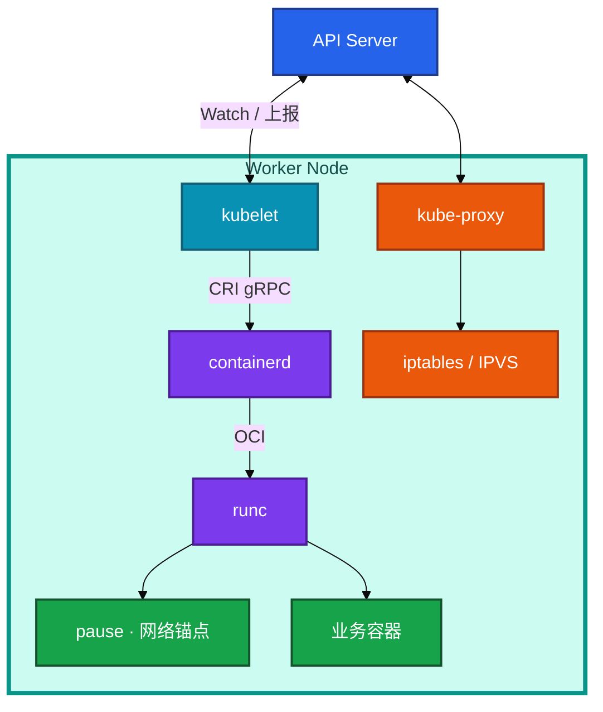
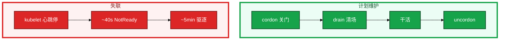
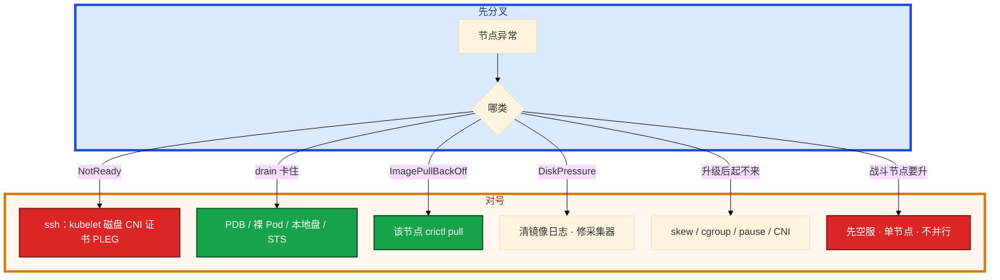

# 节点、运行时与升级


活动前要给战斗服节点换盘。有人准备直接 `reboot`。另一边要把 1.28 升到 1.29，有人想先把节点 kubelet 升完「少停机」。kubelet 卡死，群里要删该节点所有逻辑服「对齐状态」。

先别动手。这一章后半全是你会动手的：**怎么 drain、怎么 crictl、怎么 kubeadm 滚动升、战斗池单独窗口。** 前面的概念，是为了让你动手时不裸关机、不把 kubelet 新过 API。

**本章主线（维护就按这三步想）：**

1. **认链**：kubelet → CRI → containerd → runc；kubelet 不能比 API Server 新。
2. **维护**：cordon 只关门，drain 才迁走；裸 reboot 不要。
3. **升级**：先控制面后节点；战斗池单独窗口。

**读完你能：** 画出 kubelet → CRI → containerd → runc；cordon 只关门、drain 才迁走；约 40s NotReady、约 5min 驱逐；kubeadm 先控制面后节点；战斗服单独升级窗口。

## 本章目录

- [1. 基本概念](#1-基本概念)
- [2. 架构图](#2-架构图)
- [3. 原理](#3-原理)
  - [3.1 CRI 与 containerd](#31-cri-与-containerd)
  - [3.2 cordon / drain](#32-cordon--drain--uncordon)
  - [3.3 NotReady 时间线](#33-notready-时间线)
  - [3.4 Allocatable](#34-allocatable)
  - [3.5 升级顺序与 skew](#35-升级顺序与-skew)
- [4. 安装部署](#4-安装部署)
  - [4.1 节点上你实际看到什么](#41-节点上你实际看到什么)
  - [4.2 kubeadm 升级怎么走](#42-kubeadm-升级怎么走)
- [5. 核心配置](#5-核心配置)
- [6. 常用命令](#6-常用命令)
- [7. 常用操作](#7-常用操作)
  - [7.1 维护一台节点](#71-维护一台节点)
  - [7.2 kubeadm 滚动升级](#72-kubeadm-滚动升级)
  - [7.3 战斗节点升级窗口](#73-战斗节点升级窗口)
  - [7.4 换节点 vs 原地升](#74-换节点-vs-原地升)
- [8. 生产排障](#8-生产排障)
- [9. 必会 · 常考](#9-必会--常考)
- [合上书](#合上书问自己)

**本章不讲：** kubelet 挂了对业务的影响面总图 → [01](../01-集群架构/)；探针、QoS、OOMKilled vs Evicted → [04](../04-Pod生命周期/)、[17](../17-排障实战/)；预选优选、污点、资源不足 Pending → [06](../06-调度机制/)；Pod CIDR、CNI sandbox 失败 → [10](../10-CNI与网络策略/)；本地盘、RWO 跟着节点走 → [11](../11-存储/)；容器日志轮转、采集器把盘写满 → [19](../19-日志管理/)。不考 YAML 入门，不背 containerd 配置全集。

---

## 1. 基本概念

控制面把期望写进 etcd，真正把 Pod 变成进程的是 **kubelet + 容器运行时**。kubelet 不自己 fork 容器，它走 **CRI** 调 containerd，containerd 再调 runc 落 cgroup 和 namespace。1.24 起 dockershim 没了，节点上看容器用 **crictl**，不是 docker。

读节点时记住三句：

1. **Scheduler 写 nodeName 不等于容器起来**——后面全是本节点 kubelet 和运行时的事（01）。
2. **pause 是 Pod 的网络锚点**，业务容器共享它的 netns；pause 拉不下来，sandbox 全失败。
3. **kubelet 挂了，已经起来的进程通常还在**——先救 kubelet，不要为了「对齐状态」去杀游戏服。

托管集群（ACK / EKS）节点组仍是你的责任：厂商升控制面，drain 节奏、PDB、有状态盘还是你排。**厂商不会 drain 你的战斗服。**

> **记住**：节点上 kubelet 调 CRI 起进程；kubelet 挂了先救它，别杀游戏服。kubelet 不能比 API Server 新。

---

## 2. 架构图



维护和失联是两条时间线，不要画成一件事：



---

## 3. 原理

**本节 5 块：** 3.1 CRI · 3.2 drain · 3.3 NotReady · 3.4 Allocatable · 3.5 升级

### 3.1 CRI 与 containerd

新大厅 Pod 已经绑到这台节点，STATUS 还是 ContainerCreating。kubelet 调 CRI 的顺序是固定的：先 `RunPodSandbox`（起 pause），再 `CreateContainer` / `StartContainer`。cgroup 限额、镜像拉取、日志文件，都发生在这一层，不在 API Server。


1. **cgroupDriver 必须一致**：kubelet 和 containerd 都用 `systemd`。一边 systemd、一边 cgroupfs，典型现象是 `CreateContainerError`。
2. **排障用 crictl**，namespace 是 `k8s.io`。`crictl ps / pods / logs / inspect / pull` 能复现拉镜像、看沙箱。不要在生产用 `crictl rm` 代替 kubectl——绕过控制器会留下脏对象。ctr 要加 `-n k8s.io`。
3. **镜像 GC**：磁盘超过 `imageGCHighThreshold`（默认约 85%）清未用镜像。overlay 和容器日志打满是 DiskPressure 第一名。
4. **ImagePullBackOff**：先 `describe` 再在**出问题的那台节点**上 `crictl pull` 复现。常见原因：tag 写错、imagePullSecrets、仓库网络、节点磁盘满。`IfNotPresent` + 可变 tag（latest / 同 tag 覆盖推）会「改了镜像节点不拉」。生产钉 digest 或不可变 tag。

**pause 镜像**：离线或专有仓环境忘同步 pause，新节点 sandbox 全失败。升级 K8s 常换 pause 小版本，节点要能拉到。

**maxPods 与 CNI**：kubelet `maxPods` 和每节点 Pod CIDR 必须一起改（10）。只改 maxPods，多出来的 Pod 会 `FailedCreatePodSandBox`。Scheduler 以为还能塞，CNI 没地址。

containerd 生产要点（不背全集）：`/etc/containerd/config.toml` 里 `SystemdCgroup = true`；`sandbox_image` 指向你能拉到的 pause；CRI socket `unix:///run/containerd/containerd.sock`；kubelet `--container-runtime-endpoint` 对上。改 toml 后 `systemctl restart containerd`，再确认 kubelet。

```toml
[plugins."io.containerd.grpc.v1.cri".containerd.runtimes.runc.options]
  SystemdCgroup = true
[plugins."io.containerd.grpc.v1.cri"]
  sandbox_image = "registry.aliyuncs.com/google_containers/pause:3.9"
```

生成默认 toml：`containerd config default > /etc/containerd/config.toml` 再改这两处。kubeadm 装节点前就要对上，否则 Join 之后全是 CreateContainerError。crictl 的 `/etc/crictl.yaml` 指到同一 socket，避免 crictl 连到另一套 runtime。

### 3.2 cordon / drain / uncordon

这台 Worker 要换盘。**不要裸关机。** 正确顺序是关门 → 清场 → 干活 → 开门。cordon 只拒绝新调度，drain 才会把业务 Pod 迁走。

```
Ready
  -->| cordon
Ready,SchedulingDisabled     ← 不接新 Pod，已有还在跑
  -->| drain --ignore-daemonsets --delete-emptydir-data
业务 Pod 被删，控制器在别处重建
DaemonSet 通常留下（本节点仍要日志/CNI）
  -->| 维护 / 升级 / 换盘
uncordon --> Ready
```

drain 卡住，先查原因，不是 `--force` 开路：

1. **PDB**：`kubectl get pdb -A`。游戏大厅要保最少副本，drain 会等到 PDB 允许。
2. **裸 Pod**（没有控制器）：删了没人重建，drain 默认拒绝。`--force` 对裸 Pod 是「允许删」。
3. **emptyDir / local PV**：本机数据，迁走即丢。`--delete-emptydir-data` 是你确认可丢。
4. **STS 绑盘**：RWO 盘跟节点走，目标节点要能挂上同一块盘（11）。

`--disable-eviction` 拆 PDB，生产留变更记录。窗口不够就改窗口或先扩节点接走副本，不要为了赶工拆 PDB。

游戏单进程区服：drain 前先迁玩家、停匹配。drain 会发 SIGTERM，长连接直接断；PDB 救的是「别一次赶光」，救不了「这个进程里还在对局的人」。

**不要裸关机。** 失联约 40s 标 NotReady 打污点，约 5min 后赶 Pod——双节点同时核，PDB 也救不了。

DaemonSet 为什么通常留下：本节点还要跑 CNI、日志采集、kube-proxy / Cilium agent。真要升这些组件，按它们自己的滚动，不要当业务 Pod 赶走。

### 3.3 NotReady 时间线

kubelet 挂了，值班问「玩家会不会立刻掉」。和 01 对齐：kubelet 挂了 **进程还在**，探针停、心跳停，节点会 NotReady。控制面不会立刻杀容器，会按超时打污点再驱逐。

```
kubelet 挂 / 心跳停
  | ~40s  node-monitor-grace-period
节点 Ready=False / Unknown
打 NoExecute 污点 not-ready / unreachable
  | 默认容忍 ~300s（5min）
  | 这窗口里：进程通常还在，长连接可能还活着
不容忍的 Pod 被驱逐，控制器在别处重建
```

现场：先救 kubelet / 磁盘 / 网络 / CNI，不要先删业务 Pod。ssh：`systemctl status kubelet`、`df -h`、`journalctl -u kubelet`、CNI Pod。PLEG unhealthy（kubelet 看不见容器）也会把节点打成 NotReady，重启 kubelet/containerd，不要重启游戏进程。证书过期（`rotateCertificates`，`kubeadm certs check-expiration`）同样心跳失败。

驱逐超时可配，生产默认就是 **分钟级**。答题说「约 40s 标 NotReady，约 5min 开始驱逐」，不要说「立刻死」。

kubelet 压力驱逐是另一条路：MemoryPressure / DiskPressure / PIDPressure → kubelet 按 QoS 先赶 BestEffort（04）。DiskPressure 常清 `/var/lib/containerd` 镜像和 `/var/log/containers` 日志。这和「容器超 memory limit 被 OOMKilled」不是一回事（17）。本机压力驱逐**不等**那条 5 分钟失联时间线。

### 3.4 Allocatable

节点 `top` 还空，大厅新 Pod 却 Insufficient cpu。Capacity 是整机。Scheduler 只看 **Allocatable**。不预留，业务把节点吃满，kubelet 自己 OOM，节点集体 NotReady——维护窗口里最冤的一种。

```
Capacity（整机）
  - kubeReserved      kubelet / kube-proxy / 运行时
  - systemReserved    sshd / journald / 内核
  - eviction-hard     留给驱逐阈值（如 memory.available < 100Mi）
  = Allocatable  ← Scheduler 只看这个
```

`top` 是实际用量，调度看 request。`kubectl describe node` 看 Allocated vs Allocatable。eviction-hard 从 Capacity 里扣掉一块，就是为了让 kubelet 在打满之前有空间赶 BestEffort、清镜像。

### 3.5 升级顺序与 skew

原则：**先控制面，后节点；一次一小版本；kubelet 不能比 API Server 新**（skew：kubelet 可旧，最多约 2 个小版本）。反过来节点先升，会出现奇怪的 API 错误——新 kubelet 会用新字段、新 endpoint；旧 API Server 不认。旧 kubelet 对新 API 一般向前兼容。

一次并行 drain 多台 = 自己做故障演练。战斗服节点：**单独池、单独窗口**，先空服再升，不跟 Web / 大厅同一批。和 15 的发版窗口错开。

> **记住**：cordon 只关门；drain 才迁走业务；卡住先看 PDB。约 40s NotReady，约 5min 驱逐。先控制面后节点。

---

## 4. 安装部署

### 4.1 节点上你实际看到什么

| 路径 / 单元 | 内容 |
|-------------|------|
| kubelet systemd | 拉静态 Pod、调 CRI |
| `/etc/containerd/config.toml` | SystemdCgroup、sandbox_image（pause） |
| `unix:///run/containerd/containerd.sock` | CRI 口 |
| `/var/lib/containerd` | 镜像和可写层 |
| `/var/log/containers` | 容器日志；打满 → DiskPressure |

验收：节点 Ready、`crictl info` 里 cgroup driver 与 kubelet 一致、pause 能 pull、CNI Pod Running。不要只看 kubelet active。

### 4.2 kubeadm 升级怎么走

`kubeadm upgrade plan` 给出目标版本和组件兼容。不要跳小版本。etcd 随控制面走时先 snapshot（02）。

控制面第一台：

```bash
kubeadm upgrade plan
kubeadm upgrade apply v1.29.4
```

其它控制面与 Worker：

```bash
kubeadm upgrade node
# 包管理器升 kubelet kubectl，再重启 kubelet
```

Worker 必须 **先 drain 再升 kubelet**。升完：Ready、CNI、pause 能拉，再 uncordon。再升核心插件：CNI、CoreDNS、metrics-server。不要在 kubeadm 之外抢改静态 Pod 镜像。

Worker 一台的最小命令序（包名随发行版）：

```bash
kubectl drain <node> --ignore-daemonsets --delete-emptydir-data --grace-period=60
# 该节点上：
kubeadm upgrade node
apt-get install -y kubelet kubectl   # 或 yum；版本钉死到 plan 给出的
systemctl daemon-reload && systemctl restart kubelet
crictl info   # cgroup driver、runtime
kubectl uncordon <node>
```

containerd 若也要升：放在 `kubeadm upgrade node` 之前、drain 之后。先确认新 containerd 仍 `SystemdCgroup = true`，pause 镜像能拉。不要三台 Worker 并行这一段。

托管点「升级」按钮仍要自己排节点组。问清 surge 节点、PDB、有状态盘。

---

## 5. 核心配置

| 参数 | 生产怎么用 | 改错会怎样 |
|------|------------|------------|
| cgroupDriver | kubelet 与 containerd 都 **systemd** | CreateContainerError |
| sandbox_image | 专有仓可拉的 pause | 升级后 sandbox 全失败 |
| imageGCHighThreshold | 默认约 85% | 过低狂 GC；过高 DiskPressure |
| maxPods | 与每节点 CIDR / ENI **同一张变更单** | FailedCreatePodSandBox |
| kubeReserved / systemReserved | 按规格留足 | kubelet OOM，节点 NotReady |
| eviction-hard | 留赶人空间 | 打满才赶，来不及 |
| rotateCertificates | 保持开 | 心跳失败像网络挂了 |

> **记住**：调度看 Allocatable 和 request，不看 top。只改 maxPods 不改 CIDR 会 sandbox 失败。

---

## 6. 常用命令

```bash
kubectl drain <node> \
  --ignore-daemonsets \
  --delete-emptydir-data \
  --grace-period=60 \
  --timeout=300s
```

| 目的 | 命令 | 看什么 |
|------|------|--------|
| 关门 / 开门 | `cordon` / `uncordon` | SchedulingDisabled |
| 清场 | `drain` 如上 | 卡住先 pdb，不是 --force |
| 节点 | `kubectl describe node <n>` | Conditions、Allocated、Taints |
| PDB | `kubectl get pdb -A` | drain 挡在谁 |
| 运行时 | `crictl info` | cgroup driver |
| 容器 | `crictl ps -a` | 含退出的 |
| 复现拉镜像 | `crictl pull ...` | 在出问题的节点上 |
| 日志 | `journalctl -u kubelet -u containerd --since "20 min ago"` | PLEG、cgroup、证书 |
| 升级规划 | `kubeadm upgrade plan` | 顺序和版本 |
| 证书 | `kubeadm certs check-expiration` | 心跳失败先看这个 |

值班节点异常：

```bash
kubectl describe node <n>
kubectl get pdb -A
crictl info
journalctl -u containerd -u kubelet --since "20 min ago"
```

---

## 7. 常用操作

### 7.1 维护一台节点

cordon → drain（给足 grace）→ 换盘 / 升 runtime → 健康检查 → uncordon。游戏单进程区服：drain 前迁玩家。

### 7.2 kubeadm 滚动升级

1. 读发行说明：CNI / CSI / 核心 Operator 兼容矩阵。
2. 备份 etcd（自建）/ 确认托管备份。
3. `upgrade plan` → 第一台 `upgrade apply`。
4. `kubectl get nodes`：控制面新了，节点暂时旧，这是允许的 skew。
5. 先升 **1 台非战斗节点**，观察 15–30 分钟。
6. 逐节点：drain → 升 containerd（如需要）→ `kubeadm upgrade node` → 升 kubelet 包 → 检查 → uncordon。
7. 再升 CNI、CoreDNS、metrics-server。

回滚节点：换回旧 kubelet 包，或用未升的新节点顶上。数据目录级控制面回滚见 02，不要三台一起改静态 Pod 镜像。

### 7.3 战斗节点升级窗口

```
无状态网关池：可按 PDB 滚动 drain，surge 节点顶上
战斗服池：
  1. 独立节点池、独立窗口（与 15 发版窗口错开）
  2. 先空服 / 迁玩家 / 停匹配
  3. 单节点 drain → 升 runtime/kubelet → 验证 CCU
  4. 再下一台
```

不能和网关池并行 drain。托管 ACK 升节点组，厂商不会帮你空战斗服。surge 策略、PDB、有状态盘、空服节奏都是你的。

### 7.4 换节点 vs 原地升

云上常用加一台新机、drain 旧机、删旧机，比在同一台原地升 runtime 好回滚。有状态本地盘节点只能原地或先迁盘。

升级后起不来，按这个顺序对：skew（节点新过 API）→ cgroup driver → pause 镜像 → CNI 版本。

---

## 8. 生产排障

三问：进程还在不在（游戏服）？还能不能变更（调度 / drain）？已有流量还通不通（长连接）？NotReady：**先救 kubelet，别杀业务。**



| 现象 | 先做什么 | 不要做什么 |
|------|----------|------------|
| NotReady | 救 kubelet / 盘 / CNI / 证书 | 删业务 Pod 对齐 |
| PLEG unhealthy | 重启 kubelet/containerd | 重启游戏进程 |
| drain 等 PDB | 扩副本或改窗口 | --disable-eviction 赶工 |
| CreateContainerError | 两边 cgroup systemd | 只改 kubelet |
| ImagePull 单节点 | 该节点 pull | 当仓库全挂 |
| maxPods 调大 sandbox 失败 | CIDR / ENI 一起改 | 先怀疑业务镜像 |
| 升级后 NotReady | skew → cgroup → pause → CNI | 从业务镜像查起 |
| DiskPressure | overlay / 日志 / emptyDir | 只重建被赶的 Pod |

镜像盘：节点级日志轮转（19）、imageGC、禁止容器内写无上限 emptyDir。

---

## 9. 必会 · 常考

| 说法 | 对错 | 口径 |
|------|:----:|------|
| 生产用 docker ps 看 K8s 容器 | 错 | 1.24+ crictl，ns k8s.io |
| kubelet 挂了游戏服立刻没了 | 错 | 进程还在；约 5min 才驱逐 |
| cordon 会把 Pod 迁走 | 错 | 只关门；drain 才清场 |
| drain 卡住就 --force | 错 | 先 PDB / 裸 Pod / 盘 |
| DaemonSet 要一起赶走 | 错 | 本节点还要 CNI / 日志 |
| 先升节点 kubelet 少停机 | 错 | kubelet 不能比 API 新 |
| 4 台控制面和节点一起并行 drain | 错 | 自己做故障演练 |
| 战斗池和网关池同一批升 | 错 | 单独窗口，先空服 |
| 调度看 top 还有空闲 | 错 | 看 Allocatable 和 request |
| 只改 maxPods 就能密布 | 错 | CIDR 不够 sandbox 失败 |
| 只改 kubelet cgroupDriver | 错 | containerd 必须一起 systemd |
| 托管升级会空战斗服 | 错 | surge / PDB / 盘是你的 |
| DiskPressure 要等 5 分钟 | 错 | 那是失联时间线；压力驱逐立刻赶 |
| OOMKilled 就是节点 Evicted | 错 | 容器 limit vs 节点 Pressure（17） |

数字：NotReady **~40s**，驱逐 **~5min**；imageGC **~85%**；先观察非战斗节点 **15–30 分钟**；skew kubelet 落后最多约 **2** 个小版本。

易混：cordon vs drain；失联 5min vs 压力驱逐；Capacity vs Allocatable；docker vs crictl；原地升 vs 换节点。

---

## 合上书，问自己

1. kubelet → CRI → containerd → runc 谁起 pause？排障为什么用 crictl？
2. cordon 和 drain 差在哪？卡住四件事是什么？
3. NotReady 时间线？kubelet 挂了先救谁？
4. Allocatable 怎么算？不预留会怎样？
5. kubeadm 升级顺序？kubelet 能不能比 API 新？
6. 战斗服节点怎么升？和发版窗口为什么要错开？

六题都能口述，这一章就过了。下一章把排障串成决策树：三问定域，Events 第一刀，重启是最后一刀。
