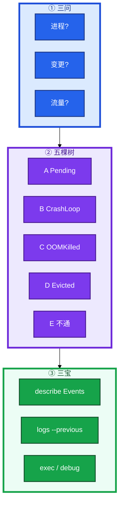
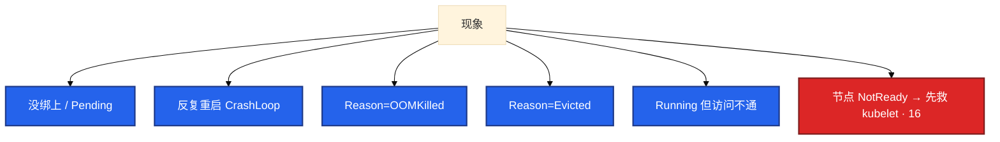
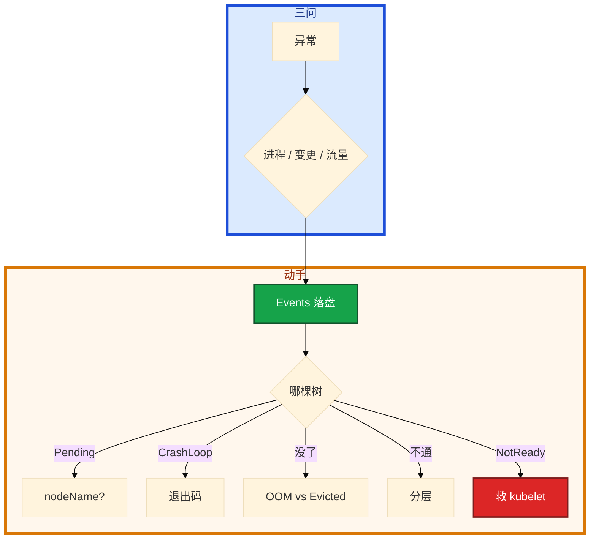

# 排障实战


夜班大厅 CrashLoop。群里有人已经准备 `kubectl delete pod --all`。Events 还没人看过。另一边节点 NotReady，有人要杀该节点逻辑服「对齐状态」。

先别动手。这一章后半全是你会动手的：**三宝怎么敲、五棵树怎么走、没 shell 怎么 debug。** 前面的概念，是为了让你动手时先定域，重启是最后一刀。

**读完你能：** 用三问定影响面；Pending / CrashLoop / OOM / Evicted / 不通 五棵树分流；先落盘再重启；有状态先停匹配。

## 本章目录

缩进 = 上下级。3 下面才是 3.1。

想钉在**正文左边**跟着滚：菜单 **查看 → 打开视图 → 大纲**。Markdown 预览做不到独立左栏，目录只能写在文章开头。

- [1. 基本概念](#1-基本概念)
- [2. 架构图](#2-架构图)
- [3. 原理](#3-原理)
  - [3.1 三问](#31-三问)
  - [3.2 树 A Pending](#32-树-a-pending)
  - [3.3 树 B CrashLoop](#33-树-b-crashloopbackoff)
  - [3.4 树 C / D 内存](#34-树-c-oomkilled--树-d-evicted)
  - [3.5 树 E 不通](#35-树-e-running-但访问不通)
- [4. 安装部署](#4-安装部署)
- [5. 核心配置](#5-核心配置)
- [6. 常用命令](#6-常用命令)
- [7. 常用操作](#7-常用操作)
  - [7.1 生产止血](#71-生产止血含游戏)
  - [7.2 kubectl debug](#72-kubectl-debug)
- [8. 生产排障](#8-生产排障)
- [9. 必会 · 常考](#9-必会--常考)
- [合上书](#合上书问自己)

**本章不讲：** 把某一层原理再讲一遍。探针、grace、QoS → [04](../04-Pod生命周期/)；调度 Pending → [06](../06-调度机制/)；Endpoints / kube-proxy → [08](../08-Service与kube-proxy/)；DNS → [09](../09-CoreDNS/)；CNI / NP → [10](../10-CNI与网络策略/)；PVC / CSI → [11](../11-存储/)；403 / SA / PSS → [13](../13-RBAC与安全/)；502 / Ingress → [14](../14-Ingress与流量管理/)；滚动回滚 → [15](../15-灰度与回滚/)；NotReady / crictl / drain → [16](../16-节点运行时与升级/)。本章是把它们串成决策树。

---

## 1. 基本概念

任何 Pod 异常，80% 的线索在 **Events**。定域顺序是 **Events → 对象 spec/status → 节点 / CNI / CSI → 应用日志**。重启会丢掉 `logs --previous`，有状态还会踢玩家。

和 01、02 同一套 **三问**：

| 问 | 在问什么 | 排障时落到 |
|----|----------|------------|
| **进程还在不在？** | 容器 / 游戏服是否还在跑 | CrashLoop、OOM、被 Evict、被人 delete |
| **还能不能变更？** | apply / 发版 / 自愈 / 调度 | 控制面、Webhook、RBAC、Pending |
| **已有流量还通不通？** | 长连接、ClusterIP、Ingress | 树 E、NP、Endpoints |

先定是哪棵树，再动手。Events 默认只留一小时量级。P0 先把 `describe` / `get events` 落盘，再重启。游戏夜班若只留下「我重启好了」，早会复盘没有证据。

> **记住**：先定域，再动手；重启是最后一刀，不是第一刀。三问比「先重启试试」先开口。

---

## 2. 架构图



现象进哪棵树：



---

## 3. 原理

**本节 5 块：** 3.1 三问 · 3.2 Pending · 3.3 CrashLoop · 3.4 OOM/Evict · 3.5 不通

### 3.1 三问

活动开始 CCU 掉了一截。先影响面，再最近变更，再最短恢复动作。有状态不要「重启试试」。

口述结构：现象 → 影响面（几 NS / CCU）→ 最近变更 → 三宝结论 → 止血动作 → 根因 → 怎么防。没有数字就说「分钟级恢复」「异常 Pod 从两位数降到个位数」，不要编。

Metrics / 日志 / Trace：先用指标发现哪一层（18），再用日志按时间线和 traceId 对上进程（19），网络不通再用 Hubble / 抓包（23、10）。决策树仍然是本章这五棵。

三问落到游戏夜班的开口顺序（先说影响面，再动手）：

1. **进程**：对局还在打吗？CCU 是滑了一截还是断崖？那几台战斗服 `crictl ps` 还在不在（16）？
2. **变更**：现在还能 `kubectl apply` / 发版 / HPA 扩吗？还是 Webhook / API / etcd 已经焊死（03、02）？焊死了就不要再滚动止血。
3. **流量**：大厅 HTTP 502 还是战斗 TCP 已经断？HTTP 走树 E / 14；长连接断了先问是不是有人 drain / 滚动了战斗服（15、16）。

三问答完再选树。答不全就先停匹配、禁新进，把爆炸半径按住，再补 Events。

### 3.2 树 A：Pending

Pending 表示 **还没跑起来**：要么 Scheduler 没写下 nodeName，要么写下了但 kubelet 还卡在镜像 / CNI / CSI。先看 Events，不要先改业务镜像。

```
Pending
  +-- 还没有 nodeName（调度没完成）
  |     Insufficient cpu/memory → 降 request 或加节点；看 Allocatable，不是 top
  |     affinity / nodeSelector → 对标签
  |     taint not tolerated → 加容忍或去污点
  |     unbound PVC → SC / CSI / WaitForFirstConsumer（11）
  |     0/N nodes available → 上面几条叠加
  |     全体新 Pod 都 Pending → scheduler 在不在（01）
  +-- 已有 nodeName（调度完了）
        ImagePull / BackOff → tag / 账密 / 网络 / 磁盘（16）
        FailedCreatePodSandBox → CNI、pause、maxPods vs CIDR
        挂卷超时 → CSI、节点磁盘
```

`NODE` 列是空的，Events 写 `0/12 nodes are available`：调度没完成。打开 `kubectl describe pod <p>` 从 Events 往后看。Insufficient cpu/memory 看节点 Allocatable，不是 `top`——`top` 是实际用量，调度看 request（16）。affinity / nodeSelector 对不上、污点不容忍，几条叠在一起就是「0/N」。全体新 Pod 都 Pending，去看 kube-system 里 scheduler 在不在（01）。

`NODE` 已经有了，还是 Pending 或变成 ContainerCreating：Scheduler 的活干完了。后面是这台机器上的 kubelet。ImagePullBackOff：tag 写错、imagePullSecrets、仓库网络、节点磁盘。FailedCreatePodSandBox：CNI、pause 镜像、maxPods 和每节点 CIDR 没一起改（10、16）。挂卷超时走 CSI。

PVC 是 WaitForFirstConsumer，只看 Pod 会误判成「调度坏了」：WFFC 要等 Pod 定节点才绑卷。Pod 和 PVC 一起 `describe`，不要拆开看。

卡住先看 Events，不要先改业务镜像。Scheduler 成功了但还在拉镜像：责任在 kubelet + 运行时（01、16）。

### 3.3 树 B：CrashLoopBackOff

CrashLoop 是 **起来过、反复退出**。第一刀永远是 `logs --previous` + Last State 退出码。没日志先看 command / env / volume，不要先加内存。

| 退出码 / Events | 含义 |
|-----------------|------|
| 137 + Reason=OOMKilled | 走树 C（超 memory limit） |
| 137 无 OOMKilled | SIGKILL：grace 用尽被强杀 |
| 1 / 2 | 应用自己退出：配置、依赖、命令 |
| 139 | 段错误 |
| Events Unhealthy | liveness 误杀（04） |
| 刚启动就退 | startupProbe 不够，或依赖没起 |

143 = 128+15 SIGTERM，正常被停，不是 OOM。137 = 128+9 SIGKILL。liveness 失败会重启容器 → CrashLoop。readiness 失败只从 Endpoints 摘掉，Pod 仍 Running（08）。游戏服先确认不是 liveness 打早了。

你眼睛看到的：

1. **`Last State.exitCode=1`，`logs --previous` 里 Redis 连不上**  
   应用自己退出。配置、依赖、命令写错都走这条。先把依赖拉起来，或把启动顺序改对，不要先加内存。
2. **`exitCode=137` 且 Reason=`OOMKilled`**  
   走树 C。
3. **`exitCode=137` 但没有 OOMKilled**  
   多半是 grace 用尽被 kubelet 强杀：preStop 太慢、terminationGracePeriodSeconds 不够（04、15）。
4. **Events 刷 Unhealthy，liveness 失败**  
   探针在杀还没起来的匹配 / Redis。看起来也是 CrashLoop。startupProbe 不够、依赖没起，同一类。

没机会 exec 时用 `kubectl debug --copy-to` 复制一份改命令，不要在生产把镜像临时改成 busybox 覆盖掉现场。

### 3.4 树 C OOMKilled · 树 D Evicted

OOMKilled 是 **本容器** 超了 memory **limit**（cgroup 总量），不是节点内存不够——节点不够是 Evicted。RSS 趋势用来区分泄漏 vs limit 过小。Java / Go 要给堆外留 30–50%，不要只看堆。

```
OOMKilled → 看该容器 memory limit（不是 request，不是节点 free）
  RSS 一直爬到 limit → 泄漏或没上限的缓存；先限缓存 / 查泄漏，不是只加内存
  RSS 稳定但偶发打满 → limit 过小，或高峰没留余量
  Java/Go 堆很小、RSS 很大 → 堆外 / DirectByteBuffer / cgo
  刚调大 limit 又杀 → 看有没有没算进 limit 的 sidecar
```

`kubectl top pod` 只是瞬时值，要看监控里 RSS 是否一直爬。

你眼睛看到的：

1. **Last State 写 OOMKilled，limit 是 1Gi**  
   先回答三个数：limit 是多少、RSS 曲线什么样、是泄漏还是高峰。
2. **RSS 爬到 1Gi 就被杀，重启后从低位再爬**  
   泄漏或没上限的缓存。先限缓存、查泄漏，加内存只会推迟下一次。
3. **RSS 平时 600Mi，活动高峰打到 1Gi**  
   limit 过小。Java Heap 512Mi 但 RSS 1.5Gi，差的是堆外——DirectByteBuffer、cgo、元空间。堆和 limit 要对齐，给堆外留 30–50%。
4. **刚把主容器 limit 调到 2Gi 还是杀**  
   看有没有 sidecar 没算进账。

并行证据：节点 CPU 高且新 Pod Pending，要同时看 `top` 和 `describe node` 的 Allocated——两套域，不要一次重启「都修了」。不要只说「加内存」。

Evicted 是 **节点压力**，kubelet 按 QoS 赶人。只重建 Pod 会再被赶。先 `describe node` 的 Conditions。

| Condition | 做什么 |
|-----------|--------|
| MemoryPressure | 赶 BestEffort / 超限 Burstable；加节点、调 request |
| DiskPressure | overlay、容器日志、emptyDir；crictl rmi、清日志、修采集器（16、19） |
| PIDPressure | fork 炸弹、僵尸 |
| 节点 NotReady | 先救 kubelet（16）；约 40s / 5min |

容器日志轮转是 kubelet 的事，不是主机 logrotate。BestEffort 先被 Evict，Guaranteed 后（04）。

你眼睛看到的：

1. **节点 Conditions 里 MemoryPressure=True**  
   kubelet 按 QoS 先赶 BestEffort，再赶超限的 Burstable，Guaranteed 最后。加节点、把 request 设对、赶走垃圾 Pod。只重建被赶的那个，下一分钟还是这个节点。
2. **DiskPressure=True**  
   overlay、`/var/log/containers`、emptyDir 打满。`crictl rmi`、清日志、修采集器（16、19）。
3. **PIDPressure=True**  
   进程数打满：fork 炸弹、僵尸。看节点 pid 限额和业务是不是在狂拉子进程。
4. **节点已经 NotReady**  
   先救 kubelet，不是先重建业务。失联约 40s 标 NotReady，约 5min 才驱逐（16）。这几分钟里游戏长连接可能还活着。

OOMKilled vs Evicted 一句话：前者是容器自己的 cgroup limit，后者是节点条件。被赶先看节点 Pressure，重建解决不了节点满。

### 3.5 树 E：Running 但访问不通

通不通要分层测，测到哪一层断了就停在那一层。不要从 Ingress 一路猜到 CNI。空 EP 就不要先重启 kube-proxy。

```
1. Pod 内 curl localhost:port     → 进程和端口
2. kubectl get endpoints          → 空：readiness 或 Service selector
                                  （Label 打错、打在 annotation 上，01）
3. 另一 Pod wget ClusterIP        → 不通且 EP 有：kube-proxy / 端口（08）
4. 跨节点 ping / wget Pod IP      → 同节点通、跨节点不通：CNI（10）
5. nslookup svc                   → 名不通、IP 通：DNS / ndots（09）
6. Ingress Host / TLS             → 502、证书、后端 Ready（14）
```

滚动后 502：新 Pod Ready 没有、Endpoints 有没有新 IP、旧 Pod 是否瞬间没了。四件套在 15。止血可以 undo，根因仍按这棵树。

你眼睛看到的：

1. **进容器 `curl 127.0.0.1:8080` 都失败** — 进程没 listen，或命令/端口写错。停在这一层，别去查 Service。
2. **本机通，`kubectl get ep hall` 是空的** — 就绪探针没过，或 Service selector 和 Pod Label 对不上（打在 annotation 上也不行，01）。
3. **Endpoints 里已经有 Pod IP，同节点 wget ClusterIP 失败** — kube-proxy 没更新规则、容器端口和 targetPort 对不上（08）。空 EP 就不要先重启 proxy。
4. **同节点通、跨节点 ping Pod IP 不通** — CNI（10），不是 kube-proxy。
5. **IP 通、`nslookup hall.game.svc` 失败** — DNS / ndots（09）。
6. **集群内通、Ingress 502** — Host / TLS / 后端 Ready（14）。

临时探针：同 Namespace 才测到一样的 DNS 和 NetworkPolicy。临时 `kubectl run` 一个无关 Pod **不**共享问题 Pod 的网络和存储。

同集群有的人 403、有的通：RBAC，`kubectl auth can-i --as=`。不是 API 挂了（13）。Webhook 让全员不能 apply：03。401 是身份，403 是鉴权。

分层测时把三问挂在每一层上：localhost 不通 = 进程问题（第一问）；EP 空 = 变更/探针让它接不了流量（第二问叠第三问）；ClusterIP 不通但 EP 有 = 转发面；跨节点不通 = CNI，长连接可能半残。不要一层没测完就重启 kube-proxy 或 Ingress Controller——那是在第三问上制造新断点。

> **记住**：没 nodeName 是调度/PVC；有 nodeName 是本机起进程。137 先分清 OOM 还是被强杀。localhost → EP → ClusterIP → 跨节点 → DNS → Ingress。

---

## 4. 安装部署

排障不「安装一个排障组件」，但生产要事先有：

| 项 | 要有 |
|----|------|
| RBAC | describe / logs / exec / debug 分人授权（13） |
| 镜像 | 节点能拉 `nicolaka/netshoot`；不要现场从外网现拉 |
| EphemeralContainers | 1.25+ 默认开；debug 注入 |
| 审计 | 谁 debug、谁 delete 要能追 |

托管：exec 走 API→kubelet，NP 和 RBAC 都能让你进不去。

---

## 5. 核心配置

| 项 | 生产怎么用 | 改错会怎样 |
|----|------------|------------|
| Events 保留 | 先落盘 | 一小时后证据没了 |
| 多容器 `-c` | 必须指定 | logs 打错容器 |
| Ephemeral 资源 | 用完即走 | 不受业务 limit，能吃满节点 |
| netshoot NS | 与问题 Pod 同 NS | 测错 DNS / NP |
| liveness vs readiness | 分清杀与摘 | 误杀当 CrashLoop 加内存 |

---

## 6. 常用命令

三宝：

```bash
kubectl describe pod <p> -n <ns>
kubectl logs <p> -n <ns> -c <c> --previous
kubectl exec -it <p> -n <ns> -- /bin/sh
kubectl get events -n <ns> --sort-by='.lastTimestamp'
```

| 目的 | 命令 |
|------|------|
| 调度失败 | `describe pod` 从 Events 往后看 |
| 空后端 | `kubectl get ep,endpointslice -n <ns>` |
| 同 NS 探测 | `kubectl run tmp --image=nicolaka/netshoot --rm -it -- bash` |
| 注入 | `kubectl debug -it <pod> --image=nicolaka/netshoot --target=<c>` |
| 节点 | `kubectl debug node/<node> -it --image=ubuntu` |
| CrashLoop 改命令 | `kubectl debug <pod> -it --copy-to=<pod>-debug --container=<c> --image=busybox -- sh` |
| 权限 | `kubectl auth can-i --as=` |
| 节点压力 | `kubectl describe node` Conditions / Allocated |

`describe` 看 **Events 时间线**，不要只看 Status。`exec` 走 API Server（03）。生产先只读。辅助：`get -o wide`、`top`、节点上 `crictl`（16）。

---

## 7. 常用操作

### 7.1 生产止血（含游戏）

```
1. 影响面：几个 NS、几条连接、CCU 掉了没
2. 最近变更：发版 / 配置 / NP / HPA → 能回滚先回滚
3. 最短恢复：undo、切蓝绿、扩节点、关错误 liveness、改 HPA min
4. 再查根因，补监控
5. 有状态：停匹配、禁新进，避免重启毁掉还活着的对局
```

游戏逻辑服还在对局：先停匹配、禁新进，再动进程。全员重启依赖可能把故障扩散。先缩小爆炸半径，再查根因。

口述结构再钉一次：现象 → 影响面（几 NS / CCU）→ 最近变更 → 三宝结论 → 止血动作 → 根因 → 怎么防。没有数字就说「分钟级恢复」「异常 Pod 从两位数降到个位数」，不要编。

### 7.2 kubectl debug

大厅是 distroless，`kubectl exec` 没有 sh。1.25+ Ephemeral Containers：往已运行的 Pod 里注入临时调试容器，共享 netns / 存储，**不重建 Pod、不改业务镜像**。

| 方式 | 优势 | 代价 |
|------|------|------|
| `kubectl exec` | 简单 | 镜像无 shell 就废 |
| Ephemeral Container | 注入工具，不改业务 | 1.25+，要 RBAC；不受业务 limit 管 |
| `kubectl run netshoot` | 通用 | **不**共享问题 Pod 的网络/存储 |
| 节点上 `nsenter` | 最底层 | 要 ssh，风险高 |

生产：注入会被审计；注意资源；Pod 重启后 ephemeral 消失。优先 `kubectl debug`。敏感环境把 debug 当变更。要进 **这个 Pod** 的网络和 PID：`--target=`。只要一个客户端测 Service：同 NS 的 `run --rm`。容器起不来：`--copy-to`。节点内核 / 磁盘：`debug node/` 或 ssh（16）。

---

## 8. 生产排障

总树就是本章正文。现场顺序：三问 → 选树 → 三宝落盘 → 止血 → 根因。



| 现象 | 先做什么 | 不要做什么 |
|------|----------|------------|
| CrashLoop | logs --previous + 退出码 | delete --all |
| Pending | nodeName + Events | 先改业务镜像 |
| OOMKilled | 容器 limit + RSS | 只加内存 / 当节点满 |
| Evicted | describe node Pressure | 只重建 Pod |
| 空 Endpoints | selector / readiness | 先重启 kube-proxy |
| 同节点通跨节点不通 | CNI（10） | 重启 proxy |
| 有的人 403 | can-i --as=（13） | 当 API 挂了 |
| 全员不能 apply | Webhook（03） | 绑 cluster-admin |
| CPU 高 + Pending | top 与 Allocated 两套域 | 重启 kubelet 都修 |
| distroless 没 sh | kubectl debug | 改业务镜像 |

---

## 9. 必会 · 常考

| 说法 | 对错 | 口径 |
|------|:----:|------|
| 排障第一刀是重启 | 错 | Events；重启丢 --previous |
| 三问是「先 ping 通再看日志」 | 错 | 进程 / 变更 / 流量 |
| Pending 一定是调度坏了 | 错 | 有 nodeName 是 kubelet |
| CrashLoop 先加内存 | 错 | 先退出码 |
| 137 一定是 OOM | 错 | 无 OOMKilled 可能是 grace 强杀 |
| OOMKilled 就是 Evicted | 错 | 容器 limit vs 节点 Pressure |
| 只重建 Evicted 的 Pod | 错 | 节点仍满会再赶 |
| Endpoints 空先重启 proxy | 错 | selector / readiness |
| 临时 netshoot 在 default 就能测游戏 NS | 错 | 同 NS 才碰到一样的 DNS/NP |
| debug 和 run netshoot 一样 | 错 | run 不共享问题 Pod netns |
| 谁都能生产 debug | 错 | RBAC + 审计；当变更 |
| Ready 失败和 liveness 失败一样 | 错 | 摘 EP vs 重启 |
| 一次重启能修 CPU 高和 Insufficient | 错 | 两套域，还会踢玩家 |

数字：Events **约 1 小时**；NotReady **40s / 5min**（16）；Java 堆外 **30–50%**。

易混：OOM vs Evict；liveness vs readiness；空 EP vs 有 EP 不通；失联 5min vs DiskPressure；403 vs 401 vs Webhook。

---

## 合上书，问自己

1. 三问是哪三问？为什么不能一上来重启？
2. Pending 有没有 nodeName 分别查谁？
3. CrashLoop 第一刀？137 怎么分？
4. OOMKilled 和 Evicted 差在哪？
5. 不通六层顺序？空 EP 能不能重启 proxy？
6. distroless 怎么进？debug 和 run 怎么选？有状态先做什么？

六题都能口述，这一章就过了。下一章把指标从哪来、谁该被电话叫醒、SLO 怎么管发版节奏焊死。
