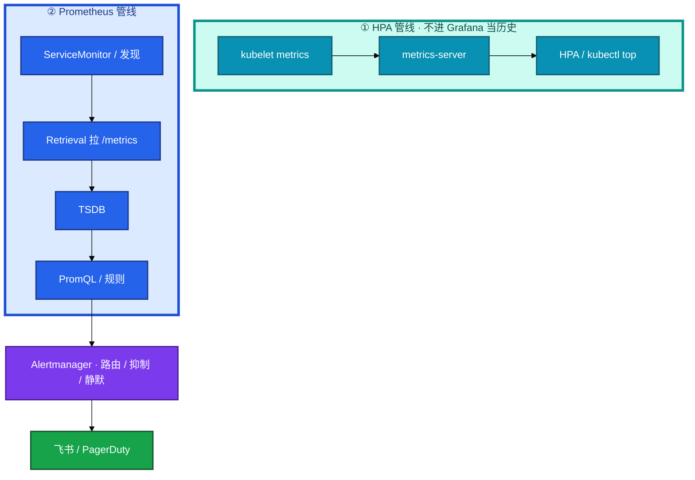
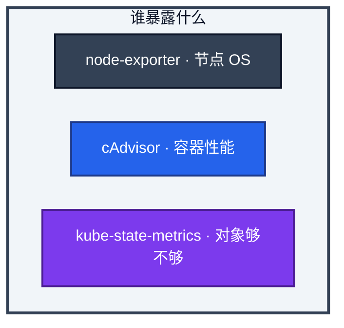
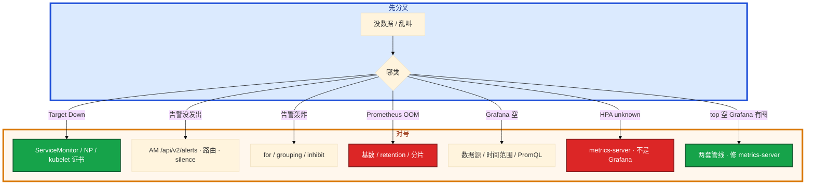

# 监控与可观测性


活动开始，网关 P99 从 50ms 跳到 800ms。`kubectl top` 没数据，有人去重启 Prometheus。支付 5xx 到 8%，磁盘 82%，测试 NS 一个 Pod 在重启，三条一起响。产品要把可用性写成 99.99%。

先别动手。这一章后半全是你会动手的：**怎么分层看图、怎么写告警、怎么用 Error Budget 管发版。** 前面的概念，是为了让你动手时不把 metrics-server 和 Prometheus 合成一句「都是监控」。

**读完你能：** 画出 Pull → TSDB → Alertmanager；分清 metrics-server 与 Prometheus；四金信号 + P0–P3；SLO 管发布节奏；高基数先停错误 label。

## 本章目录

缩进 = 上下级。3 下面才是 3.1。

想钉在**正文左边**跟着滚：菜单 **查看 → 打开视图 → 大纲**。Markdown 预览做不到独立左栏，目录只能写在文章开头。

- [1. 基本概念](#1-基本概念)
- [2. 架构图](#2-架构图)
- [3. 原理](#3-原理)
  - [3.1 Pull 与两套管线](#31-pull-与两套管线)
  - [3.2 四层与四金信号](#32-四层与四金信号)
  - [3.3 告警分级](#33-告警分级)
  - [3.4 SLO / Error Budget](#34-slo--error-budget)
  - [3.5 高基数与长期存储](#35-高基数与长期存储)
- [4. 安装部署](#4-安装部署)
  - [4.1 kube-prometheus-stack](#41-kube-prometheus-stack)
  - [4.2 metrics-server](#42-metrics-server)
- [5. 核心配置](#5-核心配置)
- [6. 常用命令](#6-常用命令)
- [7. 常用操作](#7-常用操作)
  - [7.1 看板与 Recording](#71-看板与-recording)
  - [7.2 HA 与远程存储](#72-ha-与远程存储)
  - [7.3 发版窗口用燃烧率](#73-发版窗口用燃烧率)
- [8. 生产排障](#8-生产排障)
- [9. 必会 · 常考](#9-必会--常考)
- [合上书](#合上书问自己)

**本章不讲：** 主机层 CPU/磁盘/logrotate → [02-21](../../02-基础底座/21-监控与告警/)、[02-22](../../02-基础底座/22-日志运维/)；日志采集、EFK vs Loki → [19](../19-日志管理/)；HPA 指标细节 → [07](../07-弹性伸缩/)；Hubble / eBPF 看连接 → [23](../23-eBPF与Cilium/)；游戏 SLO 定级故事展开 → [08](../../08-游戏运维专题/)。不是会不会装 Prometheus。

---

## 1. 基本概念

可观测三支柱：Metrics 回答「现在怎样」，Logs 回答「发生了什么」，Traces 回答「慢在哪一跳」。K8s 里 Metrics 的主干是 **Prometheus 拉 `/metrics`**。拉不到 = 这个 target 对采集器来说就是挂了，不会因为业务忘了 push 而静默。

两套管线不要混：

| | metrics-server | Prometheus |
|--|----------------|------------|
| 目的 | `kubectl top`、**HPA CPU/内存** | 给人看、告警、长期存 |
| 存历史 | **不存** | TSDB |
| 发现 | kubelet metrics API | ServiceMonitor / 注解 / 静态 |
| 挂了的现象 | top 空、HPA unknown | Grafana 空、告警静默 |

三支柱要能串：日志带 Trace ID，指标可挂 exemplar。只堆三套后端没有 SLO，只是更贵的监控。

> **记住**：Prometheus 负责拉和算，Alertmanager 负责叫人。HPA 不吃 Prometheus 的历史。没有 SLO 只是更贵的监控。

---

## 2. 架构图



组件不要重叠理解：



kube-state-metrics 看「有几个 Pod、副本够不够」，cAdvisor 看「这个容器用了多少 CPU」。不重叠。ServiceMonitor 是 Operator 的 CRD：Pod 带约定标签就自动进采集，不用手改 `prometheus.yml`。

---

## 3. 原理

**本节 5 块：** 3.1 两套管线 · 3.2 四金信号 · 3.3 告警 · 3.4 SLO · 3.5 基数

### 3.1 Pull 与两套管线

Prometheus 主动去拉。短生命周期 Job 才用 Pushgateway，用完要清理。NAT 后面拉不到才需要 Pushgateway 或反向连接。大规模 target 要分片，这是 Pull 的代价，不是改成 Push 就能消失。

可以用 adapter 把 Prometheus 指标接进自定义 HPA，但「CPU 利用率 HPA」这条默认仍吃 Metrics API。两套目的不同，不要合并成一句「都是监控」。重启 Prometheus 修不好 top。

target Down：ServiceMonitor 标签对不上、NetworkPolicy 没放行 scrape、kubelet metrics 证书不被信。拉不到就是挂，不会静默。

### 3.2 四层与四金信号

会装 Prometheus 不够，要能说出 **四层**。不要用节点 CPU 当业务告警。

| 层 | 看什么 | 工具 |
|----|--------|------|
| 业务层 | CCU / 支付成功率 / 匹配成功率 | 应用自定义 metrics |
| 应用层 | QPS / P99 / 5xx / GC / 连接池 | 埋点 / exporter |
| 中间件层 | 连接数 / 命中率 / 堆积 | mysql/redis/kafka exporter |
| 基础设施 | 节点 CPU/盘/网/conntrack | node-exporter |

**四金信号（Latency / Traffic / Errors / Saturation）**：每个服务至少这四个。延迟看 P50/P90/P99，不要只看平均——长尾被平均掩盖。Saturation 是「离打满还有多远」：CPU 利用率、连接池占用、队列堆积。

USE 看资源（Utilization / Saturation / Errors），适合节点、Redis、DB。RED 看服务（Rate / Errors / Duration），适合 HTTP。游戏 HTTP 接口用 RED；机器和中间件用 USE。战斗服长连接的 Traffic 不要只抄 HTTP QPS：可用在线 CCU、心跳成功率、进出房间 QPS。错误用非自愿断线，不要用 HTTP 5xx 硬套。

活动开始网关 P99 从 50ms 到 800ms。CPU 不高，GC 时间飙。根因是 JVM Heap 512Mi、RSS 1.5Gi，频繁 Full GC。止血：扩副本 + 改 Heap；预防：GC 时间告警和 Heap 与 limit 对齐。这就是「先 RED 发现用户有感的问题，再用 USE 找瓶颈」。

常用 exporter：node、mysql、redis、kafka、blackbox（HTTP/TCP/ICMP）、kube-state-metrics。Pushgateway 只给短 Job。

集群里至少要看：节点 CPU/内存/磁盘/await/conntrack（磁盘 >80% P2，conntrack >80% P1）；Pod throttle、OOMKilled、重启次数（核心任意 OOM；重启 >3/小时）；Pending、NotReady、PVC Pending（Pending >0 持续 5min）；etcd leader 变更、API P99（>1s）；证书剩余天数（<30d P2，<7d P1）。

### 3.3 告警分级

基于 **症状** 不是基于原因：「5xx >5%」可以叫人，「CPU >80%」常常不该。每条告警要有 Runbook。`for: 5m` 防抖。节点挂了用 inhibit 压制该节点上的 PodDown。

| 级 | 定义 | 响应 | 例 |
|----|------|------|-----|
| P0 | 核心中断或即将中断 | 5 分钟，电话+IM | 全员 CrashLoop、etcd 不可达、支付挂 |
| P1 | 核心受损可降级 | 15 分钟，IM | 某服务 5xx、某 AZ 批量 NotReady |
| P2 | 有风险不影响用户 | 工作时间 | 磁盘 >80%、证书 30 天、HPA 到 max |
| P3 | 趋势 | 周巡检 | 没设 request、日志量爬升 |

叫人（P0/P1）同时满足：用户或收入正在受损、有可执行动作、不是同一故障的回声。不叫人：单机 CPU、单 Pod 重启且有容量、一周后才满的盘、没有 runbook 的「观察一下」。登录 SLO 健康时，节点 CPU 90% 也不该叫 P0。

维护窗口用 silence，结束要解开。无限期 silence 等于拆掉告警。告警轰炸：加 `for`、group_by、inhibit、月度噪音率 review。

燃烧率：短窗口（1–2h）高燃烧率立刻叫人；长窗口（28d）慢烧工作日处理。只看瞬时 5xx 会在压测时误叫；只看 28 天会在正在崩时太晚。

双副本 Prometheus 同一条告警 Alertmanager 按 group 去重。HA 是双拉 + 下游去重，不是两套独立电话。

### 3.4 SLO / Error Budget

拍 999 没有依据。先量三个月，再留余量。

| 概念 | 是什么 | 例子 |
|------|--------|------|
| SLI | 测量什么 | 成功请求 / 总请求 |
| SLO | SLI 的目标 | 99.9% 成功 |
| SLA | 合同，带赔偿 | 对外 99.5% |
| Error Budget | 1 − SLO | 99.9% → 月约 **43.2 分钟**可停 |

预算有余量可以发布、做实验；耗尽就冻结变更，先修稳定性。登录服若定 99.95%（月约 21.6 分钟），合服/热更要在这窗口里消化。

游戏：登录成功且 <3s 可作 SLI，目标 99.9%；进战斗 <5s；支付发货接近 99.99%；非自愿断线按 CCU。**有状态滚动造成的短暂断线要计入预算**，不能开除（15）。活动高峰用独立燃烧率，避免被平时的 99.9% 掩盖 10 分钟崩溃。错误预算周会：烧了多少、哪次发布、下一步冻还是修。

节点升级窗口（16）和发版窗口一样烧预算：drain 战斗节点踢玩家也要记账。

发版节奏和监控的接口（给 15 用，不把发布流程再写一遍）：

| 窗口 | 看什么 | 冻什么 |
|------|--------|--------|
| 金丝雀每档 | 该档 5xx、P99、登录成功、CCU | 超阈立刻 weight 归零 |
| 开服 / 大活动 | 短窗口燃烧率，不用月平均 | 普通灰度（15） |
| 控制面 / 节点升级 | API P99、etcd leader、NotReady | 业务发版与升级错开（16） |
| 预算将尽 | 周会数字 | 高风险变更、实验 |

没有这四行看板，Error Budget 只是 PPT。有看板但不看登录 / CCU，Ready 全绿仍会把事故做成「发布成功」。

### 3.5 高基数与长期存储

一条 series = 指标名 + 全套 label。`http_requests_total{user_id="..."}` 会把 Prometheus OOM。label 只留低基数枚举（code、method、**模板化** route）。user_id、order_id 进日志和 Trace。乱打 label，Thanos 也救不了。Recording rule 降查询负载，不降已经炸了的 ingest。

单 Prometheus 软上限大约 **200 万 series**。超了分片或 remote-write，不是只加内存。`prometheus_tsdb_head_series` 做容量告警。单机通常只留 15–50 天。HA：双副本 Prometheus + Alertmanager 去重，不是双写同一块盘。

Thanos：Sidecar 上传 block 到 S3/OSS → Store Gateway 读历史 → Query 统一查询。VictoriaMetrics：组件少、压缩高，PromQL 兼容。已有 Prometheus、要对象存储全球查：Thanos。想少组件、大规模写入：VM。远程存储解决留存和全局查询，**不解决**乱打 label。

OpenTelemetry：一份 SDK 打点，OTLP 进 Collector（Receive → 采样/脱敏 → Export）。换后端不换埋点。坑：自动插桩开太全、采样要在入口做、敏感字段在 Collector 剥掉。游戏 C++ 战斗服往往只能手工埋出入口和 DB/Redis。OTel 不是可观测性本身。

> **记住**：先看用户有感的四金信号。叫人看症状和能不能动手。预算管发布节奏；滚动踢玩家也要记账。高基数先死人。

---

## 4. 安装部署

### 4.1 kube-prometheus-stack

常见落地：Prometheus Operator + Prometheus StatefulSet 本地盘 + Alertmanager 多副本 + Grafana + node-exporter DaemonSet + kube-state-metrics。ServiceMonitor 管发现。验收：Prometheus UI target 全 UP，不是 Grafana 有一张空图。

给大厅打约定标签后，Operator 把 ServiceMonitor 翻译成 scrape 配置：

```yaml
apiVersion: monitoring.coreos.com/v1
kind: ServiceMonitor
metadata:
  name: hall
  labels: { release: kube-prometheus-stack }
spec:
  selector:
    matchLabels: { app: hall }
  endpoints:
  - port: http-metrics
    interval: 15s
    path: /metrics
```

标签对不上 = target 永远不出现，Grafana 空。NP 没放行 Prometheus 网段 = target Down。这两条都不是「业务忘了 push」。

| 项 | 选 | 不选 |
|----|----|------|
| Prometheus | STS + 独立盘；双副本 HA | 单盘当唯一真相 |
| Alertmanager | 多副本 + inhibit | 无限期 silence |
| 采集 | ServiceMonitor | 手改 yml 当唯一手段 |
| series | 容量告警 200 万 | 只加内存 |

### 4.2 metrics-server

轻量 Deployment，聚合 kubelet metrics，给 HPA / top。验收：`kubectl top nodes` 有数。挂了：Pod Running、kubelet `/metrics` 可达、证书被信任。HPA unknown 还要看 Pod 有没有 request（07）。和 Grafana 有图可以同时成立——两套管线。

metrics-server 常见坑（07 用它的数，这里只记排障口）：

| 现象 | 先看 |
|------|------|
| top 空、HPA unknown | metrics-server Running；kubelet 10250 metrics 证书 |
| 只有部分节点 top 没数 | 那些节点 kubelet / 防火墙 / 托管 CNI |
| 有 top 无历史曲线 | 正常。历史去 Prometheus |
| HPA 算的利用率和 Grafana 对不上 | 一个看瞬时 Metrics API，一个看 scrape 间隔和 rate 窗口 |

不要把 Prometheus Adapter 自定义指标和默认 CPU HPA 配成互相覆盖。发版窗口（15）HPA 把副本打回去，看板要同时看 replicas 和业务四金信号，不能只看 CPU。

metrics-server 不替代 Prometheus：没有历史、没有告警规则、没有 ServiceMonitor。Prometheus 不替代 metrics-server：默认 HPA 不读 TSDB。两套都要活，缺一不可。`kubectl top` 有数只证明瞬时管线通，不证明告警能叫人。Grafana 有图只证明 scrape 通，不证明 HPA 能扩。

发版夜两套管线都要探活：`kubectl top nodes` + Prometheus `/targets`。

缺任一，HPA 或告警就是盲飞。

---

## 5. 核心配置

Alertmanager 路由示意：

```yaml
route:
  group_by: ['alertname', 'cluster', 'severity']
  group_wait: 30s
  group_interval: 5m
  repeat_interval: 4h
  routes:
    - matchers: ['severity="critical"']
      receiver: 'pager'
    - matchers: ['severity="warning"']
      receiver: 'im-bot'
inhibit_rules:
  - source_matchers: ['alertname="NodeDown"']
    target_matchers: ['alertname=~"PodDown|ServiceDown"']
    equal: ['node']
```

| 项 | 生产怎么用 | 改错会怎样 |
|----|------------|------------|
| rate vs irate | 告警用 rate；看板突发用 irate | irate 告警半夜抖 |
| histogram_quantile | 只对 Histogram / Summary | 对 Counter 无意义 |
| `container!=""` | 滤 pause | CPU 分母搅脏 |
| `for:` | 防抖 | 瞬时毛刺打电话 |
| Pushgateway | 只给短 Job，用完清理 | 长服务推进去假活 |
| label | 低基数；route 模板化 | user_id → OOM |
| metrics-server | 给 HPA / top | 当历史库 |

---

## 6. 常用命令

PromQL 常用：

```promql
100 - (avg by(instance)(rate(node_cpu_seconds_total{mode="idle"}[1m])) * 100)

histogram_quantile(0.99, rate(http_request_duration_seconds_bucket[5m]))

sum(rate(http_requests_total{status=~"5.."}[5m]))
  / sum(rate(http_requests_total[5m])) * 100

kube_deployment_status_replicas_available < kube_deployment_spec_replicas

sum(rate(container_cpu_usage_seconds_total{container!=""}[5m])) by(pod,namespace)
  / sum(kube_pod_container_resource_limits{resource="cpu"}) by(pod,namespace) * 100
```

| 目的 | 命令 | 看什么 |
|------|------|--------|
| 配置自检 | `promtool check config ...` | 规则先过关 |
| 当前告警 | `curl Alertmanager /api/v2/alerts` | 路由 / silence |
| 基数 | `curl Prometheus /api/v1/status/tsdb` | head series |
| top | `kubectl top nodes/pods` | metrics-server |
| target | Prometheus UI /targets | Down 先看这里 |

`increase()` 注意 Counter 重置；告警防抖用 `avg_over_time()` 和 `for:`。Recording rule 写成 `job:http_qps:rate5m`，降查询负载。没有 limit 的 Pod，相对 limit 的规则分母没有、算不出——另做一条配置缺失告警（P3），不要和「打满 limit」混在一条里。

卡住时：

1. **P99 算不出来** — 指标不是 Histogram / Summary，`histogram_quantile` 对 Counter 没意义。
2. **CPU 图把 pause 算进去了** — 加 `container!=""`。pause 几乎不占业务 CPU，但会把分母搅脏。
3. **告警在 Counter 重置时跳一把** — `increase()` 注意重置；告警防抖用 `avg_over_time()` 和 `for:`。

内存 / 磁盘（主机层细节仍在 02-21，集群看板用）：

```promql
(node_memory_MemTotal_bytes - node_memory_MemAvailable_bytes)
  / node_memory_MemTotal_bytes * 100
node_filesystem_avail_bytes / node_filesystem_size_bytes * 100
kube_pod_container_status_restarts_total
```

---

## 7. 常用操作

### 7.1 看板与 Recording

按服务做 Dashboard，核心服务四金信号必上，定期删废弃 target。指标太多不是荣耀。主机黄金指标日常看盘在 02-21，这里不重复。

### 7.2 HA 与远程存储

双副本 + Alertmanager / Query 层去重。长期：Thanos 或 VM。高基数先 drop relabel、停错误指标，加内存只是缓冲。

### 7.3 发版窗口用燃烧率

预算尽了冻结高风险变更（15）。活动高峰单独看短窗口。节点升级 drain 战斗服同样记账（16）。登录 SLO 健康时不要把节点 CPU 90% 当 P0 打断发版——除非四金信号已经坏。

---

## 8. 生产排障

三问：采集进程还在不在？还能不能算出告警（规则 / AM）？用户有感指标还看不看得懂？



| 现象 | 先做什么 | 不要做什么 |
|------|----------|------------|
| Grafana 空、target Down | ServiceMonitor、NP、证书 | 先重启业务 |
| top 不工作、Grafana 有图 | metrics-server | 重启 Prometheus |
| 告警没发出 | AM API、silence | 先改 PromQL |
| 一夜两百条 | for、inhibit、阈值 | 无限期 silence |
| Prometheus OOM | drop 高基数 label | 只加内存 |
| P99 算不出 | 指标是不是 Histogram | 对 Counter 硬套 |
| 支付 5xx + 磁盘 82% + 测试重启 | 先接支付 | 三条一起当 P0 |

---

## 9. 必会 · 常考

| 说法 | 对错 | 口径 |
|------|:----:|------|
| metrics-server 和 Prometheus 都是历史库 | 错 | 前者不存历史，喂 HPA |
| top 没数据重启 Prometheus | 错 | 修 metrics-server |
| Prometheus 该改成和 StatsD 一样 Push | 错 | Pull；短 Job 才 Pushgateway |
| P0 = CPU >90% | 错 | 症状：5xx、登录失败、etcd |
| 延迟看平均值就行 | 错 | 分位数；长尾被淹 |
| 99.99% 随便拍 | 错 | 先量三个月；预算管发布 |
| 滚动踢玩家不计入 SLO | 错 | 非自愿断线要记账 |
| user_id 当 label 方便下钻 | 错 | 高基数打死采集 |
| Thanos 可以随便打高基数 | 错 | 远程存储不解决 ingest |
| 必须上 Istio / OTel 才叫可观测 | 错 | 四金信号 + SLO 先有 |
| 双 Prometheus 会打两通电话 | 错 | AM 去重 |
| 告警用 irate | 错 | 告警 rate，看板 irate |
| 没有 SLO 有三套后端也够 | 错 | 只是更贵的监控 |

数字：99.9% ≈ 月 **43.2 分钟**；99.95% ≈ **21.6 分钟**；series **200 万**；证书 **30d / 7d**；P0 **5 分钟**；单机留存 **15–50 天**；核心重启 **>3/小时**。

易混：metrics-server vs Prometheus；rate vs irate；USE vs RED；P0 症状 vs 机器热；短燃烧 vs 28 天；镜像流量监控 vs 金丝雀用户有感（15）。

---

## 合上书，问自己

1. Prometheus 在图里哪一段？谁叫人？metrics-server 干什么？
2. 四层指标 + 四金信号？延迟为什么不看平均？
3. 什么情况半夜打电话？inhibit 和 silence 差在哪？
4. SLI / SLO / Error Budget？登录和滚动踢玩家怎么记账？
5. 高基数第一刀？Thanos / VM 解决什么、不解决什么？
6. top 空但 Grafana 有图走哪条？HPA unknown 先看谁？

六题都能口述，这一章就过了。下一章把日志采集和与 Trace 的关联剖开：指标发现层，日志对时间线。
